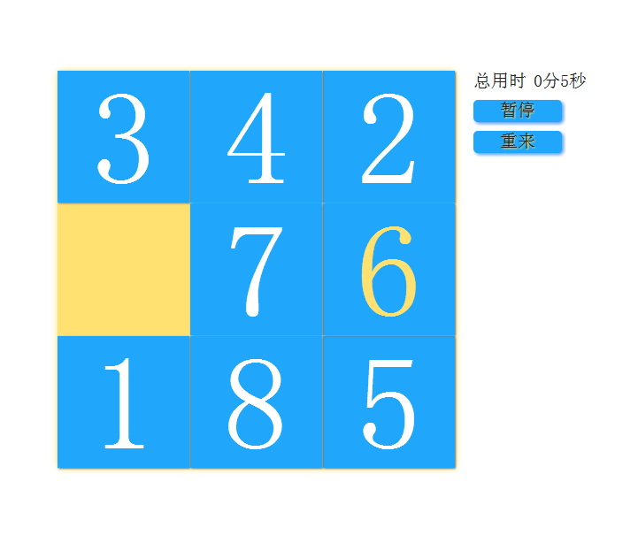
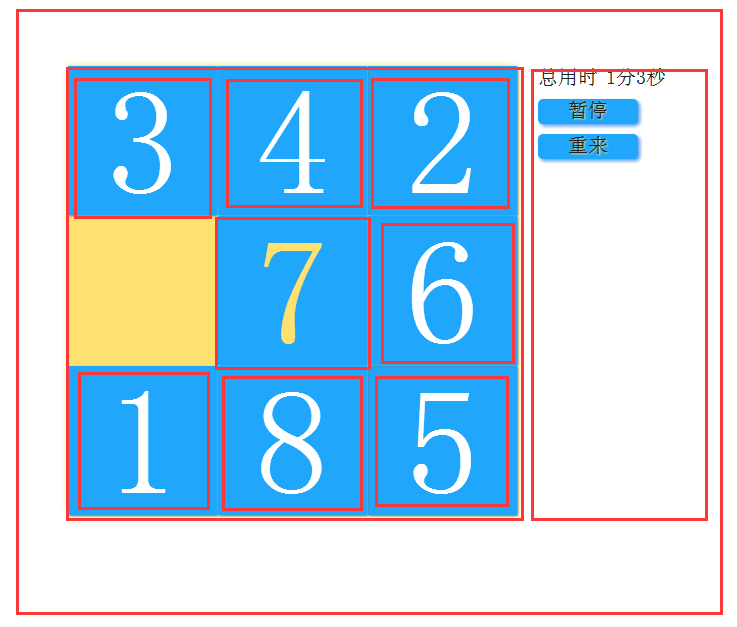

# 第 1 节 HTML5 两步实现拼图游戏

## 一、实验说明

### 1\. 环境介绍

本实验环境采用带桌面的 Ubuntu Linux 环境，实验中会用到桌面上的程序：

*   gedit：非常好用的编辑器，本课程将使用这个编辑器编写代码
*   Firefox：浏览器，可以用在需要前端界面的课程里，只需要打开环境里写的 HTML/JS 页面即可

### 2\. 环境使用

双击打开 gedit 编辑器，按照下面的实验说明编写实验所需的代码及文件，然后保存

实验报告可以在个人主页中查看，其中含有每次实验的截图及笔记，以及每次实验的有效学习时间（指的是在实验桌面内操作的时间，如果没有操作，系统会记录为发呆时间）。这些都是您学习的真实性证明。

本课程中的所有源码可以通过以下方式下载：

```js
http://git.shiyanlou.com/shiyanlou/puzzle 
```

### 3\. 实验介绍

九宫格拼图相信大家都玩过了，看似简单，但其实不简单。特别是当你要做出这个游戏的时候。在以前，写程序是程序员的专利，只有他们才能做出一个软件来。但是现在不同了。科技的进步和经济的发展，使得每个人都可以使用计算机。特别是 HTML5 和 CSS3 的流行，使得制作一个基本的游戏变得简单。

下面我们就来做一个九宫格拼图。它的玩法是移动空格块旁边的方块，使得它们按照方块上面标的数字顺序排好。下面是我们的最终效果。





## 二、设计思路

根据上面的效果图来观察思考，我们要做的就是设置一个大 DIV 用来包裹里面的小 DIV，然后在里面设置 8 个小 DIV，从 1 开始给他们编号。右边设置两个按钮，点击开始的时候开始计时，完成拼图后停止计时，并弹出一个框，提示完成了。重来按钮是当用户觉得当前有难度的时候，点击重来可以重新开始一个新的拼图，把所有方块打乱顺序，然后开始计时。

我们的重点就是当鼠标点击其中一个方块时，要判断当前方块是否可移动，如果可移动，则移动到相应的位置，如不可移动，则不做任何事。当移动完一块后，要判断是否完成拼图。

我们把那个大 DIV 想象成一个盒子，它有九个位置，从 1 开始，到 9 编号，他们的位置和编号都是不会变的。把里面的 8 个小 DIV 想象成 8 个小盒子，给他们设置 top 和 left 就可以控制他们的位置。每个小 DIV 从 1 开始到 8 编号。他们的位置是可以随意改变的。所以当小 DIV 的编号和大 DIV 的编号全部重合时，就完成了拼图。

所以重点就只有一个了。那就是如何判断是否可移动。这个也简单。我们设置一个一维数组变量，用来保存大 DIV 它里面装的小 DIV 的编号。如果大 DIV 没有小方块，也就表面它是空白块，那么就设为 0。如果当前大 DIV 有小 DIV，那就设置为小 DIV 的编号。然后再设置一个二维数组变量，用来保存大 DIV 的可移动编号。也就是保存这个大 DIV 它所有的可去的位置。比如大 DIV 编号为 2 的，它只能向 1 号，3 号，5 号这三个方向移动。又比如 5，它能向 2、4、6、8 这四个方向移动。我们循环遍历这个变量，如果对应的方向它 没有方块，也就是值为 0，那么它就可以往这个方向移动了。

## 三、编写布局 - HTML

在桌面上右键，新建空白文档。新建一个 puzzle.html 文件。然后右键，选择 打开方式 --> gedit。当然你们使用其它编辑软件也是可以的，全凭个人爱好。开始编写布局文件。

**puzzle.html**

```js
<!doctype html>
<html lang="zh-CN">
<head>
    <meta charset="UTF-8">
    <title>Puzzle</title>
    <link rel="stylesheet" type="text/css" href="puzzle.css">
    <script type="text/javascript" src="puzzle.js"></script>
</head>
<body>
    <div id="container">
    <!--最外面的 DIV，用来包含里面的结构-->
        <div id="game">
        <!--游戏区，也就是大 DIV 方块-->
            <div id="d1" onclick="move(1)">1</div>
            <!--小 DIV，也就是 8 个小方块。当点击的时候执行 move()函数，参数是显示的编号，这样我们就知道点击了那个方块-->
            <div id="d2" onclick="move(2)">2</div>
            <div id="d3" onclick="move(3)">3</div>
            <div id="d4" onclick="move(4)">4</div>
            <div id="d5" onclick="move(5)">5</div>
            <div id="d6" onclick="move(6)">6</div>
            <div id="d7" onclick="move(7)">7</div>
            <div id="d8" onclick="move(8)">8</div>
        </div>
        <div id="control">
        <!--游戏控制区-->
            <p>
                <rowspan id="timeText">总用时</rowspan>
                <rowspan id="timer"></rowspan>
            </p>
            <!--显示游戏时间区域-->
            <p>
                <rowspan id="start" onclick="start()">开始</rowspan>
                <rowspan id="reset" onclick="reset()">重来</rowspan>
            </p>
            <!--显示控制按钮区域-->
        </div>
    </div>
</body>
</html> 
```

布局文件就写完了。这里为了简化逻辑，更易编写代码，我们把所有操作都封装了。只要执行 move(2)，就是点击了编号为 2 的小方块，后面的一系列操作都完成了。

## 四、编写样式 - CSS

布局写完了，现在我们为游戏编写样式，使得它更漂亮。在这一步，大家就可以自己自由发挥了，你可以写出自己的风格，让游戏更漂亮。也可以添加更多的元素来装饰你的游戏。但是注意了，游戏 DIV 的大小如果改变了，一定要记得修改 js 代码，稍后我们会详细讲解。

**puzzle.css**

```js
*{
    padding: 0;
    margin: 0;
    border: 0;
}
/* *是通配符，给所有的元素去掉默认样式，因为有的浏览器会默认加上一些样式，这可能会给布局带来问题 */
body{
    width: 100%;
    height: 100%;
}
/* 给 body 设置 100%的高度和宽度，这样就会根据浏览器屏幕大小自动适配 */
#container{
    position: relative;
    width: 620px;
    height: 450px;
    margin: 0 auto;
    margin-top: 100px;
    border-radius: 1px;
}
/* 这是包裹所有元素的 DIV，给他设置 620px 的宽和 450px 的高，这个大小可以设置为更大，但是不能小，至少要能包含里面所有的元素 */
#game{
    position: absolute;
    width: 450px;
    height: 450px;
    border-radius: 5px;
    display: inline-block;
    background-color: #ffe171;
    box-shadow: 0 0 10px #ffe171;
}
/* 这是游戏区的 DIV，这个大小是计算出来的，取决于你的小方块的大小。这里我们设置小方块的大小为 150px 150px，所以这个大小是 150px*3，为 450px */
#game div{
    position: absolute;
    width: 149px;
    height: 149px;
    box-shadow: 1px 1px 2px #777;
    background-color: #20a6fa;
    color: white;
    text-align: center;
    font-size: 150px;
    line-height: 150px;
    cursor: pointer;
    -webkit-transition: 0.3s;/*浏览器前缀，兼容其他浏览器 chrome*/
       -moz-transition: 0.3s;/*firefox*/
        -ms-transition: 0.3s;/*ie*/
         -o-transition: 0.3s;/*opera*/
            transition: 0.3s;
}
/* 这就是小方块的大小了，定位为绝对定位，这样改变位置不会影响其他元素的位置。宽高都是 149px。注意了，我们还设置了 box-shadow:1px 1px 2px #777 ；
它还有边框阴影，所以 149px 加上边框 1px，它的总宽度是 150px 下面的 transition：0.3s 是设置过渡时间，这是 css3 的属性，它会让属性改变呈现过渡动画，所以
当我们改变方块的位置时，它会有一个动画，我们不必自己编写动画函数，这回让你疯狂*/
#game div:hover{
    color: #ffe171;
}
/*给方块设置鼠标悬停动画，当鼠标悬停在元素上面时，会用这里的属性替换上面的属性，移开后又会变为原来的，这里我们是把字体颜色改变*/
#control{
    width: 150px;
    height: 450px;
    display: inline-block;
    float: right;
}
/*控制区，display:inline-block 会让元素呈现块状元素的特性，使得可以改变大小，同时也会具有行内元素的特性，使得不会占据一行空间，float:right 让元素浮动到
右边*/
#control rowspan{
    height: 25px;
    font-size: 20px;
    color: #222;
    margin-top: 10px;
}
/*设置控制区按钮的共同样式*/
#start{
    display: inline-block;
    font-size: 28px;
    width: 100px;
    height: 28px;
    background-color: #20a6fa;
    color: #ffe171;
    text-shadow: 1px 1px 2px #ffe171;
    border-radius: 5px;
    box-shadow: 2px 2px 5px #4c98f5;
    text-align: center;
    cursor: pointer;
}
/*给 start 按钮设置属性。cursor:pointer 属性让鼠标移到元素上面时会显示不同的鼠标形状，pointer 是手型*/
#reset{
    display: inline-block;
    font-size: 28px;
    width: 100px;
    height: 28px;
    background-color: #20a6fa;
    color: #ffe171;
    text-shadow: 1px 1px 2px #ffe171;/*字体阴影*/
    border-radius: 5px;/*圆角属性*/
    box-shadow: 2px 2px 5px #4c98f5;/*盒子阴影*/
    text-align: center;/*文字居中*/
    cursor: pointer;
}
/*给 Reset 按钮设置属性*/
#d1{
    left: 0px;
}
#d2{
    left: 150px;
}
#d3{
    left: 300px;
}
#d4{
    top: 150px;
}
#d5{
    top: 150px;
    left: 150px;
}
#d6{
    top: 150px;
    left: 300px;
}
#d7{
    top: 300px;
}
#d8{
    left: 150px;
    top: 300px;
}
/*这是预先给每个小方块按照顺序排好位置*/ 
```

好了，样式也编写好了。最后再编写一个 js 控制代码，我们的拼图就可以用了。编写样式的时候大家还是先根据我这里的来，等完成了整个游戏，了解游戏逻辑的时候你们再自己发挥想象力去更改样式，不然可能会出现未知的错误。

## 五、控制代码 - JavaScript

同样在桌面新建 puzzle.js 文件。打开文件并编辑代码：

**puzzle.js**

```js
var time=0;
//保存定时时间
var pause=true;
//设置是否暂停标志，true 表示暂停
var set_timer;
//设置定时函数
var d=new Array(10);
//保存大 DIV 当前装的小 DIV 的编号
var d_direct=new Array(
        [0],//为了逻辑更简单，第一个元素我们不用，我们从下标 1 开始使用
        [2,4],//大 DIV 编号为 1 的 DIV 可以去的位置，比如第一块可以去 2,4 号位置
        [1,3,5],
        [2,6],
        [1,5,7],
        [2,4,6,8],
        [3,5,9],
        [4,8],
        [5,7,9],
        [6,8]
    );
//保存大 DIV 编号的可移动位置编号
var d_posXY=new Array(
        [0],//同样，我们不使用第一个元素
        [0,0],//第一个表示 left,第二个表示 top，比如第一块的位置为 let:0px,top:0px
        [150,0],
        [300,0],
        [0,150],
        [150,150],
        [300,150],
        [0,300],
        [150,300],
        [300,300]
    );
//大 DIV 编号的位置
d[1]=1;d[2]=2;d[3]=3;d[4]=4;d[5]=5;d[6]=6;d[7]=7;d[8]=8;d[9]=0;
//默认按照顺序排好，大 DIV 第九块没有，所以为 0，我们用 0 表示空白块

function move(id){
    //移动函数，前面我们已将讲了
    var i=1;
    for(i=1; i<10; ++i){
        if( d[i] == id )
            break;
    }
    //这个 for 循环是找出小 DIV 在大 DIV 中的位置
    var target_d=0;
    //保存小 DIV 可以去的编号，0 表示不能移动
    target_d=whereCanTo(i);
    //用来找出小 DIV 可以去的位置，如果返回 0，表示不能移动，如果可以移动，则返回可以去的位置编号
    if( target_d != 0){
        d[i]=0;
        //把当前的大 DIV 编号设置为 0，因为当前小 DIV 已经移走了，所以当前大 DIV 就没有装小 DIV 了
        d[target_d]=id;
        //把目标大 DIV 设置为被点击的小 DIV 的编号
        document.getElementById("d"+id).style.left=d_posXY[target_d][0]+"px";
        document.getElementById("d"+id).style.top=d_posXY[target_d][1]+"px";
        //最后设置被点击的小 DIV 的位置，把它移到目标大 DIV 的位置
    }
    //如果 target_d 不为 0，则表示可以移动，且 target_d 就是小 DIV 要去的大 DIV 的位置编号
    var finish_flag=true;
    //设置游戏是否完成标志，true 表示完成
    for(var k=1; k<9; ++k){
        if( d[k] != k){
            finish_flag=false;
            break;
            //如果大 DIV 保存的编号和它本身的编号不同，则表示还不是全部按照顺序排的，那么设置为 false，跳出循环，后面不用再判断了，因为只要一个不符，就没完成游戏
        }
    }
    //从 1 开始，把每个大 DIV 保存的编号遍历一下，判断是否完成
    if(finish_flag==true){
        if(!pause)
            start();
        alert("congratulation");
    }
    //如果为 true，则表示游戏完成，如果当前没有暂停，则调用暂停韩式，并且弹出提示框，完成游戏。
    //start()这个函数是开始，暂停一起的函数，如果暂停，调用后会开始，如果开始，则调用后会暂停
}

function whereCanTo(cur_div){
    //判断是否可移动函数，参数是大 DIV 的编号，不是小 DIV 的编号，因为小 DIV 编号跟可以去哪没关系，小 DIV 是会动的
    var j=0;
    var move_flag=false;
    for(j=0; j<d_direct[cur_div].length; ++j){
        //把所有可能去的位置循环遍历一下
        if( d[ d_direct[cur_div][j] ] == 0 ){
            move_flag=true;
            break;
        }
        //如果目标的值为 0，说明目标位置没有装小 DIV，则可以移动，跳出循环
    }
    if(move_flag == true){
        return d_direct[cur_div][j];
    }else{
        return 0;
    }
    //可以移动，则返回目标位置的编号，否则返回 0，表示不可移动
}

//定时函数，每一秒执行一次
function timer(){
    time+=1;//一秒钟加一，单位是秒
    var min=parseInt(time/60);//把秒转换为分钟，一分钟 60 秒，取商就是分钟
    var sec=time%60;//取余就是秒
    document.getElementById("timer").innerHTML=min+"分"+sec+"秒";//然后把时间更新显示出来
}

//开始暂停函数
function start(){
    if(pause){
        document.getElementById("start").innerHTML="暂停";//把按钮文字设置为暂停
        pause=false;//暂停表示设置为 false
        set_timer=setInterval(timer,1000);//启动定时
        //如果当前是暂停，则开始
    }else{
        document.getElementById("start").innerHTML="开始";
        pause=true;
        clearInterval(set_timer);
    }
}

//重置函数
function reset(){
    time=0;//把时间设置为 0
    random_d();//把方块随机打乱函数
    if(pause)//如果暂停，则开始计时
        start();
}

//随机打乱方块函数，我们的思路是从第九块开始，随机生成一个数，然后他们两块对调一下
function random_d(){
    for(var i=9; i>1; --i){
        var to=parseInt(Math.random()*(i-1)+1);//产生随机数，范围为 1 到 i，不能超出范围，因为没这个 id 的 DIV
        if(d[i]!=0){
            document.getElementById("d"+d[i]).style.left=d_posXY[to][0]+"px";
            document.getElementById("d"+d[i]).style.top=d_posXY[to][1]+"px";
        }
        //把当前的 DIV 位置设置为随机产生的 DIV 的位置
        if(d[to]!=0){
            document.getElementById("d"+d[to]).style.left=d_posXY[i][0]+"px";
            document.getElementById("d"+d[to]).style.top=d_posXY[i][1]+"px";
        }
        //把随机产生的 DIV 的位置设置为当前的 DIV 的位置
        var tem=d[to];
        d[to]=d[i];
        d[i]=tem;
        //然后把它们两个的 DIV 保存的编号对调一下
    }
}

//初始化函数，页面加载的时候调用重置函数，重新开始
window.onload=function(){
    reset();
} 
```

好了，所有代码都已经编写完成了。现在点击桌面上的 puzzle.html 文件，右键用火狐浏览器打开，就能看到效果了。点击上面的方块就可以移动。

## 五、作业思考

这里说明一下，因为实验中使用的随机打乱方块的算法非常简单，但是存在 bug，有 50% 的概率生成的顺序是无法复原的，这个时候就只能点击重新开始。

因此思考如何实现更健全的算法，让其可以完全复原。

提供一种思路：按照人的方式随机去移动方块，而移动方块的代码已经写好了，直接调用就可以，所以只要自己编写一个函数，让方块移动几十步就可以打乱。而这种方式是一定可以拼回去的。

**如果你在学习过程中遇到问题，或是有更好的建议，欢迎和我取得联系，大家一起进步。我的地址是：1260022720@qq.com 请注明@实验楼的朋友**