# 第 1 节 简单的验证码图片生成

## 一、实验简介

验证码（CAPTCHA）是“Completely Automated Public Turing test to tell Computers and Humans Apart”（全自动区分计算机和人类的图灵测试）的缩写，是一种区分用户是计算机还是人的公共全自动程序。

它可以防止：恶意破解密码、刷票、论坛灌水，有效防止某个黑客对某一个特定注册用户用特定程序暴力破解方式进行不断的登陆尝试，实际上用验证码是现在很多网站通行的方式，我们利用比较简易的方式实现了这个功能。这个问题可以由计算机生成并评判，但是必须只有人类才能解答。由于计算机无法解答 CAPTCHA 的问题，所以回答出问题的用户就可以被认为是人类。

本课程就将带你学习如何通过 Servlet 来实现生成简单的验证码图片。

### 1.1 知识点

*   Servlet 技术
*   Random 函数
*   StringBuffer 字符串缓冲器
*   OutputStream 字节流输出
*   HTML 图片显示

### 1.2 效果截图

实验效果如图。

例 1：


例 2：


例 3：


## 二、 代码编写

### 2.1 创建项目

请打开 eclipse ，新建一个 `Dynamic Web Project` 如下：

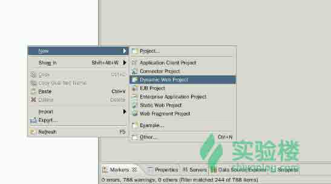

命名为 `Captcha` ,

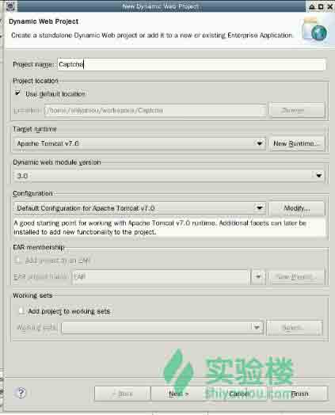

注意勾选自动生成 xml 文件,

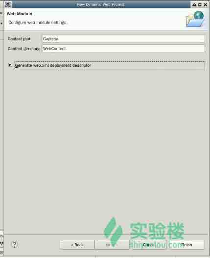

### 2.2 获取十六进制字符串文件

打开桌面的 Xfce ，输入如下命令，获取 16 进制字符串文件：

```java
wget http://labfile.oss.aliyuncs.com/courses/588/HexString.txt 
```

### 2.3 Captcha 类

Captcha 类是实现验证码的核心类之一，在这个文件里需要设置显示验证码图片的高度、宽度、字符个数、线条等等。

#### 2.3.1 Random 函数 （ `Java.util.Random()` ）

其中使用了生成随机数的函数 Random 。首先简单了解一下这个函数的方法。

*   `boolean nextBoolean()`：返回下一个伪随机数，它是取自此随机数生成器序列的均匀分布的 boolean 值。
*   `double nextDouble()`：返回下一个伪随机数，它是取自此随机数生成器序列的、在 0.0 和 1.0 之间均匀分布的 double 值。
*   `float nextFloat()`：返回下一个伪随机数，它是取自此随机数生成器序列的、在 0.0 和 1.0 之间均匀分布 float 值。
*   `double nextGaussian()`：返回下一个伪随机数，它是取自此随机数生成器序列的、呈高斯（“正态”）分布的 double 值，其平均值是 0.0 标准差是 1.0。
*   `int nextInt()`：返回下一个伪随机数，它是此随机数生成器的序列中均匀分布的 int 值。
*   `int nextInt(int n)`：返回一个伪随机数，该方法的作用是生成一个随机的 int 值，该值介于[0,n)的区间，也就是 0 到 n 之间的随机 int 值，包含 0 而不包含 n。
*   `long nextLong()`：返回下一个伪随机数，它是取自此随机数生成器序列的均匀分布的 long 值。

#### 2.3.2 StringBuffer

String 和 StringBuffer 他们都可以存储和操作字符串，即包含多个字符的字符串数据。

String 类是字符串常量，是不可更改的常量。而 StringBuffer 是字符串变量，它的对象是可以扩充和修改的。

StringBuffer 类的构造函数 `public StringBuffer()` 创建一个空的 StringBuffer 类的对象。 `public StringBuffer( int length )` 创建一个长度为参数 length 的 StringBuffer 类的对象。

注意：如果参数 length 小于 0 ，将触发 NegativeArraySizeException 异常。 `public StringBuffer( String str )` 用一个已存在的字符串常量来创建 StringBuffer 类的对象。

StringBuffer 的函数主要有：

*   `StringBuffer append(boolean b)`： 向字符串缓冲区“追加”元素，但是，这个“元素”参数可以是布尔量、字符、字符数组、双精度数、浮点数、整型数、长整型数对象类型的字符串、字符串和 StringBuffer 类等。如果添加的字符超出了字符串缓冲区的长度，Java 将自动进行扩充。
*   `char charAt(int index)` ：在当前 StringBuffer 对象中取索引号为 index 的字符。第一个字符的索引为“0”。
*   `StringBuffer delete(int start, int end)`： 删除当前 StringBuffer 对象中以索引号 start 开始，到 end 结束的子串。
*   `void getChars(int srcBegin, int srcEnd, char[] dst, int dstBegin)`： 从当前 StringBuffer 对象的索引号 srcBegin 开始，到 srcEnd 结束的子串，赋值到字符数组 dst 中，并且从 dst 的索引号 dstBegin 开始。
*   `int indexOf(String str)`： 返回当前 StringBuffer 对象中，第一个满足 str 子串的位置。
*   `int length()`： 返回当前 StringBuffer 对象（字符缓冲区）中，字符串的长度。注意：此方法与 capacity() 不同。

#### 2.3.3 OutputStream 字节流输出

OutputStream 是所有表示位输出流的类之父类，它是一个抽象类。

子类要重新定义其中所定义的抽象方法，OutputStream 是用于将数据写入目的地的抽象表示。例如 System 中的标准输出流对象 out 其类型是 `java.io.PrintStream` ，这个类是 `OutputStream` 的子类 (`java.io.FilterOutputStream` 继承 OutputStream， PrintStream 再继承 FilterOutputStream )。

在程序开始之后，out 流对象就会开启，可以通过 out 来将数据写至目的地装置，这个装置通常是屏幕显示或用户定义的输出装置。

本次我们用到的方法有：

*   `write(int)` 写一个字节到流中
*   `write(byte[])` 将数组中的内容写到流中
*   `write(byte[],int off,int len)` 将数组中从 off 指定的位置开始 len 长度的数据写到流中
*   `close()` 关闭流
*   `flush()` 将缓冲区中的数据强制输出

#### 2.3.4 编写 Captcha 类

新建一个类，包路径为： `com.shiyanlou.java` ,如下：

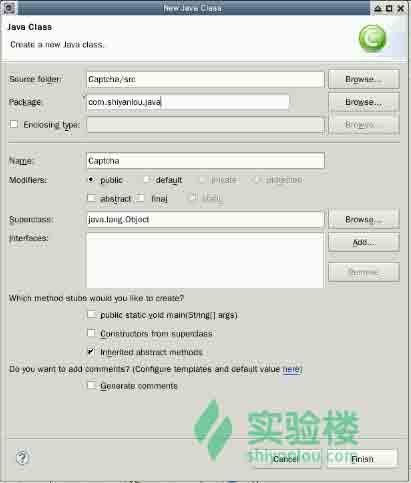

```java
package com.shiyanlou.java;

import java.awt.Color;  
import java.awt.Font;  
import java.awt.Graphics2D;  
import java.awt.image.BufferedImage;  
import java.io.BufferedReader;
import java.io.ByteArrayInputStream;  
import java.io.File;
import java.io.FileInputStream;
import java.io.FileOutputStream;  
import java.io.FileReader;
import java.io.IOException;  
import java.io.InputStream;
import java.io.OutputStream;  
import java.util.Random;  

import javax.imageio.ImageIO;  

/** 
 * 验证码生成器 
 *  
 */  
public class Captcha {  
    // 设置图片宽度。  
    private int width = 240;  
    // 设置图片高度。  
    private int height = 100;  
    // 设置验证码字符个数  
    private int codeNum = 4;  
    // 设置验证码干扰线数  
    private int lineNum = 20;  
    // 设置验证码字符串
    private String code = null;  
    // 设置验证码图片缓存 
    private BufferedImage buffImg = null;  

    private char[] codeQue = { 'A', 'B', 'C', 'D', 'E', 'F', 'G', 'H',  
            'I', 'J', 'K', 'M', 'N', 'P', 'Q', 'R', 'S', 'T', 'U', 'V', 'W',  
            'X', 'Y', 'Z', '2', '3', '4', '5', '6', '7', '8', '9' };  

    // 生成随机数  
    private Random random = new Random();  

    // 无参构造方法
    public Captcha() {  
        this.createCode();  
    }  

    /** 
     * 有图片宽高的构造方法  
     */  
    public Captcha(int width, int height) {  
        this.width = width;  
        this.height = height;  
        this.createCode();  
    }  

    /** 
     * 有图片宽高、字符个数、干扰线条数构造方法  
     */  
    public Captcha(int width, int height, int codeNum, int lineNum) {  
        this.width = width;  
        this.height = height;  
        this.codeNum = codeNum;  
        this.lineNum = lineNum;  
        this.createCode();  
    }  

    public void createCode() {  
        int codeX = 0;  
        int fontHeight = 0;  
        fontHeight = height - 20;// 字体的高度  
        codeX = width / (codeNum+3);// 每个字符的宽度  

        // 图像 buffer  
        buffImg = new BufferedImage(width, height, BufferedImage.TYPE_INT_RGB);  
        Graphics2D g = buffImg.createGraphics();  

        // 图像背景填充为白色  
        g.setColor(Color.WHITE);  
        g.fillRect(0, 0, width, height);  

        // 创建字体  
        ImgFontByte imgFont = new ImgFontByte();  
        Font font = imgFont.getFont(fontHeight);  
        g.setFont(font);  

        // 绘制干扰线，对此处的参数公式进行修改，将会得到不同的验证码样式
        for (int i = 0; i < lineNum; i++) {  
            int xP = getRandomNumber(width/2);  
            int yP = getRandomNumber(height/2);  
            int xD = xP + getRandomNumber(width * 10);  
            int yD = yP + getRandomNumber(height * 10);  
            g.setColor(getRandomColor());  
            g.drawLine(xP, yP, xD, yD);  
        }  

        StringBuffer randomCode = new StringBuffer();  
        // 在字符队列中，产生随机的验证码字符  
        for (int i = 0; i < codeNum; i++) {  
            String strRand = String.valueOf(codeQue[random  
                    .nextInt(codeQue.length)]);  
            // 设置字体颜色为随机获取
            g.setColor(getRandomColor());  
            // 设置字体位置尽量在图片中间，并且有聚集
            g.drawString(strRand, (i + 1) * codeX,  
                    getRandomNumber(height / 2) + 50);  
            randomCode.append(strRand);  
        }  
        code = randomCode.toString();  
    }  

    /*
    * 获取随机颜色
    */  
    private Color getRandomColor() {  
        int r = getRandomNumber(255);  
        int g = getRandomNumber(255);  
        int b = getRandomNumber(255);  
        return new Color(r, g, b);  
    }  

    /* 
    * 获取随机数 
    */  
    private int getRandomNumber(int number) {  
        return random.nextInt(number);  
    }  

    public void write(String path) throws IOException {  
        OutputStream sos = new FileOutputStream(path);  
        this.write(sos);  
    }  

    public void write(OutputStream sos) throws IOException {  
        ImageIO.write(buffImg, "png", sos);  
        sos.close();  
    }  

    public BufferedImage getBuffImg() {  
        return buffImg;  
    }  

    public String getCode() {  
        return code;  
    }  

    /*
    * 字体样式类 
    */  
    class ImgFontByte {  
        public Font getFont(int fontHeight) {  
            try {  
                Font baseFont = Font.createFont(Font.TRUETYPE_FONT,  
                        new ByteArrayInputStream(hex2byte(getFontByteStr())));  
                return baseFont.deriveFont(Font.PLAIN, fontHeight);  
            } catch (Exception e) {  
                return new Font("Arial", Font.PLAIN, fontHeight);  
            }  
        }  

        private byte[] hex2byte(String str) {  
            if (str == null)  
                return null;  
            str = str.trim();  
            int len = str.length();  
          if (len == 0 || len % 2 == 1)  
                return null;  

            byte[] b = new byte[len / 2];  
            try {  
                for (int i = 0; i < str.length(); i += 2) {  
                    b[i / 2] = (byte) Integer.decode(  
                            "0x" + str.substring(i, i + 2)).intValue();  
                }  
                return b;  
            } catch (Exception e) {  
                return null;  
            }  
        }  

        // 字体文件的十六进制字符串,使用文件流读入之前获取到的 HexString.txt 文件的内容。
        private String getFontByteStr() {  
            String pathName = "/home/shiyanlou/HexString.txt";
            File file = new File(pathName);
            String tempStr =null;
            BufferedReader reader = null;
             try {
                 reader = new BufferedReader(new FileReader(file));
                 int line = 1;
                 tempStr = reader.readLine();
                 reader.close();
             } catch (IOException e) {
                 e.printStackTrace();
             } 
            return tempStr;
        }  
    }  
} 
```

### 2.4 CaptchaServlet

#### 2.4.1 Servlet 简介

> Servlet（Server Applet），全称 Java Servlet 。它是用 Java 编写的服务器端程序。其主要功能在于交互式地浏览和修改数据，生成动态 Web 内容。狭义的 Servlet 是指 Java 语言实现的一个接口，广义的 Servlet 是指任何实现了这个 Servlet 接口的类，一般情况下，人们将 Servlet 理解为后者。 Servlet 运行于支持 Java 的应用服务器中。从原理上讲，Servlet 可以响应任何类型的请求，但绝大多数情况下 Servlet 只用来扩展基于 HTTP 协议的 Web 服务器。

#### 2.4.2 主要编程接口

HTTPServlet 使用一个 HTML 表单来发送和接收数据。

要创建一个 HTTPServlet，请扩展 HttpServlet 类， 该类是用专门的方法来处理 HTML 表单的 GenericServlet 的一个子类。

HTML 表单是由 `<form>` 和 `</form>` 标记定义的.表单中典型地包含输入字段（如文本输入字段、复选框、单选按钮和选择列表）和用于提交数据的按钮。

当提交信息时，它们还指定服务器应执行哪一个 Servlet（或其它的程序）。 HttpServlet 类包含 `init()`、`destroy()`、`service()` 等方法。其中 `init()` 和 `destroy()` 方法是继承的。

** 1\. `init()` 方法 **

在 Servlet 的生命期中，仅执行一次 init() 方法。它是在服务器装入 Servlet 时执行的。 可以配置服务器，以在启动服务器或客户机首次访问 Servlet 时装入 Servlet。 无论有多少客户机访问 Servlet，都不会重复执行 init() 。

缺省的 init() 方法通常是符合要求的，但也可以用定制 init() 方法来覆盖它，典型的是管理服务器端资源。 例如，可能编写一个定制 init() 来只用于一次装入 GIF 图像，改进 Servlet 返回 GIF 图像和含有多个客户机请求的性能。

另一个示例是初始化数据库连接。缺省的 init() 方法设置了 Servlet 的初始化参数，并用它的 ServletConfig 对象参数来启动配置， 因此所有覆盖 init() 方法的 Servlet 应调用 super.init() 以确保仍然执行这些任务。

在调用 service() 方法之前，应确保已完成了 init() 方法。

** 2\. `doGet()` 方法 **

当一个客户通过 HTML 表单发出一个 HTTP GET 请求或直接请求一个 URL 时，doGet() 方法被调用。与 GET 请求相关的参数添加到 URL 的后面，并与这个请求一起发送。当不会修改服务器端的数据时，应该使用 doGet() 方法。

** 3\. `doPost()` 方法 ** 当一个客户通过 HTML 表单发出一个 HTTP POST 请求时，doPost() 方法被调用。与 POST 请求相关的参数作为一个单独的 HTTP 请求从浏览器发送到服务器。当需要修改服务器端的数据时，应该使用 doPost() 方法。

#### 2.4.3 编写 CaptchaServlet

首先创建一个 Servlet ，如图：

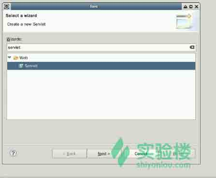

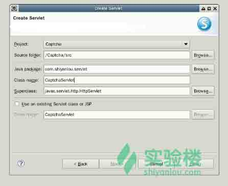

新建一个 captcha 对象，调用文件流输出方法，指定禁止图像缓存，获取到图片，如下：

```java
package com.shiyanlou.servlet;  

import java.io.IOException;  
import javax.servlet.ServletException;  
import javax.servlet.http.Cookie;  
import javax.servlet.http.HttpServlet;  
import javax.servlet.http.HttpServletRequest;  
import javax.servlet.http.HttpServletResponse;  

import com.shiyanlou.java.*;

public class CaptchaServlet extends HttpServlet {  

    @Override  
    protected void doGet(HttpServletRequest reqeust,  
            HttpServletResponse response) throws ServletException, IOException {  
        this.doPost(reqeust, response);  
    }  

    protected void doPost(HttpServletRequest reqeust,  
            HttpServletResponse response) throws ServletException, IOException {  

        // 设置图片格式  
        response.setContentType("image/jpeg");  

        // 禁止图像缓存  
        response.setHeader("Pragma", "no-cache");  
        response.setHeader("Cache-Control", "no-cache");  
        response.setDateHeader("Expires", 0);  //在代理服务器端防止缓冲

        Captcha captcha = new Captcha();  
        Cookie cookie = new Cookie("captcha", captcha.getCode());  
        cookie.setMaxAge(1800);  //设置 cookie 有效时间，单位 秒
        response.addCookie(cookie);  
        captcha.write(response.getOutputStream());  
    }  
} 
```

### 2.5 web.xml

配置好了 servlet 之后，会在 web.xml 内自动生成对应 servlet 的配置信息，检查并修改 web.xml 文件，如下：

```java
<?xml version="1.0" encoding="UTF-8"?>
<web-app   xsi:schemaLocation="http://java.sun.com/xml/ns/javaee http://java.sun.com/xml/ns/javaee/web-app_2_5.xsd" version="2.5">
<!-- 配置 Servlet -->
  <servlet>
    <servlet-name>CaptchaServlet</servlet-name>
    <servlet-class>com.shiyanlou.servlet.CaptchaServlet</servlet-class>
  </servlet>

  <servlet-mapping>
    <servlet-name>CaptchaServlet</servlet-name>
    <url-pattern>/servlet/CaptchaServlet</url-pattern>
  </servlet-mapping>
  <welcome-file-list>
    <welcome-file>Captcha.jsp</welcome-file>
  </welcome-file-list>
</web-app> 
```

### 2.6 Captcha.html

新建一个 HTML 页面，调用创建好的 servlet 方法，内容如下：

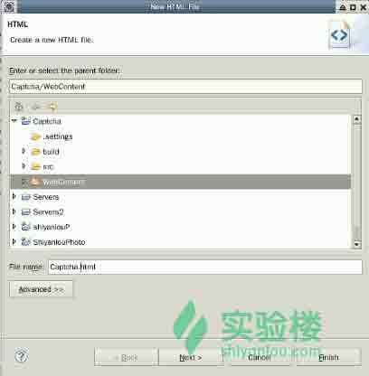

```java
<!DOCTYPE HTML PUBLIC "-//W3C//DTD HTML 4.01 Transitional//EN">  
<html>  
  <head>  
    <title>Captcha</title>  
  </head>  
  <body>  
    <!-- 调用 servlet-->
    <form action="checkServlet" method="post">  
       <br/>  
    </form>  
  </body>  
</html> 
```

## 三、 运行测试

将项目部署到服务器，步骤如图：

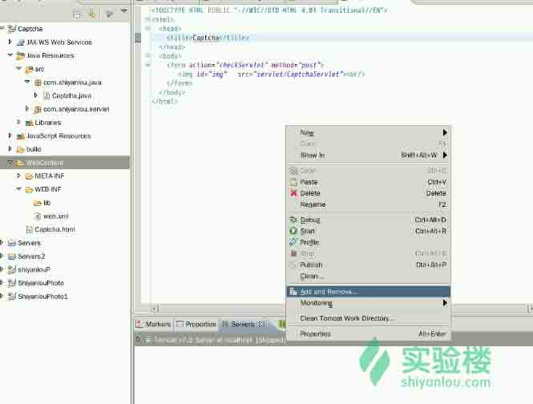

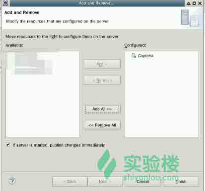

启动服务：

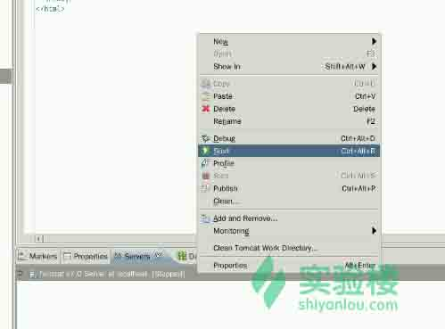

在浏览器输入地址： `localhost:8080/Captcha/Captcha.html` ，运行结果如图：

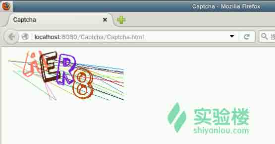

## 四、 小结

本实验通过 Java Servlet 技术，实现了简单的验证码。

之后再做登陆实验的时候，我们就可以添加上验证码图片，使我们的模拟流程更贴近实际。

## 参考文档

*   [百度百科 Servlet](http://baike.baidu.com/link?url=oQ_JwzI1VMwZqisIwdiltbYh-MZrUUH8a3sfErQqIori_WPRGj06GG9a7ep_n2gFzeyyZv6WJvhTZ7873MEiIq)
*   [百度百科 StringBuffer](http://baike.baidu.com/view/1486261.htm)
*   [百度百科 OutputStream](http://baike.baidu.com/view/1860888.htm)
*   [shadowsick](http://blog.csdn.net/shadowsick/article/details/17308565)