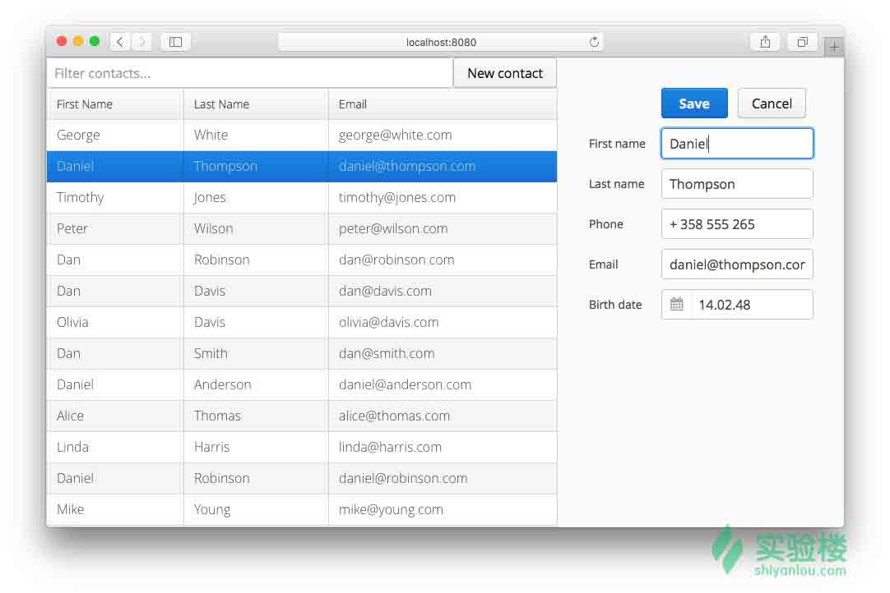

# 第 1 节 Java 实现通讯录

## 一、实验简介

本节实验中，我们将采用简单的 MVC 框架开发一个 Java Web 通讯录应用，学习并实践如何使用 Vaadin 实现界面，及使用 Eclipse 进行 Java Web 开发的基本流程。

### 1.1 实验预定目标

实现对现有联系人信息的显示，实现增加新的联系人。

本次实验实现的项目效果图如下：



### 1.2 知识点

通过本次实验，将学习并实践以下知识点：

1.  Java Web 开发基本流程
2.  Eclipse 开发 Web 应用的操作方式
3.  Vaadin Web 框架基本用法
4.  Java 容器
5.  Java 同步
6.  异常处理

### 1.3 实验流程

*   基本知识了解
*   实验环境布置
*   代码编写
*   配置服务

## 二、基本知识了解

### 2.1 vaadin

> Vaadin 核心内容是 Apache2.0 许可一套专为企业应用程序的 Web 组件。该集合包含如数据网格，组合框和日期选择器的元素。Vaadin 还提供多种各样的 UI 组建，例如按钮、表格、树形列表等等，每个组件都具有事件、侦听器、数据绑定和业务逻辑等功能。详情见`参考文档`。


>多数情况下，vaadin 与 Maven 共同使用，通过在 Maven 的 pom.xml 中进行相应的配置，Maven 会自动下载需要的包。在这个实例中，我们不使用 Maven，直接把 vaadin 需要的 jar 包添加进项目中。

## 三、实验环境布置

### 3.1 创建项目

打开 eclipse，`New`，选择 web 下面的`Dynamic Web Project`，命名为`AddressBookWeb`，其他设置保持不变，`Next`


生成 src 文件夹`Next`,勾选`Generate web.xml deployment descriptor`生成`web.xml`文件


点击`Finish`。

### 3.2 获取依赖 jar 包

打开桌面的 Xfce 终端，输入：

```java
wget http://labfile.oss.aliyuncs.com/courses/564/Dependencies.tar.gz 
```

获取 jar 包的压缩文件。


继续输入：

```java
tar -zxvf Dependencies.tar.gz 
```

解压获取到的压缩文件。


默认下载到`/home/shiyanlou`，就地解压形成文件夹，Dependencies。

### 3.3 下载 Tomcat 8

本实例必须在 Tomcat 8 上运行。 在 Xfce 终端输入：

```java
wget http://labfile.oss.aliyuncs.com/courses/564/apache-tomcat-8.0.36.zip 
```


继续输入：

```java
unzip apache-tomcat-8.0.36.zip 
```

解压得到的 tomcat8,。默认路径仍为`/home/shiyanlou`，生成 apache-tomcat-8.0.36 文件夹。

### 3.4 在 Eclipse 中配置 Tomcat 8

在 Eclipse 中选择`Preferences`，从右侧选择`Sever`，选择`Run Environment`


`Add`，`Apache Tomcat v8.0，Next`，在`Tomcat installation directory`中点击`Browse`，选择 tomcat8 的安装路径`Finish`。


继续在`Server Run Environment`中选择`Apache Tomcat 7`，点击右侧`remove`。

### 3.5 导入 jar 包

将之前解压好的`Dependencies`文件夹下的所有 jar 包，复制到项目`WebContent/WEB-INF/lib`文件夹下。


选中所有导入的项目，在项目上右键，`Build Path`->`Add to path`


查看项目下的`Java Resources/Libraries`，可发现所有 jar 包都已经导入。

## 四、代码编写

### 4.1 后端代码编写

#### 4.1.1 Contact.java

右键项目`Java Resources/src`， `New`，`Java Class`。`Package:com.shiyanlou.java.backend`， `Project name:Contact`，`Finish`。

*   一个简单的 DTO 地址簿对象。是通常持久保存在数据库中，也可以很容易地转换为不同格式，如 JSON 序列化和可复制的 Java 对象。

```java
 package com.vaadin.tutorial.addressbook.backend;
    import org.apache.commons.beanutils.BeanUtils;
    import java.io.Serializable;
    import java.util.Date;    
    public class Contact implements Serializable, Cloneable {
    private Long id;

    private String firstName = "";
    private String lastName = "";
    private String phone = "";
    private String email = "";
    private Date birthDate;

    public Long getId() {
        return id;
    }

    public void setId(Long id) {
        this.id = id;
    }

    public String getFirstName() {
        return firstName;
    }

    public void setFirstName(String firstName) {
        this.firstName = firstName;
    }

    public String getLastName() {
        return lastName;
    }

    public void setLastName(String lastName) {
        this.lastName = lastName;
    }

    public String getPhone() {
        return phone;
    }

    public void setPhone(String phone) {
        this.phone = phone;
    }

    public String getEmail() {
        return email;
    }

    public void setEmail(String email) {
        this.email = email;
    }

    public Date getBirthDate() {
        return birthDate;
    }

    public void setBirthDate(Date birthDate) {
        this.birthDate = birthDate;
    }

    @Override
    public Contact clone() throws CloneNotSupportedException {
        try {
            return (Contact) BeanUtils.cloneBean(this);
        } catch (Exception ex) {
            throw new CloneNotSupportedException();
        }
    }
        @Override
    public String toString() {
        return "Contact{" + "id=" + id + ", firstName=" + firstName
                + ", lastName=" + lastName + ", phone=" + phone + ", mail="
                   + email + ", birthDate=" + birthDate + '}';
          } 
     } 
```

#### 4.1.2 ContactService.java

右键项目`Java Resources/src`， `New`，`Java Class`。`Package:com.shiyanlou.java.backend`， `Project name:ContactService`，`Finish`。

*   单独的 Java 服务类。后端执行地址簿应用程序，用“分离的实体”模拟 DAO。通常，这些东西在 Java EE 或 Spring 后端服务提供。

```java
 package com.vaadin.tutorial.addressbook.backend;
    import org.apache.commons.beanutils.BeanUtils;
    import java.util.*;
    import java.util.logging.Level;
    import java.util.logging.Logger;
    public class ContactService {
    // 通过随机组合的名字和姓氏创建虚拟数据
    static String[] fnames = { "Peter", "Alice", "John", "Mike", "Olivia",
    "Nina", "Alex", "Rita", "Dan", "Umberto", "Henrik", "Rene", "Lisa",
    "Linda", "Timothy", "Daniel", "Brian", "George", "Scott",
    "Jennifer" };
    static String[] lnames = { "Smith", "Johnson", "Williams", "Jones",
    "Brown", "Davis", "Miller", "Wilson", "Moore", "Taylor",
    "Anderson", "Thomas", "Jackson", "White", "Harris", "Martin",
    "Thompson", "Young", "King", "Robinson" };

    private static ContactService instance;
    //随机生成 100 个完整的联系人信息
    public static ContactService createDemoService() {
    if (instance == null) {

    final ContactService contactService = new ContactService();

    Random r = new Random(0);
    Calendar cal = Calendar.getInstance();
    for (int i = 0; i < 100; i++) {
    Contact contact = new Contact();
    contact.setFirstName(fnames[r.nextInt(fnames.length)]);
    contact.setLastName(lnames[r.nextInt(fnames.length)]);
    contact.setEmail(contact.getFirstName().toLowerCase() + "@"
    +contact.getLastName().toLowerCase() + ".com");
    contact.setPhone("+ 358 555 " + (100 + r.nextInt(900)));
    cal.set(1930 + r.nextInt(70),
    r.nextInt(11), r.nextInt(28));
    contact.setBirthDate(cal.getTime());
    contactService.save(contact);
    }
    instance = contactService;
    }

    return instance;
    }

    private HashMap<Long, Contact> contacts = new HashMap<>();
    private long nextId = 0;

    //模拟 DAO 的查找方法
    public synchronized List<Contact> findAll(String stringFilter) {
    ArrayList arrayList = new ArrayList();
    for (Contact contact : contacts.values()) {
    try {
    boolean passesFilter = (stringFilter == null || stringFilter.isEmpty())
    || contact.toString().toLowerCase()
    .contains(stringFilter.toLowerCase());
    if (passesFilter) {
    arrayList.add(contact.clone());
    }
    } catch (CloneNotSupportedException ex) {
    Logger.getLogger(ContactService.class.getName()).log(
    Level.SEVERE, null, ex);
    }
    }

    Collections.sort(arrayList, new Comparator<Contact>() {

    @Override
    public int compare(Contact o1, Contact o2) {
    return (int) (o2.getId() - o1.getId());
    }
    });
    return arrayList;
    }

    public synchronized long count() {
    return contacts.size();
    }
    //模拟 DAO 删除方法
    public synchronized void delete(Contact value) {
    contacts.remove(value.getId());
    }
    //模拟 DAO 保存方法
    public synchronized void save(Contact entry) {
    if (entry.getId() == null) {
    entry.setId(nextId++);
    }
    try {
    entry = (Contact) BeanUtils.cloneBean(entry);
    } catch (Exception ex) {
    throw new RuntimeException(ex);
    }
    contacts.put(entry.getId(), entry);
        }   
    } 
```

### 4.2 前端代码编写

#### 4.2.1 AddressbookUI.java

右键项目`Java Resources/src`， `New`，`Java Class`。`Package:com.shiyanlou.java`， `Project name:AddressbookUI`，`Finish`。

*   用户界面。通过扩展 UI 类定义 Vaadin 生成的网页上显示的用户界面。默认情况下，加载页面时会自动创建一个新的 UI 实例。为了在重复使用的情况下相同，加@PreserveOnRefresh。

```java
 package com.vaadin.tutorial.addressbook;
    import com.vaadin.annotations.Theme;
    import com.vaadin.annotations.Title;
    import com.vaadin.annotations.VaadinServletConfiguration;
    import com.vaadin.data.util.BeanItemContainer;
    import com.vaadin.server.VaadinRequest;
    import com.vaadin.server.VaadinServlet;
    import com.vaadin.tutorial.addressbook.backend.Contact;
    import com.vaadin.tutorial.addressbook.backend.ContactService;
    import com.vaadin.ui.*;
    import javax.servlet.annotation.WebServlet;

    @Title("Addressbook")
    @Theme("valo")
    public class AddressbookUI extends UI {
        /*
        *Vaadin 的用户界面组件的 Java 对象封装和处理跨浏览器支持和客户端服务器通信。
        *缺省 Vaadin 组件是在 com.vaadin.ui 包，有超过 500 更 vaadin.com/directory。
         */
        TextField filter = new TextField();//可以绑定到任何绑定属性的文本编辑器组件。文本编辑器支持多行和单行模式，默认为单行模式。
        Grid contactList = new Grid();//用于显示表格数据的网格组件。
        Button newContact = new Button("New contact");//按钮
        //联系表 是一个自定义组件类的一个实例
        ContactForm contactForm = new ContactForm();
        //ContactService 是在内存中模拟 DAO 模仿真实世界的数据源。
        //例如，作为 EJB 或基于 Spring 的数据服务通常实现的。
        ContactService service = ContactService.createDemoService();
        /*
         *这是执行以初始化和配置可见的用户界面的入口点的方法。
         *执行的每一个浏览器重装,因为要为每个加载的网页创建一个新的实例。
         *com.vaadin.server.VaadinRequest：一个通用的请求到服务器，
         *包装一个更具体的请求类型，例如 HttpServletRequest 的或 PortletRequest 的。
         *初始化通用的请求到服务器
         */
        @Override
        protected void init(VaadinRequest request) {
        configureComponents();
        buildLayout();
        }
        private void configureComponents() {
         /*同步事件处理。
         *收到关于服务器端用户交互事件。所以可以同步处理这些事件。
         *Vaadin 自动发送只有网页所需的更改，而无需加载了新的一页。（ajax 局部刷新）
         *拓展连接：http://www.ibm.com/developerworks/cn/web/1101_wangyc_vaadin2/
         */
        newContact.addClickListener(e -> contactForm.edit(new Contact()));//添加对 contactForm 联系表的点击编辑的监听

        filter.setInputPrompt("Filter contacts...");//输入提示
        filter.addTextChangeListener(e -> refreshContacts(e.getText()));//添加文本输入监听器

        contactList.setContainerDataSource(new BeanItemContainer<>(Contact.class));//设置 Contact 为数据源容器
        contactList.setColumnOrder("firstName", "lastName", "email");//设置列顺序
        contactList.removeColumn("id");//删除 id 列
        contactList.removeColumn("birthDate");//删除生日列
        contactList.removeColumn("phone");//删除电话列
        contactList.setSelectionMode(Grid.SelectionMode.SINGLE);
        contactList.addSelectionListener(e
        -> contactForm.edit((Contact) contactList.getSelectedRow()));//
        refreshContacts();
        }
        /*
         *布局是包含其他组件的组件。
         *水平布局包含文本字段和按钮。它是包裹着一个网格组成的垂直布局，用于在屏幕的左侧。
         */
        private void buildLayout() {
        HorizontalLayout actions = new HorizontalLayout(filter, newContact);//右侧为按钮
        actions.setWidth("100%");
        filter.setWidth("100%");
        actions.setExpandRatio(filter, 1);//扩展比例

        VerticalLayout left = new VerticalLayout(actions, contactList);//左侧为联系人列表
        left.setSizeFull();
        contactList.setSizeFull();
        left.setExpandRatio(contactList, 1);

        HorizontalLayout mainLayout = new HorizontalLayout(left, contactForm);
        mainLayout.setSizeFull();
        mainLayout.setExpandRatio(left, 1);

        //拆分并允许调整
        setContent(mainLayout);
        }

        /*选择设计模式。
         *处理后端访问和/或用户界面更新单独的数据访问方法。
         */
        void refreshContacts() {
        refreshContacts(filter.getValue());
        }
        /*
         *通讯录刷新
         */
        private void refreshContacts(String stringFilter) {
        contactList.setContainerDataSource(new BeanItemContainer<>(
        Contact.class, service.findAll(stringFilter)));
        contactForm.setVisible(false);//默认不可见
        }
        /*部署为一个 Servlet  Portlet 的。
         *您可以指定其他的 servlet 参数，如 URI 和 UI 类的名称， 
         */
        @WebServlet(urlPatterns = "/*")
        @VaadinServletConfiguration(ui = AddressbookUI.class, productionMode = false)
        public static class MyUIServlet extends VaadinServlet {
        }
    } 
```

#### 4.2.2 ContactForm.java

右键项目`Java Resources/src`， `New`，`Java Class`。`Package:com.shiyanlou.java`， `Project name:ContactForm`，`Finish`。

*   创建自定义 UI 组件-联系表.通过创建继承和组合自己的 Vaadin 组件。这是垂直布局继承了表单组件。使用 BeanFieldGroup 从 DTO 数据字段绑定到 UI 字段。`FormLayout com.vaadin.ui.FormLayout` 是使用表格布局的。它也可以在没有表格的时候分开使用。

```java
 package com.vaadin.tutorial.addressbook;
        import com.vaadin.data.fieldgroup.BeanFieldGroup;
        import com.vaadin.data.fieldgroup.FieldGroup;
        import com.vaadin.event.ShortcutAction;
        import com.vaadin.tutorial.addressbook.backend.Contact;
        import com.vaadin.ui.*;
        import com.vaadin.ui.Notification.Type;
        import com.vaadin.ui.themes.ValoTheme;

        public class ContactForm extends FormLayout {

        Button save = new Button("Save", this::save);//按钮 保存
        Button cancel = new Button("Cancel", this::cancel);
        TextField firstName = new TextField("First name");//文本框 名
        TextField lastName = new TextField("Last name");//文本框 姓
        TextField phone = new TextField("Phone");//文本框 电话
        TextField email = new TextField("Email");//文本框 邮箱
        DateField birthDate = new DateField("Birth date");//日期 生日

        Contact contact;
        // 绑定 bean，管理验证和缓冲
        BeanFieldGroup<Contact> formFieldBindings;//com.vaadin.data.fieldgroup.BeanFieldGroup FieldGroup 不是 UI 组件，因此它不能被添加到布局。但使用方法 buildAndBind 可以.

        public ContactForm() {
        configureComponents();
        buildLayout();
        }

        private void configureComponents() {
        /*
         *使用 vaadin 内置样式，突出保存等主要按钮，并设置键盘快捷键方便使用
         */
        save.setStyleName(ValoTheme.BUTTON_PRIMARY);//设置按钮样式名称
        save.setClickShortcut(ShortcutAction.KeyCode.ENTER);//设置快捷键
        setVisible(false);//设置详情组件默认不可见
        }

        private void buildLayout() {
        setSizeUndefined();//清除任何大小的设置。
        setMargin(true);//启用布局边沿

        HorizontalLayout actions = new HorizontalLayout(save, cancel);//设置保存和取消按钮的容器
        actions.setSpacing(true);//设置组件之间的间距

        addComponents(actions, firstName, lastName, phone, email, birthDate);//按顺序添加组件
        }

        /*
         *Vaadin 支持 Java 虚拟机 1.6+支持的所有语言。
         *可以在 Java 中 8，Scala 中，Groovy 的或任何其他语言编写用户界面。
         *vaadin 是组织你的代码的强大的工具。例如，你可以实现监听方法或单独的控制器类和接收各种 Vaadin 组件事件，如按钮点击。
         */
        public void save(Button.ClickEvent event) {
        try {
        // 提交 从到 UI 到 DAO
        formFieldBindings.commit();

        //保存数据直接同步服务 API 到后端
        getUI().service.save(contact);

        String msg = String.format("Saved '%s %s'.",
        contact.getFirstName(),
        contact.getLastName());//提示信息，保存 姓名
        Notification.show(msg,Type.TRAY_NOTIFICATION);//通知消息，用于显示临时消息给用户 
        getUI().refreshContacts();//刷新通讯录
        } catch (FieldGroup.CommitException e) {
        }
        }

        public void cancel(Button.ClickEvent event) {
        Notification.show("Cancelled", Type.TRAY_NOTIFICATION);//通知消息，用于显示临时消息给用户 
        getUI().contactList.select(null);//设置电话本无条目被选中
        }

        void edit(Contact contact) {
        this.contact = contact;
        if(contact != null) {
        //绑定 contact 对象的属性到 filed
        formFieldBindings = BeanFieldGroup.bindFieldsBuffered(contact, this);
        firstName.focus();
        }
        setVisible(contact != null);
        }

        @Override
        public AddressbookUI getUI() {
        return (AddressbookUI) super.getUI();
        }
    } 
```

## 五、配置服务

在 server 窗口中，


选择`tomcat8`。若 server 中没有服务。 点击

```java
No Servers are available .Click this link create a new server ... 
```


创建一个新的服务。`Next`，选中我们的项目，`add`到右侧，`Finish`.

若之前有 server 服务，右键 tomcat8，选择`Add and Remove`，在左侧选中我们的项目，点击`add`加到右侧，`Finish`。


右键 tomcat8，`start`启动服务。 打开浏览器，在地址栏输入 http://localhost:8080/AddressBook。


···························································································································································································································


稍等片刻，显示成功。

## 参考文档

1.  [Vaadin 官方 API 文档](https://vaadin.com/api/)
2.  [Vaadin - 来自北欧的 Web 应用开发利器](http://www.ibm.com/developerworks/cn/web/1101_wangyc_vaadin1/index.html)
3.  [参考项目 Github-samie](https://github.com/vaadin/addressbook)

## 实验总结

虽然本课程代码量不足 500 行，但是由于使用了新的框架，理解消化起来还是需要时间。若想要进一步掌握，可以结合 IBM developerWorks 的帖子，参考 Vaadin 的官方 API。多掌握一门框架，无论对之后的学习或是工作都大有裨益。