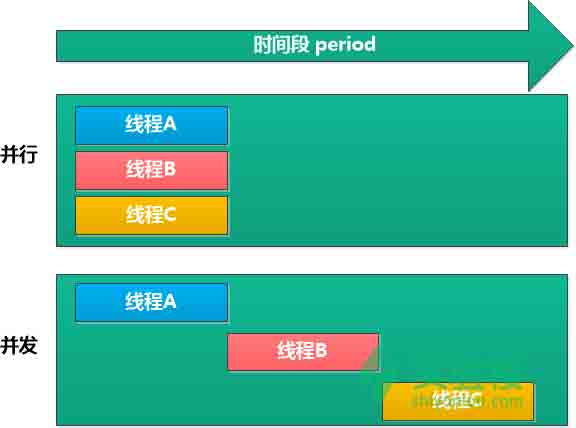

# 第 1 节 Java 支付平台业务流程

## 一、实验简介

在学习了 Java 基本语法、Java 核心 API 之后，我们需要进一步加强实践。本课程在之前课程的基础上进行补充。练习并完成这个 PayPlatform 实例，了解并学会使用 Java 多线程。

### 1.1 实验预定目标

模拟支付平台上买家付款到支付平台，卖家从支付平台取款的简单业务流程，最终结果以控制台输出形式展现。通过此流程，详细讲解 Java 线程与同步。

### 1.2 知识点

1.  Java 线程与同步
2.  并发与并行
3.  操作系统进程状态

### 1.3 实验流程

*   知识准备
*   代码编写
*   实验运行

## 二、线程和同步的概念

### 2.1 线程

在讲解线程之前，首先要了解一下**进程**。

> 进程是指内存中运行的应用程序，每个进程都有自己独立的一块内存空间，一个进程中可以启动多个线程。比如在 `Windows` 系统中，一个运行的 `exe` 就是一个进程。

> 线程是指进程中的一个执行流程，一个进程中可以包含多个线程。比如 `java.exe` 进程中可以运行很多线程。线程总是属于某个进程，进程中的多个线程共享进程的内存。Java 中，每个线程都有一个调用栈，即使不在程序中创建任何新的线程，线程也在后台运行着。一个 Java 应用总是从 `main()` 方法开始运行，`mian()` 方法运行在一个线程内，它被称为主线程，一旦创建一个新的线程，就产生一个新的调用栈。

此外，我们需要了解并发与并行：

> `并行是指两个或者多个事件在同一时刻发生；而并发是指两个或多个事件在同一时间间隔内发生。`

> 操作系统给每个线程分配不同的 CPU 时间片，在某一个时刻， CPU 只执行一个时间片内的线程，多个时间片中的相应线程在 CPU 内轮流执行，由于每个时间片时间很短（这里的时间片短就是时间间隔很短），所以对用户来说，仿佛各个线程在计算机中是并行处理的（实际上多线程之间是并发执行的，即某一时间点上只有一个线程在执行）。操作系统是根据线程的优先级来安排 CPU 的时间，优先级高的线程优先运行，优先级低的线程则继续等待。



不得不说的是，从过去的单核时代到现如今的多核时代，多个线程已经可以在多核上运行，但是线程的互斥和同步问题是更加严峻的。

> 线程总体分两类：用户线程和守候线程。当所有用户线程执行完毕的时候， JVM 自动关闭。但是守候线程却不独立于 JVM ，守候线程一般是由操作系统或者用户自己创建的。

有两种方法来创建新的执行线程。一是要声明一个类 `Thread` 的子类。这个子类应重写 `Thread` 类的 `run` 方法。子类的实例可以被分配和启动。例如，一个计算素数比规定值大的线程可以写为如下形式：

```java
 class PrimeThread extends Thread {
         long minPrime;
         PrimeThread(long minPrime) {
             this.minPrime = minPrime;
         }

         public void run() {
             // compute primes larger than minPrime
              . . .
         }
     } 
```

然后下面的代码将创建一个线程并启动它：

```java
 PrimeThread p = new PrimeThread(143);
     p.start(); 
```

### 2.2 同步（ synchronized ）

> Java 语言的关键字，可用来给对象和方法或者代码块加锁，当它锁定一个方法或者一个代码块的时候，同一时刻最多只有一个线程执行这段代码。当两个并发线程访问同一个对象 `object` 中的这个加锁同步代码块时，一个时间内只能有一个线程得到执行。另一个线程必须等待当前线程执行完这个代码块以后才能执行该代码块。然而，当一个线程访问 `object` 的一个加锁代码块时，另一个线程仍然可以访问该 `object` 中的非加锁代码块。

> `synchronized` 关键字，代表这个方法加锁,相当于不管哪一个线程（例如线程 A ），运行到这个方法时,都要检查有没有其它线程 B （或者 C 、 D 等）正在用这个方法（或者该类的其他同步方法），有的话要等正在使用 synchronized 方法的线程 B （或者 C 、 D ）运行完这个方法后再运行此线程 A ，没有的话，锁定调用者,然后直接运行。它包括两种用法： synchronized 方法和 synchronized 块。 > `synchronized` 方法声明时使用，放在范围操作符（ `public` 等）之后，返回类型声明（ `void` 等）之前。这时，线程获得的是成员锁，即一次只能有一个线程进入该方法，其他线程要想在此时调用该方法，只能排队等候，当前线程（就是在 `synchronized` 方法内部的线程）执行完该方法后，别的线程才能进入。例如:

```java
public synchronized void synMethod(){
　　//方法体
　　} 
```

>如在线程 t1 中有语句 `obj.synMethod()` 那么由于 `synMethod` 被 `synchronized` 修饰，在执行该语句前， 需要先获得调用者 `obj` 的对象锁， 如果其他线程（如 t2 ）已经锁定了 `obj` （能是通过 `obj.synMethod` ,也可能是通过其他 `synchronized` 修饰的方法 `obj.otherSynMethod` 锁定的 `obj` ）， t1 需要等待直到其他线程（ t2 ）释放 `obj` ， 然后 t1 锁定 `obj` ， 执行 `synMethod` 方法。 返回之前之前释放 `obj` 锁。

## 三、代码编写

**Tip：**

*   实验过程中，若遇到鼠标键盘输入无响应的情况，请尝试刷新页面（不建议使用 F5 ）
*   实验过程中，若遇到键盘输入无响应，鼠标可以移动的情况，请尝试打开实验环境桌面上的 gedit 程序，在此程序中测试是否可以输入。若键盘输入有响应则可以再回到 eclipse 中，继续编辑；若键盘输入无响应，请尝试刷新页面。

### 3.1 Account.java

打开实验环境桌面上的 Eclipse，在左侧的 Project Explorer 空白区域中右键点击，选择新建选项 New ，选择 Project 项目，


选择 Java Project 。


填上项目名称 `PayPlatform`。


点击 Finish 按钮完成项目创建。

在 src 文件夹上右键，选择新建选项 New ，选择新建类 Class 。


新建类 `Account` ，包路径： `com.shiyanlou.java`。


点击 Finish 按钮。

`Account`类的具体代码如下。

```java
package com.shiyanlou.java;

public class Account {
    //余额  浮点类型
    private double balance;

    public double getBalance() {
        return balance;
    }

    public void setBalance(double balance) {
        this.balance = balance;
    }

    //构造方法
    public Account()
    {
        balance = 0;
    }

    /*
     * 付款，此处有关键字 synchronized 修饰。
     */
     public synchronized void deposit(double amount) {
        double tmp=balance;
        try {
          Thread.sleep(50);
        } catch (InterruptedException e) {
              e.printStackTrace();
        }
                  tmp+=amount;
                  balance=tmp;
     }

     /*
      * 取款此处有关键字 synchronized 修饰。
      */
     public synchronized void withdraw(double amount) {
         double tmp=balance;
          try {
              Thread.sleep(20);
         } catch (InterruptedException e) {
             e.printStackTrace();
         }
         tmp-=amount;
         balance=tmp;
     }

     public void printInfo()
        {
            System.out.println("Balance on "+ " account =  " + balance);
    }
} 
```

### 3.2 Buyer.java

新建 Java 类步骤同上。买家类继承了 `Runnable` 。

```java
package com.shiyanlou.java;

    public class Buyer  implements Runnable
    {
        //买家基本信息
        private String name;
        private String address;
        private String email;
        private String phone;
        private Account account;

        //构造方法
        public Buyer(String name, String address, String email, String phone,Account account)
        {
            this.name = name;
            this.address = address;
            this.email = email;
            this.phone = phone;
            this.account=account;
        }

        //打印用户信息（基本信息+用户名下账户）
        public void printCustomerInfo()
        {
            System.out.println(" Information about a Buyer");
            System.out.println(" Name                - " + name);
            System.out.println(" address             - " + address);
            System.out.println(" email               - " + email);
            System.out.println(" phone #             - " + phone);
            if(account != null){
                account.printInfo(); 
            }
            else{
                System.out.println("The Buyer has no accounts");
            }

        }

        public String getName() {
            return name;
        }

        public void setName(String name) {
            this.name = name;
        }

        public String getAddress() {
            return address;
        }

        public void setAddress(String address) {
            this.address = address;
        }

        public String getEmail() {
            return email;
        }

        public void setEmail(String email) {
            this.email = email;
        }

        public String getPhone() {
            return phone;
        }

        public void setPhone(String phone) {
            this.phone = phone;
        }

        @Override
        public void run() {
             for (int i=1; i<10; i++){
                  account.deposit(1000);
                  System.out.println("The Balance of account after No:"+i    +"deposite is :"+account.getBalance());
              }
        }
} 
```

> 在 Java 中可有两种方式实现多线程，一种是继承 `Thread` 类，一种是实现 `Runnable` 接口。在实际开发中一个多线程的操作很少使用 `Thread` 类，而是通过 `Runnable` 接口完成。但是在使用 `Runnable` 定义的子类中没有 `start()` 方法，只有 `Thread` 类中才有。此时观察 `Thread` 类，有一个构造方法： `public Thread(Runnable targer)` 此构造方法接受 `Runnable` 的子类实例，也就是说可以通过 `Thread` 类来启动 `Runnable` 实现的多线程。实现该接口需要覆盖 `run` 方法,然后将需要以多线程方式将执行的代码书写在 `run` 方法内部或在 `run` 方法内部进行调用。

这里的 `run()` 方法内是 `for` 循环 10 次汇款 1000 元，并打印的操作。

### 3.3 Seller.java

新建 Java 类步骤同上。卖家类继承 `Runnable` 。

```java
package com.shiyanlou.java;

    public class Seller  implements Runnable
    {
        private String name;
        private String address;
        private String email;
        private String phone;
        private Account account;

        //构造方法
        public Seller(String name, String address, String email, String phone,Account account)
        {
            this.name = name;
            this.address = address;
            this.email = email;
            this.phone = phone;
            this.account= account;
        }

        //打印用户信息（基本信息+用户名下账户）
        public void printCustomerInfo()
        {
            System.out.println(" Information about a customer");
            System.out.println(" Name                - " + name);
            System.out.println(" address             - " + address);
            System.out.println(" email               - " + email);
            System.out.println(" phone #             - " + phone);
            if(account != null){
                account.printInfo(); 
            }
            else{
                System.out.println("The customer has no accounts");
            }

        }

        public String getName() {
            return name;
        }

        public void setName(String name) {
            this.name = name;
        }

        public String getAddress() {
            return address;
        }

        public void setAddress(String address) {
            this.address = address;
        }

        public String getEmail() {
            return email;
        }

        public void setEmail(String email) {
            this.email = email;
        }

        public String getPhone() {
            return phone;
        }

        public void setPhone(String phone) {
            this.phone = phone;
        }

        @Override
        public void run() {
             for (int i=1; i<10; i++){
                  account.withdraw(1000);
                  System.out.println("The Balance of account after No:"+i +"withdraw is :"+account.getBalance());
              }
        }
} 
```

这里的 `run()` 方法内是 `for` 循环 10 次取 款 1000 元，并打印的操作。

### 3.4 Business.java

```java
package com.shiyanlou.java;

public class Business {

    public static void main(String[] args){

        Account midAccount;//中间账户
        Buyer buyer;
        Seller seller;

        midAccount = new Account();
        buyer = new Buyer("Buyer", "shiyanlou，sichuan", "buyer@gmail.com", "8888888",midAccount);//买家基本信息以汇款的目标账户
        seller = new Seller("Seller", "aliyun，sichuan", "Seller@gmail.com", "6666666",midAccount);//卖家基本信息以取款的目标账户

        Thread accountThread1 = new Thread(buyer);//新建线程 1 买家存款
        Thread accountThread2 = new Thread(seller);//新建线程 2 卖家取款
        accountThread1.start();//线程 1 开始
        accountThread2.start();//线程 2 开始

        System.out.printf("Account : start Balance: %f\n",midAccount.getBalance());

    }      
} 
```

在 Business.java 文件中，包含了 `main()` 方法。该方法中创建了一个中间账户，用于接收买家付款；同时，卖家从中取款。对余额为 0 时可做欠款记账处理，可显示取款成功。 新建买家卖家对象，其中的账户为同一中间账户。创建两个线程，分别传入买家和卖家，开启线程。接下来，两个线程将分别使用 `deposite` 和 `withdraw` 方法，对同一账户进行付/取款操作。

## 四、 实验运行

### 4.1 实验结果展示

点击工具栏上的绿色运行按钮 `Run`：


运行程序，观察控制台 Console，实验结果如图。

输出结果可能有多种情况：

第一种情况：


第二种情况（输出结果的顺序请以实际为准）：


10 次汇款 1000 ，10 次取款 1000 ，则最终余额应为 0 。说明实验成功。

### 4.2 实验结果解释

最终的输出结果 2 显示， `deposite` 和 `withdraw` 可能并不是有序交叉执行的，其中的原因之一是由于在 Account.java 中设置的 `Thread.sleep(long millis)` 不同导致的。可以看到 `deposite()` 方法设置的： `Thread.sleep(50)` 是 50 毫秒， `withdraw()` 方法设置的： `Thread.sleep(20)` 是 20 毫秒。 `thread` 的 `sleep()` 方法使当前执行线程休眠（暂停执行）指定的毫秒数。它就会放弃 CPU ，转到阻塞状态。在休眠期间，所有其他具有执行资格的程序都可以获取 CPU 资源，进行执行。具体情况还需要考虑操作系统的队列调度算法，即需要获取 CPU 资源的线程会进入操作系统的就绪队列，休眠的进程被挂起，进入阻塞状态，处于阻塞状态的进程，若其等待的事件已经发生，则进程由阻塞状态转变为就绪状态（内容繁多，不再赘述，详情请参考：[操作系统——进程的状态及转换](http://blog.csdn.net/hbuxiaofei/article/details/8834722)）。

由于对临界资源的 `midAccount` 中间账户的访问方法有 `synchronized` 关键字修饰，使得在 `accountThread1` 线程访问此资源时， `accountThread2` 线程因得不到资源只能等候，不能读写已被 `accountThread1` 线程占有的资源。避免了读脏数据现象的发生。所以最后我们的得到的第 10 次结果 `The Balance of account after No:10 deposite is :0` 。

## 五、实验总结

本次课程，通过编写简单的 PayPlatform 程序模拟支付平台流程，其中主要涉及到 Java 线程与同步。为了了解线程同步的概念，对操作体统进程并发与并行、状态转换等相关知识点进行了介绍。知识由点及面，涉及范围较广，需要配合参考文档进一步理解消化。

## 六、作业

1.  尝试去掉 Account.java 方法中的 synchronized 关键字，观察控制台输出的实验结果是否相同。
2.  尝试了解 `sleep()` 方法与 `wait()` 方法的区别。

## 参考文档

1.  [Java8 API](http://www.oracle.com/technetwork/java/javase/documentation/jdk8-doc-downloads-2133158.html)
2.  [Java 多线程编程总结](http://lavasoft.blog.51cto.com/62575/27069/)
3.  [百度百科 synchronized](http://baike.baidu.com/link?url=MXUVlCL6iXIP1qdLmNi0KvZEnCrIu2QNVxD3T45Zc75ef_LTmpmjDeSXMdKkmSBod3M8jjy9l2Lnt5mf_9N2oa)