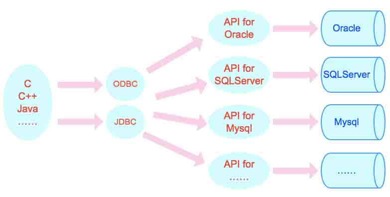
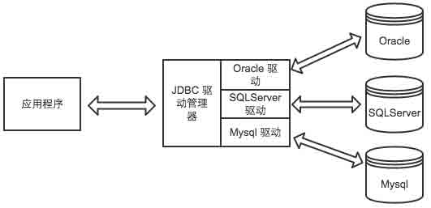
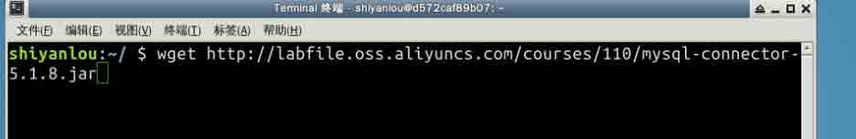
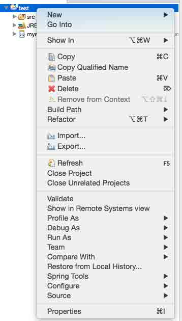
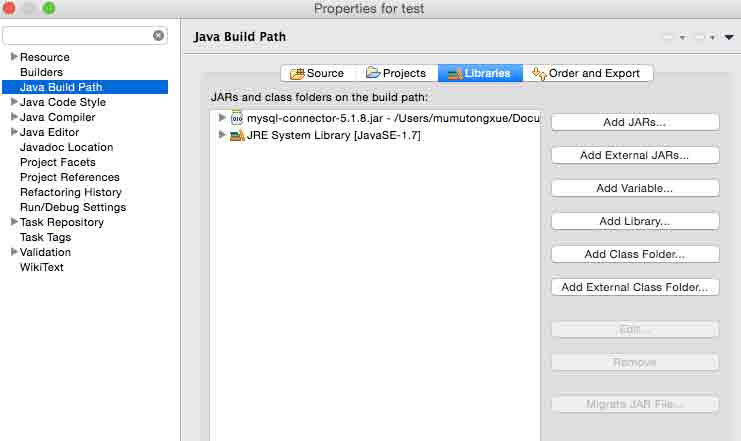
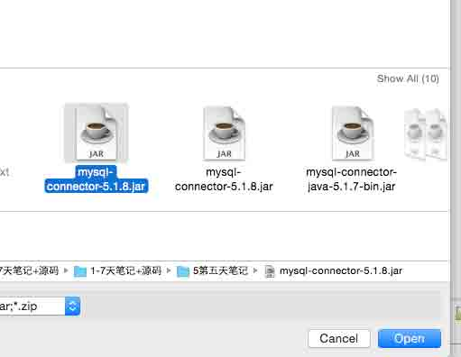
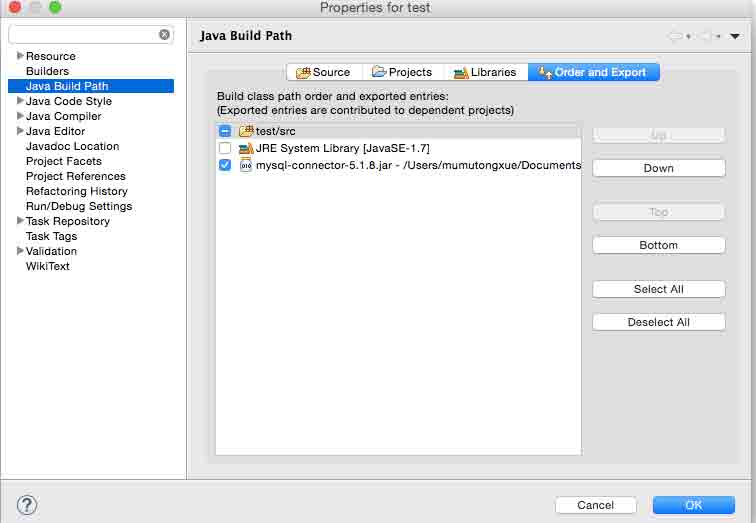
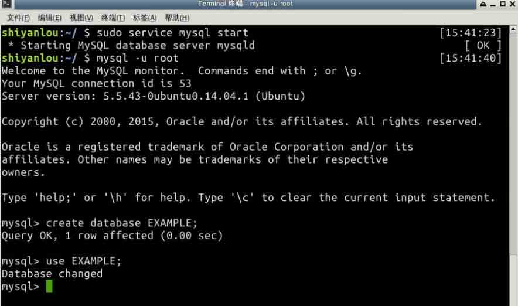
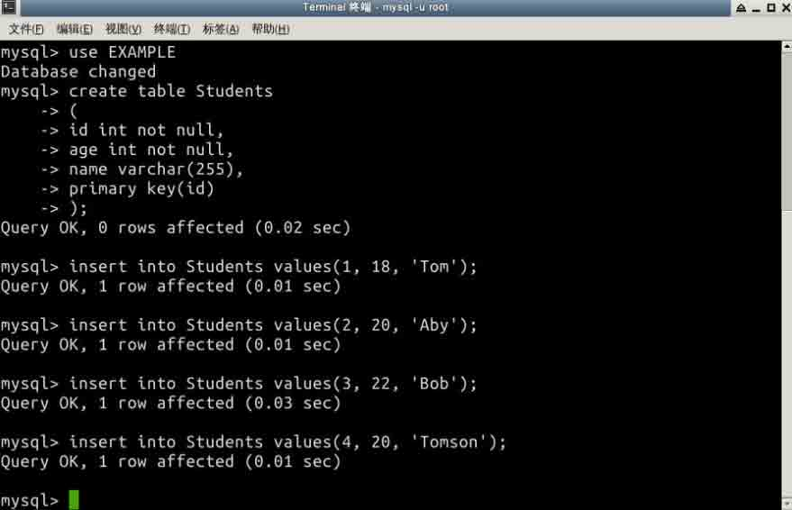
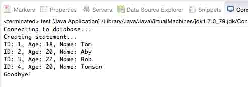

# 第 1 节 认识 JDBC

* * *

## 一、实验简介

　　本实验将学习 JDBC 定义和架构，回顾 SQL 语法，并搭建 JDBC 的环境

## 二、JDBC 简介

　　JDBC 的全称是 Java Database Connectivity，叫做 Java 数据库连接。它是一种用于执行 SQL 语句的 Java API,它由一组用 Java 编程语言编写的类和接口组成。严格来讲它是 J2EE 的一部分。

　　我们要写数据库的程序，是通过 C 语言或者 C++ 语言直接访问数据库的接口，如下图所示。


　　对于不同的数据库，我们需要知道不同数据库对外提供的系统 API，这就影响了我们程序的扩展和跨平台的实现。

　　那么有没有一种方法来实现跨数据库平台呢？那么这里木木就要向大家介绍分层的思想。分层的好处便是上一层只用和下一层进行通讯。我们将不同数据库的接口统一成一个接口是不是就可以跨数据库平台了呢？



　　ODBC 是 Open Database Connect 即开放式数据库互连的简称，它是微软于 1991 年提出的一个用于访问数据库的统一界面标准，是应用程序和数据库系统之间的中间件。我们的应用程序在调用数据的时候，就无需去管具体的数据库，直接由应用程序访问 ODBC 就可以了。

　　而在 Java 上面只有一种数据库连接统一接口——JDBC。JDBC 为数据库开发人员提供了一个标准的 API，据此可以构建更高级的工具和接口使数据库开发人员能够用纯 Java API 编写数据库应用程序。

　　对于我们自己写的程序这一端，接口是统一的，而对于不同数据库产品的连接是通过不同的 JDBC 类库实现的。



## 二、JDBC SQL 语法

　　对于数据库的操作我们肯定是需要结构化查询语句 SQL

　　这里我们就回顾一下 SQL 语句，但不会做过多的详细介绍，如果需要更系统的学习，请参照我们的 sql 教程。

##### 1、创建数据库：

CREATE DATABASE 语句用于创建一个新的数据库。语法是：

```java
SQL> CREATE DATABASE DATABASE_NAME; 
```

例子，创建一个名为 EXAMPLE 数据库：

```java
SQL> CREATE DATABASE EXAMPLE; 
```

##### 2、删除数据库：

使用 DROP DATABASE 语句用于删除现有的数据库。语法是：

```java
SQL> DROP DATABASE DATABASE_NAME; 
```

注意：要创建或删除，应该有数据库服务器上管理员权限。请注意，删除数据库将损失所有存储在数据库中的数据。

例子，删除我们刚刚建好的数据库：

```java
SQL> DROP DATABASE EXAMPLE; 
```

##### 3、创建表：

CREATE TABLE 语句用于创建一个新表。语法是：

```java
SQL> CREATE TABLE table_name
(
   column_name column_data_type,
   column_name column_data_type,
   column_name column_data_type
   ...
); 
```

例子，下面的 SQL 语句创建一个有四个属性的 Students 表：

```java
SQL> CREATE TABLE Students
(
   id INT NOT NULL,
   age INT NOT NULL,
   name VARCHAR(255),
   major VARCHAR(255),
   PRIMARY KEY ( id )
); 
```

##### 4、删除表：

DROP TABLE 语句用于删除现有的表。语法是：

```java
SQL> DROP TABLE table_name; 
```

例子，下面的 SQL 语句删除一个名为 Students 表：

```java
SQL> DROP TABLE Students; 
```

##### 5、插入数据：

语法 INSERT 如下，其中 column1, column2 ，依此类推的属性值：

```java
SQL> INSERT INTO table_name VALUES (column1, column2, ...); 
```

例子，下面的 INSERT 语句中插入先前创建的 Students 表：

```java
SQL> INSERT INTO Students VALUES (1, 18, 'Mumu', 'Java'); 
```

##### 6、查询数据：

SELECT 语句用于从数据库中检索数据。该语法的 SELECT 是：

```java
SQL> SELECT column_name, column_name, ...
     FROM table_name
     WHERE conditions; 
```

WHERE 子句可以使用比较操作符例如 =, !=, <, >, <=, >=,以及 BETWEEN 和 LIKE 操作符。

例子，下面的 SQL 语句从 Students 表选择 id 为 1 的学生，并将该学生的姓名和年龄显示出来：

```java
SQL> SELECT name, age 
     FROM Students 
     WHERE id = 1; 
```

下面的 SQL 语句从 Students 表中查询姓名中有 `om` 字样的学生，并将学生的姓名和专业显示出来:

```java
SQL> SELECT name, major 
     FROM Students 
     WHERE name LIKE '%om%'; 
```

##### 7、更新数据：

UPDATE 语句用于更新数据。UPDATE 语法为：

```java
SQL> UPDATE table_name
     SET column_name = value, column_name = value, ...
     WHERE conditions; 
```

例子，下面的 SQL 的 UPDATE 语句更改其 ID 为 1 的学生的 age：

```java
SQL> UPDATE Students SET age=20 WHERE id=1; 
```

##### 8、删除数据：

DELETE 语句用来删除表中的数据。语法 DELETE 是：

```java
SQL> DELETE FROM table_name WHERE conditions; 
```

例子，下面的 SQL DELETE 语句删除 ID 为 1 的学生的记录：

```java
SQL> DELETE FROM Students WHERE id=1; 
```

## 三、JDBC 环境设置

　　在本教程中，我们将使用 MySQL 数据库。实验楼已经为大家安装好了 mysql，无需大家再次安装。如需系统学习 mysql 请参考实验楼 mysql 的教程。在此我们回顾一下 mysql 的一些基本操作。

##### 1、启动 mysql 服务器

```java
sudo service mysql start 
```

##### 2、连接与断开数据库

连接数据库(实验楼中密码环境为空)：

```java
mysql -u root 
```

退出数据库：

```java
mysql> exit 
```

## 四、创建 JDBC 应用程序

　　接下来我们来学习如何编写一个真正的 JDBC 程序。我们先来浏览一下它的步骤，然后我们在后面的代码中作详细地讲解：

1、导入 JDBC 驱动： 可以根据自己的数据库版本到官网下载。这里木木给大家一个地址[mysql-connector-5.1.8.jar](http://labfile.oss.aliyuncs.com/courses/110/mysql-connector-5.1.8.jar)大家可以自行下载。

在终端输入 wget 命令下载驱动包：



地址：

```java
http://labfile.oss.aliyuncs.com/courses/110/mysql-connector-5.1.8.jar 
```

导入 jar 包的方法如图所示。

a. 选中工程，点击右键，选择`Properties`



b. 选择`Java Build Path` 在右边选择`Libraries`，点击`Add External JARs...`



c. 导入正确的驱动连接的包



d、选择`Order and Export`，勾选上我们刚刚导入进来的包，最后点击`OK`就可以了。



这样便可以与数据库打开一个通信通道

2、打开连接：需要使用 DriverManager.getConnection() 方法创建一个 Connection 对象，它代表与数据库的物理连接

3、执行查询：需要使用类型声明的对象建立并提交一个 SQL 语句到数据库

4、从结果集中提取数据：要求使用适当的关于 ResultSet.getXXX() 方法来检索结果集的数据

5、处理结果集：对得到的结果集进行相关的操作

6、清理环境：需要明确地关闭所有的数据库资源，释放内存

例子：

1、先创建数据库和相应的内容：





2、java 程序访问数据库

```java
package test;

import java.sql.*;

public class test {
   // JDBC 驱动器名称 和数据库地址
   static final String JDBC_DRIVER = "com.mysql.jdbc.Driver";  
   //数据库的名称为 EXAMPLE
   static final String DB_URL = "jdbc:mysql://localhost/EXAMPLE";

   //  数据库用户和密码
   static final String USER = "root";
   //因为 mumu 是在自己的电脑上做测试的，所以是有密码的
   static final String PASS = "0909";

   public static void main(String[] args) {
       Connection conn = null;
       Statement stmt = null;
       try{
           //注册 JDBC 驱动程序
           Class.forName("com.mysql.jdbc.Driver");

           //打开连接
           System.out.println("Connecting to database...");
           conn = DriverManager.getConnection(DB_URL,USER,PASS);

           //执行查询
           System.out.println("Creating statement...");
           stmt = conn.createStatement();
           String sql;
           sql = "SELECT id, name, age FROM Students";
           ResultSet rs = stmt.executeQuery(sql);

           //得到和处理结果集
           while(rs.next()){
               //检索
               int id  = rs.getInt("id");
               int age = rs.getInt("age");
               String name = rs.getString("name");

               //显示
               System.out.print("ID: " + id);
               System.out.print(", Age: " + age);
               System.out.print(", Name: " + name);
               System.out.println();
           }
           //清理环境
           rs.close();
           stmt.close();
           conn.close();
       }catch(SQLException se){
           // JDBC 操作错误
           se.printStackTrace();
       }catch(Exception e){
           // Class.forName 错误
           e.printStackTrace();
       }finally{
           //这里一般用来关闭资源的
           try{
               if(stmt!=null)
                   stmt.close();
           }catch(SQLException se2){
           }
           try{
               if(conn!=null)
                   conn.close();
           }catch(SQLException se){
               se.printStackTrace();
           }
       }
       System.out.println("Goodbye!");
   }
} 
```

3、最后我们来看看结果吧：



## 五、作业

　　好了同学们，你们自己在 Eclipse 上完成我们的第一个 JDBC 程序吧！

　　下来同学们可以查阅一下相关资料，在自己的电脑上配置一下 Mysql 数据库吧，同时还可以使用 Navicat 方便管理自己的数据库！