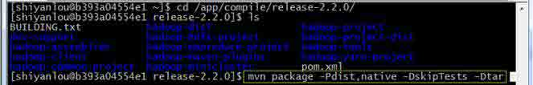
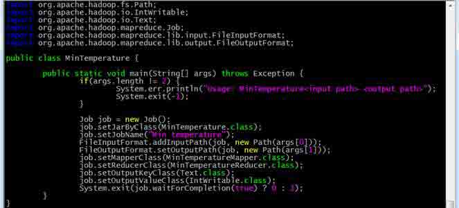

# Hadoop 入门进阶课程

本课程将介绍 Hadoop 生态环境，对生态圈中的组件 Hadoop，Mapreduce，HBase，Mahout，Pig 等进行讲解并进行上机练习。

**1.Hadoop 介绍**

**1.1Hadoop 简介**

Apache Hadoop 软件库是一个框架，允许在集群服务器上使用简单的编程模型对大数据集进行分布式处理。Hadoop 被设计成能够从单台服务器扩展到数以千计的服务器，每台服务器都有本地的计算和存储资源。Hadoop 的高可用性并不依赖硬件，其代码库自身就能在应用层侦测并处理硬件故障，因此能基于服务器集群提供高可用性的服务。

**1.2 Hadoop 生态系统**

经过多年的发展形成了 Hadoop1.X 生态系统，其结构如下图所示： 

*   HDFS--Hadoop 生态圈的基本组成部分是 Hadoop 分布式文件系统（HDFS）。HDFS 是一种数据分布式保存机制，数据被保存在计算机集群上，HDFS 为 HBase 等工具提供了基础。
*   MapReduce--Hadoop 的主要执行框架是 MapReduce，它是一个分布式、并行处理的编程模型，MapReduce 把任务分为 map(映射)阶段和 reduce(化简)。由于 MapReduce 工作原理的特性，Hadoop 能以并行的方式访问数据，从而实现快速访问数据。
*   Hbase--HBase 是一个建立在 HDFS 之上，面向列的 NoSQL 数据库，用于快速读/写大量数据。HBase 使用 Zookeeper 进行管理，确保所有组件都正常运行。
*   Zookeeper--用于 Hadoop 的分布式协调服务。Hadoop 的许多组件依赖于 Zookeeper，它运行在计算机集群上面，用于管理 Hadoop 操作。
*   Pig--它是 MapReduce 编程的复杂性的抽象。Pig 平台包括运行环境和用于分析 Hadoop 数据集的脚本语言(Pig Latin)。其编译器将 Pig Latin 翻译成 MapReduce 程序序列。
*   Hive--Hive 类似于 SQL 高级语言，用于运行存储在 Hadoop 上的查询语句，Hive 让不熟悉 MapReduce 开发人员也能编写数据查询语句，然后这些语句被翻译为 Hadoop 上面的 MapReduce 任务。像 Pig 一样，Hive 作为一个抽象层工具，吸引了很多熟悉 SQL 而不是 Java 编程的数据分析师。
*   Sqoop 是一个连接工具，用于在关系数据库、数据仓库和 Hadoop 之间转移数据。Sqoop 利用数据库技术描述架构，进行数据的导入/导出；利用 MapReduce 实现并行化运行和容错技术。
*   Flume 提供了分布式、可靠、高效的服务，用于收集、汇总大数据，并将单台计算机的大量数据转移到 HDFS。它基于一个简单而灵活的架构，并提供了数据流的流。它利用简单的可扩展的数据模型，将企业中多台计算机上的数据转移到 Hadoop

**1.3 Apache 版本衍化**

Apache Hadoop 版本分为两代，我们将第一代 Hadoop 称为 Hadoop 1.0，第二代 Hadoop 称为 Hadoop2.0。第一代 Hadoop 包含三个大版本，分别是 0.20.x，0.21.x 和 0.22.x，其中，0.20.x 最后演化成 1.0.x，变成了稳定版，而 0.21.x 和 0.22.x 则 NameNode HA 等新的重大特性。第二代 Hadoop 包含两个版本，分别是 0.23.x 和 2.x，它们完全不同于 Hadoop 1.0，是一套全新的架构，均包含 HDFS Federation 和 YARN 两个系统，相比于 0.23.x，2.x 增加了 NameNode HA 和 Wire-compatibility 两个重大特性。 

**2 Hadoop1.X 伪分布安装**

Hadoop 安装有如下三种方式：

*   单机模式：安装简单，几乎不用作任何配置，但仅限于调试用途；
*   伪分布模式：在单节点上同时启动 NameNode、DataNode、JobTracker、TaskTracker、Secondary Namenode 等 5 个进程，模拟分布式运行的各个节点；
*   完全分布式模式：正常的 Hadoop 集群，由多个各司其职的节点构成

由于实验环境的限制，本节课程将讲解伪分布模式安装，并在随后的课程中以该环境为基础进行其他组件部署实验。以下为伪分布式环境下在 CentOS6 中配置 Hadoop-1.1.2，该配置可以作为其他 Linux 系统和其他版本的 Hadoop 部署参考。

**2.1 软硬件环境说明**

节点使用 CentOS 系统，防火墙和 SElinux 禁用，创建了一个 shiyanlou 用户，并在系统根目录下创建/app 目录，用于存放 Hadoop 等组件运行包。因为该目录用于安装 hadoop 等组件程序，用户对 shiyanlou 必须赋予 rwx 权限（一般做法是 root 用户在根目录下创建/app 目录，并修改该目录拥有者为 shiyanlou(chown –R shiyanlou:shiyanlou /app）。

**Hadoop 搭建环境：**

*   虚拟机操作系统：CentOS6.6 64 位，单核，1G 内存
*   JDK：1.7.0_55 64 位
*   Hadoop：1.1.2

**2.2 环境搭建（除 2.2.1.3 步骤需要学员设置外，其他配置实验楼虚拟机已设置）**

实验环境的虚拟机已经完成的安装环境的配置，当其他机器部署时可以参考该章节进行环境搭建，需要关注的是 JDK 路径为/app/lib/jdk1.7.0_55。

**2.2.1 配置本地环境**

该部分对服务器的配置需要在服务器本地进行配置，配置完毕后需要重启服务器确认配置是否生效，特别是远程访问服务器需要设置固定 IP 地址。

**2.2.1.1 设置 IP 地址（实验楼环境已配置，无需操作）**

点击 System-->Preferences-->Network Connections，如下图所示：  修改或重建网络连接，设置该连接为手工方式，设置如下网络信息：

*   IP 地址: 192.168.42.8
*   子网掩码： 255.255.255.0
*   DNS： 221.12.1.227 (需要根据所在地设置 DNS 服务器)
*   Domain: 221.12.33.227

注意：网关、DNS 等根据所在网络实际情况进行设置，并设置连接方式为"Available to all users"，否则通过远程连接时会在服务器重启后无法连接服务器 

在命令行中，使用 ifconfig 命令查看设置 IP 地址信息，如果修改 IP 不生效，需要重启机器再进行设置（如果该机器在设置后需要通过远程访问，建议重启机器，确认机器 IP 是否生效）

**2.2.1.2 设置机器名（实验楼环境已配置，无需操作）**

使用 sudo vi /etc/sysconfig/network

打开配置文件，根据实际情况设置该服务器的机器名，新机器名在重启后生效


**2.2.1.3 设置 Host 映射文件（需要在实验楼操作）**

1.设置 IP 地址与机器名的映射，设置信息如下：

```java
# 配置主机名对应的 IP 地址
$ sudo vi /etc/hosts
# sudo 需要输入 shiyanlou 用户的密码 
```

设置：<IP 地址> <主机名> hadoop

例如：192.168.42.8 b393a04554e1 hadoop


3.使用 ping 命令验证设置是否成功

```java
$ ping hadoop 
```

**2.2.2 设置操作系统环境（实验楼环境已配置，无需操作）**

**2.2.2.1 关闭防火墙**

在 Hadoop 安装过程中需要关闭防火墙和 SElinux，否则会出现异常

1.使用 sudo service iptables status

查看防火墙状态，如下所示表示 iptables 已经开启


（注意：若弹出权限不足，可能防火墙已经关闭，请输入命令：chkconfig iptables –list 查看防火墙的状态。）

2.使用如下命令关闭 iptables

*   sudo chkconfig iptables off


**2.2.2.2 关闭 SElinux**

1.使用 getenforce 命令查看是否关闭 2.修改/etc/selinux/config 文件 将 SELINUX=enforcing 改为 SELINUX=disabled，执行该命令后重启机器生效 

**2.2.2.3 JDK 安装及配置（实验楼环境已配置，无需操作）**

1.下载 JDK1.7 64bit 安装包 打开 JDK1.7 64bit 安装包下载链接为： http://www.oracle.com/technetwork/java/javase/downloads/jdk7-downloads-1880260.html 打开界面之后，先选中 Accept License Agreement ，然后下载 jdk-7u55-linux-x64.tar.gz，如下图所示：  2.创建/app 目录，把该目录的所有者修改为 shiyanlou

*   sudo mkdir /app
*   sudo chown -R shiyanlou:shiyanlou /app

 3.创建/app/lib 目录，使用命令如下： mkdir /app/lib  4.把下载的安装包解压并迁移到/app/lib 目录下

*   cd /home/shiyanlou/install-pack
*   tar -zxf jdk-7u55-linux-x64.tar.gz
*   mv jdk1.7.0_55/ /app/lib
*   ll /app/lib

 5.使用 sudo vi /etc/profile 命令打开配置文件，设置 JDK 路径

*   export JAVA*HOME=/app/lib/jdk1.7.0*55
*   export PATH=$JAVA_HOME/bin:$PATH
*   export CLASSPATH=.:$JAVA*HOME/lib/dt.jar:$JAVA*HOME/lib/tools.jar

 6.编译并验证

*   source /etc/profile
*   java -version


**2.2.2.4 更新 OpenSSL（实验楼环境已配置，无需操作）**

CentOS 自带的 OpenSSL 存在 bug，如果不更新 OpenSSL 在 Ambari 部署过程会出现无法通过 SSH 连接节点，使用如下命令进行更新： yum update openssl 


**2.2.2.5 SSH 无密码验证配置（实验楼环境已配置，无需操作）**

1.使用 sudo vi /etc/ssh/sshd*config，打开 sshd*config 配置文件，开放三个配置，如下图所示：

*   RSAAuthentication yes
*   PubkeyAuthentication yes
*   AuthorizedKeysFile .ssh/authorized_keys

 2.配置后重启服务

*   sudo service sshd restart

 3.使用 shiyanlou 用户登录使用如下命令生成私钥和公钥；

*   ssh-keygen -t rsa

 4.进入/home/shiyanlou/.ssh 目录把公钥命名为 authorized_keys，使用命令如下：

*   cp id*rsa.pub authorized*keys

 5.使用如下设置 authorized_keys 读写权限

*   sudo chmod 400 authorized_keys

 6.测试 ssh 免密码登录是否生效

**2.3 Hadoop 变量配置**

**2.3.1 下载并解压 hadoop 安装包**

在 Apache 的归档目录中下载 hadoop-1.1.2-bin.tar.gz 安装包，也可以在/home/shiyanlou/install-pack 目录中找到该安装包，解压该安装包并把该安装包复制到/app 目录中

*   cd /home/shiyanlou/install-pack
*   tar -xzf hadoop-1.1.2-bin.tar.gz
*   rm -rf /app/hadoop-1.1.2
*   mv hadoop-1.1.2 /app


**2.3.2 在 Hadoop-1.1.2 目录下创建子目录**

*   cd /app/hadoop-1.1.2
*   mkdir tmp
*   mkdir hdfs
*   mkdir hdfs/name
*   mkdir hdfs/data
*   ls

 把 hdfs/data 设置为 755，否则 DataNode 会启动失败 

**2.3.3 配置 hadoop-env.sh**

1.进入 hadoop-1.1.2/conf 目录，打开配置文件 hadoop-env.sh

*   cd /app/hadoop-1.1.2/conf
*   vi hadoop-env.sh


2.加入配置内容，设置了 hadoop 中 jdk 和 hadoop/bin 路径

*   export JAVA*HOME=/usr/lib/java/jdk1.7.0*55
*   export PATH=$PATH:/app/hadoop-1.1.2/bin


3.编译配置文件 hadoop-env.sh，并确认生效

*   source hadoop-env.sh
*   hadoop version


**2.3.4 配置 core-site.xml**

1.使用如下命令打开 core-site.xml 配置文件

*   sudo vi core-site.xml

2.在配置文件中，按照如下内容进行配置

```java
<configuration>
  <property>
 <name>fs.default.name</name>
  <value>hdfs://hadoop:9000</value>
  </property>
  <property>
 <name>hadoop.tmp.dir</name>
  <value>/app/hadoop-1.1.2/tmp</value>
  </property>
</configuration> 
```


**2.3.5 配置 hdfs-site.xml**

1.使用如下命令打开 hdfs-site.xml 配置文件

*   sudo vi hdfs-site.xml

2.在配置文件中，按照如下内容进行配置

```java
<configuration>
  <property>
 <name>dfs.replication</name>
  <value>1</value>
  </property>
  <property>
 <name>dfs.name.dir</name>
  <value>/app/hadoop-1.1.2/hdfs/name</value>
  </property>
  <property>
 <name>dfs.data.dir</name>
  <value>/app/hadoop-1.1.2/hdfs/data</value>
  </property>
</configuration> 
```


**2.3.6 配置 mapred-site.xml**

1.使用如下命令打开 mapred-site.xml 配置文件

*   sudo vi mapred-site.xml

2.在配置文件中，按照如下内容进行配置

```java
<configuration>
  <property>
    <name>mapred.job.tracker</name>
    <value>hadoop:9001</value>
  </property>
</configuration> 
```


**2.3.7 配置 masters 和 slaves 文件**

1.设子主节点

*   vi masters


2.设置从节点

*   vi slaves


**2.3.8 格式化 namenode**

在 hadoop1 机器上使用如下命令进行格式化 namenode

*   hadoop namenode -format

    

**2.3.9 启动 hadoop**

```java
cd /app/hadoop-1.1.2/bin
./start-all.sh 
```


**2.3.10 用 jps 检验各后台进程是否成功启动**

使用 jps 命令查看 hadoop 相关进程是否启动


## **Hadoop2.X 64 位编译**

**1 编译 Hadoop2.X 64 位**

**1.1 软硬件环境说明**

节点使用 CentOS 系统，防火墙和 SElinux 禁用，创建了一个 shiyanlou 用户，并在系统根目录下创建/app 目录，用于存放 Hadoop 等组件运行包。因为该目录用于安装 hadoop 等组件程序，用户对 shiyanlou 必须赋予 rwx 权限（一般做法是 root 用户在根目录下创建/app 目录，并修改该目录拥有者为 shiyanlou(chown –R shiyanlou:shiyanlou /app）。 Hadoop 搭建环境：

*   虚拟机操作系统：三个节点均为 CentOS6 64 位，单核，1G 内存
*   JDK：1.7.0_55 64 位
*   Hadoop：1.1.2

**1.2 环境搭建**

**1.2.1 JDK 安装和 Java 环境变量配置**

1.下载 JDK1.7 64bit 安装包

打开 JDK1.7 64bit 安装包下载链接为： http://www.oracle.com/technetwork/java/javase/downloads/jdk7-downloads-1880260.html 打开界面之后，先选中 Accept License Agreement ，然后下载 jdk-7u55-linux-x64.tar.gz，如下图所示： 

2.创建/app 目录，把该目录的所有者修改为 shiyanlou

*   sudo mkdir /app
*   sudo chown -R shiyanlou:shiyanlou /app


3.创建/app/lib 目录，使用命令如下：

*   mkdir /app/lib


4.把下载的安装包解压并迁移到/app/lib 目录下

*   cd /home/shiyanlou/install-pack
*   tar -zxf jdk-7u55-linux-x64.tar.gz
*   mv jdk1.7.0_55/ /app/lib
*   ll /app/lib


5.使用 sudo vi /etc/profile 命令打开配置文件，设置 JDK 路径

*   export JAVA*HOME=/app/lib/jdk1.7.0*55
*   export PATH=$JAVA_HOME/bin:$PATH
*   export CLASSPATH=.:$JAVA*HOME/lib/dt.jar:$JAVA*HOME/lib/tools.jar


6.编译并验证

*   source /etc/profile
*   java -version


**1.2.2 安装并设置 maven**

1.下载 maven 安装包（建议安装 3.0 以上版本）本次安装选择的是 maven3.0.5 的二进制包，下载地址 http://mirror.bit.edu.cn/apache/maven/maven-3/ ，也可以在/home/shiyanlou/install-pack 目录中找到该安装包 

2.解压缩 apache-maven-3.0.5-bin.tar.gz 包，并把 apache-maven-3.0.5 目录移到/app/lib 目录下

*   cd /home/shiyanlou/install-pack
*   tar -zxf apache-maven-3.0.5-bin.tar.gz
*   mv apache-maven-3.0.5 /app/lib


3.使用 sudo vi /etc/profile 打开配置文件，并加入 maven 设置

*   export MAVEN_HOME=/app/lib/apache-maven-3.0.5
*   export PATH=$PATH:$MAVEN_HOME/bin


4.编译/etc/profile 文件并验证配置是否成功:

*   source /etc/profile
*   mvn -version


**1.2.3 使用 yum 安装 svn**

*   sudo yum install svn


 **1.2.4 使用 yum 安装 autoconf automake libtool cmake**

*   sudo yum install autoconf automake libtool cmake


**1.2.5 使用 yum 安装 ncurses-devel**

*   sudo yum install ncurses-devel


**1.2.6 使用 yum 安装 openssl-devel**

*   sudo yum install openssl-devel


**1.2.7 使用 yum 安装 gcc* **

*   sudo yum install gcc*


**1.2.8 安装并设置 protobuf**

注：该程序包需要在 gcc 安装完毕后才能安装，否则提示无法找到 gcc 编译器。 1.下载 protobuf 安装包 下载链接为 https://code.google.com/p/protobuf/downloads/list ，也可以在/home/shiyanlou/install-pack 目录中找到该安装包


2.解压安装包并把 protobuf-2.5.0 目录转移到/app/lib 目录下

*   cd /home/shiyanlou/install-pack
*   tar -zxf protobuf-2.5.0.tar.gz
*   mv protobuf-2.5.0 /app/lib


3.进行目录运行命令 进入目录运行如下命令：

*   cd /app/lib/protobuf-2.5.0/
*   sudo ./configure
*   sudo make
*   sudo make check
*   sudo make install


make 过程时间较长，需要运行几分钟时间 

check 结果如下 

运行 install 命令及结果如下 

 4.验证是否安装成功 运行成功之后，通过如下方式来验证是否安装成功

*   protoc


**2 编译 Hadoop **

**2.1 下载 Hadoop 源代码 Release2.2.0**

在/app 目录下新建 compile 子目录，在该文件夹通过 SVN 获取 Hadoop2.2.0 源代码，命令如下：

*   cd /app
*   mkdir compile
*   svn checkout http://svn.apache.org/repos/asf/hadoop/common/tags/release-2.2.0 获取时间较长，大小约 75.3M


**2.2 编译 Hadoop 源代码**

:) 由于 hadoop2.2.0 在 svn 中 pom.xml 有点问题，会造成编译中出错，可先参考 3.1 修复该问题。在 Hadoop 源代码的根目录执行如下命令： mvn package -Pdist,native -DskipTests –Dtar (注意：这行命令需要手工输入，如果复制执行会报异常！)  在编译过程需要联网，从网络中下载所依赖的包，编译的过程时间根据网速时间不等，一般在 30 分钟左右。 


编译好的 Hadoop2.X 64 位安装包在 hadoop-dist/target 目录中，该文件为 hadoop-2.2.2.tar.gz。 

**2.3 验证编译是否成功**

到 hadoop-dist/target/hadoop-2.2.0/lib/native 目录中查看 libhadoop.so.1.0.0 属性：

*   file ./libhadoop.so.1.0.0

该文件为 ELF 64-bit LSB 则表示文件成功编译为 64 位 

**3 问题解决**

**3.1 编译 Hadoop2.2.0 出现代码异常**

目前的 2.2.0 的 Source Code 压缩包解压出来的 code 有个 bug 需要 patch 后才能编译。否则编译 hadoop-auth 会提示下面错误： [ERROR] Failed to execute goal org.apache.maven.plugins:maven-compiler-plugin:2.5.1:testCompile (default-testCompile) on project hadoop-auth: Compilation failure: Compilation failure: [ERROR] /home/hadoop/Downloads/release-2.2.0/hadoop-common-project/hadoop-auth/src/test/java/org/apache/hadoop/security/authentication/client/AuthenticatorTestCase.java:[88,11] error: cannot access AbstractLifeCycle [ERROR] class file for org.mortbay.component.AbstractLifeCycle not found [ERROR] /home/hadoop/Downloads/release-2.2.0/hadoop-common-project/hadoop-auth/src/test/java/org/apache/hadoop/security/authentication/client/AuthenticatorTestCase.java:[96,29] error: cannot access LifeCycle [ERROR] class file for org.mortbay.component.LifeCycle not found 

直接修改 hadoop-common-project/hadoop-auth/pom.xml，其实就是少了一个包，添加一个 dependency：

*   <dependency>
*   <groupId>org.mortbay.jetty</groupId>
*   <artifactId>jetty-util</artifactId>
*   <scope>test</scope>
*   </dependency>


## **Hadoop2.X 64 位环境搭建**

**1 搭建环境**

部署节点操作系统为 CentOS，防火墙和 SElinux 禁用，创建了一个 shiyanlou 用户并在系统根目录下创建/app 目录，用于存放 Hadoop 等组件运行包。因为该目录用于安装 hadoop 等组件程序，用户对 shiyanlou 必须赋予 rwx 权限（一般做法是 root 用户在根目录下创建/app 目录，并修改该目录拥有者为 shiyanlou(chown –R shiyanlou:shiyanlou /app）。 Hadoop 搭建环境：

*   虚拟机操作系统： CentOS6.6 64 位，单核，1G 内存
*   JDK：1.7.0_55 64 位
*   Hadoop：2.2.0 64 位（该部署包为第 2 个实验所编译完成）

**2 部署 Hadooop2.X**

**2.1 配置 Hadoop 环境**

在 Apache 网站上提供 Hadoop2.X 安装包只支持 32 位操作系统安装，在 64 位服务器安装会出现 3.1 的错误异常。这里我们使用上一步骤编译好的 hadoop-2.2.0-bin.tar.gz 文件作为安装包（也可以在/home/shiyanlou/install-pack 目录中找到 hadoop-2.2.0.tar.gz 安装包）

**2.1.1 下载并解压 hadoop 安装包**

解压缩并移动到/app 目录下

*   cd /home/shiyanlou/install-pack
*   tar -xzf hadoop-2.2.0.tar.gz
*   mv hadoop-2.2.0 /app


**2.1.2 在 Hadoop 目录下创建子目录**

在 hadoop-2.2.0 目录下创建 tmp、name 和 data 目录

*   cd /app/hadoop-2.2.0
*   mkdir tmp
*   mkdir hdfs
*   mkdir hdfs/name
*   mkdir hdfs/data


**2.1.3 配置 hadoop-env.sh**

1.打开配置文件 hadoop-env.sh

*   cd /app/hadoop-2.2.0/etc/hadoop
*   sudo vi hadoop-env.sh


2.加入配置内容，设置了 hadoop 中 jdk 和 hadoop/bin 路径

*   export HADOOP*CONF*DIR=/app/hadoop2.2.0/etc/hadoop
*   export JAVA*HOME=/app/lib/jdk1.7.0*55
*   export PATH=$PATH:/app/hadoop-2.2.0/bin


3.编译配置文件 hadoop-env.sh，并确认生效

*   source hadoop-env.sh
*   hadoop version


**2.1.4 配置 yarn-env.sh**

打开配置文件 yarn-env.sh，设置了 hadoop 中 jdk 路径，配置完毕后使用 source yarn-env.sh 编译该文件

*   export JAVA*HOME=/app/lib/jdk1.7.0*55


**2.1.5 配置 core-site.xml**

1.使用如下命令打开 core-site.xml 配置文件

*   cd /app/hadoop-2.2.0/etc/hadoop
*   sudo vi core-site.xml

2.在配置文件中，按照如下内容进行配置

*   <configuration>
*   <property>
*   <name>fs.default.name</name>
*   <value>hdfs://hadoop:9000</value>
*   </property>
*   <property>
*   <name>fs.defaultFS</name>
*   <value>hdfs://hadoop:9000</value>
*   </property>
*   <property>
*   <name>io.file.buffer.size</name>
*   <value>131072</value>
*   </property>
*   <property>
*   <name>hadoop.tmp.dir</name>
*   <value>file:/app/hadoop-2.2.0/tmp</value>
*   <description>Abase for other temporary directories.</description>
*   </property>
*   <property>
*   <name>hadoop.proxyuser.hduser.hosts</name>
*   <value>*</value>
*   </property>
*   <property>
*   <name>hadoop.proxyuser.hduser.groups</name>
*   <value>*</value>
*   </property>
*   </configuration>


**2.1.6 配置 hdfs-site.xml**

1.使用如下命令打开 hdfs-site.xml 配置文件

*   cd /app/hadoop-2.2.0/etc/hadoop
*   sudo vi hdfs-site.xml

2.在配置文件中，按照如下内容进行配置

*   <configuration>
*   <property>
*   <name>dfs.namenode.secondary.http-address</name>
*   <value>hadoop:9001</value>
*   </property>
*   <property>
*   <name>dfs.namenode.name.dir</name>
*   <value>file:/app/hadoop-2.2.0/hdfs/name</value>
*   </property>
*   <property>
*   <name>dfs.datanode.data.dir</name>
*   <value>file:/app/hadoop-2.2.0/hdfs/data</value>
*   </property>
*   <property>
*   <name>dfs.replication</name>
*   <value>1</value>
*   </property>
*   <property>
*   <name>dfs.webhdfs.enabled</name>
*   <value>true</value>
*   </property>
*   </configuration>


**2.1.7 配置 mapred-site.xml**

1.默认情况下不存在 mapred-site.xml 文件，可以从模板拷贝一份，并使用如下命令打开 mapred-site.xml 配置文件

*   cd /app/hadoop-2.2.0/etc/hadoop
*   cp mapred-site.xml.template mapred-site.xml
*   sudo vi mapred-site.xml

2.在配置文件中，按照如下内容进行配置

*   <configuration>
*   <property>
*   <name>mapreduce.framework.name</name>
*   <value>yarn</value>
*   </property>
*   <property>
*   <name>mapreduce.jobhistory.address</name>
*   <value>hadoop:10020</value>
*   </property>
*   <property>
*   <name>mapreduce.jobhistory.webapp.address</name>
*   <value>hadoop:19888</value>
*   </property>
*   </configuration>


**2.1.8 配置 yarn-site.xml**

1.使用如下命令打开 yarn-site.xml 配置文件

*   cd /app/hadoop-2.2.0/etc/hadoop
*   sudo vi yarn-site.xml

2.在配置文件中，按照如下内容进行配置

*   <configuration>
*   <property>
*   <name>yarn.nodemanager.aux-services</name>
*   <value>mapreduce_shuffle</value>
*   </property>
*   <property>
*   <name>yarn.nodemanager.aux-services.mapreduce.shuffle.class</name>
*   <value>org.apache.hadoop.mapred.ShuffleHandler</value>
*   </property>
*   <property>
*   <name>yarn.resourcemanager.address</name>
*   <value>hadoop:8032</value>
*   </property>
*   <property>
*   <name>yarn.resourcemanager.scheduler.address</name>
*   <value>hadoop:8030</value>
*   </property>
*   <property>
*   <name>yarn.resourcemanager.resource-tracker.address</name>
*   <value>hadoop:8031</value>
*   </property>
*   <property>
*   <name>yarn.resourcemanager.admin.address</name>
*   <value>hadoop:8033</value>
*   </property>
*   <property>
*   <name>yarn.resourcemanager.webapp.address</name>
*   <value>hadoop:8088</value>
*   </property>
*   </configuration>


**2.1.9 配置 slaves 文件**

在 slaves 配置文件中设置从节点，这里设置为 hadoop，与 Hadoop1.X 区别的是 Hadoop2.X 不需要设置 Master

*   cd /app/hadoop-2.2.0/etc/hadoop
*   vi slaves


**2.1.10 格式化 namenode**

*   cd /app/hadoop-2.2.0/bin
*   ./hdfs namenode -format


**2.2 启动 Hadoop**

**2.2.1 启动 hdfs**

*   cd /app/hadoop-2.2.0/sbin
*   ./start-dfs.sh


**2.2.2 验证当前进行**

使用 jps 命令查看运行进程，此时在 hadoop 上面运行的进程有：namenode、secondarynamenode 和 datanode 三个进行 

**2.2.3 启动 yarn**

*   cd /app/hadoop-2.2.0/sbin
*   ./start-yarn.sh


**2.2.4 验证当前进行**

使用 jps 命令查看运行进程，此时在 hadoop 上运行的进程除了：namenode、secondarynamenode 和 datanode，增加了 resourcemanager 和 nodemanager 两个进程： 

**2.3 测试 Hadoop**

**2.3.1 创建测试目录**

*   cd /app/hadoop-2.2.0/bin
*   ./hadoop fs -mkdir -p /class3/input


**2.3.2 准备测试数据**

*   ./hadoop fs -copyFromLocal ../etc/hadoop/* /class3/input


**2.3.3 运行 wordcount 例子**

*   cd /app/hadoop-2.2.0/bin
*   ./hadoop jar ../share/hadoop/mapreduce/hadoop-mapreduce-examples-2.2.0.jar wordcount /class3/input /class3/output


**2.3.4 查看结果**

使用如下命令查看运行结果：

*   ./hadoop fs -ls /class3/output/
*   ./hadoop fs -cat /class3/output/part-r-00000 | less


**3 问题解决**

**3.1 CentOS 64bit 安装 Hadoop2.2.0 中出现文件编译位数异常**

在安装 hadoop2.2.0 过程中出现如下异常：Unable to load native-hadoop library for your platform... using builtin-java classes where applicable


通过分析是由于 lib/native 目录中有些文件是在 32 位编译，无法适应 CentOS 64 位环境造成


有两种办法解决：

*   重新编译 hadoop，然后重新部署
*   暂时办法是修改配置，忽略有问题的文件

**1 环境说明**

部署节点操作系统为 CentOS，防火墙和 SElinux 禁用，创建了一个 shiyanlou 用户并在系统根目录下创建/app 目录，用于存放 Hadoop 等组件运行包。因为该目录用于安装 hadoop 等组件程序，用户对 shiyanlou 必须赋予 rwx 权限（一般做法是 root 用户在根目录下创建/app 目录，并修改该目录拥有者为 shiyanlou(chown –R shiyanlou:shiyanlou /app）。

**Hadoop 搭建环境：**

*   虚拟机操作系统： CentOS6.6 64 位，单核，1G 内存
*   JDK：1.7.0_55 64 位
*   Hadoop：1.1.2

**2 HDFS 原理**

HDFS（Hadoop Distributed File System）是一个分布式文件系统，是谷歌的 GFS 山寨版本。它具有高容错性并提供了高吞吐量的数据访问，非常适合大规模数据集上的应用，它提供了一个高度容错性和高吞吐量的海量数据存储解决方案。

*   高吞吐量访问：HDFS 的每个 Block 分布在不同的 Rack 上，在用户访问时，HDFS 会计算使用最近和访问量最小的服务器给用户提供。由于 Block 在不同的 Rack 上都有备份，所以不再是单数据访问，所以速度和效率是非常快的。另外 HDFS 可以并行从服务器集群中读写，增加了文件读写的访问带宽。
*   高容错性：系统故障是不可避免的，如何做到故障之后的数据恢复和容错处理是至关重要的。HDFS 通过多方面保证数据的可靠性，多份复制并且分布到物理位置的不同服务器上，数据校验功能、后台的连续自检数据一致性功能都为高容错提供了可能。
*   线性扩展：因为 HDFS 的 Block 信息存放到 NameNode 上，文件的 Block 分布到 DataNode 上，当扩充的时候仅仅添加 DataNode 数量，系统可以在不停止服务的情况下做扩充，不需要人工干预。

**2.1 HDFS 架构**


如上图所示 HDFS 是 Master 和 Slave 的结构，分为 NameNode、Secondary NameNode 和 DataNode 三种角色。

*   NameNode：在 Hadoop1.X 中只有一个 Master 节点，管理 HDFS 的名称空间和数据块映射信息、配置副本策略和处理客户端请求；
*   Secondary NameNode：辅助 NameNode，分担 NameNode 工作，定期合并 fsimage 和 fsedits 并推送给 NameNode，紧急情况下可辅助恢复 NameNode；
*   DataNode：Slave 节点，实际存储数据、执行数据块的读写并汇报存储信息给 NameNode；

**2.2 HDFS 读操作**


1.  客户端通过调用 FileSystem 对象的 open()方法来打开希望读取的文件，对于 HDFS 来说，这个对象时分布文件系统的一个实例；
2.  DistributedFileSystem 通过使用 RPC 来调用 NameNode 以确定文件起始块的位置，同一 Block 按照重复数会返回多个位置，这些位置按照 Hadoop 集群拓扑结构排序，距离客户端近的排在前面；
3.  前两步会返回一个 FSDataInputStream 对象，该对象会被封装成 DFSInputStream 对象，DFSInputStream 可以方便的管理 datanode 和 namenode 数据流，客户端对这个输入流调用 read()方法；
4.  存储着文件起始块的 DataNode 地址的 DFSInputStream 随即连接距离最近的 DataNode，通过对数据流反复调用 read()方法，可以将数据从 DataNode 传输到客户端；
5.  到达块的末端时，DFSInputStream 会关闭与该 DataNode 的连接，然后寻找下一个块的最佳 DataNode，这些操作对客户端来说是透明的，客户端的角度看来只是读一个持续不断的流；
6.  一旦客户端完成读取，就对 FSDataInputStream 调用 close()方法关闭文件读取。

**2.3 HDFS 写操作 **


1.  客户端通过调用 DistributedFileSystem 的 create()方法创建新文件；
2.  DistributedFileSystem 通过 RPC 调用 NameNode 去创建一个没有 Blocks 关联的新文件，创建前 NameNode 会做各种校验，比如文件是否存在、客户端有无权限去创建等。如果校验通过，NameNode 会为创建新文件记录一条记录，否则就会抛出 IO 异常；
3.  前两步结束后会返回 FSDataOutputStream 的对象，和读文件的时候相似，FSDataOutputStream 被封装成 DFSOutputStream，DFSOutputStream 可以协调 NameNode 和 Datanode。客户端开始写数据到 DFSOutputStream，DFSOutputStream 会把数据切成一个个小的数据包，并写入内部队列称为“数据队列”(Data Queue)；
4.  DataStreamer 会去处理接受 Data Queue，它先问询 NameNode 这个新的 Block 最适合存储的在哪几个 DataNode 里，比如重复数是 3，那么就找到 3 个最适合的 DataNode，把他们排成一个 pipeline.DataStreamer 把 Packet 按队列输出到管道的第一个 Datanode 中，第一个 DataNode 又把 Packet 输出到第二个 DataNode 中，以此类推；
5.  DFSOutputStream 还有一个对列叫 Ack Quene，也是有 Packet 组成，等待 DataNode 的收到响应，当 Pipeline 中的所有 DataNode 都表示已经收到的时候，这时 Akc Quene 才会把对应的 Packet 包移除掉；
6.  客户端完成写数据后调用 close()方法关闭写入流；
7.  DataStreamer 把剩余的包都刷到 Pipeline 里然后等待 Ack 信息，收到最后一个 Ack 后，通知 NameNode 把文件标示为已完成。

**2.4 HDFS 中常用到的命令**

**1\. hadoop fs**

*   hadoop fs -ls /
*   hadoop fs -lsr
*   hadoop fs -mkdir /user/hadoop
*   hadoop fs -put a.txt /user/hadoop/
*   hadoop fs -get /user/hadoop/a.txt /
*   hadoop fs -cp src dst
*   hadoop fs -mv src dst
*   hadoop fs -cat /user/hadoop/a.txt
*   hadoop fs -rm /user/hadoop/a.txt
*   hadoop fs -rmr /user/hadoop/a.txt
*   hadoop fs -text /user/hadoop/a.txt
*   hadoop fs -copyFromLocal localsrc dst 与 hadoop fs -put 功能类似。
*   hadoop fs -moveFromLocal localsrc dst 将本地文件上传到 hdfs，同时删除本地文件。

**2\. hadoop fsadmin **

*   hadoop dfsadmin -report
*   hadoop dfsadmin -safemode enter | leave | get | wait
*   hadoop dfsadmin -setBalancerBandwidth 1000

**3\. hadoop fsck**

**4\. start-balancer.sh**

相关 HDFS API 可以到 Apache 官网进行查看： 

**3 测试例子 1**

**3.1 测试例子 1 内容**

在 Hadoop 集群中编译并运行《权威指南》中的例 3.2，读取 HDFS 文件内容。

**3.2 运行代码**

```java
import java.io.InputStream;

import java.net.URI;
import org.apache.hadoop.conf.Configuration;
import org.apache.hadoop.fs.*;
import org.apache.hadoop.io.IOUtils;

public class FileSystemCat {
    public static void main(String[] args) throws Exception {
        String uri = args[0];
        Configuration conf = new Configuration();
        FileSystem fs = FileSystem. get(URI.create (uri), conf);
        InputStream in = null;
    try {
            in = fs.open( new Path(uri));
            IOUtils.copyBytes(in, System.out, 4096, false);
        } finally {
            IOUtils.closeStream(in);
        }
    }
} 
```

**3.3 实现过程**

**3.3.1 创建代码目录**

配置本机主机名为 hadoop，sudo 时需要输入 shiyanlou 用户的密码。将 hadoop 添加到第一行的最后。

```java
sudo vim /etc/hosts
# 将 hadoop 添加到第一行末尾，修改后类似：
# 172.17.2.98 f738b9456777 hadoop
ping hadoop 
```

使用如下命令启动 Hadoop

```java
cd /app/hadoop-1.1.2/bin
./start-all.sh 
```

在/app/hadoop-1.1.2 目录下使用如下命令建立 myclass 和 input 目录：

```java
cd /app/hadoop-1.1.2
rm -rf myclass
rm -rf input
mkdir myclass
mkdir input 
```


**3.3.2 建立例子文件上传到 HDFS 中**

进入/app/hadoop-1.1.2/input 目录，在该目录中建立 quangle.txt 文件

```java
cd /app/hadoop-1.1.2/input
touch quangle.txt
vi quangle.txt 
```

内容为：

```java
On the top of the Crumpetty Tree
The Quangle Wangle sat,
But his face you could not see,
On account of his Beaver Hat. 
```


使用如下命令在 hdfs 中建立目录/class4

*   hadoop fs -mkdir /class4
*   hadoop fs -ls /

（如果需要直接使用 hadoop 命令，需要把/app/hadoop-1.1.2 加入到 Path 路径中） 

把例子文件上传到 hdfs 的/class4 文件夹中

*   cd /app/hadoop-1.1.2/input
*   hadoop fs -copyFromLocal quangle.txt /class4/quangle.txt
*   hadoop fs -ls /class4


**3.3.3 配置本地环境**

对/app/hadoop-1.1.2/conf 目录中的 hadoop-env.sh 进行配置，如下如所示：

*   cd /app/hadoop-1.1.2/conf
*   sudo vi hadoop-env.sh

加入对 HADOOP_CLASPATH 变量值，值为/app/hadoop-1.1.2/myclass，设置完毕后编译该配置文件，使配置生效

*   export HADOOP_CLASSPATH=/app/hadoop-1.1.2/myclass


**3.3.4 编写代码**

进入/app/hadoop-1.1.2/myclass 目录，在该目录中建立 FileSystemCat.java 代码文件，命令如下：

*   cd /app/hadoop-1.1.2/myclass/
*   vi FileSystemCat.java

输入代码内容：


**3.3.5 编译代码**

在/app/hadoop-1.1.2/myclass 目录中，使用如下命令编译代码：

*   javac -classpath ../hadoop-core-1.1.2.jar FileSystemCat.java


**3.3.6 使用编译代码读取 HDFS 文件**

使用如下命令读取 HDFS 中/class4/quangle.txt 内容：

*   hadoop FileSystemCat /class4/quangle.txt


**4 测试例子 2 **

**4.1 测试例子 2 内容**

在本地文件系统生成一个大约 100 字节的文本文件，写一段程序读入这个文件并将其第 101-120 字节的内容写入 HDFS 成为一个新文件。

**4.2 运行代码**

```java
注意：在编译前请先删除中文注释！
import java.io.File;
import java.io.FileInputStream;
import java.io.FileOutputStream;
import java.io.OutputStream;
import java.net.URI;

import org.apache.hadoop.conf.Configuration;
import org.apache.hadoop.fs.FSDataInputStream;
import org.apache.hadoop.fs.FileSystem;
import org.apache.hadoop.fs.Path;
import org.apache.hadoop.io.IOUtils;
import org.apache.hadoop.util.Progressable;

public class LocalFile2Hdfs {
    public static void main(String[] args) throws Exception {

        // 获取读取源文件和目标文件位置参数
        String local = args[0];
        String uri = args[1];

        FileInputStream in = null;
        OutputStream out = null;
        Configuration conf = new Configuration();
        try {
            // 获取读入文件数据
            in = new FileInputStream(new File(local));

            // 获取目标文件信息
            FileSystem fs = FileSystem.get(URI.create(uri), conf);
            out = fs.create(new Path(uri), new Progressable() {
                @Override
                public void progress() {
                    System.out.println("*");
                }
            });

            // 跳过前 100 个字符
            in.skip(100);
            byte[] buffer = new byte[20];

            // 从 101 的位置读取 20 个字符到 buffer 中
            int bytesRead = in.read(buffer);
            if (bytesRead >= 0) {
                out.write(buffer, 0, bytesRead);
            }
        } finally {
            IOUtils.closeStream(in);
            IOUtils.closeStream(out);
        }       
    }
} 
```

**4.3 实现过程**

**4.3.1 编写代码**

进入/app/hadoop-1.1.2/myclass 目录，在该目录中建立 LocalFile2Hdfs.java 代码文件，命令如下：

*   cd /app/hadoop-1.1.2/myclass/
*   vi LocalFile2Hdfs.java

输入代码内容：


**4.3.2 编译代码**

在/app/hadoop-1.1.2/myclass 目录中，使用如下命令编译代码：

*   javac -classpath ../hadoop-core-1.1.2.jar LocalFile2Hdfs.java


**4.3.3 建立测试文件**

进入/app/hadoop-1.1.2/input 目录，在该目录中建立 local2hdfs.txt 文件

*   cd /app/hadoop-1.1.2/input/
*   vi local2hdfs.txt

内容为：

```java
Washington (CNN) -- Twitter is suing the U.S. government in an effort to loosen restrictions on what the social media giant can say publicly about the national security-related requests it receives for user data.
The company filed a lawsuit against the Justice Department on Monday in a federal court in northern California, arguing that its First Amendment rights are being violated by restrictions that forbid the disclosure of how many national security letters and Foreign Intelligence Surveillance Act court orders it receives -- even if that number is zero.
Twitter vice president Ben Lee wrote in a blog post that it's suing in an effort to publish the full version of a "transparency report" prepared this year that includes those details.
The San Francisco-based firm was unsatisfied with the Justice Department's move in January to allow technological firms to disclose the number of national security-related requests they receive in broad ranges. 
```


**4.3.4 使用编译代码上传文件内容到 HDFS**

使用如下命令读取 local2hdfs 第 101-120 字节的内容写入 HDFS 成为一个新文件：

*   cd /app/hadoop-1.1.2/input
*   hadoop LocalFile2Hdfs local2hdfs.txt /class4/local2hdfs_part.txt


**4.3.5 验证是否成功**

使用如下命令读取 local2hdfs_part.txt 内容：

*   hadoop fs -cat /class4/local2hdfs_part.txt


**5 测试例子 3 **

**5.1 测试例子 3 内容**

测试例子 2 的反向操作，在 HDFS 中生成一个大约 100 字节的文本文件，写一段程序读入这个文件，并将其第 101-120 字节的内容写入本地文件系统成为一个新文件。

**5.2 程序代码**

```java
import java.io.File;
import java.io.FileInputStream;
import java.io.FileOutputStream;
import java.io.OutputStream;
import java.net.URI;

import org.apache.hadoop.conf.Configuration;
import org.apache.hadoop.fs.FSDataInputStream;
import org.apache.hadoop.fs.FileSystem;
import org.apache.hadoop.fs.Path;
import org.apache.hadoop.io.IOUtils;

public class Hdfs2LocalFile {
    public static void main(String[] args) throws Exception {

        String uri = args[0];
        String local = args[1];

        FSDataInputStream in = null;
        OutputStream out = null;
        Configuration conf = new Configuration();
        try {
            FileSystem fs = FileSystem.get(URI.create(uri), conf);
            in = fs.open(new Path(uri));
            out = new FileOutputStream(local);

            byte[] buffer = new byte[20];
            in.skip(100);
            int bytesRead = in.read(buffer);
            if (bytesRead >= 0) {
                out.write(buffer, 0, bytesRead);
            }
        } finally {
            IOUtils.closeStream(in);
            IOUtils.closeStream(out);
        }   
    }
} 
```

**5.3 实现过程**

**5.3.1 编写代码**

进入/app/hadoop-1.1.2/myclass 目录，在该目录中建立 Hdfs2LocalFile.java 代码文件，命令如下：

*   cd /app/hadoop-1.1.2/myclass/
*   vi Hdfs2LocalFile.java

输入代码内容：


**5.3.2 编译代码**

在/app/hadoop-1.1.2/myclass 目录中，使用如下命令编译代码：

*   javac -classpath ../hadoop-core-1.1.2.jar Hdfs2LocalFile.java


**5.3.3 建立测试文件**

进入/app/hadoop-1.1.2/input 目录，在该目录中建立 hdfs2local.txt 文件

*   cd /app/hadoop-1.1.2/input/
*   vi hdfs2local.txt

内容为：

```java
The San Francisco-based firm was unsatisfied with the Justice Department's move in January to allow technological firms to disclose the number of national security-related requests they receive in broad ranges.
"It's our belief that we are entitled under the First Amendment to respond to our users' concerns and to the statements of U.S. government officials by providing information about the scope of U.S. government surveillance -- including what types of legal process have not been received," Lee wrote. "We should be free to do this in a meaningful way, rather than in broad, inexact ranges." 
```


在/app/hadoop-1.1.2/input 目录下把该文件上传到 hdfs 的/class4/文件夹中

*   hadoop fs -copyFromLocal hdfs2local.txt /class4/hdfs2local.txt
*   hadoop fs -ls /class4/


**5.3.4 使用编译代码把文件内容从 HDFS 输出到文件系统中**

使用如下命令读取 hdfs2local.txt 第 101-120 字节的内容写入本地文件系统成为一个新文件：

*   hadoop Hdfs2LocalFile /class4/hdfs2local.txt hdfs2local_part.txt


**5.3.5 验证是否成功**

使用如下命令读取 hdfs2local_part.txt 内容：

*   cat hdfs2local_part.txt


** 1 环境说明**

### 注意：本实验是对前述实验的延续，如果直接点开始实验进入则需要按先前学习的方法启动 hadoop

部署节点操作系统为 CentOS，防火墙和 SElinux 禁用，创建了一个 shiyanlou 用户并在系统根目录下创建/app 目录，用于存放 Hadoop 等组件运行包。因为该目录用于安装 hadoop 等组件程序，用户对 shiyanlou 必须赋予 rwx 权限（一般做法是 root 用户在根目录下创建/app 目录，并修改该目录拥有者为 shiyanlou(chown –R shiyanlou:shiyanlou /app）。

**Hadoop 搭建环境：**

*   虚拟机操作系统： CentOS6.6 64 位，单核，1G 内存
*   JDK：1.7.0_55 64 位
*   Hadoop：1.1.2

**2 MapReduce 原理 **

**2.1 MapReduce 简介**

MapReduce 是现今一个非常流行的分布式计算框架，它被设计用于并行计算海量数据。第一个提出该技术框架的是 Google 公司，而 Google 的灵感则来自于函数式编程语言，如 LISP，Scheme，ML 等。MapReduce 框架的核心步骤主要分两部分：Map 和 Reduce。当你向 MapReduce 框架提交一个计算作业时，它会首先把计算作业拆分成若干个 Map 任务，然后分配到不同的节点上去执行，每一个 Map 任务处理输入数据中的一部分，当 Map 任务完成后，它会生成一些中间文件，这些中间文件将会作为 Reduce 任务的输入数据。Reduce 任务的主要目标就是把前面若干个 Map 的输出汇总到一起并输出。从高层抽象来看，MapReduce 的数据流图如下图所示：


**2.2 MapReduce 流程分析**


**2.2.1 Map 过程**

1.  每个输入分片会让一个 map 任务来处理，默认情况下，以 HDFS 的一个块的大小（默认为 64M）为一个分片，当然我们也可以设置块的大小。map 输出的结果会暂且放在一个环形内存缓冲区中（该缓冲区的大小默认为 100M，由 io.sort.mb 属性控制），当该缓冲区快要溢出时（默认为缓冲区大小的 80%，由 io.sort.spill.percent 属性控制），会在本地文件系统中创建一个溢出文件，将该缓冲区中的数据写入这个文件；
2.  在写入磁盘之前，线程首先根据 reduce 任务的数目将数据划分为相同数目的分区，也就是一个 reduce 任务对应一个分区的数据。这样做是为了避免有些 reduce 任务分配到大量数据，而有些 reduce 任务却分到很少数据，甚至没有分到数据的尴尬局面。其实分区就是对数据进行 hash 的过程。然后对每个分区中的数据进行排序，如果此时设置了 Combiner，将排序后的结果进行 Combia 操作，这样做的目的是让尽可能少的数据写入到磁盘；
3.  当 map 任务输出最后一个记录时，可能会有很多的溢出文件，这时需要将这些文件合并。合并的过程中会不断地进行排序和 combia 操作，目的有两个：

*   尽量减少每次写入磁盘的数据量
*   尽量减少下一复制阶段网络传输的数据量。最后合并成了一个已分区且已排序的文件。为了减少网络传输的数据量，这里可以将数据压缩，只要将 mapred.compress.map.out 设置为 true 就可以了

1.  将分区中的数据拷贝给相对应的 reduce 任务。有人可能会问：分区中的数据怎么知道它对应的 reduce 是哪个呢？其实 map 任务一直和其父 TaskTracker 保持联系，而 TaskTracker 又一直和 JobTracker 保持心跳。所以 JobTracker 中保存了整个集群中的宏观信息。只要 reduce 任务向 JobTracker 获取对应的 map 输出位置就可以了。

**2.2.2 Reduce 过程**

1.  Reduce 会接收到不同 map 任务传来的数据，并且每个 map 传来的数据都是有序的。如果 reduce 端接受的数据量相当小，则直接存储在内存中（缓冲区大小由 mapred.job.shuffle.input.buffer.percent 属性控制，表示用作此用途的堆空间的百分比），如果数据量超过了该缓冲区大小的一定比例（由 mapred.job.shuffle.merge.percent 决定），则对数据合并后溢写到磁盘中；
2.  随着溢写文件的增多，后台线程会将它们合并成一个更大的有序的文件，这样做是为了给后面的合并节省时间。其实不管在 map 端还是 reduce 端，MapReduce 都是反复地执行排序，合并操作；
3.  合并的过程中会产生许多的中间文件（写入磁盘了），但 MapReduce 会让写入磁盘的数据尽可能地少，并且最后一次合并的结果并没有写入磁盘，而是直接输入到 reduce 函数。

**2.3 MapReduce 工作机制剖析**


1.  在集群中的任意一个节点提交 MapReduce 程序；
2.  JobClient 收到作业后，JobClient 向 JobTracker 请求获取一个 Job ID；
3.  将运行作业所需要的资源文件复制到 HDFS 上（包括 MapReduce 程序打包的 JAR 文件、配置文件和客户端计算所得的输入划分信息），这些文件都存放在 JobTracker 专门为该作业创建的文件夹中，文件夹名为该作业的 Job ID；
4.  获得作业 ID 后，提交作业；
5.  JobTracker 接收到作业后，将其放在一个作业队列里，等待作业调度器对其进行调度，当作业调度器根据自己的调度算法调度到该作业时，会根据输入划分信息为每个划分创建一个 map 任务，并将 map 任务分配给 TaskTracker 执行；
6.  对于 map 和 reduce 任务，TaskTracker 根据主机核的数量和内存的大小有固定数量的 map 槽和 reduce 槽。这里需要强调的是：map 任务不是随随便便地分配给某个 TaskTracker 的，这里有个概念叫：数据本地化（Data-Local）。意思是：将 map 任务分配给含有该 map 处理的数据块的 TaskTracker 上，同时将程序 JAR 包复制到该 TaskTracker 上来运行，这叫“运算移动，数据不移动”；
7.  TaskTracker 每隔一段时间会给 JobTracker 发送一个心跳，告诉 JobTracker 它依然在运行，同时心跳中还携带着很多的信息，比如当前 map 任务完成的进度等信息。当 JobTracker 收到作业的最后一个任务完成信息时，便把该作业设置成“成功”。当 JobClient 查询状态时，它将得知任务已完成，便显示一条消息给用户；
8.  运行的 TaskTracker 从 HDFS 中获取运行所需要的资源，这些资源包括 MapReduce 程序打包的 JAR 文件、配置文件和客户端计算所得的输入划分等信息；
9.  TaskTracker 获取资源后启动新的 JVM 虚拟机；
10.  运行每一个任务；

**3 测试例子 1**

**3.1 测试例子 1 内容**

下载气象数据集部分数据，写一个 Map-Reduce 作业，求每年的最低温度

**3.2 运行代码**

**3.2.1 MinTemperature**

```java
import org.apache.hadoop.fs.Path;
import org.apache.hadoop.io.IntWritable;
import org.apache.hadoop.io.Text;
import org.apache.hadoop.mapreduce.Job;
import org.apache.hadoop.mapreduce.lib.input.FileInputFormat;
import org.apache.hadoop.mapreduce.lib.output.FileOutputFormat;

public class MinTemperature {

    public static void main(String[] args) throws Exception {
        if(args.length != 2) {
            System.err.println("Usage: MinTemperature<input path> <output path>");
            System.exit(-1);
        }

        Job job = new Job();
        job.setJarByClass(MinTemperature.class);
        job.setJobName("Min temperature");
        FileInputFormat.addInputPath(job, new Path(args[0]));
        FileOutputFormat.setOutputPath(job, new Path(args[1]));
        job.setMapperClass(MinTemperatureMapper.class);
        job.setReducerClass(MinTemperatureReducer.class);
        job.setOutputKeyClass(Text.class);
        job.setOutputValueClass(IntWritable.class);
        System.exit(job.waitForCompletion(true) ? 0 : 1);
    }
} 
```

**3.2.2 MinTemperatureMapper**

```java
import java.io.IOException;
import org.apache.hadoop.io.IntWritable;
import org.apache.hadoop.io.LongWritable;
import org.apache.hadoop.io.Text;
import org.apache.hadoop.mapreduce.Mapper;

public class MinTemperatureMapper extends Mapper<LongWritable, Text, Text, IntWritable>{

    private static final int MISSING = 9999;

    @Override 
    public void map(LongWritable key, Text value, Context context) throws IOException, InterruptedException {

        String line = value.toString();
        String year = line.substring(15, 19);

        int airTemperature;
        if(line.charAt(87) == '+') {
            airTemperature = Integer.parseInt(line.substring(88, 92));
        } else {
            airTemperature = Integer.parseInt(line.substring(87, 92));
        }

        String quality = line.substring(92, 93);
        if(airTemperature != MISSING && quality.matches("[01459]")) {
            context.write(new Text(year), new IntWritable(airTemperature));
        }
    }
} 
```

**3.2.3 MinTemperatureReducer**

```java
import java.io.IOException;
import org.apache.hadoop.io.IntWritable;
import org.apache.hadoop.io.Text;
import org.apache.hadoop.mapreduce.Reducer;

public class MinTemperatureReducer extends Reducer<Text, IntWritable, Text, IntWritable> {

    @Override
    public void reduce(Text key, Iterable<IntWritable> values, Context context) throws IOException, InterruptedException {

        int minValue = Integer.MAX_VALUE;
        for(IntWritable value : values) {
            minValue = Math.min(minValue, value.get());
        }
        context.write(key, new IntWritable(minValue));
    }
} 
```

**3.3 实现过程**

**3.3.1 编写代码**

进入/app/hadoop-1.1.2/myclass 目录，在该目录中建立 MinTemperature.java、MinTemperatureMapper.java 和 MinTemperatureReducer.java 代码文件，执行命令如下：

*   cd /app/hadoop-1.1.2/myclass/
*   vi MinTemperature.java
*   vi MinTemperatureMapper.java
*   vi MinTemperatureReducer.java

MinTemperature.java：



MinTemperatureMapper.java：


MinTemperatureReducer.java:


**3.3.2 编译代码**

在/app/hadoop-1.1.2/myclass 目录中，使用如下命令对 java 代码进行编译，为保证编译成功，加入 classpath 变量，引入 hadoop-core-1.1.2.jar 包：

*   javac -classpath ../hadoop-core-1.1.2.jar *.java


**3.3.3 打包编译文件**

把编译好 class 文件打包，否则在执行过程会发生错误。把打好的包移动到上级目录并删除编译好的 class 文件：

*   jar cvf ./MinTemperature.jar ./Min*.class
*   mv *.jar ..
*   rm Min*.class


**3.3.4 解压气象数据并上传到 HDFS 中**

NCDC 气象数据下载地址：

```java
http://labfile.oss.aliyuncs.com/courses/237/temperature.zip 
```

把 NCDC 气象数据解压，并使用 zcat 命令把这些数据文件解压并合并到一个 temperature.txt 文件中

*   cd /home/shiyanlou
*   mkdir temperature
*   cd temperature
*   wget http://labfile.oss.aliyuncs.com/courses/237/temperature.zip
*   unzip temperature.zip
*   cd 1971/
*   zcat *.gz > /home/shiyanlou/temperature.txt


气象数据具体的下载地址为 ftp://ftp3.ncdc.noaa.gov/pub/data/noaa/ ，该数据包括 1900 年到现在所有年份的气象数据，大小大概有 70 多个 G，为了测试简单，我们这里选取一部分的数据进行测试。合并后把这个文件上传到 HDFS 文件系统的/class5/in 目录中：

*   hadoop fs -mkdir -p /class5/in
*   hadoop fs -copyFromLocal temperature.txt /class5/in
*   hadoop fs -ls /class5/in


**3.3.5 运行程序**

以 jar 的方式启动 MapReduce 任务，执行输出目录为/class5/out：

*   cd /app/hadoop-1.1.2
*   hadoop jar MinTemperature.jar MinTemperature /class5/in/temperature.txt /class5/out


**3.3.6 查看结果**

执行成功后，查看/class5/out 目录中是否存在运行结果，使用 cat 查看结果（温度需要除以 10）：

*   hadoop fs -ls /class5/out
*   hadoop fs -cat /class5/out/part-r-00000


**3.3.7 通过页面结果（由于实验楼环境是命令行界面，以下仅为说明运行过程和结果可以通过界面进行查看）**

1.查看 jobtracker.jsp

*   http://XX. XXX.XX.XXX:50030/jobtracker.jsp


查看已经完成的作业任务：


任务的详细信息：


2.查看 dfshealth.jsp

*   http://XX. XXX.XX.XXX:50070/dfshealth.jsp


分别查看 HDFS 文件系统和日志


**4 测试例子 2 **

**4.1 测试例子 2 内容**

如果求温度的平均值，能使用 combiner 吗？有没有变通的方法？

**4.2 回答**

不能直接使用，因为求平均值和前面求最值存在差异，各局部最值的最值还是等于整体的最值的，但是对于平均值而言，各局部平均值的平均值将不再是整体的平均值了，所以不能直接用 combiner。可以通过变通的办法使用 combiner 来计算平均值，即在 combiner 的键值对中不直接存储最后的平均值，而是存储所有值的和个数，最后在 reducer 输出时再用和除以个数得到平均值。

**4.3 程序代码**

**4.3.1 AvgTemperature.java**

```java
import org.apache.hadoop.fs.Path;
import org.apache.hadoop.io.IntWritable;
import org.apache.hadoop.io.Text;
import org.apache.hadoop.mapreduce.Job;
import org.apache.hadoop.mapreduce.lib.input.FileInputFormat;
import org.apache.hadoop.mapreduce.lib.output.FileOutputFormat;

public class AvgTemperature {

    public static void main(String[] args) throws Exception {

        if(args.length != 2) {
            System.out.println("Usage: AvgTemperatrue <input path><output path>");
            System.exit(-1);
        }

        Job job = new Job();
        job.setJarByClass(AvgTemperature.class);
        job.setJobName("Avg Temperature");
        FileInputFormat.addInputPath(job, new Path(args[0]));
        FileOutputFormat.setOutputPath(job, new Path(args[1]));

        job.setMapperClass(AvgTemperatureMapper.class);
        job.setCombinerClass(AvgTemperatureCombiner.class);
        job.setReducerClass(AvgTemperatureReducer.class);

        job.setMapOutputKeyClass(Text.class);
        job.setMapOutputValueClass(Text.class);

        job.setOutputKeyClass(Text.class);
        job.setOutputValueClass(IntWritable.class);

        System.exit(job.waitForCompletion(true) ? 0 : 1);
    }
} 
```

**4.3.2 AvgTemperatureMapper.java**

```java
import java.io.IOException;
import org.apache.hadoop.io.IntWritable;
import org.apache.hadoop.io.LongWritable;
import org.apache.hadoop.io.Text;
import org.apache.hadoop.mapreduce.Mapper;

public class AvgTemperatureMapper extends Mapper<LongWritable, Text, Text, Text> {

    private static final int MISSING = 9999;

    @Override
    public void map(LongWritable key, Text value, Context context) throws IOException, InterruptedException{

        String line = value.toString();
        String year = line.substring(15, 19);

        int airTemperature;
        if(line.charAt(87) == '+') {
            airTemperature = Integer.parseInt(line.substring(88, 92));
        } else {
            airTemperature =  Integer.parseInt(line.substring(87, 92));
        }

        String quality = line.substring(92, 93);
        if(airTemperature != MISSING && !quality.matches("[01459]")) {
            context.write(new Text(year), new Text(String.valueOf(airTemperature)));
        }
    }
} 
```

**4.3.3 AvgTemperatureCombiner.java**

```java
import java.io.IOException;
import org.apache.hadoop.io.Text;
import org.apache.hadoop.mapreduce.Reducer;

public class AvgTemperatureCombiner extends Reducer<Text, Text, Text, Text>{

    @Override
    public void reduce(Text key, Iterable<Text> values, Context context) throws IOException, InterruptedException {

        double sumValue = 0;
        long numValue = 0;

        for(Text value : values) {
            sumValue += Double.parseDouble(value.toString());
            numValue ++;
        }

        context.write(key, new Text(String.valueOf(sumValue) + ',' + String.valueOf(numValue)));
    }
} 
```

**4.3.4 AvgTemperatureReducer.java

```java
import java.io.IOException;
import org.apache.hadoop.io.IntWritable;
import org.apache.hadoop.io.Text;
import org.apache.hadoop.mapreduce.Reducer;

public class AvgTemperatureReducer extends Reducer<Text, Text, Text, IntWritable>{

    @Override
    public void reduce(Text key, Iterable<Text> values, Context context) throws IOException, InterruptedException {

        double sumValue = 0;
        long numValue = 0;
        int avgValue = 0;

        for(Text value : values) {
            String[] valueAll = value.toString().split(",");
            sumValue += Double.parseDouble(valueAll[0]);
            numValue += Integer.parseInt(valueAll[1]);
        }

        avgValue  = (int)(sumValue/numValue);
        context.write(key, new IntWritable(avgValue));
    }
} 
```

**4.4 实现过程**

**4.4.1 编写代码**

进入/app/hadoop-1.1.2/myclass 目录，在该目录中建立 AvgTemperature.java、AvgTemperatureMapper.java、AvgTemperatureCombiner.java 和 AvgTemperatureReducer.java 代码文件，代码内容为 4.3 所示，执行命令如下：

*   cd /app/hadoop-1.1.2/myclass/
*   vi AvgTemperature.java
*   vi AvgTemperatureMapper.java
*   vi AvgTemperatureCombiner.java
*   vi AvgTemperatureReducer.java

AvgTemperature.java：


AvgTemperatureMapper.java：


AvgTemperatureCombiner.java：


AvgTemperatureReducer.java:


**4.4.2 编译代码**

在/app/hadoop-1.1.2/myclass 目录中，使用如下命令对 java 代码进行编译，为保证编译成功，加入 classpath 变量，引入 hadoop-core-1.1.2.jar 包：

*   javac -classpath ../hadoop-core-1.1.2.jar Avg*.java


**4.4.3 打包编译文件**

把编译好 class 文件打包，否则在执行过程会发生错误。把打好的包移动到上级目录并删除编译好的 class 文件：

*   jar cvf ./AvgTemperature.jar ./Avg*.class
*   ls
*   mv *.jar ..
*   rm Avg*.class


**4.4.4 运行程序**

数据使用作业 2 求每年最低温度的气象数据，数据在 HDFS 位置为/class5/in/temperature.txt，以 jar 的方式启动 MapReduce 任务，执行输出目录为/class5/out2：

*   cd /app/hadoop-1.1.2
*   hadoop jar AvgTemperature.jar AvgTemperature /class5/in/temperature.txt /class5/out2


**4.4.5 查看结果**

执行成功后，查看/class5/out2 目录中是否存在运行结果，使用 cat 查看结果（温度需要除以 10）：

*   hadoop fs -ls /class5/out2
*   hadoop fs -cat /class5/out2/part-r-00000


## **1 环境说明**

### 注意：本实验是对前述实验的延续，如果直接点开始实验进入则需要按先前学习的方法启动 hadoop

部署节点操作系统为 CentOS，防火墙和 SElinux 禁用，创建了一个 shiyanlou 用户并在系统根目录下创建/app 目录，用于存放 Hadoop 等组件运行包。因为该目录用于安装 hadoop 等组件程序，用户对 shiyanlou 必须赋予 rwx 权限（一般做法是 root 用户在根目录下创建/app 目录，并修改该目录拥有者为 shiyanlou(chown –R shiyanlou:shiyanlou /app）。

** Hadoop 搭建环境：**

*   虚拟机操作系统： CentOS6.6 64 位，单核，1G 内存
*   JDK：1.7.0_55 64 位
*   Hadoop：1.1.2

** 2 准备测试数据**

测试数据包括两个文件 dept（部门）和 emp（员工），其中各字段用逗号分隔：

** dept 文件内容：**

*   10,ACCOUNTING,NEW YORK
*   20,RESEARCH,DALLAS
*   30,SALES,CHICAGO
*   40,OPERATIONS,BOSTON

** emp 文件内容：**

*   7369,SMITH,CLERK,7902,17-12 月-80,800,,20
*   7499,ALLEN,SALESMAN,7698,20-2 月-81,1600,300,30
*   7521,WARD,SALESMAN,7698,22-2 月-81,1250,500,30
*   7566,JONES,MANAGER,7839,02-4 月-81,2975,,20
*   7654,MARTIN,SALESMAN,7698,28-9 月-81,1250,1400,30
*   7698,BLAKE,MANAGER,7839,01-5 月-81,2850,,30
*   7782,CLARK,MANAGER,7839,09-6 月-81,2450,,10
*   7839,KING,PRESIDENT,,17-11 月-81,5000,,10
*   7844,TURNER,SALESMAN,7698,08-9 月-81,1500,0,30
*   7900,JAMES,CLERK,7698,03-12 月-81,950,,30
*   7902,FORD,ANALYST,7566,03-12 月-81,3000,,20
*   7934,MILLER,CLERK,7782,23-1 月-82,1300,,10

在/home/shiyanlou/install-pack/class6 目录可以找到这两个文件，把这两个文件上传到 HDFS 中/class6/input 目录中，执行如下命令：

*   cd /home/shiyanlou/install-pack/class6
*   hadoop fs -mkdir -p /class6/input （备注：执行此命令需先启动 hadoop: start-all.sh）
*   hadoop fs -copyFromLocal dept /class6/input
*   hadoop fs -copyFromLocal emp /class6/input
*   hadoop fs -ls /class6/input


** 3 应用案例**

** 3.1 测试例子 1：求各个部门的总工资**

** 3.1.1 问题分析**

MapReduce 中的 join 分为好几种，比如有最常见的 reduce side join、map side join 和 semi join 等。reduce join 在 shuffle 阶段要进行大量的数据传输，会造成大量的网络 IO 效率低下，而 map side join 在处理多个小表关联大表时非常有用 。 Map side join 是针对以下场景进行的优化：两个待连接表中，有一个表非常大，而另一个表非常小，以至于小表可以直接存放到内存中。这样我们可以将小表复制多份，让每个 map task 内存中存在一份（比如存放到 hash table 中），然后只扫描大表：对于大表中的每一条记录 key/value，在 hash table 中查找是否有相同的 key 的记录，如果有，则连接后输出即可。为了支持文件的复制，Hadoop 提供了一个类 DistributedCache，使用该类的方法如下：

1.  用户使用静态方法 DistributedCache.addCacheFile()指定要复制的文件，它的参数是文件的 URI（如果是 HDFS 上的文件，可以这样：hdfs://jobtracker:50030/home/XXX/file）。JobTracker 在作业启动之前会获取这个 URI 列表，并将相应的文件拷贝到各个 TaskTracker 的本地磁盘上。
2.  用户使用 DistributedCache.getLocalCacheFiles()方法获取文件目录，并使用标准的文件读写 API 读取相应的文件。

在下面代码中，将会把数据量小的表(部门 dept）缓存在内存中，在 Mapper 阶段对员工部门编号映射成部门名称，该名称作为 key 输出到 Reduce 中，在 Reduce 中计算按照部门计算各个部门的总工资。

** 3.1.2 处理流程图**


** 3.1.3 测试代码**

** Q1SumDeptSalary.java 代码（vi 编辑代码是不能存在中文）：**

```java
import java.io.BufferedReader;
import java.io.FileReader;
import java.io.IOException;
import java.util.HashMap;
import java.util.Map;

import org.apache.hadoop.conf.Configuration;
import org.apache.hadoop.conf.Configured;
import org.apache.hadoop.filecache.DistributedCache;
import org.apache.hadoop.fs.Path;
import org.apache.hadoop.io.LongWritable;
import org.apache.hadoop.io.Text;
import org.apache.hadoop.mapreduce.Job;
import org.apache.hadoop.mapreduce.Mapper;
import org.apache.hadoop.mapreduce.Reducer;
import org.apache.hadoop.mapreduce.lib.input.FileInputFormat;
import org.apache.hadoop.mapreduce.lib.input.TextInputFormat;
import org.apache.hadoop.mapreduce.lib.output.FileOutputFormat;
import org.apache.hadoop.mapreduce.lib.output.TextOutputFormat;
import org.apache.hadoop.util.GenericOptionsParser;
import org.apache.hadoop.util.Tool;
import org.apache.hadoop.util.ToolRunner;

public class Q1SumDeptSalary extends Configured implements Tool {

    public static class MapClass extends Mapper<LongWritable, Text, Text, Text> {

        // 用于缓存 dept 文件中的数据
        private Map<String, String> deptMap = new HashMap<String, String>();
        private String[] kv;

        // 此方法会在 Map 方法执行之前执行且执行一次
        @Override
        protected void setup(Context context) throws IOException, InterruptedException {
            BufferedReader in = null;
            try {

                // 从当前作业中获取要缓存的文件
                Path[] paths = DistributedCache.getLocalCacheFiles(context.getConfiguration());
                String deptIdName = null;
                for (Path path : paths) {

                    // 对部门文件字段进行拆分并缓存到 deptMap 中
                    if (path.toString().contains("dept")) {
                        in = new BufferedReader(new FileReader(path.toString()));
                        while (null != (deptIdName = in.readLine())) {

                            // 对部门文件字段进行拆分并缓存到 deptMap 中
                            // 其中 Map 中 key 为部门编号，value 为所在部门名称
                            deptMap.put(deptIdName.split(",")[0], deptIdName.split(",")[1]);
                        }
                    }
                }
            } catch (IOException e) {
                e.printStackTrace();
            } finally {
                try {
                    if (in != null) {
                        in.close();
                    }
                } catch (IOException e) {
                    e.printStackTrace();
                }
            }
        }

public void map(LongWritable key, Text value, Context context) throws IOException, InterruptedException {

            // 对员工文件字段进行拆分
            kv = value.toString().split(",");

            // map join: 在 map 阶段过滤掉不需要的数据，输出 key 为部门名称和 value 为员工工资
            if (deptMap.containsKey(kv[7])) {
                if (null != kv[5] && !"".equals(kv[5].toString())) {
                    context.write(new Text(deptMap.get(kv[7].trim())), new Text(kv[5].trim()));
                }
            }
        }
    }

    public static class Reduce extends Reducer<Text, Text, Text, LongWritable> {

public void reduce(Text key, Iterable<Text> values, Context context) throws IOException, InterruptedException {

            // 对同一部门的员工工资进行求和
            long sumSalary = 0;
            for (Text val : values) {
                sumSalary += Long.parseLong(val.toString());
            }

            // 输出 key 为部门名称和 value 为该部门员工工资总和
            context.write(key, new LongWritable(sumSalary));
        }
    }

    @Override
    public int run(String[] args) throws Exception {

        // 实例化作业对象，设置作业名称、Mapper 和 Reduce 类
        Job job = new Job(getConf(), "Q1SumDeptSalary");
        job.setJobName("Q1SumDeptSalary");
        job.setJarByClass(Q1SumDeptSalary.class);
        job.setMapperClass(MapClass.class);
        job.setReducerClass(Reduce.class);

        // 设置输入格式类
        job.setInputFormatClass(TextInputFormat.class);

        // 设置输出格式
        job.setOutputFormatClass(TextOutputFormat.class);
        job.setOutputKeyClass(Text.class);
        job.setOutputValueClass(Text.class);

        // 第 1 个参数为缓存的部门数据路径、第 2 个参数为员工数据路径和第 3 个参数为输出路径
    String[] otherArgs = new GenericOptionsParser(job.getConfiguration(), args).getRemainingArgs();
    DistributedCache.addCacheFile(new Path(otherArgs[0]).toUri(), job.getConfiguration());
        FileInputFormat.addInputPath(job, new Path(otherArgs[1]));
        FileOutputFormat.setOutputPath(job, new Path(otherArgs[2]));

        job.waitForCompletion(true);
        return job.isSuccessful() ? 0 : 1;
    }

    /**
     * 主方法，执行入口
     * @param args 输入参数
     */
    public static void main(String[] args) throws Exception {
        int res = ToolRunner.run(new Configuration(), new Q1SumDeptSalary(), args);
        System.exit(res);
    }
} 
```

** 3.1.4 编译并打包代码**

进入/app/hadoop-1.1.2/myclass/class6 目录中新建 Q1SumDeptSalary.java 程序代码（代码页可以使用/home/shiyanlou/install-pack/class6/Q1SumDeptSalary.java 文件）

*   cd /app/hadoop-1.1.2/myclass/class6
*   vi Q1SumDeptSalary.java

编译代码

*   javac -classpath ../../hadoop-core-1.1.2.jar:../../lib/commons-cli-1.2.jar Q1SumDeptSalary.java

把编译好的代码打成 jar 包（如果不打成 jar 形式运行会提示 class 无法找到的错误）

*   jar cvf ./Q1SumDeptSalary.jar ./Q1SumDept*.class
*   mv *.jar ../..
*   rm Q1SumDept*.class


** 3.1.5 运行并查看结果 **

运行 Q1SumDeptSalary 时需要输入部门数据路径、员工数据路径和输出路径三个参数，需要注意的是 hdfs 的路径参数路径需要全路径，否则运行会报错：

*   部门数据路径：hdfs://hadoop:9000/class6/input/dept，部门数据将缓存在各运行任务的节点内容中，可以提供处理的效率
*   员工数据路径：hdfs://hadoop:9000/class6/input/emp
*   输出路径：hdfs://hadoop:9000/class6/out1

运行如下命令：

*   cd /app/hadoop-1.1.2
*   hadoop jar Q1SumDeptSalary.jar Q1SumDeptSalary hdfs://hadoop:9000/class6/input/dept hdfs://hadoop:9000/class6/input/emp hdfs://hadoop:9000/class6/out1


运行成功后，刷新 CentOS HDFS 中的输出路径/class6/out1 目录，打开 part-r-00000 文件

*   hadoop fs -ls /class6/out1
*   hadoop fs -cat /class6/out1/part-r-00000

可以看到运行结果：

*   ACCOUNTING 8750
*   RESEARCH 6775
*   SALES 9400


** 3.2 测试例子 2：求各个部门的人数和平均工资**

** 3.2.1 问题分析**

求各个部门的人数和平均工资，需要得到各部门工资总数和部门人数，通过两者相除获取各部门平均工资。首先和问题 1 类似在 Mapper 的 Setup 阶段缓存部门数据，然后在 Mapper 阶段抽取出部门编号和员工工资，利用缓存部门数据把部门编号对应为部门名称，接着在 Shuffle 阶段把传过来的数据处理为部门名称对应该部门所有员工工资的列表，最后在 Reduce 中按照部门归组，遍历部门所有员工，求出总数和员工数，输出部门名称和平均工资。

** 3.2.2 处理流程图**


** 3.2.3 编写代码**

** Q2DeptNumberAveSalary.java 代码：**

```java
import java.io.BufferedReader;
import java.io.FileReader;
import java.io.IOException;
import java.util.HashMap;
import java.util.Map;

import org.apache.hadoop.conf.Configuration;
import org.apache.hadoop.conf.Configured;
import org.apache.hadoop.filecache.DistributedCache;
import org.apache.hadoop.fs.Path;
import org.apache.hadoop.io.LongWritable;
import org.apache.hadoop.io.Text;
import org.apache.hadoop.mapreduce.Job;
import org.apache.hadoop.mapreduce.Mapper;
import org.apache.hadoop.mapreduce.Reducer;
import org.apache.hadoop.mapreduce.lib.input.FileInputFormat;
import org.apache.hadoop.mapreduce.lib.input.TextInputFormat;
import org.apache.hadoop.mapreduce.lib.output.FileOutputFormat;
import org.apache.hadoop.mapreduce.lib.output.TextOutputFormat;
import org.apache.hadoop.util.GenericOptionsParser;
import org.apache.hadoop.util.Tool;
import org.apache.hadoop.util.ToolRunner;

public class Q2DeptNumberAveSalary extends Configured implements Tool {

    public static class MapClass extends Mapper<LongWritable, Text, Text, Text> {

        // 用于缓存 dept 文件中的数据
        private Map<String, String> deptMap = new HashMap<String, String>();
        private String[] kv;

        // 此方法会在 Map 方法执行之前执行且执行一次
        @Override
        protected void setup(Context context) throws IOException, InterruptedException {
            BufferedReader in = null;
            try {
                // 从当前作业中获取要缓存的文件
                Path[] paths = DistributedCache.getLocalCacheFiles(context.getConfiguration());
                String deptIdName = null;
                for (Path path : paths) {

                    // 对部门文件字段进行拆分并缓存到 deptMap 中
                    if (path.toString().contains("dept")) {
                        in = new BufferedReader(new FileReader(path.toString()));
                        while (null != (deptIdName = in.readLine())) {

                            // 对部门文件字段进行拆分并缓存到 deptMap 中
                            // 其中 Map 中 key 为部门编号，value 为所在部门名称
                            deptMap.put(deptIdName.split(",")[0], deptIdName.split(",")[1]);
                        }
                    }
                }
            } catch (IOException e) {
                e.printStackTrace();
            } finally {
                try {
                    if (in != null) {
                        in.close();
                    }
                } catch (IOException e) {
                    e.printStackTrace();
                }
            }
        }

    public void map(LongWritable key, Text value, Context context) throws IOException, InterruptedException {

            // 对员工文件字段进行拆分
            kv = value.toString().split(",");

            // map join: 在 map 阶段过滤掉不需要的数据，输出 key 为部门名称和 value 为员工工资
            if (deptMap.containsKey(kv[7])) {
                if (null != kv[5] && !"".equals(kv[5].toString())) {
                    context.write(new Text(deptMap.get(kv[7].trim())), new Text(kv[5].trim()));
                }
            }
        }
    }

    public static class Reduce extends Reducer<Text, Text, Text, Text> {

    public void reduce(Text key, Iterable<Text> values, Context context) throws IOException, InterruptedException {

            long sumSalary = 0;
            int deptNumber = 0;

            // 对同一部门的员工工资进行求和
            for (Text val : values) {
                sumSalary += Long.parseLong(val.toString());
                deptNumber++;
            }

            // 输出 key 为部门名称和 value 为该部门员工工资平均值
    context.write(key, new Text("Dept Number:" + deptNumber + ", Ave Salary:" + sumSalary / deptNumber));
        }
    }

    @Override
    public int run(String[] args) throws Exception {

        // 实例化作业对象，设置作业名称、Mapper 和 Reduce 类
        Job job = new Job(getConf(), "Q2DeptNumberAveSalary");
        job.setJobName("Q2DeptNumberAveSalary");
        job.setJarByClass(Q2DeptNumberAveSalary.class);
        job.setMapperClass(MapClass.class);
        job.setReducerClass(Reduce.class);

        // 设置输入格式类
        job.setInputFormatClass(TextInputFormat.class);

        // 设置输出格式类
        job.setOutputFormatClass(TextOutputFormat.class);
        job.setOutputKeyClass(Text.class);
        job.setOutputValueClass(Text.class);

        // 第 1 个参数为缓存的部门数据路径、第 2 个参数为员工数据路径和第 3 个参数为输出路径
    String[] otherArgs = new GenericOptionsParser(job.getConfiguration(), args).getRemainingArgs();
        DistributedCache.addCacheFile(new Path(otherArgs[0]).toUri(), job.getConfiguration());
        FileInputFormat.addInputPath(job, new Path(otherArgs[1]));
        FileOutputFormat.setOutputPath(job, new Path(otherArgs[2]));

        job.waitForCompletion(true);
        return job.isSuccessful() ? 0 : 1;
    }

    /**
     * 主方法，执行入口
     * @param args 输入参数
     */
    public static void main(String[] args) throws Exception {
        int res = ToolRunner.run(new Configuration(), new Q2DeptNumberAveSalary(), args);
        System.exit(res);
    }
} 
```

** 3.2.4 编译并打包代码**

进入/app/hadoop-1.1.2/myclass/class6 目录中新建 Q2DeptNumberAveSalary.java 程序代码（代码页可以使用/home/shiyanlou/install-pack/class6/Q2DeptNumberAveSalary.java 文件）

*   cd /app/hadoop-1.1.2/myclass/class6
*   vi Q2DeptNumberAveSalary.java

编译代码

*   javac -classpath ../../hadoop-core-1.1.2.jar:../../lib/commons-cli-1.2.jar Q2DeptNumberAveSalary.java

把编译好的代码打成 jar 包，如果不打成 jar 形式运行会提示 class 无法找到的错误

*   jar cvf ./Q2DeptNumberAveSalary.jar ./Q2DeptNum*.class
*   mv *.jar ../..
*   rm Q2DeptNum*.class


** 3.2.5 运行并查看结果**

运行 Q2DeptNumberAveSalary 时需要输入部门数据路径、员工数据路径和输出路径三个参数，需要注意的是 hdfs 的路径参数路径需要全路径，否则运行会报错：

*   部门数据路径：hdfs://hadoop:9000/class6/input/dept，部门数据将缓存在各运行任务的节点内容中，可以提供处理的效率
*   员工数据路径：hdfs://hadoop:9000/class6/input/emp
*   输出路径：hdfs://hadoop:9000/class6/out2

运行如下命令：

*   cd /app/hadoop-1.1.2
*   hadoop jar Q2DeptNumberAveSalary.jar Q2DeptNumberAveSalary hdfs://hadoop:9000/class6/input/dept hdfs://hadoop:9000/class6/input/emp hdfs://hadoop:9000/class6/out2


运行成功后，刷新 CentOS HDFS 中的输出路径/class6/out2 目录

*   hadoop fs -ls /class6/out2
*   hadoop fs -cat /class6/out2/part-r-00000

打开 part-r-00000 文件，可以看到运行结果：

*   ACCOUNTING Dept Number:3,Ave Salary:2916
*   RESEARCH Dept Number:3,Ave Salary:2258
*   SALES Dept Number:6,Ave Salary:1566


** 3.3 测试例子 3：求每个部门最早进入公司的员工姓名**

** 3.3.1 问题分析**

求每个部门最早进入公司员工姓名，需要得到各部门所有员工的进入公司日期，通过比较获取最早进入公司员工姓名。首先和问题 1 类似在 Mapper 的 Setup 阶段缓存部门数据，然后 Mapper 阶段抽取出 key 为部门名称（利用缓存部门数据把部门编号对应为部门名称），value 为员工姓名和进入公司日期，接着在 Shuffle 阶段把传过来的数据处理为部门名称对应该部门所有员工+进入公司日期的列表，最后在 Reduce 中按照部门归组，遍历部门所有员工，找出最早进入公司的员工并输出。

** 3.3.2 处理流程图**


** 3.3.3 编写代码**

```java
import java.io.BufferedReader;
import java.io.FileReader;
import java.io.IOException;
import java.text.DateFormat;
import java.text.ParseException;
import java.text.SimpleDateFormat;
import java.util.Date;
import java.util.HashMap;
import java.util.Map;

import org.apache.hadoop.conf.Configuration;
import org.apache.hadoop.conf.Configured;
import org.apache.hadoop.filecache.DistributedCache;
import org.apache.hadoop.fs.Path;
import org.apache.hadoop.io.LongWritable;
import org.apache.hadoop.io.Text;
import org.apache.hadoop.mapreduce.Job;
import org.apache.hadoop.mapreduce.Mapper;
import org.apache.hadoop.mapreduce.Reducer;
import org.apache.hadoop.mapreduce.lib.input.FileInputFormat;
import org.apache.hadoop.mapreduce.lib.input.TextInputFormat;
import org.apache.hadoop.mapreduce.lib.output.FileOutputFormat;
import org.apache.hadoop.mapreduce.lib.output.TextOutputFormat;
import org.apache.hadoop.util.GenericOptionsParser;
import org.apache.hadoop.util.Tool;
import org.apache.hadoop.util.ToolRunner;

public class Q3DeptEarliestEmp extends Configured implements Tool {

    public static class MapClass extends Mapper<LongWritable, Text, Text, Text> {

        // 用于缓存 dept 文件中的数据
        private Map<String, String> deptMap = new HashMap<String, String>();
        private String[] kv;

        // 此方法会在 Map 方法执行之前执行且执行一次
        @Override
        protected void setup(Context context) throws IOException, InterruptedException {
            BufferedReader in = null;
            try {
                // 从当前作业中获取要缓存的文件
                Path[] paths =  DistributedCache.getLocalCacheFiles(context.getConfiguration());
                String deptIdName = null;
                for (Path path : paths) {
                    if (path.toString().contains("dept")) {
                        in = new BufferedReader(new FileReader(path.toString()));
                        while (null != (deptIdName = in.readLine())) {

                            // 对部门文件字段进行拆分并缓存到 deptMap 中
                            // 其中 Map 中 key 为部门编号，value 为所在部门名称
                            deptMap.put(deptIdName.split(",")[0], deptIdName.split(",")[1]);
                        }
                    }
                }
            } catch (IOException e) {
                e.printStackTrace();
            } finally {
                try {
                    if (in != null) {
                        in.close();
                    }
                } catch (IOException e) {
                    e.printStackTrace();
                }
            }
        }

        public void map(LongWritable key, Text value, Context context) throws IOException,      InterruptedException {

            // 对员工文件字段进行拆分
            kv = value.toString().split(",");

            // map join: 在 map 阶段过滤掉不需要的数据
            // 输出 key 为部门名称和 value 为员工姓名+","+员工进入公司日期
            if (deptMap.containsKey(kv[7])) {
                if (null != kv[4] && !"".equals(kv[4].toString())) {
                    context.write(new Text(deptMap.get(kv[7].trim())), new Text(kv[1].trim()                    + "," + kv[4].trim()));
                }
            }
        }
    }

    public static class Reduce extends Reducer<Text, Text, Text, Text> {

        public void reduce(Text key, Iterable<Text> values, Context context) throws IOException,      InterruptedException {

            // 员工姓名和进入公司日期
            String empName = null;
            String empEnterDate = null;

            // 设置日期转换格式和最早进入公司的员工、日期
            DateFormat df = new SimpleDateFormat("dd-MM 月-yy");

            Date earliestDate = new Date();
            String earliestEmp = null;

            // 遍历该部门下所有员工，得到最早进入公司的员工信息
            for (Text val : values) {
                empName = val.toString().split(",")[0];
                empEnterDate = val.toString().split(",")[1].toString().trim();
                try {
                    System.out.println(df.parse(empEnterDate));
                    if (df.parse(empEnterDate).compareTo(earliestDate) < 0) {
                        earliestDate = df.parse(empEnterDate);
                        earliestEmp = empName;
                    }
                } catch (ParseException e) {
                    e.printStackTrace();
                }
            }

            // 输出 key 为部门名称和 value 为该部门最早进入公司员工
            context.write(key, new Text("The earliest emp of dept:" + earliestEmp + ", Enter            date:" + new SimpleDateFormat("yyyy-MM-dd").format(earliestDate)));
        }
    }

    @Override
    public int run(String[] args) throws Exception {

        // 实例化作业对象，设置作业名称
        Job job = new Job(getConf(), "Q3DeptEarliestEmp");
        job.setJobName("Q3DeptEarliestEmp");

        // 设置 Mapper 和 Reduce 类
        job.setJarByClass(Q3DeptEarliestEmp.class);
        job.setMapperClass(MapClass.class);
        job.setReducerClass(Reduce.class);

        // 设置输入格式类
        job.setInputFormatClass(TextInputFormat.class);

        // 设置输出格式类
        job.setOutputFormatClass(TextOutputFormat.class);
        job.setOutputKeyClass(Text.class);
        job.setOutputValueClass(Text.class);

        // 第 1 个参数为缓存的部门数据路径、第 2 个参数为员工数据路径和第三个参数为输出路径
    String[] otherArgs = new GenericOptionsParser(job.getConfiguration(), args).getRemainingArgs();
    DistributedCache.addCacheFile(new Path(otherArgs[0]).toUri(), job.getConfiguration());
        FileInputFormat.addInputPath(job, new Path(otherArgs[1]));
        FileOutputFormat.setOutputPath(job, new Path(otherArgs[2]));

        job.waitForCompletion(true);
        return job.isSuccessful() ? 0 : 1;
    }

    /**
     * 主方法，执行入口
     * @param args 输入参数
     */
    public static void main(String[] args) throws Exception {
        int res = ToolRunner.run(new Configuration(), new Q3DeptEarliestEmp(), args);
        System.exit(res);
    }
} 
```

** 3.3.4 编译并打包代码**

进入/app/hadoop-1.1.2/myclass/class6 目录中新建 Q3DeptEarliestEmp.java 程序代码（代码页可以使用/home/shiyanlou/install-pack/class6/Q3DeptEarliestEmp.java 文件）

*   cd /app/hadoop-1.1.2/myclass/class6
*   vi Q3DeptEarliestEmp.java

编译代码

*   javac -classpath ../../hadoop-core-1.1.2.jar:../../lib/commons-cli-1.2.jar Q3DeptEarliestEmp.java

把编译好的代码打成 jar 包，如果不打成 jar 形式运行会提示 class 无法找到的错误

*   jar cvf ./Q3DeptEarliestEmp.jar ./Q3DeptEar*.class
*   mv *.jar ../..
*   rm Q3DeptEar*.class


** 3.3.5 运行并查看结果**

运行 Q3DeptEarliestEmp 时需要输入部门数据路径、员工数据路径和输出路径三个参数，需要注意的是 hdfs 的路径参数路径需要全路径，否则运行会报错：

*   部门数据路径：hdfs://hadoop:9000/class6/input/dept，部门数据将缓存在各运行任务的节点内容中，可以提供处理的效率
*   员工数据路径：hdfs://hadoop:9000/class6/input/emp
*   输出路径：hdfs://hadoop:9000/class6/out3

运行如下命令：

*   cd /app/hadoop-1.1.2
*   hadoop jar Q3DeptEarliestEmp.jar Q3DeptEarliestEmp hdfs://hadoop:9000/class6/input/dept hdfs://hadoop:9000/class6/input/emp hdfs://hadoop:9000/class6/out3


运行成功后，刷新 CentOS HDFS 中的输出路径/class6/out3 目录

*   hadoop fs -ls /class6/out3
*   hadoop fs -cat /class6/out3/part-r-00000

打开 part-r-00000 文件，可以看到运行结果：

*   ACCOUNTING The earliest emp of dept:CLARK, Enter date:1981-06-09
*   RESEARCH The earliest emp of dept:SMITH, Enter date:1980-12-17
*   SALES The earliest emp of dept:ALLEN, Enter date:1981-02-20


** 3.4 测试例子 4：求各个城市的员工的总工资**

**3.4.1 问题分析**

求各个城市员工的总工资，需要得到各个城市所有员工的工资，通过对各个城市所有员工工资求和得到总工资。首先和测试例子 1 类似在 Mapper 的 Setup 阶段缓存部门对应所在城市数据，然后在 Mapper 阶段抽取出 key 为城市名称（利用缓存数据把部门编号对应为所在城市名称），value 为员工工资，接着在 Shuffle 阶段把传过来的数据处理为城市名称对应该城市所有员工工资，最后在 Reduce 中按照城市归组，遍历城市所有员工，求出工资总数并输出。

**3.4.2 处理流程图**


**3.4.3 编写代码**

```java
import java.io.BufferedReader;
import java.io.FileReader;
import java.io.IOException;
import java.util.HashMap;
import java.util.Map;

import org.apache.hadoop.conf.Configuration;
import org.apache.hadoop.conf.Configured;
import org.apache.hadoop.filecache.DistributedCache;
import org.apache.hadoop.fs.Path;
import org.apache.hadoop.io.LongWritable;
import org.apache.hadoop.io.Text;
import org.apache.hadoop.mapreduce.Job;
import org.apache.hadoop.mapreduce.Mapper;
import org.apache.hadoop.mapreduce.Reducer;
import org.apache.hadoop.mapreduce.lib.input.FileInputFormat;
import org.apache.hadoop.mapreduce.lib.input.TextInputFormat;
import org.apache.hadoop.mapreduce.lib.output.FileOutputFormat;
import org.apache.hadoop.mapreduce.lib.output.TextOutputFormat;
import org.apache.hadoop.util.GenericOptionsParser;
import org.apache.hadoop.util.Tool;
import org.apache.hadoop.util.ToolRunner;

public class Q4SumCitySalary extends Configured implements Tool {

    public static class MapClass extends Mapper<LongWritable, Text, Text, Text> {

        // 用于缓存 dept 文件中的数据
        private Map<String, String> deptMap = new HashMap<String, String>();
        private String[] kv;

        // 此方法会在 Map 方法执行之前执行且执行一次
        @Override
        protected void setup(Context context) throws IOException, InterruptedException {
            BufferedReader in = null;
            try {
                // 从当前作业中获取要缓存的文件
                Path[] paths = DistributedCache.getLocalCacheFiles(context.getConfiguration());
                String deptIdName = null;
                for (Path path : paths) {
                    if (path.toString().contains("dept")) {
                        in = new BufferedReader(new FileReader(path.toString()));
                        while (null != (deptIdName = in.readLine())) {

                            // 对部门文件字段进行拆分并缓存到 deptMap 中
                            // 其中 Map 中 key 为部门编号，value 为所在城市名称
                            deptMap.put(deptIdName.split(",")[0], deptIdName.split(",")[2]);
                        }
                    }
                }
            } catch (IOException e) {
                e.printStackTrace();
            } finally {
                try {
                    if (in != null) {
                        in.close();
                    }
                } catch (IOException e) {
                    e.printStackTrace();
                }
            }
        }

        public void map(LongWritable key, Text value, Context context) throws IOException,      InterruptedException {

            // 对员工文件字段进行拆分
            kv = value.toString().split(",");

            // map join: 在 map 阶段过滤掉不需要的数据，输出 key 为城市名称和 value 为员工工资
            if (deptMap.containsKey(kv[7])) {
                if (null != kv[5] && !"".equals(kv[5].toString())) {
                    context.write(new Text(deptMap.get(kv[7].trim())), new Text(kv[5].trim()));
                }
            }
        }
    }

    public static class Reduce extends Reducer<Text, Text, Text, LongWritable> {

        public void reduce(Text key, Iterable<Text> values, Context context) throws IOException,      InterruptedException {

            // 对同一城市的员工工资进行求和
            long sumSalary = 0;
            for (Text val : values) {
                sumSalary += Long.parseLong(val.toString());
            }

            // 输出 key 为城市名称和 value 为该城市工资总和
            context.write(key, new LongWritable(sumSalary));
        }
    }

    @Override
    public int run(String[] args) throws Exception {

        // 实例化作业对象，设置作业名称
        Job job = new Job(getConf(), "Q4SumCitySalary");
        job.setJobName("Q4SumCitySalary");

        // 设置 Mapper 和 Reduce 类
        job.setJarByClass(Q4SumCitySalary.class);
        job.setMapperClass(MapClass.class);
        job.setReducerClass(Reduce.class);

        // 设置输入格式类
        job.setInputFormatClass(TextInputFormat.class);

        // 设置输出格式类
        job.setOutputFormatClass(TextOutputFormat.class);
        job.setOutputKeyClass(Text.class);
        job.setOutputValueClass(Text.class);

        // 第 1 个参数为缓存的部门数据路径、第 2 个参数为员工数据路径和第 3 个参数为输出路径
    String[] otherArgs = new GenericOptionsParser(job.getConfiguration(), args).getRemainingArgs();
    DistributedCache.addCacheFile(new Path(otherArgs[0]).toUri(), job.getConfiguration());
        FileInputFormat.addInputPath(job, new Path(otherArgs[1]));
        FileOutputFormat.setOutputPath(job, new Path(otherArgs[2]));

        job.waitForCompletion(true);
        return job.isSuccessful() ? 0 : 1;
    }

    /**
     * 主方法，执行入口
     * @param args 输入参数
     */
    public static void main(String[] args) throws Exception {
        int res = ToolRunner.run(new Configuration(), new Q4SumCitySalary(), args);
        System.exit(res);
    }
} 
```

**3.4.4 编译并打包代码**

进入/app/hadoop-1.1.2/myclass/class6 目录中新建 Q4SumCitySalary.java 程序代码（代码页可以使用/home/shiyanlou/install-pack/class6/Q4SumCitySalary.java 文件）

*   cd /app/hadoop-1.1.2/myclass/class6
*   vi Q4SumCitySalary.java

编译代码

*   javac -classpath ../../hadoop-core-1.1.2.jar:../../lib/commons-cli-1.2.jar Q4SumCitySalary.java

把编译好的代码打成 jar 包，如果不打成 jar 形式运行会提示 class 无法找到的错误

*   jar cvf ./Q4SumCitySalary.jar ./Q4SumCity*.class
*   mv *.jar ../..
*   rm Q4SumCity*.class


**3.4.5 运行并查看结果**

运行 Q4SumCitySalary 时需要输入部门数据路径、员工数据路径和输出路径三个参数，需要注意的是 hdfs 的路径参数路径需要全路径，否则运行会报错：

*   部门数据路径：hdfs://hadoop:9000/class6/input/dept，部门数据将缓存在各运行任务的节点内容中，可以提供处理的效率
*   员工数据路径：hdfs://hadoop:9000/class6/input/emp
*   输出路径：hdfs://hadoop:9000/class6/out4

运行如下命令：

*   cd /app/hadoop-1.1.2
*   hadoop jar Q4SumCitySalary.jar Q4SumCitySalary hdfs://hadoop:9000/class6/input/dept hdfs://hadoop:9000/class6/input/emp hdfs://hadoop:9000/class6/out4


运行成功后，刷新 CentOS HDFS 中的输出路径/class6/out4 目录

*   hadoop fs -ls /class6/out4
*   hadoop fs -cat /class6/out4/part-r-00000

打开 part-r-00000 文件，可以看到运行结果：

*   CHICAGO 9400
*   DALLAS 6775
*   NEW YORK 8750


**3.5 测试例子 5：列出工资比上司高的员工姓名及其工资**

**3.5.1 问题分析**

求工资比上司高的员工姓名及工资，需要得到上司工资及上司所有下属员工，通过比较他们工资高低得到比上司工资高的员工。在 Mapper 阶段输出经理数据和员工对应经理表数据，其中经理数据 key 为员工编号、value 为"M，该员工工资"，员工对应经理表数据 key 为经理编号、value 为"E，该员工姓名，该员工工资"；然后在 Shuffle 阶段把传过来的经理数据和员工对应经理表数据进行归组，如编号为 7698 员工，value 中标志 M 为自己工资，value 中标志 E 为其下属姓名及工资；最后在 Reduce 中遍历比较员工与经理工资高低，输出工资高于经理的员工。

**3.5.2 处理流程图**


**3.5.3 编写代码**

```java
import java.io.IOException;
import java.util.HashMap;

import org.apache.hadoop.conf.Configuration;
import org.apache.hadoop.conf.Configured;
import org.apache.hadoop.fs.Path;
import org.apache.hadoop.io.LongWritable;
import org.apache.hadoop.io.Text;
import org.apache.hadoop.mapreduce.Job;
import org.apache.hadoop.mapreduce.Mapper;
import org.apache.hadoop.mapreduce.Reducer;
import org.apache.hadoop.mapreduce.lib.input.FileInputFormat;
import org.apache.hadoop.mapreduce.lib.input.TextInputFormat;
import org.apache.hadoop.mapreduce.lib.output.FileOutputFormat;
import org.apache.hadoop.mapreduce.lib.output.TextOutputFormat;
import org.apache.hadoop.util.GenericOptionsParser;
import org.apache.hadoop.util.Tool;
import org.apache.hadoop.util.ToolRunner;

public class Q5EarnMoreThanManager extends Configured implements Tool {

    public static class MapClass extends Mapper<LongWritable, Text, Text, Text> {

        public void map(LongWritable key, Text value, Context context) throws IOException,      InterruptedException {

            // 对员工文件字段进行拆分
            String[] kv = value.toString().split(",");

            // 输出经理表数据，其中 key 为员工编号和 value 为 M+该员工工资
            context.write(new Text(kv[0].toString()), new Text("M," + kv[5]));

            // 输出员工对应经理表数据，其中 key 为经理编号和 value 为(E，该员工姓名，该员工工资)
            if (null != kv[3] && !"".equals(kv[3].toString())) {
                context.write(new Text(kv[3].toString()), new Text("E," + kv[1] + "," + kv[5]));
            }
        }
    }

    public static class Reduce extends Reducer<Text, Text, Text, Text> {

        public void reduce(Text key, Iterable<Text> values, Context context) throws IOException,      InterruptedException {

            // 定义员工姓名、工资和存放部门员工 Map
            String empName;
            long empSalary = 0;
            HashMap<String, Long> empMap = new HashMap<String, Long>();

            // 定义经理工资变量
            long mgrSalary = 0;

            for (Text val : values) {
                if (val.toString().startsWith("E")) {
                    // 当是员工标示时，获取该员工对应的姓名和工资并放入 Map 中
                    empName = val.toString().split(",")[1];
                    empSalary = Long.parseLong(val.toString().split(",")[2]);
                    empMap.put(empName, empSalary);
                } else {
                    // 当时经理标志时，获取该经理工资
                    mgrSalary = Long.parseLong(val.toString().split(",")[1]);
                }
            }

            // 遍历该经理下属，比较员工与经理工资高低，输出工资高于经理的员工
            for (java.util.Map.Entry<String, Long> entry : empMap.entrySet()) {
                if (entry.getValue() > mgrSalary) {
                    context.write(new Text(entry.getKey()), new Text("" + entry.getValue()));
                }
            }
        }
    }

    @Override
    public int run(String[] args) throws Exception {

        // 实例化作业对象，设置作业名称
        Job job = new Job(getConf(), "Q5EarnMoreThanManager");
        job.setJobName("Q5EarnMoreThanManager");

        // 设置 Mapper 和 Reduce 类
        job.setJarByClass(Q5EarnMoreThanManager.class);
        job.setMapperClass(MapClass.class);
        job.setReducerClass(Reduce.class);

        // 设置输入格式类
        job.setInputFormatClass(TextInputFormat.class);

        // 设置输出格式类
        job.setOutputFormatClass(TextOutputFormat.class);
        job.setOutputKeyClass(Text.class);
        job.setOutputValueClass(Text.class);

        // 第 1 个参数为员工数据路径和第 2 个参数为输出路径
String[] otherArgs = new GenericOptionsParser(job.getConfiguration(), args).getRemainingArgs();
        FileInputFormat.addInputPath(job, new Path(otherArgs[0]));
        FileOutputFormat.setOutputPath(job, new Path(otherArgs[1]));

        job.waitForCompletion(true);
        return job.isSuccessful() ? 0 : 1;
    }

    /**
     * 主方法，执行入口
     * @param args 输入参数
     */
    public static void main(String[] args) throws Exception {
        int res = ToolRunner.run(new Configuration(), new Q5EarnMoreThanManager(), args);
        System.exit(res);
    }
} 
```

**3.5.4 编译并打包代码** 进入/app/hadoop-1.1.2/myclass/class6 目录中新建 Q5EarnMoreThanManager.java 程序代码（代码页可以使用/home/shiyanlou/install-pack/class6/Q5EarnMoreThanManager.java 文件）

*   cd /app/hadoop-1.1.2/myclass/class6
*   vi Q5EarnMoreThanManager.java

编译代码 -javac -classpath ../../hadoop-core-1.1.2.jar:../../lib/commons-cli-1.2.jar Q5EarnMoreThanManager.java

把编译好的代码打成 jar 包，如果不打成 jar 形式运行会提示 class 无法找到的错误

*   jar cvf ./Q5EarnMoreThanManager.jar ./Q5EarnMore*.class
*   mv *.jar ../..
*   rm Q5EarnMore*.class


**3.5.5 运行并查看结果** 运行 Q5EarnMoreThanManager 运行的员工数据路径和输出路径两个参数，需要注意的是 hdfs 的路径参数路径需要全路径，否则运行会报错：

*   员工数据路径：hdfs://hadoop:9000/class6/input/emp
*   输出路径：hdfs://hadoop:9000/class6/out5

运行如下命令：

*   cd /app/hadoop-1.1.2
*   hadoop jar Q5EarnMoreThanManager.jar Q5EarnMoreThanManager hdfs://hadoop:9000/class6/input/emp hdfs://hadoop:9000/class6/out5


运行成功后，刷新 CentOS HDFS 中的输出路径/class6/out5 目录

*   hadoop fs -ls /class6/out5
*   hadoop fs -cat /class6/out5/part-r-00000

打开 part-r-00000 文件，可以看到运行结果：

*   FORD 3000


**3.6 测试例子 6：列出工资比公司平均工资要高的员工姓名及其工资**

**3.6.1 问题分析**

求工资比公司平均工资要高的员工姓名及工资，需要得到公司的平均工资和所有员工工资，通过比较得出工资比平均工资高的员工姓名及工资。这个问题可以分两个作业进行解决，先求出公司的平均工资，然后与所有员工进行比较得到结果；也可以在一个作业进行解决，这里就得使用作业 setNumReduceTasks 方法，设置 Reduce 任务数为 1，保证每次运行一个 reduce 任务，从而能先求出平均工资，然后进行比较得出结果。 在 Mapper 阶段输出两份所有员工数据，其中一份 key 为 0、value 为该员工工资，另外一份 key 为 0、value 为"该员工姓名 ,员工工资"；然后在 Shuffle 阶段把传过来数据按照 key 进行归组，在该任务中有 key 值为 0 和 1 两组数据；最后在 Reduce 中对 key 值 0 的所有员工求工资总数和员工数，获得平均工资；对 key 值 1，比较员工与平均工资的大小，输出比平均工资高的员工和对应的工资。

**3.6.2 处理流程图**


**3.6.3 编写代码**

```java
import java.io.IOException;
import org.apache.hadoop.conf.Configuration;
import org.apache.hadoop.conf.Configured;
import org.apache.hadoop.fs.Path;
import org.apache.hadoop.io.IntWritable;
import org.apache.hadoop.io.LongWritable;
import org.apache.hadoop.io.Text;
import org.apache.hadoop.mapreduce.Job;
import org.apache.hadoop.mapreduce.Mapper;
import org.apache.hadoop.mapreduce.Reducer;
import org.apache.hadoop.mapreduce.lib.input.FileInputFormat;
import org.apache.hadoop.mapreduce.lib.output.FileOutputFormat;
import org.apache.hadoop.mapreduce.lib.output.TextOutputFormat;
import org.apache.hadoop.util.GenericOptionsParser;
import org.apache.hadoop.util.Tool;
import org.apache.hadoop.util.ToolRunner;

public class Q6HigherThanAveSalary extends Configured implements Tool {

    public static class MapClass extends Mapper<LongWritable, Text, IntWritable, Text> {

        public void map(LongWritable key, Text value, Context context) throws IOException,      InterruptedException {

            // 对员工文件字段进行拆分
            String[] kv = value.toString().split(",");

            // 获取所有员工数据，其中 key 为 0 和 value 为该员工工资
            context.write(new IntWritable(0), new Text(kv[5]));

            // 获取所有员工数据，其中 key 为 0 和 value 为(该员工姓名 ,员工工资)
            context.write(new IntWritable(1), new Text(kv[1] + "," + kv[5]));
        }
    }

    public static class Reduce extends Reducer<IntWritable, Text, Text, Text> {

        // 定义员工工资、员工数和平均工资
        private long allSalary = 0;
        private int allEmpCount = 0;
        private long aveSalary = 0;

        // 定义员工工资变量
        private long empSalary = 0;

        public void reduce(IntWritable key, Iterable<Text> values, Context context) throws        IOException, InterruptedException {

            for (Text val : values) {
                if (0 == key.get()) {
                    // 获取所有员工工资和员工数
                    allSalary += Long.parseLong(val.toString());
                    allEmpCount++;
                    System.out.println("allEmpCount = " + allEmpCount);
                } else if (1 == key.get()) {
                    if (aveSalary == 0) {
                        aveSalary = allSalary / allEmpCount;
                        context.write(new Text("Average Salary = "), new Text("" + aveSalary));
                        context.write(new Text("Following employees have salarys higher than                        Average:"), new Text(""));
                    }

                    // 获取员工的平均工资
                    System.out.println("Employee salary = " + val.toString());
                    aveSalary = allSalary / allEmpCount;

                    // 比较员工与平均工资的大小，输出比平均工资高的员工和对应的工资
                    empSalary = Long.parseLong(val.toString().split(",")[1]);
                    if (empSalary > aveSalary) {
                        context.write(new Text(val.toString().split(",")[0]), new Text("" +                         empSalary));
                    }
                }
            }
        }
    }

    @Override
    public int run(String[] args) throws Exception {

        // 实例化作业对象，设置作业名称
        Job job = new Job(getConf(), "Q6HigherThanAveSalary");
        job.setJobName("Q6HigherThanAveSalary");

        // 设置 Mapper 和 Reduce 类
        job.setJarByClass(Q6HigherThanAveSalary.class);
        job.setMapperClass(MapClass.class);
        job.setReducerClass(Reduce.class);

        // 必须设置 Reduce 任务数为 1 # -D mapred.reduce.tasks = 1
        // 这是该作业设置的核心，这样才能够保证各 reduce 是串行的
        job.setNumReduceTasks(1);

        // 设置输出格式类
        job.setMapOutputKeyClass(IntWritable.class);
        job.setMapOutputValueClass(Text.class);

        // 设置输出键和值类型
        job.setOutputFormatClass(TextOutputFormat.class);
        job.setOutputKeyClass(Text.class);
        job.setOutputValueClass(LongWritable.class);

        // 第 1 个参数为员工数据路径和第 2 个参数为输出路径
String[] otherArgs = new GenericOptionsParser(job.getConfiguration(), args).getRemainingArgs();
        FileInputFormat.addInputPath(job, new Path(otherArgs[0]));
        FileOutputFormat.setOutputPath(job, new Path(otherArgs[1]));

        job.waitForCompletion(true);
        return job.isSuccessful() ? 0 : 1;
    }

    /**
     * 主方法，执行入口
     * @param args 输入参数
     */
    public static void main(String[] args) throws Exception {
        int res = ToolRunner.run(new Configuration(), new Q6HigherThanAveSalary(), args);
        System.exit(res);
    }
} 
```

**3.6.4 编译并打包代码**

进入/app/hadoop-1.1.2/myclass/class6 目录中新建 Q5EarnMoreThanManager.java 程序代码（代码页可以使用/home/shiyanlou/install-pack/class6/Q6HigherThanAveSalary.java 文件）

*   cd /app/hadoop-1.1.2/myclass/class6
*   vi Q6HigherThanAveSalary.java

编译代码

*   javac -classpath ../../hadoop-core-1.1.2.jar:../../lib/commons-cli-1.2.jar Q6HigherThanAveSalary.java

把编译好的代码打成 jar 包，如果不打成 jar 形式运行会提示 class 无法找到的错误

*   jar cvf ./Q6HigherThanAveSalary.jar ./Q6HigherThan*.class
*   mv *.jar ../..
*   rm Q6HigherThan*.class


**3.6.5 运行并查看结果**

运行 Q6HigherThanAveSalary 运行的员工数据路径和输出路径两个参数，需要注意的是 hdfs 的路径参数路径需要全路径，否则运行会报错：

*   员工数据路径：hdfs://hadoop:9000/class6/input/emp
*   输出路径：hdfs://hadoop:9000/class6/out6

运行如下命令：

*   cd /app/hadoop-1.1.2
*   hadoop jar Q6HigherThanAveSalary.jar Q6HigherThanAveSalary hdfs://hadoop:9000/class6/input/emp hdfs://hadoop:9000/class6/out6


运行成功后，刷新 CentOS HDFS 中的输出路径/class6/out6 目录

*   hadoop fs -ls /class6/out6
*   hadoop fs -cat /class6/out6/part-r-00000

打开 part-r-00000 文件，可以看到运行结果：

*   Average Salary = 2077
*   Following employees have salarys higher than Average:
*   FORD 3000
*   CLARK 2450
*   KING 5000
*   JONES 2975
*   BLAKE 2850


**3.7 测试例子 7：列出名字以 J 开头的员工姓名及其所属部门名称**

**3.7.1 问题分析**

求名字以 J 开头的员工姓名机器所属部门名称，只需判断员工姓名是否以 J 开头。首先和问题 1 类似在 Mapper 的 Setup 阶段缓存部门数据，然后在 Mapper 阶段判断员工姓名是否以 J 开头，如果是抽取出员工姓名和员工所在部门编号，利用缓存部门数据把部门编号对应为部门名称，转换后输出结果。

**3.7.2 处理流程图**


**3.7.3 编写代码**

```java
import java.io.BufferedReader;
import java.io.FileReader;
import java.io.IOException;
import java.util.HashMap;
import java.util.Map;

import org.apache.hadoop.conf.Configuration;
import org.apache.hadoop.conf.Configured;
import org.apache.hadoop.filecache.DistributedCache;
import org.apache.hadoop.fs.Path;
import org.apache.hadoop.io.LongWritable;
import org.apache.hadoop.io.Text;
import org.apache.hadoop.mapreduce.Job;
import org.apache.hadoop.mapreduce.Mapper;
import org.apache.hadoop.mapreduce.lib.input.FileInputFormat;
import org.apache.hadoop.mapreduce.lib.input.TextInputFormat;
import org.apache.hadoop.mapreduce.lib.output.FileOutputFormat;
import org.apache.hadoop.mapreduce.lib.output.TextOutputFormat;
import org.apache.hadoop.util.GenericOptionsParser;
import org.apache.hadoop.util.Tool;
import org.apache.hadoop.util.ToolRunner;

public class Q7NameDeptOfStartJ extends Configured implements Tool {

    public static class MapClass extends Mapper<LongWritable, Text, Text, Text> {

        // 用于缓存 dept 文件中的数据
        private Map<String, String> deptMap = new HashMap<String, String>();
        private String[] kv;

        // 此方法会在 Map 方法执行之前执行且执行一次
        @Override
        protected void setup(Context context) throws IOException, InterruptedException {
            BufferedReader in = null;
            try {

                // 从当前作业中获取要缓存的文件
                Path[] paths = DistributedCache.getLocalCacheFiles(context.getConfiguration());
                String deptIdName = null;
                for (Path path : paths) {

                    // 对部门文件字段进行拆分并缓存到 deptMap 中
                    if (path.toString().contains("dept")) {
                        in = new BufferedReader(new FileReader(path.toString()));
                        while (null != (deptIdName = in.readLine())) {

                            // 对部门文件字段进行拆分并缓存到 deptMap 中
                            // 其中 Map 中 key 为部门编号，value 为所在部门名称
                            deptMap.put(deptIdName.split(",")[0], deptIdName.split(",")[1]);
                        }
                    }
                }
            } catch (IOException e) {
                e.printStackTrace();
            } finally {
                try {
                    if (in != null) {
                        in.close();
                    }
                } catch (IOException e) {
                    e.printStackTrace();
                }
            }
        }

        public void map(LongWritable key, Text value, Context context) throws IOException,      InterruptedException {

            // 对员工文件字段进行拆分
            kv = value.toString().split(",");

            // 输出员工姓名为 J 开头的员工信息，key 为员工姓名和 value 为员工所在部门名称
            if (kv[1].toString().trim().startsWith("J")) {
                context.write(new Text(kv[1].trim()), new Text(deptMap.get(kv[7].trim())));
            }
        }
    }

    @Override
    public int run(String[] args) throws Exception {

        // 实例化作业对象，设置作业名称
        Job job = new Job(getConf(), "Q7NameDeptOfStartJ");
        job.setJobName("Q7NameDeptOfStartJ");

        // 设置 Mapper 和 Reduce 类
        job.setJarByClass(Q7NameDeptOfStartJ.class);
        job.setMapperClass(MapClass.class);

        // 设置输入格式类
        job.setInputFormatClass(TextInputFormat.class);

        // 设置输出格式类
        job.setOutputFormatClass(TextOutputFormat.class);
        job.setOutputKeyClass(Text.class);
        job.setOutputValueClass(Text.class);

        // 第 1 个参数为缓存的部门数据路径、第 2 个参数为员工数据路径和第 3 个参数为输出路径
String[] otherArgs = new GenericOptionsParser(job.getConfiguration(), args).getRemainingArgs();
    DistributedCache.addCacheFile(new Path(otherArgs[0]).toUri(), job.getConfiguration());
        FileInputFormat.addInputPath(job, new Path(otherArgs[1]));
        FileOutputFormat.setOutputPath(job, new Path(otherArgs[2]));

        job.waitForCompletion(true);
        return job.isSuccessful() ? 0 : 1;
    }

    /**
     * 主方法，执行入口
     * @param args 输入参数
     */
    public static void main(String[] args) throws Exception {
        int res = ToolRunner.run(new Configuration(), new Q7NameDeptOfStartJ(), args);
        System.exit(res);
    }
} 
```

**3.7.4 编译并打包代码**

进入/app/hadoop-1.1.2/myclass/class6 目录中新建 Q7NameDeptOfStartJ.java 程序代码（代码页可以使用/home/shiyanlou/install-pack/class6/Q7NameDeptOfStartJ.java 文件）

*   cd /app/hadoop-1.1.2/myclass/class6
*   vi Q7NameDeptOfStartJ.java

编译代码

*   javac -classpath ../../hadoop-core-1.1.2.jar:../../lib/commons-cli-1.2.jar Q7NameDeptOfStartJ.java

把编译好的代码打成 jar 包，如果不打成 jar 形式运行会提示 class 无法找到的错误

*   jar cvf ./Q7NameDeptOfStartJ.jar ./Q7NameDept*.class
*   mv *.jar ../..
*   rm Q7NameDept*.class


**3.7.5 运行并查看结果**

运行 Q7NameDeptOfStartJ 时需要输入部门数据路径、员工数据路径和输出路径三个参数，需要注意的是 hdfs 的路径参数路径需要全路径，否则运行会报错：

*   部门数据路径：hdfs://hadoop:9000/class6/input/dept，部门数据将缓存在各运行任务的节点内容中，可以提供处理的效率
*   员工数据路径：hdfs://hadoop:9000/class6/input/emp
*   输出路径：hdfs://hadoop:9000/class6/out7

运行如下命令：

*   cd /app/hadoop-1.1.2
*   hadoop jar Q7NameDeptOfStartJ.jar Q7NameDeptOfStartJ hdfs://hadoop:9000/class6/input/dept hdfs://hadoop:9000/class6/input/emp hdfs://hadoop:9000/class6/out7


运行成功后，刷新 CentOS HDFS 中的输出路径/class6/out7 目录

*   hadoop fs -ls /class6/out7
*   hadoop fs -cat /class6/out7/part-r-00000

打开 part-r-00000 文件，可以看到运行结果：

*   JAMES SALES
*   JONES RESEARCH


**3.8 测试例子 8：列出工资最高的头三名员工姓名及其工资**

**3.8.1 问题分析**

求工资最高的头三名员工姓名及工资，可以通过冒泡法得到。在 Mapper 阶段输出经理数据和员工对应经理表数据，其中经理数据 key 为 0 值、value 为"员工姓名，员工工资"；最后在 Reduce 中通过冒泡法遍历所有员工，比较员工工资多少，求出前三名。

**3.8.2 处理流程图**


**3.8.3 编写代码**

```java
import java.io.IOException;

import org.apache.hadoop.conf.Configuration;
import org.apache.hadoop.conf.Configured;
import org.apache.hadoop.fs.Path;
import org.apache.hadoop.io.IntWritable;
import org.apache.hadoop.io.LongWritable;
import org.apache.hadoop.io.Text;
import org.apache.hadoop.mapreduce.Job;
import org.apache.hadoop.mapreduce.Mapper;
import org.apache.hadoop.mapreduce.Reducer;
import org.apache.hadoop.mapreduce.lib.input.FileInputFormat;
import org.apache.hadoop.mapreduce.lib.input.TextInputFormat;
import org.apache.hadoop.mapreduce.lib.output.FileOutputFormat;
import org.apache.hadoop.mapreduce.lib.output.TextOutputFormat;
import org.apache.hadoop.util.GenericOptionsParser;
import org.apache.hadoop.util.Tool;
import org.apache.hadoop.util.ToolRunner;

public class Q8SalaryTop3Salary extends Configured implements Tool {

    public static class MapClass extends Mapper<LongWritable, Text, IntWritable, Text> {

        public void map(LongWritable key, Text value, Context context) throws IOException,      InterruptedException {

            // 对员工文件字段进行拆分
            String[] kv = value.toString().split(",");

            // 输出 key 为 0 和 value 为员工姓名+","+员工工资
            context.write(new IntWritable(0), new Text(kv[1].trim() + "," + kv[5].trim()));
        }
    }

    public static class Reduce extends Reducer<IntWritable, Text, Text, Text> {

        public void reduce(IntWritable key, Iterable<Text> values, Context context) throws        IOException, InterruptedException {

            // 定义工资前三员工姓名
            String empName;
            String firstEmpName = "";
            String secondEmpName = "";
            String thirdEmpName = "";

            // 定义工资前三工资
            long empSalary = 0;
            long firstEmpSalary = 0;
            long secondEmpSalary = 0;
            long thirdEmpSalary = 0;

            // 通过冒泡法遍历所有员工，比较员工工资多少，求出前三名
            for (Text val : values) {
                empName = val.toString().split(",")[0];
                empSalary = Long.parseLong(val.toString().split(",")[1]);

                if(empSalary > firstEmpSalary) {
                    thirdEmpName = secondEmpName;
                    thirdEmpSalary = secondEmpSalary;
                    secondEmpName = firstEmpName;
                    secondEmpSalary = firstEmpSalary;
                    firstEmpName = empName;
                    firstEmpSalary = empSalary;
                } else if (empSalary > secondEmpSalary) {
                    thirdEmpName = secondEmpName;
                    thirdEmpSalary = secondEmpSalary;
                    secondEmpName = empName;
                    secondEmpSalary = empSalary;
                } else if (empSalary > thirdEmpSalary) {
                    thirdEmpName = empName;
                    thirdEmpSalary = empSalary;
                }
            }

            // 输出工资前三名信息
            context.write(new Text( "First employee name:" + firstEmpName), new Text("Salary:"          + firstEmpSalary));
            context.write(new Text( "Second employee name:" + secondEmpName), new                   Text("Salary:" + secondEmpSalary));
            context.write(new Text( "Third employee name:" + thirdEmpName), new Text("Salary:"          + thirdEmpSalary));
        }
    }

    @Override
    public int run(String[] args) throws Exception {

        // 实例化作业对象，设置作业名称
        Job job = new Job(getConf(), "Q8SalaryTop3Salary");
        job.setJobName("Q8SalaryTop3Salary");

        // 设置 Mapper 和 Reduce 类
        job.setJarByClass(Q8SalaryTop3Salary.class);
        job.setMapperClass(MapClass.class);
        job.setReducerClass(Reduce.class);
        job.setMapOutputKeyClass(IntWritable.class); 
        job.setMapOutputValueClass(Text.class);

        // 设置输入格式类
        job.setInputFormatClass(TextInputFormat.class);

        // 设置输出格式类
        job.setOutputKeyClass(Text.class);
        job.setOutputFormatClass(TextOutputFormat.class);
        job.setOutputValueClass(Text.class);

        // 第 1 个参数为员工数据路径和第 2 个参数为输出路径
        String[] otherArgs = new GenericOptionsParser(job.getConfiguration(),                   args).getRemainingArgs();
        FileInputFormat.addInputPath(job, new Path(otherArgs[0]));
        FileOutputFormat.setOutputPath(job, new Path(otherArgs[1]));

        job.waitForCompletion(true);
        return job.isSuccessful() ? 0 : 1;
    }

    /**
     * 主方法，执行入口
     * @param args 输入参数
     */
    public static void main(String[] args) throws Exception {
        int res = ToolRunner.run(new Configuration(), new Q8SalaryTop3Salary(), args);
        System.exit(res);
    }
} 
```

**3.8.4 编译并打包代码**

进入/app/hadoop-1.1.2/myclass/class6 目录中新建 Q8SalaryTop3Salary.java 程序代码（代码页可以使用/home/shiyanlou/install-pack/class6/Q8SalaryTop3Salary.java 文件）

*   cd /app/hadoop-1.1.2/myclass/class6
*   vi Q8SalaryTop3Salary.java

编译代码

*   javac -classpath ../../hadoop-core-1.1.2.jar:../../lib/commons-cli-1.2.jar Q8SalaryTop3Salary.java 把编译好的代码打成 jar 包，如果不打成 jar 形式运行会提示 class 无法找到的错误
*   jar cvf ./Q8SalaryTop3Salary.jar ./Q8SalaryTop3*.class
*   mv *.jar ../..
*   rm Q8SalaryTop3*.class


**3.8.5 运行并查看结果**

运行 Q8SalaryTop3Salary 运行的员工数据路径和输出路径两个参数，需要注意的是 hdfs 的路径参数路径需要全路径，否则运行会报错：

*   员工数据路径：hdfs://hadoop:9000/class6/input/emp
*   输出路径：hdfs://hadoop:9000/class6/out8

运行如下命令：

*   cd /app/hadoop-1.1.2
*   hadoop jar Q8SalaryTop3Salary.jar Q8SalaryTop3Salary hdfs://hadoop:9000/class6/input/emp hdfs://hadoop:9000/class6/out8


运行成功后，刷新 CentOS HDFS 中的输出路径/class6/out8 目录

*   hadoop fs -ls /class6/out8
*   hadoop fs -cat /class6/out8/part-r-00000

打开 part-r-00000 文件，可以看到运行结果：

*   First employee name:KING Salary:5000
*   Second employee name:FORD Salary:3000
*   Third employee name:JONES Salary:2975


**3.9 测试例子 9：将全体员工按照总收入（工资+提成）从高到低排列**

**3.9.1 问题分析**

求全体员工总收入降序排列，获得所有员工总收入并降序排列即可。在 Mapper 阶段输出所有员工总工资数据，其中 key 为员工总工资、value 为员工姓名，在 Mapper 阶段的最后会先调用 job.setPartitionerClass 对数据进行分区，每个分区映射到一个 reducer，每个分区内又调用 job.setSortComparatorClass 设置的 key 比较函数类排序。由于在本作业中 Map 的 key 只有 0 值，故能实现对所有数据进行排序。

**3.9.2 处理流程图**


**3.9.3 编写代码**

```java
import java.io.IOException;

import org.apache.hadoop.conf.Configuration;
import org.apache.hadoop.conf.Configured;
import org.apache.hadoop.fs.Path;
import org.apache.hadoop.io.IntWritable;
import org.apache.hadoop.io.LongWritable;
import org.apache.hadoop.io.Text;
import org.apache.hadoop.io.WritableComparable;
import org.apache.hadoop.mapreduce.Job;
import org.apache.hadoop.mapreduce.Mapper;
import org.apache.hadoop.mapreduce.lib.input.FileInputFormat;
import org.apache.hadoop.mapreduce.lib.output.FileOutputFormat;
import org.apache.hadoop.util.GenericOptionsParser;
import org.apache.hadoop.util.Tool;
import org.apache.hadoop.util.ToolRunner;

public class Q9EmpSalarySort extends Configured implements Tool {

    public static class MapClass extends Mapper<LongWritable, Text, IntWritable, Text> {

        public void map(LongWritable key, Text value, Context context) throws IOException,      InterruptedException {

            // 对员工文件字段进行拆分
            String[] kv = value.toString().split(",");

            // 输出 key 为员工所有工资和 value 为员工姓名
            int empAllSalary = "".equals(kv[6]) ? Integer.parseInt(kv[5]) :                             Integer.parseInt(kv[5]) + Integer.parseInt(kv[6]);
            context.write(new IntWritable(empAllSalary), new Text(kv[1]));
        }
    }

    /**
     * 递减排序算法
     */
    public static class DecreaseComparator extends IntWritable.Comparator {
        public int compare(WritableComparable a, WritableComparable b) {
            return -super.compare(a, b);
        }

        public int compare(byte[] b1, int s1, int l1, byte[] b2, int s2, int l2) {
            return -super.compare(b1, s1, l1, b2, s2, l2);
        }
    }

    @Override
    public int run(String[] args) throws Exception {

        // 实例化作业对象，设置作业名称
        Job job = new Job(getConf(), "Q9EmpSalarySort");
        job.setJobName("Q9EmpSalarySort");

        // 设置 Mapper 和 Reduce 类
        job.setJarByClass(Q9EmpSalarySort.class);
        job.setMapperClass(MapClass.class);

        // 设置输出格式类
        job.setMapOutputKeyClass(IntWritable.class);
        job.setMapOutputValueClass(Text.class);
        job.setSortComparatorClass(DecreaseComparator.class);

        // 第 1 个参数为员工数据路径和第 2 个参数为输出路径
        String[] otherArgs = new GenericOptionsParser(job.getConfiguration(),                   args).getRemainingArgs();
        FileInputFormat.addInputPath(job, new Path(otherArgs[0]));
        FileOutputFormat.setOutputPath(job, new Path(otherArgs[1]));

        job.waitForCompletion(true);
        return job.isSuccessful() ? 0 : 1;
    }

    /**
     * 主方法，执行入口
     * @param args 输入参数
     */
    public static void main(String[] args) throws Exception {
        int res = ToolRunner.run(new Configuration(), new Q9EmpSalarySort(), args);
        System.exit(res);
    }
} 
```

**3.9.4 编译并打包代码**

进入/app/hadoop-1.1.2/myclass/class6 目录中新建 Q9EmpSalarySort.java 程序代码（代码页可以使用/home/shiyanlou/install-pack/class6/Q9EmpSalarySort.java 文件）

*   cd /app/hadoop-1.1.2/myclass/class6
*   vi Q9EmpSalarySort.java

编译代码

*   javac -classpath ../../hadoop-core-1.1.2.jar:../../lib/commons-cli-1.2.jar Q9EmpSalarySort.java

把编译好的代码打成 jar 包，如果不打成 jar 形式运行会提示 class 无法找到的错误

*   jar cvf ./Q9EmpSalarySort.jar ./Q9EmpSalary*.class
*   mv *.jar ../..
*   rm Q9EmpSalary*.class


**3.9.5 运行并查看结果**

运行 Q9EmpSalarySort 运行的员工数据路径和输出路径两个参数，需要注意的是 hdfs 的路径参数路径需要全路径，否则运行会报错：

*   员工数据路径：hdfs://hadoop:9000/class6/input/emp
*   输出路径：hdfs://hadoop:9000/class6/out9

运行如下命令：

*   cd /app/hadoop-1.1.2
*   hadoop jar Q9EmpSalarySort.jar Q9EmpSalarySort hdfs://hadoop:9000/class6/input/emp hdfs://hadoop:9000/class6/out9


运行成功后，刷新 CentOS HDFS 中的输出路径/class6/out9 目录

*   hadoop fs -ls /class6/out9
*   hadoop fs -cat /class6/out9/part-r-00000

打开 part-r-00000 文件，可以看到运行结果：

*   5000 KING
*   3000 FORD
*   2975 JONES
*   2850 BLAKE
*   ......


**3.10 测试例子 10：求任何两名员工信息传递所需要经过的中间节点数**

**3.10.1 问题分析**

该公司所有员工可以形成入下图的树形结构，求两个员工的沟通的中间节点数，可转换在员工树中求两个节点连通所经过的节点数，即从其中一节点到汇合节点经过节点数加上另一节点到汇合节点经过节点数。例如求 M 到 Q 所需节点数，可以先找出 M 到 A 经过的节点数，然后找出 Q 到 A 经过的节点数，两者相加得到 M 到 Q 所需节点数。


在作业中首先在 Mapper 阶段所有员工数据，其中经理数据 key 为 0 值、value 为"员工编号，员工经理编号"，然后在 Reduce 阶段把所有员工放到员工列表和员工对应经理链表 Map 中，最后在 Reduce 的 Cleanup 中按照上面说所算法对任意两个员工计算出沟通的路径长度并输出。

**3.10.2 处理流程图**


**3.10.3 编写代码**

```java
import java.io.IOException;
import java.util.ArrayList;
import java.util.HashMap;
import java.util.List;
import java.util.Map;

import org.apache.hadoop.conf.Configuration;
import org.apache.hadoop.conf.Configured;
import org.apache.hadoop.fs.Path;
import org.apache.hadoop.io.IntWritable;
import org.apache.hadoop.io.LongWritable;
import org.apache.hadoop.io.NullWritable;
import org.apache.hadoop.io.Text;
import org.apache.hadoop.mapreduce.Job;
import org.apache.hadoop.mapreduce.Mapper;
import org.apache.hadoop.mapreduce.Reducer;
import org.apache.hadoop.mapreduce.lib.input.FileInputFormat;
import org.apache.hadoop.mapreduce.lib.output.FileOutputFormat;
import org.apache.hadoop.mapreduce.lib.output.TextOutputFormat;
import org.apache.hadoop.util.GenericOptionsParser;
import org.apache.hadoop.util.Tool;
import org.apache.hadoop.util.ToolRunner;

public class Q10MiddlePersonsCountForComm extends Configured implements Tool {

    public static class MapClass extends Mapper<LongWritable, Text, IntWritable, Text> {

        public void map(LongWritable key, Text value, Context context) throws IOException,      InterruptedException {

            // 对员工文件字段进行拆分
            String[] kv = value.toString().split(",");

            // 输出 key 为 0 和 value 为员工编号+","+员工经理编号
            context.write(new IntWritable(0), new Text(kv[0] + "," + ("".equals(kv[3]) ? " " : kv[3])));
        }
    }

    public static class Reduce extends Reducer<IntWritable, Text, NullWritable, Text> {

        // 定义员工列表和员工对应经理 Map
        List<String> employeeList = new ArrayList<String>();
        Map<String, String> employeeToManagerMap = new HashMap<String, String>();

        public void reduce(IntWritable key, Iterable<Text> values, Context context) throws        IOException, InterruptedException {

            // 在 reduce 阶段把所有员工放到员工列表和员工对应经理 Map 中
            for (Text value : values) {
                employeeList.add(value.toString().split(",")[0].trim());
                employeeToManagerMap.put(value.toString().split(",")[0].trim(),                             value.toString().split(",")[1].trim());
            }
        }

        @Override
        protected void cleanup(Context context) throws IOException, InterruptedException {
            int totalEmployee = employeeList.size();
            int i, j;
            int distance;
            System.out.println(employeeList);
            System.out.println(employeeToManagerMap);

            // 对任意两个员工计算出沟通的路径长度并输出
            for (i = 0; i < (totalEmployee - 1); i++) {
                for (j = (i + 1); j < totalEmployee; j++) {
                    distance = calculateDistance(i, j);
                    String value = employeeList.get(i) + " and " + employeeList.get(j) + " =                    " + distance;
                    context.write(NullWritable.get(), new Text(value)); 
                }
            }
        }

        /**
         * 该公司可以由所有员工形成树形结构，求两个员工的沟通的中间节点数，可以转换在员工树中两员工之间的距离
         * 由于在树中任意两点都会在某上级节点汇合，根据该情况设计了如下算法
         */
        private int calculateDistance(int i, int j) {
            String employeeA = employeeList.get(i);
            String employeeB = employeeList.get(j);
            int distance = 0;

            // 如果 A 是 B 的经理，反之亦然
            if (employeeToManagerMap.get(employeeA).equals(employeeB) ||                                    employeeToManagerMap.get(employeeB).equals(employeeA)) {
                distance = 0;
            }
            // A 和 B 在同一经理下
            else if  (employeeToManagerMap.get(employeeA).equals(
                    employeeToManagerMap.get(employeeB))) {
                distance = 0;
            } else {
                // 定义 A 和 B 对应经理链表
                List<String> employeeA_ManagerList = new ArrayList<String>();
                List<String> employeeB_ManagerList = new ArrayList<String>();

                // 获取从 A 开始经理链表
                employeeA_ManagerList.add(employeeA);
                String current = employeeA;
                while (false == employeeToManagerMap.get(current).isEmpty()) {
                    current = employeeToManagerMap.get(current);
                    employeeA_ManagerList.add(current);
                }

                // 获取从 B 开始经理链表
                employeeB_ManagerList.add(employeeB);
                current = employeeB;
                while (false == employeeToManagerMap.get(current).isEmpty()) {
                    current = employeeToManagerMap.get(current);
                    employeeB_ManagerList.add(current);
                }

                int ii = 0, jj = 0;
                String currentA_manager, currentB_manager;
                boolean found = false;

                // 遍历 A 与 B 开始经理链表，找出汇合点计算
                for (ii = 0; ii < employeeA_ManagerList.size(); ii++) {
                    currentA_manager = employeeA_ManagerList.get(ii);
                    for (jj = 0; jj < employeeB_ManagerList.size(); jj++) {
                        currentB_manager = employeeB_ManagerList.get(jj);
                        if (currentA_manager.equals(currentB_manager)) {
                            found = true;
                            break;
                        }
                    }

                    if (found) {
                        break;
                    }
                }

                // 最后获取两只之前的路径
                distance = ii + jj - 1;
            }

            return distance;
        }
    }

    @Override
    public int run(String[] args) throws Exception {

        // 实例化作业对象，设置作业名称
        Job job = new Job(getConf(), "Q10MiddlePersonsCountForComm");
        job.setJobName("Q10MiddlePersonsCountForComm");

        // 设置 Mapper 和 Reduce 类
        job.setJarByClass(Q10MiddlePersonsCountForComm.class);
        job.setMapperClass(MapClass.class);
        job.setReducerClass(Reduce.class);

        // 设置 Mapper 输出格式类
        job.setMapOutputKeyClass(IntWritable.class);
        job.setMapOutputValueClass(Text.class);

        // 设置 Reduce 输出键和值类型
        job.setOutputFormatClass(TextOutputFormat.class);
        job.setOutputKeyClass(NullWritable.class);
        job.setOutputValueClass(Text.class);

        // 第 1 个参数为员工数据路径和第 2 个参数为输出路径
        String[] otherArgs = new GenericOptionsParser(job.getConfiguration(),                   args).getRemainingArgs();
        FileInputFormat.addInputPath(job, new Path(otherArgs[0]));
        FileOutputFormat.setOutputPath(job, new Path(otherArgs[1]));

        job.waitForCompletion(true);
        return job.isSuccessful() ? 0 : 1;
    }

    /**
     * 主方法，执行入口
     * @param args 输入参数
     */
    public static void main(String[] args) throws Exception {
        int res = ToolRunner.run(new Configuration(), new Q10MiddlePersonsCountForComm(), args);
        System.exit(res);
    }
} 
```

**3.10.4 编译并打包代码**

进入/app/hadoop-1.1.2/myclass/class6 目录中新建 Q10MiddlePersonsCountForComm.java 程序代码（代码页可以使用/home/shiyanlou/install-pack/class6/Q10MiddlePersonsCountForComm.java 文件）

*   cd /app/hadoop-1.1.2/myclass/class6
*   vi Q10MiddlePersonsCountForComm.java

编译代码

*   javac -classpath ../../hadoop-core-1.1.2.jar:../../lib/commons-cli-1.2.jar Q10MiddlePersonsCountForComm.java

把编译好的代码打成 jar 包，如果不打成 jar 形式运行会提示 class 无法找到的错误

*   jar cvf ./Q10MiddlePersonsCountForComm.jar ./Q10MiddlePersons*.class
*   mv *.jar ../..
*   rm Q10MiddlePersons*.class


**3.10.5 运行并查看结果**

运行 Q10MiddlePersonsCountForComm 运行的员工数据路径和输出路径两个参数，需要注意的是 hdfs 的路径参数路径需要全路径，否则运行会报错：

*   员工数据路径：hdfs://hadoop:9000/class6/input/emp
*   输出路径：hdfs://hadoop:9000/class6/out10

运行如下命令：

*   cd /app/hadoop-1.1.2
*   hadoop jar Q10MiddlePersonsCountForComm.jar Q10MiddlePersonsCountForComm hdfs://hadoop:9000/class6/input/emp hdfs://hadoop:9000/class6/out10


运行成功后，刷新 CentOS HDFS 中的输出路径/class6/out10 目录

*   hadoop fs -ls /class6/out10
*   hadoop fs -cat /class6/out10/part-r-00000

打开 part-r-00000 文件，可以看到运行结果：

*   7369 and 7499 = 4
*   7369 and 7521 = 4
*   7369 and 7566 = 1
*   7369 and 7654 = 4
*   7369 and 7698 = 3
*   ......


**1 搭建环境**

部署节点操作系统为 CentOS，防火墙和 SElinux 禁用，创建了一个 shiyanlou 用户并在系统根目录下创建/app 目录，用于存放 Hadoop 等组件运行包。因为该目录用于安装 hadoop 等组件程序，用户对 shiyanlou 必须赋予 rwx 权限（一般做法是 root 用户在根目录下创建/app 目录，并修改该目录拥有者为 shiyanlou(chown –R shiyanlou:shiyanlou /app）。

**Hadoop 搭建环境：**

*   虚拟机操作系统： CentOS6.6 64 位，单核，1G 内存
*   JDK：1.7.0_55 64 位
*   Hadoop：1.1.2

**2 Pig 介绍**

Pig 是 yahoo 捐献给 apache 的一个项目，使用 SQL-like 语言，是在 MapReduce 上构建的一种高级查询语言，把一些运算编译进 MapReduce 模型的 Map 和 Reduce 中。Pig 有两种运行模式： Local 模式和 MapReduce 模式

*   本地模式：Pig 运行于本地模式，只涉及到单独的一台计算机
*   MapReduce 模式：Pig 运行于 MapReduce 模式，需要能访问一个 Hadoop 集群，并且需要装上 HDFS

Pig 的调用方式：

*   Grunt shell 方式：通过交互的方式，输入命令执行任务；
*   Pig script 方式：通过 script 脚本的方式来运行任务；
*   嵌入式方式：嵌入 java 源代码中，通过 java 调用来运行任务。

**3 搭建 Pig 环境**

**3.1 下载并解压安装包**

在 Apache 下载最新的 Pig 软件包，点击下载会推荐最快的镜像站点，以下为下载地址：

```java
http://mirrors.aliyun.com/apache/pig/ 
```


也可以在/home/shiyanlou/install-pack 目录中找到该安装包，解压该安装包并把该安装包复制到/app 目录中

*   cd /home/shiyanlou/install-pack
*   tar -xzf pig-0.13.0.tar.gz
*   mv pig-0.13.0 /app


**3.2 设置环境变量**

使用如下命令编辑/etc/profile 文件：

*   sudo vi /etc/profile


设置 pig 的 class 路径和在 path 加入 pig 的路径，其中 PIG_CLASSPATH 参数是设置 pig 在 MapReduce 工作模式：

*   export PIG_HOME=/app/pig-0.13.0
*   export PIG_CLASSPATH=/app/hadoop-1.1.2/conf
*   export PATH=$PATH:$PIG_HOME/bin


编译配置文件/etc/profile，并确认生效

*   source /etc/profile
*   echo $PATH

**3.3 验证安装完成**

重新登录终端，确保 hadoop 集群启动，键入 pig 命令，应该能看到 pig 连接到 hadoop 集群的信息并且进入了 grunt shell 命令行模式：


**4 测试例子**

**4.1 测试例子内容**

在/home/shiyanlou/install-pack/class7 中有 website_log.zip 测试数据文件，该文件是某网站访问日志，请大家使用 pig 计算出每个 ip 的点击次数，例如 123.24.56.57 13 24.53.23.123 7 34.56.78.120 20 .... 等等

**4.2 程序代码**

```java
//加载 HDFS 中访问日志，使用空格进行分割，只加载 ip 列
records = LOAD 'hdfs://hadoop:9000/class7/input/website_log.txt' USING PigStorage(' ') AS (ip:chararray);

// 按照 ip 进行分组，统计每个 ip 点击数
records_b = GROUP records BY ip;
records_c = FOREACH records_b GENERATE group,COUNT(records) AS click;

// 按照点击数排序，保留点击数前 10 个的 ip 数据
records_d = ORDER records_c by click DESC;
top10 = LIMIT records_d 10;

// 把生成的数据保存到 HDFS 的 class7 目录中
STORE top10 INTO 'hdfs://hadoop:9000/class7/out'; 
```

**4.3 准备数据**

可以在/home/shiyanlou/install-pack/class7 中找到本节使用的测试数据 website_log.zip 文件，使用 unzip 文件解压缩，然后调用 hadoop 上传本地文件命令把该文件传到 HDFS 中的/class7 目录，如下图所示：

*   cd /home/shiyanlou/install-pack/class7
*   unzip website_log.zip
*   ll
*   hadoop fs -mkdir /class7/input
*   hadoop fs -copyFromLocal website_log.txt /class7/input
*   hadoop fs -cat /class7/input/website_log.txt | less


**4.4 实现过程**

**4.4.1 输入代码**

进入 pig shell 命令行模式： 

输入代码： 

**4.4.2 运行过程**

在执行过程中在 JobTracker 页面观察运行情况，链接地址为：http://**.***.**.**:50030/jobtracker.jsp *

 *点击查看具体作业信息


可以观察到本次任务分为 4 个作业，每个作业一次在上一次作业的结果上进行计算


 **4.4.3 运行结果**

通过以下命令查看最后的结果：

*   hadoop fs -ls /class7/out
*   hadoop fs -cat /class7/out/part-r-00000


** 1 搭建环境**

部署节点操作系统为 CentOS，防火墙和 SElinux 禁用，创建了一个 shiyanlou 用户并在系统根目录下创建/app 目录，用于存放 Hadoop 等组件运行包。因为该目录用于安装 hadoop 等组件程序，用户对 shiyanlou 必须赋予 rwx 权限（一般做法是 root 用户在根目录下创建/app 目录，并修改该目录拥有者为 shiyanlou(chown –R shiyanlou:shiyanlou /app）。

**Hadoop 搭建环境：**

*   虚拟机操作系统： CentOS6.6 64 位，单核，1G 内存
*   JDK：1.7.0_55 64 位
*   Hadoop：1.1.2

**2 Hive 介绍**

Hive 是 Facebook 开发的构建于 Hadoop 集群之上的数据仓库应用，它提供了类似于 SQL 语法的 HQL 语句作为数据访问接口，这使得普通分析人员的应用 Hadoop 的学习曲线变小，Hive 有如下特性：

*   Hive 是基于 Hadoop 的一个数据仓库工具，可以将结构化的数据文件映射为一张数据库表，并使用 sql 语句转换为 MapReduce 任务进行运行。其优点是学习成本低，可以通过类 SQL 语句快速实现简单的 MapReduce 统计，不必开发专门的 MapReduce 应用，十分适合数据仓库的统计分析；
*   Hive 是建立在 Hadoop 上的数据仓库基础构架。它提供了一系列的工具，可以用来进行数据提取转化加载（ETL），这是一种可以存储、查询和分析存储在 Hadoop 中的大规模数据的机制。Hive 定义了简单的类 SQL 查询语言，称为 HQL，它允许熟悉 SQL 的用户查询数据。同时，这个语言也允许熟悉 MapReduce 开发者的开发自定义的 Mapper 和 Reducer 来处理内建的 Mapper 和 Reducer 无法完成的复杂的分析工作。

**2.1 Hive 与关系数据库的区别**

使用 Hive 的命令行接口很像操作关系数据库，但是 Hive 和关系数据库还是有很大的不同， Hive 与关系数据库的区别具体如下：

1.  Hive 和关系数据库存储文件的系统不同，Hive 使用的是 Hadoop 的 HDFS（Hadoop 的分布式文件系统），关系数据库则是服务器本地的文件系统；
2.  Hive 使用的计算模型是 Mapreduce，而关系数据库则是自身的计算模型；
3.  关系数据库都是为实时查询的业务进行设计的，而 Hive 则是为海量数据做数据挖掘设计的，实时性很差；实时性的区别导致 Hive 的应用场景和关系数据库有很大的不同；
4.  Hive 很容易扩展自己的存储能力和计算能力，这个是继承 Hadoop 的，而关系数据库在这个方面要比数据库差很多。

**2.2 Hive 架构**


由上图可知，Hadoop 的 mapreduce 是 Hive 架构的根基。Hive 架构包括如下组件：CLI（command line interface）、JDBC/ODBC、Thrift Server、WEB GUI、metastore 和 Driver(Complier、Optimizer 和 Executor)，这些组件分为两大类：服务端组件和客户端组件。

**服务端组件：**

*   Driver 组件：该组件包括 Complier、Optimizer 和 Executor，它的作用是将 HiveQL（类 SQL）语句进行解析、编译优化，生成执行计划，然后调用底层的 mapreduce 计算框架；
*   Metastore 组件：元数据服务组件，这个组件存储 Hive 的元数据，Hive 的元数据存储在关系数据库里，Hive 支持的关系数据库有 derby 和 mysql。元数据对于 Hive 十分重要，因此 Hive 支持把 metastore 服务独立出来，安装到远程的服务器集群里，从而解耦 Hive 服务和 metastore 服务，保证 Hive 运行的健壮性；
*   Thrift 服务：thrift 是 facebook 开发的一个软件框架，它用来进行可扩展且跨语言的服务的开发，Hive 集成了该服务，能让不同的编程语言调用 hive 的接口。

**客户端组件：**

*   CLI：command line interface，命令行接口。
*   Thrift 客户端：上面的架构图里没有写上 Thrift 客户端，但是 Hive 架构的许多客户端接口是建立在 thrift 客户端之上，包括 JDBC 和 ODBC 接口。
*   WEBGUI：Hive 客户端提供了一种通过网页的方式访问 hive 所提供的服务。这个接口对应 Hive 的 hwi 组件（hive web interface），使用前要启动 hwi 服务。

**3 搭建 Hive 环境**

**3.1 安装 MySql 数据库（实验环境中已经安装无需再次安装）**

### 注意：由于实验环境中已经安装了 mysql 服务，后续安装步骤仅供参考，可直接跳转到 3.1.3 节继续学习

**3.1.1 下载 mysql 安装文件**

下载地址：http://dev.mysql.com/downloads/mysql/#downloads ，使用系统为 CentOS 选择 Red Hat Enterprise Linux/Oracle 系列，也可以在/home/shiyanlou/install-pack 目录中找到这些安装包： 

操作系统为 64 位，选择对应安装包进行下载： 


下载在本地目录如下图： 

**3.1.2 安装 mysql**

使用命令查看是否已经安装过 mysql：

*   sudo rpm -qa | grep -i mysql

可以看到如下图的所示： 

说明之前安装了 mysql，可以参考 4.1 进行卸载旧的 mysql。如果以前没有安装 mysql 则进入安装文件的目录，安装 mysql 服务端

*   cd /home/shiyanlou/install-pack
*   sudo rpm -ivh MySQL-server-5.6.21-1.el6.x86_64.rpm


出现异常，通过分析缺少 libaio 依赖包，使用如下命令进行安装：

*   sudo yum install libaio

再次安装 mysql，并安装 mysql 客户端、mysql-devel

*   sudo rpm -ivh MySQL-server-5.6.21-1.el6.x86_64.rpm
*   sudo rpm -ivh MySQL-client-5.6.21-1.el6.x86_64.rpm
*   sudo rpm -ivh MySQL-devel-5.6.21-1.el6.x86_64.rpm

**3.1.3 启动 mysql 服务**

通过下面查看 mysql 服务状态：

*   sudo service mysql status

如果 mysql 没有启动，通过如下命令进行启动：

*   sudo service mysql start

**3.1.4 设置 root 密码**

在 CentOS6.5 操作系统使用如下命令给 mysql 设置 root 密码时，出现如下错误： /usr/bin/mysqladmin -u root password 'root';

/usr/bin/mysqladmin: connect to server at 'localhost' failed error: 'Access denied for user 'root'@'localhost' (using password: NO)' 可以进入安全模式进行设置 root 密码

**（1） 停止 mysql 服务**

使用如下命令停止 mysql 服务：

*   sudo service mysql stop
*   sudo service mysql status

**（2） 跳过验证启动 mysql**

使用如下命令验证启动 mysql，由于&结尾是后台运行进程，运行该命令可以再打开命令窗口或者 Ctr+C 继续进行下步操作：

*   sudo mysqld_safe --skip-grant-tables &
*   sudo service mysql status

**（3） 跳过验证启动 MySQL**

验证 mysql 服务已经在后台运行后，执行如下语句，其中后面三条命令是在 mysql 语句：

*   mysql -u root
*   mysql>use mysql;
*   mysql>update user set password = password('root') where user = 'root';
*   mysql>flush privileges;
*   mysql>quit

**（4） 跳过验证启动 MySQL**

重启 mysql 服务并查看状态

*   sudo service mysql restart
*   sudo service mysql status

**3.1.5 设置 Hive 用户**

进入 mysql 命令行，创建 hive 用户并赋予所有权限：

*   mysql -uroot -proot
*   mysql>set password=password('root');
*   mysql>create user 'hive' identified by 'hive';
*   mysql>grant all on *.* TO 'hive'@'%' identified by 'hive' with grant option;
*   mysql>grant all on *.* TO 'hive'@'localhost' identified by 'hive' with grant option;
*   mysql>flush privileges;

（注意：如果是 root 第一次登录数据库，需要重新设置一下密码，所报异常信息如下：ERROR 1820 (HY000): You must SET PASSWORD before executing this statement）

**3.1.6 创建 hive 数据库**

使用 hive 用户登录，创建 hive 数据库：

*   mysql -uhive -phive -h hadoop
*   mysql>create database hive;
*   mysql>show databases;

**3.2 安装 Hive**

**3.2.1 解压并移动 Hive 安装包**

可以到 Apache 基金 hive 官网 http://hive.apache.org/downloads.html，选择镜像下载地址：http://mirrors.cnnic.cn/apache/hive/下载一个稳定版本，如下图所示：

也可以在/home/shiyanlou/install-pack 目录中找到该安装包，解压该安装包并把该安装包复制到/app 目录中

*   cd /home/shiyanlou/install-pack
*   tar -xzf hive-0.12.0-bin.tar.gz
*   mv hive-0.12.0-bin /app/hive-0.12.0

**3.2.2 解压并移动 MySql 驱动包**

到 mysql 官网进入下载页面：http://dev.mysql.com/downloads/connector/j/ ，选择所需要的版本进行下载，这里下载的 zip 格式的文件

也可以在/home/shiyanlou/install-pack 目录中找到该安装包，解压该安装包并把该安装包复制到/app/lib 目录中

*   cd /home/shiyanlou/install-pack
*   cp mysql-connector-java-5.1.22-bin.jar /app/hive-0.12.0/lib

**3.2.3 配置/etc/profile 环境变量**

使用如下命令打开/etc/profile 文件：

*   sudo vi /etc/profile

设置如下参数：

*   export HIVE_HOME=/app/hive-0.12.0
*   export PATH=$PATH:$HIVE_HOME/bin
*   export CLASSPATH=$CLASSPATH:$HIVE_HOME/bin

使配置文件生效：

*   source /etc/profile
*   echo $PATH

**3.2.4 设置 hive-env.sh 配置文件**

进入 hive-0.12.0/conf 目录，复制 hive-env.sh.templaete 为 hive-env.sh：

*   cd /app/hive-0.12.0/conf
*   cp hive-env.sh.template hive-env.sh
*   sudo vi hive-env.sh

分别设置 HADOOP*HOME 和 HIVE*CONF_DIR 两个值：

*   export HADOOP_HOME=/app/hadoop-1.1.2
*   export HIVE*CONF*DIR=/app/hive-0.12.0/conf

**3.2.5 设置 hive-site.xml 配置文件**

复制 hive-default.xml.templaete 为 hive-site.xml

*   cd /app/hive-0.12.0/conf
*   cp hive-default.xml.template hive-site.xml
*   sudo vi hive-site.xml

**（1） 加入配置项**

默认 metastore 在本地，添加配置改为非本地

*   <property>
*   <name>hive.metastore.local</name>
*   <value>false</value>
*   </property>

**（2） 修改配置项**

hive 默认为 derby 数据库，需要把相关信息调整为 mysql 数据库

*   <property>
*   <name>hive.metastore.uris</name>
*   <value>thrift://hadoop:9083</value>
*   <description>Thrift URI for the remote metastore. ...</description>
*   </property>
*   <property>
*   <name>javax.jdo.option.ConnectionURL</name>
*   <value>jdbc:mysql://hadoop:3306/hive?=createDatabaseIfNotExist=true</value>
*   <description>JDBC connect string for a JDBC metastore</description>
*   </property>
*   <property>
*   <name>javax.jdo.option.ConnectionDriverName</name>
*   <value>com.mysql.jdbc.Driver</value>
*   <description>Driver class name for a JDBC metastore</description>
*   </property>
*   <property>
*   <name>javax.jdo.option.ConnectionUserName</name>
*   <value>hive</value>
*   <description>username to use against metastore database</description>
*   </property>
*   <property>
*   <name>javax.jdo.option.ConnectionPassword</name>
*   <value>hive</value>
*   <description>password to use against metastore database</description>
*   </property>


**（3） 订正错误项**

在配置文件 2000 行左右配置项 hive.server2.thrift.sasl.qop 原来为<value>auth</auth>，按照如下进行修改：

*   <property>
*   <name>hive.server2.thrift.sasl.qop</name>
*   <value>auth</value>
*   <des.....
*   </property>


并把 hive.metastore.schema.verification 配置项值修改为 false

*   <property>
*   <name>hive.metastore.schema.verification</name>
*   <value>false</value>
*   <desc....>
*   </property>


**3.3 验证部署**

**3.3.1 启动 metastore 和 hiveserver**

在使用 hive 之前需要启动 metastore 和 hiveserver 服务，通过如下命令启用：

*   hive --service metastore &
*   hive --service hiveserver &


启动用通过 jps 命令可以看到两个进行运行在后台 

**3.3.2 在 hive 中操作**

登录 hive，在 hive 创建表并查看该表，命令如下：

*   hive
*   hive>create table test(a string, b int);
*   hive>show tables;
*   hive>desc test;


登录 mysql，在 TBLS 表中查看新增 test 表：

*   mysql -uhive -phive
*   mysql>use hive;
*   mysql>select TBL*ID, CREATE*TIME, DB*ID, OWNER, TBL*NAME,TBL_TYPE from TBLS;


**4 问题解决**

**4.1 卸载旧的 mysql**

**（1） 查找以前是否安装有 mysql**

使用命令查看是否已经安装过 mysql：

*   sudo rpm -qa | grep -i mysql

可以看到如下图的所示：

说明之前安装了：

*   MySQL-client-5.6.21-1.el6.x86_64
*   MySQL-server-5.6.21-1.el6.x86_64
*   MySQL-devel-5.6.21-1.el6.x86_64

如果没有结果，可以进行跳到 3.1.3 步骤的 mysql 数据库安装

**（2） 停止 mysql 服务、删除之前安装的 mysql**

停止 mysql 服务、删除之前安装的 mysql 删除命令：rpm -ev –nodeps 包名

*   sudo rpm -ev MySQL-server-5.6.21-1.el6.x86_64
*   sudo rpm -ev MySQL-devel-5.6.21-1.el6.x86_64
*   sudo rpm -ev MySQL-client-5.6.21-1.el6.x86_64


如果存在 CentOS 自带 mysql-libs-5.6.21-1.el6.x86_64 使用下面的命令卸载即可

*   sudo rpm -ev --nodeps mysql-libs-5.6.21-1.el6.x86_64

**（3） 查找之前老版本 mysql 的目录并且删除老版本 mysql 的文件和库**


*   sudo find / -name mysql

删除对应的 mysql 目录

*   sudo rm -rf /usr/lib64/mysql
*   sudo rm -rf /var/lib/mysql


**（4） 再次查找机器是否安装 mysql**

*   sudo rpm -qa | grep -i mysql

无结果，说明已经卸载彻底、接下来直接安装 mysql 即可 

**4.2 Hive 启动，报 CommandNeedRetryException 异常**

启动 hive 时，出现 CommandNeedRetryException 异常，具体信息如下： 

```java
Exception in thread "main" java.lang.NoClassDefFoundError:org/apache/hadoop/hive/ql/CommandNeedRetryException
        at java.lang.Class.forName0(Native Method)
        at java.lang.Class.forName(Class.java:270)
        at org.apache.hadoop.util.RunJar.main(RunJar.java:149)
Caused by: java.lang.ClassNotFoundException: org.apache.hadoop.hive.ql.CommandNeedRetryException
        at java.net.URLClassLoader$1.run(URLClassLoader.java:366)
        at java.net.URLClassLoader$1.run(URLClassLoader.java:355)
        at java.security.AccessController.doPrivileged(Native Method)
        at java.net.URLClassLoader.findClass(URLClassLoader.java:354)
        at java.lang.ClassLoader.loadClass(ClassLoader.java:425)
        at java.lang.ClassLoader.loadClass(ClassLoader.java:358) 
```

由于以前使用 hadoop 时，修改 hadoop-env.sh 的 HADOOP_CLASSPATH 配置项，由以前的：

*   export HADOOP_CLASSPATH=/app/hadoop-1.1.2/myclass

修改为：

*   export HADOOP*CLASSPATH=$HADOOP*CLASSPATH:/app/hadoop-1.1.2/myclass


**4.3 在 Hive 中使用操作语言**

启动 hive 后，使用 Hql 出现异常，需要启动 metastore 和 hiveserver 

```java
FAILED: Execution Error, return code 1 from org.apache.hadoop.hive.ql.exec.DDLTask. java.lang.RuntimeException: Unable to instantiate org.apache.hadoop.hive.metastore.HiveMetaStoreClient 
```

在使用 hive 之前需要启动 metastore 和 hiveserver 服务，通过如下命令启用：

*   hive --service metastore &
*   hive --service hiveserver &

 启动用通过 jps 命令可以看到两个进行运行在后台 

**1 搭建环境**

部署节点操作系统为 CentOS，防火墙和 SElinux 禁用，创建了一个 shiyanlou 用户并在系统根目录下创建/app 目录，用于存放 Hadoop 等组件运行包。因为该目录用于安装 hadoop 等组件程序，用户对 shiyanlou 必须赋予 rwx 权限（一般做法是 root 用户在根目录下创建/app 目录，并修改该目录拥有者为 shiyanlou(chown –R shiyanlou:shiyanlou /app）。

**Hadoop 搭建环境：**

*   虚拟机操作系统： CentOS6.6 64 位，单核，1G 内存
*   JDK：1.7.0_55 64 位
*   Hadoop：1.1.2

**2 Mahout 介绍**

Mahout 是 Apache Software Foundation（ASF） 旗下的一个开源项目，提供一些可扩展的机器学习领域经典算法的实现，旨在帮助开发人员更加方便快捷地创建智能应用程序。AMahout 包含许多实现，包括聚类、分类、推荐过滤、频繁子项挖掘。此外，通过使用 Apache Hadoop 库，Mahout 可以有效地扩展到云中。

Mahout 的意思是大象的饲养者及驱赶者。Mahout 这个名称来源于该项目（有时）使用 Apache Hadoop —其徽标上有一头黄色的大象 —来实现可伸缩性和容错性。

Mahout 项目是由 Apache Lucene（开源搜索）社区中对机器学习感兴趣的一些成员发起的，他们希望建立一个可靠、文档翔实、可伸缩的项目，在其中实现一些常见的用于集群和分类的机器学习算法。该社区最初基于 Ng et al. 的文章 “Map-Reduce for Machine Learning on Multicore”（见 参考资料），但此后在发展中又并入了更多广泛的机器学习方法。Mahout 的目标还包括：

*   建立一个用户和贡献者社区，使代码不必依赖于特定贡献者的参与或任何特定公司和大学的资金。
*   专注于实际用例，这与高新技术研究及未经验证的技巧相反。
*   提供高质量文章和示例

**3 搭建 Mahout 环境**

**3.1 部署过程**

**3.1.1 下载 Mahout**

在 Apache 下载最新的 Mahout 软件包，点击下载会推荐最快的镜像站点，以下为下载地址：http://archive.apache.org/dist/mahout/0.6/ 

也可以在/home/shiyanlou/install-pack 目录中找到该安装包，解压该安装包并把该安装包复制到/app 目录中

*   cd /home/shiyanlou/install-pack
*   tar -xzf mahout-distribution-0.6.tar.gz
*   mv mahout-distribution-0.6 /app/mahout-0.6


**3.1.2 设置环境变量**

使用如下命令编辑/etc/profile 文件：

*   sudo vi /etc/profile

声明 mahout 的 home 路径和在 path 加入 bin 的路径：

*   export MAHOUT_HOME=/app/mahout-0.6
*   export MAHOUT*CONF*DIR=/app/mahout-0.6/conf
*   export PATH=$PATH:$MAHOUT_HOME/bin


编译配置文件/etc/profile，并确认生效

*   source /etc/profile
*   echo $PATH

**3.1.3 验证安装完成**

重新登录终端，确保 hadoop 集群启动，键入 mahout --help 命令，检查 Mahout 是否安装完好，看是否列出了一些算法：

*   mahout --help


**3.2 测试例子**

**3.2.1 下载测试数据**

下载一个文件 synthetic_control.data，下载地址:

```java
http://labfile.oss.aliyuncs.com/courses/237/synthetic_control.data 
```

把这个文件放在$MAHOUT_HOME/testdata 目录下

*   cd /home/shiyanlou/install-pack/class9
*   wget
*   mkdir /app/mahout-0.6/testdata
*   mv synthetic_control.data /app/mahout-0.6/testdata


**3.2.2 启动 Hadoop**

通过下面命令启动 hadoop 并通过 jps 查看进程

*   cd /app/hadoop-1.1.2/bin
*   ./start-all.sh
*   jps


**3.2.3 使用 kmeans 算法**

使用如下命令进行 kmeans 算法测试：

*   cd /app/mahout-0.6/
*   mahout org.apache.mahout.clustering.syntheticcontrol.kmeans.Job


这里需要说明下，当你看到下面的代码时以为是错的，其实不是，原因：MAHOUT*LOCAL：设置是否本地运行，如果设置该参数就不会在 hadoop 运行了，一旦设置这个参数那 HADOOP*CONF*DIR 和 HADOOP*HOME 两个参数就自动失效了。

```java
MAHOUT_LOCAL is not set, so we don't add HADOOP_CONF_DIR to classpath.
no HADOOP_HOME set , running locally 
```

**3.2.4 查看结果**

结果会在根目录建立 output 新文件夹，如果下图结果表示 mahout 安装正确且运行正常：

*   cd /app/mahout-0.6/output
*   ll


**4 测试例子：运行 20newsgroup**

**4.1 算法流程**

朴素贝叶斯分类是一种十分简单的分类算法，朴素贝叶斯的思想基础是这样的：对于给出的待分类项，求解在此项出现的条件下各个类别出现的概率哪个最大，就认为此待分类项属于哪个类别。

这二十个新闻组数据集合是收集大约 20,000 新闻组文档，均匀的分布在 20 个不同的集合。这 20 个新闻组集合采集最近流行的数据集合到文本程序中作为实验，根据机器学习技术。例如文本分类，文本聚集。我们将使用 Mahout 的 Bayes Classifier 创造一个模型，它将一个新文档分类到这 20 个新闻组集合范例演示 

**4.2 实现过程（mahout 0.6 版本）**

**4.2.1 下载数据并解压数据**

下载 20Newsgroups 数据集，地址为 http://qwone.com/~jason/20Newsgroups/ ，下载 20news-bydate.tar.gz 数据包，也可以在/home/shiyanlou/install-pack/class9 目录中找到该测试数据文件： 

解压 20news-bydate.tar.gz 数据包，解压后可以看到两个文件夹，分别为训练原始数据和测试原始数据：

*   cd /home/shiyanlou/install-pack/class9
*   tar -xzf 20news-bydate.tar.gz


在 mahout 根目录下建 data 文件夹，然后把 20news 训练原始数据和测试原始数据迁移到该文件夹下：

*   mkdir /app/mahout-0.6/data
*   mv 20news-bydate-t* /app/mahout-0.6/data
*   ll /app/mahout-0.6/data


**4.2.2 建立训练集**

通过如下命令建立训练集，训练的数据在 20news-bydate-train 目录中，输出的训练集目录为 bayes-train-input：

*   cd /app/mahout-0.6
*   mahout org.apache.mahout.classifier.bayes.PrepareTwentyNewsgroups \
*   -p /app/mahout-0.6/data/20news-bydate-train \
*   -o /app/mahout-0.6/data/bayes-train-input \
*   -a org.apache.mahout.vectorizer.DefaultAnalyzer \
*   -c UTF-8


**4.2.3 建立测试集**

通过如下命令建立训练集，训练的数据在 20news-bydate-test 目录中，输出的训练集目录为 bayes-test-input：

*   mahout org.apache.mahout.classifier.bayes.PrepareTwentyNewsgroups \
*   -p /app/mahout-0.6/data/20news-bydate-test \
*   -o /app/mahout-0.6/data/bayes-test-input \
*   -a org.apache.mahout.vectorizer.DefaultAnalyzer \
*   -c UTF-8


**4.2.4 上传数据到 HDFS**

在 HDFS 中新建/class9/20news 文件夹，把生成的训练集和测试集上传到 HDFS 的/class9/20news 目录中：

*   hadoop fs -mkdir /class9/20news
*   hadoop fs -put /app/mahout-0.6/data/bayes-train-input /class9/20news
*   hadoop fs -put /app/mahout-0.6/data/bayes-test-input /class9/20news
*   hadoop fs -ls /class9/20news
*   hadoop fs -ls /class9/20news/bayes-test-input


**4.2.5 训练贝叶斯分类器**

使用 trainclassifier 类训练在 HDFS 中/class9/20news/bayes-train-input 的数据，生成的模型放到/class9/ 20news/newsmodel 目录中：

*   mahout trainclassifier \
*   -i /class9/20news/bayes-train-input \
*   -o /class9/20news/newsmodel \
*   -type cbayes \
*   -ng 2 \
*   -source hdfs


**4.2.6 观察训练作业运行过程**

注：实验楼为命令行界面，无法观测到该步骤界面，以下描述仅做参考 在训练过程中在 JobTracker 页面观察运行情况，链接地址为 http://**.***.**.**:50030/jobtracker.jsp，训练任务四个作业，大概运行了 15 分钟左右：  点击查看具体作业信息  map 运行情况  作业运行情况 *

 ***4.2.7 查看生成模型**

通过如下命令查看模型内容：

*   hadoop fs -ls /class9/20news
*   hadoop fs -ls /class9/20news/newsmodel
*   hadoop fs -ls /class9/20news/newsmodel/trainer-tfIdf


**4.2.8 测试贝叶斯分类器**

使用 testclassifier 类训练在 HDFS 中./20news/bayestest-input 的数据，使用的模型路径为./ 20news/newsmodel：

*   mahout testclassifier \
*   -m /class9/20news/newsmodel \
*   -d /class9/20news/bayes-test-input \
*   -type cbayes \
*   -ng 2 \
*   -source hdfs \
*   -method mapreduce


**4.2.9 观察训练作业运行过程**

注：实验楼为命令行界面，无法观测到该步骤界面，以下描述仅做参考 在执行过程中在 JobTracker 页面观察运行情况，链接地址为 http://hadoop:50030/jobtracker.jsp，训练任务 1 个作业，大概运行了 5 分钟左右：  作业的基本信息  map 运行情况  reduce 运行情况 

**4.2.10 查看结果**

这个混合矩阵的意思说明：上述 a 到 u 分别是代表了有 20 类别，这就是我们之前给的 20 个输入文件，列中的数据说明每个类别中被分配到的字节个数，classified 说明应该被分配到的总数 381 0 0 0 0 9 1 0 0 0 1 0 0 2 0 1 0 0 3 0 0 | 398 a = rec.motorcycles 意思为 rec.motorcycles 本来是属于 a，有 381 篇文档被划为了 a 类，这个是正确的数据，其它的分别表示划到 b~u 类中的数目。我们可以看到其正确率为 381/398=0.9573 ,可见其正确率还是很高的了。 

**4.3 实现过程（mahout 0.7+版本）**

在 0.7 版本的安装目录下$MAHOUT*HOME/examples/bin 下有个脚本文件 classifu-20newsgroups.sh，这个脚本中执行过程是和前面分布执行结果是一致的，只不过将各个 API 用 shell 脚本封装到一起了。从 0.7 版本开始，Mahout 移除了命令行调用的 API：prepare20newsgroups、trainclassifier 和 testclassifier，只能通过 shell 脚本执行。 执行 $MAHOUT*HOME/examples/bin/classify-20newsgroups.sh 四个选项中选择第一个选项，  执行结果如下： 

**5 问题解决**

**5.1 使用 mahout0.7+版本对 20Newsgroup 数据建立训练集时出错**

使用如下命令对 20Newsgroupt 数据建立训练集时：

*   mahout org.apache.mahout.classifier.bayes.PrepareTwentyNewsgroups \
*   -p /app/mahout-0.9/data/20news-bydate-train \
*   -o /app/mahout-0.9/data/bayes-train-input \
*   -a org.apache.mahout.vectorizer.DefaultAnalyzer\
*   -c UTF-8

出现如下错误，原因在于从 0.7 版本开始，Mahout 移除了命令行调用的 prepare20newsgroups、trainclassifier 和 testclassifier API，只能通过 shell 脚本执行$MAHOUT_HOME/examples/bin/classify-20newsgroups.sh 进行

```java
14/12/7 21:31:35 WARN driver.MahoutDriver: Unable to add class: org.apache.mahout.classifier.bayes.PrepareTwentyNewsgroups
14/12/7 21:31:35 WARN driver.MahoutDriver: No org.apache.mahout.classifier.bayes.PrepareTwentyNewsgroups.props found on classpath, will use command-line arguments only
Unknown program 'org.apache.mahout.classifier.bayes.PrepareTwentyNewsgroups' chosen.
Valid program names are:
  arff.vector: : Generate Vectors from an ARFF file or directory
  baumwelch: : Baum-Welch algorithm for unsupervised HMM training
  ....... 
```

**1 搭建环境**

部署节点操作系统为 CentOS，防火墙和 SElinux 禁用，创建了一个 shiyanlou 用户并在系统根目录下创建/app 目录，用于存放 Hadoop 等组件运行包。因为该目录用于安装 hadoop 等组件程序，用户对 shiyanlou 必须赋予 rwx 权限（一般做法是 root 用户在根目录下创建/app 目录，并修改该目录拥有者为 shiyanlou(chown –R shiyanlou:shiyanlou /app）。

**Hadoop 搭建环境：**

*   虚拟机操作系统： CentOS6.6 64 位，单核，1G 内存
*   JDK：1.7.0_55 64 位
*   Hadoop：1.1.2

**2 HBase 介绍**

HBase – Hadoop Database，是一个高可靠性、高性能、面向列、可伸缩的分布式存储系统，利用 HBase 技术可在廉价 PC Server 上搭建起大规模结构化存储集群。 HBase 是 Google Bigtable 的开源实现，类似 Google Bigtable 利用 GFS 作为其文件存储系统，HBase 利用 Hadoop HDFS 作为其文件存储系统；Google 运行 MapReduce 来处理 Bigtable 中的海量数据，HBase 同样利用 Hadoop MapReduce 来处理 HBase 中的海量数据；Google Bigtable 利用 Chubby 作为协同服务，HBase 利用 Zookeeper 作为对应。 

上图描述了 Hadoop EcoSystem 中的各层系统，其中 HBase 位于结构化存储层，Hadoop HDFS 为 HBase 提供了高可靠性的底层存储支持，Hadoop MapReduce 为 HBase 提供了高性能的计算能力，Zookeeper 为 HBase 提供了稳定服务和 failover 机制。

此外，Pig 和 Hive 还为 HBase 提供了高层语言支持，使得在 HBase 上进行数据统计处理变的非常简单。 Sqoop 则为 HBase 提供了方便的 RDBMS 数据导入功能，使得传统数据库数据向 HBase 中迁移变的非常方便。

**2.1 HBase 访问接口**

1.  Native Java API，最常规和高效的访问方式，适合 Hadoop MapReduce Job 并行批处理 HBase 表数据
2.  HBase Shell，HBase 的命令行工具，最简单的接口，适合 HBase 管理使用
3.  Thrift Gateway，利用 Thrift 序列化技术，支持 C++，PHP，Python 等多种语言，适合其他异构系统在线访问 HBase 表数据
4.  REST Gateway，支持 REST 风格的 Http API 访问 HBase, 解除了语言限制
5.  Pig，可以使用 Pig Latin 流式编程语言来操作 HBase 中的数据，和 Hive 类似，本质最终也是编译成 MapReduce Job 来处理 HBase 表数据，适合做数据统计
6.  Hive，当前 Hive 的 Release 版本尚没有加入对 HBase 的支持，但在下一个版本 Hive 0.7.0 中将会支持 HBase，可以使用类似 SQL 语言来访问 HBase

**2.2 HBase 数据模型**

**2.2.1 Table & Column Family**


*   Row Key: 行键，Table 的主键，Table 中的记录按照 Row Key 排序
*   Timestamp: 时间戳，每次数据操作对应的时间戳，可以看作是数据的 version number
*   Column Family：列簇，Table 在水平方向有一个或者多个 Column

Family 组成，一个 Column Family 中可以由任意多个 Column 组成，即 Column Family 支持动态扩展，无需预先定义 Column 的数量以及类型，所有 Column 均以二进制格式存储，用户需要自行进行类型转换。

**2.2.2 Table & Region**

当 Table 随着记录数不断增加而变大后，会逐渐分裂成多份 splits，成为 regions，一个 region 由 startkey,endkey)表示，不同的 region 会被 Master 分配给相应的 RegionServer 进行管理：


HBase Table 和 Region 的关系，比较类似 HDFS File 和 Block 的关系，HBase 提供了配套的 TableInputFormat 和 TableOutputFormat API，可以方便的将 HBase Table 作为 Hadoop MapReduce 的 Source 和 Sink，对于 MapReduce Job 应用开发人员来说，基本不需要关注 HBase 系统自身的细节。

**2.3 HBase 系统架构**


**2.3.1 Client**

HBase Client 使用 HBase 的 RPC 机制与 HMaster 和 HRegionServer 进行通信，对于管理类操作，Client 与 HMaster 进行 RPC；对于数据读写类操作，Client 与 HRegionServer 进行 RPC

**2.3.2 Zookeeper**

Zookeeper Quorum 中除了存储了-ROOT-表的地址和 HMaster 的地址，HRegionServer 也会把自己以 Ephemeral 方式注册到 Zookeeper 中，使得 HMaster 可以随时感知到各个 HRegionServer 的健康状态。此外，Zookeeper 也避免了 HMaster 的 单点问题，见下文描述

**2.3.3 HMaster**

HMaster 没有单点问题，HBase 中可以启动多个 HMaster，通过 Zookeeper 的 Master Election 机制保证总有一个 Master 运行，HMaster 在功能上主要负责 Table 和 Region 的管理工作：

1.  管理用户对 Table 的增、删、改、查操作
2.  管理 HRegionServer 的负载均衡，调整 Region 分布
3.  在 Region Split 后，负责新 Region 的分配
4.  在 HRegionServer 停机后，负责失效 HRegionServer 上的 Regions 迁移

**2.3.4 HRegionServer**

用户 I/O 请求，向 HDFS 文件系统中读写数据，是 HBase 中最核心的模块。 

HRegionServer 内部管理了一系列 HRegion 对象，每个 HRegion 对应了 Table 中的一个 Region，HRegion 中由多个 HStore 组成。每个 HStore 对应了 Table 中的一个 Column Family 的存储，可以看出每个 Column Family 其实就是一个集中的存储单元，因此最好将具备共同 IO 特性的 column 放在一个 Column Family 中，这样最高效。

HStore 存储是 HBase 存储的核心了，其中由两部分组成，一部分是 MemStore，一部分是 StoreFiles。 MemStore 是 Sorted Memory Buffer，用户写入的数据首先会放入 MemStore，当 MemStore 满了以后会 Flush 成一个 StoreFile（底层实现是 HFile）， 当 StoreFile 文件数量增长到一定阈值，会触发 Compact 合并操作，将多个 StoreFiles 合并成一个 StoreFile，合并过程中会进 行版本合并和数据删除，因此可以看出 HBase 其实只有增加数据，所有的更新和删除操作都是在后续的 compact 过程中进行的，这使得用户的写操作只要 进入内存中就可以立即返回，保证了 HBase I/O 的高性能。当 StoreFiles Compact 后，会逐步形成越来越大的 StoreFile，当单个 StoreFile 大小超过一定阈值后，会触发 Split 操作，同时把当前 Region Split 成 2 个 Region，父 Region 会下线，新 Split 出的 2 个孩子 Region 会被 HMaster 分配到相应的 HRegionServer 上，使得原先 1 个 Region 的压力得以分流到 2 个 Region 上。下图描述了 Compaction 和 Split 的过程： 

在理解了上述 HStore 的基本原理后，还必须了解一下 HLog 的功能，因为上述的 HStore 在系统正常工作的前提下是没有问 题的，但是在分布式系统环境中，无法避免系统出错或者宕机，因此一旦 HRegionServer 意外退出，MemStore 中的内存数据将会丢失，这就需 要引入 HLog 了。每个 HRegionServer 中都有一个 HLog 对象，HLog 是一个实现 Write Ahead Log 的类，在每次用户操作写入 MemStore 的同时，也会写一份数据到 HLog 文件中（HLog 文件格式见后续），HLog 文件定期会滚动出新的，并 删除旧的文件（已持久化到 StoreFile 中的数据）。当 HRegionServer 意外终止后，HMaster 会通过 Zookeeper 感知 到，HMaster 首先会处理遗留的 HLog 文件，将其中不同 Region 的 Log 数据进行拆分，分别放到相应 region 的目录下，然后再将失效的 region 重新分配，领取 到这些 region 的 HRegionServer 在 Load Region 的过程中，会发现有历史 HLog 需要处理，因此会 Replay HLog 中的数据到 MemStore 中，然后 flush 到 StoreFiles，完成数据恢复。

**2.4 HBase 存储格式**

HBase 中的所有数据文件都存储在 Hadoop HDFS 文件系统上，主要包括上述提出的两种文件类型：

1.  HFile， HBase 中 KeyValue 数据的存储格式，HFile 是 Hadoop 的二进制格式文件，实际上 StoreFile 就是对 HFile 做了轻量级包装，即 StoreFile 底层就是 HFile
2.  HLog File，HBase 中 WAL（Write Ahead Log） 的存储格式，物理上是 Hadoop 的 Sequence File

**2.4.1 HFile**

下图是 HFile 的存储格式：  首先 HFile 文件是不定长的，长度固定的只有其中的两块：Trailer 和 FileInfo。正如图中所示的，Trailer 中有指针指向其他数据块的起始点。File Info 中记录了文件的一些 Meta 信息，例如：AVG*KEY*LEN, AVG*VALUE*LEN, LAST*KEY, COMPARATOR, MAX*SEQ*ID*KEY 等。Data Index 和 Meta Index 块记录了每个 Data 块和 Meta 块的起始点。

Data Block 是 HBase I/O 的基本单元，为了提高效率，HRegionServer 中有基于 LRU 的 Block Cache 机制。每个 Data 块的大小可以在创建一个 Table 的时候通过参数指定，大号的 Block 有利于顺序 Scan，小号 Block 利于随机查询。 每个 Data 块除了开头的 Magic 以外就是一个个 KeyValue 对拼接而成, Magic 内容就是一些随机数字，目的是防止数据损坏。后面会详细介绍每个 KeyValue 对的内部构造。

HFile 里面的每个 KeyValue 对就是一个简单的 byte 数组。但是这个 byte 数组里面包含了很多项，并且有固定的结构。我们来看看里面的具体结构： 

开始是两个固定长度的数值，分别表示 Key 的长度和 Value 的长度。紧接着是 Key，开始是固定长度的数值，表示 RowKey 的长度，紧接着是 RowKey，然后是固定长度的数值，表示 Family 的长度，然后是 Family，接着是 Qualifier，然后是两个固定长度的数 值，表示 Time Stamp 和 Key Type（Put/Delete）。Value 部分没有这么复杂的结构，就是纯粹的二进制数据了。

**2.4.2 HLogFile**


上图中示意了 HLog 文件的结构，其实 HLog 文件就是一个普通的 Hadoop Sequence File，Sequence File 的 Key 是 HLogKey 对象，HLogKey 中记录了写入数据的归属信息，除了 table 和 region 名字外，同时还包括 sequence number 和 timestamp，timestamp 是“写入时间”，sequence number 的起始值为 0，或者是最近一次存入文件系统中 sequence number。

HLog Sequece File 的 Value 是 HBase 的 KeyValue 对象，即对应 HFile 中的 KeyValue，可参见上文描述。

**3 安装部署 HBase**

**3.1 安装过程**

**3.1.1 下载 HBase 安装包**

 从 Apache 网站上（hbase.apache.org）下载 HBase 稳定发布包: http://mirrors.cnnic.cn/apache/hbase/hbase-0.96.2/

也可以在/home/shiyanlou/install-pack 目录中找到该安装包，解压该安装包并把该安装包复制到/app 目录中

*   cd /home/shiyanlou/install-pack
*   tar -zxf hbase-0.96.2-hadoop1-bin.tar.gz
*   mv hbase-0.96.2-hadoop1 /app/hbase-0.96.2


**3.1.2 设置环境变量**

1.使用 sudo vi /etc/profile 命令修改系统环境变量

*   export HBASE_HOME=/app/hbase-0.96.2
*   export PATH=$PATH:$HBASE_HOME/bin


2.使环境变量生效并验证环境变量生效

*   source /etc/profile
*   hbase version


**3.1.3 编辑 hbase-env.sh**

**1.打开 hbase-env.sh 文件**

*   cd /app/hbase-0.96.2/conf
*   sudo vi hbase-env.sh

**2.修改该文件配置**

*   export JAVA*HOME=/app/lib/jdk1.7.0*55
*   export HBASE_CLASSPATH=/app/hadoop-1.1.2/conf
*   export HBASE*MANAGES*ZK=true


**3.1.4 编辑 hbase-site.xml**

1.打开 hbase-site.xml 配置文件

*   cd /app/hbase-0.96.2/conf
*   sudo vi hbase-site.xml

1.  配置 hbase-site.xml 文件

*   <configuration>
*   <property>
*   <name>hbase.rootdir</name>
*   <value>hdfs://hadoop:9000/hbase</value>
*   </property>
*   <property>
*   <name>hbase.cluster.distributed</name>
*   <value>true</value>
*   </property>
*   <property>
*   <name>hbase.zookeeper.quorum</name>
*   <value>40aadbd50c14</value>（注意：这里的配置应为实验环境的主机名）
*   </property>
*   </configuration>

实验环境的主机名可在环境中查看，如下图所示： 


**3.2 启动并验证**

**3.2.1 启动 HBase**

通过如下命令启动 Hbase

*   cd /app/hbase-0.96.2/bin
*   ./start-hbase.sh


**3.2.2 验证启动**

1.  在 hadoop 节点使用 jps 查看节点状态


1.  进入 hbase 的 shell 命令行，创建表 member 并进行查看

*   hbase shell
*   hbase>create 'member', 'm_id', 'address', 'info'


**4 测试例子**

**4.1 测试说明**

这里我们用一个学生成绩表作为例子，对 HBase 的基本操作和基本概念进行讲解: 下面是学生的成绩表:

*   name grad course:math course:art
*   Tom 1 87 97
*   Jerry 2 100 80

这里 grad 对于表来说是一个列,course 对于表来说是一个列族,这个列族由两个列组成:math 和 art,当然我们可以根据我们的需要在 course 中建立更多的列族,如 computer,physics 等相应的列添加入 course 列族.

**4.2 Shell 操作**

**4.2.1 建立一个表格 scores 具有两个列族 grad 和 courese**

*   hbase(main):002:0> create 'scores', 'grade', 'course'


**4.2.2 查看当先 HBase 中具有哪些表**

*   hbase(main):003:0> list


**4.2.3 查看表的构造**

*   hbase(main):004:0> describe 'scores'


**4.2.4 插入数据**

给表中 Tom 列族插入数据

*   hbase(main):005:0> put 'scores', 'Tom', 'grade:', '1'
*   hbase(main):006:0> put 'scores', 'Tom', 'course:math', '87'
*   hbase(main):007:0> put 'scores', 'Tom', 'course:art', '97'

给表中 Jerry 列族插入数据

*   hbase(main):008:0> put 'scores', 'Jerry', 'grade:', '2'
*   hbase(main):009:0> put 'scores', 'Jerry', 'course:math', '100'
*   hbase(main):010:0> put 'scores', 'Jerry', 'course:art', '80'


**4.2.5 查看 scores 表中 Tom 的相关数据**

*   hbase(main):011:0> get 'scores', 'Tom'


**4.2.6 查看 scores 表中所有数据**

*   hbase(main):012:0> scan 'scores'


**1 搭建环境**

部署节点操作系统为 CentOS，防火墙和 SElinux 禁用，创建了一个 shiyanlou 用户并在系统根目录下创建/app 目录，用于存放 Hadoop 等组件运行包。因为该目录用于安装 hadoop 等组件程序，用户对 shiyanlou 必须赋予 rwx 权限（一般做法是 root 用户在根目录下创建/app 目录，并修改该目录拥有者为 shiyanlou(chown –R shiyanlou:shiyanlou /app）。

**Hadoop 搭建环境：**

*   虚拟机操作系统： CentOS6.6 64 位，单核，1G 内存
*   JDK：1.7.0_55 64 位
*   Hadoop：1.1.2

**2 Sqoop 介绍**

**2.1 Sqoop 简介**

Sqoop 即 SQL to Hadoop ，是一款方便的在传统型数据库与 Hadoop 之间进行数据迁移的工具，充分利用 MapReduce 并行特点以批处理的方式加快数据传输，发展至今主要演化了二大版本，Sqoop1 和 Sqoop2。

Sqoop 工具是 hadoop 下连接关系型数据库和 Hadoop 的桥梁，支持关系型数据库和 hive、hdfs，hbase 之间数据的相互导入，可以使用全表导入和增量导入。 那么为什么选择 Sqoop 呢？

*   高效可控的利用资源，任务并行度，超时时间。
*   数据类型映射与转化，可自动进行，用户也可自定义
*   支持多种主流数据库，MySQL,Oracle，SQL Server，DB2 等等

**2.2 Sqoop1 和 Sqoop2 比较**

**2.2.1 Sqoop1 和 Sqoop2 异同**

*   两个不同的版本，完全不兼容
*   版本号划分区别，Apache 版本：1.4.x(Sqoop1); 1.99.x(Sqoop2) CDH 版本 : Sqoop-1.4.3-cdh4(Sqoop1) ; Sqoop2-1.99.2-cdh4.5.0 (Sqoop2)
*   Sqoop2 比 Sqoop1 的改进

1.  引入 Sqoop server，集中化管理 connector 等
2.  多种访问方式：CLI,Web UI，REST API
3.  引入基于角色的安全机制

**2.2.2 Sqoop1 与 Sqoop2 的架构图 **

Sqoop 架构图 1 

Sqoop 架构图 2 

**2.2.3 Sqoop1 与 Sqoop2 的优缺点**


**3 安装部署 Sqoop **

**3.1 下载 Sqoop**

可以到 apache 基金 sqoop 官网 http://hive.apache.org/，选择镜像下载地址：http://mirror.bit.edu.cn/apache/sqoop/下载一个稳定版本，如下图所示下载支持 Hadoop1.X 的 1.4.5 版本 gz 包： 

也可以在/home/shiyanlou/install-pack 目录中找到该安装包，解压该安装包并把该安装包复制到/app 目录中

*   cd /home/shiyanlou/install-pack
*   tar -xzf sqoop-1.4.5.bin__hadoop-1.0.0.tar.gz
*   mv sqoop-1.4.5.bin__hadoop-1.0.0 /app/sqoop-1.4.5
*   ll /app


**3.2 设置/etc/profile 参数**

编辑/etc/profile 文件，加入 sqoop 的 Home 路径和在 PATH 加入 bin 的路径：

*   export SQOOP_HOME=/app/sqoop-1.4.5
*   export PATH=$PATH:$SQOOP_HOME/bin


编译配置文件/etc/profile，并确认生效

*   source /etc/profile
*   echo $PATH

**3.3 设置 bin/configure-sqoop 配置文件**

修改 bin/configure-sqoop 配置文件

*   cd /app/sqoop-1.4.5/bin
*   sudo vi configure-sqoop

注释掉 HBase 和 Zookeeper 等检查（除非使用 HBase 和 Zookeeper 等 HADOOP 上的组件） 

**3.4 设置 conf/sqoop-env.sh 配置文件**

如果不存在 sqoop-env.sh 文件，复制 sqoop-env-template.sh 文件，然后修改 sqoop-env.sh 配置文件

*   cd /app/sqoop-1.4.5/conf
*   cp sqoop-env-template.sh sqoop-env.sh
*   sudo vi sqoop-env.sh

 设置 hadoop 运行程序所在路径和 hadoop-*-core.jar 路径（Hadoop1.X 需要配置）

*   export HADOOP*COMMON*HOME=/app/hadoop-1.1.2
*   export HADOOP*MAPRED*HOME=/app/hadoop-1.1.2

 编译配置文件 sqoop-env.sh 使之生效

**3.5 验证安装完成**

输入如下命令验证是否正确安装 sqoop，如果正确安装则出现 sqoop 提示

*   sqoop help


**4 文件导入/导出 **

**4.1 MySql 数据导入到 HDFS 中**

如果没有安装 MySql，请参照第 8 课 3.1 进行安装

**4.1.1 下载 MySql 驱动**

到 MySql 官网进入下载页面：http://dev.mysql.com/downloads/connector/j/ ，选择所需要的版本进行下载，这里下载的 zip 格式的文件，然后在本地解压： 

也可以在/home/shiyanlou/install-pack 目录中找到该安装包，把 MySql 驱动包使用如下命令放到 Sqoop 的 lib 目录下

*   cd /home/shiyanlou/install-pack
*   cp mysql-connector-java-5.1.22-bin.jar /app/sqoop-1.4.5/lib


**4.1.2 启动 MySql 服务**

查看 MySql 服务并查看状态，如果没有启动则启动服务

*   sudo service mysql status
*   sudo service mysql start


**4.1.3 查看 MySql 中的数据表**

进入 MySql 数据库，选择有数据的一张表查看内容，比较导出结果是否正确，输入如下命令：

*   mysql -uhive -phive
*   mysql>show databases;
*   mysql>use hive;
*   mysql>show tables;
*   mysql>select TBL*ID, CREATE*TIME, DB*ID, OWNER, TBL*NAME,TBL_TYPE from TBLS;


**4.1.4 把 MySql 数据导入到 HDFS 中**

使用如下命令列出 MySql 中所有数据库：

*   sqoop list-databases --connect jdbc:mysql://hadoop:3306/ --username hive --password hive


使用如下命令把 hive 数据库 TBLS 表数据导入到 HDFS 中：

*   sqoop import --connect jdbc:mysql://hadoop:3306/hive --username hive --password hive --table TBLS -m 1

1.  --username 数据库用户名
2.  --password 连接数据库密码
3.  --table 表名
4.  -m 1 表示 map 数


**4.1.5 查看导出结果**

使用如下命令查看导出到 HDFS 结果，文件路径在当前用户 hadoop 目录下增加了 TBLS 表目录，查看 part-m-00000 文件：

*   hadoop fs -ls /user/shiyanlou/TBLS
*   hadoop fs -cat /user/shiyanlou/TBLS/part-m-00000


**4.2 MySql 数据导入到 Hive 中**

**4.2.1 启动 metastore 和 hiveserver**

在使用 hive 之前需要启动 metastore 和 hiveserver 服务，通过如下命令启用：

*   hive --service metastore &
*   hive --service hiveserver &

启动用通过 jps 命令可以看到两个进行运行在后台


**4.2.2 从 MySql 导入表数据到 Hive 中**

使用如下命令到把 MySql 中 TBLS 表数据导入到 Hive 中：

*   sqoop import --connect jdbc:mysql://hadoop:3306/hive --username hive --password hive --table TBLS --hive-table MySql2Hive --hive-import -m 1

1.  -- username 为 mysql 中的数据库连接用户名
2.  --password 为 mysql 中的数据库连接密码
3.  --table 为导出表
4.  --hive-table test1 为导出表在 Hive 中的名称
5.  -m 1 表示 map 数


从运行的日志可以看到，这个过程有两个阶段：

1.  第一个阶段是从 MySql 中把数据到 HDFS 文件中
2.  第二个阶段是从 HDFS 中把数据写入到 MySql 中

**4.2.3 查看导出结果**

登录 hive，在 hive 创建表并查看该表，命令如下：

*   hive
*   hive>show tables;
*   hive>desc MySql2Hive;


**1 搭建环境**

部署节点操作系统为 CentOS，防火墙和 SElinux 禁用，创建了一个 shiyanlou 用户并在系统根目录下创建/app 目录，用于存放 Hadoop 等组件运行包。因为该目录用于安装 hadoop 等组件程序，用户对 shiyanlou 必须赋予 rwx 权限（一般做法是 root 用户在根目录下创建/app 目录，并修改该目录拥有者为 shiyanlou(chown –R shiyanlou:shiyanlou /app）。

**Hadoop 搭建环境：**

*   虚拟机操作系统： CentOS6.6 64 位，单核，1G 内存
*   JDK：1.7.0_55 64 位
*   Hadoop：1.1.2

**2 Flume 介绍**

Flume 是 Cloudera 提供的日志收集系统，Flume 支持在日志系统中定制各类数据发送方，用于收集数据；同时，Flume 提供对数据进行简单处理，并写到各种数据接受方（可定制）的能力。 Flume 是一个分布式、可靠和高可用的海量日志采集、聚合和传输的系统。

Flume 具有 Reliability、Scalability、Manageability 和 Extensibility 特点：

1.  Reliability：Flume 提供 3 中数据可靠性选项，包括 End-to-end、Store on failure 和 Best effort。其中 End-to-end 使用了磁盘日志和接受端 Ack 的方式，保证 Flume 接受到的数据会最终到达目的。Store on failure 在目的不可用的时候，数据会保持在本地硬盘。和 End-to-end 不同的是，如果是进程出现问题，Store on failure 可能会丢失部分数据。Best effort 不做任何 QoS 保证。
2.  Scalability：Flume 的 3 大组件：collector、master 和 storage tier 都是可伸缩的。需要注意的是，Flume 中对事件的处理不需要带状态，它的 Scalability 可以很容易实现。
3.  Manageability：Flume 利用 ZooKeeper 和 gossip，保证配置数据的一致性、高可用。同时，多 Master，保证 Master 可以管理大量的节点。
4.  Extensibility：基于 Java，用户可以为 Flume 添加各种新的功能，如通过继承 Source，用户可以实现自己的数据接入方式，实现 Sink 的子类，用户可以将数据写往特定目标，同时，通过 SinkDecorator，用户可以对数据进行一定的预处理。

**2.1 Flume 架构**


上图的 Flume 的架构中最重要的抽象是 data flow（数据流），data flow 描述了数据从产生，传输、处理并最终写入目标的一条路径（在上图中，实线描述了 data flow）。 Agent 用于采集数据，agent 是 flume 中产生数据流的地方，同时，agent 会将产生的数据流传输到 collector。对应的，collector 用于对数据进行聚合，往往会产生一个更大的流。

Flume 提供了从 console（控制台）、RPC（Thrift-RPC）、text（文件）、tail（UNIX tail）、syslog（syslog 日志系统，支持 TCP 和 UDP 等 2 种模式），exec（命令执行）等数据源上收集数据的能力。同时，Flume 的数据接受方，可以是 console（控制台）、text（文件）、dfs（HDFS 文件）、RPC（Thrift-RPC）和 syslogTCP（TCP syslog 日志系统）等。

其中，收集数据有 2 种主要工作模式，如下：

1.  Push Sources：外部系统会主动地将数据推送到 Flume 中，如 RPC、syslog。
2.  Polling Sources：Flume 到外部系统中获取数据，一般使用轮询的方式，如 text 和 exec。

注意，在 Flume 中，agent 和 collector 对应，而 source 和 sink 对应。Source 和 sink 强调发送、接受方的特性（如数据格式、编码等），而 agent 和 collector 关注功能。

**2.2 Flume 管理方式**

Flume Master 用于管理数据流的配置，如下图。 

为了保证可扩展性，Flume 采用了多 Master 的方式。为了保证配置数据的一致性，Flume 引入了 ZooKeeper，用于保存配置数据，ZooKeeper 本身可保证配置数据的一致性和高可用，另外，在配置数据发生变化时，ZooKeeper 可以通知 Flume Master 节点。 Flume Master 间使用 gossip 协议同步数据。

**3 安装部署 Flume**

**3.1 Flume 部署过程**

**3.1.1 下载 Flume**

可以到 apache 基金 flume 官网 http://flume.apache.org/download.html，选择镜像下载地址 http://mirrors.hust.edu.cn/apache/flume/下载一个稳定版本，如下图所示下载 flume-1.5.2-bin.tar.gz：


也可以在/home/shiyanlou/install-pack 目录中找到该安装包，解压该安装包并把该安装包复制到/app 目录中

*   cd /home/shiyanlou/install-pack
*   tar -xzf flume-1.5.2-bin.tar.gz
*   mv apache-flume-1.5.2-bin /app/flume-1.5.2


**3.1.2 设置/etc/profile 参数**

编辑/etc/profile 文件，声明 flume 的 home 路径和在 path 加入 bin 的路径：

*   export FLUME_HOME=/app/flume-1.5.2
*   export FLUME*CONF*DIR=$FLUME_HOME/conf
*   export PATH=$PATH:$FLUME_HOME/bin


编译配置文件/etc/profile，并确认生效

*   source /etc/profile
*   echo $PATH

**3.1.3 设置 flume-env.sh 配置文件**

在$FLUME_HOME/conf 下复制改名 flume-env.sh.template 为 flume-env.sh，修改 conf/ flume-env.sh 配置文件

*   cd /app/flume-1.5.2/conf
*   cp flume-env.sh.template flume-env.sh
*   sudo vi flume-env.sh

修改配置文件内容 ：

*   JAVA*HOME= /app/lib/jdk1.7.0*55
*   JAVA_OPTS="-Xms100m -Xmx200m -Dcom.sun.management.jmxremote"


**3.2 部署验证**

**3.2.1 验证安装**

1.修改 flume-conf 配置文件 在$FLUME_HOME/conf 目录下修改 flume-conf.properties.template 文件，复制并改名为 flume-conf，

*   cd /app/flume-1.5.2/conf
*   cp flume-conf.properties.template flume-conf.properties
*   sudo vi flume-conf.properties

修改 flume-conf 配置文件内容

```java
# The configuration file needs to define the sources, the channels and the sinks.
# Sources, channels and sinks are defined per agent, in this case called 'a1'
a1.sources = r1
a1.sinks = k1
a1.channels = c1

# For each one of the sources, the type is defined
a1.sources.r1.type = netcat
a1.sources.r1.bind = localhost
a1.sources.r1.port = 44444

#The channel can be defined as follows.
a1.sources.r1.channels = c1
# Each sink's type must be defined
a1.sinks.k1.type = logger

#Specify the channel the sink should use
a1.sinks.k1.channel = c1

# Each channel's type is defined.
a1.channels.c1.type = memory
# Other config values specific to each type of channel(sink or source)
# can be defined as well
# In this case, it specifies the capacity of the memory channel
a1.channels.c1.capacity = 1000
a1.channels.c1.transactionCapacity = 100 
```


2.在 flume 的安装目录/flume-1.5.2 下运行

*   cd /app/flume-1.5.2
*   ./bin/flume-ng agent --conf ./conf/ --conf-file - ./conf/flume-conf.properties --name a1 -Dflume.root.logger=INFO,console


3.再打开一个终端，输入如下命令：

*   telnet localhost 44444
*   hello world


注：在 CentOS6.5 运行 telnet 提示"command not found"，使用 sudo yum install telnet 进行安装

4.在原来的终端上查看，可以收到来自于 telnet 发出的消息 

**3.2.2 测试收集日志到 HDFS**

1.在$FLUME_HOME/conf 目录下修改 flume-conf.properties.template 文件，复制并改名为 flume-conf2.properties

*   cd /app/flume-1.5.2/conf
*   cp flume-conf.properties.template flume-conf2.properties
*   sudo vi flume-conf2.properties


```java
a1.sources = r1
a1.sinks = k1
a1.channels = c1
a1.sources.r1.type = exec
a1.sources.r1.channels = c1
a1.sources.r1.command = tail -F /app/hadoop-1.1.2/logs/hadoop-shiyanlou-namenode-b393a04554e1.log
a1.sinks.k1.type = hdfs
a1.sinks.k1.channel = c1
a1.sinks.k1.hdfs.path = hdfs://hadoop:9000/class12/out_flume
a1.sinks.k1.hdfs.filePrefix = events-
a1.sinks.k1.hdfs.round = true
a1.sinks.k1.hdfs.roundValue = 10
a1.sinks.k1.hdfs.roundUnit = minute
a1.sinks.k1.hdfs.rollSize = 4000000
a1.sinks.k1.hdfs.rollCount = 0
a1.sinks.k1.hdfs.writeFormat = Text
a1.sinks.k1.hdfs.fileType = DataStream
a1.sinks.k1.hdfs.batchSize = 10
a1.channels.c1.type = memory
a1.channels.c1.capacity = 1000
a1.channels.c1.transactionCapacity = 100 
```


2.在 flume 的安装目录/flume-1.5.2 下运行

*   cd /app/flume-1.5.2
*   ./bin/flume-ng agent --conf ./conf/ --conf-file ./conf/flume-conf2.properties --name a1 -Dflume.root.logger=INFO,console


3.不断收集 hadoop-hadoop-namenode-hadoop1.log 的数据写入 HDFS 中 

4.查看 hdfs 中/class12/out_flume 中的文件

*   hadoop fs -ls /class12/out_flume
*   hadoop fs -cat /class12/out_flume/events-.1433921305493


**1 搭建环境**

部署节点操作系统为 CentOS，防火墙和 SElinux 禁用，创建了一个 shiyanlou 用户并在系统根目录下创建/app 目录，用于存放 Hadoop 等组件运行包。因为该目录用于安装 hadoop 等组件程序，用户对 shiyanlou 必须赋予 rwx 权限（一般做法是 root 用户在根目录下创建/app 目录，并修改该目录拥有者为 shiyanlou(chown –R shiyanlou:shiyanlou /app）。

**Hadoop 搭建环境：**

*   虚拟机操作系统： CentOS6.6 64 位，单核，1G 内存
*   JDK：1.7.0_55 64 位
*   Hadoop：1.1.2

**2 Chukwa 介绍**

chukwa 是一个开源的用于监控大型分布式系统的数据收集系统。这是构建在 hadoop 的 hdfs 和 map/reduce 框架之上的，继承了 hadoop 的可伸缩性和鲁棒性。Chukwa 还包含了一个强大和灵活的工具集，可用于展示、监控和分析已收集的数据。

**2.1 Chukwa 架构**


其中主要的组件为:

1.  agents : 负责采集最原始的数据,并发送给 collectors
2.  adaptor : 直接采集数据的接口和工具,一个 agent 可以管理多个 adaptor 的数据采集
3.  collectors :负责收集 agents 收送来的数据,并定时写入集群中
4.  map/reduce jobs :定时启动,负责把集群中的数据分类、排序、去重和合并
5.  HICC :负责数据的展示

**2.2 组件说明**

1.adaptors 和 agents

在每个数据的产生端(基本上是集群中每一个节点上), chukwa 使用一个 agent 来采集它感兴趣的数据,每一类数据通过一个 adaptor 来实现, 数据的类型(DataType?)在相应的配置中指定. 默认地, chukwa 对以下常见的数据来源已经提供了相应的 adaptor ： 命令行输出、log 文件和 httpSender 等等. 这些 adaptor 会定期运行(比如每分钟读一次 df 的结果)或事件驱动地执行(比如 kernel 打了一条错误日志). 如果这些 adaptor 还不够用，用户也可以方便地自己实现一个 adaptor 来满足需求。

为防止数据采集端的 agent 出现故障，chukwa 的 agent 采用了所谓的 ‘watchdog’ 机制，会自动重启终止的数据采集进程，防止原始数据的丢失。另一方面, 对于重复采集的数据, 在 chukwa 的数据处理过程中,会自动对它们进行去重. 这样,就可以对于关键的数据在多台机器上部署相同的 agent,从而实现容错的功能.

2.collectors

agents 采集到的数据,是存储到 hadoop 集群上的. hadoop 集群擅长于处理少量大文件，而对于大量小文件的处理则不是它的强项，针对这一点，chukwa 设计了 collector 这个角色，用于把数据先进行部分合并，再写入集群，防止大量小文件的写入。

另一方面,为防止 collector 成为性能瓶颈或成为单点,产生故障, chukwa 允许和鼓励设置多个 collector, agents 随机地从 collectors 列表中选择一个 collector 传输数据,如果一个 collector 失败或繁忙,就换下一个 collector。从而可以实现负载的均衡,实践证明,多个 collector 的负载几乎是平均的.

3.demux 和 archive

放在集群上的数据,是通过 map/reduce 作业来实现数据分析的. 在 map/reduce 阶段， chukwa 提供了 demux 和 archive 任务两种内置的作业类型。

demux 作业负责对数据的分类、排序和去重. 在 agent 一节中,我们提到了数据类型(DataType)的概念.由 collector 写入集群中的数据,都有自己的类型. demux 作业在执行过程中,通过数据类型和配置文件中指定的数据处理类,执行相应的数据分析工作,一般是把非结构化的数据结构化,抽取中其中的数据属性.由于 demux 的本质是一个 map/reduce 作业,所以我们可以根据自己的需求制定自己的 demux 作业,进行各种复杂的逻辑分析. chukwa 提供的 demux interface 可以用 java 语言来方便地扩展。

而 archive 作业则负责把同类型的数据文件合并，一方面保证了同一类的数据都在一起，便于进一步分析, 另一方面减少文件数量, 减轻 hadoop 集群的存储压力。

4.dbadmin

放在集群上的数据,虽然可以满足数据的长期存储和大数据量计算需求,但是不便于展示.为此, chukwa 做了两方面的努力:

*   使用 mdl 语言,把集群上的数据抽取到 mysql 数据库中,对近一周的数据,完整保存,超过一周的数据,按数据离当前时间长短作稀释,离当前越久的数据,所保存的数据时间间隔越长.通过 mysql 来作数据源,展示数据.
*   使用 hbase 或类似的技术,直接把索引化的数据在存储在集群上 到 chukwa 0.4.0 版本为止, chukwa 都是用的第一种方法,但是第二种方法更优雅也更方便一些.

5.hicc

hicc 是 chukwa 的数据展示端的名称。在展示端，chukwa 提供了一些默认的数据展示 widget，可以使用“列表”、“曲线图”、“多曲线图”、“柱状图”、“面积图式展示一类或多类数据，给用户直观的数据趋势展示。而且，在 hicc 展示端，对不断生成的新数据和历史数据，采用 robin 策略，防止数据的不断增长增大服务器压力，并对数据在时间轴上“稀释”，可以提供长时间段的数据展示。

从本质上, hicc 是用 jetty 来实现的一个 web 服务端,内部用的是 jsp 技术和 javascript 技术.各种需要展示的数据类型和页面的局都可以通过简直地拖拽方式来实现,更复杂的数据展示方式,可以使用 sql 语言组合出各种需要的数据.如果这样还不能满足需求,不用怕,动手修改它的 jsp 代码就可以了

**3 安装部署 Chukwa**

**3.1 Chukwa 部署过程**

**3.1.1 下载 Chukwa**

可以到 apache 基金 chukwa 官网 http://chukwa.apache.org/，选择镜像下载地址 http://mirrors.hust.edu.cn/apache/chukwa/下载一个稳定版本，如下图所示下载 chukwa-0.6.0.tar.gz


也可以在/home/shiyanlou/install-pack 目录中找到该安装包，解压该安装包并把该安装包复制到/app 目录中

*   cd /home/shiyanlou/install-pack
*   tar -xzf chukwa-0.6.0.tar.gz
*   mv chukwa-0.6.0 /app/chukwa-0.6.0


**3.1.2 设置/etc/profile 参数**

编辑/etc/profile 文件，声明 chukwa 的 home 路径和在 path 加入 bin/sbin 的路径：

*   export CHUKWA_HOME=/app/chukwa-0.6.0
*   export CHUKWA*CONF*DIR=$CHUKWA_HOME/etc/chukwa
*   export PATH=$PATH:$CHUKWA*HOME/bin:$CHUKWA*HOME/sbin


编译配置文件/etc/profile，并确认生效

*   source /etc/profile
*   echo $PATH

**3.1.3 将 Chukwa 文件复制到 Hadoop 中**

首先把 hadoop 配置目录中的 log4j.properties 和 hadoop-metrics2.properties 文件改名备份，然后把 chukwa 配置目录中的 log4j.properties 和 hadoop-metrics2.properties 文件复制到 hadoop 配置目录中。

*   cd /app/hadoop-1.1.2/conf
*   mv log4j.properties log4j.properties.bak mv hadoop-metrics2.properties hadoop-metrics2.properties.bak
*   cp /app/chukwa-0.6.0/etc/chukwa/hadoop-log4j.properties ./log4j.propertie
*   cp /app/chukwa-0.6.0/etc/chukwa/hadoop-metrics2.properties ./


**3.1.4 将 Chukwa 中 jar 复制到 Hadoop 中**

把 chukwa 中的 chukwa-0.6.0-client.jar 和 json-simple-1.1.jar 两个 jar 文件复制到 hadoop 中 lib 目录下：

*   cd /app/chukwa-0.6.0/share/chukwa
*   cp chukwa-0.6.0-client.jar /app/hadoop-1.1.2/lib
*   cp lib/json-simple-1.1.jar /app/hadoop-1.1.2/lib
*   ls /app/hadoop-1.1.2/lib


**3.1.5 修改 chukwa-config.sh**

打开$CHUKWA_HOME/libexec/chukwa-config.sh 文件

*   cd /app/chukwa-0.6.0/libexec
*   sudo vi chukwa-config.sh

将 export CHUKWA*HOME='pwd -P ${CHUKWA*LIBEXEC}/..' 改为 chukwa 的安装目录： export CHUKWA_HOME=/app/chukwa-0.6.0 

**3.1.6 修改 chukwa-env.sh**

打开$CHUKWA_HOME/etc/chukwa/chukwa-env.sh 文件

*   cd /app/chukwa-0.6.0/etc/chukwa/
*   sudo vi chukwa-env.sh

配置 JAVA*HOME 和 HADOOP*CONF_DIR 等变量

```java
# The java implementation to use.  Required.
export JAVA_HOME= /app/lib/jdk1.7.0_55/
# Hadoop Configuration directory
export HADOOP_CONF_DIR=/app/hadoop-1.1.2/conf 
```

 编译配置文件 chukwa-env.sh 使之生效

**3.1.7 修改 collectors 文件**

打开$CHUKWA_HOME/etc/chukwa/collectors 文件

*   cd /app/chukwa-0.6.0/etc/chukwa/
*   sudo vi collectors

该配置指定哪台机器运行收集器进程，例如修改为 http://hadoop:8080，指定 hadoop 机器运行收集器进程 

**3.1.8 修改 initial_adaptors 文件**

打开$CHUKWA*HOME/etc/chukwa/initial*adaptors 文件

*   cd /app/chukwa-0.6.0/etc/chukwa/ sudo vi initial_adaptors

可以使用默认配置（即不需要修改）

为了更好显示测试效果这里添加新建的监控服务，监控/app/chukwa-0.6.0/目录下的 testing 文件变化情况

*   add filetailer.FileTailingAdaptor FooData /app/chukwa-0.6.0/testing 0

 建立被监控 testing 文件

*   cd /app/chukwa-0.6.0
*   touch testing


**3.1.9 修改 chukwa-collector-conf.xml 文件**

1.打开$CHUKWA_HOME/etc/chukwa/chukwa-collector-conf.xml 文件

*   cd /app/chukwa-0.6.0/etc/chukwa/
*   sudo vi chukwa-collector-conf.xml

2.启用 chukwaCollector.pipeline 参数

*   <property>
*   <name>chukwaCollector.pipeline</name>
*   <value>org.apache.hadoop.chukwa.datacollection.writer.SocketTeeWriter,org.apache.hadoop.chukwa.datacollection.writer.SeqFileWriter</value>
*   </property>


3.注释 hbase 的参数（如果要使用 hbase 则不需要注释） 

4.指定 HDFS 的位置为 hdfs://hadoop1:9000/chukwa/logs

*   <property>
*   <name>writer.hdfs.filesystem</name>
*   <value>hdfs://hadoop:9000</value>
*   <description>HDFS to dump to</description>
*   </property>
*   <property>
*   <name>chukwaCollector.outputDir</name>
*   <value>/chukwa/logs/</value>
*   <description>Chukwa data sink directory</description>
*   </property>


5.确认默认情况下 collector 监听 8080 端口


**3.1.10 配置 Agents 文件**

打开$CHUKWA_HOME/etc/chukwa/agents 文件

*   cd /app/chukwa-0.6.0/etc/chukwa/
*   sudo vi agents

编辑$CHUKWA*CONF*DIR/agents 文件，使用 hadoop 

**3.1.11 修改 chukwa-agent-conf.xml 文件**

打开$CHUKWA_HOME/etc/chukwa/ chukwa-agent-conf.xml 文件

*   cd /app/chukwa-0.6.0/etc/chukwa/
*   sudo vi chukwa-agent-conf.xml

$CHUKWA*CONF*DIR/chukwa-agent-conf.xml 文件维护了代理的基本配置信息，其中最重要的属性是集群名，用于表示被监控的节点，这个值被存储在每一个被收集到的块中，用于区分不同的集群，如设置 cluster 名称：cluster="chukwa" ，使用默认值即可：

*   <property>
*   <name>chukwaAgent.tags</name>
*   <value>cluster="chukwa"</value>
*   <description>The cluster's name for this agent</description>
*   </property>


**3.2 Chukwa 部署验证**

**3.2.1 启动 Chukwa**

分别启动如下进程： 1.启动 hadoop

*   cd /app/hadoop-1.1.2/bin
*   ./start-all.sh
*   jps


2.启动 chukwa：

*   cd /app/chukwa-0.6.0/sbin
*   ./start-chukwa.sh
*   ./start-collectors.sh
*   ./start-data-processors.sh


使用 jps 查看启动状态： 

使用 telnet 查看 agent 启动情况

*   telnet hadoop 9093
*   telnet>list


**3.2.2 准备日志数据文件和添加数据脚本**

1.在/app/chukwa-0.6.0/testdata/目录下创建 weblog 文件，内容如下：

*   cd /app/chukwa-0.6.0
*   mkdir testdata
*   cd testdata
*   vi weblog


数据如下：

```java
220.181.108.151  [31/Jan/2012:00:02:32] "GET /home.php?mod=space"
208.115.113.82   [31/Jan/2012:00:07:54] "GET /robots.txt"
220.181.94.221   [31/Jan/2012:00:09:24] "GET /home.php?mod=spacecp"
112.97.24.243    [31/Jan/2012:00:14:48] "GET /data/common.css?AZH HTTP/1.1"
112.97.24.243    [31/Jan/2012:00:14:48] "GET /data/auto.css?AZH HTTP/1.1"
112.97.24.243    [31/Jan/2012:00:14:48] "GET /data/display.css?AZH HTTP/1.1"
220.181.108.175  [31/Jan/2012:00:16:54] "GET /home.php" 
220.181.94.221   [31/Jan/2012:00:19:15] "GET /?72 HTTP/1.1" 200 13614 "-"
218.5.72.173     [31/Jan/2012:00:21:39] "GET /forum.php?tid=89 HTTP/1.0"
65.52.109.151    [31/Jan/2012:00:24:47] "GET /robots.txt HTTP/1.1"
220.181.94.221   [31/Jan/2012:00:26:12] "GET /?67 HTTP/1.1"
218.205.245.7    [31/Jan/2012:00:27:16] "GET /forum-58-1.html HTTP/1.0" 
```

2.在/app/chukwa-0.6.0/testdata/目录下创建 weblogadd.sh 执行脚本，该脚本执行往 3.3.11 创建/app/chukwa-0.6.0/testing 文件添加 weblog 数据：

*   cd /app/chukwa-0.6.0/testdata/
*   vi weblogadd.sh

内容为：

*   cat /app/chukwa-0.6.0/testdata/weblog >> /app/chukwa-0.6.0/testing


**3.2.3 查看 HDFS 的文件**

启动 chukwa 的 agents 和 collector，然后运行 weblogadd.sh 脚本，往 weblog 文件中添加数据，最后查看 HDFS 的/chukwa/logs 目录下监听生成的数据文件

*   cd /app/chukwa-0.6.0/testdata
*   sudo sh ./weblogadd.sh
*   hadoop fs -ls /chukwa/logs

**