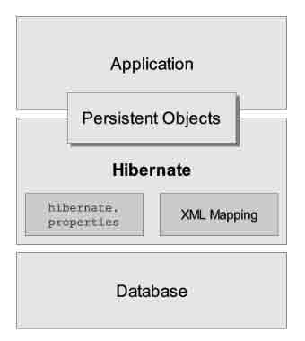
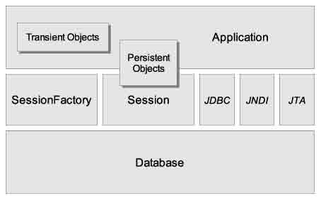

# 第 1 节 Hibernate 简介

* * *

## 一、本节目标

本节课程主要介绍【Hibernate】的相关知识，将会涉及以下内容：

> * 什么是 Hibernate

*   Hibernate 体系结构
*   Hibernate 基本 APIs
*   Hibernate 的优点

## 二、什么是 Hibernate

Hibernate 是一个开源框架，与 Struts 这种 MVC（Model-View-Controller） 框架不同的是，Hibernate 是一种 ORM（Object/Relational Mapping） 框架。

ORM 意为对象关系映射，因此 Hibernate 会在 Java 对象和关系数据库之间建立某种映射，以达到存取 Java 对象的目的，是实现持久化存储（将内存中的数据存储在关系型的数据库、磁盘文件、XML 数据文件中等等）的一种解决方案。

Hibernate 不仅管理 Java 类到数据库表的映射（包括从 Java 数据类型到 SQL 数据类型的映射），还提供数据查询和获取数据的方法，可以大幅度减少开发时人工使用 SQL 和 JDBC 处理数据的时间。这正是它的设计目标，即将软件开发人员从大量相同的数据持久层相关编程工作中解放出来。

## 三、 Hibernate 体系结构

一个简要的 Hibernate 整体体系结构大致如下图所示：

从上图可以看出，Hibernate 使用数据库（Database）和配置信息（hibernate.properties 等）来为应用程序提供持久化服务（以及持久的对象 Persistent Objects）。

我们再来看看 Hibernate 运行时的体系结构。由于 Hibernate 非常灵活，且支持多种应用方案， 所以这里我们只描述一下两种极端的情况。

*   “轻型”的体系结构方案

要求应用程序提供自己的 JDBC 连接并管理自己的事务。这种方案使用了 Hibernate API 的最小子集：

*   “全面解决”的体系结构方案

将应用层从底层的 JDBC/JTA API 中抽象出来，而让 Hibernate 来处理这些细节：

## 四、基本 APIs：

*   **SessionFactory**

    **（org.hibernate.SessionFactory）**

对于单个数据库映射关系经过编译后的内存缓存，它是线程安全且不可变的。是 Session 生成的工厂实例，也是 ConnectionProvider 的一个客户端（会用到 ConnectionProvider）。它在进程或集群的级别上，为那些在事务之前可重复使用的数据提供了选择性的二级缓存。

*   **Session（org.hibernate.Session）**

提供应用程序和持久化存储介质之间的一个单线程的会话对象，此对象生存期很短。它隐藏了 JDBC 连接，也是 Transaction 的工厂实例。对于应用的持久化对象及其集合，它提供了一个一级缓存；当遍历导航对象图或者根据持久化标识查找对象时，会用到这个一级缓存。

*   **持久化的对象及其集合**

具有持久化状态和业务功能的单线程对象，同样生存期很短。这些对象可能是普通的 JavaBeans/POJOs（Plain Ordinary Java Object），它们只能与一个 Session 相关联。一旦 Session 被关闭，它们就会脱离持久化状态，并且可以被应用程序的任何层使用（比如跟表示层打交道的 data transfer objects）

*   **瞬态（transient）、脱管**

    **状态（detached）的对象及其集合**

持久化的类目前没有和 Session 相关联的实例。他们可能是因为在被应用实例化后还没有被持久化，也可能是由于实例化它们的 Session 对象已经被关闭，从而脱离了持久化状态。

*   **事务（Transaction）**

    **（org.hibernate.Transaction）**

（可选的）它是应用程序用来指定原子操作单元范围的对象，是一个单线程的、短生存周期的对象。它使用抽象把应用从底层的 JDBC、JTA 以及 CORBA 事务中隔离开。在某些情况下，一个 Session 可能涵盖多个 Transactions 对象。尽管使用该对象是可选的，但事务的划分（无论是使用底层的 API 还是使用 Transaction 对象）都是不可选的。

*   **ConnectionProvider**

    **（org.hibernate.connection.ConnectionProvider）**

（可选的）JDBC 连接的工厂和连接池。它通过抽象把应用从底层的 DataSource 或者 DriverManager 隔离开。这并不开放给应用程序使用，但对开发者而言是可以扩展或实现的。

*   **TransactionFactory **

    **(org.hibernate.TransactionFactory)**

（可选的）生成 Transaction 对象实例的工厂。仅供开发者扩展/实现用，并不开放给应用程序使用。

*   **扩展接口（Extension Interfaces）**

Hibernate 提供了很多可选的扩展接口，你可以通过实现它们来定制你的持久层的行为。

## 五、 Hibernate 的优点

*   Hibernate 使用 Java 反射机制 而不是字节码增强程序来实现透明性。

*   Hibernate 的性能好，因为它是个轻量级框架。映射的灵活性很出色。

*   它支持各种关系数据库，从 `一对一` 到 `多对多` 的各种复杂关系。

## 六、小结

> 本次课程介绍了【Hibernate】的相关知识，为后续的 Hibernate 深入课程打下了基础。

## 七、参考文档

> * [Hibernate Architecture](http://doc.gotomao.com/doc/hibernate/hibernate3.6/doc/architecture.html)