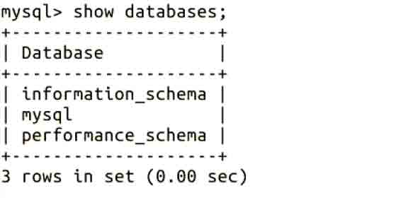
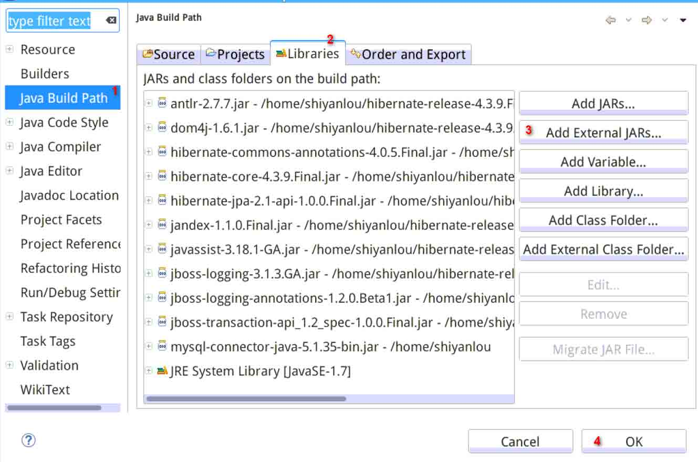
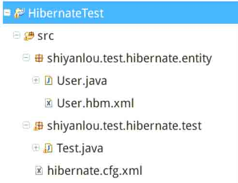
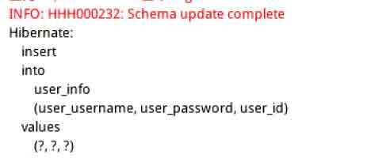
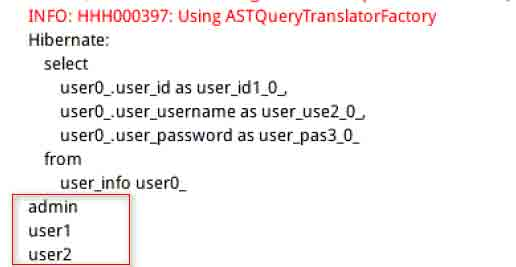
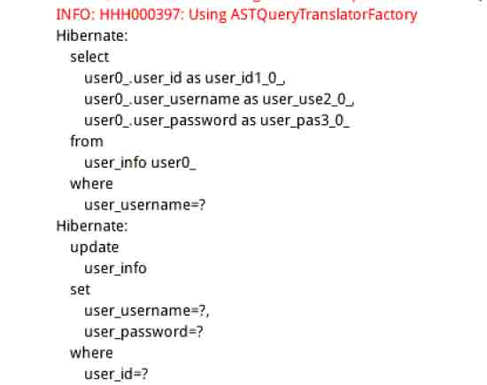
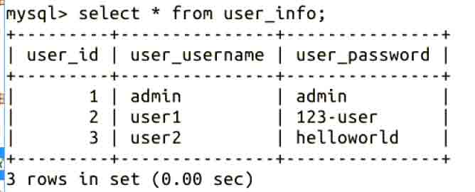
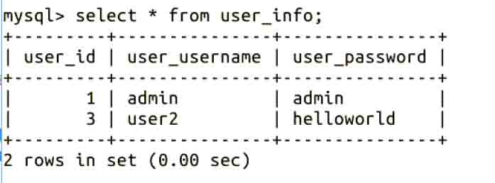

# 第 2 节 Hibernate 简单增删改查

* * *

## 一、实验环境说明

**1\. 环境登录**

无需密码自动登录，系统用户名 shiyanlou

**2\. 环境介绍**

本实验环境采用带桌面的 Ubuntu Linux 环境，实验中可能会用到桌面上的程序：

> * XfceTerminal: Linux 命令行终端，打开后会进入 Bash 环境，可以使用 Linux 命令；

*   Firefox：浏览器，可以用在需要前端界面的课程里，只需要打开环境里写的 HTML/JS 页面即可；
*   GVim：非常好用的编辑器，最简单的用法可以参考课程 [Vim 编辑器](http://www.shiyanlou.com/courses/2)。
*   Eclipse：Eclipse 是著名的跨平台的自由集成开发环境（IDE）。主要用来 Java 语言开发，但是目前亦有人通过插件使其作为 C++ 和 Python 等语言的开发工具。

**3\. 环境使用**

使用 GVim 编辑器输入实验所需的代码，然后使用 XfceTerminal 命令行环境进行编译运行，查看运行结果，运行后可以截图并分享自己的实验成果，实验楼提供的截图是后台截图，无法作弊，可以真实有效证明您已经完成了实验。

实验报告可以在个人主页中查看，其中含有每次实验的截图及笔记，以及每次实验的有效学习时间（指的是在实验桌面内操作的时间，如果没有操作，系统会记录为发呆时间）。这些都是您学习的真实性证明。

## 二、MySQL 准备

本次课程使用 MySQL 数据库。首先启动 mysql ：

```java
$ sudo service mysql start 
```

然后在终端下输入以下命令，进入到 MySQL 数据库（-u 表示用户名，比如这里的 root，-p 表示密码，这里没有密码就省略了）：

```java
$ mysql -u root 
```


查看数据库列表：



为了实验方便，我们在这里新建一个数据库并取名 hibernate 用作实验。


进入该数据库，可以看到当前数据库是空的：

```java
$ use hibernate; 
```


数据库的操作，暂时就到这里，我们现在可以着手新建项目了。

## 三、新建项目工程

> * 说明：Hibernate 以及其他必要文件已经内置在了实验环境中。

**（1）导入必要的 JAR 包**

新建一个 Java 工程，然后引入必要的 jar 包，右击项目工程，依次选择 Properties->Java Build Path->Libraries->Add External JARs。Hibernate jar 包路径为：`/home/shiyanlou/hibernate-release-4.3.9.Final/lib/required/`；mysql-connector jar 包的路径伪： `/home/shiyanlou/mysql-connector-java-5.1.35-bin.jar`。最后总的需要的包如下：



**（2）新建实体类 User.java**

这个没什么太多说的，一个用户具有：id、username、password 三个属性。

```java
package shiyanlou.test.hibernate.entity;

public class User {

    private int id;
    private String username;
    private String password;

    public int getId() {
        return id;
    }
    public void setId(int id) {
        this.id = id;
    }
    public String getUsername() {
        return username;
    }
    public void setUsername(String username) {
        this.username = username;
    }
    public String getPassword() {
        return password;
    }
    public void setPassword(String password) {
        this.password = password;
    }

} 
```

**（3）配置 hibernate.cfg.xml**

在 src 目录下，新建 hibernate.cfg.xml 文件，其配置如下：

```java
<?xml version='1.0' encoding='utf-8'?>
<!DOCTYPE hibernate-configuration PUBLIC
        "-//Hibernate/Hibernate Configuration DTD 3.0//EN"
        "http://hibernate.sourceforge.net/hibernate-configuration-3.0.dtd">

<hibernate-configuration>

    <session-factory>

        <!-- Database connection settings -->

        <!-- 表示使用 mysql 数据库驱动类 -->
        <property name="connection.driver_class">com.mysql.jdbc.Driver</property>

        <!-- jdbc 的连接 url 和数据库（使用我们之前新建的 hibernate）-->
        <property name="connection.url">jdbc:mysql://localhost:3306/hibernate</property>

        <!-- 数据库用户名 -->
        <property name="connection.username">root</property>

        <!-- 密码（这里为空） -->
        <property name="connection.password"></property>

        <!-- JDBC connection pool (use the built-in) -->
        <!-- <property name="connection.pool_size">1</property>-->

        <!-- 数据库使用的方言 -->
        <property name="dialect">org.hibernate.dialect.MySQLDialect</property>

        <!-- Echo all executed SQL to stdout -->
        <!-- 设置 打印输出 sql 语句 为真 -->
        <property name="show_sql">true</property>

        <!-- 设置格式为 sql -->
        <property name="format_sql">true</property>

        <!-- 第一次加载 hibernate 时根据实体类自动建立表结构，以后自动更新表结构 -->
        <property name="hbm2ddl.auto">update</property>         

        <!-- 映射文件 -->
        <mapping resource="shiyanlou/test/hibernate/entity/User.hbm.xml"/>

    </session-factory>

</hibernate-configuration> 
```

其中，数据库连接的 url 端口号，可以通过下面的命令来查看：


对于用户名和密码，则是：


**（4）配置 User.hbm.xml**

一个实体类对应一个映射文件，且位于同一个包（package）下。


```java
<?xml version="1.0"?>
<!DOCTYPE hibernate-mapping PUBLIC
        "-//Hibernate/Hibernate Mapping DTD 3.0//EN"
        "http://hibernate.sourceforge.net/hibernate-mapping-3.0.dtd">

<!-- 映射对应的 package -->
<hibernate-mapping package="shiyanlou.test.hibernate.entity">

    <!-- 实体类和数据库中的表对应（如果没有这个表则新建） -->
    <class name="User" table="user_info">

        <!-- id 主键 和其他属性对应表中相应的字段（这些都是在 User.java 实体类中定义的） -->
        <id name="id" column="user_id"/>
        <property name="username" column="user_username"></property>
        <property name="password" column="user_password"></property>

    </class>
</hibernate-mapping> 
```

## 四、运行

一个示例的项目结构如图所示（不一定完全一样）：



我们需要根据不同的情况，改变测试类的行为。

**（1）增**

```java
public class Test {

    @SuppressWarnings("unchecked")
    public static void main(String[] args) {

        // 获取 Hibernate 配置信息
        Configuration configuration = new Configuration().configure();

        // 根据 configuration 建立 sessionFactory
        SessionFactory sessionFactory = configuration.buildSessionFactory();

        // 开启 session（相当于开启 JDBC 的 connection）
        Session session = sessionFactory.openSession();

        // 创建并开启事务对象
        session.beginTransaction();

        // 新建对象，并赋值
        User user = new User();
        user.setId(1);
        user.setUsername("admin");
        user.setPassword("admin");

        // 保存对象
        session.save(user);

        // 提交事务
        session.getTransaction().commit();

        // 关闭 session 和 sessionFactory
        session.close();
        sessionFactory.close();
    }
} 
```

Eclipse 控制台输出：



对比查看 mysql 中的 hibernate 数据库中的 user_info 表：


你可以多新建几个测试用户，以方便实验。例如：


**（2）查**

```java
public class Test {

    @SuppressWarnings("unchecked")
    public static void main(String[] args) {

        Configuration configuration = new Configuration().configure();
        SessionFactory sessionFactory = configuration.buildSessionFactory();
        Session session = sessionFactory.openSession();
        session.beginTransaction();

        // 利用 StringBuilder 来连接查询语句
        StringBuilder hq = new StringBuilder();

        // 从 User 里面查找（注意 from 后有空格）
        // 相当于 "select * from user_info;"
        hq.append("from ").append( User.class.getName() );

        // 利用 session 建立 query
        Query query = session.createQuery( hq.toString() );

        // 序列化 query 的结果为一个 list 集合
        List<User> users = query.list();

        // 打印每一个 User 信息（这里只打印了名字，你也可以打印其他信息）
        for (User user : users) {
            System.out.println( user.getUsername() );

        }

        session.getTransaction().commit();
        session.close();
        sessionFactory.close();
    }
} 
```

Eclipse 控制台输出：



**（3）改**

假设现在我们需要把 user1 的密码改成一个比较复杂的 “123-user”。

```java
public class Test {

    @SuppressWarnings("unchecked")
    public static void main(String[] args) {
        Configuration configuration = new Configuration().configure();
        SessionFactory sessionFactory = configuration.buildSessionFactory();
        Session session = sessionFactory.openSession();
        session.beginTransaction();

        StringBuilder hq = new StringBuilder();

        // 对比查找的操作来看，因为我们需要修改指定 name 的用户密码，后面需要再添加查询条件
        // 注意 from、where 的空格，":name" 表示一个参数
        hq.append("from ").append(User.class.getName()).append(" where user_username=:name");

        Query query = session.createQuery(hq.toString());

        // 这里就设定参数 name 的值为"user1"
        query.setString("name","user1" ); 

        List<User> users = query.list();

        for (User user : users) {

            // 修改 user1 的密码
            user.setPassword("123-user");

            // 注意这里是 update
            session.update(user);
        }

        session.getTransaction().commit();
        session.close();
        sessionFactory.close();
    } 
```

Eclipse 控制台输出：



对比查看 mysql （user1 的密码已经被修改）：



另外，你也可以直接通过这样的方式实现修改：

```java
User user = new User();
user.setId(2);
user.setUsername("user1");
user.setPassword("123-user");

// update
session.update(user) 
```

**（4）删**

同修改类似，也需要先通过条件查找，再进行删除；

```java
public class Test {

    @SuppressWarnings("unchecked")
    public static void main(String[] args) {
        Configuration configuration = new Configuration().configure();
        SessionFactory sessionFactory = configuration.buildSessionFactory();
        Session session = sessionFactory.openSession();
        session.beginTransaction();

        StringBuilder hq = new StringBuilder();

        // 对比查找时候的操作来看，因为我们需要修改指定 name 的用户密码，后面需要再添加查询条件
        // 注意 from、where 的空格，":name" 表示一个参数
        hq.append("from ").append(User.class.getName()).append(" where user_username=:name");

        Query query = session.createQuery(hq.toString());

        // 这里就设定参数 name 的值为"user1"
        query.setString("name","user1" ); 

        List<User> users = query.list();

        for (User user : users) {
            // 注意这里是 delete
            session.delete(user);
        }

        session.getTransaction().commit();
        session.close();
        sessionFactory.close();
    } 
```

Eclipse 控制台输出为：


对比查看 mysql （可以看到 user1 已经被删除）：



同样的道理，你也可以这样来删除：

```java
User user = new User();
user.setId(2);

// delete
session.delete(user); 
```

## 五、小结

> 本次课程我们利用 Hibernate 实现了数据库操作的【增删改查】四大基本操作。

## 六、思考

> 考虑把【增删改查】操作封装成单独的功能类或函数，这样使用起来就很方便不用直接改代码。这也是良好的编码习惯。