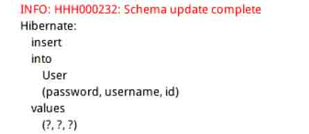

# 第 3 节 Hibernate - EJB 注解映射

* * *

## 一、实验环境说明

**1\. 环境登录**

无需密码自动登录，系统用户名 shiyanlou

**2\. 环境介绍**

本实验环境采用带桌面的 Ubuntu Linux 环境，实验中可能会用到桌面上的程序：

> * XfceTerminal: Linux 命令行终端，打开后会进入 Bash 环境，可以使用 Linux 命令；

*   Firefox：浏览器，可以用在需要前端界面的课程里，只需要打开环境里写的 HTML/JS 页面即可；
*   GVim：非常好用的编辑器，最简单的用法可以参考课程 [Vim 编辑器](http://www.shiyanlou.com/courses/2)。
*   Eclipse：Eclipse 是著名的跨平台的自由集成开发环境（IDE）。主要用来 Java 语言开发，但是目前亦有人通过插件使其作为 C++ 和 Python 等语言的开发工具。

**3\. 环境使用**

使用 GVim 编辑器输入实验所需的代码，然后使用 XfceTerminal 命令行环境进行编译运行，查看运行结果，运行后可以截图并分享自己的实验成果，实验楼提供的截图是后台截图，无法作弊，可以真实有效证明您已经完成了实验。

实验报告可以在个人主页中查看，其中含有每次实验的截图及笔记，以及每次实验的有效学习时间（指的是在实验桌面内操作的时间，如果没有操作，系统会记录为发呆时间）。这些都是您学习的真实性证明。

## 二、前言

本次课程使用 EjB 注解映射的方式，来实现上节课的示例。企业级 JavaBean（Enterprise JavaBean, EJB）是一个用来构筑企业级应用的服务器端可被管理组件。EJB 注解表达了和 Hibernate 持久化实体对象同样的概念。

## 三、新建项目工程

> * 说明：Hibernate 以及其他必要文件已经内置在了实验环境中。

**（1）导入必要的 JAR 包**

新建一个 Java 工程，然后引入必要的 jar 包，右击项目工程，依次选择 Properties->Java Build Path->Libraries->Add External JARs。Hibernate jar 包路径为：`/home/shiyanlou/hibernate-release-4.3.9.Final/lib/required/`；mysql-connector jar 包的路径伪： `/home/shiyanlou/mysql-connector-java-5.1.35-bin.jar`。最后总的需要的包如下：


**（2）新建实体类 User.java**

与上节课示例类似，一个用户具有：id（主键），以及 username、password 两个属性。不同的是这里采用的 EJB 注解方式，可以看到 User 类被 `@Entity` 注解成实体，id 被 `@Id` 注解成主键。

> `@Entity` 注解可以将一个类声明为一个实体 bean(即一个持久化 POJO 类)

> `@Id` 注解则声明了该实体 bean 的唯一标识属性（对应数据库主键 key）

```java
package shiyanlou.hibernate.ejb3;

import javax.persistence.Entity;
import javax.persistence.Id;

@Entity
// @Table(name="")
// 数据库中默认会对应生成同名的 Table
// 如果要修改 Table 名，使用 @Table(name="")
// "" 内为自定义的 Table 名
public class User {

    private int id;
    private String username;
    private String password;

    @Id
    public int getId() {
        return id;
    }
    public void setId(int id) {
        this.id = id;
    }
    public String getUsername() {
        return username;
    }
    public void setUsername(String username) {
        this.username = username;
    }
    public String getPassword() {
        return password;
    }
    public void setPassword(String password) {
        this.password = password;
    }

} 
```

**（3）配置 hibernate.cfg.xml**

在 src 目录下，新建 hibernate.cfg.xml 文件，其配置如下：

```java
<?xml version='1.0' encoding='utf-8'?>
<!DOCTYPE hibernate-configuration PUBLIC
        "-//Hibernate/Hibernate Configuration DTD 3.0//EN"
        "http://hibernate.sourceforge.net/hibernate-configuration-3.0.dtd">

<hibernate-configuration>

    <session-factory>

        <!-- Database connection settings -->

        <!-- 表示使用 mysql 数据库驱动类 -->
        <property name="connection.driver_class">com.mysql.jdbc.Driver</property>

        <!-- jdbc 的连接 url 和数据库（使用我们之前新建的 hibernate）-->
        <property name="connection.url">jdbc:mysql://localhost:3306/hibernate</property>

        <!-- 数据库用户名 -->
        <property name="connection.username">root</property>

        <!-- 密码（这里为空） -->
        <property name="connection.password"></property>

        <!-- 数据库使用的方言 -->
        <property name="dialect">org.hibernate.dialect.MySQLDialect</property>

        <!-- Echo all executed SQL to stdout -->
        <!-- 设置 打印输出 sql 语句 为真 -->
        <property name="show_sql">true</property>

        <!-- 设置格式为 sql -->
        <property name="format_sql">true</property>

        <!-- 第一次加载 hibernate 时根据实体类自动建立表结构，以后自动更新表结构 -->
        <property name="hbm2ddl.auto">update</property>         

        <!-- 映射文件 -->
        <!-- <mapping resource="shiyanlou/test/hibernate/entity/User.hbm.xml"/> -->

        <!-- 这里是最明显的不同，映射变成了 User 实体类 -->
        <mapping class="shiyanlou.hibernate.ejb3.User" />

    </session-factory>

</hibernate-configuration> 
```

可以看到，最大的变化就是映射的变化，由于我们采用了 EJB 注解的方式，因此不再需要 User.hbm.xml 来完成映射，从而映射信息也从 User.hbm.xml 变成了 User 这个实体类。

## 四、运行

首先要确保 MySQL 数据库中有 hibernate 这个数据库（建立数据库的具体方法见上一节课程），然后编写一个测试类，UserTest.java：

**（1）增**

```java
package shiyanlou.hibernate.ejb3;

import org.hibernate.Session;
import org.hibernate.SessionFactory;
import org.hibernate.cfg.Configuration;

import shiyanlou.hibernate.ejb3.User;

public class UserTest {

    public static void main(String[] args) {
        Configuration configuration = new Configuration().configure();
        SessionFactory sessionFactory = configuration.buildSessionFactory();
        Session session = sessionFactory.openSession();
        session.beginTransaction();

        User user = new User();
        user.setId(1);
        user.setUsername("admin");
        user.setPassword("admin");

        session.save(user);

        session.getTransaction().commit();
        session.close();
        sessionFactory.close();
    }

} 
```

Eclipse 控制台输出：



前面提到过，数据库中是生成同名的表，对比查看：


## 五、小结

> 本次课程我们利用 EJB 注解映射的方式来实现上一节课的内容。

## 六、思考

> 利用 EJB 注解映射，实现其他的（删、查、改）操作。