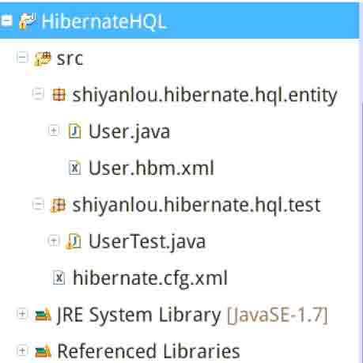
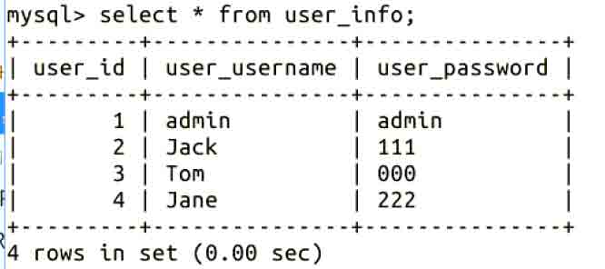
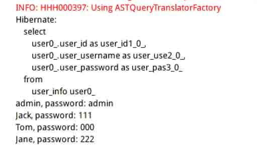

# 第 4 节 Hibernate - HQL 查询

* * *

## 一、实验环境说明

**1\. 环境登录**

无需密码自动登录，系统用户名 shiyanlou

**2\. 环境介绍**

本实验环境采用带桌面的 Ubuntu Linux 环境，实验中可能会用到桌面上的程序：

> * XfceTerminal: Linux 命令行终端，打开后会进入 Bash 环境，可以使用 Linux 命令；

*   Firefox：浏览器，可以用在需要前端界面的课程里，只需要打开环境里写的 HTML/JS 页面即可；
*   GVim：非常好用的编辑器，最简单的用法可以参考课程 [Vim 编辑器](http://www.shiyanlou.com/courses/2)。
*   Eclipse：Eclipse 是著名的跨平台的自由集成开发环境（IDE）。主要用来 Java 语言开发，但是目前亦有人通过插件使其作为 C++ 和 Python 等语言的开发工具。

**3\. 环境使用**

使用 GVim 编辑器输入实验所需的代码，然后使用 XfceTerminal 命令行环境进行编译运行，查看运行结果，运行后可以截图并分享自己的实验成果，实验楼提供的截图是后台截图，无法作弊，可以真实有效证明您已经完成了实验。

实验报告可以在个人主页中查看，其中含有每次实验的截图及笔记，以及每次实验的有效学习时间（指的是在实验桌面内操作的时间，如果没有操作，系统会记录为发呆时间）。这些都是您学习的真实性证明。

## 二、前言

Hibernate 提供了强大的查询系统，使用 Hibernate 有多种查询方法可以选择：可以使用 Hibernate 的 HQL 查询，也可以使用条件查询，甚至可以使用原生的 SQL 查询语句。

HQL 语言看上去很像 SQL。但是 HQL 是一种面向对象的查询语句，它的操作对象是类、实例、属性等，而 SQL 的操作对象是数据表、列等数据库对象。由于 HQL 是完全面向对象的查询语句，因此可以支持继承、多态等特性。

> 执行 HQL 查询的步骤：

>1、获得 Hibernate Session 对象

>2、编写 HQL 语句

>3、调用 Session 的 createQuery() 方法创建查询对象

>4、如果 HQL 语句包含参数，则调用 Query 的 setXxx 方法为参数赋值

>5、调用 Query 对象的 list 等方法返回查询结果。

## 三、HQL 查询

（1）from 子句

Hibernate 中最简单的查询语句的形式如 `from table_name`，例如：

```java
from user_info 
```

有时候需要使用到别名：

```java
from user_info as u 
```

（2）where 子句

where 子句允许你将返回的实例列表的范围缩小。如果没有指定别名，你可以使用属性名来直接引用属性：

```java
from user_info where name='admin' 
```

如果指派了别名，需要使用完整的属性名：

```java
from user_info as u where u.name='admin' 
```

（3）select 子句

select 子句会选择将哪些对象与属性返回到查询结果集中。

```java
select u.username from user_info as u 
```

（4）

## 四、SQL 查询

可以直接使用原生 SQL 语句格式进行查询。

```java
SQLQuery q = session.createSQLQuery("select * from user_info").addEntity(User.class); 
```

## 五、HQL 查询示例

这里我们重用以前的例子，项目结构如下：



实际上在 “Hibernate 增删改查” 的课程中，我们已经涉及到了 HQL。具体步骤如下：

**（1）导入必要的 JAR 包**

新建一个 Java 工程，然后引入必要的 jar 包，右击项目工程，依次选择 Properties->Java Build Path->Libraries->Add External JARs。Hibernate jar 包路径为：`/home/shiyanlou/hibernate-release-4.3.9.Final/lib/required/`；mysql-connector jar 包的路径伪： `/home/shiyanlou/mysql-connector-java-5.1.35-bin.jar`。最后总的需要的包如下：


**（2）新建实体类 User.java**

```java
package shiyanlou.test.hibernate.entity;

public class User {

    private int id;
    private String username;
    private String password;

    public int getId() {
        return id;
    }
    public void setId(int id) {
        this.id = id;
    }
    public String getUsername() {
        return username;
    }
    public void setUsername(String username) {
        this.username = username;
    }
    public String getPassword() {
        return password;
    }
    public void setPassword(String password) {
        this.password = password;
    }

} 
```

**（3）配置 hibernate.cfg.xml**

在 src 目录下，新建 hibernate.cfg.xml 文件，其配置如下：

```java
<?xml version='1.0' encoding='utf-8'?>
<!DOCTYPE hibernate-configuration PUBLIC
        "-//Hibernate/Hibernate Configuration DTD 3.0//EN"
        "http://hibernate.sourceforge.net/hibernate-configuration-3.0.dtd">

<hibernate-configuration>

    <session-factory>

        <!-- Database connection settings -->

        <!-- 表示使用 mysql 数据库驱动类 -->
        <property name="connection.driver_class">com.mysql.jdbc.Driver</property>

        <!-- jdbc 的连接 url 和数据库（使用我们之前新建的 hibernate）-->
        <property name="connection.url">jdbc:mysql://localhost:3306/hibernate</property>

        <!-- 数据库用户名 -->
        <property name="connection.username">root</property>

        <!-- 密码（这里为空） -->
        <property name="connection.password"></property>

        <!-- JDBC connection pool (use the built-in) -->
        <!-- <property name="connection.pool_size">1</property>-->

        <!-- 数据库使用的方言 -->
        <property name="dialect">org.hibernate.dialect.MySQLDialect</property>

        <!-- Echo all executed SQL to stdout -->
        <!-- 设置 打印输出 sql 语句 为真 -->
        <property name="show_sql">true</property>

        <!-- 设置格式为 sql -->
        <property name="format_sql">true</property>

        <!-- 第一次加载 hibernate 时根据实体类自动建立表结构，以后自动更新表结构 -->
        <property name="hbm2ddl.auto">update</property>         

        <!-- 映射文件 -->
        <mapping resource="shiyanlou/hibernate/hql/entity/User.hbm.xml"/>

    </session-factory>

</hibernate-configuration> 
```

**（4）配置 User.hbm.xml**

一个实体类对应一个映射文件，且位于同一个包（package）下。

```java
<?xml version="1.0"?>
<!DOCTYPE hibernate-mapping PUBLIC
        "-//Hibernate/Hibernate Mapping DTD 3.0//EN"
        "http://hibernate.sourceforge.net/hibernate-mapping-3.0.dtd">

<!-- 映射对应的 package -->
<hibernate-mapping package="shiyanlou.hibernate.hql.entity">

    <!-- 实体类和数据库中的表对应（如果没有这个表则新建） -->
    <class name="User" table="user_info">

        <!-- id 主键和其他属性对应表中相应的字段（这些都是在 User.java 实体类中定义的） -->
        <id name="id" column="user_id"/>
        <property name="username" column="user_username"></property>
        <property name="password" column="user_password"></property>

    </class>
</hibernate-mapping> 
```

**（5）测试类**

主要是测试类 UserTest.java 的不同，在进行查询之前，确保表中有数据以方便查询，例如：



```java
public class UserTest {
    public static void main(String[] args) {

        Configuration cfg = new Configuration().configure();

        SessionFactory sf = cfg.buildSessionFactory();

        Session session = sf.openSession();

        session.beginTransaction();

        // 1\. 普通查询
        Query q = session.createQuery(" from User as u");

        // 2\. 条件查询
        //Query q = session.createQuery(" from User as u where u.username = ?");
        //q.setParameter(0, "Jack");

        // 3\. 原生 SQL 查询
        //SQLQuery q = session.createSQLQuery("select * from user_info").addEntity(User.class);

        // 4.criteria 查询
/*        Criteria q = session.createCriteria(User.class);
        Criterion cc = Restrictions.between("id", 1, 3);
        Criterion cc1 = Restrictions.idEq(2);   
        q.add(cc);
        q.add(cc1);*/

        List<User> list = q.list();
        for (User e : list) {
            System.out.println(e.getUsername() + ", password: " + e.getPassword());
            //System.out.println( e.getPassword() );
        }

        session.getTransaction().commit();
        session.close();
        sf.close();

    }
} 
```

运行结果示例：



## 六、小结

> 本次课程我们利用 EJB 注解映射的方式来实现上一节课的内容。

## 七、参考文档

> * [Hibernate 读书笔记-----HQL 查询](http://www.cnblogs.com/chenssy/archive/2012/07/17/2594919.html)

*   [Hibernate 查询语言](http://oss.org.cn/ossdocs/framework/hibernate/reference-v3_zh-cn/queryhql.html)

## 八、思考

> 利用 HQL 实现比较复杂的查询操作。