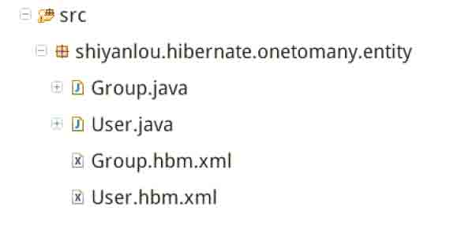
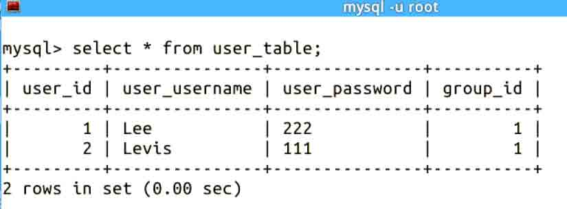

# 第 5 节 Hibernate 一对多关系映射

* * *

## 一、实验环境说明

**1\. 环境登录**

无需密码自动登录，系统用户名 shiyanlou

**2\. 环境介绍**

本实验环境采用带桌面的 Ubuntu Linux 环境，实验中可能会用到桌面上的程序：

> * XfceTerminal: Linux 命令行终端，打开后会进入 Bash 环境，可以使用 Linux 命令；

*   Firefox：浏览器，可以用在需要前端界面的课程里，只需要打开环境里写的 HTML/JS 页面即可；
*   GVim：非常好用的编辑器，最简单的用法可以参考课程 [Vim 编辑器](http://www.shiyanlou.com/courses/2)。
*   Eclipse：Eclipse 是著名的跨平台的自由集成开发环境（IDE）。主要用来 Java 语言开发，但是目前亦有人通过插件使其作为 C++ 和 Python 等语言的开发工具。

**3\. 环境使用**

使用 GVim 编辑器输入实验所需的代码，然后使用 XfceTerminal 命令行环境进行编译运行，查看运行结果，运行后可以截图并分享自己的实验成果，实验楼提供的截图是后台截图，无法作弊，可以真实有效证明您已经完成了实验。

实验报告可以在个人主页中查看，其中含有每次实验的截图及笔记，以及每次实验的有效学习时间（指的是在实验桌面内操作的时间，如果没有操作，系统会记录为发呆时间）。这些都是您学习的真实性证明。

## 二、新建项目工程

我们使用的例子和之前的都是类似的，或者基于以前的例子改变、增加一些其他东西。因此，你应该比较熟悉。本次讲解 Hibernate 一对多的关系映射，场景假设为：一个群组对应多个用户。

> * 说明：Hibernate 以及其他必要文件已经内置在了实验环境中。

**（1）导入必要的 JAR 包**

新建一个 Java 工程，然后引入必要的 jar 包，右击项目工程，依次选择 Properties->Java Build Path->Libraries->Add External JARs。Hibernate jar 包路径为：`/home/shiyanlou/hibernate-release-4.3.9.Final/lib/required/`；mysql-connector jar 包的路径伪： `/home/shiyanlou/mysql-connector-java-5.1.35-bin.jar`。最后总的需要的包如下：


**（2）新建相关实体类**

这个没什么太多说的，一个用户具有：id（主键），以及 username、password 两个属性。

```java
package shiyanlou.test.hibernate.entity;

public class User {

    private int id;
    private String username;
    private String password;

    public int getId() {
        return id;
    }
    public void setId(int id) {
        this.id = id;
    }
    public String getUsername() {
        return username;
    }
    public void setUsername(String username) {
        this.username = username;
    }
    public String getPassword() {
        return password;
    }
    public void setPassword(String password) {
        this.password = password;
    }

} 
```

群组 Group.java，包含 id（主键），groupname 群组名属性，以及对应多个 User。

```java
package shiyanlou.hibernate.onetomany.entity;

import java.util.Set;

public class Group {

    private int id;
    private String groupname;
    private Set<User> users;

    public int getId() {
        return id;
    }
    public void setId(int id) {
        this.id = id;
    }
    public String getGroupname() {
        return groupname;
    }
    public void setGroupname(String groupname) {
        this.groupname = groupname;
    }
    public Set<User> getUsers() {
        return users;
    }
    public void setUsers(Set<User> users) {
        this.users = users;
    }
} 
```

**（3）配置 hibernate.cfg.xml**

在 src 目录下，新建 hibernate.cfg.xml 文件，其配置如下：

```java
<?xml version='1.0' encoding='utf-8'?>
<!DOCTYPE hibernate-configuration PUBLIC
        "-//Hibernate/Hibernate Configuration DTD 3.0//EN"
        "http://hibernate.sourceforge.net/hibernate-configuration-3.0.dtd">

<hibernate-configuration>

    <session-factory>

        <!-- Database connection settings -->

        <!-- 表示使用 mysql 数据库驱动类 -->
        <property name="connection.driver_class">com.mysql.jdbc.Driver</property>

        <!-- jdbc 的连接 url 和数据库（使用我们之前新建的 hibernate）-->
        <property name="connection.url">jdbc:mysql://localhost:3306/hibernate</property>

        <!-- 数据库用户名 -->
        <property name="connection.username">root</property>

        <!-- 密码（这里为空） -->
        <property name="connection.password"></property>

        <!-- 数据库使用的方言 -->
        <property name="dialect">org.hibernate.dialect.MySQLDialect</property>

        <!-- Echo all executed SQL to stdout -->
        <!-- 设置 控制台输出 sql 语句 为真 -->
        <property name="show_sql">true</property>

        <!-- 设置格式为 sql -->
        <property name="format_sql">true</property>

        <!-- 第一次加载 hibernate 时根据实体类自动建立表结构，以后自动更新表结构 -->
        <property name="hbm2ddl.auto">update</property>         

        <!-- 映射文件 -->
        <mapping resource="shiyanlou/hibernate/onetomany/entity/User.hbm.xml"/>
        <mapping resource="shiyanlou/hibernate/onetomany/entity/Group.hbm.xml"/>

    </session-factory>

</hibernate-configuration> 
```

**（4）配置 User.hbm.xml**

一个实体类对应一个映射文件，且位于同一个包（package）下。



首先是 `User.hbm.xml` 文件：

```java
<?xml version="1.0"?>
<!DOCTYPE hibernate-mapping PUBLIC
        "-//Hibernate/Hibernate Mapping DTD 3.0//EN"
        "http://hibernate.sourceforge.net/hibernate-mapping-3.0.dtd">

<!-- 映射对应的 package -->
<hibernate-mapping package="shiyanlou.hibernate.onetomany.entity">

    <!-- class 和数据库中 table 对应（如果没有这个表则新建） -->
    <class name="User" table="user_table">

        <!-- id 主键，设为自增 -->
        <id name="id" column="user_id">
            <generator class="native"></generator>
        </id>
        <property name="username" column="user_username"></property>
        <property name="password" column="user_password"></property>        
    </class>
</hibernate-mapping> 
```

接下来，我们来看看 `Group.hbm.xml` 文件：

```java
<?xml version="1.0"?>
<!DOCTYPE hibernate-mapping PUBLIC
        "-//Hibernate/Hibernate Mapping DTD 3.0//EN"
        "http://hibernate.sourceforge.net/hibernate-mapping-3.0.dtd">

<hibernate-mapping package="shiyanlou.hibernate.onetomany.entity">
    <class name="Group" table="group_table">
        <id name="id" column="group_id">
            <generator class="native"></generator>
        </id>
        <property name="groupname" column="group_name"></property>

        <!-- 重点关注这里 -->
        <!-- Set 为我们在 Group.java 中定义的集合 -->
        <set name="users" >

             <!-- 外键名称 -->
             <key column="group_id" ></key>

             <!-- 一对多关系对应的 class -->
             <one-to-many class="shiyanlou.hibernate.onetomany.entity.User" />  
        </set>  

    </class>
</hibernate-mapping> 
```

## 三、编写测试类

```java
package shiyanlou.hibernate.onetomany.test;

import java.util.HashSet;
import java.util.Set;
import org.hibernate.Session;
import org.hibernate.SessionFactory;
import org.hibernate.cfg.Configuration;

import shiyanlou.hibernate.onetomany.entity.Group;
import shiyanlou.hibernate.onetomany.entity.User;

public class UserTest {

    public static void main(String[] args) {

        Configuration cfg = new Configuration().configure();
        SessionFactory sf = cfg.buildSessionFactory();
        Session session = sf.openSession();
        session.beginTransaction();

        // 新建一个 LOL 群组
        Group group = new Group();
        group.setGroupname("LOL_Group");

        // 新建两个用户
        Set<User> users = new HashSet<User>();
        User user1 = new User();
        user1.setUsername("Levis");
        user1.setPassword("111");
        User user2 = new User();
        user2.setUsername("Lee");
        user2.setPassword("222");

        users.add(user1);
        users.add(user2);

        // LOL 群组包含对应这两个用户
        group.setUsers(users);

        // 保存相关对象
        for (User user : users) {
            session.save(user);
        }
        session.save(group);

        session.getTransaction().commit();
        session.close();
        sf.close();
    }
} 
```

## 四、运行结果示例

Eclipse 控制台输出：


我们可以切换到 mysql 下，查看两张 table：




## 五、小结

> 本次课程我们学习了 Hibernate 一对多的关系映射。