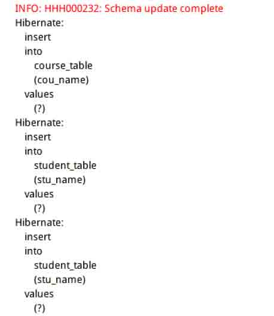
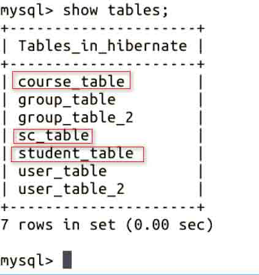
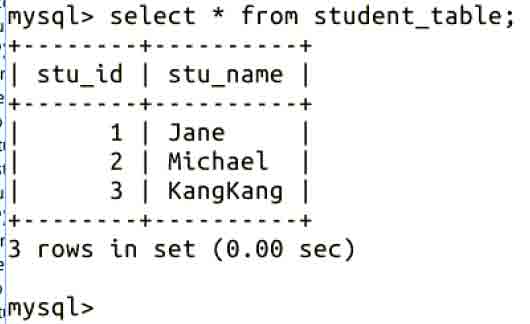
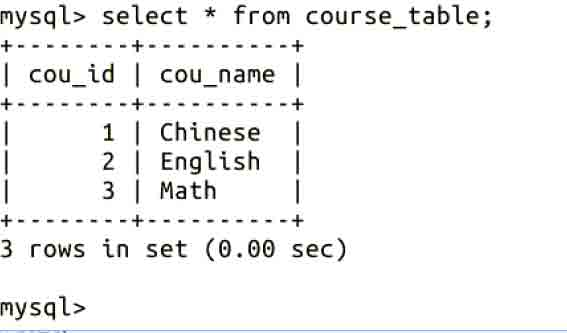
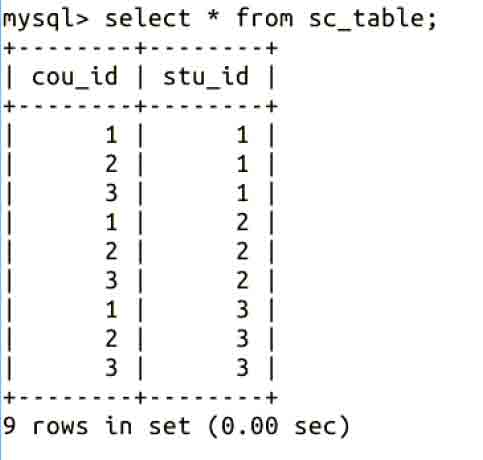

# 第 7 节 Hibernate 多对多关系映射

* * *

## 一、实验环境说明

**1\. 环境登录**

无需密码自动登录，系统用户名 shiyanlou

**2\. 环境介绍**

本实验环境采用带桌面的 Ubuntu Linux 环境，实验中可能会用到桌面上的程序：

> * XfceTerminal: Linux 命令行终端，打开后会进入 Bash 环境，可以使用 Linux 命令；

*   Firefox：浏览器，可以用在需要前端界面的课程里，只需要打开环境里写的 HTML/JS 页面即可；
*   GVim：非常好用的编辑器，最简单的用法可以参考课程 [Vim 编辑器](http://www.shiyanlou.com/courses/2)。
*   Eclipse：Eclipse 是著名的跨平台的自由集成开发环境（IDE）。主要用来 Java 语言开发，但是目前亦有人通过插件使其作为 C++ 和 Python 等语言的开发工具。

**3\. 环境使用**

使用 GVim 编辑器输入实验所需的代码，然后使用 XfceTerminal 命令行环境进行编译运行，查看运行结果，运行后可以截图并分享自己的实验成果，实验楼提供的截图是后台截图，无法作弊，可以真实有效证明您已经完成了实验。

实验报告可以在个人主页中查看，其中含有每次实验的截图及笔记，以及每次实验的有效学习时间（指的是在实验桌面内操作的时间，如果没有操作，系统会记录为发呆时间）。这些都是您学习的真实性证明。

## 二、新建项目工程

本节课程我们介绍 Hibernate 多对多的关系映射。我们的场景假设为：一个学生可以选择多个课程，一个课程也可以包含多个学生，这里是双向关联。

> * 说明：Hibernate 以及其他必要文件已经内置在了实验环境中。

**（1）导入必要的 JAR 包**

新建一个 Java 工程，然后引入必要的 jar 包，右击项目工程，依次选择 Properties->Java Build Path->Libraries->Add External JARs。Hibernate jar 包路径为：`/home/shiyanlou/hibernate-release-4.3.9.Final/lib/required/`；mysql-connector jar 包的路径伪： `/home/shiyanlou/mysql-connector-java-5.1.35-bin.jar`。最后总的需要的包如下：


**（2）新建相关实体对象**

一个学生具有：id（主键），name 属性以及 Course 关联。

```java
package shiyanlou.hibernate.manytomany.entity;

import java.util.Set;

public class Student {

    private int  stu_id;
    private String stu_name;
    private Set<Course> courses;

    public int getStu_id() {
        return stu_id;
    }
    public void setStu_id(int stu_id) {
        this.stu_id = stu_id;
    }
    public String getStu_name() {
        return stu_name;
    }
    public void setStu_name(String stu_name) {
        this.stu_name = stu_name;
    }
    public Set<Course> getCourses() {
        return courses;
    }
    public void setCourses(Set<Course> courses) {
        this.courses = courses;
    }
} 
```

同理 Course.java，包含 id（主键），name 课程名属性，Student 关联。

```java
package shiyanlou.hibernate.manytomany.entity;

import java.util.Set;

public class Course {

    private int cou_id;
    private String cou_name;
    private Set<Student> students;

    public int getCou_id() {
        return cou_id;
    }
    public void setCou_id(int cou_id) {
        this.cou_id = cou_id;
    }
    public String getCou_name() {
        return cou_name;
    }
    public void setCou_name(String cou_name) {
        this.cou_name = cou_name;
    }
    public Set<Student> getStudents() {
        return students;
    }
    public void setStudents(Set<Student> students) {
        this.students = students;
    }
} 
```

**（3）配置 hibernate.cfg.xml**

在 src 目录下，新建 hibernate.cfg.xml 文件，其配置如下：

```java
<?xml version='1.0' encoding='utf-8'?>
<!DOCTYPE hibernate-configuration PUBLIC
        "-//Hibernate/Hibernate Configuration DTD 3.0//EN"
        "http://hibernate.sourceforge.net/hibernate-configuration-3.0.dtd">

<hibernate-configuration>

    <session-factory>

        <!-- Database connection settings -->

        <!-- 表示使用 mysql 数据库驱动类 -->
        <property name="connection.driver_class">com.mysql.jdbc.Driver</property>

        <!-- jdbc 的连接 url 和数据库（使用我们之前新建的 hibernate）-->
        <property name="connection.url">jdbc:mysql://localhost:3306/hibernate</property>

        <!-- 数据库用户名 -->
        <property name="connection.username">root</property>

        <!-- 密码（这里为空） -->
        <property name="connection.password"></property>

        <!-- 数据库使用的方言 -->
        <property name="dialect">org.hibernate.dialect.MySQLDialect</property>

        <!-- Echo all executed SQL to stdout -->
        <!-- 设置 控制台输出 sql 语句 为真 -->
        <property name="show_sql">true</property>

        <!-- 设置格式为 sql -->
        <property name="format_sql">true</property>

        <!-- 第一次加载 hibernate 时根据实体类自动建立表结构，以后自动更新表结构 -->
        <property name="hbm2ddl.auto">update</property>         

        <!-- 映射文件 -->
        <mapping resource="shiyanlou/hibernate/manytomany/entity/Course.hbm.xml"/>
        <mapping resource="shiyanlou/hibernate/manytomany/entity/Student.hbm.xml"/>

    </session-factory>

</hibernate-configuration> 
```

**（4）配置 Student.hbm.xml**

首先是 `Student.hbm.xml` 文件：

```java
<?xml version="1.0"?>
<!DOCTYPE hibernate-mapping PUBLIC
        "-//Hibernate/Hibernate Mapping DTD 3.0//EN"
        "http://hibernate.sourceforge.net/hibernate-mapping-3.0.dtd">

<!-- 注意 package 的路径变化 -->
<hibernate-mapping package="shiyanlou.hibernate.manytomany.entity">

    <!-- class 和 table 对应 -->
    <class name="Student" table="student_table">

        <!-- 设置 id 自增 -->
        <id name="stu_id" column="stu_id">
            <generator class="native"></generator>
        </id>
        <property name="stu_name" column="stu_name"></property>

        <!-- cascade="save-update"：表示在保存和更新当前对象时，级联保存和更新附属对象 -->
        <!-- inverse="true"：表示该对象不维护关联关系（一般只由一边来维护，下文会提及由 Course 来维护） -->
        <!-- table="sc_table"：表示中间表 -->
        <set name="courses" cascade="save-update" inverse="true" table="sc_table">  

            <!-- column 为中间表参照 student_table 的外键 -->
            <key column="stu_id" not-null="true"></key>  

            <!-- 多对多的关系映射-->
            <many-to-many class="Course" column="cou_id"></many-to-many>        
        </set>  

    </class>
</hibernate-mapping> 
```

**（5）配置 Course.hbm.xml**

接下来，我们来看看 `Course.hbm.xml` 文件：

```java
<?xml version="1.0"?>
<!DOCTYPE hibernate-mapping PUBLIC
        "-//Hibernate/Hibernate Mapping DTD 3.0//EN"
        "http://hibernate.sourceforge.net/hibernate-mapping-3.0.dtd">

<!-- 注意 package 的路径变化 -->
<hibernate-mapping package="shiyanlou.hibernate.manytomany.entity">

    <class name="Course" table="course_table">

        <!-- 设置 id 自增 -->
        <id name="cou_id" column="cou_id">
            <generator class="native"></generator>
        </id>
        <property name="cou_name" column="cou_name"></property>

        <!-- 注意这里没有设置 inverse，表示由  Course 来维护关联关系-->
        <set name="students" cascade="save-update" table="sc_table">
             <key column="cou_id" not-null="true"></key>
             <many-to-many class="Student" column="stu_id" ></many-to-many>  
        </set> 
    </class>

</hibernate-mapping> 
```

## 三、编写测试类

测试的代码如下：

```java
package shiyanlou.hibernate.manytomany.test;

import java.util.HashSet;
import java.util.Set;
import org.hibernate.Session;
import org.hibernate.SessionFactory;
import org.hibernate.cfg.Configuration;

import shiyanlou.hibernate.manytomany.entity.Course;
import shiyanlou.hibernate.manytomany.entity.Student;

public class Test {

    public static void main(String[] args) {

        Configuration cfg = new Configuration().configure();
        SessionFactory sf = cfg.buildSessionFactory();
        Session session = sf.openSession();
        session.beginTransaction();

        // 新建三门课程
        Set<Course> courses = new HashSet<Course>();
        Course c1 = new Course();
        c1.setCou_name("Chinese");
        Course c2 = new Course();
        c2.setCou_name("English");
        Course c3 = new Course();
        c3.setCou_name("Math");
        courses.add(c1);
        courses.add(c2);
        courses.add(c3);

        // 新建三个学生
        Set<Student> students = new HashSet<Student>();
        Student s1 = new Student();
        s1.setStu_name("Michael");
        Student s2 = new Student();
        s2.setStu_name("KangKang");
        Student s3 = new Student();
        s3.setStu_name("Jane");
        students.add(s1);
        students.add(s2);
        students.add(s3);

        // 将三个学生都关联到每一门课程中
        c1.setStudents(students);
        c2.setStudents(students);
        c3.setStudents(students);

        // 保存相关对象
        session.save(c1);
        session.save(c2);
        session.save(c3);

        session.getTransaction().commit();
        session.close();
        sf.close();
    }

} 
```

## 四、运行结果

Eclipse 控制台输出（输出内容较长，截图只是部分内容）：



我们可以查看是否生成了指定的 table：



再检查，各个 table 中的内容：

`student_table`：



`course_table`：



`sc_table`：



这样就完成了多对多的关系映射。

## 五、小结

> 本次课程我们学习了 Hibernate 多对多的关系映射。