# 第 1 节 Java 8 新特性（一）

## 一、实验简介

Java 8 是近年来最后起来的一个 Java 编程语言发行版本。Oracle 在 2014 年 3 月发布了它。该版本为 Java 带来了许多新特性，是一个具有重大改变的版本。

本课程适用于 Java 初学者或者是具有一定编程经验的开发者，学完本课程的感觉就像为自己的技能“打了个补丁”。因此在学习之前，仍然建议你具有 Java 编程基础。

本节内容主要为你讲解 Lambda 表达式和方法引用两个知识点。

### 1.1 知识点

*   Lambda 表达式的含义及使用方法
*   方法引用

### 1.2 准备工作

常言道：工欲善其事，必先利其器。为了能够正常地利用 Java 8 带来的特性，我们需要使用 JRE 8.0 版本（JDK 8.0）作为我们的编译运行环境。实验楼中的 Eclipse 默认使用 JavaSE 1.7，在本实验中我们需要将其修改为 JavaSE 1.8。

#### 1.2.1 创建项目

首先请双击桌面上的 Eclipse 图标，打开 Eclipse。然后在菜单中点击`File`->`New`->`Other`。

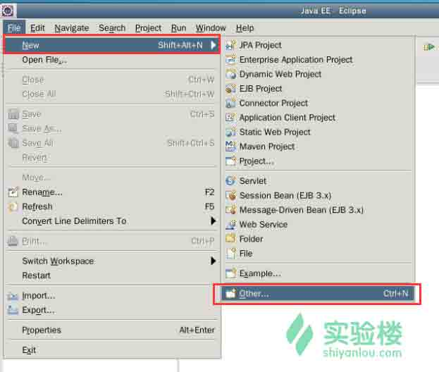

在弹出的对话框中选择`Java Project`，然后点击`Next`进入下一步。

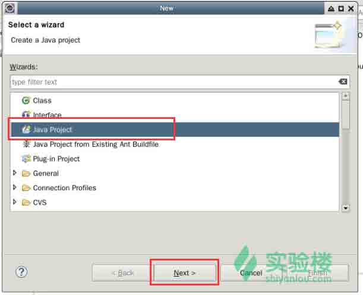

在新建项目对话框中填入项目名`HelloJava8`，并在下方的 JRE 设置中选择`Configure JREs`。

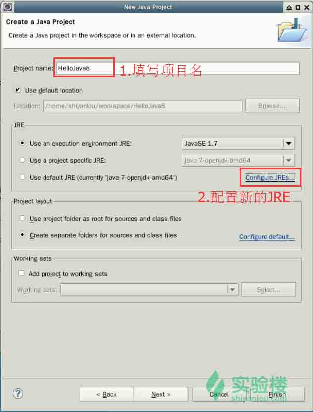

在弹出的对话框中点击 `Add` 按钮。

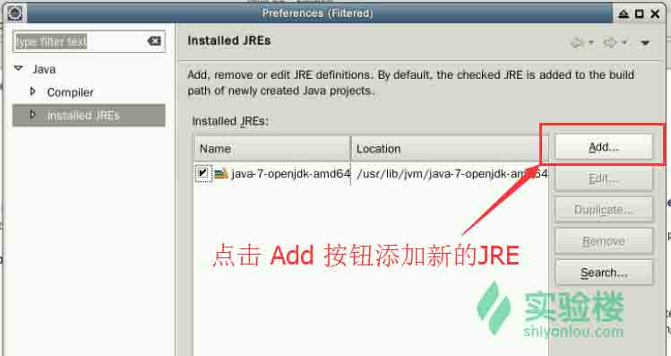

接着选择`Standard VM`，点击`Next`按钮进入下一步。


在 Add JRE 对话框中，点击`Directory`按钮添加 JRE 的目录。

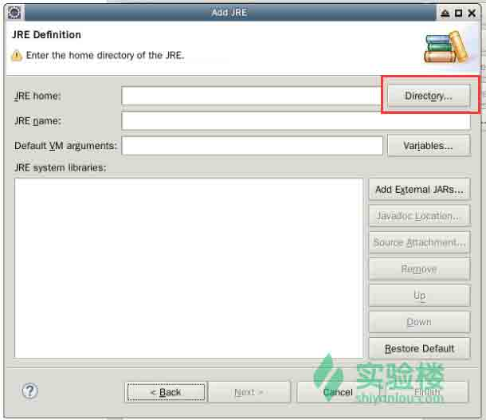

现在你需要选中`/usr/lib/jvm/java-8-oracle`这个目录。

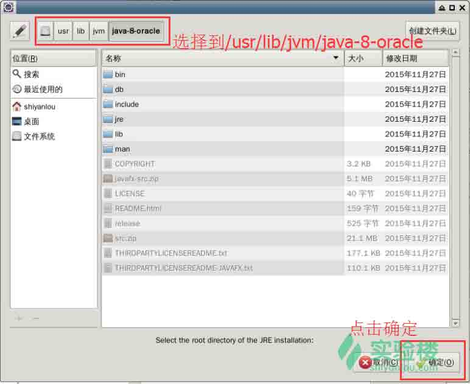

随着目录设置的完成，相关的选项已经被加载进来了。点击`Finish`按钮完成配置。

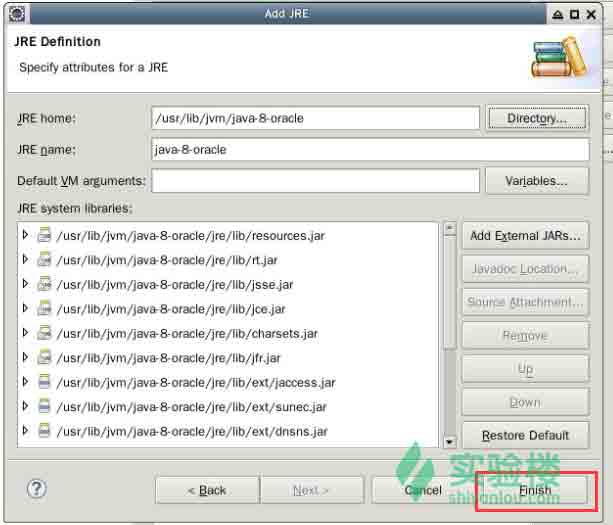

回到项目属性对话框，将项目的的 JRE 设置更改为下面新添加的 java-8 版本。

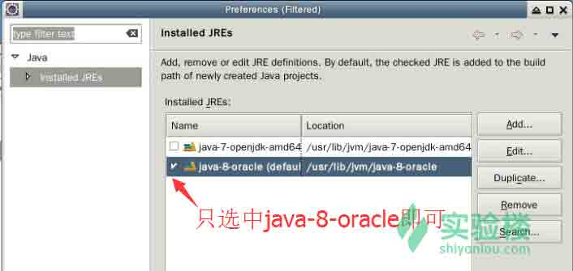

修改完成后，回到 `New Java Project` 对话框中，将 JRE 的设置项里的 `Use a project specific JRE` 选项选中，右侧的下拉菜单里选择 `java-8-oracke` 。

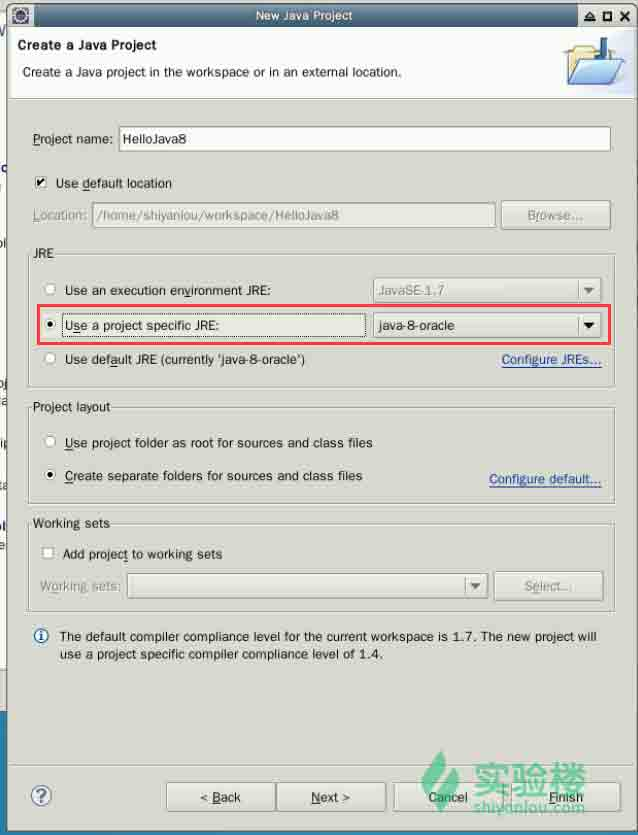

接着点击 `Next` 按钮进入到下一步，再点击 `Finish`按钮完成项目的创建。

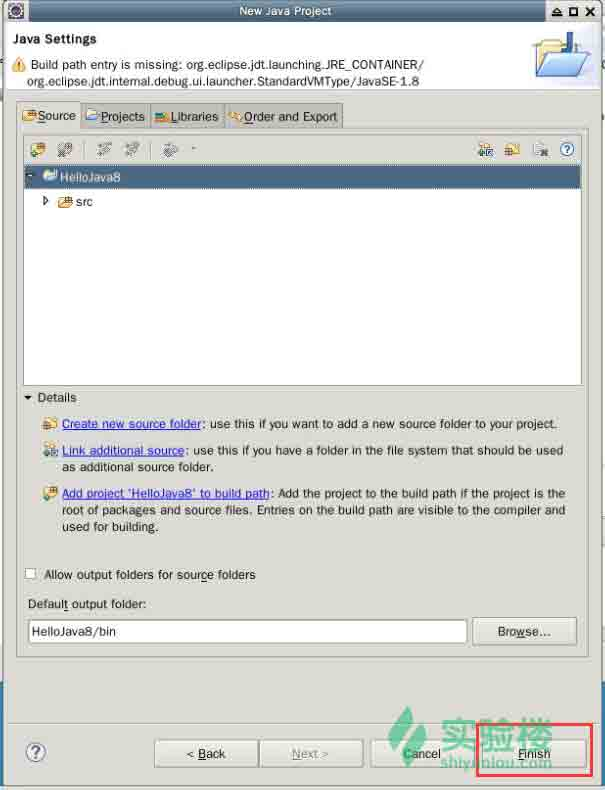

若弹出下面这样的对话框，点击`Yes`即可启用相关特性。

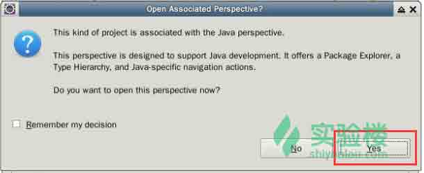

#### 1.2.2 创建包和类

在项目的`scr`目录上点击右键，选择`New`->`Package`。

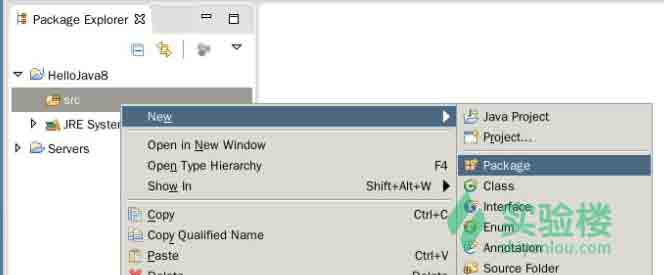

在弹出的对话框中填入包名`com.shiyanlou.java8`，完成包的创建。

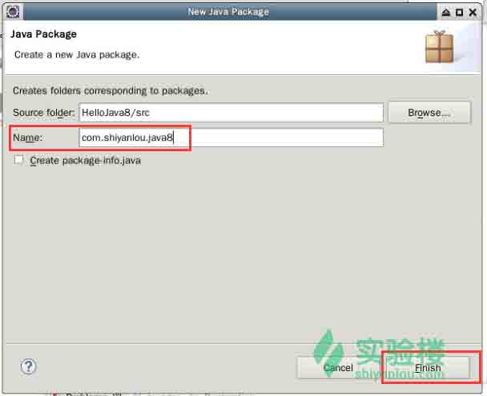

接着在项目目录中的这个包上点击右键，选择`New`->`Class`。

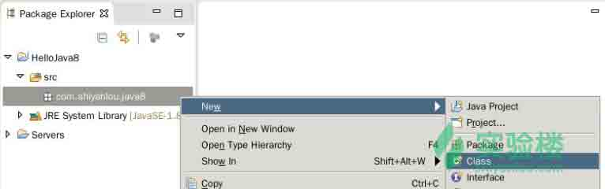

在弹出的对话框中，填入类名`NewFeaturesTester`，完成类的创建。

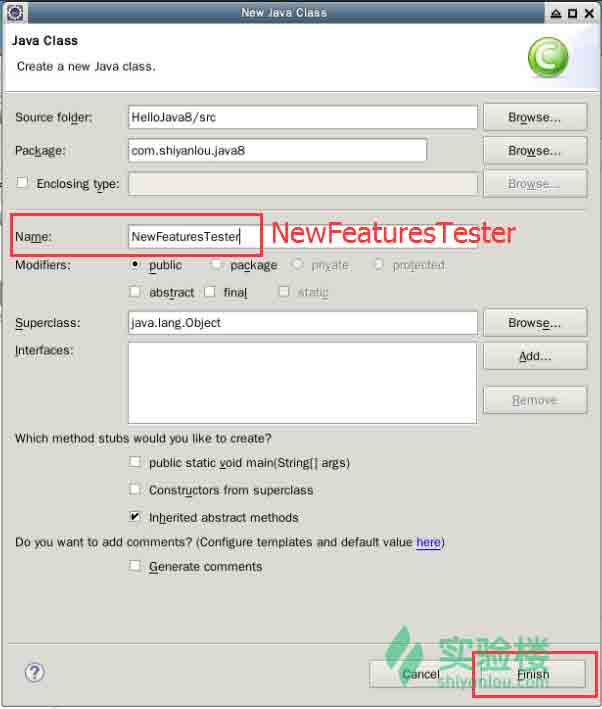

至此，准备工作就完成了。

## 二、Lambda 表达式

Lambda 表达式是在 Java 8 中引入的，并且成为了 Java 8 最大的特点。它使得功能性编程变得非常便利，极大地简化了开发工作。

### 2.1 语法

一个 Lambda 表达式具有下面这样的语法特征。它由三个部分组成：第一部分为一个括号内用逗号分隔的形参，参数即函数式接口里面方法的参数；第二部分为一个箭头符号：`->`；第三部分为方法体，可以是表达式和代码块。语法如下：

```java
parameter -> expression body 
```

下面列举了 Lambda 表达式的几个最重要的特征：

*   可选的类型声明：你不用去声明参数的类型。编译器可以从参数的值来推断它是什么类型。
*   可选的参数周围的括号：你可以不用在括号内声明单个参数。但是对于很多参数的情况，括号是必需的。
*   可选的大括号：如果表达式体里面只有一个语句，那么你不必用大括号括起来。
*   可选的返回关键字：如果表达式体只有单个表达式用于值的返回，那么编译器会自动完成这一步。若要指示表达式来返回某个值，则需要使用大括号。

> 函数式接口的重要属性是：我们能够使用 Lambda 实例化它们，Lambda 表达式让你能够将函数作为方法参数，或者将代码作为数据对待。Lambda 表达式的引入给开发者带来了不少优点：在 Java 8 之前，匿名内部类，监听器和事件处理器的使用都显得很冗长，代码可读性很差，Lambda 表达式的应用则使代码变得更加紧凑，可读性增强；Lambda 表达式使并行操作大集合变得很方便，可以充分发挥多核 CPU 的优势，更易于为多核处理器编写代码。*引用自[IBM - Java 8 新特性概述](http://www.ibm.com/developerworks/cn/java/j-lo-jdk8newfeature/index.html)。*

### 2.2 一个 Lambda 表达式的例子

下面尝试写一些代码来理解 Lambda 表达式。请在`NewFeaturesTester.java`中输入下面这些代码，对于它们的解释在注释中给出。

```java
package com.shiyanlou.java8;

public class NewFeaturesTester {
    public static void main(String args[]){
        NewFeaturesTester tester = new NewFeaturesTester();

          // 带有类型声明的表达式
          MathOperation addition = (int a, int b) -> a + b;

          // 没有类型声明的表达式
          MathOperation subtraction = (a, b) -> a - b;

          // 带有大括号、带有返回语句的表达式
          MathOperation multiplication = (int a, int b) -> { return a * b; };

          // 没有大括号和 return 语句的表达式
          MathOperation division = (int a, int b) -> a / b;

          // 输出结果
          System.out.println("10 + 5 = " + tester.operate(100, 2, addition));
          System.out.println("10 - 5 = " + tester.operate(100, 2, subtraction));
          System.out.println("10 x 5 = " + tester.operate(100, 2, multiplication));
          System.out.println("10 / 5 = " + tester.operate(100, 2, division));

          // 没有括号的表达式            
          GreetingService greetService1 = message ->
          System.out.println("Hello " + message);

          // 有括号的表达式            
          GreetingService greetService2 = (message) ->
          System.out.println("Hello " + message);

          // 调用 sayMessage 方法输出结果
          greetService1.sayMessage("Shiyanlou");
          greetService2.sayMessage("Classmate");
       }

       // 下面是定义的一些接口和方法

       interface MathOperation {
          int operation(int a, int b);
       }

       interface GreetingService {
          void sayMessage(String message);
       }

       private int operate(int a, int b, MathOperation mathOperation){
          return mathOperation.operation(a, b);
       }
} 
```

接下来我们来编译一下，点击上方工具栏的`Run`按钮。

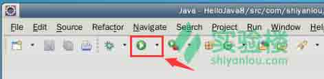

运行结果如下图所示：

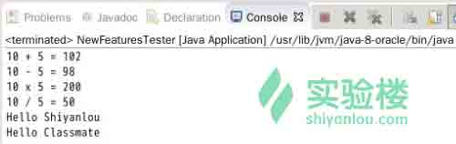

需要注意的是：

*   Lambda 表达式优先用于定义功能接口在行内的实现，即单个方法只有一个接口。在上面的例子中，我们用了多个类型的 Lambda 表达式来定义 MathOperation 接口的操作方法。然后我们定义了 GreetingService 的 sayMessage 的实现。
*   Lambda 表达式让匿名类不再需要，这位 Java 增添了简洁但实用的函数式编程能力。

### 2.3 作用域

通过使用 Lambda 表达式，你可以引用 final 变量或者有效的 final 变量（只赋值一次）。如果一个变量被再次赋值，Lambda 表达式将抛出一个编译错误。

我们可以通过下面这段代码来学习 Lambda 的作用域。请将代码修改至如下这些：

```java
package com.shiyanlou.java8;

public class NewFeaturesTester {
    final static String salutation = "Hello ";

    public static void main(String args[]){
        GreetingService greetService1 = message -> 
        System.out.println(salutation + message);
        greetService1.sayMessage("Shiyanlou");
    }

    interface GreetingService {
       void sayMessage(String message);
    }
} 
```

点击编译运行，可以看到输出结果如下图所示。

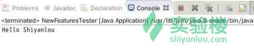

## 三、方法引用

> Java 8 中方法也是一种对象，可以 By 名字来引用。不过方法引用的唯一用途是支持 Lambda 的简写，使用方法名称来表示 Lambda。不能通过方法引用来获得诸如方法签名的相关信息。*引用自[永无止境，上下求索](http://blog.csdn.net/kimylrong/article/details/47255123)的博客。*

方法引用可以通过方法的名字来引用其本身。方法引用是通过`::`符号（双冒号）来描述的。

它可以用来引用下列类型的方法：

*   静态方法
*   实例方法
*   使用`new`操作符的构造器方法（`TreeSet::new`）

更多对于方法引用的介绍，可以参考这一篇博文——《[Java 8 之方法引用(Method References)](http://blog.csdn.net/kimylrong/article/details/47255123)》。

### 3.1 一个方法引用的例子

请继续修改 Eclipse 中的代码，学习如何使用方法引用。

```java
package com.shiyanlou.java8;

import java.util.List;
import java.util.ArrayList;

public class NewFeaturesTester {

    public static void main(String args[]){
        List names = new ArrayList();

        names.add("Peter");
        names.add("Linda");
        names.add("Smith");
        names.add("Zack");
        names.add("Bob");

        //     通过 System.out::println 引用了输出的方法
        names.forEach(System.out::println);
    }
} 
```

编译并运行，结果如下图所示：


## 四、实验总结

本节我们讲解了如何使用 Lambda 表达式和方法引用。Lambda 大概是使用 Java 8 版本编程最常涉及到的一个技巧，建议在适用的场合多用它代替之前的习惯写法。

在学习过程中，应当随时保持查阅官方文档的习惯。

下面给出了一些你可能用到的链接：

*   [The Java™ Tutorials - Lambda Expressions](http://docs.oracle.com/javase/tutorial/java/javaOO/lambdaexpressions.html)
*   [The Java™ Tutorials - Method References](http://docs.oracle.com/javase/tutorial/java/javaOO/methodreferences.html)

推荐你点击上方的“下一个实验”按钮，继续使用当前的实验环境学习下一节的内容。