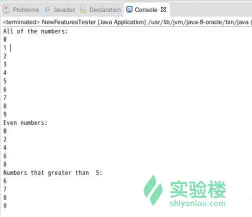
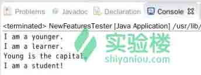
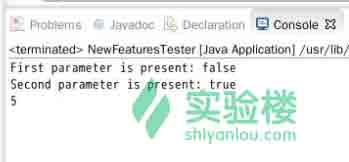

# 第 2 节 Java 8 新特性（二）

## 一、实验简介

本节内容将为你将介绍函数式接口、默认方法、Optional 三个新特性。针对每个特性，我们都提供了一个例子供你学习。

### 1.1 知识点

*   函数式接口
*   默认方法
*   Optional 类

### 1.2 准备工作

**本节实验内容需要配置相关的实验环境。**你可以仿照上节课《Java 8 新特性（一）》中的步骤来进行配置。如果已完成该步骤，请继续学习下面的内容。

## 二、函数式接口

函数式接口有一个单一的功能来表现。例如，带有单个`compareTo`方法的比较接口，被用于比较的场合。Java 8 定义了大量的函数式接口来广泛地用于 lambda 表达式。

>Java 8 引入的一个核心概念是函数式接口（Functional Interfaces）。通过在接口里面添加一个抽象方法，这些方法可以直接从接口中运行。如果一个接口定义个唯一一个抽象方法，那么这个接口就成为函数式接口。同时，引入了一个新的注解：@FunctionalInterface。可以把他它放在一个接口前，表示这个接口是一个函数式接口。这个注解是非必须的，只要接口只包含一个方法的接口，虚拟机会自动判断，不过最好在接口上使用注解 @FunctionalInterface 进行声明。在接口中添加了 @FunctionalInterface 的接口，只允许有一个抽象方法，否则编译器也会报错。*引用自[IBM - Java 8 新特性概述](http://www.ibm.com/developerworks/cn/java/j-lo-jdk8newfeature/index.html)。*

### 2.1 相关的接口及描述

下面是部分函数式接口的列表。

*   `BitConsumer<T,U>`：该接口代表了接收两个输入参数 T、U，并且没有返回的操作。
*   `BiFunction<T,U,R>`：该接口代表提供接收两个参数 T、U，并且产生一个结果 R 的方法。
*   `BinaryOperator<T>`：代表了基于两个相同类型的操作数，产生仍然是相同类型结果的操作。
*   `BiPredicate<T,U>`：代表了对两个参数的断言操作（基于 Boolean 值的方法）。
*   `BooleanSupplier`：代表了一个给出 Boolean 值结果的方法。
*   `Consumer<T>`：代表了接受单一输入参数并且没有返回值的操作。
*   `DoubleBinaryOperator`：代表了基于两个 Double 类型操作数的操作，并且返回一个 Double 类型的返回值。
*   `DoubleConsumer`：代表了一个接受单个 Double 类型的参数并且没有返回的操作。
*   `DoubleFunction<R>`：代表了一个接受 Double 类型参数并且返回结果的方法。
*   `DoublePredicate`：代表了对一个 Double 类型的参数的断言操作。
*   `DoubleSupplier`：代表了一个给出 Double 类型值的方法。
*   `DoubleToIntFunction`：代表了接受单个 Double 类型参数但返回 Int 类型结果的方法。
*   `DoubleToLongFunction`：代表了接受单个 Double 类型参数但返回 Long 类型结果的方法。
*   `DoubleUnaryOperator`：代表了基于单个 Double 类型操作数且产生 Double 类型结果的操作。
*   `Function<T,R>`：代表了接受一个参数并且产生一个结果的方法。
*   `IntBinaryOperator`：代表了对两个 Int 类型操作数的操作，并且产生一个 Int 类型的结果。
*   `IntConsumer`：代表了接受单个 Int 类型参数的操作，没有返回结果。
*   `IntFunction<R>`：代表了接受 Int 类型参数并且给出返回值的方法。
*   `IntPredicate`：代表了对单个 Int 类型参数的断言操作。

更多的接口可以参考 Java 8 官方 API 手册：[java.lang.Annotation Type FunctionalInterface](https://docs.oracle.com/javase/8/docs/api/java/lang/FunctionalInterface.html)。在实际使用过程中，加有`@FunctionalInterface`注解的方法均是此类接口，位于[`java.util.Funtion`包中](http://docs.oracle.com/javase/8/docs/api/java/util/function/package-frame.html)。

### 2.2 一个函数式编程的例子

下面我们通过一个例子学习如何使用这些函数式编程的接口。

实验步骤主要如下：

1.  双击打开桌面上的 Eclipse。
2.  在 Eclipse 界面上的菜单栏中，通过`File`->`New`来创建一个`Java Project`。
3.  为项目取名为`HelloJava8`。
4.  在项目内创建一个名为`com.shiyanlou.java8`的包，并在这个包内添加一个名为`NewFeaturesTester`的类。
5.  在类中输入下方提供的实验代码。
6.  点击工具栏上的运行（Run）按钮，编译运行该项目。

如果你对于上述步骤有任何不清楚的地方，都可以回到上一节内容的“准备工作”章节查看具体的办法。

以下是`NewFeaturesTester.java`类中应当输入的代码：

> 本段代码是可执行代码，请在 Eclipse 中输入。

```java
import java.util.Arrays;
import java.util.List;
import java.util.function.Predicate;

public class NewFeaturesTester {
   public static void main(String args[]){
      List<Integer> list = Arrays.asList(0, 1, 2, 3, 4, 5, 6, 7, 8, 9);

      System.out.println("All of the numbers:");

      eval(list, n->true);

      System.out.println("Even numbers:");
      eval(list, n-> n%2 == 0 );

      System.out.println("Numbers that greater than  5:");
      eval(list, n -> n > 5 );
   }

   public static void eval(List<Integer> list, Predicate<Integer> predicate) {
      for(Integer n: list) {

         if(predicate.test(n)) {
            System.out.println(n + " ");
         }
      }
   }
} 
```

编辑完成后，点击上方的运行按钮。运行结果如下图所示：



## 三、默认方法

Java 8 在接口方面引入了一个关于默认方法实现的新概念。它也是作为一种向后兼容能力而出现，旧的接口也能用到 Lambda 表达式中。例如，`List`或`Collection`接口是没有`forEach`方法的声明的。但是，通过这些默认方法能够就能轻易地打破集合框架实现的限制。Java 8 引入默认方式使得`List`和`Collection`接口能够拥有`forEach`方法的默认实现。实现了这些接口的类也不必再实现相同的功能了。

语法如下所示：

> 本段代码是示例代码，仅供理解使用。完整的可运行代码和例子请参阅 3.3 小节。

```java
public interface boy {
   default void print(){
      System.out.println("I am a boy.");
   }
} 
```

### 3.1 多个默认值

接口中有了默认方法之后，在同一个类里面实现两个带有相同默认方法的接口就可行了。

下面的代码演示了如何解决这种含糊不清的情况。

首先是同一个类里面的两个接口。

> 本段代码是示例代码，仅供理解使用。完整的可运行代码和例子请参阅 3.3 小节。

```java
public interface younger {
   default void print(){
      System.out.println("I am a younger.");
   }
}

public interface learner{
   default void print(){
      System.out.println("I am a learner.");
   }
} 
```

第一个解决办法就是创建一个自有的方法，来重写默认的实现。就像这样：

> 本段代码是示例代码，仅供理解使用。完整的可运行代码和例子请参阅 3.3 小节。

```java
public class student implements younger, learner {
   default void print(){
      System.out.println("I am a younger and a learner, so I am  a student.");
   }
} 
```

另外一个解决办法是使用超类`super`来调用特定接口的默认方法。

> 本段代码是示例代码，仅供理解使用。完整的可运行代码和例子请参阅 3.3 小节。

```java
public class student implements younger, learner {
   default void print(){
      learner.super.print();
   }
} 
```

### 3.2 静态默认方法

你也可以为这个接口增加静态的辅助方法（helper），就像下面这样：

> 本段代码是示例代码，仅供理解使用。完整的可运行代码和例子请参阅 3.3 小节。

```java
public interface Younger {
   default void print(){
      System.out.println("I am a younger.");
   }

   static void sayHi(){
      System.out.println("Young is the capital.");
   }
} 
```

### 3.3 一个默认方法的例子

下面我们通过一个例子来掌握如何使用默认方法。请将 Eclipse 中的代码修改为下面的内容。对应知识点已在注释中写明。

> 本段代码是可执行代码，请在 Eclipse 中输入。

```java
package com.shiyanlou.java8;

public class NewFeaturesTester {
       public static void main(String args[]){
          Younger younger = new Student();
          younger.print();
       }
    }

    interface Younger {
       default void print(){
          System.out.println("I am a younger.");
       }

       static void sayHi(){
          System.out.println("Young is the capital.");
       }
    }

    interface Learner {
       default void print(){
          System.out.println("I am a learner.");
       }
    }

    class Student implements Younger, Learner {
       public void print(){
          Younger.super.print();
          Learner.super.print();
          Younger.sayHi();
          System.out.println("I am a student!");
       }
    } 
```

编辑完成后，编译一下。运行结果如下所示：



## 四、Optional 类

`Optional`是一个容器对象，用于容纳非空对象。`Optional`对象通过缺失值值代表`null`。这个类有许多实用的方法来促使代码能够处理一些像可用或者不可用的值，而不是检查那些空值（null）。Java 8 中引入的这个特性有点像 Google Guava 里的 Optional（Guava 是一个 Google 的基于 Java 6 的类库集合的扩展项目）。

在 Java 官方文档的解释中，它是一个可以为 null 的容器对象。如果值存在则 `isPresent()` 方法会返回 `true` ，调用 `get()`方法会返回该对象。

### 4.1 类的声明及方法

下面是`java.util.Optional<T>`类的声明：

> 本段代码是示例代码，仅供理解使用。完整的可运行代码和例子请参阅 3.3 小节。

```java
public final class Optional<T>
extends Object 
```

这个类继承了`java.lang.Object`类大多数方法。主要有：

*   `static <T> Optional<T> empty()`：该方法返回一个空的`Optional`实例。
*   `boolean equals(Object obj)`：该方法可以指示某个对象是否与当前 Optional 对象相等。
*   `Optional<T> filter(Predicate<? super <T> predicate)`：如果一个值存在并且这个值满足某个给定的断言，那么该方法将返回一个描述该值的 Optional 对象；否则，将返回一个空的 Optional 对象。
*   `<U> Optional<U> flatMap(Function<? super T,Optional<U>> mapper)`：如果一个值存在，该方法会把一个 map 方法应用于它，并且返回结果；否则，将返回空的 Optional 对象。
*   `T get()`：如果一个值存在于当前 Optional 中，则返回这个值；否则将抛出一个`NoSuchElementException`异常。
*   `int hashCode()`：返回当前值的 hash 编码值。若这个值不存在，则返回 0.
*   `void ifPresent(Consumer<? super T> consumer)`：如果一个值存在，该方法会通过该值调用指定的 consumer。如果不存在，则不调用。
*   `boolean isPresent()`：返回一个值是否存在。
*   `<U>Optional<U> map(Function<? super T,? extends U> mapper`：如果一个值存在，则将某个 map 方法应用于它。如果这个值是非空的，则返回一个描述结果的 Optional 对象。
*   `static <T> Optional<T> of(T value)`：返回某个存在的非空值的 Optional 对象。

更多的你可以访问官方 API 手册查看：http://docs.oracle.com/javase/8/docs/api/java/util/Optional.html

### 4.2 一个 Optional 类的例子

下面我们通过一个实例来学习如何将 Optional 类应用到我们的编程中。

请将 Eclipse 中的代码修改为下面的内容：

> 本段代码是可执行代码，请在 Eclipse 中输入。

```java
package com.shiyanlou.java8;

import java.util.Optional;

public class NewFeaturesTester {
   public static void main(String args[]){

      NewFeaturesTester tester = new NewFeaturesTester();
      Integer value1 = null;
      Integer value2 = new Integer(5);

      // ofNullable 允许传参时给出 null
      Optional<Integer> a = Optional.ofNullable(value1);

      // 如果传递的参数为 null，那么 of 将抛出空指针异常（NullPointerException）
      Optional<Integer> b = Optional.of(value2);
      System.out.println(tester.sum(a,b));
   }

   public Integer sum(Optional<Integer> a, Optional<Integer> b){

      // isPresent 用于检查值是否存在

      System.out.println("First parameter is present: " + a.isPresent());
      System.out.println("Second parameter is present: " + b.isPresent());

      // 如果当前返回的是传入的默认值，orElse 将返回它
      Integer value1 = a.orElse(new Integer(0));

      // get 用于获得值，条件是这个值必须存在
      Integer value2 = b.get();
      return value1 + value2;
   }
} 
```

编辑完成后，请编译运行一下。

控制台的输出如下图所示：



## 五、实验总结

本节内容我们学习了函数式接口、默认方法和 Optional 类。

下面给出 Java 8 官方教程中对于本节知识点的讲解：

*   [Java SE 8: Lambda Quick Start](http://www.oracle.com/webfolder/technetwork/tutorials/obe/java/Lambda-QuickStart/index.html)
*   [The Java™ Tutorials - Default Methods](https://docs.oracle.com/javase/tutorial/java/IandI/defaultmethods.html)

扩展阅读：[Java 8 Optional 类深度解析](http://www.importnew.com/6675.html)

同样，如果时间充裕。推荐你点击上方的“下一个实验”按钮，继续使用当前的实验环境学习下一节的内容。这样可以避免重复配置实验环境。