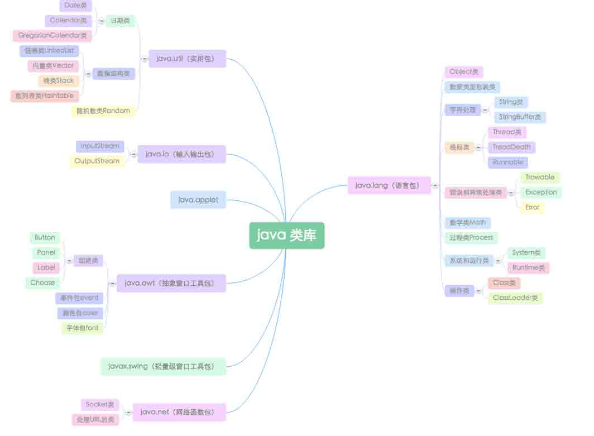
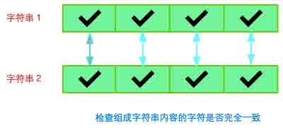
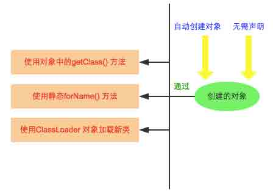
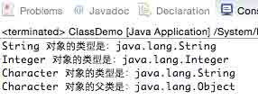
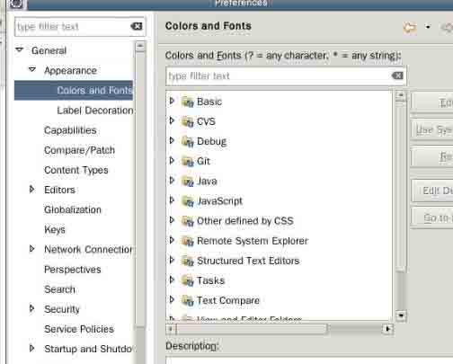
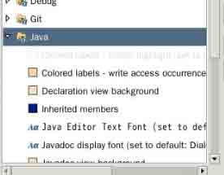
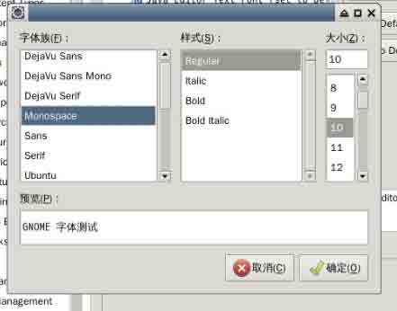

# 第 1 节 java.lang 包

* * *

## 实验简介

　　本实验将学习 java.lang 包内的包装类以及 String 类、Math 类、Class 类、Object 类的相关知识。

## 一、Java API 简介

　　Java 的核心 API 是非常庞大的，这给开发者来说带来了很大的方便。所谓的 API 就是一些已经写好、可直接调用的类库。Java 里有非常庞大的 API，其中有一些类库是我们必须得掌握的，只有熟练掌握了 Java 一些核心的 API，我们才能更好的使用 Java。



　　在程序中，java.lang 包并不需要像其他包一样需要`import`关键字进行引入。系统会自动加载，所以我们可以直接取用其中的所有类。下面我们就来详细地学习一下 java.lang 包吧

## 二、java.lang 包装类

　　我们都知道 java 是一门面向对象的语言，类将方法和属性封装起来，这样就可以创建和处理相同方法和属性的对象了。但是 java 中不能定义基本类型的对象。那如果我们想像处理对象的方式处理基本类型的数据，调用一些方法怎么办呢？

其实 java 为每个基本类型都提供了包装类：

```java
| 原始数据类型 | 包装类 |
|--------------|--------|
| byte（字节） | Byte |
| char（字符）  | Character |
| int（整型） | Integer |
| long （长整型） | Long |
| float（浮点型） | Float |
| double （双精度） | Double |
| boolean （布尔） | Boolean |
| short（短整型） | Short |
```

　　java.lang 包中的 Integer 类、Long 类和 Short 类都是 Number 的子类，他们的区别在于不同子类里面封装着不同的数据类型，比如 Integer 类包装了一个基本类型 int。其包含的方法基本相同。

　　我们以 Integer 类为例。 Integer 构造方法有两种：

　　1\. 以 Int 型变量作为参数创建 Integer 对象。例如`Integer a = new Integer(10);`

　　2\. 以 String 型变量作为参数创建 Integer 对象，例如`Integer a = new Integer("10")`

下面列举一下 Integer 的常用方法

```java
| 方法 | 返回值 | 功能描述 |
|------|--------|----------|
| byteValue() | byte | 以 byte 类型返回该 Integer 的值 |
| CompareTo(Integer anotherInteger)  | int | 在数字上比较 Integer 对象。如果这两个值相等，则返回 0；如果调用对象的数值小于 anotherInteger 的数值，则返回负值；如果调用对象的数值大于  anotherInteger 的数值，则返回正值 |
| equals(Object IntegerObj) | boolean | 比较此对象与指定对象是否相等 |
| intValue() | int | 以 int 型返回此 Integer 对象 | 
| shortValue() | short | 以 int 型返回此 Integer  对象 |
| longValue() | long | 以 long 型返回此 Integer 对象 |
| floatValue() | float | 以 float 型返回此 Integer 对象 |
| doubleValue() | double | 以 double 型返回此 Integer 对象 |
| toString() | String | 返回一个表示该 Integer 值的 String 对象 |
| valueOf(String str) | Integer | 返回保存指定的 String 值的 Integer 对象 |
| parseInt(String str) | int | 返回包含在由 str 指定的字符串中的数字的等价数值 |
```

我们来写一些代码，验证一下上面的方法吧

```java
public class IntegerTest {
    public static void main(String[] args){
        //初始化一个 Integer 类实例
        Integer a = new Integer("10");
        //初始化一个 Integer 类实例
        Integer b = new Integer(11);
        //判断两个数的大小
        System.out.println(a.compareTo(b));
        //将 a 转换成 float 型数
        float c = a.floatValue();
        System.out.println(c);
        String d = "10101110";
        //将字符串转换为数值
        //parseInt(String str) 和 parseInt(String str,int radix) 都是类方法，由类来调用。后一个方法则实现将字符串按照参数 radix 指定的进制转换为 int，
        int e = Integer.parseInt(d, 2);
        System.out.println(e);
    }
} 
```

　　大家自己试一试吧。

Character 包装类的方法：

```java
| 方法 | 返回值 | 说明 |
|------|--------|------|
| isDigit() | boolean | 确定字符是否为 0 到 9 之间( Integer 也有这个方法) |
| isLetter() | boolean | 确定字符是否为字母 |
| isLowerCase() | boolean | 确定字符是否为小写形式 |
| isUpperCase() | boolean | 确定字符是否为大写形式 |
| isSpace() | boolean | 确定字符是否为空格或换行符 |
| isUnicodeIdentifierStart() | boolean | 确定是否允许将指定字符作为 Unicode 标识符中的首字符 | 
```

　　大家可以参考一下代码，验证一下上面的方法（同学们一定要亲自打哦，学代码的最好方式是实操）

```java
public class CharacterTest {
    public static void main(String[] args){
        int count;
        //定义了一个字符数组
        char[] values = {'*', '_', '%', '8', 'L', 'l'};
        //遍历字符数组
        for (count = 0; count < values.length; count++){
            if(Character.isDigit(values[count])){
                System.out.println(values[count]+"是一个数字");
            }
            if(Character.isLetter(values[count])){
                System.out.println(values[count]+ "是一个字母");
            }
            if(Character.isUpperCase(values[count])){
                System.out.println(values[count]+"是大写形式");
            }
            if(Character.isLowerCase(values[count])){
                System.out.println(values[count]+"是小写形式");
            }
            if(Character.isUnicodeIdentifierStart(values[count])){
                System.out.println(values[count]+"是 Unicode 标志符的第一个有效字符");
            }
        }
    }
} 
```

Boolean 类的构造方法也有两个：

1.  创建一个表示 value 参数的 boolean 对象，如`Boolean b = new Boolean(true)`
2.  以 String 变量作为参数，创建 boolean 对象，如`Boolean b = new Boolean("ok")`

```java
| 方法 | 返回值 | 说明 |
|------|--------|------|
| booleanValue() | boolean | 将 Boolean 对象的值以对应的 boolean 值返回 |
| equals(Object obj) | boolean | 判断调用该方法的对象与 obj 是否相等。当且仅当参数不是 null，而且与调用该方法的对象一样都表示同一个 boolean 值的 Boolean 对象时，才返回 true |
| parseBoolean(Strint s) | boolean | 将字符串参数解析为 boolean 值 |
| toString() | String | 返回表示该 boolean 值的 String 对象 |
| valueOf(String s) | boolean | 返回一个用指定得字符串表示值的 boolean 值 |
```

　　其他的都差不多，大家可以自行去验证和参考 Java 类库的手册吧。

## 三、java.lang 类 String

　　我们经常使用 String 类来定义一个字符串，String 对象的初始化格式有如下两种： 　　

```java
String s0 = "abc";

String s1 = new String("abd"); 
```

　　String 类具有丰富的方法，比如计算字符串的长度、连接字符串、比较字符串、提取字符串等等。

#### 1、计算字符串长度

length()方法

```java
//方法原型
public int length(){
} 
```

调用方法：`字符串标识符.length();` 返回一个 int 类型的整数（字符串中字符数）

#### 2、字符串比较

equals() 方法比较是通过第一字符开始，一个字符一个字符依次比较。



　　那如果我想忽略掉大小写关系，比如：java 和 Java 是一样的，我们怎么办呢？我们可以调用`equalsIgnoreCase()`方法，其用法与 equals 一致，不过它会忽视大小写。

比如：

```java
public class StringTest {
    public static void main(String[] args){
        String s = new String("Java");
        String m = "java";
        System.out.println("用 equals()比较，java 和 Java 结果为"+s.equals(m));
        System.out.println("用 equalsIgnoreCase()比较，java 和 Java 结果为"+s.equalsIgnoreCase(m));
    }
} 
```


#### 3、字符串连接

　　字符串连接有两种方法：

　　1\. 使用`+`，比如`String s = "Hello " + "World!"`

　　2\. 使用 String 类的 concat() 方法

代码示例：

```java
String s0 = new String("Hello ");
String s1 = "World" + "!";   //+号连接
String s2 = s0.concat(name); //concat()方法连接
System.out.println(s2); 
```

#### 4、字符串常用提取方法

```java
| 方法 | 返回值 | 功能描述 |
|------|--------|----------|
| indexOf(int ch) | int | 搜索字符 ch 第一次出现的位置 |
| indexOf(String value)  | int | 搜索字符串 value 第一次出现的位置 |
| lastIndexOf(int ch) | int | 搜索字符 ch 最后一次出现的位置 |
| lastIndexOf(String value) | int | 搜索字符串 value 最后一次出现的位置 | 
| substring(int index) | String | 提取从位置索引开始到结束的字符串 |
| substring(int beginindex, int endindex) | String | 提取 beginindex 和 endindex 之间的字符串部分 |
| trim() | String | 返回一个前后不含任何空格的调用字符串的副本 |
```

说明：在字符串中，第一个字符的索引为 0

　　同学们，String 类的字符串创建后是不能够改变的。有些同学都不太明白，我们通过代码看一看吧。

```java
String s = "Hello ";
s.concat("World!");   //字符串连接
System.out.println(s); //输出 s，还是"Hello "
s = s.concat("World!");  //把字符串对象连接的结果赋给了 s 引用
System.out.println(s);  //输出 s，变成了"Hello World!"

/*
上述三条语句其实产生了 3 个 String 对象，"Hello "，"World!"，"Hello World!"。第 2 条语句确实产生了"Hello World"字符串，但是没有指定把该字符串的引用赋给谁，因此没有改变 s 引用。第 3 条语句根据不变性，并没有改变"Hello "，JVM 创建了一个新的对象，把"Hello "，"World!"的连接赋给了 s 引用，因此引用变了，但是原对象没变。
*/ 
```

　　String 的不变性的机制显然会在 String 常量内有大量的冗余。比如我创建一个循环，使字符'1'依次连接到'n'，那么系统就得创建 n+(n-1) 个 String 对象。那有没有可变的 String 类呢？

　　StringBuffer 类是可变的。它是 String 的对等类，它可以增加和编写字符的可变序列，并且能够将字符插入到字符串中间或附加到字符串末尾（当然是不用创建其他对象的，这里建议大家去看一看 String 类与 StringBuffer 类的区别，理解一下他们在内存中的存储情况）

先上 StringBuffer 的构造方法：

```java
| 构造方法 | 说明 |
|----------|------|
| StringBuffer() | 保留 16 个字符的空间 |
| StringBuffer(int length) | 设置缓冲器大小 |
| StringBuffer(Stringvalue) | 接收字符串参数，用来设置初始内容，并在不重新分配的情况下保留 16 个字符的空间 |
```

StringBuffer 类的常用方法：

```java
| 方法 | 返回值 | 功能描述 |
|------|--------|----------|
| insert(int offsetm,Object s) | StringBuffer | 在 offetm 的位置插入字符串 s |
| append(Object s)  | StringBuffer | 在字符串末尾追加字符串 s |
| length() | int | 确定 StringBuffer 对象的长度 |
| setCharAt(int pos,char ch) | void | 使用 ch 指定的新值设置 pos 指定的位置上的字符 | 
| toString() | String | 转换为字符串形式 |
| reverse() | StringBuffer | 反转字符串 |
| delete(int start, int end) | StringBuffer | 删除调用对象中从 start 位置开始直到 end 指定的索引（end-1）位置的字符序列 |
| replace(int start, int end, String s) | StringBuffer | 使用一组字符替换另一组字符。将用替换字符串从 start 指定的位置开始替换，直到 end 指定的位置结束 |
```

上面的方法中我们选择几个，来写写代码吧：

```java
public class StringTest {

    public static void main(String[] args){
        //定义和初始化一个 StringBuffer 类的字串 s
        StringBuffer s = new StringBuffer("I");
        //在 s 后面添加字串" java"
        s.append(" java");
        //在 s[1]的位置插入字串
        s.insert(1, " love");
        String t = s.toString(); //转为字符串
        System.out.println(t);
    }
} 
```

其他的方法，请同学们一定要自己亲自一一验证一下！

## 四、java.lang 类 Math

　　我们在编程的过程中，经常对一些数字进行数学操作，比如我们想要求绝对值或余弦什么的。那这些方法是否需要我们自己实现吗？其实在 java.lang 里的 Math 类已经帮我实现大部分的函数功能。我们就来学习一下吧！

先认识一些方法吧：

```java
| 方法 | 返回值 | 功能描述 |
|------|--------|----------|
| sin(double numvalue) | double | 计算角 numvalue 的正弦值 |
| cos(double numvalue)  | double | 计算角 numvalue 的余弦值 |
| acos(double numvalue) | double | 计算 numvalue 的反余弦 |
| asin(double numvalue) | double | 计算 numvalue 的反正弦 |
| atan(double numvalue) | double | 计算 numvalue 的反正切 |
| pow(double a, double b) | double | 计算 a 的 b 次方 |
| sqrt(double numvalue) | double | 计算给定值的平方根 | 
| abs(int numvalue) | int | 计算 int 类型值 numvalue 的绝对值，也接收 long、float 和 double 类型的参数 |
| ceil(double numvalue) | double | 返回大于等于 numvalue 的最小整数值 |
| floor(double numvalue) | double | 返回小于等于 numvalue 的最大整数值 |
| max(int a, int b) | int | 返回 int 型 a 和 b 中的较答值，也接收 long、float 和 double 类型的参数
| max(int a, int b) | int | 返回 a 和 b 中的较小值，也可接受 long、float 和 double 类型的参数 |
| rint(double numvalue) | double | 返回最接近 numvalue 的整数值 |
| round(arg) | arg 为 double 时返回 long，为 float 时返回 int | 返回最接近 arg 的整数值 |
| random() | double | 返回一个介于 0 与 1 之间的伪随机数 |
```

　　上面都是一些常用的方法，如果同学们以后还会用到极坐标、对数等，就去查一查手册吧

小二，上栗子：

```java
Math.abs(-12.7) == 12.7
Math.ceil(12.7) == 13
Math.rint(12.4) = 12
System.out.println(Math.random()) 
```

## 五、java.lang 类 Class

　　class 类的实例表示 Java 应用运行时的类或接口。在 Java 中，每个 class 都有一个相应的 Class 对象，即每一个类，在生成的`.class`文件中，就会产生一个 Class 对象，用于表示这个类的类型信息。我们获取 Class 实例有三种方法：

1.  利用对象调用 `getClass()`方法获取该对象的 Class 实例

2.  使用 Class 类的静态方法 `forName(String className)`，用类的名字获取一个 Class 实例

3.  运用`.class`的方式来获取 Class 实例，对于基本数据类型的封装类，还可以采用`.TYPE`来获取相对应的基本数据类型的 Class 实例






　　class 类没有共有的构造方法，它由 JVM 自动调用。class 类的方法在这里就不细讲了，有兴趣的同学们可以自己查询一下。

## 六、java.lang 类 Object

　　Object 类是所有类的父类，所以在默认的情况下，我们定义的类扩展自 Object 类，那我们当然可以调用和重写 Object 类里的所有方法了。

　　我们看一下 Object 类里都定义了哪些方法。

```java
| 方法 | 返回值 | 功能描述 |
|------|--------|----------|
| equals(Objectobj) | boolean | 将当前对象实例与给定的对象进行比较，检查它们是否相等 |
| finalize() throws Throwable  | void | 当垃圾回收器确定不存在对象的更多引用时，由对象的垃圾回收器调用此方法。通常被子类重写 |
| getClass() | Class | 返回当前对象的 Class 对象 |
| toString() | String | 返回此对象的字符串表示 |
| wait() throws InterruptedException | void | 使当前线程进入等待状态 |
```

　　这个也不细讲了，同学们可以自行验证一下上面的方面，如果有兴趣，也可以深入了解一下里面的其他方法。

　　同学们如果感觉 Eclipse 上的字体大小不合适，木木教大家来自定义代码编辑框中的文字样式和大小。

1、在菜单栏下点击`Window`选择`Perferences`


2、下拉 `General`下的`Appearance`选中`Colors and Fonts`



3、这里面有不同应用场景下代码或系统日志等字体的样式和大小，我们可以选中`java`编辑里面的字体样式



4、选中字体的应用场景后，选中右边的`Edit`，便可编辑它的字体和大小了




## 七、作业

　　今天我们介绍了 lang 包，大家去网上查一查包里面还有许多其他类，了解和学习一下其他的类方法吧！