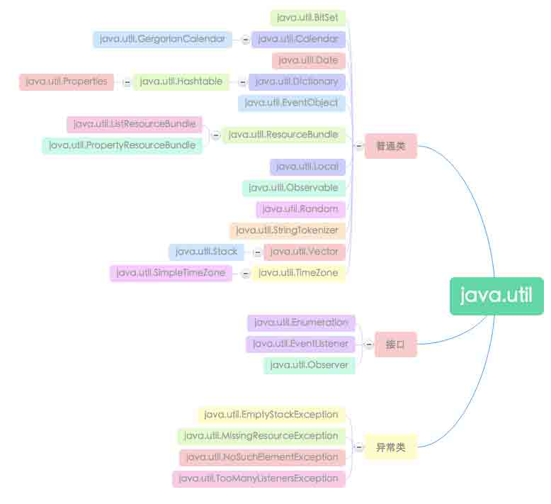
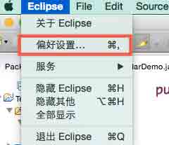

# 第 2 节 java.util 包

* * *

## 实验介绍

## 一、java.util 包介绍

　　java.util 包提供了一些实用的方法和数据结构。比如日期类 Data，日历类 Calendar 以及随机数类 Random，同时包里还提供了堆栈 Stack、向量 Vector、位集合 Bitset 以及哈希表 Hashtable 等表示数据结构的类。



## 二、Date 类

　　Date 类表示日期和时间，里面封装了操作日期和时间的方法。Date 类经常用来获取系统当前时间。

我们来看看类 Date 中定义的六种构造方法：

```java
| 构造方法 | 说明 |
|----------|------|
| Date() | 构造一个 Date 对象并对其进行初始化以反映当前时间 |
| Date(long date) | 构造一个 Date 对象，并根据相对于 GMT 1970 年 1 月 1 日 00:00:00 的毫秒数对其进行初始化 |
| Date(String s) | 按字符串 s 产生日期对象 | 
| Date(int year, int month, int date) | year - 年份减去 1900；month - 月份在 0-11 之间；date - 日期在 1-31 之间 |
| Date(int year, int month, int date, int hrs, int min, int sec) | hrs - 小时在 0-23 之间；min - 分钟在 0-59 之间；sec - 秒在 0-59 之间。  |
```

我们来看看代码吧：

```java
import java.util.*;
public class DateDemo {
    public static void main(String[] args) throws ClassNotFoundException {
        String strDate, strTime = ""; 
        Date objDate = new Date();
        System.out.println("今天的日期是：" + objDate);
        long time = objDate.getTime();
        System.out.println("自 1970 年 1 月 1 日起以毫秒为单位的时间（GMT）：" + time);
        strDate = objDate.toString();
        //提取 GMT 时间
        strTime = strDate.substring(11,(strDate.length() - 4));
        //按小时、分钟和秒提取时间
        strTime = "时间：" + strTime.substring(0,8);
        System.out.println(strTime);
    }
} 
```

　　在 Date 对象中的年、月、日、星期、时、分、秒可以用 getter 和 setter 方法进行操作。如下是方法原型：

```java
//getYear
public int getYear()
//getMonth
public int getMonth()
//getDate
public int getDate()
//getDay
public int getDay()
//getHours
public int getHours()
//getMinutes
public int getMinutes()
//getSeconds
public int getSeconds()
//setYear
public void setYear(int year)
//setMonth
public void setMonth(int month)
//setDate
public void setDate(int date)
//setHours
public void setHours(int hours)
//setMinutes
public void setMinutes(int minutes)
//setSeconds
public void setSeconds(int seconds) 
```

　　其实，在我们有了 Calendar 后，就几乎不用 Date 类了。

## 三、Calendar 类

　　在早期的 JDK 版本中，Date 类附有两大功能： 　　

1.  允许用年、月、日、时、分、秒来解释日期

2.  允许对表示日期的字符串进行格式化和句法分析

    　　在 JDK1.1 中提供了类 Calendar 来完成第一种功能，类 DateFormat 来完成第二项功能。DateFormat 是 java.text 包中的一个类。与 Date 类有所不同的是，DateFormat 类可以接受用各种语言和不同习惯表示的日期字符串。

    　　但是 Calendar 类是一个抽象类，它完成 Date 类与普通日期表示法之间的转换，而我们更多的是使用 Calendar 类的子类 GregorianCalendar 类。它实现了世界上普遍使用的公历系统。当然我们也可以继承 Calendar 类，然后自己定义实现日历方法。

先来看一看 GregorianCalendar 类的构造函数：

```java
| 构造方法 | 说明 |
|----------|------|
| GregorianCalendar() | 创建的对象中的相关值被设置成指定时区，缺省地点的当前时间，即程序运行时所处的时区、地点的当前时间 |
| GregorianCalendar(TimeZone zone) | 创建的对象中的相关值被设置成指定时区 zone，缺省地点的当前时间 |
| GregorianCalendar(Locale aLocale) | 创建的对象中的相关值被设置成缺省时区，指定地点 aLocale 的当前时间 | 
| GregorianCalendar(TimeZone zone,Locale aLocale) | year - 创建的对象中的相关值被设置成指定时区，指定地点的当前时间 |　　TimeZone 是 java.util 包中的一个类，其中封装了有关时区的信息。每一个时区对应一组 ID。类 TimeZone 提供了一些方法完成时区与对应 ID 两者之间的转换。
```

例如：

```java
//太平洋时区的 ID 为 PST
TimeZone tz0 = TimeZone.getTimeZone("PST")
//getDefault()可以获取主机所处时区的对象
TimeZone tz1 = TimeZone.getDefault() 
```

　　Locale 只是一种机制，它用来标识一个特定的地理、政治或文化区域获取一个 Locale 的对象有两种方法：

```java
//调用 Lacale 类的构造方法
Locale l0 = new Locale(String language, String country)
//Locale l0 = new Locale(String languge, String country, String variant)

//调用 Lacale 类中定义的常量
Lacale  l1 = Locale.CHINA 
```

　　同学们在引入包时，可能发现 java.util 里面并没有 Calendar 类，windows 和 linux 系统的用户，可以在 Eclipse 菜单栏里找到`window`，选择`preference`，找到`java`，点击`Installed JRES`,将执行环境改为`javaSE-1.8`就可以了（Mac 的在 Eclipse 的偏好里设置下，其他的都一样）




```java
import java.util.*;
import java.text.*;

public class CalendarDemo  
{    
  public static void main(String[] args)  
  {  

    // 得到日期格式对象  
    // Date date = fmt.parse(strDateMake);  

    System.out.println("完整显示日期时间：");
    // 字符串转换日期格式  
    DateFormat fdate = new SimpleDateFormat("yyyy-MM-dd HH:mm:ss"); 
    String str =fdate.format(new Date()); 
    System.out.println(str);  

    // 创建 Calendar 对象  
    Calendar calendar = Calendar.getInstance();  
    // 初始化 Calendar 对象，但并不必要，除非需要重置时间  
    calendar.setTime(new Date());  

    // 显示年份
    System.out.println("年： " + calendar.get(Calendar.YEAR));  

    // 显示月份 (从 0 开始, 实际显示要加一)    
    System.out.println("月： " + calendar.get(Calendar.MONTH)); 

    // 当前分钟数   
    System.out.println("分钟： " + calendar.get(Calendar.MINUTE));

    // 今年的第 N 天    
    System.out.println("今年的第 " + calendar.get(Calendar.DAY_OF_YEAR) + "天");  

    // 本月第 N 天  
    System.out.println("本月的第 " + calendar.get(Calendar.DAY_OF_MONTH) + "天");  

    // 3 小时以后 
    calendar.add(Calendar.HOUR_OF_DAY, 3);    
    System.out.println("三小时以后的时间： " + calendar.getTime());  
    // 格式化显示  
    str = (new SimpleDateFormat("yyyy-MM-dd HH:mm:ss:SS")).format(calendar.getTime());  
    System.out.println(str);  

    // 重置 Calendar 显示当前时间  
    calendar.setTime(new Date());  
    str = (new SimpleDateFormat("yyyy-MM-dd HH:mm:ss:SS")).format(calendar.getTime());  
    System.out.println(str); 

    // 创建一个 Calendar 用于比较时间  
    Calendar calendarNew = Calendar.getInstance();  

    // 设定为 5 小时以前，后者大，显示 -1  
    calendarNew.add(Calendar.HOUR, -5);  
    System.out.println("时间比较：" + calendarNew.compareTo(calendar));  

    // 设定 7 小时以后，前者大，显示 1  
    calendarNew.add(Calendar.HOUR, +7);  
    System.out.println("时间比较：" + calendarNew.compareTo(calendar));  

    // 退回 2 小时，时间相同，显示 0  
    calendarNew.add(Calendar.HOUR, -2);  
    System.out.println("时间比较：" + calendarNew.compareTo(calendar));  
  }  
} 
```

　　大家运行上面的代码后，看见控制台上的输出结果会不会有所疑问呢？

　　其实 month 的含义与 Date 类相同，0 代表 1 月，11 代表 12 月。

　　大家可以验证和尝试一下引入上面所讲的所有类，调用一下里面的各种方法吧（再次强调，自己写代码的重要性哦！）

## 四、Random 类

　　Java 实用工具类库中的类 java.util.Random 提供了产生各种类型随机数的方法。它可以产生 int、long、float、double 以及 Goussian 等类型的随机数。这也是它与 java.lang.Math 中的方法 Random() 最大的不同之处，后者只产生 double 型的随机数。

```java
| 构造方法 | 说明 |
|----------|------|
| Random() | 产生一个随机数需要基值，这里将系统时间作为 seed |
| Random(long seed) | 自定义 seed |
```

普通方法原型：

```java
//该方法是设定基值 seed
public synonronized void setSeed(long seed)

//该方法是产生一个整型随机数
public int nextInt()

//该方法是产生一个 long 型随机数
public long nextLong()

//该方法是产生一个 Float 型随机数
public float nextFloat()

//该方法是产生一个 Double 型随机数
public double nextDouble()

//该方法是产生一个 double 型的 Goussian 随机数
public synchronized double nextGoussian()

/*
synchronized  是 Java 语言的关键字，当它用来修饰一个方法或者一个代码块的时候，能够保证在同一时刻最多只有一个线程执行该段代码
*/ 
```

　　上面的方法大家可以自己验证一下吧！

## 五、作业

　　今天我们讲了比较常用的一些实用类和方法，下来的作业希望同学们能自学 java.util 里的 Vector 类、Stack 类、Hashtable 类以及 BitSet 类。