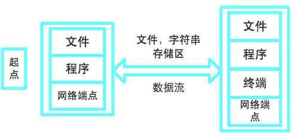
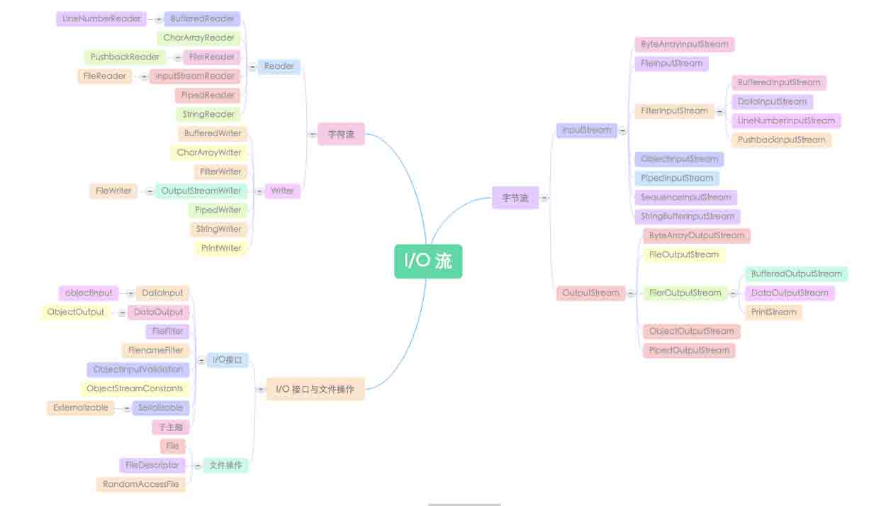

# 第 4 节 java 字节流

* * *

## 实验介绍

　　本实验将介绍字节流的基类、文件流、过滤流、标准流、内存读写流、顺序输出流等知识。

## 一、I/O 流概述

　　大部分程序都需要进行输入/输出处理，比如从键盘读取数据、从屏幕中输出数据、从文件中写数据等等。在 Java 中，把这些不同类型的输入、输出源抽象为流（Stream），而其中输入或输出的数据则称为数据流（Data Stream），用统一的接口表示，从而使程序设计简单明了。



　　流一般分为输入流（Input Stream）和输出流（Output Stream）两类，但这种划分并不是绝对的。比如一个文件，当向其中写数据时，它就是一个输出流；当从其中读取数据时，它就是一个输入流。当然，键盘只是一个输入流，而屏幕则只是一个输出流。（其实我们可以通过一个非常简单的方法来判断，只要是向内存中写入就是输入流，从内存中写出就是输出流）



## 二、基类：InputStream 和 OutputStream

　　字节流主要操作 byte 类型数据，以 byte 数组为准，java 中每一种字节流的基本功能依赖于基本类 InputStream 和 Outputstream，他们是抽象类，不能直接使用。

　　InputStream 是所有表示位输入流的父类，继承它的子类要重新定义其中所定义的抽象方法。InputStream 是从装置来源地读取数据的抽象表 示，例如 System 中的标准输入流 in 对象就是一个 InputStream 类型的实例。

我们先来看看 InputStream 类的方法：

```java
| 方法 | 说明 |
|------|------|
| read()throws IOException | 从流中读入数据 |
| skip()throws IOException | 跳过流中若干字节数 |
| available()throws IOException | 返回流中可用字节数 |
| mark()throws IOException | 在流中标记过的位置 |
| reset()throws IOException | 返回标记过的位置 |
| markSupport()throws IOException | 是否支持标记和复位操作 |
| close()throws IOException | 关闭流 |
```

　　在 InputStream 类中，方法 read() 提供了三种从流中读数据的方法：

1.  int read()：从输入流中读一个字节，形成一个 0~255 之间的整数返回（是一个抽象方法）

2.  int read(byte b[])：读多个字节到数组中，填满整个数组

3.  int read(byte b[],int off,int len)：从输入流中读取长度为 len 的数据，写入数组 b 中从索引 off 开始的位置，并返回读取得字节数。

    　　对于这三个方法，若返回-1，表明流结束，否则，返回实际读取的字符数。

    　　OutputStream 是所有表示位输出流的类之父类。子类要重新定义其中所定义的抽象方法，OutputStream 是用于将数据写入目的地的抽象表示。例如 System 中的标准输出流对象 out 其类型是 java.io.PrintStream，这个类是 OutputStream 的子类

OutputStream 类方法：

```java
| 方法 | 说明 |
|------|------|
| write(int b)throws IOException | 将一个整数输出到流中（只输出低位字节，为抽象方法） |
| write(byte b[])throws IOException | 将字节数组中的数据输出到流中 |
| write(byte b[], int off, int len)throws IOException | 将数组 b 中从 off 指定的位置开始，长度为 len 的数据输出到流中 |
| flush()throws IOException | 刷空输出流，并将缓冲区中的数据强制送出 |
| close()throws IOException | 关闭流 |
```

看个例子吧：

```java
package com.shiyanlou;

import java.io.IOException;
import java.io.InputStream;
import java.io.OutputStream;

public class test {

    /**
     * 把输入流中的所有内容赋值到输出流中
     * @param in
     * @param out
     * @throws IOException
     */
    public void copy(InputStream in, OutputStream out) throws IOException {
        byte[] buf = new  byte[4096];
        int len = in.read(buf);
        //read 是一个字节一个字节地读，字节流的结尾标志是-1
        while (len != -1){
            out.write(buf, 0, len);
            len = in.read(buf);
        }
    }
    public static void main(String[] args) throws IOException {
        // TODO Auto-generated method stub
        test t = new test();
        System.out.println("输入字符：");
        t.copy(System.in, System.out);
    }

} 
```

　　一般来说，很少直接实现 InputStream 或 OutputStream 上的方法，因为这些方法比较低级，通常会实现它们的子类。

## 三、文件流

在 I/O 处理中，最常见的就是对文件的操作。java.io 包中所提供的文件操作类包括：

1.  用于读写本地文件系统中的文件：FileInputStream 和 FileOutputStream
2.  描述本地文件系统中的文件或目录：File、FileDescriptor 和 FilenameFilter
3.  提供对本地文件系统中文件的随机访问支持：RandomAccessFile

今天我们来学习文件流的 FileInputStream 和 FileOutputStream 。

FileInputStream 类用于打开一个输入文件，若要打开的文件不存在，则会产生例外 FileNotFoundException，这是一个非运行时例外，必须捕获或声明抛弃；

FileOutputStream 类用来打开一个输出文件，若要打开的文件不存在，则会创建一个新的文件，否则原文件的内容会被新写入的内容所覆盖；

在进行文件的读/写操作时，会产生非运行时例外 IOException，必须捕获或声明抛弃（其他的输入/输出流处理时也同样需要进行输入/输出例外处理）。

文件流的构造方法：

```java
//打开一个以 f 描述的文件作为输入
FileInputStream(File f)

//打开一个文件路径名为 name 的文件作为输入
FileInputStream(String name)

//创建一个以 f 描述的文件作为输出
//如果文件存在，则其内容被清空
FileOutputStream(File f)

//创建一个文件路径名为 name 的文件作为输出
//文件如果已经存在，则其内容被清空
FileOutputStream(String name)

//创建一个文件路径名为 name 的文件作为输出
//文件如果已经存在，则在该输出上输出的内容被接到原有内容之后
FileOutputStream(String name, boolean append) 
```

例子如下：

```java
File f1 = new File("file1.txt");
File f2 = new File("file2.txt");
FileInputStream in = new FileInputStream(f1);
FileOutputStream out = new FileOutputStream(f2); 
```

　　输入流的参数是用于指定输入的文件名，输出流的参数则是用于指定输出的文件名。

```java
package com.shiyanlou;

import java.io.File;
import java.io.FileInputStream;
import java.io.FileNotFoundException;
import java.io.FileOutputStream;
import java.io.IOException;

public class test {

    public static void main(String[] args) {
        try {
            //inFile 作为输入流的数据文件必须存在，否则抛出异常
            File inFile = new File("/Users/mumutongxue/Documents/file1.txt");

            //file2.txt 没有，系统可以创建，在 workspace 的 Test 项目下可以找到
            File outFile = new File("file2.txt");
            FileInputStream fis = new FileInputStream(inFile);
            FileOutputStream fos = new FileOutputStream(outFile);
            int c;
            while((c = fis.read()) != -1){
                fos.write(c);
            }
            //打开了文件一定要记着关，释放系统资源
            fis.close();
            fos.close();
        }catch(FileNotFoundException e) {
            System.out.println("FileStreamsTest:" + e);
        }catch(IOException e){
            System.err.println("FileStreamTest:" + e);
        }
    }

} 
```

## 四、缓冲流

　　类 BufferedInputStream 和 BufferedOutputStream 实现了带缓冲的过滤流，它提供了缓冲机制，把任意的 I/O 流“捆绑”到缓冲流上，可以提高 I/O 流的读取效率。

　　在初始化时，除了要指定所连接的 I/O 流之外，还可以指定缓冲区的大小。缺省时是用 32 字节大小的缓冲区；最优的缓冲区大小常依赖于主机操作系统、可使用的内存空间以及机器的配置等；一般缓冲区的大小为内存页或磁盘块等的整数倍。

　　 BufferedInputStream 的数据成员 buf 是一个位数组，默认为 2048 字节。当读取数据来源时例如文件，BufferedInputStream 会尽量将 buf 填满。当使用 read ()方法时，实际上是先读取 buf 中的数据，而不是直接对数据来源作读取。当 buf 中的数据不足时，BufferedInputStream 才会再实现给定的 InputStream 对象的 read() 方法，从指定的装置中提取数据。

　　 BufferedOutputStream 的数据成员 buf 是一个位数组，默认为 512 字节。当使用 write() 方法写入数据时，实际上会先将数据写至 buf 中，当 buf 已满时才会实现给定的 OutputStream 对象的 write() 方法，将 buf 数据写至目的地，而不是每次都对目的地作写入的动作。 　　 

构造方法：

```java
//[ ]里的内容代表选填
BufferedInputStream(InputStream in[,int size])
BufferedOutputStream(OutputStream out[,int size]) 
```

举个例子，将缓冲流与文件流相接：

```java
FileInputStream in = new FileInputStream("file.txt");
FileOutputStream out = new FileOutputStream("file2.txt");
//设置输入缓冲区大小为 256 字节
BufferedInputStream bin = new BufferedInputStream(in,256)
BufferedOutputStream bout = new BufferedOutputStream(out,256)
int len;
byte bArray[] = new byte[256];
len = bin.read(bArray); //len 中得到的是实际读取的长度，bArray 中得到的是数据 
```


　　对于 BufferedOutputStream，只有缓冲区满时，才会将数据真正送到输出流，但可以使用 flush() 方法人为地将尚未填满的缓冲区中的数据送出。

例如方法 copy():

```java
public void copy(InputStream in, OutputStream out) throw IOException {
    out = new BufferedOutputStream(out, 4096);
    byte[] buf = new byte[4096];
    int len = in.read(buf);
    while (len != -1) {
    out.write(buf, 0, len);
    len = in.read(buf);
    }
    //最后一次读取得数据可能不到 4096 字节
    out.flush();
} 
```

## 五、数据流

　　接口 DataInput 和 DataOutput，设计了一种较为高级的数据输入输出方式：除了可处理字节和字节数组外，还可以处理 int、float、boolean 等基本数据类型，这些数据在文件中的表示方式和它们在内存中的一样，无须转换，如 read(), readInt(), readByte()...; write(), writeChar(), writeBoolean()...此外，还可以用 readLine()方法读取一行信息。

方法：

```java
| 方法 | 返回值 | 说明 |
|------|--------|
| readBoolean() | boolean |
| readByte() | byte |
| readShort() | short |
| readChar() | char |
| readInt() | int |
| readLong() | long |
| readDouble() | double |
| readFloat() | float |
| readUnsignedByte() | int |
| readUnsignedShort() | int |
| readFully(byte[] b) | void | 读满字节数组，不同于 InputStream。read |
| reaFully(byte[] b, int off,int len) | void | 读满指定长度，不同于 InputStream.read |
| skipBytes(int n) | int | 与 InputStream.skip 等价 |
| readUTF() | String | 安装 UTF-8 形式从输入中读取字符串 |
| readLine() | String | 按回车(\r)换行(\n)为分割符读取一行字符串，不完全支持 UNICODE |
| writeBoolean(boolean v) | void | 
| writeByte(int v) | void |
| writeShort(int v) | void |
| writeChar(int v) | void |
| writeInt(int v) | void |
| writeLong(long v) | void |
| writeFloat(float v) | void |
| writeDouble(double v) | void |
| write(byte[] b) | void | 与 OutputStream.write 同义 |
| write(byte[] b, int off, int len) | void |与 OutputStream.write 同义 |
| write(int b) | void | 与 OutputStream.write 同义 |
| writeBytes(String s) | void | 只输出每个字符的低 8 位；不完全支持 UNICODE |
| writeChars(String s) | void | 每个字符在输出中都占两个字节 |
```

　　数据流类 DateInputStream 和 DataOutputStream 的处理对象除了是字节或字节数组外，还可以实现对文件的不同数据类型的读写：

1.  分别实现了 DataInput 和 DataOutput 接口

2.  在提供字节流的读写手段同时，以统一的形式向输入流中写入 boolean，int，long，double 等基本数据类型，并可以再次把基本数据类型的值读取回来。

3.  提供了字符串读写的手段

    　　数据流可以连接一个已经建立好的数据对象，例如网络连接、文件等。数据流可以通过如下方式建立：

```java
FileInputStream fis = new FileInputStream("file1.txt");
FileOutputStream fos = new FileOutputStream("file2.txt");
DataInputStream dis = new DataInputStream(fis);
DataOutputStream dos = new DataOutputStream(fos); 
```

接下来我们通过具体的代码，看一看它的用法吧：

```java
package com.shiyanlou;

import java.io.DataInputStream;
import java.io.DataOutputStream;
import java.io.FileInputStream;
import java.io.FileOutputStream;
import java.io.IOException;

public class DataStream {

    public static void main(String[] args) throws IOException{
        // TODO Auto-generated method stub
        //向文件 a.txt 写入
        FileOutputStream fos = new FileOutputStream("a.txt");
        DataOutputStream dos = new DataOutputStream(fos);
        try {
            dos.writeBoolean(true);
            dos.writeByte((byte)123);
            dos.writeChar('J');
            dos.writeDouble(3.1415926);
            dos.writeFloat(2.122f);
            dos.writeInt(123);
        }
        finally {
            dos.close();
        }
        //从文件 a.txt 读出
        FileInputStream fis = new FileInputStream("a.txt");
        DataInputStream dis = new DataInputStream(fis);
        try {
            System.out.println("\t" + dis.readBoolean());
            System.out.println("\t" + dis.readByte());
            System.out.println("\t" + dis.readChar());
            System.out.println("\t" + dis.readDouble());
            System.out.println("\t" + dis.readFloat());
            System.out.println("\t" + dis.readInt());
        }
        finally {
            dis.close();
        }
    }

} 
```

## 六、标准流、内存读写流、顺序输入流

#### 1、标准流

　　语言包 java.lang 中的 System 类管理标准输入/输出流和错误流。

　　`System.in`从 InputStream 中继承而来，用于从标准输入设备中获取输入数据（通常是键盘）

　　`System.out`从 PrintStream 中继承而来，把输入送到缺省的显示设备（通常是显示器）

　　`System.err`也是从 PrintStream 中继承而来，把错误信息送到缺省的显示设备（通常是显示器） 　　 　　每当 main 方法被执行时，就会自动生产上述三个对象。这里就不再写代码验证了。 　

#### 2、内存读写流

　　为了支持在内存上的 I/O，java.io 中提供了类：ByteArrayInputStream、ByteArrayOutputStream 和 StringBufferInputStream

1.  ByteArrayInputStream 可以从指定的字节数组中读取数据

2.  ByteArrayOutputStream 中提供了缓冲区可以存放数据（缓冲区大小可以在构造方法中设定，缺省为 32），可以用 write() 方法向其中写入数据，然后用 toByteArray() 方法将缓冲区中的有效字节写到字节数组中去。size() 方法可以知道写入的字节数；reset() 可以丢弃所有内容。

3.  StringBufferInputStream 与 ByteArrayInputStream 相类似，不同点在于它是从字符缓冲区 StringBuffer 中读取 16 位的 Unicode 数据，而不是 8 位的字节数据（已被 StringReader 取代）

    　　　这里只做简要的介绍，有兴趣的同学可以查看一下这些类里具体的方法。

#### 3、顺序输入流

　　java.io 中提供了类 SequenceInputStream，使应用程序可以将几个输入流顺序连接起来。顺序输入流提供了将多个不同的输入流统一为一个输入流的功能，这使得程序可能变得更加简洁。

例如：

```java
FileInputStream f1,f2;
String s;
f1 = new FileInputStream("file1.txt");
f2 = new FileInputStream("file2.txt");
SequenceInputStream fs = new SequenceInputStream(f1,f2);
DataInputeStream ds = new DataInputStream(fs);
while((s = ds.readLine()) != null) {
    System.out.println(s);
} 
```

## 八、作业

　　今天讲了许多内容，因为 java 包下会有学的类和方法，这里面大部分是需要同学们掌握的，小部分同学们了解就可以了，遇到了会用就行了。希望同学们好好消化一下，最好能在 Eclipse 上反复操练。