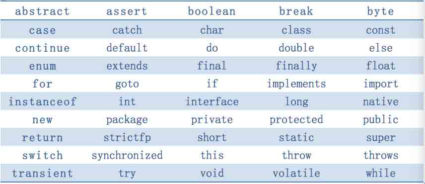
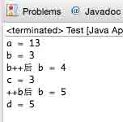
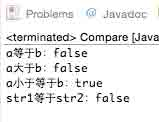
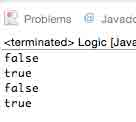
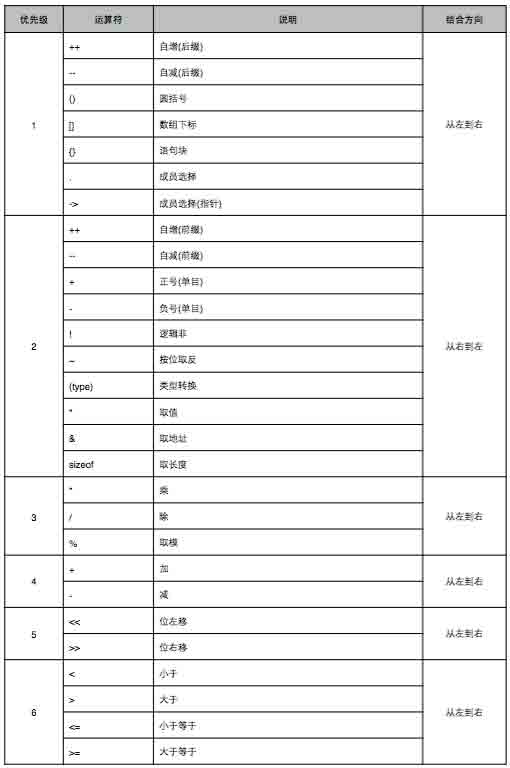
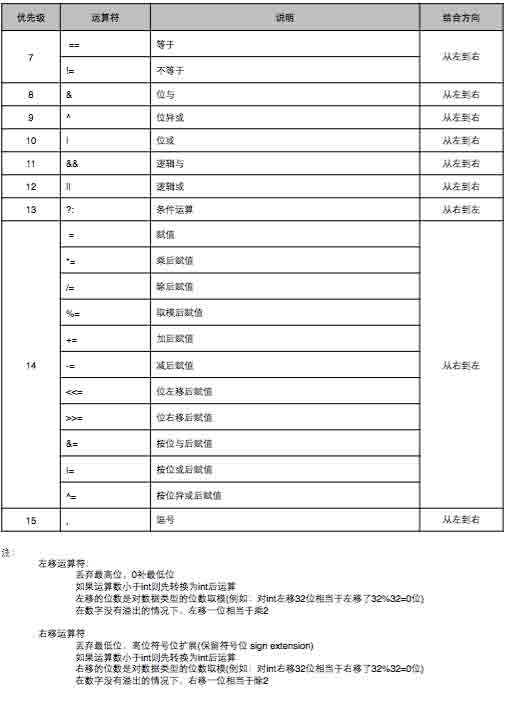

# 第 2 节 Java 基本语法

## 实验介绍

　　在本章我们就来学习一下 Java 基本语法里的关键字、标识符、注释、变量和常量的相关知识。

## 一、开发第一个 Java 程序

　　还记得上一节课的 Hello World 吗？这一节课，我们还是先来看一看这一段代码。

```java
 public class HelloWorld
        {
            public static void main(String[] args)
            {
                System.out.println("Hello World!");
            }
        } 
```

上面程序中包括 Java 的一些基本特征： 　　

*   类(class)：上面程序定义了一个类 HelloWorld，该类的名字与 .java 文件的名字相同。

*   方法(method)：类的内部定义了该类的一个方法 ，其中 main 被叫做主函数，是 java 程序的入口。

*   语句(statement)：“打印”这个功能是由一个语句实现，即：`System.out.println("Hello World!");`

下面两点有关 Java 的书写方式：

*   Java 中的语句要以`;`结尾 。

*   用花括号`{}`来整合语句，形成程序块。通过程序块，我们可以知道程序的不同部分的范围，比如类从哪里开始，到哪里结束。

## 二、Java 关键字

　　Java 的关键字对 java 的编译器有特殊的意义，他们用来表示一种数据类型，或者表示程序的结构等，关键字不能用作变量名、方法名、类名、包名。

　　Java 关键字有如下表所列，同学们先有个印象，具体含义我们将在后续的内容中详细讲解：



## 三、Java 标识符

　　Java 语言中，对于变量，常量，函数，语句块也有名字，我们统统称之为 Java 标识符.

　　标识符是用来给类、对象、方法、变量、接口和自定义数据类型命名的。

　　Java 标识符由数字，字母和下划线`_`，美元符号`$`组成。在 Java 中是区分大小写的，而且还要求首位不能是数字。最重要的是，Java 关键字不能当作 Java 标识符。 下面的标识符是合法的：

```java
shiYanlou, Shi_Yanlou, $money, _Java_learning, OK, _3th, _3_ 
```

下面的标识符是非法的：

```java
#shiyan，25years，class，&name，if 
```

在 Java 中，还有一些约定俗成的命名规则，希望同学们在写代码的时候都能遵循这些规则：

1.  类和接口名。每个字的首字母大写，含有大小写。例如，MyClass，HelloWorld，Time 等。

2.  方法名。首字符小写，其余的首字母大写，含大小写。尽量少用下划线。例如，myName，setTime 等。这种命名方法叫做驼峰式命名。

3.  常量名。基本数据类型的常量名使用全部大写字母，字与字之间用下划线分隔。对象常量可大小混写。例如，SIZE_NAME。

4.  变量名。可大小写混写，首字符小写，字间分隔符用字的首字母大写。不用下划线，少用美元符号。给变量命名是尽量做到见名知意。

5.  命名过程中尽量做到见名知意，方便后期查看和修改代码，也方便其他人员的阅读。

## 四、变量

　　还记得我们在上面见到的 Java 关键字吗？在关键字里有一部分便是我们以后会经常用到的数据类型。通常我们在定义变量的时候，便会在变量名前面加上变量所对应的数据类型。

　　计算机语言通常需要在内存中存放数据，比如 C 语言中的变量，Java 也有类似的变量。Java 和 C 语言都是静态类型的语言。在使用变量之前，要声明变量的类型。

变量(variable)占据一定的内存空间。不同类型的变量占据不同的大小。Java 中的变量类型如下：

```java
| 数据类型 | 默认值 | 存储格式 | 数据范围 |
| - | - | - | - |
| short | 0 | 2 个字节 | -32,768 到 32767 |
| int | 0 | 4 个字节 | -2,147,483,648 到 2,147,483,647 |
| byte | 0 | 1 个字节 | -128 到 127 | 
| char | /u0000 | 2 个字节 | Unicode 的字符范围 |
| long | 0L 或 0l | 8 个字节 | -9,223,372,036,854,775,808 到 9,223,372,036, 854,775,807 |
| float | 0.0F 或 0.0f | 4 个字节 | 32 位 IEEEE 754 单精度范围 |
| double | 0.0 或 0.0D(d) | 8 个字节 | 64 位 IEEE 754 双精度范围 |
| boolean | false | 1 位 | true(1)或 false(0) |
```

　　在 Java 中，变量需要先声明(declare)才能使用。在声明中，说明变量的类型，赋予变量以特别名字，以便在后面的程序中调用它。你可以在程序中的任意位置声明变量。 比如:

```java
 public class Test
    {
        public static void main(String[] args)
        {
            System.out.println("Define a variable a is ");
            int a; //声明变量 a
            a = 5;
            System.out.println(a);  // 打印一个整数 a
        }
    } 
```

　　上面 a 是变量名。可以在声明变量的同时，给变量赋值，比如 `int a = 5;`

　　`变量`的概念实际上来自于面向过程的编程语言。在 Java 中，所谓的变量实际上是`基本类型 (premitive type)`。我们将在类的讲解中更多深入。 上面的程序还可以看到，Java 中，可用`//`引领注释。

　　说到注释，在我们写代码的时候，为了方便理解和阅读，往往会在相关的代码附近添加说明文字，也就是我们的注释。注释是为了防止编译器在编译的时候将我们的注释也一并编译了，导致程序出错，所以在编译的时候，编译器会自动跳过我们编写的注释。

一般在 Java 里有三种注释：

*   行注释`//`：只注释一行

*   段注释`/*...*/`：注释若干行

*   文档注释`/**...*/`：注释若干行，并写入 javadoc 文档

## 五、自动类型转换和强制类型转换

　　小伙伴们，我们运行一下如下的程序段，在控制台输出的结果会是怎样的呢？

```java
public class HelloWorld{
    public static void main(String[] args) {
        double avg1=79.5;
        int rise=10;
        double avg2=avg1+rise;
        System.out.println("调整前的平均分："+avg1);
        System.out.println("调整后的平均分："+avg2);
    }
} 
```

　　在上面的程序中，我们定义了三个变量：avg1、rise、avg2，其中 avg1 是 double 类型的变量，而 rise 是 int 类型的变量，两种类型不一样的变量加在了一起变成了什么类型了呢？没错，在运算过程中 rise 被自动转换成了 double 类型的变量。

　　在 Java 程序中，不同的数据类型有些时候需要进行相互转换。数据类型转换就分为了`自动类型转换`和`强制类型转换`

　　自动类型转换是在程序执行过程中，不需要我们去特殊声明或者操作，变量由于需要而自动转换成了合适的数据类型。

自动类型转换需要满足下面的两个条件：

1.  目标类型与原类型兼容

2.  目标类型的字节数大于或等于原类型字节数

## 六、常量

　　有时候我们在写程序的时候，并不想因为某些操作而改变一些值，这时候我们就要用到常量这个概念了。所谓常量，我们也可以把它们理解为特殊的变量，只是它们在程序的运行过程中是不允许改变的。

一般常量有两种意思：

1.  第一种意思就是这个值本身，如一个整数 9，我们就说是“一个 int 类型的常量 9”。当然还有实数常量 3.14，字符常量‘a’等等。

2.  另一种常量便表示不可变的变量，就是我们在变量声明前加上了 final 关键字。比如：`final int i＝0`；那么这个 i 的值便不能被修改。

## 七、作业

　　好了，我们今天的 Java 基础语法课程就讲完了，你记住了吗？ 接下来，大家来定义几个变量和几个常量试试！(注意语法规则和命名规则！)

## Java 运算符

* * *

## 实验介绍

　　本实验将介绍 Java 的算术运算符、赋值运算符、逻辑运算符、比较运算符、条件运算符，以及运算符的优先级。

## 一、算术运算符

　　运算符顾名思义是一种符号，它是连接一个以上的操作符，实现某种功能的运算。

　　我们就先来认识一下算术运算符吧！

　　算术运算符主要实现的是算术运算，如我们常见的`加法`、`减法`、`乘法`、`除法`等。

```java
| 算术运算符 | 名称 | 举例 | 类型 |
| - | - | - | - |
| + | 加法 | a = 6 + 7 | 双目运算符 |
| - | 减法 | a = 9 - 3 | 双目运算符 |
| * | 乘法 | a = 8 * 6 | 双目运算符 |
| / | 除法 | a = 4 / 2 | 双目运算符 |
| % | 取余 | a = 5 % 3 | 双目运算符 |
| ++ | 自增 1 | ++i（或 i++） | 单目运算符 |
| -- | 自减 1 | --i（或 i--） | 单目运算符 |
```

　　上面的例子中`a`和`i`均为一个变量，`=`为赋值运算符，功能便是将等式右边的运算结果赋给左边的变量。

　　取余操作就是求取余数的意思，如上面的例子中`a = 5 % 3`，由此可以知道`a`的值为`2`。 　　 　　自加和自减运算有两种写法，虽然++i 和 i++，虽然它们都是自增 1，但是根据++的顺序，++i 是先加再取值，i++是先取值在加。

　　我们在 Eclipse 上来直观的感受一下吧！ 　　 　　第一步，我们先新建一个工程，然后新建一个包，再在包下新建一个源代码文件。（可参考第章一节,代码的类名要和源代码文件名一致）。

　　接下来输入以下代码，进行验证吧，同学们也可自行组织代码验证一下。

```java
public class Test
{

    public static void main(String[] args)
    {
        int a, b, c, d;
        a = 6 + 7;
        System.out.println("a = "+a);
        b = a % 5;
        System.out.println("b = "+b);
        c = b++;
        System.out.println("b++后 b = "+b);
        System.out.println("c = "+c);
        d = ++b;
        System.out.println("++b 后 b = "+b);
        System.out.println("d = "+d);
    }
} 
```



　　大家可以发现++在变量的左边和右边，赋值得到的结果是不一样的，自减也是同样的道理。

## 二、赋值运算符

赋值运算符是指将左边的操作数或运算结果赋值给右边的操作数。

```java
| 赋值运算符 | 名称 | 举例 | 类型 |
| - | - | - | - |
| = | 赋值 | a = c | 双目运算符 |
| += | 加等于 | a += c 等价于 a = a + c | 双目运算符 |
| -= | 减等于 | a -= c 等价于 a = a - c | 双目运算符 |
| *= | 乘等于 | a *= c 等价于 a = a * c | 双目运算符 |
| /= | 除等于 | a /= c 等价于 a = a / c | 双目运算符 |
| %= | 取余等于 | a %= c 等价于 a = a % c | 双目运算符 |
```

练习：大家自己搭建一个项目，声明一些变量，将上面的赋值运算符进行一些操作，并将结果打印到控制台上。（同学们一定要自己动手练习哦，学习 Java 开发，实践才最重要，可以参见上面代码！）

## 三、比较运算符

　　比较运算符是用来判断两个操作数的大小的双目运算符，比较的结果是一个布尔值（true or false）。

java 中常用的比较运算符如下：

```java
| 比较运算符 | 名称 | 举例 | 结果 |
| - | - | - | - |
| > | 大于 | a = 1;b = 3; a > b | false |
| < | 小于 | a = 6;b = 9; a < b | true |
| \>= | 大于等于 | a = 7; b = 8; a >= b | false |
| <= | 小于等于 | a = b; a <= b | true |
| == | 等于 | a = 8; b = 5; a == b | false |
| != | 不等于 | a = 8; b = 5; a != b | true |
```

注意：

1.  `>`、`<`、`>=`、`<=`只支持左右两边的操作数是数值类型（即整形、浮点型等）。
2.  `==`、`!=`两边的操作数既可以是数值类型，又可以是引用类型（后面会讲什么叫引用）

大家来练习一下下面的代码吧！

```java
public class Compare{
    public static void main(String[] args) {
        int a = 1;
        double b = 7.2;
        String str1 = "hello";
        String str2 = "ShiYanlou";
        System.out.println("a 等于 b：" + (a ==  b));
        System.out.println("a 大于 b：" + (a  > b));
        System.out.println("a 小于等于 b：" + (a  <= b));
        System.out.println("str1 等于 str2：" + (str1 ==  str2));
    }
} 
```



## 四、逻辑运算符

　　逻辑运算符是通过运算符将操作数或等式进行逻辑判断的语句。是不是晕了，不过没关系，木木举个例子大家就懂了。不过我们先看看有哪些逻辑预算符吧！

```java
| 逻辑运算符 | 名称 | 举例 | 类型 | 
| - | - | - | - |
| && | 与 | a && c | 双目运算符 |
| ｜｜ | 或 | a ｜｜ c | 双目运算符 |
| ！ | 非 | !a | 单目运算符 |
| ^ | 异或 | a ^ c | 双目运算符 |
```

我们可以通过“举手表决”来理解逻辑运算符

*   与`&&`：`a`同意了（值为`true`），`c`也同意了（值为`true`），那这件事情肯定就 Ok 了，所以 `a && c`就为`ture`；但是其中有一个人不同意，这件事情不行，也就是`a`和`c`中，有一个为`false`， `a && c`就为`false`。

*   或`||`：这件事情只要有一个人同意了，就可以了。所以`a`和`c`中，有一个为`true`， `a || c`就为`true`。

*   非`!`：某个人原本同意，但非运算使他的结果变为相反的。`a`为`true`，`!a`就是`false`；`a`为`false`，`!a`就是`true`。

*   异或`^`：两个人的表决结果相同，就不通过；表决结果不同，才通过。所以`a`和`c`中，一真一假结果为真，其他的都是假。

看看如下的代码，同学们用逻辑运算符随意组合，看看输出的结果吧！

```java
public class Logic {
    public static void main(String[] args) {
        boolean a = true; // a 同意
        boolean b = false; // b 反对
        boolean c = false; // c 反对
        boolean d = true; // d 同意
    System.out.println(a&&b);
    System.out.println((a||b));
    System.out.println((!a));
    System.out.println((c^d));
    }
} 
```



## 五、条件运算符

　　同学们从上面我们可以发现，我们把各类运算符分为了单目运算符和双目运算符，这是什么意思呢？单目运算符（或一元运算符）是只需要有一个操作数的运算符，双目运算符（或二元运算符）是需要两个操作数的运算符。

　　那有没有三目运算符呢？

　　条件运算符`?:`便是唯一的一个三目运算符了。

　　语法形式：布尔表达式？表达式 1 : 表达式 2

　　运算过程：如果布尔表达式的值为 true ，则返回 表达式 1 的值，否则返回 表达式 2 的值。

　　例如：

　　String str = (3<2） ? "3 小于 2" : "3 大于 2";

　　System.out.println(str);

　　分析一下上面的代码，很明显`3<2`是`false`,所以返回第二个表达式，即`str = "3 大于 2"`。

练习一下吧：

　　如果成绩大于或等于 60 ，在控制台上输出及格，反之输出不及格，成绩用 score 表示，它的值定为 68.9。

　　我们来分析一下首先我们得创建一个项目和源代码文件（当然你也可以先创一个包，再创建源代码文件），然后输入我们的固定结构（类和主函数）。

　　其次我们要定义一个变量 score，因为它的值为 68.9，所以我们定义为 double。

　　然后我们利用条件表达式进行判断，最后再输出到控制台。

参考代码如下： 　　

```java
public class Test{
    public static void main(String[] args) {
        double score = 68.9;
        String str = (score >= 60) ? "及格" : "不及格";
        System.out.println("考试成绩："+str);
    }
} 
```

## 六、运算符的优先级

　　运算符的优先级是帮助我们在一个表达式中如何对于不同的运算符和相同的运算符，进行正确的运算顺序。

　　运算符的优先级大家在日常生活中通过多多运用自然就熟悉了，不需要特别地去记忆它，下面是木木多年的总结，有些运算符大家可能还认识，先熟悉一下就行了。 　　 !



## 七、作业

同学们先想一想下面的逻辑表达是的值是 true 还是 false。然后用代码验证一下吧。

(5 > 2) && (4 == 5)

false || (2 < 5)

提示：true 表示非 0，false 表示 0