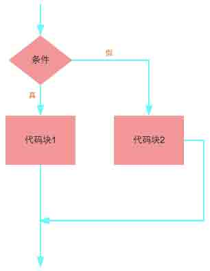
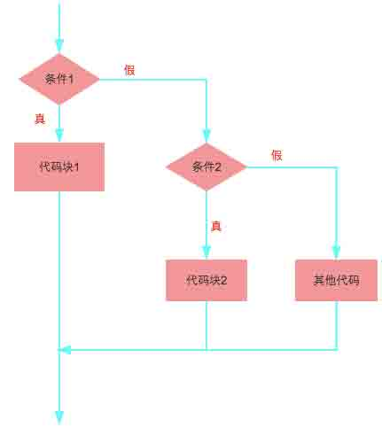
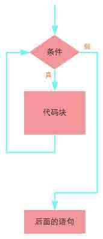
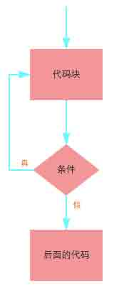

# 第 4 节 Java 控制语句

* * *

## 实验介绍

　　本实验将学习条件控制语句和循环控制语句相关的语法知识。

## 一、条件控制语句

　　在生活中我们有很多时候都会面临选择，在做选择之前我们会进行一系列的判断。比如对于今天是否要出门这样的选择，我们会对天气做一个判断。如果天气好，我们就出门；如果天气不好，我们就不出门。这种需要先判断条件，条件满足后才执行的情况我们就可以用条件控制语句来实现。

　　if 语句便是一种判断语句。

语法：

```java
if(条件){
    条件成立时执行的代码
} 
```


　　if...else 语句当条件成立时，则执行 if 部分的代码块； 条件不成立时，则进入 else 部分。例如，如果一个月天数大于 30 天，则为大月，否则为小月。

语法：

```java
if(条件){
    代码块 1
}
else{
    代码块 2
} 
```



　　多重 if 语句，在条件 1 不满足的情况下，才会进行条件 2 的判断，以此向下；当前面的条件均不成立时，最终执行 else 块内的代码。

语法：

```java
if(条件 1){
    代码块 1
}
else if(条件 2){
    代码块 2
}
...
else {
    代码块 n
} 
```



注意：如果 if(或 else if，或 else)条件成立时的执行语句只有一条，是可以省略大括号的！但如果执行语句有多条，那么大括号就是不可或缺的。

比如：

```java
int days = 31;
if(days > 30)
    System.out.println("本月是大月");
else
    System.out.println("本月是小月"); 
```

　　if 语句是可以在内层进行嵌套的。嵌套 if 语句，只有当外层 if 的条件成立时，才会判断内层 if 的条件。

语法：

```java
if(条件 1){
    if(条件 2){
        代码块 1
    }
    else{
        代码块 2
    }
}
else{
    代码块 3
} 
```


　　接下来我们来做一个简单的练习吧：小明考了 78 分，60 分以上及格，80 分以上为良好，90 分以上为优秀，60 分以下要重考，编写一段程序，输出小明的情况吧。

参考代码如下：

```java
public class ScoreJudge {
    public static void main(String[] args){
        int score = 78;
        if(score >= 60){
            if(score >= 80){
                if(score >= 90){
                    System.out.println("成绩优秀");
                }
                else{
                    System.out.println("成绩良好");
                }
            }
            else{
                System.out.println("成绩及格");
            }
        }
        else{
            System.out.println("需要补考");
        }
    }
} 
```

　　上面木木给大家详细地介绍了 if 语句，接下来我们还要学习另一种条件语句：switch 语句。当需要对选项进行等值判断时，使用 switch 语句更加简洁明了。比如：摇号摇到 1 的得一等奖，摇到 2 的得二等奖，摇到 3 的等三等奖，摇到其他的没有奖。

语法：

```java
switch(表达式){
    case 值 1:
        代码块 1
        break;
    case 值 2:
        代码块 2
        break;
    ...
    default:
        默认执行的代码块
} 
```

　　当 switch 后表达式的值和 case 语句后的值相同时，从该位置开始向下执行，直到遇到 break 语句或者 switch 语句块结束；如果没有匹配的 case 语句则执行 default 块的代码。

例如上面的例子：

```java
public class Draw {
    public static void main(String[] args){
        int num = 2;
        switch(num){
        case 1:
            System.out.println("恭喜你，获得了一等奖");
            break;
        case 2:
            System.out.println("恭喜你，获得了二等奖");
            break;
        case 3:
            System.out.println("恭喜你，获得了三等奖");
            break;
        default:
            System.out.println("很遗憾，下次再来");     
        }
    }
} 
```

## 二、循环控制语句

　　在我们的日常生活中，为了完成某些事情，我们需要重复地执行某些动作，比如我们走路的时候，要左右脚不停的重复交替。在计算机中，对一些重复的事情，是不是需要我们不停的输入呢？其实有一个更好的办法，循环语句。

　　我们先来学习一下循环语句中的`while`和`do...while`。

`while`语法：

```java
while(条件){
    代码块
} 
```

while 的执行过程是先判断，再执行。

1.  判断 while 后面的条件是否成立( true or false )

2.  当条件成立时，执行循环内的代码，然后重复执行`1.`、`2.`， 直到循环条件不成立为止



`do...while`语法：

```java
do{
    代码块
}while(条件); 
```

do...while 的执行过程是先执行，在判断（所以循环内的代码至少会执行一次）

1.  先执行一遍循环操作，然后判断循环条件是否成立

2.  如果条件成立，继续执行`1.`、`2.`，直到循环条件不成立为止



下面的例子：

```java
int i = 0;
while(i < 100){
    System.out.println("I love ShiYanlou!");
    i++;
} 
```

```java
int i = 0;
do {
    System.out.println("I love ShiYanlou!");
    i++;
} while(i < 100); 
```

　　接下来我们就来练习一下吧：分别用 while 和 do...while 两种方法，编写一个程序，实现 1-1000 中所有偶数的和，并输出。验证一下两种方法你输出的结果是一致吗？

参考如下：

```java
public class SumOfOdd {
    public static void main(String[] args){
        int i1 = 1, i2 = 1;
        int sum1 = 0, sum2 = 0;

        while (i1 <= 1000){     //循环 1000 次  
            if(0 == i1 % 2){   //判断是否为偶数
                sum1 += i1;    //将偶数加入到总数里
            }
            i1++;              //i 自增 1
        }
        System.out.println("用 while，1 到 1000 中，所有偶数的和为："+sum1);

        do {
            if (0 == i2 % 2){   //在条件语句中，将数值写在前面是为了防止将==写成了=    
                sum2 += i2;   
            }
            i2++;                 
        } while(i2 <= 1000);    
        System.out.println("用 do...while，1 到 1000 中，所有偶数的和为："+sum2);
    }
} 
```

　　最后我们来学习另一个循环语句`for 语句`

语法：

```java
for(循环变量初始化; 循环条件; 循环变量变化){
    循环操作
} 
```

for 相比 while 和 do...while 语句结构更加简洁易读，它的执行顺序：

1.  执行循环变量初始化部分，设置循环的初始状态，此部分在整个循环中只执行一次

2.  进行循环条件的判断，如果条件为 true，则执行循环体内代码；如果为 false ，则直接退出循环

3.  执行循环变量变化部分，改变循环变量的值，以便进行下一次条件判断

4.  依次重新执行`2.`、`3.`、`4.`，直到退出循环


例如，计算 100 以内不能被整除的数之和：

```java
 int sum = 0; // 保存不能被 3 整除的数之和
    // 循环变量 i 初始值为 1 ,每执行一次对变量加 1，只要小于等于 100 就重复执行循环
    for (int i = 1;i<=100;i++) {
    // 变量 i 与 3 进行求模（取余），如果不等于 0 ，则表示不能被 3 整除
        if (i % 3 != 0) { 
            sum = sum + i; // 累加求和
        }
    }
    System.out.println("1 到 100 之间不能被 3 整除的数之和为：" + sum); 
```

我们来练习一下吧，用 for 语句实现上面的练习题目。

参考代码如下：

```java
public class SumOfOdd {
    public static void main(String[] args){
        int sum = 0;
        for(int i = 1; i <= 1000; i++){
            if(0 == i % 2){
                sum += i;
            }
        }
        System.out.println("用 for，1 到 1000 中，所有偶数和为："+sum);
    }
} 
```

　　　在讲条件控制语句的时候，给同学们讲解了 if 语句的嵌套，在循环语句里，三种循环语句可以自身嵌套，也可以相互嵌套，最常见的就是二重循环。在二重循环中，外层循环每执行一次，内层循环要执行一圈。

比如我想打印

*

**

***

****

这样的图形

```java
 // 外层循环控制行数
        for (int i = 1; i<=4; i++          ) {

            // 内层循环控制每行的*号数
            // 内层循环变量的最大值和外层循环变量的值相等
            for (int j = 1; j<=i; j++             ) {
                System.out.print("*");
            }

            // 每打印完一行后进行换行
            System.out.println();
        } 
```

练习一下：将这样的图形打印在控制台上

1

12

123

1234

12345

参考代码如下：

```java
public class PrintNum {
    public static void main(String[] args){
         // 外层循环控制行数
        for (int i = 1; i<=5; i++          ) {

            // 内层循环控制每行的数
            // 内层循环变量的最大值和外层循环变量的值相等
            for (int j = 1; j<=i; j++             ) {

                System.out.print(j);
            }

            // 每打印完一行后进行换行
            System.out.println();
        }
    }
} 
```

## 三、跳转语句

　　我们上面讲解 switch 语句的时候，看到了`break`这个关键字，它有什么用呢？同学们，我们将上面 switch 练习题里的代码中`break`去掉，运行一下，发现了什么问题吗？`break`的意思为跳出，经常用在条件和循环语句中，用来跳出***循环语句***的。

例如：

```java
for(int i = 1; i <= 10; i++){
    if(0 == i % 3){
        break;
    }
    if(0 == i % 5){
        System.out.println("我进来了！")
    }
} 
```

　　上面的代码中，本来 for 语句会使得循环体内的代码循环 10 次，但当`i=3`时,进入了第一个条件语句，遇到了`break`,结束了循环，而永远也进不了第二个条件语句。

　　在跳转语句中，还有一个`continue`跟`break`很像，它的作用是跳过循环体中剩余的语句执行下一次循环。

比如我们要打印 10 以内的所有奇数：

```java
for(int i = 1; i <= 10; i++){
    if(0 == i % 2) //判断 i 是否为偶数
        continue;  //通过 continue 结束本次循环
    System.out.println(i);
} 
```

## 四、作业

　　今天的所有内容就结束了，同学们掌握的怎么样呢？我们就以一道编程题来考考大家吧。

　　一个大于 1 的自然数，除了 1 和它本身外，不能被其他自然数整除，换句话说就是该数除了 1 和它本身以外不再有其他的因数的数被称为素数，请编程判断 4549、8461、641、313 是否为素数。

参考代码如下：

```java
public class JudgePrime {
    public static void main(String[] args){
        int a = 4549;
        boolean result = true;      
        for (int i=2; i*i < a; i++) { 
            if (a % i == 0) {  //a 依次除以从 2 到 a 开放后的数（a 能整除 5，就一定能整除（a/5））
                result = false;
                break;
            }
        }
        if (result) {
            System.out.println(a+"是素数");
        }
        else
          System.out.println(a+"不是素数");
    }
} 
```