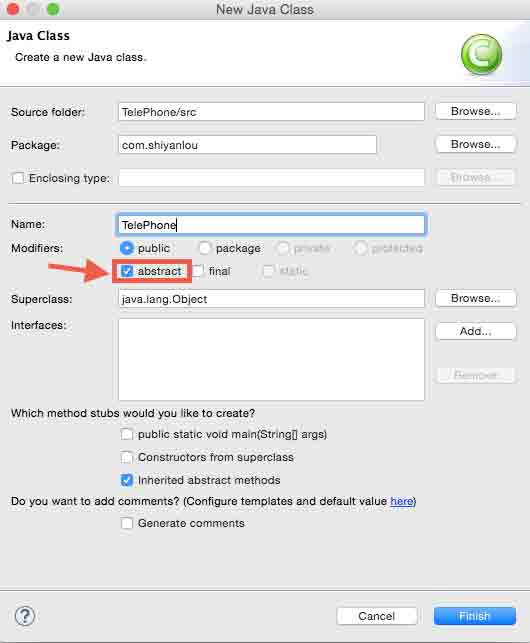

# 第 10 节 Java 多态

* * *

## 实验介绍

　　本实验将学习 Java 面向对象的最后一个特性——多态

## 一、多态定义

　多态就是指对象的多种形态。木木将从两个方面为同学们介绍多态。一个是引用的多态；一个是方法的多态。

#### １、引用多态

　　当我们在写面向对象程序的时候，一般父类的引用可以指向本类的对象。

```java
Animal a = new Animal();  //a 是父类的引用指向的是本类的对象

Animal b = new Dog(); //b 是父类的引用指向的是子类的对象
//注意：我们不能使用一个子类的引用去指向父类的对象 
```

　　多态中，可以使用父类的引用指向子类的对象，如上面代码里的对象`b`，那`b`究竟是代表 Dog 类还是代表`Animal`类呢？ 　　

#### 2、方法多态

　　一般情况下，我们都是用本类的对象，调用本类的方法。在多态中，创建子类对象时，调用的方法为子类重写的方法或继承的方法。

　　我们在上节课在 Dog 类中重写了`bark()`方法，我们看一看下面的代码

```java
Animal a = new Animal();  //a 是父类的引用指向的是本类的对象
Animal b = new Dog(); //b 是父类的引用指向的是子类的对象
//这边是引用的多态

a.bark();   //调用的是父类 Animal 的方法

b.bark();   //调用的是子类 Dog 重写的方法
//这便是方法的多态 
```

注意：

1.  父类分引用指向子类对象时不可以调用子类独有的方法，只能调用继承或重写的方法
2.  引用多态不能使用一个子类的引用去指向父类的对象

## 二、多态引用类型转换

　　在我们使用多态时，经常会用到引用类型转换。引用类型转换有两种。

　　一种引用类型转换是`向上类型转换（隐式/自动类型转换）`，是小类型到大类型的转换（无风险）。另一种是`向下类型转换（强制类型转换）`，是大类型到小类型（有风险）。

　　比如一杯水，我们倒进壶里，这种向上转换是不存在风险的，计算机可以自动帮我们完成，所以`向上类型转换`又叫做`自动类型转换`或`隐式类型转换`。而如果我们想将壶里的水倒进杯子里，就可能会产生溢出，这是有风险的。计算机是不会自动完成这样的操作。但如果程序猿想要完成这样的操作，就只能强制转换。所以`向下类型转换`又叫做`强制类型转换`。

例如：

```java
Dog a = new Dog();

Animal b = a; //自动类型提升 向上类型转换（无风险）

/*
Dog c = b; 
//将父类引用转换成子类引用，编译器不允许这样做
*/

Dog c = (Dog)b; //在父类前加上小括号，里面加上子类类型，实现强制转换
//向下类型转换

/*
Cat d = (Cat)b;
//虽然编译器不会报错，但运行会出问题，因为 b 是指向 Dog 类的，它们是不同类型的对象，这里就存在风险
/* 
```

## 三、 抽象类

　　抽象类在定义类时，前面会加`abstract`关键字。那我们什么时候会用到抽象类呢？

1.  在某些情况下，某个父类只是知道其子类应该包含怎样的方法，但无法准确知道这些子类如何实现这些方法。也就是说抽象类是约束子类必须要实现哪些方法，而并不关注方法如何去实现。

2.  从多个具有相同特征的类中抽象出一个抽象类，以这个抽象类作为子类的模板，从而避免了子类设计的随意性。

所以由上可知，抽象类是限制规定子类必须实现某些方法，但不关注实现细节。

那抽象类如何用代码实现呢，它的规则如下：

1.  用 abstract 修饰符定义抽象类

2.  用 abstract 修饰符定义抽象方法，只用声明，不需要实现

3.  包含抽象方法的类就是抽象类

4.  抽象类中可以包含普通的方法，也可以没有抽象方法

5.  抽象类的对象不能直接创建，我们通常是定义引用变量指向子类对象。

我们来写一写代码吧

1、先创建一个抽象类



2、 填写需要子类实现的抽象方法

```java
package com.shiyanlou;

//抽象方法
public abstract class TelePhone {
    public abstract void call();  //抽象方法,打电话
    public abstract void message(); //抽象方法，发短信
} 
```

3、构建子类，并实现抽象方法。

```java
package com.shiyanlou;

public class CellPhone extends TelePhone {

    @Override
    public void call() {
        // TODO Auto-generated method stub
        System.out.println("我可以打电话！");
    }

    @Override
    public void message() {
        // TODO Auto-generated method stub
        System.out.println("我可以发短信！");
    }

} 
```

## 四、作业

　　同学们，将今天的内容自己实现一遍，有时间复习一下前面所讲的知识，我们的课程就完结了，希望大家继续深入学习后面的 Java 课程。