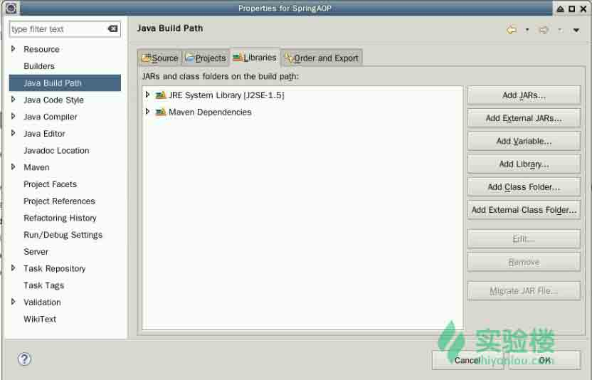
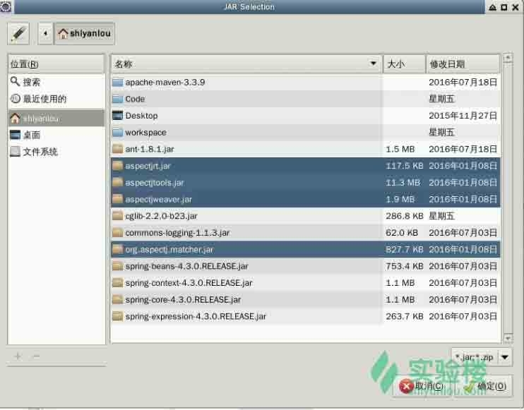
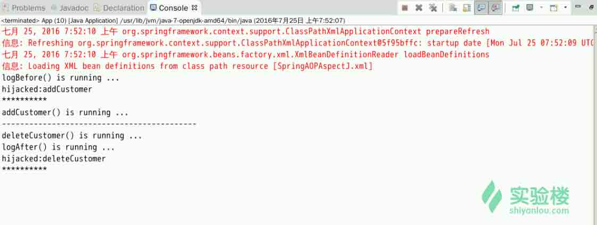
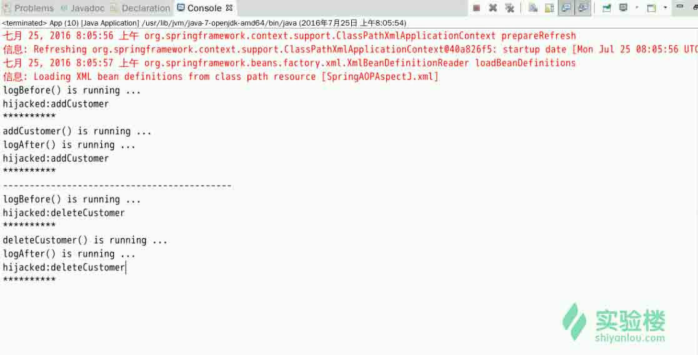

# 第 8 节 Spring AOP AspectJ

## 一、 实验说明

### 1.1 实验简介

本节讲述使用 AspectJ 框架实现 Spring AOP 。再重复一下 Spring AOP 中的三个概念，Advice：向程序内部注入的代码。Pointcut：注入 Advice 的位置，切入点，一般为某方法。Advisor： Advice 和 Pointcut 的结合单元，以便将 Advice 和 Pointcut 分开实现灵活配置。 AspectJ 是基于注释（ Annotation ）的，所以需要 JDK5.0 以上的支持。

AspectJ 支持的注释类型如下：

*   @Before
*   @After
*   @AfterReturning
*   @AfterThrowing
*   @Around

### 1.2 实验来源

本课程后续实验基于博客园 leiOOlei 博文制作，原文链接见： [`www.cnblogs.com/leiOOlei/p/3441419.html`](http://www.cnblogs.com/leiOOlei/p/3441419.html) ，感谢原作者 [leiOOlei](http://www.cnblogs.com/leiOOlei) 提供的优质教程。

## 二、准备工作

首先定义一个简单的 bean ，CustomerBo 实现了接口 ICustomerBo 。 ICustomerBo.java 如下：

```java
package com.shiyanlou.spring.aop.aspectj;

public interface ICustomerBo {
    void addCustomer();
    void deleteCustomer();
    String AddCustomerReturnValue();
    void addCustomerThrowException() throws Exception;
    void addCustomerAround(String name);

} 
```

CustomerBo.java 如下：

```java
package com.shiyanlou.spring.aop.aspectj;

public class CustomerBo implements ICustomerBo {

    public void addCustomer() {
        System.out.println("addCustomer() is running ...");
    }

    public void deleteCustomer() {
        System.out.println("deleteCustomer() is running ...");
    }

    public String AddCustomerReturnValue() {
        System.out.println("AddCustomerReturnValue() is running ...");
        return "abc";
    }

    public void addCustomerThrowException() throws Exception {
        System.out.println("addCustomerThrowException() is running ...");
        throw new Exception("Generic Error");
    }

    public void addCustomerAround(String name) {
        System.out.println("addCustomerAround() is running ,args:"+name);

    }

} 
```

## 三、 简单的 AspectJ ，Advice 和 Pointcut 结合在一起

首先没有引入 Pointcut 之前，Advice 和 Pointcut 是混在一起的步骤，只需要两步，如下：

*   创建一个 Aspect 类
*   配置 Spring 配置文件

由于接下来要使用 aspectj 的 jar 包，我们需要首先获取并安装，步骤如下：

```java
wget http://labfile.oss.aliyuncs.com/courses/578/aspectJLib.tar.gz 
```

然后解压：

```java
tar -zvxf aspectJ-Lib.tar.gz 
```

接下来将下载好的 Jar 包导入到项目路径中。在项目名上右键，选择最后一项 `Properties` ，在左侧选中： `Java Build Path`, 然后在右侧选中 `Libraries` 选显卡，如图：



右侧选择 `Add External JARs` ,选中与 aspectJ 有关的四个 Jar ,如图：



点击确定。

### 3.1 创建 Aspect 类

LoggingAspect.java 如下：

```java
package com.shiyanlou.spring.aop.aspectj;

import org.aspectj.lang.JoinPoint;
import org.aspectj.lang.annotation.After;
import org.aspectj.lang.annotation.Aspect;
import org.aspectj.lang.annotation.Before;

@Aspect
public class LoggingAspect {

    @Before("execution(public * com.shiyanlou.spring.aop.aspectj.CustomerBo.addCustomer(..))")
    public void logBefore(JoinPoint joinPoint){
        System.out.println("logBefore() is running ...");
        System.out.println("hijacked:"+joinPoint.getSignature().getName());
        System.out.println("**********");
    }

    @After("execution(public * com.shiyanlou.spring.aop.aspectj.CustomerBo.deleteCustomer(..))")
    public void logAfter(JoinPoint joinPoint){
        System.out.println("logAfter() is running ...");
        System.out.println("hijacked:"+joinPoint.getSignature().getName());
        System.out.println("**********");
    }
} 
```

解释：

1.  必须使用 @Aspect 在 LoggingAspect 声明之前注释，以便被框架扫描到；
2.  此例 Advice 和 Pointcut 结合在一起，类中的具体方法 `logBefore` 和 `logAfter` 即为 Advice ，是要注入的代码，Advice 方法上的表达式为 Pointcut 表达式，即定义了切入点，上例中 `@Before` 注释的表达式代表执行 `CustomerBo.addCustomer` 方法时注入 `logBefore` 代码；
3.  在 LoggingAspect 方法上加入 `@Before` 或者 `@After` 等注释；
4.  `execution(public * com.lei.demo.aop.aspectj.CustomerBo.addCustomer(..))` 是 Aspect 的切入点表达式，其中，*代表返回类型，后边的就要定义要拦截的方法名，这里写的的是 `com.lei.demo.aop.aspectj.CustomerBo.addCustomer` 表示拦截 `CustomerBo` 中的 `addCustomer` 方法，(..)代表参数匹配，此处表示匹配任意数量的参数，可以是 0 个也可以是多个，如果你确定这个方法不需要使用参数可以直接用 () ，还可以使用 (*) 来匹配一个任意类型的参数，还可以使用 (* , String ) ，这样代表匹配两个参数，第二个参数必须是 String 类型的参数
5.  AspectJ 表达式，可以对整个包定义，例如，`execution ( * com.shiyanlou.service..*.*(..))` 表示切入点是 `com.shiyanlou.sevice` 包中的任意一个类的任意方法，具体的表达式请自行搜索。

### 3.2 配置 Spring 配置文件

配置 SpringAOPAspectJ.xml 文件，如下：

```java
<?xml version="1.0" encoding="UTF-8"?>
<beans 

    xsi:schemaLocation="http://www.springframework.org/schema/beans
    http://www.springframework.org/schema/beans/spring-beans.xsd
    http://www.springframework.org/schema/aop
    http://www.springframework.org/schema/aop/spring-aop.xsd">

    <aop:aspectj-autoproxy/>

    <bean id="customerBo" class="com.shiyanlou.spring.aop.aspectj.CustomerBo"/>

    <bean id="logAspect" class="com.shiyanlou.spring.aop.aspectj.LoggingAspect" />

</beans> 
```

`<aop:aspectj-autoproxy/>` 启动 AspectJ 支持，这样 Spring 会自动寻找用 @Aspect 注释过的类，其他的配置与 spring 普通 bean 配置一样。

执行 App.java 如下：

```java
package com.shiyanlou.spring.aop.aspectj;

import org.springframework.context.ApplicationContext;
import org.springframework.context.support.ClassPathXmlApplicationContext;

public class App {
    public static void main(String[] args) {

        ApplicationContext appContext = new ClassPathXmlApplicationContext(new String[] { "SpringAOPAspectJ.xml" });
        ICustomerBo customer=(ICustomerBo)appContext.getBean("customerBo");

        customer.addCustomer();

        System.out.println("-------------------------------------------");

        customer.deleteCustomer();

    }
} 
```

实验结果如下：



## 四、 将 Advice 和 Pointcut 分开

需要三步：

1.  创建 Pointcut
2.  创建 Advice
3.  配置 Spring 的配置文件

### 4.1 PointcutsDefinition.java

定义 Pointcut，如下：

```java
package com.shiyanlou.spring.aop.aspectj;

import org.aspectj.lang.annotation.Aspect;
import org.aspectj.lang.annotation.Pointcut;

@Aspect
public class PointcutsDefinition {

    @Pointcut("execution(* com.shiyanlou.spring.aop.aspectj.CustomerBo.*(..))")
    public void customerLog() {
    }
} 
```

解释：

1.  类声明前加入 @Aspect 注释，以便被框架扫描到。
2.  @Pointcut 是切入点声明，指定需要注入的代码的位置，如上例中指定切入点为 CustomerBo 类中的所有方法，在实际业务中往往是指定切入点到一个逻辑层，例如 `execution (* com.lei.business.service.*.*(..)）` ，表示 aop 切入点为 service 包中所有类的所有方法，具体的表达式后边会有介绍。
3.  方法 customerLog 是一个签名，在 Advice 中可以用此签名代替切入点表达式，所以不需要在方法体内编写实际代码，只起到助记功能，例如此处代表操作 CustomerBo 类时需要的切入点。

### 4.2 LoggingAspect.java

```java
package com.shiyanlou.spring.aop.aspectj;

import org.aspectj.lang.JoinPoint;
import org.aspectj.lang.annotation.After;
import org.aspectj.lang.annotation.Aspect;
import org.aspectj.lang.annotation.Before;

@Aspect
public class LoggingAspect {

    @Before("com.shiyanlou.spring.aop.aspectj.PointcutsDefinition.customerLog()")
    public void logBefore(JoinPoint joinPoint){
        System.out.println("logBefore() is running ...");
        System.out.println("hijacked:"+joinPoint.getSignature().getName());
        System.out.println("**********");
    }

    @After("com.shiyanlou.spring.aop.aspectj.PointcutsDefinition.customerLog()")
    public void logAfter(JoinPoint joinPoint){
        System.out.println("logAfter() is running ...");
        System.out.println("hijacked:"+joinPoint.getSignature().getName());
        System.out.println("**********");
    }
} 
```

解释：

1.  @Before 和 @After 使用 PointcutsDefinition 中的方法签名代替 Pointcut 表达式找到相应的切入点，即通过签名找到 PointcutsDefinition 中 customerLog 签名上的 Pointcut 表达式，表达式指定切入点为 CustomerBo 类中的所有方法。所以此例中 Advice 类 LoggingAspect ，为 CustomerBo 中的所有方法都加入了 @Before 和 @After 两种类型的两种操作。
2.  对于 PointcutsDefinition 来说，主要职责是定义 Pointcut ，可以在其中第一多个切入点，并且可以用便于记忆的方法签名进行定义。
3.  单独定义 Pointcut 的好处是，一是通过使用有意义的方法名，而不是难读的 Pointcut 表达式，使代码更加直观；二是 Pointcut 可以实现共享，被多个 Advice 直接调用。若有多个 Advice 调用某个 Pointcut ，而这个 Pointcut 的表达式在将来有改变时，只需修改一个地方，维护更加方便。

### 4.3 配置 Spring 配置文件

配置 SpringAOPAspectJ.xml 文件，如下：

```java
<beans 

    xsi:schemaLocation="http://www.springframework.org/schema/beans
    http://www.springframework.org/schema/beans/spring-beans.xsd
    http://www.springframework.org/schema/aop
    http://www.springframework.org/schema/aop/spring-aop.xsd">

    <aop:aspectj-autoproxy/>

    <bean id="customerBo" class="com.shiyanlou.spring.aop.aspectj.CustomerBo"/>

    <bean id="logAspect" class="com.shiyanlou.spring.aop.aspectj.LoggingAspect" />

</beans> 
```

App.java 不变，运行测试代码 App.java, 结果如下：



## 五、 实验总结

本小节我们了解了 AspectJ 框架。 AspectJ 是一个面向切面的框架，它扩展了 Java 语言。

AspectJ 定义了 AOP 语法所以它有一个专门的编译器用来生成遵守 Java 字节编码规范的 Class 文件。

## 六、练习

你可以在网上查找关于 AspectJ 框架的更多资料，建议对比一下 AspectJ 框架与 Spring AOP 的各自的优势缺点。

目前本课程已告一段落，谢谢同学们的坚持。再次感谢[leiOOlei](http://www.cnblogs.com/leiOOlei/category/531721.html)对本课程的支持。本课程属于 Spring 框架入门课程，实验楼会不断为你提供更加丰富的 Spring 项目课程，欢迎继续关注。