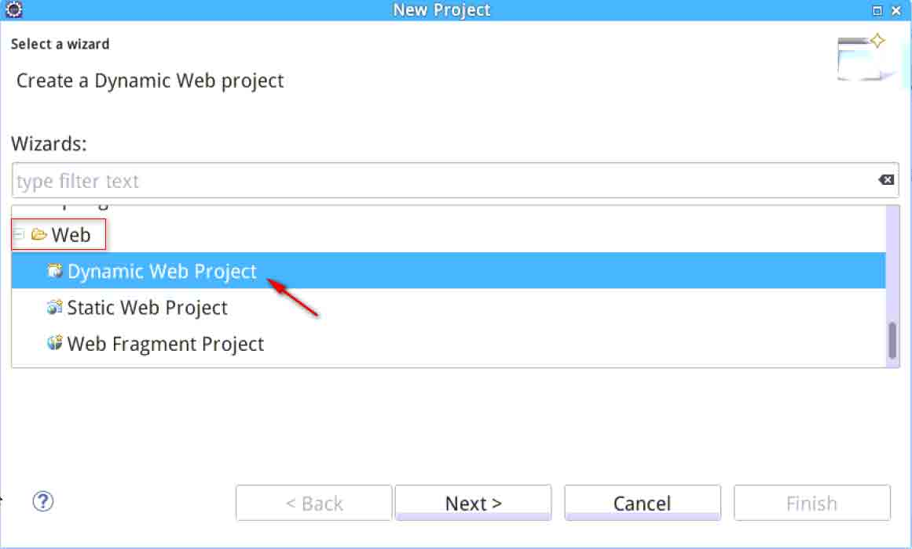
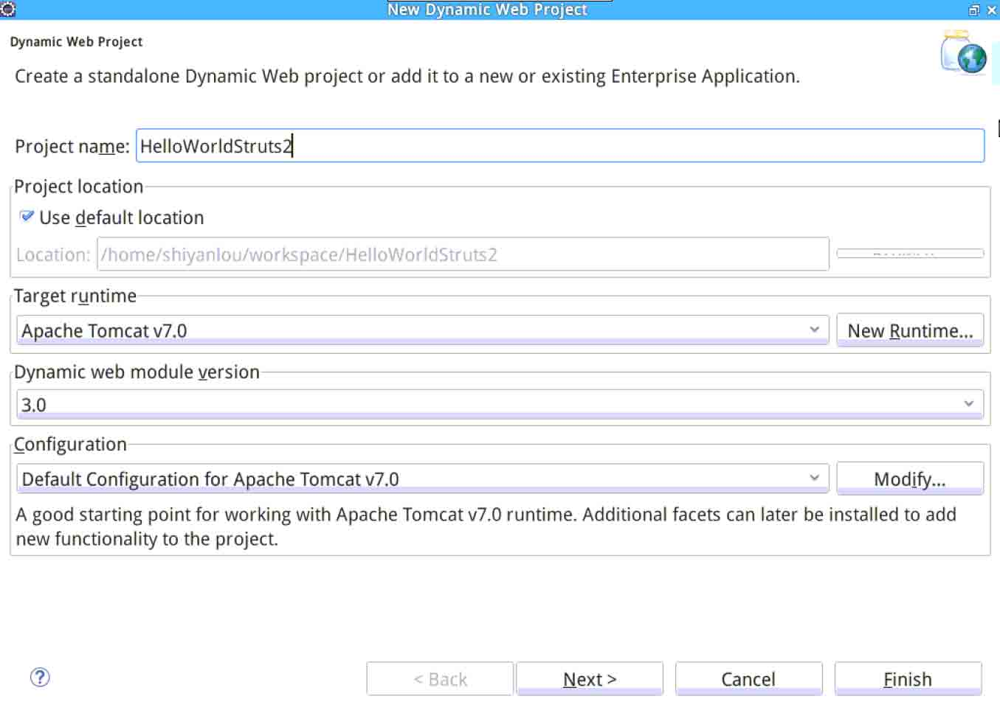
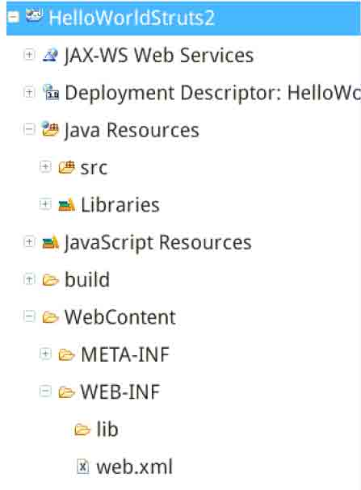
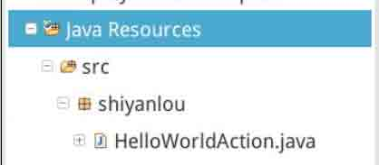
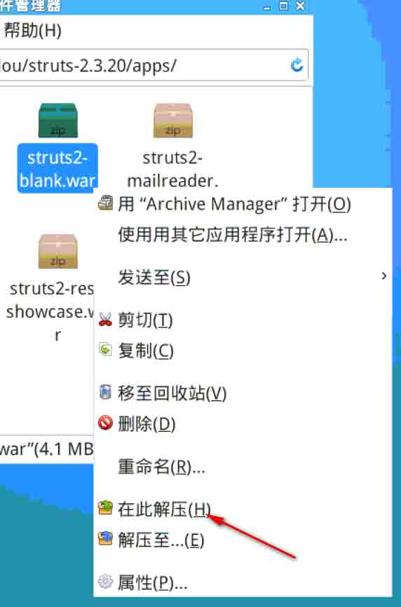
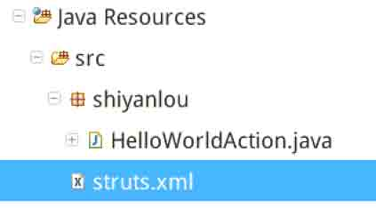
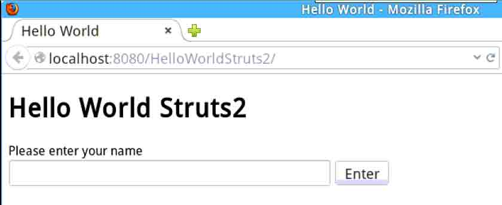

# 第 2 节 Hello World - Struts2

## 实验简介

本次课程我们以最经典最简单的 Hello World 为例，讲解 Struts2 的一些基本原理和运用。

## 一、实验环境说明

**1\. 环境登录**

无需密码自动登录，系统用户名 shiyanlou

**2\. 环境介绍**

本实验环境采用带桌面的 Ubuntu Linux 环境，实验中可能会用到桌面上的程序：

> * XfceTerminal: Linux 命令行终端，打开后会进入 Bash 环境，可以使用 Linux 命令；

*   Firefox：浏览器，可以用在需要前端界面的课程里，只需要打开环境里写的 HTML/JS 页面即可；
*   GVim：非常好用的编辑器，最简单的用法可以参考课程 [Vim 编辑器](http://www.shiyanlou.com/courses/2)。
*   Eclipse：Eclipse 是著名的跨平台的自由集成开发环境（IDE）。主要用来 Java 语言开发，但是目前亦有人通过插件使其作为 C++ 和 Python 等语言的开发工具。

**3\. 环境使用**

使用 GVim 编辑器输入实验所需的代码，然后使用 XfceTerminal 命令行环境进行编译运行，查看运行结果，运行后可以截图并分享自己的实验成果，实验楼提供的截图是后台截图，无法作弊，可以真实有效证明您已经完成了实验。

实验报告可以在个人主页中查看，其中含有每次实验的截图及笔记，以及每次实验的有效学习时间（指的是在实验桌面内操作的时间，如果没有操作，系统会记录为发呆时间）。这些都是您学习的真实性证明。

## 二、Struts2 安装

让我们先用 Struts2 写一个 Hello World，当然你需要先安装好 Struts2（Eclipse、Tomcat 均已经集成到实验环境中；另外除非特别说明，否则后续课程中的 Struts 均指 Struts2）。

输入命令来下载（默认路径为 `/home/shiyanlou`）并解压：

```java
$ wget http://labfile.oss.aliyuncs.com/files0422/struts-2.3.20-all.zip
$ unzip struts-2.3.20-all.zip 
```

再进入到 struts2 目录：

```java
$ cd struts-2.3.20 
```

我们可以看到 struts2 的组成为（蓝色的为文件夹），也是我们需要了解的：


>* **apps** 文件夹包含了多个 example 示例应用的压缩包。 > >* **docs** 文件夹包含了 struts 官方的帮助文档。 > >* **lib** 文件夹包含了 struts 提供的类库 jar 包。 > >* **src** 文件夹包含了 struts 全部框架的源代码。

## 三、新建 Web 项目工程

现在，让我们开始来编写 Hello World 示例程序。

首先在 Eclipse 里新建一个 Web 工程（Dynamic Web Project）：



键入项目名称，可以看到 Tomcat 已经被集成到 Eclipse 中，其他配置默认不变：



点击 Next，在这里 **注意勾选 “自动生成 web.xml”** 这个选项：


工程新建完成后，项目的大致结构如下：



## 四、Hello World

接下来我们在项目的 `HelloWorldStruts2/Java Resources/src` 路径下，新建包和类，例如：



在 `HelloWorldAction.java` 中添加如下代码：

```java
package shiyanlou;

public class HelloWorldAction {

    private String name;

    public String execute() throws Exception {

        if ( getName().equals("") || getName() == null )
            return "error";

        return "success";
    }

    public String getName() {
        return name;
    }

    public void setName(String name) {
         this.name = name;
     }
} 
```

上面提到了项目的结构，现在我们就需要在 `HelloWorldStruts2/WebContent/WEB-INF/lib` 目录下导入必要的依赖库 jar 包，jar 包位于 `struts-2.3.20/lib` 下，直接复制粘贴即可。以下为必要的几个 jar 包列表：


然后，我们需要解压一个示例应用，以得到其中的 `struts.xml` 等配置文件，复制并修改成我们自己项目需要的配置文件。路径为 `/home/shiyanlou/struts-2.3.20/apps`，以第一个为例：



解压后，在 `/home/shiyanlou/struts-2.3.20/apps/struts2-blank/WEB-INF/src/java/` 中找到 `struts.xml` 配置文件，将其复制到我们的项目工程目录 `HelloWorldStruts2/Java Resources/src` 下面：



我们需要修改这个 `struts.xml` 配置文件，修改的时候注意要以 “右键->Open With->Text Editor” 打开，修改如下：

```java
<struts>

    <constant name="struts.enable.DynamicMethodInvocation" value="true" />

    <package name="shiyanlou" extends="struts-default">
        <action name="hello" class="shiyanlou.HelloWorldAction" method="execute">
            <result name="success">/HelloWorld.jsp</result>
            <result name="error">/Error.jsp</result>
        </action>
    </package>  

</struts> 
```

上面的配置文件，`struts` 是根元素。 `DynamicMethodInvocation` 表示设置常量实现动态调用。`package` 中 `name` 为每一个 package 的唯一标识，这个标识不能重复，`extennds` 可以指定本 package 集成另外一个 package 的所有配置。`action` 表示要执行的操作，action 中的`name` 为 action 标识，`class` 为指定由哪个类来处理这个 action，`method` 则指定了相应类中的具体方法。另外注意 `action` 中的类名需要和你自己命名的一致。`<result>` 标签下定义了根据不同返回值，做出不同响应的 JSP 页面，默认目录在 WebContent 下面。

此时我们来新建上面那两个响应页面。在 WebContent 目录下新建一个 JSP 页面命名为 HelloWorld.jsp，添加如下代码：

```java
<%@ page language="java" contentType="text/html; charset=UTF-8"
    pageEncoding="UTF-8"%>
<%@ taglib prefix="s" uri="/struts-tags" %>
<!DOCTYPE html PUBLIC "-//W3C//DTD HTML 4.01 Transitional//EN" "http://www.w3.org/TR/html4/loose.dtd">
<html>
<head>
<meta http-equiv="Content-Type" content="text/html; charset=UTF-8">
<title>Hello World</title>
</head>
<body>
    Hello World, Welcome! <s:property value="name"/>
</body>
</html> 
```

`taglib prefix="s"` 表示引入的标签，比如你要在 JSP 页面里写 C 代码，就需要引入 `c` 标签。我们再新建 Error.jsp 页面，表示出错时的响应页面，添加如下代码：

```java
<%@ page language="java" contentType="text/html; charset=UTF-8"
    pageEncoding="UTF-8"%>
<%@ taglib prefix="s" uri="/struts-tags" %>
<!DOCTYPE html PUBLIC "-//W3C//DTD HTML 4.01 Transitional//EN" "http://www.w3.org/TR/html4/loose.dtd">
<html>
<head>
<meta http-equiv="Content-Type" content="text/html; charset=UTF-8">
<title>Hello World</title>
</head>
<body>
    You did not have entered a name!
</body>
</html> 
```

此外我们还需要在 WebContent 目录下新建一个 index.jsp 文件，作为初始响应 action 的页面。添加如下代码：

```java
<%@ page language="java" contentType="text/html; charset=UTF-8"
    pageEncoding="UTF-8"%>
<%@ taglib prefix="s" uri="/struts-tags" %>
   <!DOCTYPE html PUBLIC "-//W3C//DTD HTML 4.01 Transitional//EN" 
"http://www.w3.org/TR/html4/loose.dtd">
<html>
<head>
<title>Hello World</title>
</head>
<body>
   <h1>Hello World Struts2</h1>
   <form action="hello">
      <label for="name">Please enter your name</label><br/>
      <input type="text" name="name"/>
      <input type="submit" value="Enter"/>
   </form>
</body>
</html> 
```

最后再来修改 web.xml 文件，配置 struts 过滤器等，添加如下代码：

```java
 <filter>
      <filter-name>struts2</filter-name>
      <filter-class>
         org.apache.struts2.dispatcher.FilterDispatcher
      </filter-class>
   </filter>

   <filter-mapping>
      <filter-name>struts2</filter-name>
      <url-pattern>/*</url-pattern>
   </filter-mapping> 
```

## 五、运行

右击 HelloWorldStruts2 工程，Run As->Run on Server，保持默认选项不变，点击 Finish，一会儿即可看到结果：



输入一个名字 shiyanlou：


字符为空时，提示信息：


## 六、小结

> 本次课程我们以最经典最简单的 Hello World 为例，讲解了 Struts2 的一些基本原理和运用，Struts2 的一些更加复杂和高级的运用将在以后的课程中讲解。

## 七、参考文档

> * [Struts 2 Hello World Example](http://www.tutorialspoint.com/struts_2/struts_examples.htm)

## 八、思考

> 再回顾一下整个流程，注意和上一节介绍的 Struts2 体系结构过程结合联系起来一起思考。