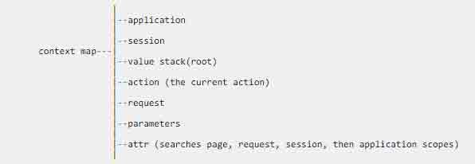

# 第 4 节 Struts2 - OGNL 详解

## 实验简介

学习 Struts2 的 OGNL -对象图导航语言。

## 一、什么是 OGNL

OGNL（Object-Graph Navigation Language，对象图导航语言），它是一个功能强大的表达式语言，用来获取和设置 Java 对象的属性以及调用对象的方法。它旨在提供一个更高的更抽象的层次来对 Java 对象图进行导航。

OGNL 是 Struts2 的默认表达语言，OGNL 表达式的计算是围绕 OGNL 上下文（Context）进行的，相当于一个 Map 对象，见下图的结构：



刚刚这种传统的定义，可能你看完还是不太理解。。没关系，还记得 Struts-Hello World 这节课吗？输入一个名字，然后显示 Hello。这个名字在页面中怎么显示的呢？我们可以再来看一下：

```java
<body>
    Hello World, Welcome! <s:property value="name"/>
</body> 
```

`<s:property value="name"/>` 这便是 OGNL 的一种应用，访问 action 的普通属性。

## 二、OGNL 中重要的 3 个符号：`#`、`%`、`$`

*   `#` 符号

通常有三种用法：

>1\. 访问非 root 对象。 >

1.  用于过滤和投影集合。 >
2.  构造 Map，例如：#{'key1':'value1', 'key2':'value2'}。

*   `%` 符号

用途是告诉标签的处理类将它包含的字符串，强行按照 OGNL 表达式处理。例如：

```java
<s:set name="mySet" value="#{'key1':'value1','key2':'value2'}" />
<s:property value="#mySet['key1']"/>   //输出的是 value1
<s:url value="#mySet['key1']" />      //输出的是#mySet['key1']
<s:url value="%{#mySet['key1']}"/>   //输出的是 value1 
```

*   `$` 符号

通常在 struts.xml 配置文件中的使用方式如下：

```java
<field-validator type="stringlength">  
            <param name="maxLength">18</param>  
               <param name="minLength">6</param>  
               <param name="trim">true</param>  
            <message>密码强度必须在 ${minLength}到${maxLength} 之间！</message>  
        </field-validator> 
```

## 三、访问普通方法、属性、构造方法

```java
<!-- 1\. 访问 Value Stack 中 action 的普通属性 -->
<s:property value="name"/>

<!-- 2\. 访问 Value Stack 中对象的普通属性(要有 get set 方法) -->
<!-- 第一种方式 -->
<s:property value="user.age"/> 

<!-- 第二种方式 -->
<s:property value="user['age']"/>

<!-- 错误方法 -->
<!-- <s:property value="user[age]"/> -->

<!-- 3.调用 Value Stack 中对象的普通方法 -->
<s:property value="user.setName('master')" /> | 结果显示: <s:property value="user.name"/> //输出结果为 “结果显示：master”

<!-- 4.调用 Value Stack 中 action 属性的方法 -->
<s:property value="name.length()"/>

<!-- 5.调用 Value Stack 中 action 的普通方法 -->
<s:property value="add()" />

<!-- 6.调用普通类的构造方法 -->
<s:property value="new user.User()"/> //实例化一个对象 
```

## 四、访问静态方法

**注意**：在访问静态方法、静态变量之前，要先在 struts2.xml 中配置 `<constant name="struts.ognl.allowStaticMethodAccess" value="true"/>` ，设置静态方法调用为 true，否则访问不到数据。

*   访问静态属性

```java
/* 访问静态属性表达式的格式为：@[类全名（包括包路径）]@[值名] */
<s:property value="@action.UserAction@index"/> 
```

*   调用静态方法

```java
/* 调用静态方法表达式的格式为：@[类全名（包括包路径）]@[方法名] */
<s:property value="@action.UserAction@getInstance()"/> 
```

*   调用 Math 类的静态方法

```java
<s:property value="@@max(2, 3)" /> 
```

## 五、访问集合对象

集合对象比如 List，Set，Map 等。List 和数组的访问形式类似，这里以 List 为例。假设有一个 List 名为 userlist。

**（1）List**

*   访问 List

```java
<s:property value="userlist"/> 
```

*   访问 List 对象中某个元素

```java
<s:property value="userlist[1]"/> 
```

*   访问 List 中元素某个属性的集合

```java
<s:property value="userlist.{age}"/> 
```

*   访问 List 中元素某个属性的集合中的特定值

```java
<!-- 第一种方法( 不常用 ) -->
<s:property value="userlist.{age}[0]"/>

<!-- 第二种方法 -->
<s:property value="userlist[0].age"/> 
```

**（2）Set**

*   访问 Set 对象

```java
<s:property value="userSet"/> 
```

Set 集合的访问方式与 List 集合类似，这里不再重复演示，但要注意的是，Set 是无序的集合，所以不能获取某个特定的元素值：

```java
<!-- 错误方法 -->
<s:property value="userSet[0]"/> 
```

**（3）Map**

*   访问 Map 对象

```java
<s:property value="userMap"/> 
```

*   访问 Map 中某个元素

```java
<!-- 第一种方式 -->
<s:property value="userMap.user1"/> 

<!-- 第二种方式 -->
<s:property value="userMap['user1']"/> |  <s:property value="userMap[\"user1\"]"/> 
```

*   访问 Map 中所有的 keys

```java
<s:property value="userMap.keys"/> 
```

*   访问 Map 中所有的 values

```java
<s:property value="userMap.values"/> 
```

*   访问 Map 的大小

```java
<s:property value="userMap.size()"/> | <s:property value="userMap.size"/> 
```

## 六、投影与过滤

注意细节，不同的符号代表不同含义：

>`?` - 满足条件的所有元素 > `^` - 满足条件的第一个元素 > `$` - 满足条件的最后一个元素

*   过滤集合

```java
<!-- OGNL 过滤集合的语法为：collection.{?expression} -->
<s:property value="userlist.{?#this.age>1}"/>  //获取到的是 age>1 的对象集合 
```

*   投影集合

```java
<s:property value="userlist.{^#this.age>1}.{age}"/>  //获取到满足 age>1 集合的第一个对象的 age

<s:property value="userlist.{$#this.age>1}.{age}"/>  //获取到满足 age>1 集合的最后一个对象的 age 
```

## 七、小结

> 本次课程我们学习了 Struts2 的 OGNL-对象图导航语言。

## 八、参考文档

> * [OGNL 表达式总结](http://blog.csdn.net/chen_zw/article/details/8372606)

*   [OGNL](https://struts.apache.org/docs/ognl.html)