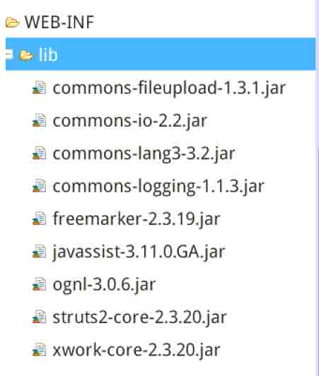
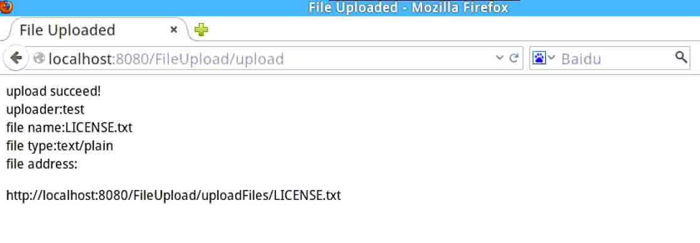
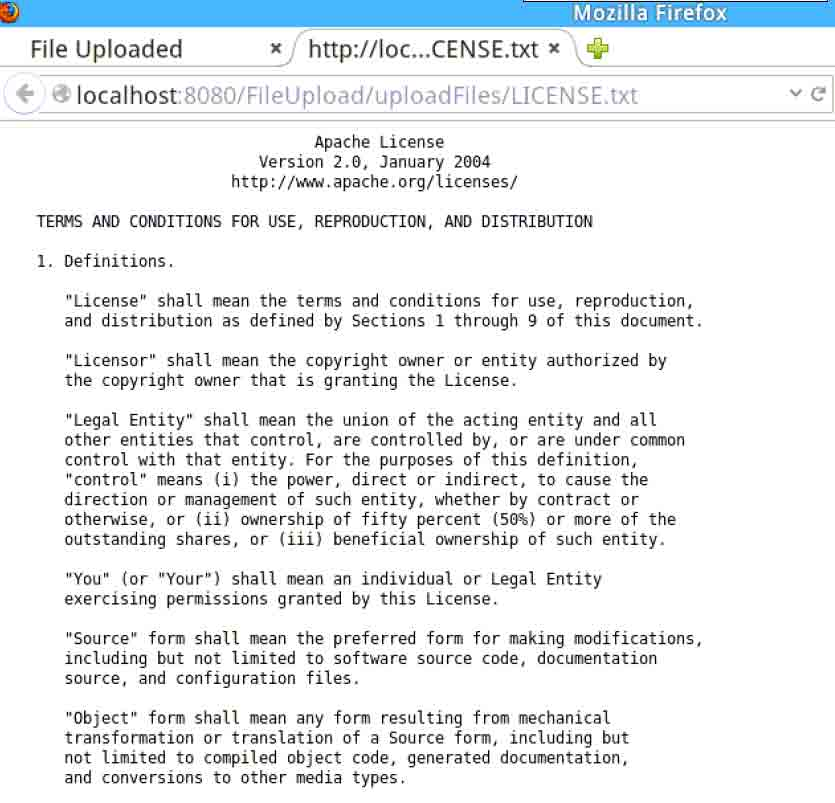
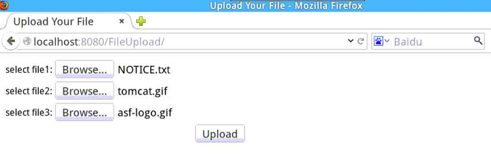
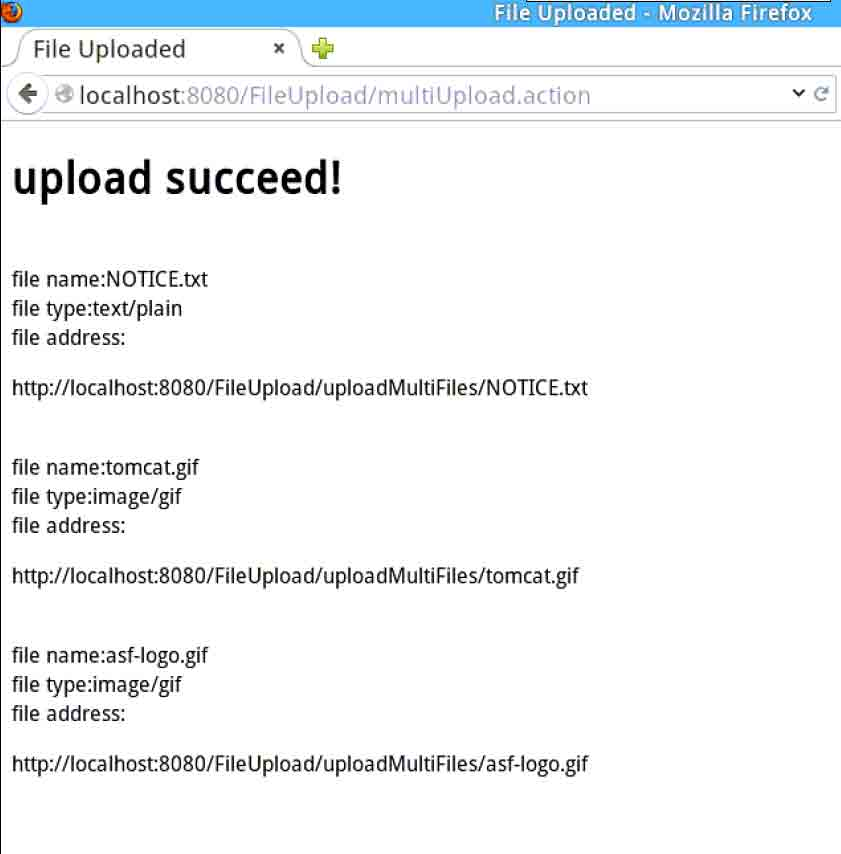
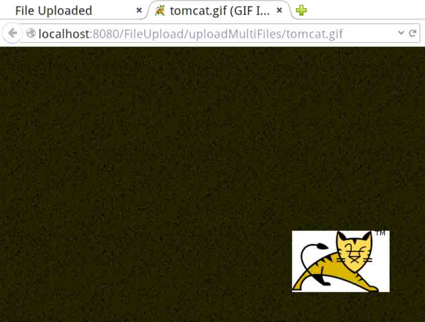
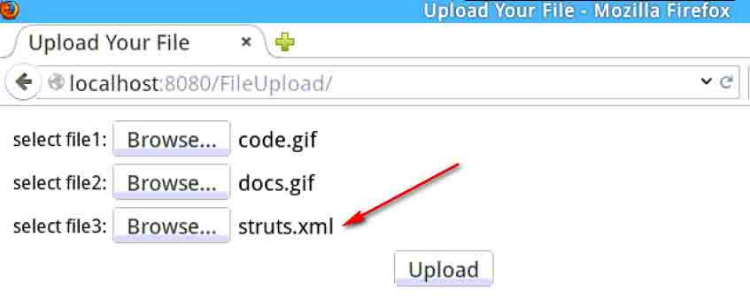
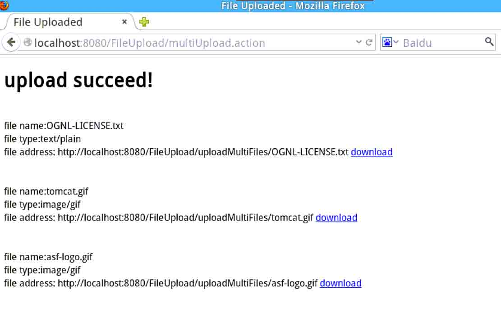
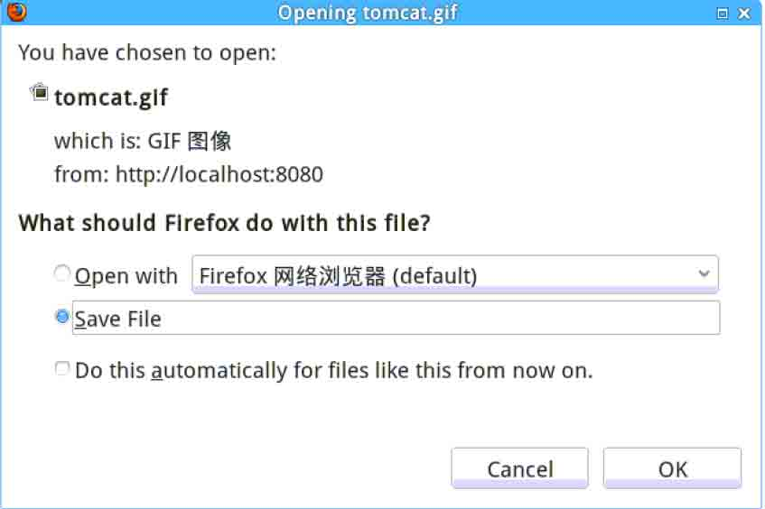
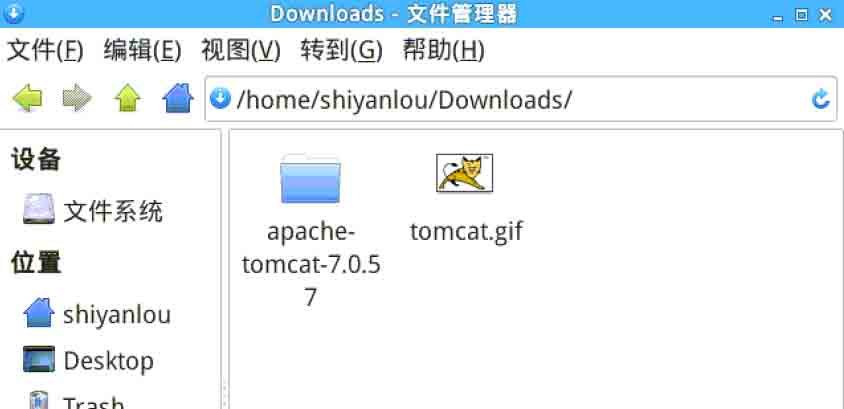

# 第 5 节 Struts2 - 文件上传与下载

* * *

## 一、实验环境说明

**1\. 环境登录**

无需密码自动登录，系统用户名 shiyanlou

**2\. 环境介绍**

本实验环境采用带桌面的 Ubuntu Linux 环境，实验中可能会用到桌面上的程序：

> * XfceTerminal: Linux 命令行终端，打开后会进入 Bash 环境，可以使用 Linux 命令；

*   Firefox：浏览器，可以用在需要前端界面的课程里，只需要打开环境里写的 HTML/JS 页面即可；
*   GVim：非常好用的编辑器，最简单的用法可以参考课程 [Vim 编辑器](http://www.shiyanlou.com/courses/2)。
*   Eclipse：Eclipse 是著名的跨平台的自由集成开发环境（IDE）。主要用来 Java 语言开发，但是目前亦有人通过插件使其作为 C++ 和 Python 等语言的开发工具。

**3\. 环境使用**

使用 GVim 编辑器输入实验所需的代码，然后使用 XfceTerminal 命令行环境进行编译运行，查看运行结果，运行后可以截图并分享自己的实验成果，实验楼提供的截图是后台截图，无法作弊，可以真实有效证明您已经完成了实验。

实验报告可以在个人主页中查看，其中含有每次实验的截图及笔记，以及每次实验的有效学习时间（指的是在实验桌面内操作的时间，如果没有操作，系统会记录为发呆时间）。这些都是您学习的真实性证明。

## 二、单文件上传

同前面课程提到的 “Hello World” 一样，我们先新建一个 Dynamic Web Project（勾选生成 web.xml 文件），然后拷贝必要的 jar 包到 `WebContent/WEB-INF/lib` 目录下：



还需拷贝 struts.xml 配置文件到 `Java Resources/src` 目录下面（具体方法上节课已经详细介绍，这里就不再赘述）。

在 `Java Resources/src` 新建一个包 package，比如 `shiyanlou.struts`，在包 package 内再新建一个类，比如 `UploadAction.java`，并添加如下代码：

```java
package shiyanlou.struts;

import java.io.File;  

import org.apache.commons.io.FileUtils;
import org.apache.struts2.ServletActionContext;  

import com.opensymphony.xwork2.ActionContext;
import com.opensymphony.xwork2.ActionSupport;  

public class UploadAction extends ActionSupport {  

    private static final long serialVersionUID = 1L; 

    // 上传文件者
    private String uploader;  
    // 上传的文件
    private File upload;  
    // 上传文件类型
    private String uploadContentType;  
    // 上传文件的文件名
    private String uploadFileName;  
    // 上传文件的保存路径
    private String savePath;  

    public String execute() throws Exception{

        // 设置上传文件保存路径
        String realpath = getSavePath();

        // 判断上传文件是否为空
        if (upload != null)  {

            // 根据路径以及文件名，新建一个 File 文件实例
            File savefile = new File(realpath, getUploadFileName());

            // 判断此路径是否已经存在
            if ( !savefile.getParentFile().exists() )
                savefile.getParentFile().mkdirs();

            // 把上传文件拷贝到新路径下，完成上传
            FileUtils.copyFile(upload, savefile);

            // 设置 request 对象值，表示上传成功
            ActionContext.getContext().put("message", "upload succeed!");

            return "success"; 

        }

         // 其他情况，上传失败
         return "error";

    }  

    public String getUploader() {
        return uploader;
    }

    public void setUploader(String uploader) {
        this.uploader = uploader;
    }

    public File getUpload() {  
        return upload;  
    }  

    public void setUpload(File upload) {  
        this.upload = upload;  
    }  

    public String getUploadContentType() {  
        return uploadContentType;  
    }  

    public void setUploadContentType(String uploadContentType) {  
        this.uploadContentType = uploadContentType;  
    }  

    public String getUploadFileName() {  
        return uploadFileName;  
    }  

    public void setUploadFileName(String uploadFileName) {  
        this.uploadFileName = uploadFileName;  
    }  

    public String getSavePath() {  

        return ServletActionContext.getServletContext().getRealPath(savePath);  
    }  

    public void setSavePath(String savePath) {  
        this.savePath = savePath;  
    }  

} 
```

在上面的代码中，我们定义了一个上传者名字、上传文件、上传文件的类型、上传文件的文件名以及上传后保存的路径。然后我们通过 FileUtils 提供的 copy 方法来保存文件，比使用流的方法要简单。注意，代码中的那些 getter、setter 方法，最好是使用 右键->Source->Generate Getters and Setters 来生成，既方便又不容易出错。

> **特别注意**：文件、文件名、文件类型，这 3 个变量的命名有一定规则，否则会出现空指针错误。此规则为，如果“文件”这个变量被命名为 `xyz`，则“文件名”必须命名为 `xyzFileName`，“文件类型”必须被命名为 `xyzContentType`。比如本例中，“文件”这个变量被命名为 `upload`，则“文件名”必须命名为 `uploadFileName`，“文件类型”必须被命名为 `uploadContentType`。

代码写好后，我们就需要来配置 struts.xml 文件了。修改成如下代码：

```java
<struts>
    <constant name="struts.enable.DynamicMethodInvocation" value="true" />
    <package name="shiyanlou.struts" extends="struts-default">
        <action name="upload" class="shiyanlou.struts.UploadAction" method="execute">
            <param name="savePath">/uploadFiles</param> 
            <result name="success">/success.jsp</result>
            <result name="error">/error.jsp</result>
        </action>
    </package>  
</struts> 
```

我们使用 `DynamicMethodInvocation` 来设置动态调用为 true，`package` name 可以自定义，但必须唯一。`action` name 为完成动作的 action 名称，它指定了某个 class 文件，比如 execute 方法正是我们 `UploadAction.java` 中的 execute()方法，从而联系起来。`param` 设置了我们在 `UploadAction.java` 中定义的参数 savePath 的值，`result` 则指定了不同情况的响应页面。

因此，现在我们需写一个 index.jsp 页面为默认页面，用来上传文件使用。在 `WebContent` 目录下新建一个 JSP 页面，添加代码如下：

```java
<%@ page language="java" contentType="text/html; charset=UTF-8" pageEncoding="UTF-8"%>
<!DOCTYPE html PUBLIC "-//W3C//DTD HTML 4.01 Transitional//EN" "http://www.w3.org/TR/html4/loose.dtd">
<html>
<head>
<meta http-equiv="Content-Type" content="text/html; charset=UTF-8">
<title>Upload Your File</title>
</head>
<body>
    <form action="upload" method="post" enctype="multipart/form-data">
    uploader:<input type="text" name="uploader">
    select file:<input type="file" name="upload">
    <input type="submit" value="Upload">  
    </form>  
</body>
</html> 
```

`form`中的 action 和 struts.xml 中的 action 对应，这里 `method` 必须为 post，表示上传，`enctype` 设置为 "multipart/form-data"，在使用包含文件上传控件的表单时，必须使用该值。uploader 为上传者，select file 表示选取文件，它们的 name 都必须和 `UploadAction.java` 中的参数名一一对应。另外注意，如果你要使用 `<s:form>` 这种形式，就要引入 `s` 标签，这里我们没有使用，也就没有引入。


如果上传成功，我们需要新建 success.jsp 来响应，添加如下代码：

```java
<%@ page language="java" contentType="text/html; charset=UTF-8" pageEncoding="UTF-8"%>
<%@ taglib uri="/struts-tags"  prefix="s"%>

<!DOCTYPE html PUBLIC "-//W3C//DTD HTML 4.01 Transitional//EN" "http://www.w3.org/TR/html4/loose.dtd">
<html>
<head>
<meta http-equiv="Content-Type" content="text/html; charset=UTF-8">
<title>File Uploaded</title>
</head>

<body>
<%  
String path = request.getContextPath();  
String basePath = request.getScheme()+"://"+request.getServerName()+":"+request.getServerPort()+path+"/";  
%>

upload succeed!<br/>
uploader:<s:property value=" + uploader"/><br/>
file name:<s:property value="+ uploadFileName"/><br/>
file type:<s:property value="+ uploadContentType"/><br/>
file address:<p> <%=basePath %><s:property value="'uploadFiles/'   
    + uploadFileName"/></p><br/>  
</body>  
</html> 
```

在 success.jsp 中我们使用到了 s 标签，所以要注意需要先引入它。request.getContextPath() 返回相对地址，getScheme() 返回当前链接使用的协议，比如 http。getServerName() 获取主机名，比如 localhost。getServerPort() 则获取端口号。加上相对地址 path，就得到了绝对地址。接着，我们可以利用 s 标签来显示上传者、上传文件、上传文件的类型以及地址，注意参数名也要对应一致。




你可以检验，是否上传成功，在浏览器中打开文件的位置，即可看到具体内容，说明上传成功了：



假如，上传失败了，比如并没有选取上传任何文件，新建 error.jsp，添加代码：

```java
<%@ page language="java" contentType="text/html; charset=UTF-8"
    pageEncoding="UTF-8"%>
<!DOCTYPE html PUBLIC "-//W3C//DTD HTML 4.01 Transitional//EN" "http://www.w3.org/TR/html4/loose.dtd">
<html>
<head>
<meta http-equiv="Content-Type" content="text/html; charset=UTF-8">
<title>Upload Error</title>
</head>
<body>
No File selected!
</body>
</html> 
```


## 三、多文件上传

在单个文件上传的基础之上，现在我们将其改为多文件上传。

新建一个 `MultiUploadAction.java` ，表示多文件上传的 Action，代码解释同单文件类似，这里就不做过多解释：

```java
package shiyanlou.struts;

import java.io.File;
import org.apache.commons.io.FileUtils;
import org.apache.struts2.ServletActionContext;

import com.opensymphony.xwork2.ActionContext;
import com.opensymphony.xwork2.ActionSupport;

public class MultiUploadAction extends ActionSupport {

    private static final long serialVersionUID = 1L;  
    private File[] uploads;
    private String[] uploadsContentType;
    private String[] uploadsFileName;
    private String savePath;

    public String execute() throws Exception {  
        String realpath = getSavePath();
        if (uploads != null) {  
            File savepath = new File(realpath);  
            if (!savepath.exists())  
                savepath.mkdirs();
            for (int i = 0; i < uploads.length; i++) { 

                File savefile = new File(savepath, getUploadsFileName()[i]);  

                FileUtils.copyFile(uploads[i], savefile);
            }  
            ActionContext.getContext().put("message", "upload succeed!"); 
            return "success";  
        }  
        return "error";
    }

    public File[] getUploads() {
        return uploads;
    }

    public void setUploads(File[] uploads) {
        this.uploads = uploads;
    }

    public String[] getUploadsContentType() {
        return uploadsContentType;
    }

    public void setUploadsContentType(String[] uploadsContentType) {
        this.uploadsContentType = uploadsContentType;
    }

    public String[] getUploadsFileName() {
        return uploadsFileName;
    }

    public void setUploadsFileName(String[] uploadsFileName) {
        this.uploadsFileName = uploadsFileName;
    }

    public String getSavePath() {
        return ServletActionContext.getServletContext().getRealPath(savePath);
    }

    public void setSavePath(String savePath) {
        this.savePath = savePath;
    }
} 
```

对于 `struts.xml` 文件的配置如下：

```java
<struts>
    <package name="shiyanlou.struts" extends="struts-default">
        <action name="multiUpload" class="shiyanlou.struts.MultiUploadAction" method="execute">

            <interceptor-ref name="fileUpload">  

                <param name="allowedTypes">text/plain,image/png,image/gif,image/jpeg</param>  

                <param name="maximumSize">20480</param>  
            </interceptor-ref>  

            <interceptor-ref name="defaultStack"></interceptor-ref> 

            <param name="savePath">/uploadMultiFiles</param> 
            <result name="success">/success.jsp</result>
            <result name="error">/error.jsp</result>
            <result name="input">/index.jsp</result>  
        </action>
    </package>  

</struts> 
```

注意 `struts.xml` 配置文件的几个变化，首先 action 指定的类名不同；其次添加了文件上传的拦截器，`allowedTypes` 指定了允许上传的文件类型，比如示例中允许文本文件、图片文件，`maximumSize` 限制了上传文件大小的最大值，单位为 bytes。`defaultStack` 为默认过滤器。为了演示方便和便于区分，savePath 保存路径也改了（非必须）。`<result name="input">` 指定了出现错误情况（例如上传文件类型是不允许的，文件大小超过限定值）后的响应页面（为了方便，这里直接使用 index.jsp）。

同时，根据需要修改 index.jsp：

```java
<body>
<s:form action="multiUpload" method="post" enctype="multipart/form-data">  
<s:file label="select file1" name="uploads" />  
<s:file label="select file2" name="uploads" />  
<s:file label="select file3" name="uploads" />  
<s:submit value="Upload" />  
</s:form>  
</body> 
```

单文件上传中也提到过，file name="uploads" 对应 `MultiUploadAction.java` 中的 File[] uploads。



最后，还要修改 success.jsp：

```java
<body>
  <%  
String path = request.getContextPath();  
String basePath = request.getScheme()+"://"+request.getServerName()+":"+request.getServerPort()+path+"/";  
%>

<h1>upload succeed!</h1><br/>

file name:<s:property value="+ uploadsFileName[0]"/><br/>
file type:<s:property value="+ uploadsContentType[0]"/><br/>
file address:<p> <%=basePath %><s:property value="'uploadMultiFiles/'   
        + uploadsFileName[0]"/></p><br/>  

file name:<s:property value="+ uploadsFileName[1]"/><br/>
file type:<s:property value="+ uploadsContentType[1]"/><br/>
file address:<p> <%=basePath %><s:property value="'uploadMultiFiles/'   
        + uploadsFileName[1]"/></p><br/>  

file name:<s:property value="+ uploadsFileName[2]"/><br/>
file type:<s:property value="+ uploadsContentType[2]"/><br/>
file address:<p> <%=basePath %><s:property value="'uploadMultiFiles/'   
        + uploadsFileName[2]"/></p><br/>          

  </body> 
```



同样可以检查是否上传成功，比如：



如果上传文件类型不匹配，例如：



类型不匹配的错误：


或者上传文件超出限定大小：


## 四、文件下载

在刚刚完成的多文件上传的基础之上，新建 `DownloadAction.java` 表示下载的 Action，添加如下代码：

```java
package shiyanlou.struts;

import java.io.FileNotFoundException;
import java.io.InputStream;

import org.apache.struts2.ServletActionContext;

import com.opensymphony.xwork2.ActionSupport;

public class DownloadAction extends ActionSupport {  

    /**
     * 
     */
    private static final long serialVersionUID = 1L;

    // 下载路径
    private String downloadPath;  

    // 下载文件的文件名
    private String filename;  

    public String getFilename() {  
           return filename;  
    }  

    public void setFilename(String filename) {  
           this.filename = filename;  
    }  

    public void setDownloadPath(String downloadPath){  
           this.downloadPath = downloadPath;  
    }  

public InputStream getTargetFile() throws FileNotFoundException  
{  
    // 获得下载文件的真实路径
    String realPath = downloadPath + "/" + getFilename();

    // 返回下载文件对应的输入流  
    return ServletActionContext.getServletContext().getResourceAsStream(realPath);
}  

public String execute()  
{  
    return "success";  
}  

} 
```

修改 struts.xml 配置文件如下，上传文件配置不变，添加了下载文件对应的 Action：

```java
<struts>

    <package name="shiyanlou" extends="struts-default">
        <action name="multiUpload" class="shiyanlou.struts.MultiUploadAction" method="execute">

            <interceptor-ref name="fileUpload">  

                <param name="allowedTypes">text/plain,image/png,image/gif,image/jpeg</param>  

                <param name="maximumSize">20480</param>  
            </interceptor-ref>  

            <interceptor-ref name="defaultStack"></interceptor-ref> 

            <param name="savePath">/uploadMultiFiles</param> 
            <result name="success">/success.jsp</result>
            <result name="error">/error.jsp</result>
            <result name="input">/index.jsp</result>  
        </action>
    </package>  

    <package name="shiyanlou.struts.download" extends="struts-default">   
  <action name="download" class="shiyanlou.struts.DownloadAction" method="execute">  

     <param name="downloadPath">/uploadMultiFiles</param>  

        <result name="success" type="stream">  

           <param name="inputName">targetFile</param>  

          <!-- <param name="contentType">image/jpg</param> -->  

           <param name="contentDisposition">attachment;filename=${filename}</param>  

           <param name="bufferSize">4096</param>  
      </result>  
   </action>  
 </package>  

</struts> 
```

`downloadPath` 为我们上传的 savePath，可以看到 “success”对应的类型为“stream” 流。`contentDisposition` 设置下载文件的文件名，这里直接使用文件本身的文件名。`bufferSize` 限定了下载文件的缓存大小。`inputName` 设置了下载文件的输入流属性名，这个名字必须和 `DowanloadAction.java` 中的返回输入流的那个方法保持一定规则性，具体方法是，去掉 get、首字母小写：


再修改上传后的 success.jsp，主要修改在于，我们在每个文件后面添加了一个下载链接，链接为“download.action?filename=...” ，此链接指定了 action 为 downlaod，表示下载文件。filename 这个变量是我们在 `DownloadAction.java` 中定义的，须保持一致，后面跟具体的文件名即可。

```java
<body>
  <%  
String path = request.getContextPath();  
String basePath = request.getScheme()+"://"+request.getServerName()+":"+request.getServerPort()+path+"/";  
%>

<h1>upload succeed!</h1><br/>

file name:<s:property value="+ uploadsFileName[0]"/><br/>
file type:<s:property value="+ uploadsContentType[0]"/><br/>
file address:  <%=basePath %><s:property value="'uploadMultiFiles/'   
        + uploadsFileName[0]"/>  <a href="download.action?filename=<s:property value="+ uploadsFileName[0]"/>">download</a> <br/> 
 <br/>
 <br/>
file name:<s:property value="+ uploadsFileName[1]"/><br/>
file type:<s:property value="+ uploadsContentType[1]"/><br/>
file address: <%=basePath %><s:property value="'uploadMultiFiles/'   
        + uploadsFileName[1]"/> <a href="download.action?filename=<s:property value="+ uploadsFileName[1]"/>">download</a> <br/> 
 <br/>
 <br/>        
file name:<s:property value="+ uploadsFileName[2]"/><br/>
file type:<s:property value="+ uploadsContentType[2]"/><br/>
file address: <%=basePath %><s:property value="'uploadMultiFiles/'   
        + uploadsFileName[2]"/>  <a href="download.action?filename=<s:property value="+ uploadsFileName[2]"/>">download</a> <br/> 

  </body> 
```

修改成功后，再次运行项目，上传页面保持不变：


上传成功后的页面：



点击下载其中一个文件，例如第二个：



在 `/home/shiyanlou/Downloads/` 路径即可找到刚刚下载的文件：



## 五、小结

本次课程学习了 Struts2 的 文件上传与下载。

## 六、参考文档

> * [struts2 文件上传下载详解](http://blog.csdn.net/chen_zw/article/details/7482916) > * [struts2 入门教程三（上传与下载）](http://blog.csdn.net/wang9258/article/details/20379665)

## 七、思考

> 本次课程涉及的内容较多，课程完成后，建议多回顾几遍，特别注意容易出错的点，以便更加熟悉整个流程。