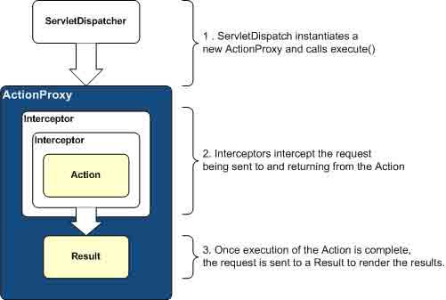

# 第 6 节 Struts2 - Interceptor（拦截器）

* * *

## 一、实验环境说明

**1\. 环境登录**

无需密码自动登录，系统用户名 shiyanlou

**2\. 环境介绍**

本实验环境采用带桌面的 Ubuntu Linux 环境，实验中可能会用到桌面上的程序：

> * XfceTerminal: Linux 命令行终端，打开后会进入 Bash 环境，可以使用 Linux 命令；

*   Firefox：浏览器，可以用在需要前端界面的课程里，只需要打开环境里写的 HTML/JS 页面即可；
*   GVim：非常好用的编辑器，最简单的用法可以参考课程 [Vim 编辑器](http://www.shiyanlou.com/courses/2)。
*   Eclipse：Eclipse 是著名的跨平台的自由集成开发环境（IDE）。主要用来 Java 语言开发，但是目前亦有人通过插件使其作为 C++ 和 Python 等语言的开发工具。

**3\. 环境使用**

使用 GVim 编辑器输入实验所需的代码，然后使用 XfceTerminal 命令行环境进行编译运行，查看运行结果，运行后可以截图并分享自己的实验成果，实验楼提供的截图是后台截图，无法作弊，可以真实有效证明您已经完成了实验。

实验报告可以在个人主页中查看，其中含有每次实验的截图及笔记，以及每次实验的有效学习时间（指的是在实验桌面内操作的时间，如果没有操作，系统会记录为发呆时间）。这些都是您学习的真实性证明。

## 二、拦截器简介

在上节的 Struts 文件上传与下载中，我们使用了一个 `fileUpload` 拦截器，用来拦截不允许的文件类型。这节课我们就详细介绍一下拦截器。

拦截器（Interceptor），在 AOP（Aspect-Oriented Programming，面向切面编程）中它提供了一种机制，可以在 Action 执行之前或之后被调用执行，也可以在 Action 执行前阻止此 Action 运行，以完成特定功能。拦截器是 AOP 的一种实现策略，它动态拦截 Action 调用的对象。

Action 并不是直接和 Interceptor 拦截器 直接发生关联作用，而是通过代理 ActionProxy 协同工作的：



可以看到，Action 被 Interceptor 拦截器 一层一层的包裹起来，上图的结构有一些特点如下：

*   Interceptor 和 Action 的结构就如同一个堆栈（Stack），除了 Action 以外，堆栈中的其他元素是 Interceptor；

*   Action 位于堆栈的底部。由于堆栈 “后进先出” 的特性，如果我们试图把 Action 拿出来执行，我们必须首先把位于 Action 上端的 Interceptor 拿出来。这样，整个执行就形成了一个递归调用；

*   每个位于堆栈中的 Interceptor，除了需要完成它自身的逻辑，还需要完成一个特殊的执行职责。这个执行职责有 3 种选择： > (1) 中止整个执行，直接返回一个字符串作为 resultCode； > (2) 通过递归调用负责调用堆栈中下一个 Interceptor 的执行； > (3) 如果在堆栈内已经不存在任何的 Interceptor，则调用 Action；

## 三、拦截器源码分析

Interceptor 接口的定义如下（路径为：`/home/shiyanlou/struts-2.3.20/src/xwork-core/src/main/java/com/` `opensymphony/xwork2/interceptor/Interceptor.java`）：

```java
public interface Interceptor extends Serializable {

    /**
     * Called to let an interceptor clean up any resources it has allocated.
     */
    void destroy();

    /**
     * Called after an interceptor is created, but before any requests are processed using
     * {@link #intercept(com.opensymphony.xwork2.ActionInvocation) intercept} , giving
     * the Interceptor a chance to initialize any needed resources.
     */
    void init();

    /**
     * Allows the Interceptor to do some processing on the request before and/or after the rest of the processing of the
     * request by the {@link ActionInvocation} or to short-circuit the processing and just return a String return code.
     *
     * @param invocation the action invocation
     * @return the return code, either returned from {@link ActionInvocation#invoke()}, or from the interceptor itself.
     * @throws Exception any system-level error, as defined in {@link com.opensymphony.xwork2.Action#execute()}.
     */
    String intercept(ActionInvocation invocation) throws Exception;

} 
```

可以看到该接口包括 init()、destory()和 intercept()方法，其中，intercept()方法是核心方法，它的参数类型是 ActionInvocation（Action 调度者）。

抽象类 AbstractInterceptor 实现了 Interceptor 接口（路径如上）：

```java
public abstract class AbstractInterceptor implements Interceptor {

    /**
     * Does nothing
     */
    public void init() {
    }

    /**
     * Does nothing
     */
    public void destroy() {
    }

    /**
     * Override to handle interception
     */
    public abstract String intercept(ActionInvocation invocation) throws Exception;
} 
```

我们选一个继承了抽象类 AbstractInterceptor 的示例 ChainingInterceptor.java 看看它是怎么实现 intercept() 方法的：

```java
 @Override
    public String intercept(ActionInvocation invocation) throws Exception {
        ValueStack stack = invocation.getStack();
        CompoundRoot root = stack.getRoot();
        if (shouldCopyStack(invocation, root)) {
            copyStack(invocation, root);
        }
        return invocation.invoke();
    } 
```

可以看到最后返回的 invocation.invoke()，invoke() 是什么方法呢？它是 ActionInvocation 接口（路径：`/home/shiyanlou/struts-2.3.20/src/xwork-core` `/src/main/java/com/opensymphony/xwork2/`）中的方法，ActionInvocation 是 Action 调度者，此方法包含两层含义：

*   如果拦截器堆栈中还有其他的 Interceptor，那么 invocation.invoke() 将调用堆栈中下一个 Interceptor 并执行。

*   如果拦截器堆栈中没有其它 Interceptor 只有 Action 了，那么 invocation.invoke() 将调用 Action 执行。

既然是 ActionInvocation 接口中的方法，我们就照样找一个示例类，看看它是如何实现 invoke() 方法的。例如 ActionInvocation.java（路径：`/home/shiyanlou/struts-2.3.20/src/xwork-core` `/src/main/java/com/opensymphony/xwork2/`）

```java
 /**
     * @throws ConfigurationException If no result can be found with the returned code
     */
    public String invoke() throws Exception {
        String profileKey = "invoke: ";
        try {
            UtilTimerStack.push(profileKey);

            if (executed) {
                throw new IllegalStateException("Action has already executed");
            }

            if (interceptors.hasNext()) {
                final InterceptorMapping interceptor = interceptors.next();
                String interceptorMsg = "interceptor: " + interceptor.getName();
                UtilTimerStack.push(interceptorMsg);
                try {
                                resultCode = interceptor.getInterceptor().intercept(DefaultActionInvocation.this);
                            }
                finally {
                    UtilTimerStack.pop(interceptorMsg);
                }
            } else {
                resultCode = invokeActionOnly();
            }

            // this is needed because the result will be executed, then control will return to the Interceptor, which will
            // return above and flow through again
            if (!executed) {
                if (preResultListeners != null) {
                    for (Object preResultListener : preResultListeners) {
                        PreResultListener listener = (PreResultListener) preResultListener;

                        String _profileKey = "preResultListener: ";
                        try {
                            UtilTimerStack.push(_profileKey);
                            listener.beforeResult(this, resultCode);
                        }
                        finally {
                            UtilTimerStack.pop(_profileKey);
                        }
                    }
                }

                // now execute the result, if we're supposed to
                if (proxy.getExecuteResult()) {
                    executeResult();
                }

                executed = true;
            }

            return resultCode;
        }
        finally {
            UtilTimerStack.pop(profileKey);
        }
    } 
```

interceptors.hasNext() 会依次调用拦截器堆栈中的拦截器，我们主要关注这句代码：

```java
resultCode = interceptor.getInterceptor().intercept(DefaultActionInvocation.this); 
```

上面的代码，将实现 ActionInvocation 接口的 DefaultActionInvocation 作为参数，调用了 interceptor 中的 intercept() 方法。发现了什么没有？再看看 intercept() 方法：

```java
 @Override
    public String intercept(ActionInvocation invocation) throws Exception {
        ValueStack stack = invocation.getStack();
        CompoundRoot root = stack.getRoot();
        if (shouldCopyStack(invocation, root)) {
            copyStack(invocation, root);
        }
        return invocation.invoke();
    } 
```

不难看出，intercept() 方法中又调用了 invoke() 方法，这正是我们在前面提到的递归调用。

在 invoke() 方法中，还有一个 preResultListener，这个接口是用来在 Action 执行完之后，但是还没有回到视图层之前，做一些工作的（路径：`/home/shiyanlou/struts-2.3.20/src/xwork-core` `/src/main/java/com/opensymphony/xwork2/interceptor/`）。

```java
public interface PreResultListener {

    /**
     * This callback method will be called after the {@link com.opensymphony.xwork2.Action} execution and
     * before the {@link com.opensymphony.xwork2.Result} execution.
     *
     * @param invocation  the action invocation
     * @param resultCode  the result code returned by the action (eg. <code>success</code>).
     */
    void beforeResult(ActionInvocation invocation, String resultCode);

} 
```

总结起来，Struts2 对于整个执行的划分，从 Interceptor 到 Action 一直到 Result，每一层都职责明确。不仅如此，Struts2 还为每一个层次之前都设立了恰如其分的插入点。使得整个 Action 层的扩展性非常高。

## 四、自定义拦截器

通过上面的源码分析，不难发现要自定义拦截器一般有以下 2 种方法：

（1）实现 Interceptor 接口；

（2）继承 AbbstractInterceptor 抽象类；

拦截器在默认情况下会拦截 Action 中所有的方法，但是在某些情况下，可能只需要拦截 Action 中的一个或多个方法，有时候也希望不拦截某个方法，这种情况就需要使用另一种方法：

（3）继承 MethodFilterInterceptor 抽象类；

MethodFilterInterceptor 抽象类也是继承自 AbstractInterceptor 抽象类的，MethodFilterInterceptor 抽象类主要内容如下：（路径：`/home/shiyanlou/struts-2.3.20/src/xwork-core/src/main/java/com/` `opensymphony/xwork2/interceptor/MethodFilterInterceptor.java`）

```java
 @Override
    public String intercept(ActionInvocation invocation) throws Exception {
        if (applyInterceptor(invocation)) {
            return doIntercept(invocation);
        } 
        return invocation.invoke();
    } 
```

发现 intercept()方法把任务交给 doIntercept()方法了：

```java
 /**
     * Subclasses must override to implement the interceptor logic.
     * 
     * @param invocation the action invocation
     * @return the result of invocation
     * @throws Exception
     */
    protected abstract String doIntercept(ActionInvocation invocation) throws Exception; 
```

因此我们需要继承 MethodFilterInterceptor 抽象类来实现拦截某些方法的时候，需要实现 doIntercept()方法。

## 五、自定义拦截器示例

这里我们以实现 Interceptor 接口为例，展示如何自定义拦截器。

我们模拟这样一个场景：用户登录，但是需要有邀请码才能登录，所以第一次登录必须先申请一个邀请码，然后输入正确的邀请码才可以登录进去。

首先我们新建一个项目，然后照例做好必要的工作：勾选生成 web.xml，导入 jar 包，复制 struts.xml 配置文件到自己的项目。如果忘记了，建议回顾一下前面几节课程，都有涉及。

首先是新建 Login.java，作为实现登录 action 的类：

```java
package shiyanlou.test.interceptor;

import java.util.Map;
import com.opensymphony.xwork2.ActionContext;

public class Login {

    // 登录成功后的消息 message
    private String msg;

    // 输入的邀请码
    private String inputCode;

    public String getMsg() {
        return msg;
    }

    public void setMsg(String msg) {
        this.msg = msg;
    }

    public String getInputCode() {
        return inputCode;
    }

    public void setInputCode(String inputCode) {
        this.inputCode = inputCode;
    }

    public String execute() throws Exception {

        // 从 session 中通过 “code” 这个 key 获取生成的邀请码
        Map map = ActionContext.getContext().getSession();
        String code = (String) map.get("code");

        // 注意 code 是 Session 中的，inputCode 是用户输入的
        if (code != null) {
            if ( null == getInputCode() || getInputCode().equals("") )  {
                // 向 Session 中提交，以便后面在页面中显示
                map.put("msgSession",  "Empty code!");
                return "login";
        }else if ( !getInputCode().equals(code) ) {
            map.put("msgSession",  "Invalid code!");
            return "login";
        }else {
            msg = "Congratulations! You've logged in!";         
            return "success";
        }
    }

    msg = "Congratulations! You've logged in!";
    return "success";

    }
} 
```

再新建 ApplyCode.java，申请邀请码，作为拦截器的实现类：

```java
package shiyanlou.test.interceptor;

import java.util.Map;
import com.opensymphony.xwork2.Action;
import com.opensymphony.xwork2.ActionInvocation;
import com.opensymphony.xwork2.interceptor.Interceptor;

public class ApplyCode  implements Interceptor {

    /**
     * 
     */
    private static final long serialVersionUID = 1L;

    @Override
    public void destroy() {
        // TODO Auto-generated method stub

    }

    @Override
    public void init() {
        // TODO Auto-generated method stub

    }

    @Override
    public String intercept(ActionInvocation arg0) throws Exception {
        // TODO Auto-generated method stub

        // 同样是从 session 中获得邀请码
        Map sessionMap = arg0.getInvocationContext().getSession();
        String code = (String) sessionMap.get("code");

        // 如果 session 中已经加入了这个邀请码，则交给 invoke() 函数处理
        if ( null != code && code.equals("shiyanlou") ) {
            return arg0.invoke();
        }

        // 否则就提示先申请一个邀请码 注入到 Session 中，以便在页面中显示
        sessionMap.put("msgSession",  "Apply a code first!");
        return "login";
    }
} 
```

新建一个 index.jsp 作为登录页面：

```java
<%@ page language="java" contentType="text/html; charset=UTF-8"
    pageEncoding="UTF-8"%>
<%@ taglib prefix="s" uri="/struts-tags" %>
   <!DOCTYPE html PUBLIC "-//W3C//DTD HTML 4.01 Transitional//EN" 
"http://www.w3.org/TR/html4/loose.dtd">
<html>
<head>
<title>Login Interceptor</title>
</head>
<body>

   <center><h2>${sessionScope.msgSession }</h2>  
    <s:form action="login" method="post">  
        <s:textfield label="INVITATION CODE" name="inputCode"></s:textfield>  
        <s:submit value="Login" />  
    </s:form>  

    <a href="/InterceptorLogin/applyCode.jsp" type="button" >Apply a code</a>

    </center>  

</body>
</html> 
```

`${sessionScope.msgSession}` 就是显示 Session 中 msgSession 这个字段的消息，在拦截器验证失败后，输出 session 中的 msgSsession 不同时候的值，以给予用户提示信息。

Apply a code 这个链接会转向申请邀请码的页面，其本质就是把一个邀请码（字段）注入到 Session 中，使其具有权限。所以我们需要再新建一个页面作为申请邀请码（输入 Session）的页面，applyCode.jsp：

```java
<%@ page language="java" contentType="text/html; charset=UTF-8"
    pageEncoding="UTF-8"%>
<!DOCTYPE html PUBLIC "-//W3C//DTD HTML 4.01 Transitional//EN" "http://www.w3.org/TR/html4/loose.dtd">
<html>
<head>
<meta http-equiv="Content-Type" content="text/html; charset=UTF-8">
<title>Apply a new code</title>
</head>
<body>

<%  
  request.getSession().setAttribute("code", "shiyanlou");  
  %>

your INVITATION CODE is :  <b>shiyanlou</b> <br/>
<a href="/InterceptorLogin/index.jsp" type="button" >Back to login</a>

</body>
</html> 
```

`request.getSession().setAttribute("code", "shiyanlou")` 表示直接把一个字符（邀请码）注入到了 Session 中的 `code` 字段 key。

最后配置一下 struts.xml 文件：

```java
<struts>
    <package name="shiyanlou.interceptor" extends="struts-default">

        <interceptors>
            <interceptor name="applyCode" class="shiyanlou.test.interceptor.ApplyCode"></interceptor>
            <interceptor-stack name="interceptLogin">
                <interceptor-ref name="applyCode"></interceptor-ref>
                <interceptor-ref name="defaultStack"></interceptor-ref>
            </interceptor-stack>
        </interceptors> 

        <action name="login" class="shiyanlou.test.interceptor.Login" method="execute">
            <result name="success">/success.jsp</result>
            <result name="login">/index.jsp</result>
            <interceptor-ref name="interceptLogin"></interceptor-ref>
        </action>

    </package>  
</struts> 
```

可以看到，首先定义了一个 applyCode 的拦截器 interceptor，对应其实现类为 shiyanlou.test.interceptor.ApplyCode；然后定义了一个拦截器堆栈 interceptor-stack，包含刚刚我们定义的 applyCode 拦截器，以及默认的 defaultStack 拦截器，引入默认拦截器的原因在于我们可能还是会用到一些基本的默认拦截器，比如 params-解析请求参数 等等。

然后，给登录 Action 设置了我们的拦截器堆，名为 interceptLogin。

运行项目，用户首先没有申请一个邀请码的话，会提示：


然后，点击申请一个邀请码（这里为了方便，直接将一个固定的邀请码字符串加入到 Session 中）：


再次登录，会验证邀请码：

当输入邀请码为空：


输入邀请码不正确：


输入正确邀请码 `shiyanlou`：


## 六、小结

本次课程学习了 Struts2 的 Interceptor 拦截器。

## 七、参考文档

> * [struts2 拦截器 interceptor](http://struts2.group.iteye.com/group/wiki/1397-deep-into-struts2-interceptors#top)

## 八、思考

> 尝试继承 AbstractInterceptor 抽象类来实现自定义拦截器。