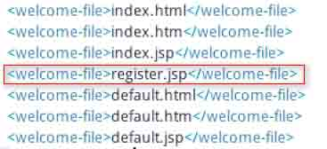
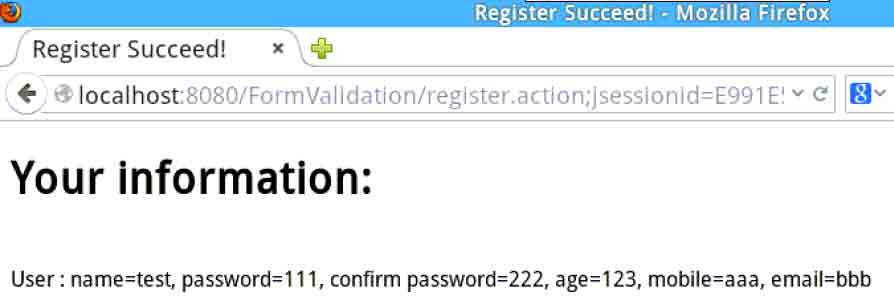
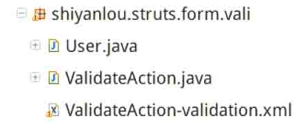
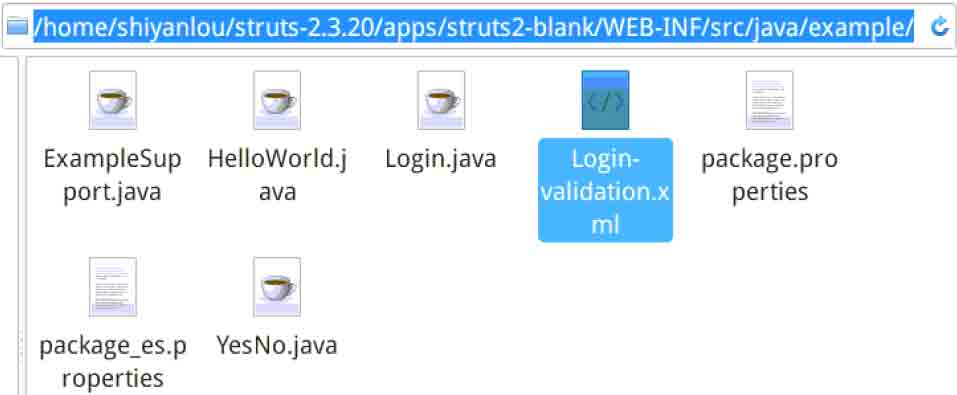
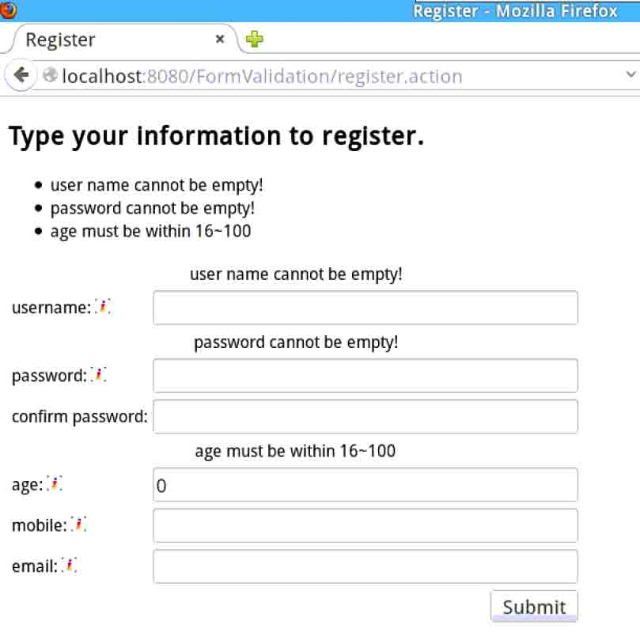
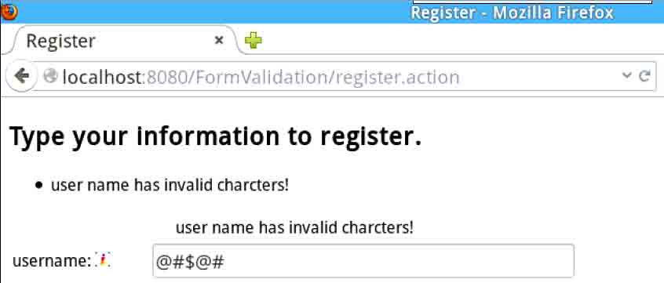

# 第 7 节 Struts2 - 表单验证

* * *

## 一、实验环境说明

**1\. 环境登录**

无需密码自动登录，系统用户名 shiyanlou

**2\. 环境介绍**

本实验环境采用带桌面的 Ubuntu Linux 环境，实验中可能会用到桌面上的程序：

> * XfceTerminal: Linux 命令行终端，打开后会进入 Bash 环境，可以使用 Linux 命令；

*   Firefox：浏览器，可以用在需要前端界面的课程里，只需要打开环境里写的 HTML/JS 页面即可；
*   GVim：非常好用的编辑器，最简单的用法可以参考课程 [Vim 编辑器](http://www.shiyanlou.com/courses/2)。
*   Eclipse：Eclipse 是著名的跨平台的自由集成开发环境（IDE）。主要用来 Java 语言开发，但是目前亦有人通过插件使其作为 C++ 和 Python 等语言的开发工具。

**3\. 环境使用**

使用 GVim 编辑器输入实验所需的代码，然后使用 XfceTerminal 命令行环境进行编译运行，查看运行结果，运行后可以截图并分享自己的实验成果，实验楼提供的截图是后台截图，无法作弊，可以真实有效证明您已经完成了实验。

实验报告可以在个人主页中查看，其中含有每次实验的截图及笔记，以及每次实验的有效学习时间（指的是在实验桌面内操作的时间，如果没有操作，系统会记录为发呆时间）。这些都是您学习的真实性证明。

## 二、表单验证之前

照例，我们先新建一个 Dynamic Web Project，假设取名为 FormValidate。通过前面几节课程的学习，相信大家已经比较熟悉这个过程了，因此这里就不再赘述。主要就是注意一下 `web.xml` 配置文件中的添加过滤器和相关 jar 包的引入。

现在我们假设的场景是一个 “用户注册” 的过程，注册信息要求输入名称、年龄、密码、邮箱等等。我们先新建一个实体类，例如 `User.java`：

```java
package shiyanlou.struts.form.vali;

public class User {

    private String name;
    private String password;
    private String confirmPassword;
    private int age;
    private String mobile;
    private String email;

    public String getName() {
        return name;
    }
    public void setName(String name) {
        this.name = name;
    }
    public String getPassword() {
        return password;
    }
    public void setPassword(String password) {
        this.password = password;
    }
    public String getConfirmPassword() {
        return confirmPassword;
    }
    public void setConfirmPassword(String confirmPassword) {
        this.confirmPassword = confirmPassword;
    }
    public int getAge() {
        return age;
    }
    public void setAge(int age) {
        this.age = age;
    }
    public String getMobile() {
        return mobile;
    }
    public void setMobile(String mobile) {
        this.mobile = mobile;
    }
    public String getEmail() {
        return email;
    }
    public void setEmail(String email) {
        this.email = email;
    }

    @Override  
    public String toString() {  
        return "User： name=" + name + ", password=" + password  
                + ", confirm password=" + confirmPassword + ", age=" + age  
                + ", mobile=" + mobile + ", email=" + email ;  
    }
} 
```

然后我们再新建处理流程的 Action，代码也很简单，这使用到了刚刚新建的实体类 User，例如 `ValidateAction.java`：

```java
package shiyanlou.struts.form.vali;

import com.opensymphony.xwork2.ActionSupport;

public class ValidateAction extends ActionSupport {

    private static final long serialVersionUID = 1L;

    private User user;

    public User getUser() {
        return user;
    }
    public void setUser(User user) {
        this.user = user;
    }

    public String execute() {
        return "success";
    }

} 
```

接着，配置 `struts.xml`：

```java
<struts>

    <package name="shiyanlou.struts.form.vali" extends="struts-default">
        <action name="register" class="shiyanlou.struts.form.vali.ValidateAction" method="execute">
            <result name="success">/success.jsp</result>
            <result name="input">/register.jsp</result>
        </action>
    </package>  

</struts> 
```

默认页面本来是 `index.jsp`，这里我们改成了 `register.jsp`，所以你需要在 `web.xml` 中，添加进去（你也可以使用默认的 index.jsp 来命名，这里只是演示了如何修改）：



在 WebContent 根目录下，新建并修改 `register.jsp`：

```java
<body>

<h2>Type your information to register.</h2>

    <s:fielderror />
    <s:form action="register" method="post">   
        <s:textfield label="username" name="user.name" tooltip="name must be over 3 characters"></s:textfield>
        <s:textfield type="password" label="password" name="user.password" tooltip="password must over 6 digits"></s:textfield>
        <s:textfield type="password" label="confirm password" name="user.confirmPassword"></s:textfield>
        <s:textfield label="age" name="user.age" tooltip="age must over 16"></s:textfield>
        <s:textfield label="mobile" name="user.mobile" tooltip="input correct mobile phone number format"></s:textfield>
        <s:textfield label="email" name="user.email" tooltip="input correct email format"></s:textfield>

        <s:submit label="Register"></s:submit>  
   </s:form>   

</body> 
```

与 `User.java` 中的变量一一对应，tooltip 表示提示信息，当鼠标放在上面的时候，便会显示提示信息。注意使用到了 s 标签，不要忘了引入它：

```java
<%@ taglib uri="/struts-tags" prefix="s" %> 
```

表单提交后的 `success.jsp`，直接显示出表单信息（整个表单信息就是实体类 User 的一个实例 user）：

```java
<body>
    <h1>Your information:</h1> <br/>
    ${user}
</body> 
```

启动并运行项目，鼠标放到相应标题后的小图标，即可看到 tips：


点击 Submit 提交之后：



可以看到，目前还没有进行 【表单验证】，很多信息是不符合要求的，例如两次密码不匹配，年龄超大，手机号码和邮箱格式不对等等。因此，我们现在需要实现 表单验证。

## 三、表单验证

表单验证通常有两种方式，第一种是采用 xml 配置文件来进行验证，第二种是采用代码的方式来验证。这里我们利用 xml 配置文件来进行验证。

我们需要在包含 Action 的那个类的同一个包下，新建 xml 验证文件。其命名方式的规则为：“Action 类名-validation.xml”，例如我的示例：



`ValidateAction-validation.xml` 这个配置文件的模板，可以在 struts 官方提供的示例中找到，在 `/home/shiyanlou/struts-2.3.20/apps/struts2-blank/WEB-INF/src/java/example/` 路径下：



OK，得到模板后，我们就可以修改我们自己的验证文件了：

```java
<!DOCTYPE validators PUBLIC
        "-//Apache Struts//XWork Validator 1.0.2//EN"
        "http://struts.apache.org/dtds/xwork-validator-1.0.2.dtd">

<validators>

    <field name="user.name">
        <field-validator type="requiredstring">
            <param name="trim">true</param>  
            <message><![CDATA[user name cannot be empty!]]></message>
        </field-validator>

        <field-validator type="regex">  
            <param name="regex"><![CDATA[^[a-zA-Z0-9]+$]]></param>  
            <message><![CDATA[user name has invalid charcters!]]></message>  
        </field-validator>

        <field-validator type="stringlength">  
            <param name="maxLength">10</param>  
               <param name="minLength">4</param>  
               <param name="trim">true</param>  
            <message><![CDATA[user name must be within 4~10 characters!]]></message>  
        </field-validator>
    </field>

    <field name="user.password">
        <field-validator type="requiredstring">
            <param name="trim">true</param>  
            <message><![CDATA[password cannot be empty!]]></message>
        </field-validator>

        <field-validator type="regex">  
            <param name="regex"><![CDATA[^[a-zA-Z0-9]+$]]></param>  
            <message><![CDATA[password contains invalid charcters!]]></message>  
        </field-validator>

        <field-validator type="stringlength">  
            <param name="maxLength">18</param>  
               <param name="minLength">6</param>  
               <param name="trim">true</param>  
            <message><![CDATA[password must be within 6~18 characters!]]></message>  
        </field-validator>
    </field>

    <field name="user.confirmPassword">  
        <field-validator type="fieldexpression">  
        <param name="expression"> (user.password eq user.confirmPassword)</param>
                <message><![CDATA[confirm password not matched!]]></message>  
        </field-validator>  
    </field>

   <field name="user.age">
        <field-validator type="int">
        <param name="min">16</param>
        <param name="max">100</param>
                   <message>age must be within 16~100</message>  
           </field-validator>  
       </field>

       <field name="user.mobile">  
        <field-validator type="regex">  
          <param name="regex"><![CDATA[¹[358]\d{9}$]]></param>
          <message>incorrect mobile phone number format!</message>  
        </field-validator>  
    </field>  

   <field name="user.email">  
      <field-validator type="email">  
         <message>incorrect email format!</message>  
      </field-validator>  
    </field>  

</validators> 
```

可以看到，配置都是有固定格式的，针对不同的参数 `name` 有不同的`type`，其中`requiredstring`表示必填字符串检验（名称不能为空）；`regex` 表示使用正则表达式（名称不能使用非法字符），`stringlength` 表示字符串长度检验（名称字符有长度要求）；`fieldexpression` 表示字段表达式检验（这里用来检验两次密码输入是否匹配）；`int` 表示整数检验（年龄有范围要求）；`email` 表示邮件地址检验。CDATA 区段（CDATA section）中的文本会被解析器忽略，以避免某些字符（例如正则表达式中的字符比较特殊）被 xml 解析。

此外还有 `required`必填项检验，`date`日期检验，`url`网址检验等等。

验证完成之后，我们可以再次运行项目来检验是否有效（名称、密码不能为空，年龄范围在 16~100）：



用户名称包含非法字符：



两次输入密码不一致：


其他检验同理。最后演示一下，全部输入符合要求的情况：


## 四、小结

> 本次课程我们学习了 Struts2 表单验证，以 xml 配置文件的方式完成。

## 五、参考文档

> * [struts2.3.15 之表单提交与表单验证](http://blog.csdn.net/undergrowth/article/details/9900037)

*   [XML CDATA](http://www.w3school.com.cn/xml/xml_cdata.asp)

## 六、思考

> 考虑另一种验证方式，即如何利用代码来完成表单验证。