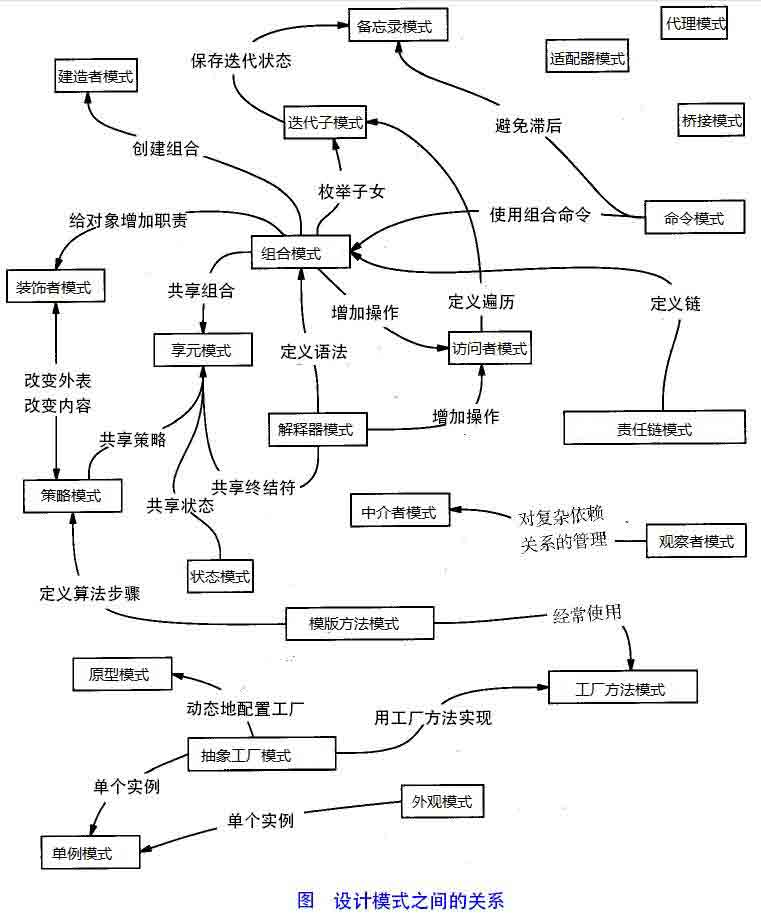

# 第 1 节 设计模式简介

## 一、本节目标

我们本节课程主要介绍【设计模式】的相关知识，将会涉及以下内容：

> * 什么是设计模式

*   设计模式原则
*   设计模式分类
*   常用设计模式

## 二、什么是设计模式

在软件工程中，【设计模式】是对软件设计中普遍存在的各种问题，所提出的 **解决方案**。

换句话说，设计模式是一套被反复使用、多数人知晓的、经过分类的、代码设计的 **经验的总结**。使用设计模式是为了可重用代码，让代码更容易被他人理解，保证代码可靠性。

## 三、 设计模式原则

**1、开闭原则（Open Close Principle）**

开闭原则的意思是：对扩展开放，对修改封闭。在程序需要进行扩展的时候，不能去修改或影响原有的代码，实现一个热插拔的效果。简言之，是为了使程序的扩展性更好，易于维护和升级。想要达到这样的效果，我们需要使用接口和抽象类。

**2、里氏替换原则（Liskov Substitution Principle）**

里氏替换原则是面向对象设计的基本原则之一。 里氏替换原则中说，任何基类可以出现的地方，子类一定可以出现。里氏替换原则是继承复用的基石，只有当子类可以替换掉基类，且软件单位的功能不受到影响时，基类才能真正被复用，而且子类也能够在基类的基础上增加新的行为。里氏代换原则是对开闭原则的补充。实现开闭原则的关键步骤就是抽象化，而基类与子类的继承关系就是抽象化的具体实现，所以里氏代换原则是对实现抽象化的具体步骤的规范。

**3、依赖倒置原则（Dependence Inversion Principle）**

这个原则是开闭原则的基础，核心内容：针对接口编程，高层模块不应该依赖底层模块，二者都应该依赖抽象。

**4、接口隔离原则（Interface Segregation Principle）**

这个原则的意思是：使用多个隔离的接口，比使用单个庞大的接口要好。其目的在于降低耦合度。由此可见，其实设计模式就是从大型软件架构出发，便于升级和维护的软件设计思想。它强调低依赖、低耦合。

**5、单一职责原则（Single Responsibility Principle）**

一个实体应尽量少地与其他实体之间发生相互作用，应该使得系统功能模块相对独立。

可能有的人会觉得单一职责原则和前面的接口隔离原则很相似，其实不然。其一，单一职责原则原注重的是职责；而接口隔离原则注重对接口依赖的隔离。其二，单一职责原则主要约束的是类，其次才是接口和方法，它针对的是程序中的实现和细节；而接口隔离原则主要约束接口，主要针对抽象，针对程序整体框架的构建。

**6、最少知识原则（Demeter Principle）**

一个对象应该对其他对象保持最少的了解。类与类之间的关系越密切，耦合度越大，当一个类发生改变时，对另一个类的影响也越大。如果两个类不必彼此直接通信，那么这两个类就不应当发生直接的相互作用。如果其中一个类需要调用另一个类的某一个方法的话，可以通过第三者转发这个调用。所以在类的设计上，每一个类都应当尽量降低成员的访问权限。

**7、合成复用原则（Composite Reuse Principle）**

合成复用原则就是在一个新的对象里通过关联关系（组合关系、聚合关系）来使用一些已有的对象，使之成为新对象的一部分；新对象通过委派调用已有对象的方法达到复用功能的目的。简而言之，尽量使用 组合/聚合 的方式，而不是使用继承。

## 四、 设计模式分类

通常来说设计模式分为三大类：

*   **创建型模式** ：工厂模式、抽象工厂模式、单例模式、建造者模式、原型模式。

*   **结构型模式** ：适配器模式、装饰者模式、代理模式、外观模式、桥接模式、组合模式、享元模式。

*   **行为型模式** ：策略模式、模板方法模式、观察者模式、迭代子模式、责任链模式、命令模式、备忘录模式、状态模式、访问者模式、中介者模式、解释器模式。

下面用图片来整体描述一下设计模式之间的关系：

## 五、常用设计模式

在以后的课程中，我们会逐步讲解常用的设计模式，包括 工厂模式、单例模式、适配器模式、观察者模式等等。

## 六、小结

> 本次课程介绍了【设计模式】相关知识，为后续的各种设计模式课程打下基础。此外，我非常推荐大家读一本关于设计模式的书，[《Head First 设计模式》](http://book.douban.com/subject/2243615/)，书中的讲解非常有趣，清晰易懂。

## 七、参考文档

> * [设计模式简介](http://www.w3cschool.cc/design-pattern/design-pattern-intro.html) > * [设计模式 (计算机)](http://zh.wikipedia.org/zh/%E8%AE%BE%E8%AE%A1%E6%A8%A1%E5%BC%8F_(%E8%AE%A1%E7%AE%97%E6%9C%BA))