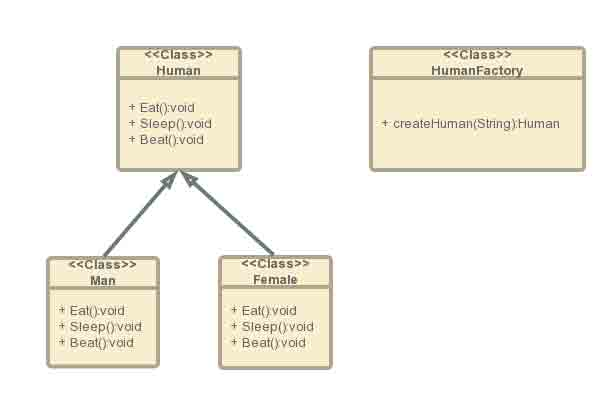

# 第 2 节 工厂模式

## 一、本节目标

我们本节课程主要介绍【工厂模式】的相关知识，将会涉及以下内容：

> * 什么是工厂模式

*   工厂模式类图

*   工厂模式代码

*   工厂模式应用

*   PS：学习 Java 设计模式之前最好有一定的 Java 语言基础。由于讲这种东西其实比较枯燥，为了让大家学习起来轻松愉快一点，我会尽量使用一些生动、形象和幽默的例子。

## 二、什么是工厂模式

工厂模式（Factory Pattern）的意义就跟它的名字一样，在面向对象程序设计中，工厂通常是一个用来创建其他对象的对象。工厂模式根据不同的参数来实现不同的分配方案和创建对象。例如用工厂来创建 `人` 这个对象，如果我们需要一个男人对象，工厂就会为我们创建一个男人；如果我们需要一个女人，工厂就会为我们生产一个女人（女娲娘娘的既视感啊）。

工厂模式通常分为：

*   简单工厂模式
*   工厂方法模式
*   抽象工厂模式

本节课讲解 简单工厂模式、工厂方法模式，抽象工厂模式将会在下节课中讲到。

## 三、工厂模式类图

刚刚我们说到，用工厂模式来创建人。现在我们来当回 “女娲娘娘”，先创建一个男人，他每天都 “吃饭、睡觉、打豆豆”，然后我们再创建一个女人，她每天也 “吃饭、睡觉、打豆豆”。

我们以简单工厂模式为例。



## 四、 工厂模式示例代码

Talk is cheap, show me the code.

```java
// 抽象产品
abstract class Human {
    public abstract void Eat();
    public abstract void Sleep();
    public abstract void Beat();
}

// 具体产品-男人
class Man extends Human{
    public void Eat() {
        System.out.println("Man can eat.");        
    }

    public void Sleep() {
        System.out.println("Man can sleep.");
    }

    public void Beat() {
        System.out.println("Man can beat doudou.");        
    }

}

// 具体产品-女人
class Female extends Human{

    public void Eat() {
        System.out.println("Female can eat.");   
    }

    public void Sleep() {
        System.out.println("Female can sleep.");
    }

    public void Beat() {
        System.out.println("Female can beat doudou.");        
    }

}

// 简单工厂
public class HumanFactory {
    public static Human createHuman(String gender){
        Human human = null;
        if( gender.equals("man") ){
            human = new Man();
        }else if( gender.equals("female")){
            human = new Female();
        }

        return human;
    }
}

// 女娲造人
public class Goddess {  
    public static void main(String[] args) throws IOException {  
        // 造个男人  
        Human human = HumanFactory.createHuman("man");  
        human.Eat();
        human.Sleep();
        human.Beat();
    } 
} 
```

简单工厂模式就是上面那样子了，那么工厂方法模式又有什么不同呢？工厂方法模式在简单工厂模式的基础之上，把简单工厂抽象化了。

```java
// 抽象产品
abstract class Human {
    public abstract void Eat();
    public abstract void Sleep();
    public abstract void Beat();
}

// 具体产品-男人
class Man extends Human {
    public void Eat() {
        System.out.println("Man can eat.");        
    }

    public void Sleep() {
        System.out.println("Man can sleep.");
    }

    public void Beat() {
        System.out.println("Man can beat doudou.");        
    }

}

// 具体产品-女人
class Female extends Human{

    public void Eat() {
        System.out.println("Female can eat.");   
    }

    public void Sleep() {
        System.out.println("Female can sleep.");
    }

    public void Beat() {
        System.out.println("Female can beat doudou.");        
    }

}

// 简单工厂变为了抽象工厂
abstract class HumanFactory {
    public abstract Human createHuman(String gender) throws IOException;
}

// 具体工厂（每个具体工厂负责一个具体产品）  
class ManFactory extends HumanFactory{  
    public Human createHuman(String gender) throws IOException {  
        return new Man();  
    }  
}  
class FemaleFactory extends HumanFactory{  
    public Human createHuman(String gender) throws IOException {  
        return new Female();  
    }  
}  

// 女娲造人
public class Goddess {  

    public static void main(String[] args) throws IOException {  
        // 造个男人  
        HumanFactory hf = new ManFactory();
        Human h = hf.createHuman("man");
        h.Eat();
        h.Sleep();
        h.Beat();
    } 
} 
```

## 五、工厂模式应用

你可能就问了，工厂模式工厂模式的，我咋没见过哪儿用过啊？这这这儿，在 Java 库里面。根据不同的参数，getInstance() 方法会返回不同的 Calendar 对象。

```java
java.util.Calendar - getInstance()
java.util.Calendar - getInstance(TimeZone zone)
java.util.Calendar - getInstance(Locale aLocale)
java.util.Calendar - getInstance(TimeZone zone, Locale aLocale)
java.text.NumberFormat - getInstance()
java.text.NumberFormat - getInstance(Locale inLocale) 
```

写 Android 的童鞋们，应该还知道 `BitmapFactory` , 这也是工厂模式的一种应用。

## 六、实验总结

总结一下，本次课程我们站在 “女娲娘娘” 的角度，学习了工厂模式的相关知识。

## 七、参考文档

> * [工厂方法](http://zh.wikipedia.org/zh/%E5%B7%A5%E5%8E%82%E6%96%B9%E6%B3%95) > * [Java Design Pattern: Factory](http://www.programcreek.com/2013/02/java-design-pattern-factory/)