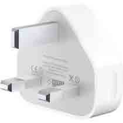
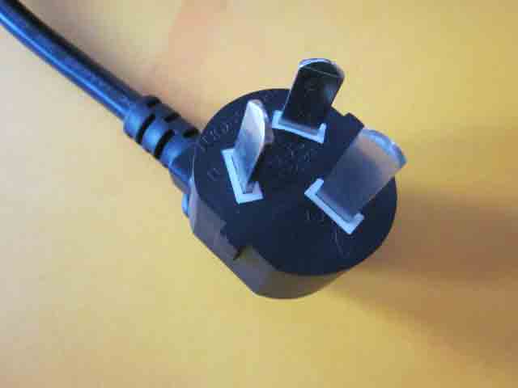
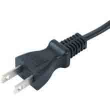
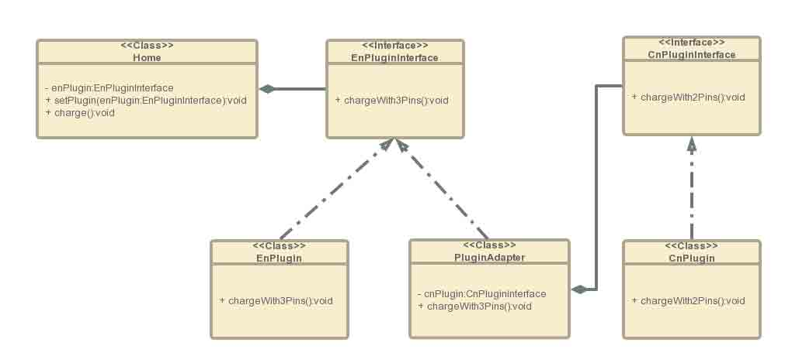

# 第 4 节 适配器模式

## 一、本节目标

我们本节课程主要介绍【适配器模式】的相关知识，将会涉及以下内容：

> * 什么是适配器模式

*   适配器模式类图
*   适配器模式代码
*   适配器模式的应用

## 二、什么是适配器模式

顾名思义，适配器模式（Adapter Pattern）当然是用来适配的啦。当你想使用一个已有的类，但是这个类的接口跟你的又不一样，不能拿来直接用，这个时候你就需要一个适配器来帮你了。

这就好像你兴冲冲地跑去香港，买了个港版的 iPhone6，充电器插头拿回家一看，不能用啊。这时候你多么需要买一个转接头适配器...


## 三、适配器模式类图

你去香港旅游，买的 iPhone6 的充电器插头是英标的，它是那种三脚是方形的插头。



而咱们国标的插头是两只脚，即使是三只脚的插头也和英标不一样。



为了方便，这里我们就假设国标插头就只是两只脚的插头吧。（其实我是懒。。）



好的，目标明确，英标三只脚插头充电，国标两只脚插头充电。你家很富，有很多插座可以充电。



## 四、 适配器模式示例代码

Talk is cheap, show me the code.

```java
// 英标接口
public interface EnPluginInterface {
    void chargeWith3Pins();
}

// 实现英标接口的充电方法
public class EnPlugin implements EnPluginInterface {
    public void chargeWith3Pins() {
        System.out.println("charge with EnPlugin")
    }
}

// 在室内充电
public class Home {
    private EnPluginInterface enPlugin;

    public Home() { }

    public Home(EnPluginInterface enPlugin) {
        this.enPlugin = enPlugin;
    }

    public void setPlugin(EnPluginInterface enPlugin) {
        this.enPlugin = enPlugin;
    }

    // 充电
    public void charge() {
        enPlugin.chargeWith3Pins();
    }
}

// 英标测试类
public class Test {
    public static void main(String[] args) {
        EnPluginInterface enPlugin = new EnPlugin();
        Home home = new Home(enPlugin);

        // 会输出 “charge with EnPlugin”
        home.charge();
    }
}

// 现在你回内陆了，只能用国标充电

// 国标接口
public interface CnPluginInterface {
    void chargeWith2 Pins();
}

// 实现国标接口的充电方法
public class CnPlugin implements CnPluginInterface {
    public void chargeWith2 Pins() {
        System.out.println("charge with CnPlugin");
    }
}

// 适配器
public class PluginAdapter implements EnPluginInterface {
    private CnPluginInterface cnPlugin;

    public PluginAdapter(CnPluginInterface cnPlugin) {
        this.cnPlugin = cnPlugin;
    }

    // 这是重点，适配器实现了英标的接口，然后重载英标的充电方法为国标的方法
    @Override
    public void chargeWith3Pins() {
        cnPlugin.chargeWith2 Pins();
    }
}

// 适配器测试类
public class AdapterTest {
    public static void main(String[] args) {
        CnPluginInterface cnPlugin = new CnPlugin();
        Home home = new Home();
        PluginAdapter pluginAdapter = new PluginAdapter(cnPlugin);
        home.setPlugin(pluginAdapter);

        // 会输出 “charge with CnPlugin”
        home.charge();
    }
} 
```

## 五、适配器模式的应用

前面已经说了，当你想使用一个已有的类，但是这个类的接口跟你的又不一样，不能拿来直接用，这个时候你就需要一个适配器来帮你了，其主要作用就是在旧的接口、新的接口之间完成适配。

比如说，做过 Android 的同学肯定写 ListView 的适配器都写吐了吧...

## 六、小结

> 国际惯例，总个结。本次课程我们去香港买了个 iPhone6 回家... 顺便学习了【适配器模式】的相关知识。

## 七、参考文档

> * [一个示例让你明白适配器模式](http://blog.csdn.net/zhangjg_blog/article/details/18735243)