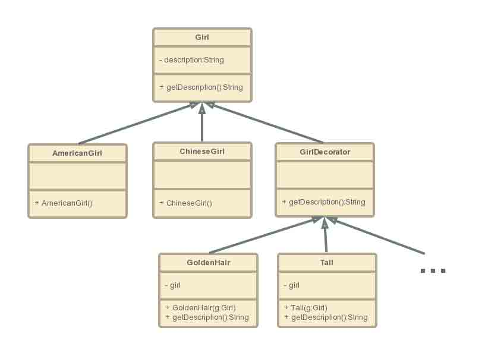

# 第 5 节 装饰者模式

## 一、本节目标

我们本节课程主要介绍【装饰者模式】的相关知识，将会涉及以下内容：

> * 什么是装饰者模式

*   装饰者模式类图

*   装饰者模式代码

*   装饰者模式应用

*   装饰者模式、适配器模式区别

*   PS：剧情预告，本节课程会十分酸爽...

## 二、什么是 装饰者模式

装饰者模式（Decorator Pattern，有的也用 Wrapper Pattern）就是动态地把职责附加到已有对象上去，实现功能扩展。这种特性，使得装饰者模式提供了比继承更具有弹性的解决方案。

提到装饰者模式，总让我想起卞之琳的《断章》来：

> 你站在桥上看风景， > > 看风景的人在楼上看你。 > > 明月装饰了你的窗子， > > 你装饰了别人的梦。

多么有意境啊，单身狗读完会不会觉得心好累... 没关系，我来拯救你！

## 三、 装饰者模式类图

送你一个女朋友怎么样！想她是美国金发大妞？浪漫的法国女郎？国产的萌萌哒妹子？OK，没问题！你想她是哪个国家的就是哪个国家的。她们有不同的爱好或者习惯，每一个这样的女孩，都可以看作是一个 Java 类。我知道此刻你一定在想，这一个、那一个...那岂不是有很多类？这种方式没有扩展性，每当有一个新类型的女孩，就得又新建一个类，这简直就是类爆炸啊！



## 四、 装饰者模式示例代码

Talk is cheap, show me the code.

```java
// 抽象类 Girl
public abstract class Girl {
    String description = "no particular";

    public String getDescription(){
        return description;
    }
}

// 美国女孩
public class AmericanGirl extends Girl {
    public AmericanGirl() {
        description = "+AmericanGirl";
    }
}

// 国产妹子
public class ChineseGirl extends Girl {
    public ChineseGirl() {
        description = "+ChineseGirl";
    }
}

// 装饰者
public abstract class GirlDecorator extends Girl {
    public abstract String getDescription();
}

// 下面以美国女孩示例
// 给美国女孩加上金发
public class GoldenHair extends GirlDecorator {

    private Girl girl;

    public GoldenHair(Girl g) {
        girl = g;
    }

    @Override
    public String getDescription() {
        return girl.getDescription() + "+with golden hair";
    }

}

// 加上身材高大的特性
public class Tall extends GirlDecorator {

    private Girl girl;

    public Tall(Girl g) {
        girl = g;
    }

    @Override
    public String getDescription() {
        return girl.getDescription() + "+is very tall";
    }

}

// 检验一下
public class Main {

    public static void main(String[] args) {
        Girl g1 = new AmericanGirl();
        System.out.println(g1.getDescription());

        GoldenHair g2 = new GoldenHair(g1);
        System.out.println(g2.getDescription());

        Tall g3 = new Tall(g2);
        System.out.println(g3.getDescription());

        // 你也可以一步到位
        // Girl g = new Tall(new GoldenHair(new AmericanGirl())); 
    }
} 
```

最后美国金发大妞奉上（输出内容为）：

```java
+AmericanGirl

+AmericanGirl+with golden hair

+AmericanGirl+with golden hair+is very tall 
```

## 五、装饰者模式应用

当你需要动态地给一个对象添加功能，实现功能扩展的时候，就可以使用装饰者模式。

Java IO 类中有一个经典的装饰者模式应用， BufferedReader 装饰了 InputStreamReader.

```java
BufferedReader input = new BufferedReader(new InputStreamReader(System.in)); 
```

*   **InputStreamReader(InputStream in)** - InputSteamReader 读取 bytes 字节内容，然后转换成 characters 流 输出。

*   **BufferedReader(Reader in)** - 从 characters 流 中读取内容并缓存。

## 六、装饰者模式、适配器模式区别

*   1.关于新职责：适配器也可以在转换时增加新的职责，但其主要目的并不在此；而装饰者模式主要目的，就是给被装饰者增加新职责用的。

*   2.关于原接口：适配器模式是用新接口来调用原接口，原接口对新系统来说是不可见或者说不可用的；而装饰者模式原封不动的使用原接口，系统对装饰的对象也通过原接口来完成使用。

*   3.关于其包裹的对象：适配器是知道被适配者的详细情况的（就是那个类或那个接口）；而装饰者只知道其接口是什么，至于其具体类型（是基类还是其他派生类）只有在运行期间才知道。

## 七、小结

> 国际惯例，总个结。本次课程我们赚大了，各种女朋友...顺便学习了【装饰者模式】的相关知识。

## 八、参考文档

> * [Java Design Pattern: Decorator](http://www.programcreek.com/2012/05/java-design-pattern-decorator-decorate-your-girlfriend/) > * [装饰者模式（Decorator Pattern）](http://blog.csdn.net/lcl_data/article/details/8830455)