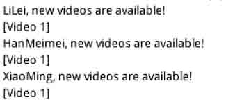

# 第 6 节 观察者模式

## 一、本节目标

我们本节课程主要介绍【观察者模式】的相关知识，将会涉及以下内容：

> * 什么是观察者模式

*   观察者模式类图
*   观察者模式代码
*   观察者模式的应用

## 二、什么是 观察者模式

一句话，观察者模式（Observer Pattern）就是一种 “发布者-订阅者” 的模式。有时也被称为 “模型-视图”模式、“源-监听者”模式等。在这种模式中，由一个目标对象来管理所有依赖与它的观察者对象，并且当这个目标对象自身发生改变时，会主动向它的观察者们发出通知。

## 三、 观察者模式类图

比如你最近在追一个美剧《生活大爆炸》，假设著名在线视频网站某狐买下独家版权，在线更新与播放。于是你天天等啊等啊，等它的更新通知一来，你就去看那些最新的视频。


## 四、 观察者模式示例代码

Talk is cheap, show me the code.

```java
// Subject 主题接口
public interface Subject {
    public void registerObserver(Observer o);
    public void removeObserver(Observer o);
    public void notifyAllObservers();
}

// 观察者接口
public interface Observer {
    public void update(Subject s);
}

// 视频网站某狐 实现 Subject 接口
public class VideoSite implements Subject{

    // 观察者列表 以及 更新了的视频列表
    private ArrayList<Observer> userList;
    private ArrayList<String> videos;

    public VideoSite(){
        userList = new ArrayList<Observer>();
        videos = new ArrayList<String>();
    }

    @Override
    public void registerObserver(Observer o) {
        userList.add(o);
    }

    @Override
    public void removeObserver(Observer o) {
        userList.remove(o);
    }

    @Override
    public void notifyAllObservers() {
        for (Observer o: userList) {
            o.update(this);
        }
    }

    public void addVideos(String video) {
        this.videos.add(video);
        notifyAllObservers();
    }

    public ArrayList<String> getVideos() {
        return videos;
    }

    public String toString(){
        return videos.toString();
    }
}

// 实现观察者，即看视频的美剧迷们
public class VideoFans implements Observer {

    private String name;

    public VideoFans(String name){
        this.name = name;
    }
    @Override
    public void update(Subject s) {
        System.out.println(this.name + ", new videos are available! ");
        // print video list
        System.out.println(s);
    }
}

//  测试一下
public class Main {

    public static void main(String[] args) {
        VideoSite vs = new VideoSite();
        vs.registerObserver(new VideoFans("LiLei"));
        vs.registerObserver(new VideoFans("HanMeimei"));
        vs.registerObserver(new VideoFans("XiaoMing"));

        // add videos
        vs.addVideos("Video 1");
        //vs.addVideos("Video 2");
    }
} 
```

运行结果为：



## 五、观察者模式的应用

前面已经说了，观察者模式也可以理解为 “源-监听者” 模式，这种应用就太多了。举个简单的例子就是各种 listener，比如当你有一个按键，你肯定要给这个按键添加监听事件（listener）来完成指定动作吧，这就是一种应用。

## 六、小结

> 国际惯例，总个结。本次课程我们看美剧去了... 顺便学习了【观察者模式】的相关知识。

## 七、参考文档

> * [Java Design Pattern: Observer](http://www.programcreek.com/2011/01/an-java-example-of-observer-pattern/)