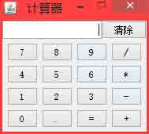

# 第 1 节 Java 版图形界面计算器

## 一、实验说明及介绍

### 1\. 环境登录

无需密码自动登录，系统用户名 shiyanlou

### 2\. 环境介绍

本实验环境采用带桌面的 Ubuntu Linux 环境，实验中会用到桌面上的程序：

*   LX 终端（LXTerminal）: Linux 命令行终端，打开后会进入 Bash 环境，可以使用 Linux 命令
*   Eclipse：一款很强大的 IDE

### 3\. 项目介绍

本次实验制作一个可以进行简单的四则运算的计算器，会使用到 Java swing 进行开发。

最终效果图：



## 二、布局

这个计算器有两个 JPanel。

什么是 JPanel：JPanel 是一般轻量级容器。JPanel 为 javax.swing 包中的，为面板容器，可以加入到 JFrame 中 , 它自身是个容器，可以把其他 compont 加入到 JPanel 中，如 JButton、JTextArea、JTextField 等。两个 JPanel 分别对应这个计算器按键除 “清除” 键外其他的键，另个面板则是输出栏跟 “清除” 键（截取部分代码）。

```java
 JPanel pan = new JPanel();
        pan.setLayout(new GridLayout(4, 4, 5, 5));// 四行四列 边距为 5 像素
        pan.add(button7);
        pan.add(button8);
        pan.add(button9);
        pan.add(button_chu);
        pan.add(button4);
        pan.add(button5);
        pan.add(button6);
        pan.add(button_cheng);
        pan.add(button1);
        pan.add(button2);
        pan.add(button3);
        pan.add(button_jian);
        pan.add(button0);
        pan.add(button_Dian);
        pan.add(button_dy);
        pan.add(button_jia);
        pan.setBorder(BorderFactory.createEmptyBorder(5, 5, 5, 5));// pan 对象的边距

        JPanel pan2 = new JPanel();
        pan2.setLayout(new BorderLayout());
        pan2.add(result_TextField, BorderLayout.WEST);
        pan2.add(clear_Button, BorderLayout.EAST); 
```

布局结束后就是计算器的难点：事件处理程序。

## 三、事件处理

事件处理有：数字键、加减乘除运算、小数点处理、等于以及清除。

代码如下(截取部分代码，这里是通过类方法处理的)：

```java
//等于
class Listener_dy implements ActionListener {
            @SuppressWarnings("unchecked")
        public void actionPerformed(ActionEvent e) {

                store = (JButton) e.getSource();
                vt.add(store);
                yuns();
                k1 = 1; // 还原开关 k1 状态 
                // str1=result;
                k2 = 1;
                k3 = 1;// 还原开关 k3 状态
                k4 = 1; // 还原开关 k4 状态

                str1 = result; // 为 7+5=12 +5=17 这种计算做准备
            }
        } 
```

## 四、计算的实现

```java
public void cal() {
        double a2;// 运算数 1
        double b2;// 运算数 2
        String c = signal;// 运算符
        double result2 = 0;// 结果

        if (c.equals("")) {
            result_TextField.setText("请输入运算符");

        } else {

            if (str1.equals(".")) // 字符串 "." 转换成 double 型数据时 会出错 所以手工转
                str1 = "0.0";
            if (str2.equals("."))
                str2 = "0.0";
            a2 = Double.valueOf(str1).doubleValue();
            b2 = Double.valueOf(str2).doubleValue();

            if (c.equals("+")) {
                result2 = a2 + b2;
            }
            if (c.equals("-")) {
                result2 = a2 - b2;
            }
            if (c.equals("*")) {
                result2 = a2 * b2;
            }
            if (c.equals("/")) {
                if (b2 == 0) {
                    result2 = 0;// 0000000000000 by 0 cu!
                } else {
                    result2 = a2 / b2;
                }

            }

            result = ((new Double(result2)).toString());

            result_TextField.setText(result);
        }
    } 
```

然后整个程序就完成了。

## 五、项目完整源码

整个程序完整源代码：

```java
package cal;

import java.awt.*;
import java.awt.event.*;
import javax.swing.*;
import java.util.Vector;

public class Calculator {

    String str1 = "0"; // 运算数 1 初值一定为 0 为了程序的安全
    String str2 = "0"; // 运算数 2
    String signal = "+"; // 运算符
    String result = "";// 结果

    // 状态开关
    int k1 = 1;// 开关 1 用于选择输入方向 将要写入 str2 或 str2
    int k2 = 1;// 开关 2 符号键 次数 k2>1 说明进行的是 2+3-9+8 这样的多符号运算
    int k3 = 1;// 开关 3 str1 是否可以被清 0 ==1 时可以 !=1 时不能被清 0
    int k4 = 1;// 开关 4 str2 同上
    int k5 = 1;// 开关 5 控制小数点可否被录入 ==1 时可以 !=1 输入的小数点被丢掉
    JButton store; // 寄存器 记录 是否连续按下符号键
    @SuppressWarnings("rawtypes")
    Vector vt = new Vector(20, 10);

    JFrame frame = new JFrame("计算器");
    JTextField result_TextField = new JTextField(result, 20);// 20 列
    JButton clear_Button = new JButton("清除");
    JButton button0 = new JButton("0");
    JButton button1 = new JButton("1");
    JButton button2 = new JButton("2");
    JButton button3 = new JButton("3");
    JButton button4 = new JButton("4");
    JButton button5 = new JButton("5");
    JButton button6 = new JButton("6");
    JButton button7 = new JButton("7");
    JButton button8 = new JButton("8");
    JButton button9 = new JButton("9");
    JButton button_Dian = new JButton(".");
    JButton button_jia = new JButton("+");
    JButton button_jian = new JButton("-");
    JButton button_cheng = new JButton("*");
    JButton button_chu = new JButton("/");
    JButton button_dy = new JButton("=");

    Calculator() {
        button0.setMnemonic(KeyEvent.VK_0);// 等效键
        // 其它 等效键 略,

        result_TextField.setHorizontalAlignment(JTextField.RIGHT);// 文本框 右对齐

        JPanel pan = new JPanel();
        pan.setLayout(new GridLayout(4, 4, 5, 5));// 四行四列 边距为 5 像素
        pan.add(button7);
        pan.add(button8);
        pan.add(button9);
        pan.add(button_chu);
        pan.add(button4);
        pan.add(button5);
        pan.add(button6);
        pan.add(button_cheng);
        pan.add(button1);
        pan.add(button2);
        pan.add(button3);
        pan.add(button_jian);
        pan.add(button0);
        pan.add(button_Dian);
        pan.add(button_dy);
        pan.add(button_jia);
        pan.setBorder(BorderFactory.createEmptyBorder(5, 5, 5, 5));// pan 对象的边距

        JPanel pan2 = new JPanel();
        pan2.setLayout(new BorderLayout());
        pan2.add(result_TextField, BorderLayout.WEST);
        pan2.add(clear_Button, BorderLayout.EAST);

        frame.setLocation(300, 200); // 主窗口 出现在位置
        frame.setResizable(false); // 不能调大小
        frame.getContentPane().setLayout(new BorderLayout());
        frame.getContentPane().add(pan2, BorderLayout.NORTH);
        frame.getContentPane().add(pan, BorderLayout.CENTER);

        frame.pack();
        frame.setVisible(true);

        // 事件处理 程 序

        // 数 字 键
        class Listener implements ActionListener {
            @SuppressWarnings("unchecked")
            public void actionPerformed(ActionEvent e) {
                String ss = ((JButton) e.getSource()).getText();
                store = (JButton) e.getSource();
                vt.add(store);
                if (k1 == 1) {
                    if (k3 == 1) {
                        str1 = "";
                        k5 = 1;// 还原开关 k5 状态
                    }
                    str1 = str1 + ss;

                    k3 = k3 + 1;

                    result_TextField.setText(str1);// 显示

                } else if (k1 == 2) {
                    if (k4 == 1) {
                        str2 = "";
                        k5 = 1; // 还原开关 k5 状态
                    }
                    str2 = str2 + ss;
                    k4 = k4 + 1;
                    result_TextField.setText(str2);
                }

            }
        }

        // 符 号
        class Listener_signal implements ActionListener {
            @SuppressWarnings("unchecked")
            public void actionPerformed(ActionEvent e) {
                String ss2 = ((JButton) e.getSource()).getText();
                store = (JButton) e.getSource();
                vt.add(store);

                if (k2 == 1) {
                    k1 = 2;// 开关 k1 为 1 时,向数 1 写 为 2 时，向数 2 写
                    k5 = 1;
                    signal = ss2;
                    k2 = k2 + 1;// 按符号键的次数
                } else {
                    int a = vt.size();
                    JButton c = (JButton) vt.get(a - 2);

                    if (!(c.getText().equals("+"))
                            && !(c.getText().equals("-"))
                            && !(c.getText().equals("*"))
                            && !(c.getText().equals("/")))

                    {
                        cal();
                        str1 = result;
                        k1 = 2;// 开关 k1 为 1 时,向数 1 写 为 2 时，向数 2 写
                        k5 = 1;
                        k4 = 1;
                        signal = ss2;
                    }
                    k2 = k2 + 1;

                }

            }
        }

        // 清除
        class Listener_clear implements ActionListener {
            @SuppressWarnings("unchecked")
            public void actionPerformed(ActionEvent e) {
                store = (JButton) e.getSource();
                vt.add(store);
                k5 = 1;
                k2 = 1;
                k1 = 1;
                k3 = 1;
                k4 = 1;
                str1 = "0";
                str2 = "0";
                signal = "";
                result = "";
                result_TextField.setText(result);
                vt.clear();
            }
        }

        // 等 于
        class Listener_dy implements ActionListener {
            @SuppressWarnings("unchecked")
            public void actionPerformed(ActionEvent e) {

                store = (JButton) e.getSource();
                vt.add(store);
                cal();
                k1 = 1; // 还原开关 k1 状态
                // str1=result;
                k2 = 1;
                k3 = 1;// 还原开关 k3 状态
                k4 = 1; // 还原开关 k4 状态

                str1 = result; // 为 7+5=12 +5=17 这种计算做准备
            }
        }
        // 小数点
        class Listener_xiaos implements ActionListener {
            @SuppressWarnings("unchecked")
            public void actionPerformed(ActionEvent e) {
                store = (JButton) e.getSource();
                vt.add(store);
                if (k5 == 1) {
                    String ss2 = ((JButton) e.getSource()).getText();
                    if (k1 == 1) {
                        if (k3 == 1) {
                            str1 = "";
                            k5 = 1; // 还原开关 k5 状态
                        }
                        str1 = str1 + ss2;

                        k3 = k3 + 1;

                        result_TextField.setText(str1);// 显示

                    } else if (k1 == 2) {
                        if (k4 == 1) {
                            str2 = "";
                            k5 = 1; // 还原开关 k5 状态
                        }
                        str2 = str2 + ss2;

                        k4 = k4 + 1;

                        result_TextField.setText(str2);
                    }
                }

                k5 = k5 + 1;
            }
        }

        // 注册 监听器
        Listener_dy jt_dy = new Listener_dy();
        Listener jt = new Listener();// 临听数字键
        Listener_signal jt_signal = new Listener_signal();// 临 听符 号键
        Listener_clear jt_c = new Listener_clear(); // 清除键
        Listener_xiaos jt_xs = new Listener_xiaos();// 小数点 键

        button7.addActionListener(jt);
        button8.addActionListener(jt);
        button9.addActionListener(jt);
        button_chu.addActionListener(jt_signal);
        button4.addActionListener(jt);
        button5.addActionListener(jt);
        button6.addActionListener(jt);
        button_cheng.addActionListener(jt_signal);
        button1.addActionListener(jt);
        button2.addActionListener(jt);
        button3.addActionListener(jt);
        button_jian.addActionListener(jt_signal);
        button0.addActionListener(jt);
        button_Dian.addActionListener(jt_xs);
        button_dy.addActionListener(jt_dy);
        button_jia.addActionListener(jt_signal);
        clear_Button.addActionListener(jt_c);

        // 关闭事件处理程序
        frame.addWindowListener(new WindowAdapter() {
            public void windowClosing(WindowEvent e) {
                System.exit(0);
            }
        });

    }

    // 计 算
    public void cal() {
        double a2;// 运算数 1
        double b2;// 运算数 2
        String c = signal;// 运算符
        double result2 = 0;// 结果

        if (c.equals("")) {
            result_TextField.setText("请输入运算符");

        } else {

            if (str1.equals(".")) // 字符串 "." 转换成 double 型数据时 会出错 所以手工转
                str1 = "0.0";
            if (str2.equals("."))
                str2 = "0.0";
            a2 = Double.valueOf(str1).doubleValue();
            b2 = Double.valueOf(str2).doubleValue();

            if (c.equals("+")) {
                result2 = a2 + b2;
            }
            if (c.equals("-")) {
                result2 = a2 - b2;
            }
            if (c.equals("*")) {
                result2 = a2 * b2;
            }
            if (c.equals("/")) {
                if (b2 == 0) {
                    result2 = 0;
                } else {
                    result2 = a2 / b2;
                }

            }

            result = ((new Double(result2)).toString());

            result_TextField.setText(result);
        }
    }

    @SuppressWarnings("unused")
    public static void main(String[] args) {
        // 界面风格，可以去除
    try {
                    UIManager.setLookAndFeel("com.sun.java.swing.plaf.windows.WindowsLookAndFeel");
        } catch (Exception e) {
            e.printStackTrace();
        }
        Calculator cal = new Calculator();
    }

} 
```

## 六、额外补充

1.  用 Eclipse 写项目的时候一定要记得有包名
2.  Java 设置界面风格：

```java
try
{
UIManager.setLookAndFeel("com.sun.java.swing.plaf.windows.WindowsLookAndFeel");
}catch(Exception e)
{
e.printStackTrace();
} 
```

其它的只要做相应的替换就可以了：

更换为 windows 风格： com.sun.java.swing.plaf.windows.WindowsLookAndFeel

更换为 metal 风格（默认）： javax.swing.plaf.metal.MetalLookAndFeel

更换为 motif 风格： com.sun.java.swing.plaf.motif.MotifLookAndFeel

更换为 mac 风格： com.sun.java.swing.plaf.mac.MacLookAndFeel

更换为 GTK 风格： com.sun.java.swing.plaf.gtk.GTKLookAndFeel

后两种风格需要到相关的操作系统上方可实现。

## 七、作业思考

思考一下，运算的优先级是如何保证的。