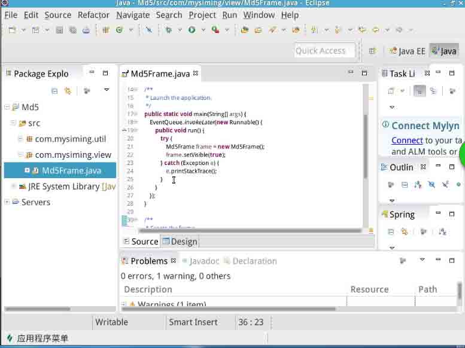
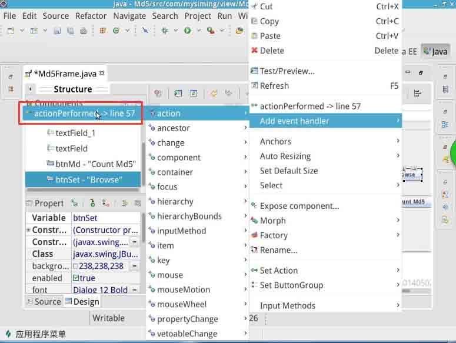

# 第 1 节 Java 实现 MD5 文件校验

## 一、实验说明及简介

### 1\. MD5 简介

学习编写 MD5 校验程序之前，我们先了解一下什么是 MD5。

首先，我们要知道 MD5 的中文名叫做 “信息摘要算法第五版”，是一种不可逆的算法。通俗的话说就是没办法通过任何算法来对其加密的值进行破解。

MD5 经常被应用在验证文件一致性、数字证书和安全访问认证方面。

### 2\. 环境介绍

本实验采用 linux 环境，实验中用到的软件以及插件：

*   Eclipse：Java 开发中使用的一种 IDE
*   swing 插件：Java SE 开发中用到的桌面级图形化开发插件，基于 Eclipse 平台使用

本项目的源代码可通过下述命令获取：

```java
$ git clone http://git.shiyanlou.com/shiyanlou/MD5 
```

### 3\. 项目简介

本次实验将使用 Java 语言编写 MD5 的文件校验程序。

MD5 可以对任何文件产生独一无二的数字指纹，文件有任何改动，MD5 值的数据指纹都会发生变化。

最终的效果图：


## 二、环境的使用

*   **注意：实验楼环境中已经安装好了 swing 插件，本节内容为安装过程供参考，无需执行。**

在 Eclipse 中添加 swing 插件。在 help 中找到 install new software 添加源：

```java
http://download.eclipse.org/windowbuilder/WB/release/R201406251200/4.4/ 
```


选择`select All` 勾选全部插件。

>注意：在实验楼的虚拟机中我们只能看见一个插件，实际上是有三个插件都需要安装。只是因为桌面大小原因没有完全显示出来而已。选择 `select All` 就可以勾选全部插件了。

选择后我们点击 `next` 进行下一步。


在这里，我们需要选择 I accept the terms of the license agreement

点击安装 `Finish`，安装完成之后重启 Eclipse。

## 三、公共类编写

首先我们创建一个 Java 的项目，名为 MD5 ，然后创建一个创建一个包，名为 `com.mysiming.util`，作为公共包，之后我们在包中创建名为 MD5 Util 类，该类主要编写 MD5 的算法，作为公共类调用。

```java
import java.io.File;
import java.io.FileInputStream;
import java.io.FileNotFoundException;
import java.io.IOException;
import java.math.BigInteger;
import java.nio.MappedByteBuffer;
import java.nio.channels.FileChannel;
import java.security.MessageDigest;

public class Md5Util {  
     // 标准的构造函数，调用 md5Init 函数进行初始化工作 
    public Md5Util() { 
        md5Init(); 
        return; 
    } 

    // RFC1321 中定义的标准 4*4 矩阵的常量定义。 
    static final int S11 = 7, S12 = 12, S13 = 17, S14 = 22; 
    static final int S21 = 5, S22 = 9, S23 = 14, S24 = 20; 
    static final int S31 = 4, S32 = 11, S33 = 16, S34 = 23; 
    static final int S41 = 6, S42 = 10, S43 = 15, S44 = 21; 

    // 按 RFC1321 标准定义不可变 byte 型数组 PADDING 
    static final byte[] PADDING = { -128, 0, 0, 0, 0, 0, 0, 0, 

0, 0, 0, 0, 0, 0, 0, 0, 0, 0, 0, 0, 0, 0, 0, 0, 0, 0, 0, 0, 0, 

0, 0, 0, 0, 0, 0, 0, 0, 0, 0, 0, 0, 0, 0, 0, 0, 0, 0, 0, 0, 0, 

0, 0, 0, 0, 0, 0, 0, 0, 0, 0, 0, 0, 0, 0 }; 

    // MD5 计算过程中的 3 组核心数据，采用数组形式存放 
    private long[] state = new long[4]; // 计算状态(分别对应 a b 

c d) 

    private byte[] buffer = new byte[64]; // 分配 64 个字节私有缓

冲区 

    private long[] count = new long[2]; // 位个数 

    // 最新一次计算结果的 16 进制 ASCII 字符串表示，代表了 16 个字符串

形式的 MD5 值 
    public String resultStr; 

    // 最新一次计算结果的 2 进制数组表示，一共 16 个字节，代表了

128bit 形式的 MD5 值 
    public byte[] digest = new byte[16]; 

    /**
     * 获得两次 MD5 加密的字符串
     * @param str
     * @return
     */ 
    public String getTwiceMD5ofString(String str){ 
        return getMD5ofStr(getMD5ofStr(str)); 
    } 

    /**
     * MD5_Encoding 类提供的主要的接口函数 getMD5ofStr，用来进行数

据加密变换。调用其可对任意字符串进行加密运算，并以字符串形式返回

加密结果。
     * @param in
     * @return
     */ 
    public String getMD5ofStr(String in) { 
        md5Init(); // 初始化 
        md5Update(in.getBytes(), in.length());// 调用 MD5 的主计算

过程 
        md5Final(); // 输出结果到 digest 数组中 
        for (int i = 0; i < 16; i++) { 
            resultStr += byteToHEX(digest[i]); // 将 digest 数组中

的每个 byte 型数据转为 16 进制形式的字符串 
        } 
        return resultStr; 
    } 

    // md5 初始化函数.初始化核心变量. 
    private void md5Init() { 
        state[0] = 0x67452301L; // 定义 state 为 RFC1321 中定义的标

准幻数 
        state[1] = 0xefcdab89L; // 定义 state 为 RFC1321 中定义的标

准幻数 
        state[2] = 0x98badcfeL; // 定义 state 为 RFC1321 中定义的标

准幻数 
        state[3] = 0x10325476L; // 定义 state 为 RFC1321 中定义的标

准幻数 
        count[0] = count[1] = 0L; // 初始化为 0 
        resultStr = "";// 初始化 resultStr 字符串为空 
        for (int i = 0; i < 16; i++) 
            digest[i] = 0;// 初始化 digest 数组元素为 0 
        return; 
    } 

    // 定义 F G H I 为 4 个基数 ，即为 4 个基本的 MD5 函数,进行简单的位

运算 
    private long F(long x, long y, long z) { 
        return (x & y) | ((~x) & z); 
    } 

    private long G(long x, long y, long z) { 
        return (x & z) | (y & (~z)); 
    } 

    private long H(long x, long y, long z) { 
        return x ^ y ^ z; 
    } 

    private long I(long x, long y, long z) { 
        return y ^ (x | (~z)); 
    } 

    // FF,GG,HH 和 II 调用 F,G,H,I 函数进行进一步变换 
    private long FF(long a, long b, long c, long d, long x, long 

s, long ac) { 
        a += F(b, c, d) + x + ac; 
        a = ((int) a << s) | ((int) a >>> (32 - s)); // 这里 long

型数据右移时使用无符号右移运算符>>> 
        a += b; 
        return a; 
    } 

    private long GG(long a, long b, long c, long d, long x, long 

s, long ac) { 
        a += G(b, c, d) + x + ac; 
        a = ((int) a << s) | ((int) a >>> (32 - s)); // 这里 long

型数据右移时使用无符号右移运算符>>> 
        a += b; 
        return a; 
    } 

    private long HH(long a, long b, long c, long d, long x, long 

s, long ac) { 
        a += H(b, c, d) + x + ac; 
        a = ((int) a << s) | ((int) a >>> (32 - s));// 这里 long

型数据右移时使用无符号右移运算符>>> 
        a += b; 
        return a; 
    } 

    private long II(long a, long b, long c, long d, long x, long 

s, long ac) { 
        a += I(b, c, d) + x + ac; 
        a = ((int) a << s) | ((int) a >>> (32 - s));// 这里 long

型数据右移时使用无符号右移运算符>>> 
        a += b; 
        return a; 
    } 

    // MD5 的主计算过程，input 是需要变换的二进制字节串，inputlen

是长度 
    private void md5Update(byte[] input, int inputLen) { 
        int i = 0, index, partLen; 
        byte[] block = new byte[64]; // 分配 64 个字节缓冲区 
        // 根据 count 计算 index 值。这里 long 型数据右移时使用无符号

右移运算符>>> 
        index = (int) (count[0] >>> 3) & 0x3F; 
        if ((count[0] += (inputLen << 3)) < (inputLen << 3)) 
            count[1]++; 
        count[1] += (inputLen >>> 29); // 这里 int 型数据右移时使

用无符号右移运算符>>> 
        partLen = 64 - index; // 计算 partLen 值 
        if (inputLen >= partLen) { 
            md5Memcpy(buffer, input, index, 0, partLen); 
            md5Transform(buffer); 
            for (i = partLen; i + 63 < inputLen; i += 64) { 
                md5Memcpy(block, input, 0, i, 64); 
                md5Transform(block); 
            } 
            index = 0; 
        } else 
            i = 0; 
        md5Memcpy(buffer, input, index, i, inputLen - i); 
    } 

    // 整理和填写输出结果，结果放到数组 digest 中。 
    private void md5Final() { 
        byte[] bits = new byte[8]; 
        int index, padLen; 
        Encode(bits, count, 8); 
        index = (int) (count[0] >>> 3) & 0x3f; // 这里 long 型数据

右移时使用无符号右移运算符>>> 
        padLen = (index < 56) ? (56 - index) : (120 - index); 
        md5Update(PADDING, padLen); 
        md5Update(bits, 8); 
        Encode(digest, state, 16); 
    } 

    // byte 数组的块拷贝函数，将 input 数组中的起始位置为 inpos，长

度 len 的数据拷贝到 output 数组起始位置 outpos 处。 
    private void md5Memcpy(byte[] output, byte[] input, int 

outpos, int inpos, int len) { 
        int i; 
        for (i = 0; i < len; i++) 
            output[outpos + i] = input[inpos + i]; 
    } 

    // MD5 核心变换计算程序，由 md5Update 函数调用，block 是分块的原

始字节数组 
    private void md5Transform(byte block[]) { 
        long a = state[0], b = state[1], c = state[2], d = 

state[3]; 
        long[] x = new long[16]; 
        Decode(x, block, 64); 
        // 进行 4 级级联运算 
        // 第 1 级 
        a = FF(a, b, c, d, x[0], S11, 0xd76aa478L); /* 1 */ 
        d = FF(d, a, b, c, x[1], S12, 0xe8c7b756L); /* 2 */ 
        c = FF(c, d, a, b, x[2], S13, 0x242070dbL); /* 3 */ 
        b = FF(b, c, d, a, x[3], S14, 0xc1bdceeeL); /* 4 */ 
        a = FF(a, b, c, d, x[4], S11, 0xf57c0fafL); /* 5 */ 
        d = FF(d, a, b, c, x[5], S12, 0x4787c62aL); /* 6 */ 
        c = FF(c, d, a, b, x[6], S13, 0xa8304613L); /* 7 */ 
        b = FF(b, c, d, a, x[7], S14, 0xfd469501L); /* 8 */ 
        a = FF(a, b, c, d, x[8], S11, 0x698098d8L); /* 9 */ 
        d = FF(d, a, b, c, x[9], S12, 0x8b44f7afL); /* 10 */ 
        c = FF(c, d, a, b, x[10], S13, 0xffff5bb1L); /* 11 */ 
        b = FF(b, c, d, a, x[11], S14, 0x895cd7beL); /* 12 */ 
        a = FF(a, b, c, d, x[12], S11, 0x6b901122L); /* 13 */ 
        d = FF(d, a, b, c, x[13], S12, 0xfd987193L); /* 14 */ 
        c = FF(c, d, a, b, x[14], S13, 0xa679438eL); /* 15 */ 
        b = FF(b, c, d, a, x[15], S14, 0x49b40821L); /* 16 */ 

        // 第 2 级 
        a = GG(a, b, c, d, x[1], S21, 0xf61e2562L); /* 17 */ 
        d = GG(d, a, b, c, x[6], S22, 0xc040b340L); /* 18 */ 
        c = GG(c, d, a, b, x[11], S23, 0x265e5a51L); /* 19 */ 
        b = GG(b, c, d, a, x[0], S24, 0xe9b6c7aaL); /* 20 */ 
        a = GG(a, b, c, d, x[5], S21, 0xd62f105dL); /* 21 */ 
        d = GG(d, a, b, c, x[10], S22, 0x2441453L); /* 22 */ 
        c = GG(c, d, a, b, x[15], S23, 0xd8a1e681L); /* 23 */ 
        b = GG(b, c, d, a, x[4], S24, 0xe7d3fbc8L); /* 24 */ 
        a = GG(a, b, c, d, x[9], S21, 0x21e1cde6L); /* 25 */ 
        d = GG(d, a, b, c, x[14], S22, 0xc33707d6L); /* 26 */ 
        c = GG(c, d, a, b, x[3], S23, 0xf4d50d87L); /* 27 */ 
        b = GG(b, c, d, a, x[8], S24, 0x455a14edL); /* 28 */ 
        a = GG(a, b, c, d, x[13], S21, 0xa9e3e905L); /* 29 */ 
        d = GG(d, a, b, c, x[2], S22, 0xfcefa3f8L); /* 30 */ 
        c = GG(c, d, a, b, x[7], S23, 0x676f02d9L); /* 31 */ 
        b = GG(b, c, d, a, x[12], S24, 0x8d2a4c8aL); /* 32 */ 

        // 第 3 级 
        a = HH(a, b, c, d, x[5], S31, 0xfffa3942L); /* 33 */ 
        d = HH(d, a, b, c, x[8], S32, 0x8771f681L); /* 34 */ 
        c = HH(c, d, a, b, x[11], S33, 0x6d9d6122L); /* 35 */ 
        b = HH(b, c, d, a, x[14], S34, 0xfde5380cL); /* 36 */ 
        a = HH(a, b, c, d, x[1], S31, 0xa4beea44L); /* 37 */ 
        d = HH(d, a, b, c, x[4], S32, 0x4bdecfa9L); /* 38 */ 
        c = HH(c, d, a, b, x[7], S33, 0xf6bb4b60L); /* 39 */ 
        b = HH(b, c, d, a, x[10], S34, 0xbebfbc70L); /* 40 */ 
        a = HH(a, b, c, d, x[13], S31, 0x289b7ec6L); /* 41 */ 
        d = HH(d, a, b, c, x[0], S32, 0xeaa127faL); /* 42 */ 
        c = HH(c, d, a, b, x[3], S33, 0xd4ef3085L); /* 43 */ 
        b = HH(b, c, d, a, x[6], S34, 0x4881d05L); /* 44 */ 
        a = HH(a, b, c, d, x[9], S31, 0xd9d4d039L); /* 45 */ 
        d = HH(d, a, b, c, x[12], S32, 0xe6db99e5L); /* 46 */ 
        c = HH(c, d, a, b, x[15], S33, 0x1fa27cf8L); /* 47 */ 
        b = HH(b, c, d, a, x[2], S34, 0xc4ac5665L); /* 48 */ 

        // 第 4 级 
        a = II(a, b, c, d, x[0], S41, 0xf4292244L); /* 49 */ 
        d = II(d, a, b, c, x[7], S42, 0x432aff97L); /* 50 */ 
        c = II(c, d, a, b, x[14], S43, 0xab9423a7L); /* 51 */ 
        b = II(b, c, d, a, x[5], S44, 0xfc93a039L); /* 52 */ 
        a = II(a, b, c, d, x[12], S41, 0x655b59c3L); /* 53 */ 
        d = II(d, a, b, c, x[3], S42, 0x8f0ccc92L); /* 54 */ 
        c = II(c, d, a, b, x[10], S43, 0xffeff47dL); /* 55 */ 
        b = II(b, c, d, a, x[1], S44, 0x85845dd1L); /* 56 */ 
        a = II(a, b, c, d, x[8], S41, 0x6fa87e4fL); /* 57 */ 
        d = II(d, a, b, c, x[15], S42, 0xfe2ce6e0L); /* 58 */ 
        c = II(c, d, a, b, x[6], S43, 0xa3014314L); /* 59 */ 
        b = II(b, c, d, a, x[13], S44, 0x4e0811a1L); /* 60 */ 
        a = II(a, b, c, d, x[4], S41, 0xf7537e82L); /* 61 */ 
        d = II(d, a, b, c, x[11], S42, 0xbd3af235L); /* 62 */ 
        c = II(c, d, a, b, x[2], S43, 0x2ad7d2bbL); /* 63 */ 
        b = II(b, c, d, a, x[9], S44, 0xeb86d391L); /* 64 */ 

        // 分别累加到 state[0],state[1],state[2],state[3] 
        state[0] += a; 
        state[1] += b; 
        state[2] += c; 
        state[3] += d; 
    } 

    // 把 byte 型数据转换为无符号 long 型数据 
    private static long byteToul(byte b) { 
        return b > 0 ? b : (b & 0x7F + 128); 
    } 

    // 把 byte 类型的数据转换成十六进制 ASCII 字符表示 
    private static String byteToHEX(byte in) { 
        char[] DigitStr = { '0', '1', '2', '3', '4', '5', '6', 

'7', '8', '9', 'A', 'B', 'C', 'D', 'E', 'F' }; 
        char[] out = new char[2]; 
        out[0] = DigitStr[(in >> 4) & 0x0F]; // 取高 4 位 
        out[1] = DigitStr[in & 0x0F]; // 取低 4 位 
        String s = new String(out); 
        return s; 
    } 

    // 将 long 型数组按顺序拆成 byte 型数组,长度为 len 
    private void Encode(byte[] output, long[] input, int len) { 
        int i, j; 
        for (i = 0, j = 0; j < len; i++, j += 4) { 
            output[j] = (byte) (input[i] & 0xffL); 
            output[j + 1] = (byte) ((input[i] >>> 8) & 0xffL); 
            output[j + 2] = (byte) ((input[i] >>> 16) & 0xffL); 
            output[j + 3] = (byte) ((input[i] >>> 24) & 0xffL); 
        } 
    } 

    // 将 byte 型数组按顺序合成 long 型数组，长度为 len 
    private void Decode(long[] output, byte[] input, int len) { 
        int i, j; 
        for (i = 0, j = 0; j < len; i++, j += 4) 
            output[i] = byteToul(input[j]) | (byteToul(input[j + 

1]) << 8) | (byteToul(input[j + 2]) << 16) | (byteToul(input[j + 

3]) << 24); 
        return; 
    }

    public static String getMd5ByFile(File file) {  
        String value = null;  
        FileInputStream in = null;
        try {
            in = new FileInputStream(file);
        } catch (FileNotFoundException e1) {
            e1.printStackTrace();
        }  
    try {  
        MappedByteBuffer byteBuffer = in.getChannel().map

(FileChannel.MapMode.READ_ONLY, 0, file.length());  
        MessageDigest md5 = MessageDigest.getInstance("MD5");  
        md5.update(byteBuffer);  
        BigInteger bi = new BigInteger(1, md5.digest());  
        value = bi.toString(16);  
    } catch (Exception e) {  
        e.printStackTrace();  
    } finally {  
            if(null != in) {  
                try {  
                in.close();  
            } catch (IOException e) {  
                e.printStackTrace();  
            }  
        }  
    }  
    return value;  
    } 
```

## 四、图形界面

我们创建一个 `swing` 的图像类。创建一个名为 `com.mysiming.view` 的包，然后创建一个名为 `MD5Frame` 的 `JFrame` 的类，我们按下 `ctrl+n` 找到 `JFrame` 然后创建。



我们点击 `Design` 就能直接进行图形化界面的编辑。首先我们创建两个 `JButton` 分别命名为 `Bowse` 与 `Cout Md5` 这两个按钮主要负责获取文件以及计算 Md5 的值。然后我们创建两个 `JTextField` 用于显示文件与 Md5 值。最后我们还需要创建两个 `JLabel` 分别命名为 `set File` 与 Md5：


虽然外观不怎么好看，但我们这里注重先实现功能。

在 `Bowse` 按钮上点击右键，获取点击事件：



在 `public void actionPerformed(ActionEvent e)` 方法中我们写入：

```java
jfc = new JFileChooser();
int result = jfc.showOpenDialog(null);
String filepath = "";                
if (result == JFileChooser.APPROVE_OPTION){
    filepath = jfc.getSelectedFile().getAbsolutePath();     

        textField.setText(filepath);
            } 
```

在`Cout Md5` 按钮上获取事件代码：

```java
File file = jfc.getSelectedFile();
String filemd5 = MD5Util.getMd5ByFile(file);
textField_1.setText(filemd5); 
```

然后我们保存运行。


注意：`jfc` 那个地方可能会报错，需要定义一个 jfc：

```java
protected JFileChooser jfc; 
```

到此，我们已经做出了一个 MD5 值的文件校验系统。但 MD5 的应用远不止这些，我们还可以使用它来进行加密等等用途。

## 五、作业思考

考虑如何使用 MD5 来进行加密应用。