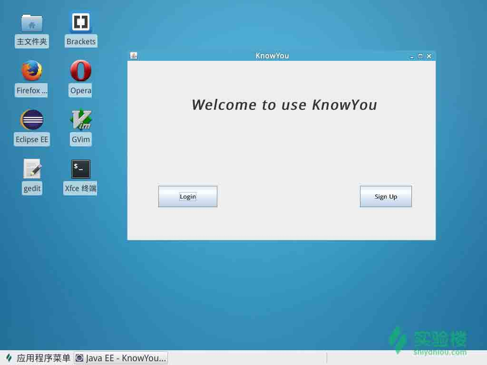
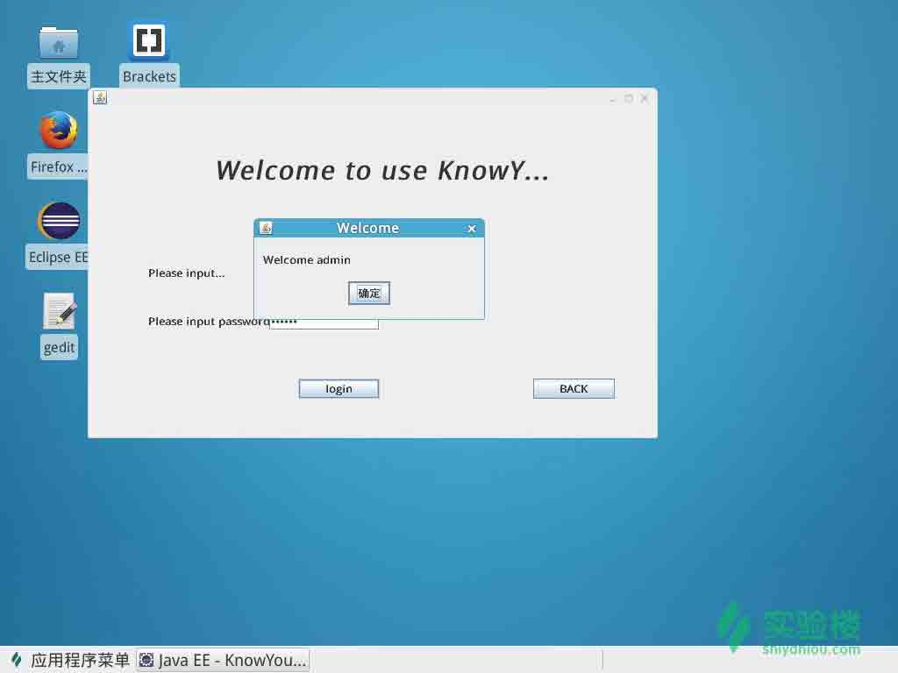
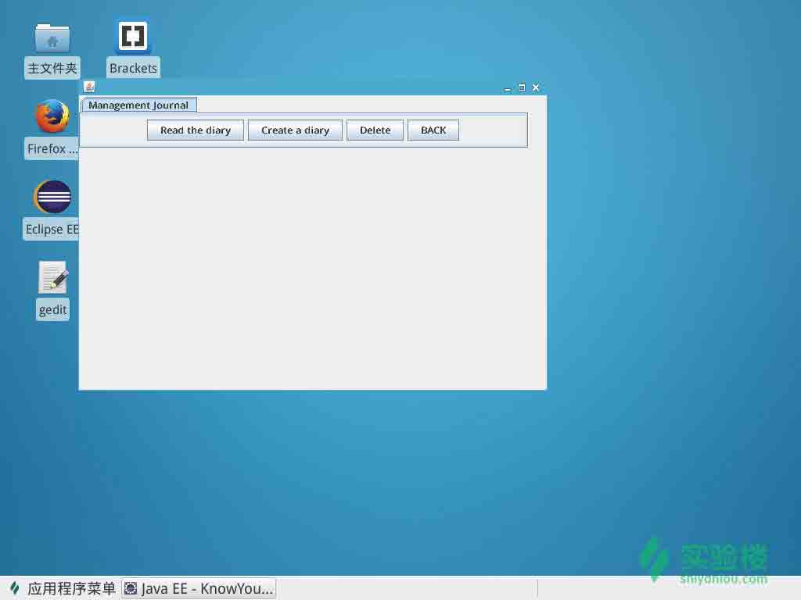
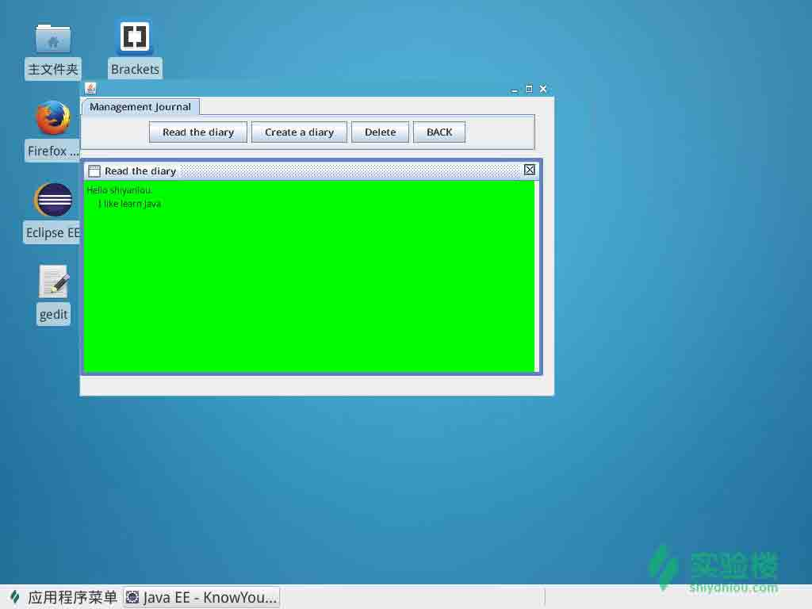
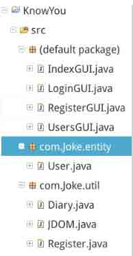

# 第 1 节 项目分析

## 一、实验说明

### 1\. 环境登录

无需密码自动登录，系统用户名 shiyanlou，该用户具备 sudo 的权限，可以执行安装软件等管理员操作。

### 2\. 环境介绍

本实验环境采用 Ubuntu Linux 桌面环境，实验中会用到桌面上的程序：

Eclipse：Eclipse 是著名的跨平台的自由集成开发环境（IDE）。主要用来 Java 语言开发，但是目前亦有人通过插件使其作为 C++ 和 Python 等语言的开发工具。

### 3\. 环境使用

使用编辑器输入实验所需的代码及文件，使用命令行终端运行所需命令进行操作。

“实验记录”页面可以在“我的主页”中查看，每次实验的截图及笔记，以及有效学习时间（指的是在实验桌面内操作的时间，如果没有操作，系统会记录为发呆时间）。这些都是您在实验楼学习的真实性证明。

### 4\. 项目介绍

本项目课程的目的是制作一款由 Java 语言实现的日记软件。可以实现用户的注册、登录以及对日记各种操作。以后小伙伴就可以用自己做出的日记软件来记录自己的生活。把自己想说的话，都可以放心的去表达。因为如果别人不知道你的密码，是登陆不了你的账号的。

## 二、项目截图：

## 三、涉及知识

1.  简单类的封装（重点）
2.  JDOM 解析 xml 文档（了解）
3.  GUI 界面布局（了解）
4.  鼠标和键盘事件（了解）
5.  IO 流的操作（重点）

## 四、项目结构

这是一个完整的 Java 小项目，所以代码较多。但是小伙伴们不用担心，里面的代码都非常简单。并且我会和你们从头一步一步做起的。

## 五、下节任务

在下节中，我们将正式开始我们的 Java 日记软件征途。首先完成我们的 GUI 界面。

*   完成首页界面
*   完成注册页面
*   完成登陆页面