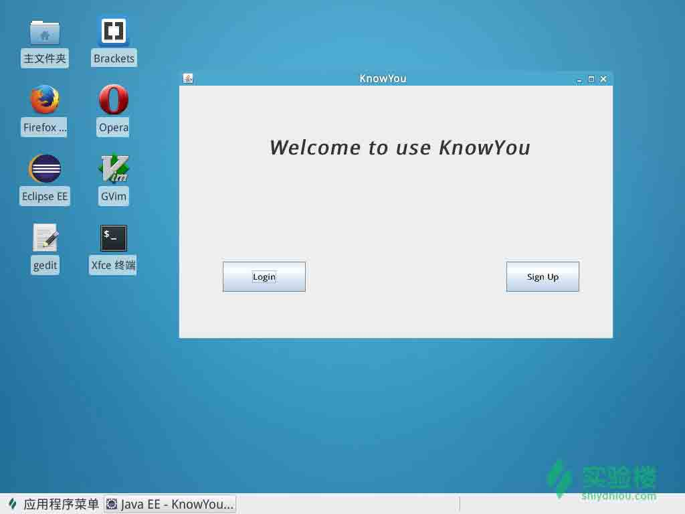
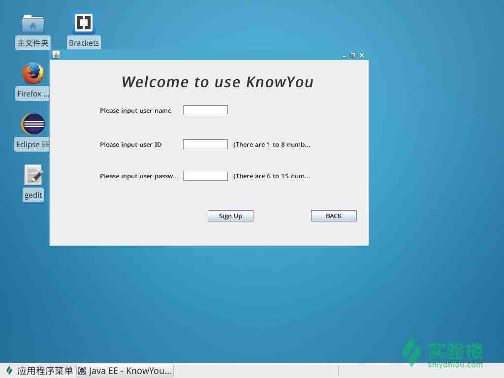
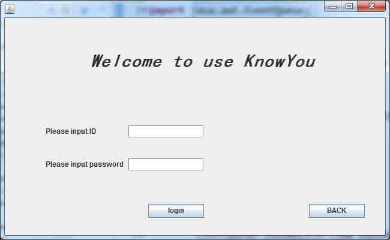

# 第 2 节 设计 GUI 界面

## 一、实验环境

### 1\. 环境登录

无需密码自动登录，系统用户名 shiyanlou

### 2\. 环境使用

实验报告页面可以在“我的主页”中查看，其中含有每次实验的截图及笔记，以及每次实验的有效学习时间（指的是在实验桌面内操作的时间，如果没有操作，系统会记录为发呆时间）。这些都是您学习的真实性证明。

### 3\. 使用工具

本项目使用 Ecplise 开发，Eclipse 是一个开放源代码的、基于 Java 的可扩展开发平台。

[Linux 下安装 Ecplise 教程](http://www.linuxidc.com/Linux/2011-09/42342.htm)

### 4\. 本节目标：

*   实现首页 GUI 界面。
*   实现登陆 GUI 界面。
*   实现注册 GUI 界面。
*   实现用户 GUI 界面。

## 二、关于 GUI

Java GUI 界面的设计我相信是很多学习 Java 者的痛苦，因为 GUI 界面代码复杂。而且 GUI 界面也不是 Java 语言学习的重点，所以有的同学看到涉及 GUI 界面的程序就感到非常痛苦。但是 Eclipse 中的 **windowbuilder** 这个插件就可以很好的解决这个问题。可以实现可视化编程。

*   [windowbuilder 教程](http://www.fengfly.com/plus/view-191057-1.html)
*   [windowbuilder 介绍及入门](http://www.jikexueyuan.com/course/233.html)

**PS**：注释全在代码中，文档中将不再重复解释。 **温馨提示**：小伙伴们，这节的代码量非常大。可是都是一些不重要的页面设置。大家了解即可。也可采用可视化编程来完成本节内容。

## 三、首页 IndexGUI.java

截图：



```java
 import java.awt.EventQueue;
    import java.awt.Font;
    import java.awt.event.KeyAdapter;
    import java.awt.event.KeyEvent;
    import java.awt.event.MouseAdapter;
    import java.awt.event.MouseEvent;

    import javax.swing.JButton;
    import javax.swing.JFrame;
    import javax.swing.JLabel;
    import javax.swing.JPanel;
    import javax.swing.border.EmptyBorder;

    public class IndexGUI extends JFrame {
        //自定义 IndexGUI 继承 JFrame 类
        private JPanel contentPane;  //声明面板
        //创建 JFrame 的类对象声明
        private static IndexGUI frame;

        public static void main(String[] args) {
            init();
        }
        public static void init()  //初始化方法
        {
            EventQueue.invokeLater(new Runnable() {
                public void run() {
                    try {
                        frame = new IndexGUI(); //实例化 frame
                        frame.setVisible(true); //设置窗体可见性
                    } catch (Exception e) {
                        e.printStackTrace();
                    }
                }
            });
        }
        public IndexGUI() {
            setTitle("KnowYou");  //设置窗体标题
            setDefaultCloseOperation(JFrame.EXIT_ON_CLOSE); //设置默认关闭方式，点击窗体关闭按钮可关闭窗体
            setBounds(100, 100, 650, 400);
            contentPane = new JPanel(); //实例化面板
            contentPane.setBorder(new EmptyBorder(5, 5, 5, 5)); //设置面板大小，位置
            setContentPane(contentPane); //frame 添加面板
            contentPane.setLayout(null);  //面板设置布局为 null,不可省略。否则页面布局将会杂乱。

            JLabel lblNewLabel = new JLabel("Welcome to use KnowYou"); //标题
            lblNewLabel.setBounds(132, 74, 386, 35);
            lblNewLabel.setFont(new Font("黑体", Font.BOLD | Font.ITALIC, 30));
            contentPane.add(lblNewLabel);

            JButton login = new JButton("Login"); //登陆按钮
            //登陆按钮鼠标事件，当鼠标被点击时调用
            login.addMouseListener(new MouseAdapter() {
                @Override
                public void mouseClicked(MouseEvent e) {
                    event_Login(); //登陆事件方法
                }
            });

            //增加键盘事件
            login.addKeyListener(new KeyAdapter() {
                @Override
                public void keyPressed(KeyEvent e) {
                    if(e.getKeyCode()==KeyEvent.VK_ENTER)
                    {
                        event_Login();//登陆事件方法
                    }
                }
            });
            login.setBounds(65, 263, 124, 45);
            contentPane.add(login);

            JButton register = new JButton("Sign Up"); //注册按钮

            //注册鼠标事件
            register.addMouseListener(new MouseAdapter() {
                @Override
                public void mouseClicked(MouseEvent e) {
                    event_register(); //注册事件方法
                }
            });

            //注册按钮键盘事件
            register.addKeyListener(new KeyAdapter() {
                @Override
                public void keyPressed(KeyEvent e) {
                    if(e.getKeyCode()==KeyEvent.VK_ENTER)
                    {
                        event_register();//注册事件方法
                    }
                }
            });
            register.setBounds(489, 263, 109, 45);
            contentPane.add(register);

        }

        //对登陆和注册事件进行私有方法封装
        private void event_Login()
        {
            setVisible(false);
            new LoginGUI().loginGUI();
        }

        private void event_register()
        {
            setVisible(false);
            new RegisterGUI().registerGUI();
        }
    } 
```

## 四、注册 RegisterGUI.java

截图：



```java
 import java.awt.EventQueue;
    import java.awt.Font;
    import java.awt.event.ActionEvent;
    import java.awt.event.ActionListener;
    import java.awt.event.MouseAdapter;
    import java.awt.event.MouseEvent;

    import javax.swing.JButton;
    import javax.swing.JFrame;
    import javax.swing.JLabel;
    import javax.swing.JOptionPane;
    import javax.swing.JPanel;
    import javax.swing.JTextField;
    import javax.swing.border.EmptyBorder;

    import com.Joke.util.Register;

    public class RegisterGUI extends JFrame {

        private static final long serialVersionUID = 3250371445038102261L;
        private JPanel contentPane;
        private JTextField nametext;  //name 输入框
        private JTextField IDtext;  //ID 输入框
        private JTextField passwdtext;  //密码输入框

        /**
         * Launch the application.
         */
        public void registerGUI() {
            EventQueue.invokeLater(new Runnable() {
                public void run() {
                    try {
                        RegisterGUI frame = new RegisterGUI();
                        frame.setVisible(true);
                    } catch (Exception e) {
                        e.printStackTrace();
                    }
                }
            });
        }

        /**
         * Create the frame.
         */
        public RegisterGUI() {
            setDefaultCloseOperation(JFrame.EXIT_ON_CLOSE);
            setBounds(100, 100, 650, 400);
            contentPane = new JPanel();
            contentPane.setBorder(new EmptyBorder(5, 5, 5, 5));
            setContentPane(contentPane);
            contentPane.setLayout(null);

            JLabel namelabel = new JLabel("Please input user name"); //设置提示姓名输入标签
            namelabel.setBounds(102, 91, 151, 23);
            contentPane.add(namelabel);

            JLabel IDlabel = new JLabel("Please input user ID");//设置提示 ID 输入标签
            IDlabel.setBounds(102, 160, 151, 23);
            contentPane.add(IDlabel);

            JLabel passwdlaber = new JLabel("Please input user password");//设置提示密码输入标签
            passwdlaber.setBounds(102, 224, 163, 23);
            contentPane.add(passwdlaber);

            nametext = new JTextField();  //普通文本输入框
            nametext.setBounds(271, 92, 92, 21); //设置位置及大小
            contentPane.add(nametext);
            nametext.setColumns(10);  //设置长度

            //ID
            IDtext = new JTextField();
            IDtext.setBounds(271, 161, 92, 21);
            contentPane.add(IDtext);
            IDtext.setColumns(8);

            //密码
            passwdtext = new JTextField();
            passwdtext.setBounds(271, 225, 92, 21);
            contentPane.add(passwdtext);
            passwdtext.setColumns(10);

            //注册按钮
            JButton register = new JButton("Sign Up"); 

            //注册按钮鼠标点击事件
            register.addMouseListener(new MouseAdapter() {
            public void mouseClicked(MouseEvent e) {
                //这里的事件暂且不处理，日后我们将会完善方法。
            });

            register.setBounds(321, 305, 93, 23);
            contentPane.add(register);

            JButton back = new JButton("BACK");  //返回按钮
            back.addMouseListener(new MouseAdapter() {
                @Override
                public void mouseClicked(MouseEvent e) {
                    IndexGUI.init(); //创建首页
                    setVisible(false); //当前页面不可见
                }
            });
            back.setBounds(531, 305, 93, 23);
            contentPane.add(back);

            JLabel label = new JLabel("Welcome to use KnowYou"); //欢迎标题
            label.setFont(new Font("黑体", Font.BOLD | Font.ITALIC, 30));
            label.setBounds(143, 26, 374, 35);
            contentPane.add(label);

            JLabel lblNewLabel = new JLabel("(There are 1 to 8 numbers)");
            lblNewLabel.setBounds(373, 164, 163, 15);
            contentPane.add(lblNewLabel);

            JLabel lblNewLabel_1 = new JLabel("(There are 6 to 15 numbers)");
            lblNewLabel_1.setBounds(373, 228, 163, 15);
            contentPane.add(lblNewLabel_1);
        }
    } 
```

## 五、登陆 Login.java

截图：



```java
 import java.awt.EventQueue;
    import java.awt.Font;
    import java.awt.event.KeyAdapter;
    import java.awt.event.KeyEvent;
    import java.awt.event.MouseAdapter;
    import java.awt.event.MouseEvent;

    import javax.swing.JButton;
    import javax.swing.JFrame;
    import javax.swing.JLabel;
    import javax.swing.JOptionPane;
    import javax.swing.JPanel;
    import javax.swing.JPasswordField;
    import javax.swing.JTextField;
    import javax.swing.border.EmptyBorder;

    import com.Joke.util.JDOM;

    public class LoginGUI extends JFrame {
        private static final long serialVersionUID = 4994949944841194839L;
        private JPanel contentPane;  //面板
        private JTextField IDtxt; //ID 输入框
        private JLabel Passwdlabel;//密码标签
        private JPasswordField passwordField;//密码输入框
        private JButton login;//登陆按钮
        private JButton back;//返回按钮

        /**
         * Launch the application.
         * @return 
         */
        public void loginGUI() {
            EventQueue.invokeLater(new Runnable() {
                public void run() {
                    try {
                        LoginGUI frame = new LoginGUI();
                        frame.setVisible(true);
                    } catch (Exception e) {
                        e.printStackTrace();
                    }
                }
            });
        }

        /**
         * Create the frame.
         */
        public LoginGUI() {
            setDefaultCloseOperation(JFrame.EXIT_ON_CLOSE);
            setBounds(100, 100, 650, 400);
            contentPane = new JPanel();
            contentPane.setBorder(new EmptyBorder(5, 5, 5, 5));
            setContentPane(contentPane);
            contentPane.setLayout(null);

            JLabel IDlabel = new JLabel("Please input ID");//ID 标签
            IDlabel.setBounds(68, 170, 91, 39);
            contentPane.add(IDlabel);

            IDtxt = new JTextField();
            IDtxt.setBounds(206, 179, 126, 21);
            contentPane.add(IDtxt);
            IDtxt.setColumns(10);

            Passwdlabel = new JLabel("Please input password");
            Passwdlabel.setBounds(68, 219, 150, 50);
            contentPane.add(Passwdlabel);

            passwordField = new JPasswordField();
            passwordField.setBounds(206, 234, 126, 21);
            contentPane.add(passwordField);

            login = new JButton("login");

            //鼠标事件
            login.addMouseListener(new MouseAdapter() {
                @Override
                public void mouseClicked(MouseEvent e) {

                    event_login();//登陆事件方法
                }
            });

            //键盘事件
            login.addKeyListener(new KeyAdapter() {
                public void keyPressed(KeyEvent e)
                {
                    if(e.getKeyCode()==KeyEvent.VK_ENTER)//当键盘按下 enter 时调用
                    {
                        event_login();//登陆事件方法
                    }
                }
            });
            login.setBounds(239, 310, 93, 23);
            contentPane.add(login);

            //返回按钮
            back = new JButton("BACK");
            back.addMouseListener(new MouseAdapter() {
                @Override
                public void mouseClicked(MouseEvent e) {
                     IndexGUI.init();
                     setVisible(false);
                }
            });
            back.setBounds(507, 310, 93, 23);
            contentPane.add(back);

            //标题
            JLabel label = new JLabel("Welcome to use KnowYou");
            label.setFont(new Font("黑体", Font.BOLD | Font.ITALIC, 30));
            label.setBounds(142, 54, 386, 35);
            contentPane.add(label);
        }

        //封装登陆事件
        private void event_login()
        {
            //这里的登陆事件方法暂不处理，日后补充。
        }
    } 
```

## 七、下节任务

*   完成用户界面的设计