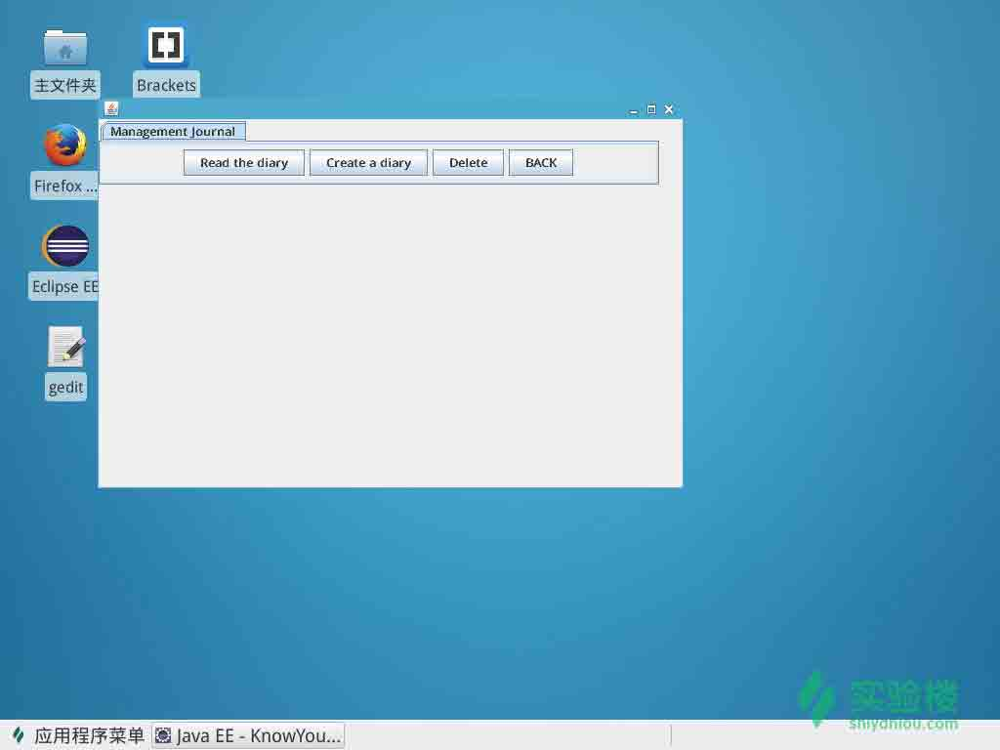
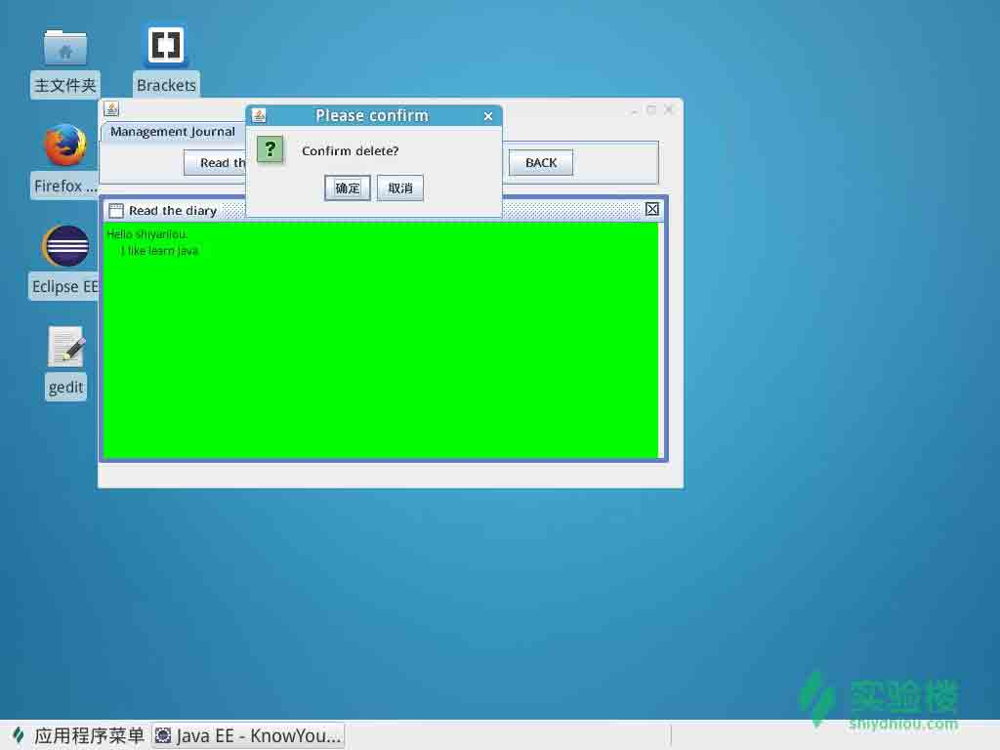

# 第 3 节 用户 GUI 界面设计

## 一、实验说明

### 1\. 本节目标

在本节中我们将完成用户界面的设计。这里我们采用的是内部窗体设计。使程序看起来更加漂亮，增强我们这款日记日记软件的可用性。

### 2\. 涉及知识

在本节中，我们除了使用常用的 swing 组件之外，还会有一些其他的组件来完善增加软件的功能，主要有：

1.  JFileChooser
2.  FileNameExtensionFilter
3.  JInternalFrame

## 二、效果截图

截图：



点击阅读按钮：


点击删除按钮：



点击新建按钮：


## 三、用户界面 UsersGUI.java

```java
 import java.awt.Color;
    import java.awt.EventQueue;
    import java.awt.Font;
    import java.awt.event.ActionEvent;
    import java.awt.event.ActionListener;
    import java.awt.event.MouseAdapter;
    import java.awt.event.MouseEvent;
    import java.io.File;

    import javax.swing.JButton;
    import javax.swing.JEditorPane;
    import javax.swing.JFileChooser;
    import javax.swing.JFrame;
    import javax.swing.JInternalFrame;
    import javax.swing.JLabel;
    import javax.swing.JOptionPane;
    import javax.swing.JPanel;
    import javax.swing.JTabbedPane;
    import javax.swing.JTextField;
    import javax.swing.JTextPane;
    import javax.swing.border.EmptyBorder;
    import com.Joke.util.Diary;
    import javax.swing.filechooser.FileNameExtensionFilter;

    public class UsersGUI extends JFrame {
        private JPanel contentPane;
        private JTextField textField;

        //文件选择组建，用于用户阅读日记和删除日记时选择文件。
        private JFileChooser chooser;

        /*每个注册用户所记录的日记都位于自己的文件夹下，pathname 用于保存用户的文件夹路径*/
        private static String pathname; 

        public static void init(String path) { //初始化方法
            pathname = path;
            EventQueue.invokeLater(new Runnable() {
                public void run() {
                    try {
                        UsersGUI frame = new UsersGUI();
                        frame.setVisible(true);
                    } catch (Exception e) {
                        e.printStackTrace();
                    }
                }
            });
        }

        /**
         * Create the frame.
         */
        public UsersGUI() {
            setDefaultCloseOperation(JFrame.EXIT_ON_CLOSE);
            setBounds(100, 100, 600, 400);
            contentPane = new JPanel();
            contentPane.setBorder(new EmptyBorder(5, 5, 5, 5));
            setContentPane(contentPane);
            contentPane.setLayout(null);

            JTabbedPane tabbedPane = new JTabbedPane(JTabbedPane.TOP);
            tabbedPane.setToolTipText("KonwYou");
            tabbedPane.setBounds(0, 0, 574, 67);
            contentPane.add(tabbedPane);

            final JPanel panel = new JPanel();
            tabbedPane.addTab("Management Journal", null, panel, null);

    chooser = new JFileChooser(".\\"+pathname);//初始化 JFileChooser，并设置默认目录为用户目录
    FileNameExtensionFilter filter=new FileNameExtensionFilter("Allowed","ky");//文件选择器，只允许选择.ky 文件
    chooser.setFileFilter(filter);//为文件设置选择器

       JButton readButton = new JButton("Read the diary");
    readButton.addMouseListener(new MouseAdapter() {
                @Override
       //阅读按钮鼠标事件，当用户点击时，将会创建一个新的内部窗体
        public void mouseClicked(MouseEvent e) {

            int value = chooser.showOpenDialog(panel);//判断用户是否选择了文件

        //内部窗体
       JInternalFrame internalFrame_Read = new JInternalFrame("Read the diary",    false, true, false, false);
    internalFrame_Read.setBounds(0, 77, 584, 275);
    contentPane.add(internalFrame_Read);
       internalFrame_Read.getContentPane().setLayout(null);
       JTextPane txtDiary = new JTextPane();
       txtDiary.setBounds(0, 0, 568, 246);
       internalFrame_Read.getContentPane().add(txtDiary);

    //JTextPane 没有 append 方法，所以使用 Document 来不断插入文本
    javax.swing.text.Document doc=txtDiary.getDocument();
       txtDiary.setBackground(Color.GREEN);//背景颜色为绿色
       txtDiary.setEditable(false);//设置为不可编辑

      //当 value 的值和 JFileChooser.APPROVE_OPTION 相等时，证明用户选择了文件
        if (value == JFileChooser.APPROVE_OPTION) {

        //得到用户选择的文件
        File file = chooser.getSelectedFile();

            if(file.exists())   //如果文件存在
                {
                    //Diary.read()方法读取日记;
                    //该方法将会在以后的课程中完成

                internalFrame_Read.setVisible(true);
                    }
                }
            }
        });
            panel.add(readButton);

        JButton addButton = new JButton("Create a diary");//新建按钮
    addButton.addMouseListener(new MouseAdapter() {
                @Override
       public void mouseClicked(MouseEvent e) {

                    //创建新建日记内部窗体
       final JInternalFrame internalFrame_Write = new JInternalFrame("Create a diary",false, true, false, false);

     internalFrame_Write.setBounds(0, 77, 584, 275);   
        contentPane.add(internalFrame_Write);
           internalFrame_Write.getContentPane().setLayout(null);

       textField = new JTextField();
       textField.setBounds(76, 0, 492, 21);
       internalFrame_Write.getContentPane().add(textField);
       textField.setColumns(10);

       JLabel label = new JLabel("Title");

       label.setFont(new Font("楷体", Font.PLAIN, 12));
           label.setBounds(46, 3, 52, 15);
           internalFrame_Write.getContentPane().add(label);

                    //日记编辑区
    final JEditorPane editorPane = new JEditorPane();
    editorPane.setBounds(0, 31, 568, 179);
    internalFrame_Write.getContentPane().add(editorPane);

       JButton save = new JButton("SAVE");//保存按钮
    save.setBounds(465, 213, 93, 23);
    save.addMouseListener(new MouseAdapter() {
       public void mouseClicked(MouseEvent e) {
        //获取标题
        String title = textField.getText()； 
        //获取内容
        String txt = editorPane.getText();
        //调用 Diary.addDiary()方法建立日记
        //该方法将会在以后的课程中完成

        //日记建立完成后隐藏当前窗口
        internalFrame_Write.setVisible(false);
            }
    });
        internalFrame_Write.getContentPane().add(save);
        internalFrame_Write.setVisible(true);

        }
      });

            panel.add(addButton);

            //删除按钮
            JButton delButton = new JButton("Delete");
            delButton.addActionListener(new ActionListener() {
                public void actionPerformed(ActionEvent e) {
                    File file=null;
                    int value=chooser.showOpenDialog(panel);
                    if(value==JFileChooser.APPROVE_OPTION)
                    {
                        file=chooser.getSelectedFile();

                    //删除确认框，用于确定用户是否确定删除      
                                                    int x=                                     JOptionPane.showConfirmDialog(panel,"Confirm delete?","Please confirm",JOptionPane.OK_CANCEL_OPTION,JOptionPane.QUESTION_MESSAGE);

        if(file.exists())
        {
                //当用户选择了 OK 时，调用删除方法
                if(x==JOptionPane.OK_OPTION)
                    {
                            file.delete();

                        //打印删除成功提示信息
                        JOptionPane.showMessageDialog(panel, "Delete Success!","information", JOptionPane.PLAIN_MESSAGE);
                    }

            }

        }

            }
    });
            panel.add(delButton);

          //返回按钮
            JButton back = new JButton("BACK");
            back.addActionListener(new ActionListener() {
                public void actionPerformed(ActionEvent e) {
                    IndexGUI.init();
                    setVisible(false);
                }
            });
            panel.add(back);
        }
    } 
```

以上就是用户界面的代码。

## 四、下节任务

在以后的章节中，我们将逐渐完成我们的功能类的设计，也是我们日记软件的重点部分。

1.  建立用户类
2.  用户 XML 文件设计