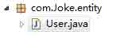
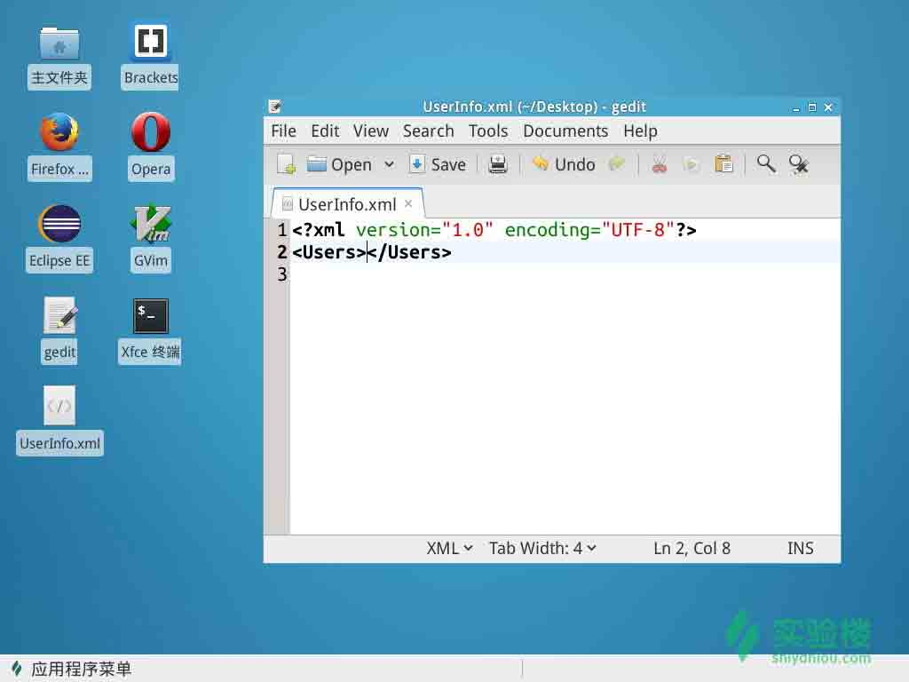

# 第 4 节 用户类及 XML 文件的设计

## 一、实验说明

### 1\. 本节目标

在以前的课程中我们完成了整个软件的 GUI 界面。接下的代码就是填充程序的功能，是它不再是一个空架子。而且接下来才是我们学习的重点，但也不难。

1.  用户类的设计
2.  建立用户 xml 文件

## 二、用户类

**首先**，咱们先分析用户所需要的属性，因为咱们这是一个简单的日记软件，只需要用户的姓名，登陆 ID 以及密码即可。

所需属性：

>1\. name

1.  ID
2.  passwd



```java
 package com.Joke.entity;
    /*用户名、ID、密码*/
    public class User {

        private String ID;  //登陆 ID
        private String name; //姓名
        private String passwd;//密码

        public String getName() {
            return name;
        }
        public void setID(String iD) {
            ID = iD;
        }
        public String getID() {
            return ID;
        }
        public void setName(String name) {
            this.name = name;
        }
        public String getPasswd() {
            return passwd;
        }
        public void setPasswd(String passwd) {
            this.passwd = passwd;
        }

    } 
```

是不是非常简单呢？没错，这样我们的用户类就已经完成了。

## 三、XML 文档

**接下来**，咱们需要对应着 User 类来设计咱们的 xml 文档，来持久化存处用户信息，当然，也是非常简单。

**注：** 什么是 XML ?

*   XML 指可扩展标记语言（EXtensible Markup Language）
*   XML 是一种标记语言，很类似 HTML
*   XML 的设计宗旨是传输数据，而非显示数据
*   XML 标签没有被预定义。您需要自行定义标签。
*   XML 被设计为具有自我描述性。
*   XML 是 W3C 的推荐标准

`UserInfo.xml` 如图：



以上就完成了我们保存用户信息的 xml 文档。

## 四、下节任务

*   JDOM 解析 xml 文档实现注册用户
*   JDOM 读取 xml 文档中用户信息