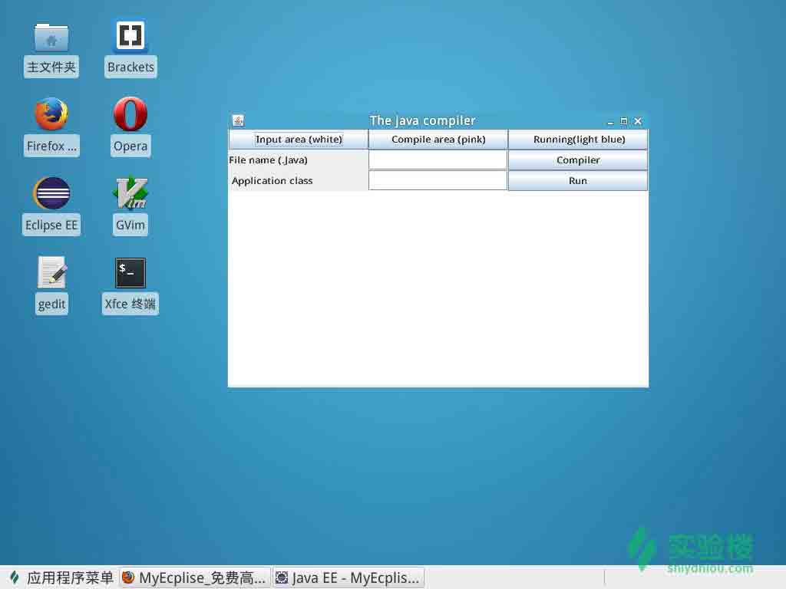
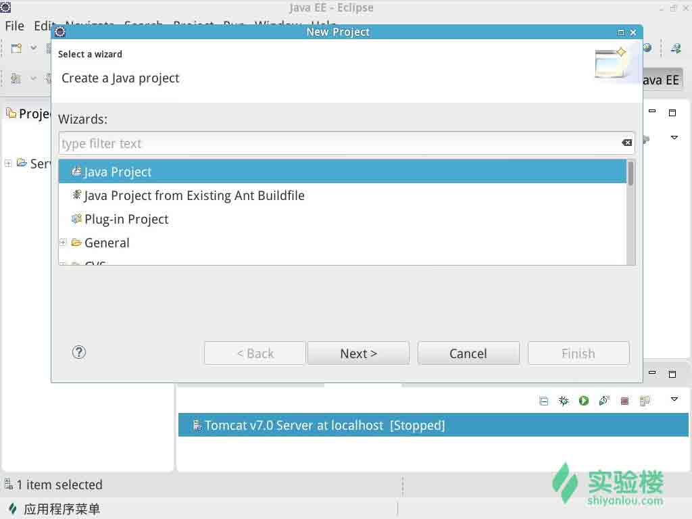

# 第 1 节 制作 GUI 界面

## 一、实验说明

### 1\. 环境登录

无需密码自动登录，系统用户名 shiyanlou，该用户具备 sudo 的权限，可以执行安装软件等管理员操作。

### 2\. 环境介绍

本实验环境采用 Ubuntu Linux 桌面环境，实验中会用到桌面上的程序：

*   Xfce 终端: Linux 命令行终端，打开后会进入 Bash 环境，可以使用 Linux 命令
*   Firefox 及 Opera：浏览器，可以用在需要前端界面的课程里，只需要打开环境里写的 HTML/JS 页面即可
*   gvim：非常好用的 Vim 编辑器，最简单的用法可以参考课程 [Vim 编辑器](https://www.shiyanlou.com/courses/2)
*   其他编辑器：如果 Vim 不熟悉，可以使用 gedit 或 brackets，其中 brackets 比较适合开发前端代码
*   Eclipse：Eclipse 是著名的跨平台的自由集成开发环境（IDE）。主要用来 Java 语言开发，但是目前亦有人通过插件使其作为 C++ 和 Python 等语言的开发工具

### 3\. 环境使用

使用编辑器输入实验所需的代码及文件，使用命令行终端运行所需命令进行操作。

“实验记录”页面可以在“我的主页”中查看，每次实验的截图及笔记，以及有效学习时间（指的是在实验桌面内操作的时间，如果没有操作，系统会记录为发呆时间）。这些都是您在实验楼学习的真实性证明。

### 4\. 项目介绍

相信很多学过 Java 的同学都是首先从记事本开始写起，然后就开始使用 Eclipse。而今天，咱们就制作一个咱们自己的 Java 编辑器，它拥有编辑和编译的功能。是不是很给力呢？项目非常的简单，只要有一点 Java 基础的同学都会看懂的！

[源代码下载](http://pan.baidu.com/s/1dDjJOaP)

涉及知识：

1.  IO 流的操作（重点）
2.  Runtime 类 （重点）
3.  线程的使用 （重点）
4.  GUI 布局 （不重要，简单理解即可）

项目效果截图：



## 二、新建项目

首先我们打开 Eclipse。




我们在 Eclipse 中新建一个工程，取名就叫 MyEcplise 吧。

在工程下分为两个类，一个是测试类，叫 Main。而另一个就是我们的主要方法类 FileWindow。


**注：关于代码的解释都写在了注释中，这里就不在文档中叙述**

**FileWindow 类需的包（大家如果使用 Eclipse 可以自动导入）**

```java
import java.awt.CardLayout;
import java.awt.Color;
import java.awt.GridLayout;
import java.awt.event.ActionEvent;
import java.awt.event.ActionListener;
import java.io.BufferedInputStream;
import java.io.File;
import java.io.FileOutputStream;
import java.io.InputStream;

import javax.swing.JButton;
import javax.swing.JFrame;
import javax.swing.JLabel;
import javax.swing.JPanel;
import javax.swing.JTextArea;
import javax.swing.JTextField;` 
```

## 三、界面的实现

```java
 @SuppressWarnings("serial")  //压制信息，不会的同学可以不理会。
    public class FileWindow extends JFrame implements ActionListener, Runnable {

    /*注意：因为实现了 ActionListener 和 Runnable 接口，所以必须要实现这两个接口的方法。这里我们先把这两个方法简单实现以下。下节课将彻底完成这两个方法。*/

    Thread compiler = null;
    Thread run_prom = null;
    boolean bn = true;
    CardLayout mycard;  //声明布局，以后会用到
    File file_saved = null;
    JButton button_input_txt,   //按钮的定义
            button_compiler_text,
            button_compiler,
            button_run_prom,
            button_see_doswin;

    JPanel p = new JPanel();
    JTextArea input_text = new JTextArea(); // 程序输入区
    JTextArea compiler_text = new JTextArea();// 编译错误显示区
    JTextArea dos_out_text = new JTextArea();// 程序的输出信息

    JTextField input_file_name_text = new JTextField();
    JTextField run_file_name_text = new JTextField();

    public FileWindow() {
        // TODO Auto-generated constructor stub
        super("Java 语言编译器");
        mycard = new CardLayout();
        compiler=new Thread(this);
        run_prom=new Thread(this);
        button_input_txt=new JButton("程序输入区（白色）");
        button_compiler_text=new JButton("编译结果区（粉红色）");
        button_see_doswin=new JButton("程序运行结果（浅蓝色）");
        button_compiler=new JButton("编译程序");
        button_run_prom=new JButton("运行程序");

        p.setLayout(mycard);//设置卡片布局
        p.add("input",input_text);//定义卡片名称
        p.add("compiler", compiler_text);
        p.add("dos",dos_out_text);
        add(p,"Center");

        compiler_text.setBackground(Color.pink); //设置颜色
        dos_out_text.setBackground(Color.cyan);
        JPanel p1=new JPanel();

        p1.setLayout(new GridLayout(3, 3)); //设置表格布局
        //添加组件
        p1.add(button_input_txt);
        p1.add(button_compiler_text);
        p1.add(button_see_doswin);
        p1.add(new JLabel("输入编译文件名（.java）："));
        p1.add(input_file_name_text);
        p1.add(button_compiler);
        p1.add(new JLabel("输入应用程序主类名"));
        p1.add(run_file_name_text);
        p1.add(button_run_prom);
        add(p1,"North");

        //定义事件
        button_input_txt.addActionListener(this);
        button_compiler.addActionListener(this);
        button_compiler_text.addActionListener(this);
        button_run_prom.addActionListener(this);
        button_see_doswin.addActionListener(this);

    }

    public void actionPerformed(ActionEvent e)
    {
         //实现方法

    }

    @Override
    public void run() {
        //实现方法
    }

    } 
```

到此，我们的 GUI 界面就算做好了！

## 四、测试类

下面，我们赶紧做个测试类，测试一下我们的界面。

main.java：

```java
 import java.awt.event.WindowAdapter;
    import java.awt.event.WindowEvent;
    public class Main {

        public static void main(String[] args) {
            // TODO Auto-generated method stub
            FileWindow win=new FileWindow();
            win.pack();
            win.addWindowListener(new WindowAdapter() {
                public void windowClosing(WindowEvent e)
                {
                    System.exit(0);
                }
            });

            win.setBounds(200, 180,550,360);
            win.setVisible(true);
        }

    } 
```

界面和测试类就完成了。

## 五、下节内容

下节课我们将实现遗留的未实现的功能。主要包括两个方法：

*   public void actionPerformed(ActionEvent e)
*   public void run()