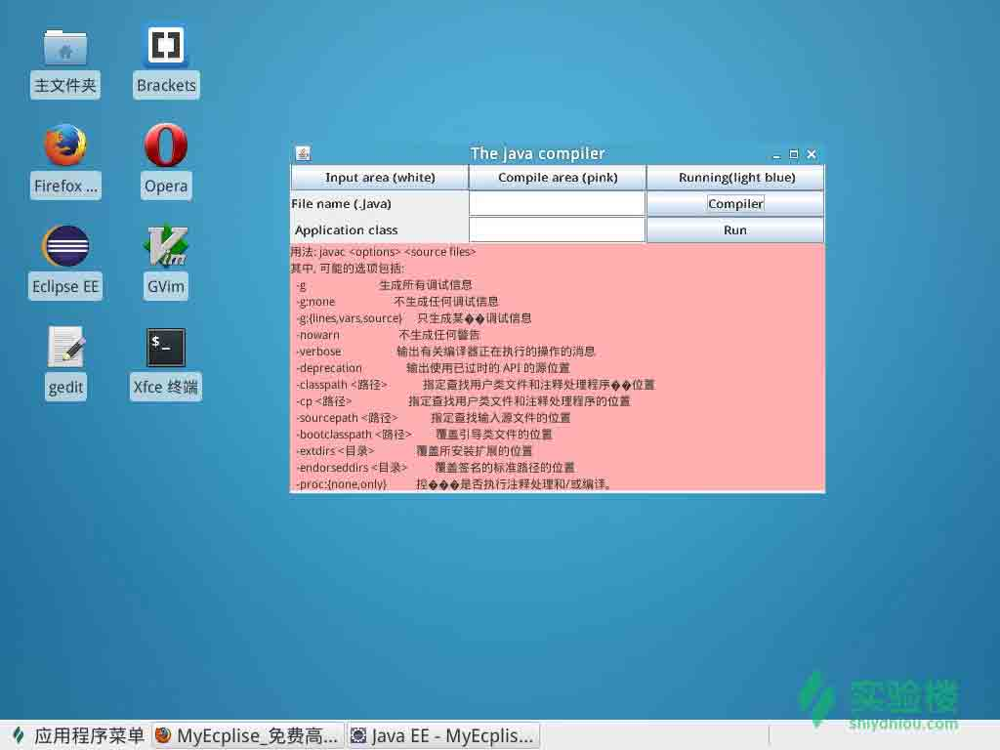
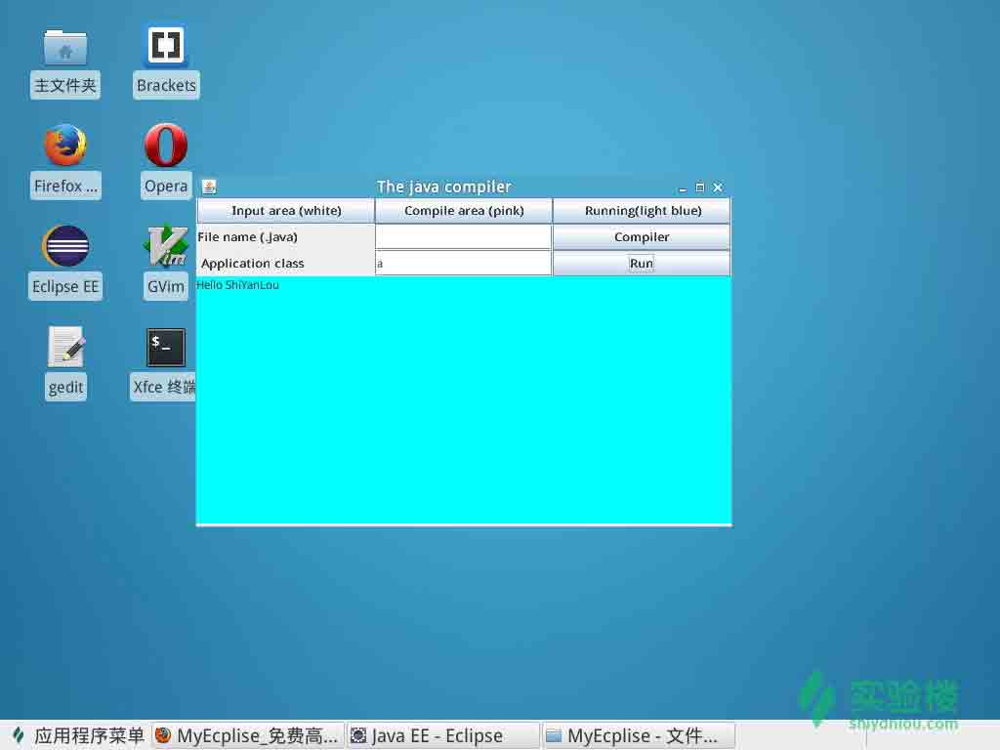

# 第 2 节 实现功能

## 一、实验介绍

### 1\. 上节回顾

相信很多同学都做出了上节咱们的界面，可是发现点击按钮没有效果，那是因为咱们还有两个方法没有实现。今天，咱们就来实现这两个方法，然整个项目就算完成了。

*   public void actionPerformed(ActionEvent e) //这个方法是事件方法，只有实现它，咱们点击按钮才有效果

*   public void run()
    //线程必须实现的方法，我相信不用多说。

### 2\. 主要知识点

通过这个小项目，咱们主要学习掌握：

*   IO 流的使用
*   Runtime 类的使用
*   线程相关的运用

## 二、actionPerformed 方法

首先咱们实现 public void actionPerformed(ActionEvent e) 这个方法。

```java
 public void actionPerformed(ActionEvent e)
        {
            if(e.getSource()==button_input_txt)
            {
                mycard.show(p,"input");
            }
            else if(e.getSource()==button_compiler_text)
            {
                mycard.show(p,"compiler");
            }
            else if(e.getSource()==button_see_doswin)
            {
                mycard.show(p,"dos");
            }
            else if(e.getSource()==button_compiler)
            {
                if(!(compiler.isAlive()))
                {
                    compiler=new Thread(this);
                }
                try {
                    compiler.start();

                } catch (Exception e2) {
                    // TODO: handle exception
                    e2.printStackTrace();
                }

                mycard.show(p,"compiler");

            }
            else if(e.getSource()==button_run_prom)
            {
                if(!(run_prom.isAlive()))
                {
                    run_prom=new Thread(this);
                }
                try {
                    run_prom.start();
                } catch (Exception e2) {
                    // TODO: handle exception
                    e2.printStackTrace();
                }
                mycard.show(p,"dos");
            }

        } 
```

以上的代码就是通过比较来判断需要处理哪些事件。

## 三、run 方法

然后就剩一个 run() 方法，也是最重要的一个方法。

```java
 public void run() {
             //TODO Auto-generated method stub
            if(Thread.currentThread()==compiler)
            {
            compiler_text.setText(null);
            String temp=input_text.getText().trim();
            byte [] buffer=temp.getBytes();
            int b=buffer.length;
            String file_name=null;
       file_name=input_file_name_text.getText().trim();

      try {
    file_saved=new File(file_name);
    FileOutputStream writefile=null;
    writefile=new FileOutputStream(file_saved);
    writefile.write(buffer, 0, b);
    writefile.close();
            } catch (Exception e) {
                    // TODO: handle exception
                    System.out.println("ERROR");
                }
    try {

    //获得该进程的错误流，才可以知道运行结果到底是失败了还是成功。
     Runtime rt=Runtime.getRuntime();
       InputStream in=rt.exec("javac "+file_name).getErrorStream(); //通过 Runtime 调用 javac 命令。注意：“javac ”这个字符串是有一个空格的！！

        BufferedInputStream bufIn=new BufferedInputStream(in);

        byte[] shuzu=new byte[100];
        int n=0;
        boolean flag=true;

        //输入错误信息        
    while((n=bufIn.read(shuzu, 0,shuzu.length))!=-1)
        {
            String s=null;
              s=new String(shuzu,0,n);
            compiler_text.append(s);
            if(s!=null)
                        {
                            flag=false;
                        }
            }
                    //判断是否编译成功
                    if(flag)
                    {
                        compiler_text.append("Compile Succeed!");
                    }
                } catch (Exception e) {
                    // TODO: handle exception
                }
            }
    else if(Thread.currentThread()==run_prom)
        {
            //运行文件，并将结果输出到 dos_out_text

        dos_out_text.setText(null);

        try {
              Runtime rt=Runtime.getRuntime();
    String path=run_file_name_text.getText().trim();
    Process stream=rt.exec("java "+path);//调用 java 命令

    InputStream in=stream.getInputStream();
                    BufferedInputStream bisErr=new BufferedInputStream(stream.getErrorStream());
                    BufferedInputStream bisIn=new BufferedInputStream(in);

    byte[] buf=new byte[150];
    byte[] err_buf=new byte[150];

    @SuppressWarnings("unused")
    int m=0;
    @SuppressWarnings("unused")
    int i=0;
    String s=null;
    String err=null;

    //打印编译信息及错误信息
    while((m=bisIn.read(buf, 0, 150))!=-1)
                    {
                        s=new String(buf,0,150);
                        dos_out_text.append(s);
                    }
                                  while((i=bisErr.read(err_buf))!=-1)
                    {
                    err=new String(err_buf,0,150);
                    dos_out_text.append(err);
                    }
        }
         catch (Exception e) {
                    // TODO: handle exception
                    }
        }
     } 
```

OK，大功告成！

## 四、项目效果截图

点击编译按钮会出现错误信息，证明距离成功不远了。



运行按钮错误：


写一个简单的测试小程序吧！代码如下：

```java
 class a
    {
        public static void main(String [] args)
        {
            System.out.println("Hello ShiYanLou");
        }
    } 
```

运行截图：



## 五、作业思考

考虑如何丰富其功能，例如 “代码高亮”、“代码自动补全” 等等。这些功能有的比较难，不一定要实现，但要勤于思考。