# 第 1 节 Java 实现记事本

## 一、实验说明

本实验将主要讲解如何使用 Java 语言编写一个记事本应用，涉及到 Swing 界面编程、文件读写等知识点。

### 1\. 环境登录

无需密码自动登录，系统用户名 shiyanlou

### 2\. 环境介绍

本实验环境采用带桌面的 Ubuntu Linux 环境，实验中会用到桌面上的程序： >Eclipse EE：高端、大气、上档次的开放源代码的、基于 Java 的可扩展开发平台。

### 3\. 环境使用

实验报告可以在个人主页中查看，其中含有每次实验的截图及笔记，以及每次实验的有效学习时间（指的是在实验桌面内操作的时间，如果没有操作，系统会记录为发呆时间）。这些都是您学习的真实性证明。

## 二、项目介绍

伙伴们，我们又见面啦！是不是很 happy？欢迎来到实验楼之**Java 实现记事本**的课程，依照惯例，在正式开始项目之前，还是给大伙奉上小小一段笑话： >“某程序员退休后决定练习书法，于是重金购买文房四宝。一日，饭后突生雅兴，一番研墨拟纸，并点上上好檀香。定神片刻，泼墨挥毫，郑重地写下一行字：hello world！hello 实验楼！”

【小编默默请问你：你初学编程的时候也是这样吗？】

好啦！一起来瞧瞧我们即将到来的项目效果图吧！

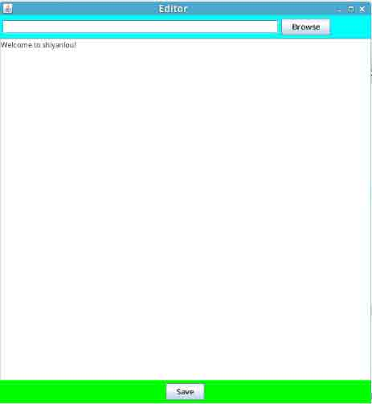

是不是高大上！看着别醉了呀！你很快就可以把它给收拾了！

## 三、项目实战

### 第一步：磨刀篇

要砍柴，需磨刀！ 看到屏幕右边的虚拟系统没？是不是感觉实验楼很高端！ 在 Java 项目实际开发中，我们可选择的开发工具有很多，有记事本、EditPlus、MyEclipse、Eclipse 等等，这里就不一一例举了，而此次我们的小实验选择的是 Eclipse 软件。 看到 Eclipse EE 软件没？


在使用 Eclipse EE 之前，我先给大家简单介绍一下： >Eclipse 是一个开放源代码的、基于 Java 的可扩展开发平台。就其本身而言，它只是一个框架和一组服务，用于通过插件组件构建开发环境。幸运的是，Eclipse 附带了一个标准的插件集，包括 Java 开发工具（Java Development Kit，JDK）。

**说明:**如果想更多的了解 Eclipse 的介绍，可[点击这里](http://baike.baidu.com/subview/23576/9374802.htm)。

初步了解 Eclipse 后，我们就开始实验吧！

* * *

**首先我们必须得创建一个 Java 项目：**

双击打开桌面上的 Eclipse EE，启动时弹出的 workspace（工作目录）对话框直接使用默认值，确认即可。

然后我们就可以创建一个 java 项目啦！

>选择`File->New->Other`

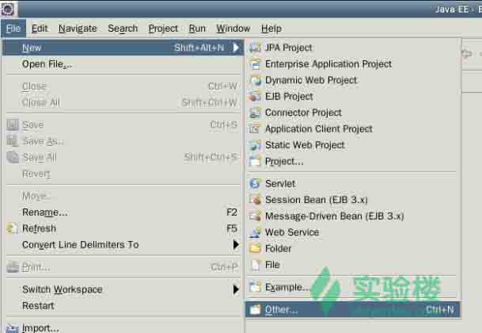

>在弹出的对话框中，项目类型请选择`Java Project`。

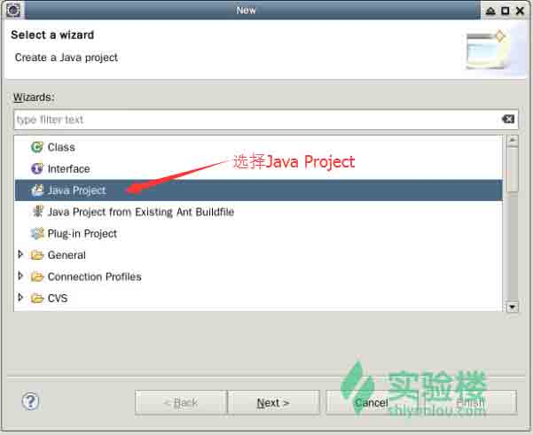

>在新 java 项目创建对话框中，将项目命名为`FileEditor`然后点击`Finish`按钮。

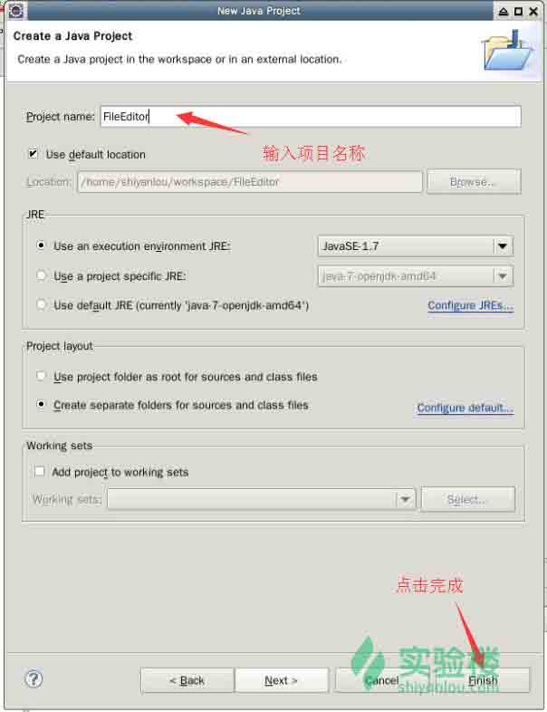

>如果出现下面这样的对话框，请直接点击`Yes`即可。

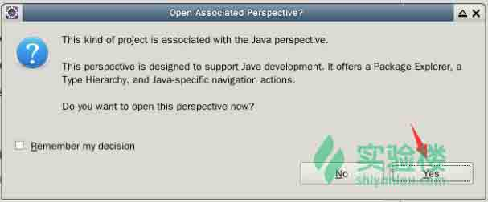

看到没？项目轻而易举的就创建成功啦！

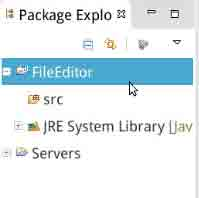

**接下来新建包和类：**

接下来，我们得在`src`文件夹下创建一个名为`com.shiyanlou.fileeditor`的包:

> 在菜单中选择`New->Package`。

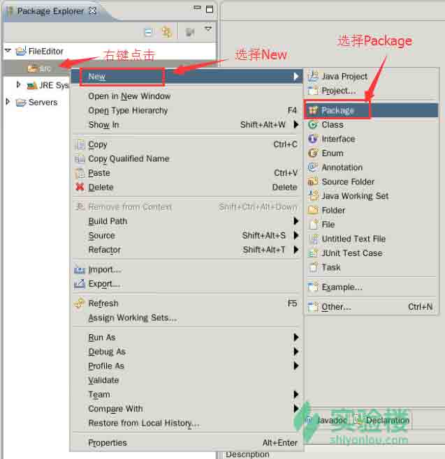

> 弹出的对话框中`Name` 填写：`com.shiyanlou.fileeditor`，最后点击`Finish`按钮。

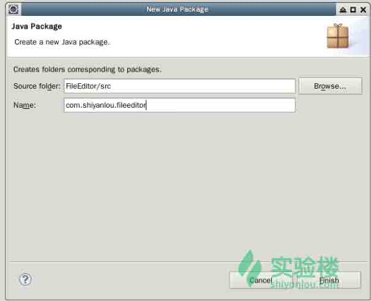

>再在包下创建一个名为`FileEditor`的 Class 文件: 右键点击包，在菜单中选择`New->Class`。

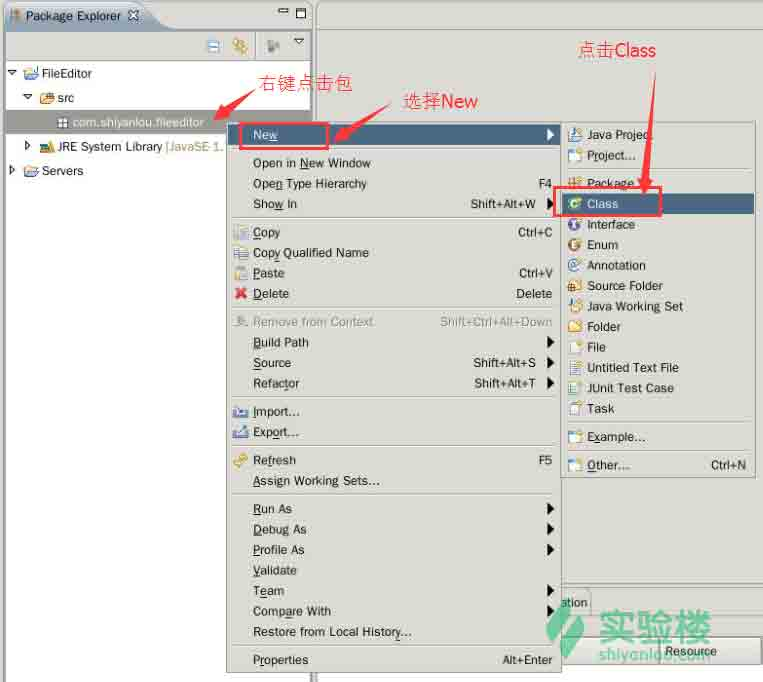

>`Name`填写：`FileEditor`，最后点击`Finish`按钮。

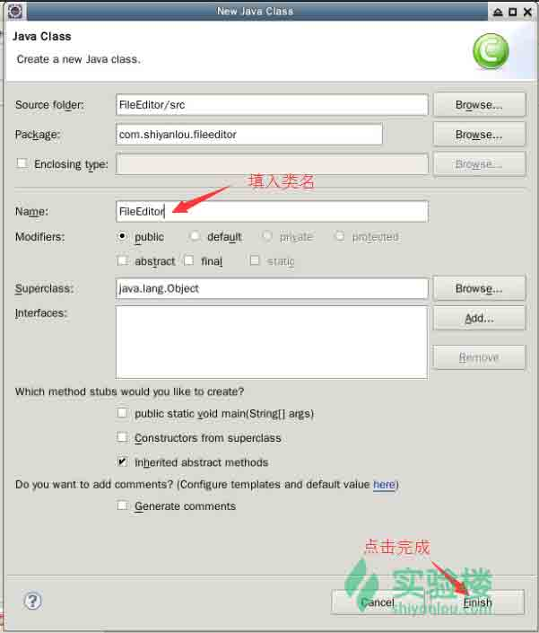

完成这一步后的项目结构如下图：

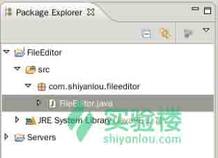

到这里，我们的斧头已经磨好啦，下一步我们就得进山砍柴啦，伙伴们，要拼了命的去砍柴呀！

### 第二步：砍柴篇

一人站在深山老林，一股寒风袭来，呼呼~~。忽然远处传来声音：“小家伙，快砍柴吧，早点抱柴回家烤火吧。” >【小编提醒你：别只顾着埋头敲代码，要多看代码后的注释，理解代码的含义才是最重要的哦！】

**接着我们就得在刚创建好的 FileEditor Class 文件中编写所需的 Java 代码啦。**

```java
//包名，一般都会自动生成
package com.shiyanlou.fileeditor;

//导入我们所需要的类
import java.awt.*;  
import java.awt.event.*;  
import java.io.*;  
import javax.swing.*;

public class FileEditor extends JFrame { 

    //定义一个私有的文件的绝对路径文本域对象
    private JTextField selectField;  

    //定义一个私有的编辑区对象
    private JTextArea editArea;      

    //定义一个私有的“保存”按钮对象
    private JButton saveBtn;         

    //定义一个私有的“浏览”按钮对象 
    private JButton openFileBtn;    

    //定义一个私有的记录目录层次数，其初始值为 0 
    private int level = 0;          

    public FileEditor() {  
        this.init();
    }  

    private void init() {  

        //设置标题为 Editor 
        this.setTitle("Editor");

        //设置组件的大小
        this.setBounds(300, 50, 600, 650);  

        /* 
         * 面板的北边，即路径输入域、浏览按钮 
         */ 

        //创建一个选择框对象
        selectField = new JTextField(40); 

        //创建一个按钮对象
        openFileBtn = new JButton("Browse");  

        //为刚创建的按钮添加监听事件
        openFileBtn.addActionListener(new ActionListener() {  
            public void actionPerformed(ActionEvent ae) {  
                FileEditor.this.level = 0;  
                String path = selectField.getText();  

                // 浏览目录或者文件 
                openDirOrFile(path.replaceAll("//", "\\\\"));  

                //String 的 replaceAll()方法，是采用正则表达式规则去匹配的。
                // 参数中的“//”在 java 语言中被解析为“/”，而“\\\\”在 java 语言中被解析成“\\”，还要经正则表达式转换为“\”。 
            }  
        });  

        //新建一个流布局，并且左对齐的面板
        JPanel upPanel = new JPanel(new FlowLayout(FlowLayout.LEFT));  

        //设置画板的背景颜色
        upPanel.setBackground(Color.CYAN);  

        //将选择框加入画板中
        upPanel.add(selectField);

        //将按钮加入画板中
        upPanel.add(openFileBtn); 

        //将面板放在北边区域
        this.add(upPanel, BorderLayout.NORTH);  

        /* 
         * 创建文本编辑区，并加入到整个布局的中间区域 
         */ 
        editArea = new JTextArea();  
        ScrollPane scollPanel = new ScrollPane(ScrollPane.SCROLLBARS_AS_NEEDED);  
        scollPanel.add(editArea);  
        this.add(scollPanel, BorderLayout.CENTER);  

        /* 
         * 创建保存按钮，并为按钮添加监听事件 
         */ 
        saveBtn = new JButton("Save");  
        saveBtn.addActionListener(new ActionListener() {  
            public void actionPerformed(ActionEvent ae) {  
                // 保存 
                saveFile();  
            }
        }); 

        JPanel southPanel = new JPanel();  
        southPanel.setBackground(Color.green);  
        southPanel.add(saveBtn);  
        this.add(southPanel, BorderLayout.SOUTH);  
        this.setDefaultCloseOperation(JFrame.EXIT_ON_CLOSE);  
        this.setVisible(true);  
    }  

    /* 
     * 保存文件 
     */ 
    private void saveFile() {  
        FileDialog fd = new FileDialog(this, "Save File");  

        //设置需要保存文件的后缀
        fd.setFile("untitled.txt");  

        //设置为“保存”模式 
        fd.setMode(FileDialog.SAVE);  
        fd.setVisible(true);  

        //获取文件名 
        String fileName = fd.getFile();  

        //获取对话框的当前目录 
        String dir = fd.getDirectory(); 

        //根据目录名、文件名创建一个文件，即要保存的目标文件 
        File newFile = new File(dir + File.separator + fileName);  
        PrintWriter pw = null;  
        try {  
            pw = new PrintWriter(new OutputStreamWriter(new FileOutputStream(  
                    newFile)));  

            String str = editArea.getText();  
            pw.println(str);  
            pw.flush();  
        } catch (IOException e) {  
            e.printStackTrace();  
        } finally {  
            pw.close();  
        }  
    }  

    /* 
     * 打开目录或文件 
     */ 
    private void openDirOrFile(String absolutePath) { 

        //absolutePath:指定目录或文件的绝对路径名 
        File file = new File(absolutePath);  

        //判断文件或目录是否存在
        if (!(file.exists())) {  
            editArea.setText("The file does not exist!");  

        //判断是否是一个目录
        } else if (file.isDirectory()) {  
            editArea.setText(null);  
            showDir(file);  

        //判断是否是一个文件
        } else if (file.isFile()) {  
            try {  
                FileInputStream fis = new FileInputStream(file);  
                BufferedReader br = new BufferedReader(new InputStreamReader(  
                        fis));  
                String str = null;  
                editArea.setText(null);  
                while ((str = br.readLine()) != null) {  
                    editArea.append(str + "\r\n");  
                }  
                br.close();  
            } catch (IOException e) {  
                e.printStackTrace();  
            }  
        }  
    }  

    /* 
     * 浏览目录,建立树形图 
     */ 
    private void showDir(File directory)
    {
        File[] files = directory.listFiles();
        int len = files.length;
        for(int i = 0; i < len; i++)
        {
            if(files[i].isDirectory())
            {
                for(int j = 0; j < this.level; j++)
                {
                    editArea.append("    ");
                }
                editArea.append("|-- "+ files[i].getName() + " (Folder)\r\n");
                this.level++;
                showDir(files[i]);
                this.level--;
            }
            else if(files[i].isFile())
            {
                for(int j = 0; j < this.level; j++)
                {
                    editArea.append("    ");
                }
                editArea.append("|-- " + files[i].getAbsolutePath() + "\r\n");
            }
        }
    }

    /* 
     * 测试，运行整个程序测试效果 
     */ 
    public static void main(String[] args) {  
        new FileEditor();  
    }  
} 
```

到此，我们所需的代码已经编写完成。 >抱着砍好的柴向家的方向飞奔而去。。。

### 第三步：烤火篇

>气喘吁吁到家，默念道：“终于可以安心的烤火啦！吓死俺了”

烤火绝招：保存项目后，点击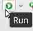运行，瞧，火不就出来了吗？我们在输入框中输入一段文字。

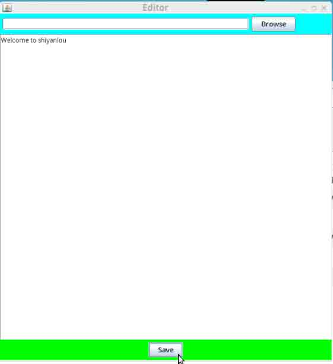

然后点击 `save` 按钮，出现下面这个对话框，`Name` 填写 `shiyanlou.txt`，`Places` 选择 Desktop。

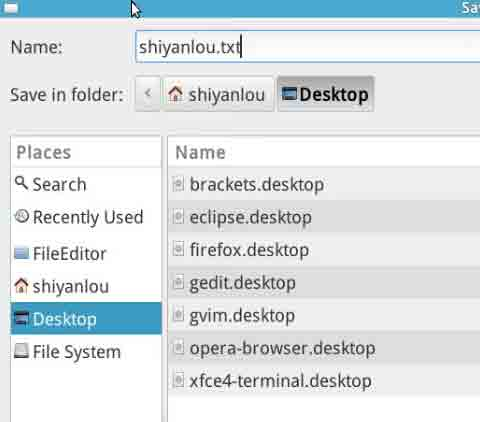

回车即可保存成功。


我们要是想查看刚刚保存的文件内容，只需在窗口最上方的文本框中填入文件的完整路径，然后点击`Browse`按钮即可。如果遇到文件不存在的情况，下方则会显示相关的错误信息。

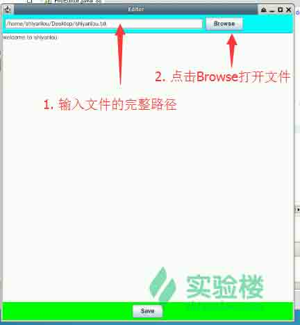

你刚编辑的记事本内容不就展现在你眼前了！

**到这里，我们整个实验就算结束了，其实涉及到的编程知识都是比较基础的，所以小编建议初学者学习编程，一定要把基础打好哦，并且还要勤动手、动脑。**

>【小编结语：感谢你认真学习了本教程，如果你觉得此教程不错，记得一定要和你的好友一起分享哦！如果您在学习过程中有任何的疑问或者建议，欢迎在实验楼的问答版块与我们交流。】

## 参考资料

*   [replaceAll、replaceFirst 使用需要注意的问题](http://blog.csdn.net/lws0888/article/details/6525311)