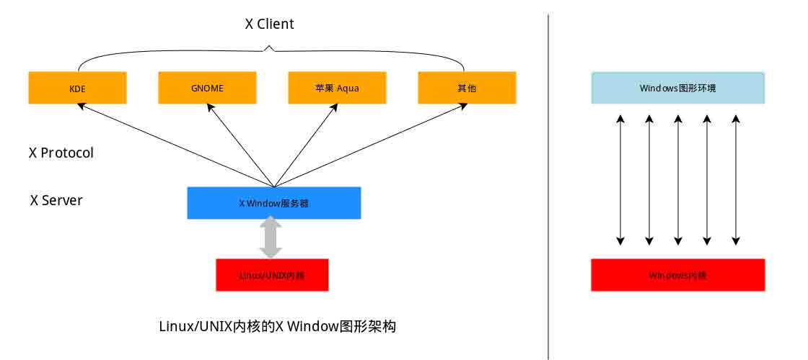
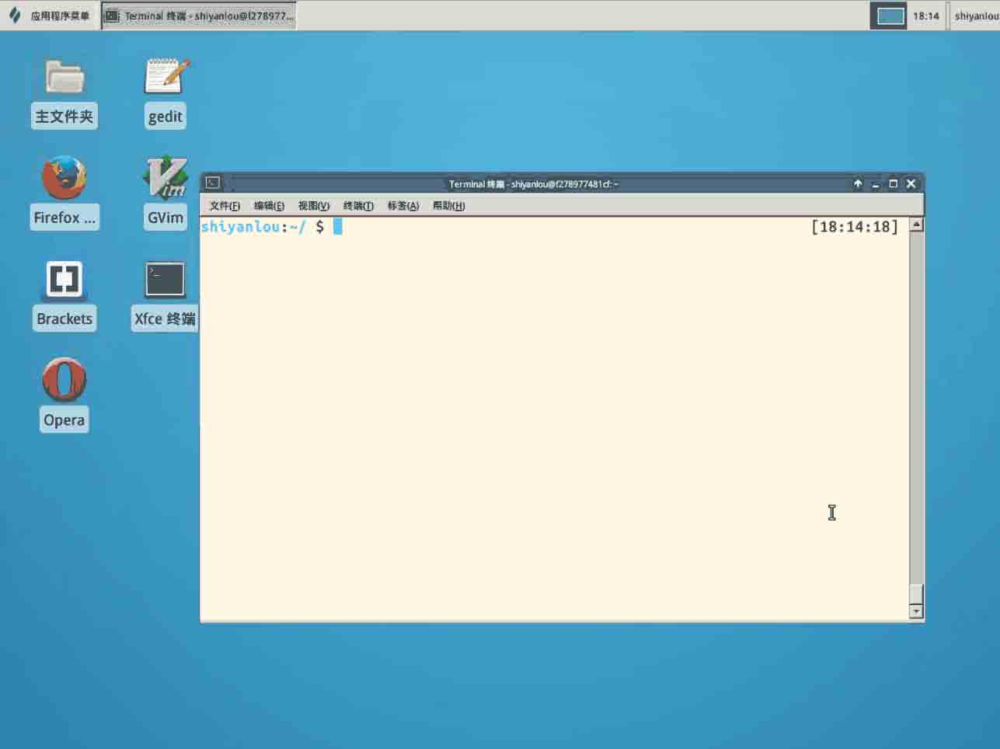
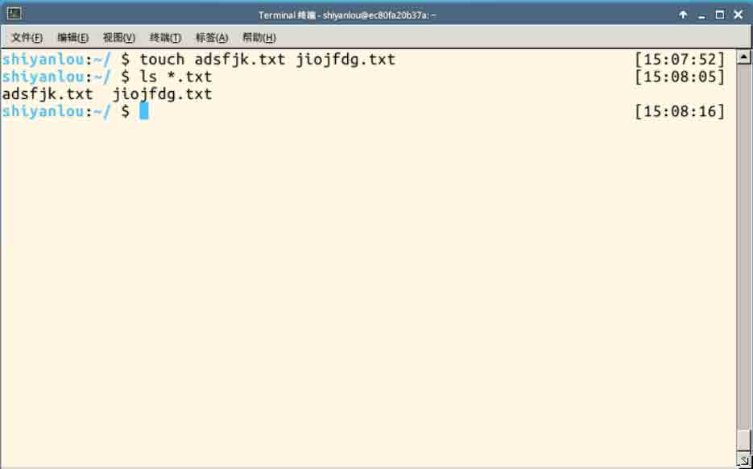
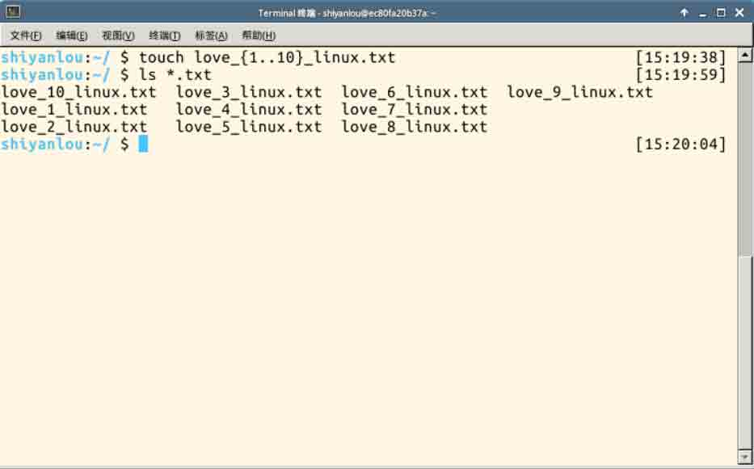
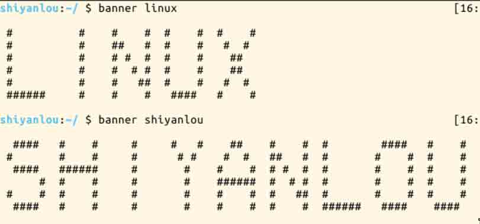

# 第 2 节 基本概念及操作

## 实验介绍

本节实验主要有：

1、实验楼环境介绍 2、常用 Shell 命令及快捷键 3、Linux 使用小技巧

## 一、Linux 桌面环境介绍

相对于现在的 Windows 系统，UNIX/Linux 本身是没有图形界面的，我们通常在 Unix/Linux 发行版上看到的图形界面实际都只是运行在 Linux 系统之上的一套软件，类似 Windows95 之前的 Windows 的图形界面实则也只是运行在 DOS 环境的一套软件。而 Linux 上的这套软件以前是 XFree86，现在则是 xorg（X.Org），而这套软件又是通过 X 窗口系统（X Window System，也常被称为 X11 或 X）实现的，X 本身只是工具包及架构协议，而 xorg 便是 X 架构规范的一个实现体，也就是说它是实现了 X 协议规范的一个提供图形用户界面服务的服务器，就像实现了 http 协议提供 web 服务的 Apache。如果只有服务器也是不能实现一个完整的桌面环境的，当然还需要一个客户端，我们称为 X Client，像如下几个大家熟知也最流行的实现了客户端功能的桌面环境**KDE**，**GNOME**，**XFCE**，**LXDE**，其中就有你看到的，实验楼目前使用的 **XFCE** 桌面环境，部分老用户可能可以回想起，实验楼之前使用的环境是 **LXDE**。这也意味着在 Linux 上你可以自己选择安装不同的桌面环境，甚至可以定制自己的专属桌面。



这里讲这么多，主要是为了帮助你更好理解 Linux 的桌面环境是一个怎样的概念，以及它跟 Windows 操作系统桌面的差异，实际它们之间是有着本质的差别的，希望清楚这些内容之后可以让你忽略那些体验上的差异，专心把精力放到 Linux 系统本身或者你正准备学习的某一门技术之上，这门实验课后面的内容和实验楼的其他课程便是为了帮助你实现以上两个目标的。

## 二、Linux 桌面环境的使用

如果你对当前实验桌面环境（xfce）的使用有任何困难，建议你先学习[实验楼入门基础课程](http://shiyanlou.com/courses/63)，对于其它桌面环境的使用，不在本课程的范围之类，有兴趣的用户可以在自己计算机中安装完整的 Linux 发行版或其 Live CD 体验。

## 三、Linux 终端

### 1.Terminal（终端）

通常在我们使用 Linux 时，我们并不是直接与系统打交道，而是通过一个叫做 Shell 的中间程序来完成的，在图形界面下为了实现让我们在一个窗口中完成接受用户输入和显示输出，Linux 系统还提供了一个叫做终端模拟器的程序（Terminal），下面几个比较常见的终端模拟器，例如 gnome-terminal，kconsole，xterm，rxvt，kvt，nxterm 和 eterm，目前我们的实验中的终端程序是 xfce 桌面环境自带的 xfce-terminal。不过要注意的是这里所说的终端（Terminal）和控制台（Console）是有区别的。


终端本质上是对应着 Linux 上的 /dev/tty 设备，Linux 的多用户登陆就是通过不同的 /dev/tty 设备完成的，Linux 默认提供了 6 个纯命令行界面的 “terminal”（准确的说这里应该是 6 个 virtual consoles）来让用户登录，在物理机系统上你可以通过使用`[Ctrl]`+`[Alt]`+`[F1]～[F6]`进行切换，不过在我们的在线实验环境中可能无法切换，因为特殊功能按键会被你主机系统劫持。当你切换到其中一个终端后想要切换回图形界面，你可以按下`[Ctrl]`+`[Alt]`+`[F7]`来完成。

### 2.Shell

通常在图形界面中对实际体验带来差异的不是上述的不同发行版的各种终端模拟器，而大都是这个 Shell（壳），有壳就有核，这里的核就是指的 UNIX/Linux 内核，Shell 是指“提供给使用者使用界面”的软件（命令解析器），类似于 DOS 下的 command（命令行）和后来的 cmd.exe。普通意义上的 Shell 就是可以接受用户输入命令的程序。它之所以被称作 Shell 是因为它隐藏了操作系统底层的细节。同样的 Unix/Linux 下的图形用户界面 GNOME 和 KDE，有时也被叫做“虚拟 shell”或“图形 shell”。

Unix/Linux 操作系统下的 Shell 既是用户交互的界面，也是控制系统的脚本语言。当然在这点也有别于 Windows 下的命令行，虽然也提供了很简单的控制语句。在 Windows 操作系统下，可能有些用户从来都不会直接的使用 Shell，然而在 UNIX 系列操作系统下，Shell 仍然是控制系统启动、X11 启动和很多其他实用工具的脚本解释程序。

在 UNIX/Linux 中比较流行的常见的 Shell 有 bash，zsh，ksh，csh 等等，Ubuntu 终端默认使用的是 bash，默认的桌面环境是 GNOME 或者 Unity（基于 GNOME），但我们的环境中使用的分别是 zsh 和 xfce。

### 3.命令行操作体验

如图，双击桌面上的`Xface 终端`图标，打开终端，打开终端后会自动运行 Shell 程序，然后我们就可以输入命令让系统来执行了：


#### 1).重要快捷键：

真正学习命令行之前，你先要掌握几个十分有用，必需掌握的小技巧：

##### [Tab]

使用`Tab`键来进行命令补全，`Tab`键一般键盘是在字母`Q`旁边，这个技巧给你带来的最大的好处就是当你忘记某个命令的全称时你可以只输入它的开头的一部分然后按下`Tab`键就可以得到提示或者帮助完成：


当然不止补全命令，补全目录，补全命令参数都是没问题的：



##### [Ctrl+c]

想想你有没有遇到这种情况，当你在 Linux 命令行中无意输入了一个不知道的命令，或者错误的使用了一个命令，导致在终端里出现了你无法预料的情况，比如，只有光标在闪烁无法继续输入命令，或者不停地在输出一大堆你不想要的结果。你想要立即停止并恢复到你可控的状态，那该怎么办呢。这时候你就可以使用`Ctrl+c`键来强行终止当前程序（你可以放心它并不会使终端退出）。

尝试输入以下命令：

```
$ tail 
```

然后你会发现你接下来的输入都没有任何反应了，只是将你输入的东西显示出来，现在你可以使用`Ctrl+c`，来中断这个你目前可能还不知道是什么的程序了。（在后续课程中我们会具体解释这个`tail`命令是什么）

又或者输入：

```
$ find / 
```


显然这不是你想的结果，可以使用`Ctrl+c` 结束。

虽然这个按着很方便，但不要随便按，因为有时候当你看到终端没有任何反应或提示，也不能接受你的输入，可能只是运行的程序需要你耐心的等一下，你就不要急着`Ctrl+c`了。

##### 其他一些常用快捷键

```
按键 | 作用
----|-----
Ctrl+d|键盘输入结束或退出终端
Ctrl+s|暂定当前程序，暂停后按下任意键恢复运行
Ctrl+z|将当前程序放到后台运行，恢复到前台为命令 fg
Ctrl+a|将光标移至输入行头，相当于 Home 键
Ctrl+e|将光标移至输入行末，相当于 End 键
Ctrl+k|删除从光标所在位置到行末
Alt+Backspace|向前删除一个单词
Shift+PgUp|将终端显示向上滚动
Shift+PgDn|将终端显示向下滚动
```

#### 2).学会利用历史输入命令

很简单，你可以使用键盘上的方向`上`键，恢复你之前输入过的命令，你一试便知。

#### 3).学会使用通配符

通配符是一种特殊语句，主要有星号（*）和问号（?），用来对对字符串进行模糊匹配（比如文件名，参数名）。当查找文件夹时，可以使用它来代替一个或多个真正字符；当不知道真正字符或者懒得输入完整名字时，常常使用通配符代替一个或多个真正的字符。

终端里面输入的通配符是由 Shell 处理的，不是由所涉及到命令语句处理的，它只会出现在命令的“参数值”里（它不用在 命令名称里， 命令不记得，那就用`Tab`补全）。当 Shell 在“参数值”中遇到了通配符时，Shell 会将其当作路径或文件名去在磁盘上搜寻可能的匹配：若符合要求的匹配存在，则进行代换(路径扩展)；否则就将该通配符作为一个普通字符传递给“命令”，然后再由命令进行处理。总之，通配符 实际上就是一种 Shell 实现的路径扩展功能。在 通配符被处理后, Shell 会先完成该命令的重组，然后再继续处理重组后的命令，直至执行该命令。

先使用 touch 命令创建 2 个文件，后缀都为 txt：

```
$ touch adsfasd.txt wergjlkas.txt 
```

可以给文件随意命名，假如过了很长时间，你已经忘了这两个文件的文件名，现在你想在你大堆其他文件中找到这两个文本文件，就可以使用通配符：

```
$ ls *.txt 
```



在创建文件的时候，如果需要一次性创建多个文件，比如：**“love_1_linux.txt，love_2_linux.txt，... love_10_linux.txt”**。在 Linux 中十分方便：

```
$ touch love_{1..10}_linux.txt 
```



Shell 常用通配符：

```
字符|含义
---|---
* | 匹配 0 或多个字符
? | 匹配任意一个字符
[list] | 匹配 list 中的任意单一字符
[!list] | 匹配 除 list 中的任意单一字符以外的字符
[c1-c2] | 匹配 c1-c2 中的任意单一字符 如：[0-9] [a-z]
{string1,string2,...} | 匹配 sring1 或 string2 (或更多)其一字符串
{c2..c2} | 匹配 c1-c2 中全部字符 如{1..10}
```

#### 4).学会在命令行中获取帮助

在 Linux 环境中，如果你遇到困难，可以使用`man` 命令，它是`Manual page`的缩写。

Manual pages 是在 UNIX 或类 UNIX 操作系统在线软件文档的一种普遍的形式。 内容包括计算机程序（包括库和系统调用），正式的标准和惯例，甚至是抽象的概念。用户可以通过执行 man 命令调用手册页。

你可以使用如下方式来获得某个命令的说明和使用方式的详细介绍：

```
$ man <command_name> 
```

比如你想查看 man 命令本身的使用方式，你可以输入：

```
man man 
```

通常情况下，man 手册里面的内容都是英文的，这就要求你有一定的英文基础。man 手册的内容很多，涉及了 Linux 使用过程中的方方面面，为了便于查找，是做了分册（分区段）处理的，在 Research UNIX、BSD、OS X 和 Linux 中，手册通常被分为 8 个区段，安排如下：

```
区段 | 说明
----|----
1  | 一般命令
2  | 系统调用
3  | 库函数，涵盖了 C 标准函数库
4  | 特殊文件（通常是/dev 中的设备）和驱动程序
5  | 文件格式和约定
6  | 游戏和屏保
7  | 杂项
8  | 系统管理命令和守护进程要查看相应区段的内容，就在 man 后面加上相应区段的数字即可，如：
```

```
$ man 1 ls 
```

会显示第一区段中的`ls`命令 man 页面。

所有的手册页遵循一个常见的布局，其为通过简单的 ASCII 文本展示而优化，而这种情况下可能没有任何形式的高亮或字体控制。一般包括以下部分内容：

**NAME（名称）**

>该命令或函数的名称，接着是一行简介。

**SYNOPSIS（概要）**

>对于命令，正式的描述它如何运行，以及需要什么样的命令行参数。对于函数，介绍函数所需的参数，以及哪个头文件包含该函数的定义。

**DESCRIPTION（说明）**

>命令或函数功能的文本描述。

**EXAMPLES（示例）**

>常用的一些示例。

**SEE ALSO（参见）**

>相关命令或函数的列表。

也可能存在其他部分内容，但这些部分没有得到跨手册页的标准化。常见的例子包括：OPTIONS（选项），EXIT STATUS（退出状态），ENVIRONMENT（环境），BUGS（程序漏洞），FILES（文件），AUTHOR（作者），REPORTING BUGS（已知漏洞），HISTORY（历史）和 COPYRIGHT（版权）。

通常 man 手册中的内容很多，你可能不太容易找到你想要的结果，不过幸运的是你可以在 man 中使用搜索，`/<你要搜索的关键字>`，查找到后你可以使用`n`键切换到下一个关键字所在处，`shift+n`为上一个关键字所在处。使用`Space`(空格键)翻页，`Enter`(回车键)向下滚动一行，或者使用`j`,`k`（vim 编辑器的移动键）进行向前向后滚动一行。按下`h`键为显示使用帮助(因为 man 使用 less 作为阅读器，实为`less`工具的帮助)，按下`q`退出。

想要获得更详细的帮助，你还可以使用`info`命令，不过通常使用`man`就足够了。如果你知道某个命令的作用，只是想快速查看一些它的某个具体参数的作用，那么你可以使用`--help`参数，大部分命令都会带有这个参数，如：

```
$ ls --help 
```

## 作业

本课程会在每一节实验结束部分介绍一个有趣的 Linux 命令，这一节介绍一个可以输出图形字符的命令`banner`,先看效果：



你可以先使用如下命令安装：

```
$ sudo apt-get update
$ sudo apt-get install sysvbanner 
```

然后：

```
$ banner shiyanlou 
```

或者你觉得这字体不好看，那么你还可以使用默认已经安装的一个命令`printerbanner`：

```
$ printerbanner -w 50 A 
```


'-w'参数指定打印宽度，因为我们的环境在屏幕中显示比较小，必须要加上宽度限制。

还有两个类似的命令`toilet`,`figlet`，作为作业安装试用。