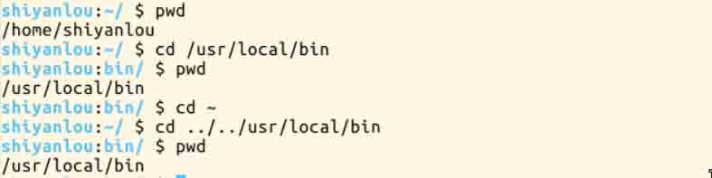
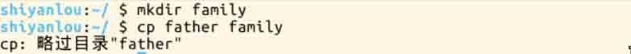

# 第 4 节 Linux 目录结构及文件基本操作

## 实验介绍

1、Linux 的文件组织目录结构。 2、相对路径和绝对路径。 3、对文件的移动、复制、重命名、编辑等操作。

## 一、Linux 目录结构

在讲 Linux 目录结构之前，你首先要清楚一点东西，那就是 Linux 的目录与 Windows 的目录的区别，或许对于一般操作上的感受来说没有多大不同，但从它们的实现机制来说是完全不同的。

一种不同是体现在目录与存储介质（磁盘，内存，DVD 等）的关系上，以往的 Windows 一直是以存储介质为主的，主要以盘符（C 盘，D 盘...）及分区的来实现文件管理，然后之下才是目录，目录就显得不是那么重要，除系统文件之外的用户文件放在任何地方任何目录也是没有多大关系。所以通常 Windows 在使用一段时间后，磁盘上面的文件目录会显得杂乱无章（少数善于整理的用户除外吧）。然而 UNIX/Linux 恰好相反，UNIX 是以目录为主的，Linux 也继承了这一优良特性。 Linux 是以树形目录结构的形式来构建整个系统的，可以理解为一个用户可操作系统的骨架。虽然本质上无论是目录结构还是操作系统内核都是存储在磁盘上的，但从逻辑上来说 Linux 的磁盘是“挂在”（挂载在）目录上的，每一个目录不仅能使用本地磁盘分区的文件系统，也可以使用网络上的文件系统。举例来说，可以利用网络文件系统（Network File System，NFS）服务器载入某特定目录等。

### 1.FHS 标准

Linux 的目录结构说复杂很复杂，说简单也很简单。复杂在于，因为系统的正常运行是以目录结构为基础的，对于初学者来说里面大部分目录都不知道其作用，重要与否，特别对于哪些曾近的重度 Windows 用户，他们会纠结很长时间，关于我安装的软件在哪里这类问题。说它简单是因为，它其中大部分目录结构是规定好了（FHS 标准），是死的，当你掌握后，你在里面的一切操作都会变得井然有序。

> FHS（英文：Filesystem Hierarchy Standard 中文：文件系统层次结构标准），多数 Linux 版本采用这种文件组织形式，FHS 定义了系统中每个区域的用途、所需要的最小构成的文件和目录同时还给出了例外处理与矛盾处理。

FHS 定义了两层规范，第一层是， / 下面的各个目录应该要放什么文件数据，例如 /etc 应该要放置设置文件，/bin 与 /sbin 则应该要放置可执行文件等等。

第二层则是针对 /usr 及 /var 这两个目录的子目录来定义。例如 /var/log 放置系统登录文件、/usr/share 放置共享数据等等。

[FHS_2.3 标准文档](http://refspecs.linuxfoundation.org/FHS_2.3/fhs-2.3.pdf)


如果你觉得看这个不明白，那么你可以试试最真实最直观的方式，执行如下命令：

```
$ tree / 
```

如果提示"command not found"，就先安装：

```
# 因为我们的环境的原因，每次新启动实验会清除系统恢复初始状态，所以需要手动更新软件包索引，以便我们安装时能找到相应软件包的源

sudo apt-get update

sudo apt-get install tree 
```

关于上面提到的 FHS，这里还有个很重要的内容你一定要明白，FHS 是根据以往无数 Linux 用户和开发者的经验总结出来的，并且会维持更新，FHS 依据文件系统使用的频繁与否以及是否允许用户随意改动（注意，不是不能，学习过程中，不要怕这些），将目录定义为四种交互作用的形态，如下表所示：


### 2.目录路径

#### 路径

有人可能不明白这路径是指什么，有什么用。顾名思义，路径就是你要去哪儿的路线嘛。如果你想进入某个具体的目录或者想获得某个目录的文件（目录本身也是文件）那就得用路径来找到了。

使用 `cd` 命令可以切换目录，在 Linux 里面使用 `.` 表示当前目录，`..` 表示上一级目录（**注意，还记得我们上一节介绍过的，以 `.` 开头的文件都是隐藏文件，所以这两个目录必然也是隐藏的，你可以使用 `ls -a` 命令查看隐藏文件）, `-` 表示上一次所在目录，`～` 通常表示当前用户的"home"目录。使用 `pwd` 命令可以获取当前所在路径（绝对路径）。

进入上一级目录：

```
$ cd .. 
```

进入你的“home”目录：

```
$ cd ~ 
# 或者 cd /home/<你的用户名> 
```

使用 `pwd` 获取当前路径：

```
$ pwd 
```


#### 绝对路径

关于绝对路径，简单地说就是以根"/"目录为起点的完整路径，以你所要到的目录为终点，表现形式如： `/usr/local/bin`，表示根目录下的 usr 目录中的 local 目录中的 bin 目录。

#### 相对路径

相对路径，也就是相对于你当前的目录的路径，相对路径是以当前目录 `.` 为起点，以你所要到的目录为终点，表现形式如： `usr/local/bin` （这里假设你当前目录为根目录）。你可能注意到，我们表示相对路径实际并没有加上表示当前目录的那个 `.` ，而是直接以目录名开头，因为这个 `usr` 目录为 `/` 目录下的子目录，是可以省略这个 `.` 的（以后会讲到一个类似不能省略的情况）；如果是当前目录的上一级目录，则需要使用 `..` ，比如你当前目录为“home”目录，根目录就应该表示为 `../../` ,表示上一级目录（"home"目录）的上一级目录（"/"目录）。

下面我们以你的"home"目录为起点，分别以绝对路径和相对路径的方式进入 `/usr/local/bin` 目录：

```
# 绝对路径
$ cd /usr/local/bin
# 相对路径
$ cd ../../usr/local/bin 
```



进入一个目录，可以使用绝对路径也可以使用相对路径，那我们应该在什么时候选择正确的方式进入某个目录呢。就是凭直觉嘛，你觉得怎样方便就使用哪一个，而不用特意只使用某一种。比如假设我当前在 `/usr/local/bin` 目录，我想进入上一级的 local 目录你说是使用 `cd ..` 方便还是 `cd /usr/local` 方便。而如果要进入的是 `usr` 目录，那么 `cd /usr` ，就比`cd ../..`方便一点了。

**提示：在进行目录切换的过程中请多使用 `Tab` 键自动补全，可避免输入错误，连续按两次`Tab`可以显示全部候选结果**

## 二、Linux 文件的基本操作

### 1.新建

#### 新建空白文件

使用 `touch` 命令创建空白文件，关于 `touch` 命令，其主要是来更改已有文件的时间戳的（比如，最近访问时间，最近修改时间），但其在不加任何参数的情况下，只指定一个文件名，则可以创建一个为指定文件名的空白文件（不会覆盖已有同名文件），当然你也可以同时指定该文件的时间戳，更多关于 `touch` 命令的用法，会在下一讲文件搜索中涉及。

创建名为 test 的空白文件，因为在其他目录没有权限，所以需要先 `cd ~` 切换回用户的 `/home/shiyanlou` 目录：

```
$ cd ~
$ touch test 
```

#### 新建目录

使用 `mkdir`（make directories）命令可以创建一个空目录,也可同时指定创建目录的权限属性

创建名为"mydir"的空目录：

```
$ mkdir mydir 
```

使用 `-p` 参数，同时创建父目录（如果不存在该父目录），如下我们同时创建一个多级目录（这在有时候安装软件，配置安装路径时非常有用）：

```
$ mkdir -p father/son/grandson 
```


后面的目录路径，以绝对路径的方式表示也是可以的。

### 2.复制

#### 复制文件

使用`cp`（copy）命令复制一个文件或目录到指定目录。将之前创建的"test"文件复制到"/home/shiyanlou/father/son/grandson"目录中：

```
$ cp test father/son/grandson 
```

是不是很方便啊，如果在图形界面则需要先在源目录复制文件，再进到目的目录粘贴文件，命令行操作步骤就一步到位了嘛。

#### 复制目录

如果直接使用`cp`命令，复制一个目录的话，会出现如下错误：



要成功复制目录需要加上`-r`或者`-R`参数，表示递归复制，就是说有点“株连九族”的意思：

```
$ cp -r father family 
```

### 3.删除

#### 删除文件

使用`rm`（remove files or directories）命令，删除一个文件或目录：

```
$ rm test 
```

有时候你会遇到想要删除一些为只读权限的文件，直接使用`rm`删除会显示一个提示，如下：


你如果想忽略这提示，直接删除文件，可以使用`-f`参数强制删除：

```
$ rm -f test 
```

#### 删除目录

跟复制目录一样，要删除一个目录，也需要加上`-r`或`-R`参数：

```
$ rm -r family 
```

### 4.移动文件与文件重命名

#### 移动文件

使用`mv`(move or rename files)命令，移动文件（剪切）。将文件"file1"移动到"Documents"目录`mv 源目录文件 目的目录`：

```
$ mkdir Documents
$ mv file1 Documents 
```


#### 重命名文件

将文件"file1"重命名为"myfile" `mv 旧的文件名 新的文件名`：

```
$ mv file1 myfile 
```

#### 批量重命名

要实现批量重命名，mv 命令就有点力不从心了，我们可以使用一个看起来更专业的命令`rename`来实现。不过它是要用 perl 正则表达式来作为参数，关于正则表达式我们要在后面才会介绍到，这里只做演示，你只要记得这个`rename`命令可以批量重命名就好了，以后再重新学习也不会有任何问题，毕竟你已经掌握了一个更常用的`mv`命令。

```
# 使用通配符批量创建 5 个文件
$ touch file{1..5}.txt

# 批量将这 5 个后缀为 .txt 的文本文件重命名为以 .c 为后缀的文件
$ rename 's/\.txt/\.c/' *.txt

# 批量将这 5 个文件，文件名改为大写
$ rename 'y/a-z/A-Z/' *.c 
```

简单解释下上面的命令，`rename`是先使用第二个参数的通配符匹配所有后缀为`.txt`的文件，然后使用第一个参数提供的正则表达式将匹配的这些文件的`.txt`后缀替换为`.c`，这一点在我们后面学习了`sed`命令后,相信你会更好的理解。

### 5.查看文件

#### 使用`cat`,`tac`和`nl`命令查看文件

这两个命令都是用来打印文件内容到标准输出（终端）,其中`cat`为正序显示，`tac`倒序显示。

> 标准输入输出：当我们执行一个 shell 命令行时通常会自动打开三个标准文件，即标准输入文件（stdin），默认对应终端的键盘；标准输出文件（stdout）和标准错误输出文件（stderr），这两个文件都对应被重定向到终端的屏幕，以便我们能直接看到输出内容。进程将从标准输入文件中得到输入数据，将正常输出数据输出到标准输出文件，而将错误信息送到标准错误文件中。

比如我们要查看之前从"/etc"目录下拷贝来的`passwd`文件：

```
$ cat passwd 
```

可以加上`-n`参数显示行号：

```
$ cat -n passwd 
```


`nl`命令，添加行号并打印，这是个比`cat -n`更专业的行号打印命令。

这里简单列举它的常用的几个参数：

```
-b : 指定添加行号的方式，主要有两种：
    -b a:表示无论是否为空行，同样列出行号("cat -n"就是这种方式)
    -b t:只列出非空行的编号并列出（默认为这种方式）
-n : 设置行号的样式，主要有三种：
    -n ln:在行号字段最左端显示
    -n rn:在行号字段最右边显示，且不加 0
    -n rz:在行号字段最右边显示，且加 0
-w : 行号字段占用的位数(默认为 6 位) 
```


你会发现使用这几个命令，默认的终端窗口大小，一屏显示不完文本的内容，得用鼠标拖动滚动条或者滑动滚轮才能继续往下翻页，要是可以直接使用键盘操作翻页就好了，那么你就可以使用下面要介绍的命令。

#### 使用`more`和`less`命令分页查看文件

如果说上面的 cat 是用来快速查看一个文件内容的，那么这个`more`和`less`就是天生用来"阅读"一个文件的内容的，比如说"man"手册内部就是使用的 less 来显示内容。其中`more`命令比较简单，只能向一个方向滚动，而"less"为基于"more"和"vi"(一个强大的编辑器，我们有单独的课程来让你学习)开发，功能更强大。less 的使用基本和 more 一致，具体使用请查看 man 手册，这里只介绍 more 命令的使用。

使用`more`工具打开`passwd`文件：

```
$ more passwd 
```


打开后默认只显示一屏内容，终端底部显示当前阅读的进度(百分比)。可以使用`Enter`键向下滚动一行，使用`Space`键向下滚动一屏，按下`h`显示帮助，`q`退出。

#### 使用`head`和`tail`命令查看文件

这两个命令那些性子比较急的人应该会比较喜欢，因为它们一个是只查看的头几行（默认为 10 行，不足 10 行则显示全部）和尾几行。还是拿 passwd 文件举例，比如当我们想要查看最近新增加的用户，那么我们可以查看这个`/etc/passwd`文件，不过我们前面也看到了，这个文件里面一大堆乱糟糟的东西，看起来实在费神啊。这里想到系统新增加一个用户，应该会将用户的信息添加到 passwd 文件的最后，那么这时候我们就可以使用`tail`命令了：

```
$ tail /etc/passwd 
```

甚至更直接的只看一行， 加上`-n`参数，后面紧跟行数：

```
$ tail -n 1 /etc/passwd 
```


关于`tail`命令，不得不提的还有它一个很牛的参数`-f`，这个参数可以实现不停地读取某个文件的内容并显示。这可让我们动态查看日志起到实时监视的作用，不过我不会在这门基础课程中介绍它的更多细节，感兴趣的用户可以自己去了解。

### 6.查看文件类型

前面我提到过，在 Linux 下面文件的类型不是根据文件后缀来判断的，我们通常使用`file`命令可以查看文件的类型：

```
$ file /bin/ls 
```


这表示这是一个可执行文件，运行在 64 位平台，并使用了动态链接文件（共享库）。

### 7.编辑文件

在 Linux 下面编辑文件通常我们会直接使用专门的命令行编辑器比如（emacs，vim，nano），由于涉及 Linux 上的编辑器的内容比较多，且非常重要，故我们有一门单独的基础课专门介绍这其中一个编辑器（vim）。**在这里强烈希望正在学习这门 Linux 基础课的你先在这里暂停一下，先去学习[vim 编辑器](http://www.shiyanlou.com/courses/2)的使用（至少掌握基本的操作）然后再继续本课程后面的内容，因为后面的内容会假设你已经学会了 vim 编辑器的使用**。如果你想更加快速的入门，你可以直接使用 Linux 内部的 vim 学习教程，输入如下命令即可开始：

```
$ vimtutor 
```

## 作业

你是不是觉得在我们的环境中学习感觉轻松愉快毫无压力呢，所以偶尔偷偷懒也是没有问题的。要真是这样可不太好啊，要学会给自己点压力，稍微严格点要求自己才行。你又或许会想要是有人能监督就好了，这样你能学得更快。好吧今天就教你怎么召唤一双眼睛出来监督你：

```
$ xeyes 
```

你可以使用如下命令将它放到后台运行

```
$ nohup xeyes &amp; 
```


## # 环境变量与文件查找

## 实验介绍

本节实验介绍环境变量的作用与用法，及几种搜索文件的方法。学会这些技巧高效地使用 Linux。

## 一、环境变量

### 1.变量

要解释环境变量，得先明白变量是什么，准确的说应该是 Shell 变量，所谓变量就是计算机中用于记录一个值（不一定是数值，也可以是字符或字符串）的符号，而这些符号将用于不同的运算处理中。通常变量与值是一对一的关系，可以通过表达式读取它的值赋值给其它变量，也可以直接指定数值赋值给任意变量。为了便于运算和处理，大部分的编程语言会区分变量的类型，用于分别记录数值、字符或者字符串等等数据类型。Shell 中的变量也基本如此，有不同类型（但不用专门指定类型名），可以参与运算，有作用域限定。

>变量的作用域即变量的有效范围（比如一个函数中、一个源文件中或者全局范围），在该范围内只能有一个同名变量。一旦离开则该变量无效，如同不存在这个变量一般。

在 Shell 中如何创建一个变量，如何给变量赋值和如何读取变量的值呢？这部分内容会在[bash 脚本编程](http://www.shiyanlou.com/courses/5)这门课中详细介绍，这里我简单举例说明一下：

使用`declare`命令创建一个变量名为 tmp 的变量：

```
$ declare tmp 
```

> 其实也可以不用 declare 预声明一个变量，直接即用即创建，这里只是告诉你 declare 的作用，这在创建其它指定类型的变量（如数组）时会用到。

使用`=`号赋值运算符为变量 tmp 赋值为 shiyanlou：

```
$ tmp=shiyanlou 
```

读取变量的值，使用`echo`命令和`$`符号（**$符号用于表示引用一个变量的值，初学者经常会忘记输入**）：

```
$ echo $tmp 
```


**注意:关于变量名，并不是任何形式的变量名都是可用的，变量名只能是英文字母,数字或者下划线，且不能以数字作为开头。**

### 2.环境变量

简单理解了变量的概念，就很好解释环境变量了，环境变量就是作用域比自定义变量要大，如 Shell 的环境变量作用于自身和它的子进程。在所有的 UNIX 和类 UNIX 系统中，每个进程都有其各自的环境变量设置，且默认情况下，当一个进程被创建时，处理创建过程中明确指定的话，它将继承其父进程的绝大部分环境设置。Shell 程序也作为一个进程运行在操作系统之上，而我们在 Shell 中运行的大部分命令都将以 Shell 的子进程的方式运行。


通常我们会涉及到的环境变量有三种：

*   当前 Shell 进程私有用户自定义变量，如上面我们创建的 temp 变量，只在当前 Shell 中有效。
*   Shell 本身内建的变量。
*   从自定义变量导出的环境变量。

也有三个与上述三种环境变量相关的命令，`set`，`env`，`export`。这三个命令很相似，都可以用于打印相关环境变量,区别在于涉及的是不同范围的环境变量，详见下表：

```
命令   | 说明
---------|-----
 set   | 显示当前 Shell 所有环境变量，包括其内建环境变量（与 Shell 外观等相关），用户自定义变量及导出的环境变量
 env   | 显示与当前用户相关的环境变量，还可以让命令在指定环境中运行
 export| 显示从 Shell 中导出成环境变量的变量，也能通过它将自定义变量导出为环境变量
```


你可以更直观的使用`vimdiff`工具比较一下它们之间的差别：

```
$ temp=shiyanlou
$ export temp_env=shiyanlou
$ env|sort>env.txt
$ export|sort>export.txt
$ set|sort>set.txt 
```

上述操作将命令输出通过管道`|`使用`sort`命令排序，再重定向到对象文本文件中。

```
$ vimdiff env.txt export.txt set.txt 
```

使用`vimdiff`工具比较导出的几个文件的内容。


关于环境变量，可以简单的理解成在当前进程的子进程是否有效，有效则为环境变量，否则不是（有些人也将所有变量统称为环境变量，只是以全局环境变量和局部环境变量进行区分，我们只要理解它们的实质区别即可）。我们这里用`export`命令来体会一下，先在 Shell 中设置一个变量`temp=shiyanlou`，然后再新创建一个子 Shell 查看`temp`变量的值：


**注意：为了与普通变量区分，通常我们习惯将环境变量名设为大写**

### 3.命令的查找路径与顺序

你可能很早之前就有疑问，我们在 Shell 中输入一个命令，Shell 是怎么知道在哪去找到这个命令然后执行的呢？这是通过环境变量`PATH`来进行搜索的，熟悉 Windows 的用户可能知道 Windows 中的也是有这么一个 PATH 环境变量。这个`PATH`里面就保存了 Shell 中执行的命令的搜索路径。

查看`PATH`环境变量的内容：

```
$ echo $PATH 
```

默认情况下你会看到如下输出：

```
/usr/local/sbin:/usr/local/bin:/usr/sbin:/usr/bin:/sbin:/bin:/usr/games:/usr/local/games 
```

如果你还记得我们在 Linux 目录结构那一节的内容，你就应该知道上面这些目录下放的是哪一类文件了。通常这一类目录下放的都是可执行文件，当我们在 Shell 中执行一个命令时，系统就会按照 PATH 中设定的路径按照顺序依次到目录中去查找，如果存在同名的命令，则执行先找到的那个。

>下面我们将练习创建一个最简单的可执行 Shell 脚本和一个使用 C 语言创建的"hello world"程序，如果这两部分内容你之前没有学习过，那么你可以进行一个入门学习： [C 语言入门教程](http://www.shiyanlou.com/courses/57) [高级 Bash 脚本编程指南](http://www.shiyanlou.com/courses/5) [Linux Shell Scripting Tutorial (LSST) v2.0](http://bash.cyberciti.biz/guide/Main_Page)

创建一个 Shell 脚本文件：

```
$ vim hello_shell.sh 
```

在脚本中添加如下内容，保存并退出（**注意不要省掉第一行，这不是注释，论坛有用户反应会有语法错误，就是因为没有了第一行**）：

```
#!/bin/zsh

for ((i=0; i<10; i++));do
    echo "hello shell"
done

exit 0 
```

为文件添加可执行权限：

```
$ chmod 755 hello_shell.sh 
```

执行脚本

```
$ ./hello_shell.sh 
```

创建一个 C 语言"hello world"程序：

```
$ vim hello_world.c 
```

```
#include <stdio.h>

int main(void)
{
    printf("hello world!\n");
    return 0;
} 
```

使用 gcc 生成可执行文件：

```
$ gcc -o hello_world hello_world.c 
```

> **gcc 生成二进制文件默认具有可执行权限，不需要修改**

在 shiyanlou 家目录创建一个`mybin`目录，并将上述 hello_shell.sh 和 hello_world 文件移动到其中：

```
$ mkdir mybin
$ mv hello_shell.sh hello_world mybin/ 
```

现在你可以在`mybin`目录中分别运行你刚刚创建的两个程序：

```
$ cd mybin
$ ./hello_shell.sh
$ ./hello_world 
```


回到上一级目录，也就是`shiyanlou`家目录，当再想运行那两个程序时，会发现提示命令找不到，除非加上命令的完整路径，但那样很不方便，如何做到想使用系统命令一样执行自己创建的脚本文件或者程序呢？那就要将命令所在路径添加到`PATH`环境变量了。

### 4.添加自定义路径到“PATH”环境变量

在前面我们应该注意到`PATH`里面的路径是以`：`作为分割符，所以我们可以这样添加自定义路径：

```
$ PATH=$PATH:/home/shiyanlou/mybin 
```

**注意这里一定要使用绝对路径**

现在你就可以在其他任意目录执行那两个命令了（注意需要去掉前面的`./`）。你可能会意识到这样还并没有很好的解决问题，因为我给 PATH 环境变量追加了一个路径，它也只是在当前 Shell 有效，我一旦退出终端，再打开就会发现又失效了。有没有方法让添加的环境变量全局有效？或者每次启动 Shell 时自动执行上面添加自定义路径到 PATH 的命令？下面我们就来说说后一种方式——让它自动执行。

在每个用户的 home 目录中有一个 Shell 每次启动时会默认执行一个配置脚本，以初始化环境，包括添加一些用户自定义环境变量等等。zsh 的配置文件是`.zshrc`，相应 Bash 的配置文件为`.bashrc`。它们在`etc`下还都有一个或多个全局的配置文件，不过我们一般只修改用户目录下的配置文件。

我们可以简单的使用下面命令直接添加内容到`.zshrc`中：

```
$ echo "PATH=$PATH:/home/shiyanlou/mybin" >> .zshrc 
```

**上述命令中`>>`表示将标准输出以追加的方式重定向到一个文件中，注意前面用到的`>`是以覆盖的方式重定向到一个文件中，使用的时候一定要注意分辨。在指定文件不存在的情况下都会创建新的文件。**

### 5.修改和删除已有变量

#### 变量修改

变量的修改有以下几种方式：

```
变量设置方式 | 说明
------------|----
${变量名#匹配字串}|从头向后开始匹配，删除符合匹配字串的最短数据
${变量名##匹配字串}|从头向后开始匹配，删除符合匹配字串的最长数据
${变量名%匹配字串}|从尾向前开始匹配，删除符合匹配字串的最短数据
${变量名%%匹配字串}|从尾向前开始匹配，删除符合匹配字串的最长数据
${变量名/旧的字串/新的字串}|将符合旧字串的第一个字串替换为新的字串
${变量名//旧的字串/新的字串}|将符合旧字串的全部字串替换为新的字串
```

比如要修改我们前面添加到 PATH 的环境变量。为了避免操作失误导致命令找不到，我们先将 PATH 赋值给一个新的自定义变量 path：

```
$ path=$PATH
$ echo $path
$ path=${path%/home/shiyanlou/mybin}
# 或使用通配符,*表示任意多个任意字符
$ path=${path%*/mybin} 
```

#### 变量删除

可以使用`unset`命令删除一个环境变量：

```
$ unset temp 
```

### 6.如何让环境变量立即生效

在上面我们在 Shell 中修改了一个配置脚本文件之后（比如 zsh 的配置文件 home 目录下的`.zshrc`），每次都要退出终端重新打开甚至重启主机之后其才能生效，很是麻烦，我们可以使用`source`命令来让其立即生效，如：

```
$ source .zshrc 
```

`source`命令还有一个别名就是`.`，注意与表示当前路径的那个点区分开，虽然形式一样，但作用和使用方式一样，上面的命令如果替换成`.`的方式就该是

```
$ . ./.zshrc 
```

注意第一个点后面有一个空格，而且后面的文件必须指定完整的绝对或相对路径名，source 则不需要。

## 二、搜索文件

与搜索相关的命令常用的有如下几个`whereis`,`which`,`find`,`locate`。

*   **`whereis`简单快速**

```
$whereis who 
```


你会看到它找到了三个路径，两个可执行文件路径和一个 man 在线帮助文件所在路径，这个搜索很快，因为它并没有从硬盘中依次查找，而是直接从数据库中查询。`whereis`只能搜索二进制文件(-b)，man 帮助文件(-m)和源代码文件(-s)。如果想要获得更全面的搜索结果可以使用`locate`命令。

*   **`locate`快而全**

通过"/var/lib/mlocate/mlocate.db"数据库查找，不过这个数据库也不是实时更新的，系统会使用定时任务每天自动执行`updatedb`命令更新一次，所以有时候你刚添加的文件，它可能会找不到，需要手动执行一次`updatedb`命令（在我们的环境中必须先执行一次该命令）。它可以用来查找指定目录下的不同文件类型，如查找 /etc 下所有以 sh 开头的文件：

```
$ locate /etc/sh 
```

> **注意,它不只是在 etc 目录下查找并会自动递归子目录进行查找**

查找 /usr/share/ 下所有 jpg 文件：

```
$ locate /usr/share/\*.jpg 
```

> **注意要添加`*`号前面的反斜杠转义，否则会无法找到**

如果想只统计数目可以加上`-c`参数，`-i`参数可以忽略大小写进行查找，whereis 的`-b`,`-m`，`-s`同样可以是使用。

*   **`which`小而精**

`which`本身是 Shell 内建的一个命令，我们通常使用`which`来确定是否安装了某个指定的软件，因为它只从`PATH`环境变量指定的路径中去搜索命令：

```
$ which man 
```

*   **`find`精而细**

`find`应该是这几个命令中最强大的了，它不但可以通过文件类型、文件名进行查找而且可以根据文件的属性（如文件的时间戳，文件的权限等）进行搜索。`find`命令强大到，要把它将明白至少需要单独好几节课程才行，我们这里只介绍一些常用的内容。

在指定目录下搜索指定文件名的文件：

```
$ find /etc/ -name interfaces 
```

> **注意 find 命令的路径是作为第一个参数的， 基本命令格式为 find [path] [option] [action]**

与时间相关的命令参数：

```
参数  | 说明 
--------|----
-atime | 最后访问时间 
-ctime | 创建时间
-mtime | 最后修改时间
```

下面以`-mtime`参数举例：

*   `-mtime n`: n 为数字，表示为在 n 天之前的”一天之内“修改过的文件
*   `-mtime +n`: 列出在 n 天之前（不包含 n 天本身）被修改过的文件
*   `-mtime -n`: 列出在 n 天之内（包含 n 天本身）被修改过的文件
*   `newer file`: file 为一个已存在的文件，列出比 file 还要新的文件名


列出 home 目录中，当天（24 小时之内）有改动的文件：

```
$ find ~ -mtime 0 
```

列出用户家目录下比 Code 文件夹新的文件：

```
$ find ~ -newer /home/shiyanlou/Code 
```

## 作业

《黑客帝国》电影里满屏幕代码的“数字雨”，在 Linux 里面你也可以轻松实现这样的效果，你只需要一个命令`cmatrix`。

需要先安装，因为 Ubuntu 没有预装：

```
$ sudo apt-get update;sudo apt-get install cmatrix 
```

装好之后先不要急着执行，为了看到更好的效果，我们需要先修改终端的主题配色，修改为黑底绿字,修改方法见下图：


然后按下`F11` 可以全屏显示。