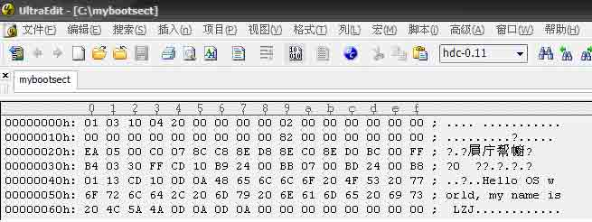
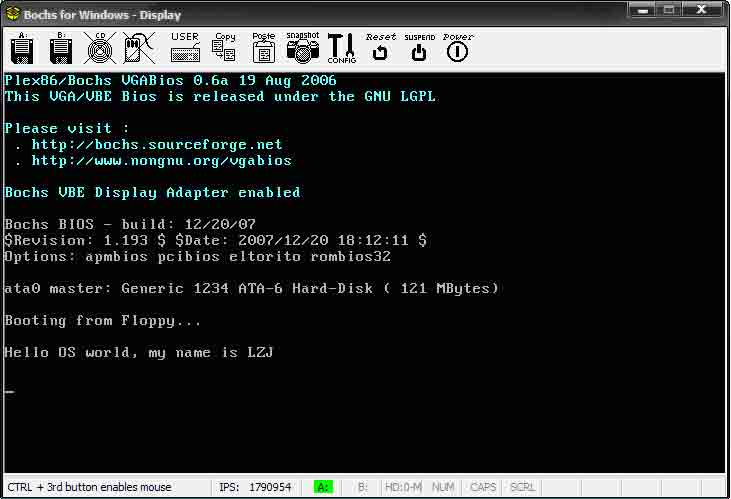
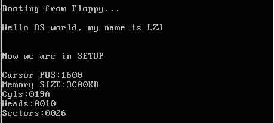

# 第 2 节 操作系统的引导

## 实验目的

*   熟悉 hit-oslab 实验环境；
*   建立对操作系统引导过程的深入认识；
*   掌握操作系统的基本开发过程；
*   能对操作系统代码进行简单的控制，揭开操作系统的神秘面纱。

## 实验内容

此次实验的基本内容是：

1.  阅读《Linux 内核完全注释》的第六章，对计算机和 Linux 0.11 的引导过程进行初步的了解；
2.  按照下面的要求改写 0.11 的引导程序 bootsect.s
3.  有兴趣同学可以做做进入保护模式前的设置程序 setup.s。

改写 bootsect.s 主要完成如下功能：

1.  bootsect.s 能在屏幕上打印一段提示信息“XXX is booting...”，其中 XXX 是你给自己的操作系统起的名字，例如 LZJos、Sunix 等（可以上论坛上秀秀谁的 OS 名字最帅，也可以显示一个特色 logo，以表示自己操作系统的与众不同。）

改写 setup.s 主要完成如下功能：

1.  bootsect.s 能完成 setup.s 的载入，并跳转到 setup.s 开始地址执行。而 setup.s 向屏幕输出一行"Now we are in SETUP"。
2.  setup.s 能获取至少一个基本的硬件参数（如内存参数、显卡参数、硬盘参数等），将其存放在内存的特定地址，并输出到屏幕上。
3.  setup.s 不再加载 Linux 内核，保持上述信息显示在屏幕上即可。

## 实验报告

在实验报告中回答如下问题：

1.  有时，继承传统意味着别手蹩脚。x86 计算机为了向下兼容，导致启动过程比较复杂。请找出 x86 计算机启动过程中，被硬件强制，软件必须遵守的两个“多此一举”的步骤（多找几个也无妨），说说它们为什么多此一举，并设计更简洁的替代方案。

## 评分标准

*   bootsect 显示正确，30%
*   bootsect 正确读入 setup，10%
*   setup 获取硬件参数正确，20%
*   setup 正确显示硬件参数，20%
*   实验报告，20%

## 实验提示

操作系统的 boot 代码有很多，并且大部分是相似的。本实验仿照 Linux-0.11/boot 目录下的 bootsect.s 和 setup.s，以剪裁它们为主线。当然，如果能完全从头编写，并实现实验所要求的功能，是再好不过了。

同济大学赵炯博士的《Linux 内核 0.11 完全注释（修正版 V3.0）》（以后简称《注释》）的第六章是非常有帮助的参考，实验中可能遇到的各种问题，几乎都能找到答案。可以在“资料和文件下载”中下载到该书的电子版。同目录中，校友谢煜波撰写的《操作系统引导探究》也是一份很好的参考。

需要注意的是，oslab 中的汇编代码使用 as86 编译，语法和汇编课上所授稍有不同。

**下面将给出一些更具体的“提示”。这些提示并不是实验的一步一步的指导，而是罗列了一些实验中可能遇到的困难，并给予相关提示。它们肯定不会涵盖所有问题，也不保证其中的每个字都对完成实验有帮助。所以，它们更适合在你遇到问题时查阅，而不是当作指南一样地亦步亦趋。本书所有实验的提示都是秉承这个思想编写的。**

### Linux 0.11 相关代码详解

boot/bootsect.s、boot/setup.s 和 tools/build.c 是本实验会涉及到的源文件。它们的功能详见《注释》的 6.2、6.3 节和 16 章。

如果使用 Windows 下的环境，那么要注意 Windows 环境里提供的 build.c 是一个经过修改过的版本。Linus Torvalds 的原版是将 0.11 内核的最终目标代码输出到标准输出，由 make 程序将数据重定向到 Image 文件，这在 Linux、Unix 和 Minix 等系统下都是非常有效的。但 Windows 本身的缺陷（也许是特色）决定了在 Windows 下不能这么做，所以 flyfish 修改了 build.c，将输出直接写入到 Image（flyfish 是写入到 Boot.img 文件，我们为了两个环境的一致，也为了最大化地与原始版本保持统一，将其改为 Image）文件中。同时为了适应 Windows 的一些特殊情况，他还做了其它一些小修改。

### 引导程序的运行环境

引导程序由 BIOS 加载并运行。它活动时，操作系统还不存在，整台计算机的所有资源都由它掌控，而能利用的功能只有 BIOS 中断调用。

### 完成 bootsect.s 的屏幕输出功能

首先来看完成屏幕显示的关键代码如下：

```
 ! 首先读入光标位置
mov    ah,#0x03        
xor    bh,bh
int    0x10

    ! 显示字符串“LZJos is running...”
mov    cx,#25          ! 要显示的字符串长度
mov    bx,#0x0007      ! page 0, attribute 7 (normal)
mov    bp,#msg1
mov    ax,#0x1301      ! write string, move cursor
int    0x10

inf_loop:
jmp    inf_loop        ! 后面都不是正经代码了，得往回跳呀
    ! msg1 处放置字符串

msg1:
    .byte 13,10            ! 换行+回车
    .ascii "LZJos is running..."
    .byte 13,10,13,10            ! 两对换行+回车
    !设置引导扇区标记 0xAA55
    .org 510
boot_flag:
    .word 0xAA55            ! 必须有它，才能引导 
```

接下来，将完成屏幕显示的代码在开发环境中编译，并使用 linux-0.11/tools/build.c 将编译后的目标文件做成 Image 文件。

### 编译和运行

Ubuntu 上先从终端进入~/oslab/linux-0.11/boot/目录。Windows 上则先双击快捷方式“MinGW32.bat”，将打开一个命令行窗口，当前目录是 oslab，用 cd 命令进入 linux-0.11\boot。无论那种系统，都执行下面两个命令编译和链接 bootsect.s：

```
as86 -0 -a -o bootsect.o bootsect.s
ld86 -0 -s -o bootsect bootsect.o 
```

其中-0（注意：这是数字 0，不是字母 O）表示生成 8086 的 16 位目标程序，-a 表示生成与 GNU as 和 ld 部分兼容的代码，-s 告诉链接器 ld86 去除最后生成的可执行文件中的符号信息。

如果这两个命令没有任何输出，说明编译与链接都通过了。Ubuntu 下用 ls -l 可列出下面的信息：

```
-rw--x--x    1  root  root  544  Jul  25  15:07   bootsect
-rw------    1  root  root  257  Jul  25  15:07   bootsect.o
-rw------    1  root  root  686  Jul  25  14:28   bootsect.s 
```

Windows 下用 dir 可列出下面的信息：

```
2008-07-28  20:14               544 bootsect
2008-07-28  20:14               924 bootsect.o
2008-07-26  20:13             5,059 bootsect.s 
```

其中 bootsect.o 是中间文件。bootsect 是编译、链接后的目标文件。

需要留意的文件是 bootsect 的文件大小是 544 字节，而引导程序必须要正好占用一个磁盘扇区，即 512 个字节。造成多了 32 个字节的原因是 ld86 产生的是 Minix 可执行文件格式，这样的可执行文件处理文本段、数据段等部分以外，还包括一个 Minix 可执行文件头部，它的结构如下：

```
struct exec {
    unsigned char a_magic[2];  //执行文件魔数
    unsigned char a_flags;
    unsigned char a_cpu;       //CPU 标识号
    unsigned char a_hdrlen;    //头部长度，32 字节或 48 字节
    unsigned char a_unused;
    unsigned short a_version;
    long a_text; long a_data; long a_bss; //代码段长度、数据段长度、堆长度
    long a_entry;    //执行入口地址
    long a_total;    //分配的内存总量
    long a_syms;     //符号表大小
}; 
```

算一算：6 char(6 字节)+1 short(2 字节)+6 long(24 字节)=32，正好是 32 个字节，去掉这 32 个字节后就可以放入引导扇区了（这是 tools/build.c 的用途之一）。

对于上面的 Minix 可执行文件，其 a*magic[0]=0x01，a*magic[1]=0x03，a*flags=0x10（可执行文件），a*cpu=0x04（表示 Intel i8086/8088，如果是 0x17 则表示 Sun 公司的 SPARC），所以 bootsect 文件的头几个字节应该是 01 03 10 04。为了验证一下，Ubuntu 下用命令“hexdump -C bootsect”可以看到：

```
00000000  01 03 10 04 20 00 00 00  00 02 00 00 00 00 00 00  |.... ...........|
00000010  00 00 00 00 00 00 00 00  00 82 00 00 00 00 00 00  |................|
00000020  b8 c0 07 8e d8 8e c0 b4  03 30 ff cd 10 b9 17 00  |.........0......|
00000030  bb 07 00 bd 3f 00 b8 01  13 cd 10 b8 00 90 8e c0  |....?...........|
00000040  ba 00 00 b9 02 00 bb 00  02 b8 04 02 cd 13 73 0a  |..............s.|
00000050  ba 00 00 b8 00 00 cd 13  eb e1 ea 00 00 20 90 0d  |............. ..|
00000060  0a 53 75 6e 69 78 20 69  73 20 72 75 6e 6e 69 6e  |.Sunix is runnin|
00000070  67 21 0d 0a 0d 0a 00 00  00 00 00 00 00 00 00 00  |g!..............|
00000080  00 00 00 00 00 00 00 00  00 00 00 00 00 00 00 00  |................|
*
00000210  00 00 00 00 00 00 00 00  00 00 00 00 00 00 55 aa  |..............U.|
00000220 
```

Windows 下用 UltraEdit 把该文件打开，果然如此。



图 1 用 UltraEdit 打开文件 bootsect

接下来干什么呢？是的，要去掉这 32 个字节的文件头部（tools/build.c 的功能之一就是这个）！随手编个小的文件读写程序都可以去掉它。不过，懒且聪明的人会在 Ubuntu 下用命令：

```
$ dd bs=1 if=bootsect of=Image skip=32 
```

生成的 Image 就是去掉文件头的 bootsect。

Windows 下可以用 UltraEdit 直接删除（选中这 32 个字节，然后按 Ctrl+X）。

去掉这 32 个字节后，将生成的文件拷贝到 linux-0.11 目录下，并一定要命名为“Image”（注意大小写）。然后就“run”吧！



图 2 bootsect 引导后的系统启动情况

### bootsect.s 读入 setup.s

首先编写一个 setup.s，该 setup.s 可以就直接拷贝前面的 bootsect.s（可能还需要简单的调整），然后将其中的显示的信息改为：“Now we are in SETUP”。

接下来需要编写 bootsect.s 中载入 setup.s 的关键代码。原版 bootsect.s 中下面的代码就是做这个的。

```
load_setup:
mov    dx,#0x0000      !设置驱动器和磁头(drive 0, head 0): 软盘 0 磁头
mov    cx,#0x0002      !设置扇区号和磁道(sector 2, track 0):0 磁头、0 磁道、2 扇区
mov    bx,#0x0200      !设置读入的内存地址：BOOTSEG+address = 512，偏移 512 字节
mov    ax,#0x0200+SETUPLEN !设置读入的扇区个数(service 2, nr of sectors)，
                    !SETUPLEN 是读入的扇区个数，Linux 0.11 设置的是 4，
                    !我们不需要那么多，我们设置为 2
int    0x13            !应用 0x13 号 BIOS 中断读入 2 个 setup.s 扇区
jnc    ok_load_setup       !读入成功，跳转到 ok_load_setup: ok - continue
mov    dx,#0x0000      !软驱、软盘有问题才会执行到这里。我们的镜像文件比它们可靠多了
mov    ax,#0x0000      !否则复位软驱 reset the diskette
int    0x13
jmp    load_setup  !重新循环，再次尝试读取
ok_load_setup:
！接下来要干什么？当然是跳到 setup 执行。 
```

所有需要的功能在原版 bootsect.s 中都是存在的，我们要做的仅仅是删除那些对我们无用的代码。

### 再次编译

现在有两个文件都要编译、链接。一个个手工编译，效率低下，所以借助 Makefile 是最佳方式。

在 Ubuntu 下，进入 linux-0.11 目录后，使用下面命令（注意大小写）：

```
$ make BootImage 
```

Windows 下，在命令行方式，进入 Linux-0.11 目录后，使用同样的命令（不需注意大小写）：

```
makeBootImage 
```

无论哪种系统，都会看到：

```
Unable to open 'system'
make: *** [BootImage] Error 1 
```

有 Error！这是因为 make 根据 Makefile 的指引执行了 tools/build.c，它是为生成整个内核的镜像文件而设计的，没考虑我们只需要 bootsect.s 和 setup.s 的情况。它在向我们要“系统”的核心代码。为完成实验，接下来给它打个小补丁。

### 修改 build.c

build.c 从命令行参数得到 bootsect、setup 和 system 内核的文件名，将三者做简单的整理后一起写入 Image。其中 system 是第三个参数（argv[3]）。当“make all”或者“makeall”的时候，这个参数传过来的是正确的文件名，build.c 会打开它，将内容写入 Image。而“make BootImage”时，传过来的是字符串"none"。所以，改造 build.c 的思路就是当 argv[3]是"none"的时候，只写 bootsect 和 setup，忽略所有与 system 有关的工作，或者在该写 system 的位置都写上“0”。

修改工作主要集中在 build.c 的尾部，请斟酌。

当按照前一节所讲的编译方法编译成功后，run，就得到了如图 3 所示的运行结果，和我们想得到的结果完全一样。


图 3 用修改后的 bootsect.s 和 setup.s 进行引导的结果

### setup.s 获取基本硬件参数

setup.s 将获得硬件参数放在内存的 0x90000 处。原版 setup.s 中已经完成了光标位置、内存大小、显存大小、显卡参数、第一和第二硬盘参数的保存。

用 ah=#0x03 调用 0x10 中断可以读出光标的位置，用 ah=#0x88 调用 0x15 中断可以读出内存的大小。有些硬件参数的获取要稍微复杂一些，如磁盘参数表。在 PC 机中 BIOS 设定的中断向量表中 int 0x41 的中断向量位置(4*0x41 = 0x0000:0x0104)存放的并不是中断程序的地址，而是第一个硬盘的基本参数表。第二个硬盘的基本参数表入口地址存于 int 0x46 中断向量位置处。每个硬盘参数表有 16 个字节大小。下表给出了硬盘基本参数表的内容：

表 1 磁盘基本参数表

```
位移|大小|说明|
---|---|---|
0x00|字|柱面数|
0x02    |字节|磁头数|
…|    …|  …|
0x0E    |字节 |每磁道扇区数|
0x0F    |字节|保留|
```

所以获得磁盘参数的方法就是复制数据。

下面是将硬件参数取出来放在内存 0x90000 的关键代码。

```
mov    ax,#INITSEG 
mov    ds,ax !设置 ds=0x9000
mov    ah,#0x03    !读入光标位置
xor    bh,bh
int    0x10        !调用 0x10 中断
mov    [0],dx      !将光标位置写入 0x90000.

!读入内存大小位置
mov    ah,#0x88
int    0x15
mov    [2],ax

!从 0x41 处拷贝 16 个字节（磁盘参数表）
mov    ax,#0x0000
mov    ds,ax
lds    si,[4*0x41]
mov    ax,#INITSEG
mov    es,ax
mov    di,#0x0004
mov    cx,#0x10
rep            !重复 16 次
movsb 
```

现在已经将硬件参数（只包括光标位置、内存大小和硬盘参数，其他硬件参数取出的方法基本相同，此处略去）取出来放在了 0x90000 处，接下来的工作是将这些参数显示在屏幕上。这些参数都是一些无符号整数，所以需要做的主要工作是用汇编程序在屏幕上将这些整数显示出来。

以十六进制方式显示比较简单。这是因为十六进制与二进制有很好的对应关系（每 4 位二进制数和 1 位十六进制数存在一一对应关系），显示时只需将原二进制数每 4 位划成一组，按组求对应的 ASCII 码送显示器即可。ASCII 码与十六进制数字的对应关系为：0x30～0x39 对应数字 0～9，0x41～0x46 对应数字 a～f。从数字 9 到 a，其 ASCII 码间隔了 7h，这一点在转换时要特别注意。为使一个十六进制数能按高位到低位依次显示，实际编程中，需对 bx 中的数每次循环左移一组（4 位二进制），然后屏蔽掉当前高 12 位，对当前余下的 4 位（即 1 位十六进制数）求其 ASCII 码，要判断它是 0～9 还是 a～f，是前者则加 0x30 得对应的 ASCII 码，后者则要加 0x37 才行，最后送显示器输出。以上步骤重复 4 次，就可以完成 bx 中数以 4 位十六进制的形式显示出来。

下面是完成显示 16 进制数的汇编语言程序的关键代码，其中用到的 BIOS 中断为 INT 0x10，功能号 0x0E（显示一个字符），即 AH=0x0E，AL=要显示字符的 ASCII 码。

```
!以 16 进制方式打印栈顶的 16 位数
print_hex:
mov    cx,#4       ! 4 个十六进制数字
mov    dx,(bp)     ! 将(bp)所指的值放入 dx 中，如果 bp 是指向栈顶的话
print_digit:
rol    dx,#4       ! 循环以使低 4 比特用上 !! 取 dx 的高 4 比特移到低 4 比特处。
mov    ax,#0xe0f   ! ah = 请求的功能值，al = 半字节(4 个比特)掩码。
and    al,dl       ! 取 dl 的低 4 比特值。
add    al,#0x30    ! 给 al 数字加上十六进制 0x30
cmp    al,#0x3a
jl    outp        !是一个不大于十的数字
    add    al,#0x07    !是 a～f，要多加 7
outp: 
int    0x10
    loop    print_digit
    ret
这里用到了一个 loop 指令，每次执行 loop 指令，cx 减 1，然后判断 cx 是否等于 0。如果不为 0 则转移到 loop 指令后的标号处，实现循环；如果为 0 顺序执行。另外还有一个非常相似的指令：rep 指令，每次执行 rep 指令，cx 减 1，然后判断 cx 是否等于 0，如果不为 0 则继续执行 rep 指令后的串操作指令，直到 cx 为 0，实现重复。
!打印回车换行
print_nl:
mov    ax,#0xe0d   ! CR
int    0x10
mov    al,#0xa     ! LF
int    0x10
    ret 
```

只要在适当的位置调用 print*bx 和 print*nl（注意，一定要设置好栈，才能进行函数调用）就能将获得硬件参数打印到屏幕上，完成此次实验的任务。但事情往往并不总是顺利的，前面的两个实验大多数实验者可能一次就编译调试通过了（这里要提醒大家：编写操作系统的代码一定要认真，因为要调试操作系统并不是一件很方便的事）。但在这个实验中会出现运行结果不对的情况（为什么呢？因为我们给的代码并不是 100%好用的）。所以接下来要复习一下汇编，并阅读《Bochs 使用手册》，学学在 Bochs 中如何调试操作系统代码。

我想经过漫长而痛苦的调试后，大家一定能兴奋地得到下面的运行结果：



图 4 用可以打印硬件参数的 setup.s 进行引导的结果

Memory Size 是 0x3C00KB，算一算刚好是 15MB（扩展内存），加上 1MB 正好是 16MB，看看 Bochs 配置文件 bochs/bochsrc.bxrc：

```
……
megs: 16
……
ata0-master: type=disk, mode=flat, cylinders=410, heads=16, spt=38
…… 
```

这些都和上面打出的参数吻合，表示此次实验是成功的。