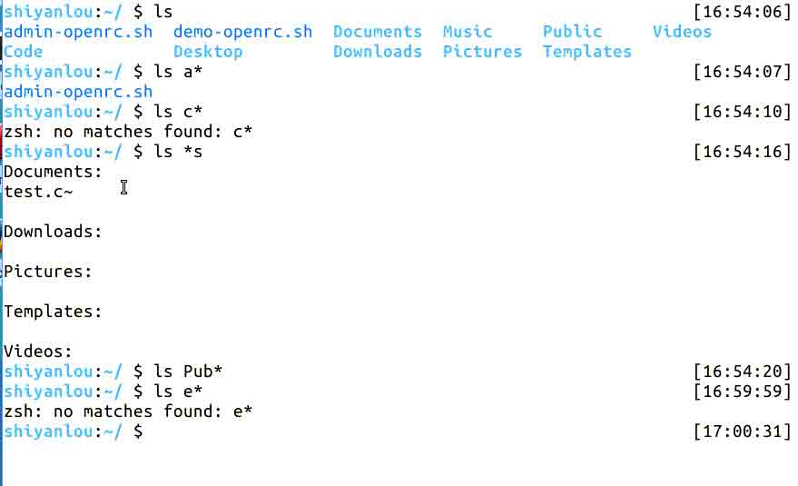

# 第 1 节 基础正则表达式介绍与练习

## 一、什么是正则表达式

在做文字处理或编写程序时，用到查找、替换等功能，使用正则表达式能够简单快捷的完成目标。简单而言，正则表达式通过一些特殊符号的帮助，使用户可以轻松快捷的完成查找、删除、替换等处理程序。例如 grep, expr, sed , awk. 或 Vi 中经常会使用到正则表达式，为了充分发挥 shell 编程的威力,需要精通正则表达式。正规表示法基本上是一种『表示法』， 只要工具程序支持这种表示法，那么该工具程序就可以用来作为正规表示法的字符串处理之用。 也就是说，例如 vi, grep, awk ,sed 等等工具，因为她们有支持正规表示法， 所以，这些工具就可以使用正规表示法的特殊字符来进行字符串的处理。

## 二、正则表达式特殊符号

首先是正则表达式的特殊符号：

```
[:alnum:]代表英文大小写字母及数字 
[:alpha:]代表英文大小写字母
[:blank:]代表空格和 tab 键
[:cntrl:]键盘上的控制按键，如 CR,LF,TAB,DEL
[:digit:]代表数字
[:graph:]代表空白字符以外的其他
[:lower:]小写字母
[:print:]可以被打印出来的任何字符
[:punct:]代表标点符号
[:upper:]代表大写字符
[:space:]任何会产生空白的字符如空格，tab,CR 等
[:xdigit:]代表 16 进位的数字类型 
```

### 特殊符号实例

任意建立一个文本并编辑。或者以原有的文本做实验皆可。 `$ touch regular_express.txt $ vi regular_express.txt //或者 sudo gedit regular_express.txt`

操作截图：


文本内容为：

```
"Open Source" is a good mechanism to develop programs.
apple is my favorite food.
Football game is not use feet only.
this dress doesn't fit me.
However, this dress is about $ 3183 dollars.
GNU is free air not free beer.
Her hair is very beauty.
I can't finish the test.
Oh! The soup taste good.
motorcycle is cheap than car.
This window is clear.
the symbol '*' is represented as start.
Oh!My god!
The gd software is a library for drafting programs.
You are the best is mean you are the no. 1.
The world <Happy> is the same with "glad".
I like dog.
google is the best tools for search keyword.
goooooogle yes!
go! go! Let's go.
# I am VBird 
```

查找小写字母：

```
$ grep -n '[[:lower:]]' regular_express.txt 
```

操作截图：

**蓝色为匹配成功的字符**


查找数字：

```
# grep -n '[[:digit:]]' regular_express.txt 
```

操作截图：


## 三、语系对正则表达式的影响

由于不同语系的编码数据不同，所以造成不同语系的数据选取结果有所差异。以英文大小写为例，zh_CN.big5 及 C 这两种语系差异如下：

*   LANG=C 时： 0 1 2 3 4....ABCDE...Zabcde...z
*   LANG=zh_CN 时：0 1 2 3 4...aAbBcCdD.....zZ

在使用正则表达式[A-Z]时， LANG=C 的情况下，找到的仅仅是大写字符 ABCD..Z。而在 LANG=zh_CN 情况下，会选取到 AbBcCdD.....zZ 字符。因此在使用正则表达式时要特别留意语系。

由于我们一般使用的兼容与 POSIX 的标准，因此使用 C 语系。

## 四、简单例子 ：ls 命令正则表达式应用

ls 命令是 linux 下最常用的命令。ls 命令是 list 的缩写,缺省下 ls 用来打印出当前目录的清单。

命令中‘ * ’号是正则表达式的一种，代表任意字符串。

```
$ ls
$ ls a*   //打印出以 a 开头的文件及内容或者目录
$ ls *s   //打印以 s 结尾的文件及内容或者目录
$ ls Pub* // Public 文件为空，所有没有打印任何内容
$ ls e*   //没有以 e 开头的文件，所有显示没有找到匹配项 
```

操作截图：

