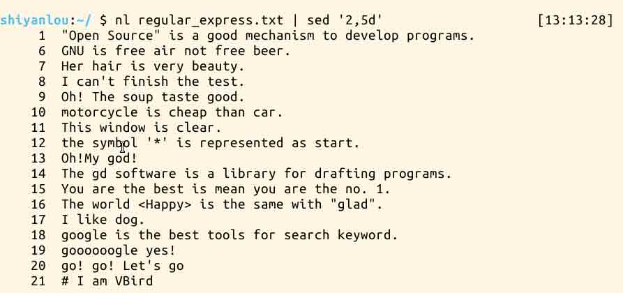
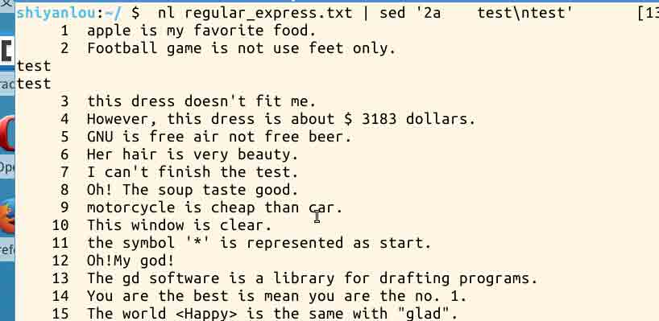
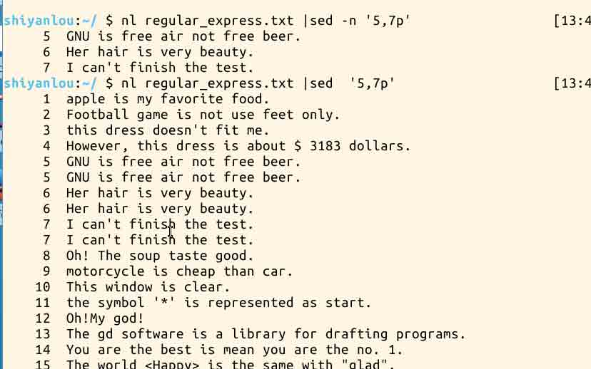

# 第 3 节 正则表达式运用之 sed 工具命令

本实验继续以上一个实验的 regular_express.txt 为实验文本。

## 一、概念

sed 是非交互式的编辑器。它不会修改文件，除非使用 shell 重定向来保存结果。默认情况下，所有的输出行都被打印到屏幕上。

sed 编辑器逐行处理文件（或输入），并将结果发送到屏幕。具体过程如下：首先 sed 把当前正在处理的行保存在一个临时缓存区中（也称为模式空间），然后处理临时缓冲区中的行，完成后把该行发送到屏幕上。sed 每处理完一行就将其从临时缓冲区删除，然后将下一行读入，进行处理和显示。处理完输入文件的最后一行后，sed 便结束运行。sed 把每一行都存在临时缓冲区中，对这个副本进行编辑，所以不会修改原文件。

如果要修改原文件，可使用-i 选项。

## 二、实验

### 2.1 将 regular_express.txt 的内容列出并打印行号，同时,将 2-5 行删除显示

代码如下:

`$ nl regular_express.txt | sed '2,5d'`

命令解释：'2,5d' 表示 2~5 行，d 表示删除。

操作截图：



注: sed 是 sed -e 的简写, 后接单引号

同上删除第 2 行

```
$ nl regular_express.txt | sed '2d' 
```

同上删除第三行到最后一行, $定位到最后一行

```
$ nl regular_express.txt | sed '3,$d' 
```

在原文件中删除第 1 行：

```
$ sed -i '1d' regular_express.txt 
```

### 2.2 `a`表示在行后加上字符串，`i`表示在行前添加字符串

在第二行后添加 test 字符串

```
$ nl regular_express.txt | sed '2a test' 
```

操作截图：


在第二行前添加 test 字符串

```
$ nl regular_express.txt | sed '2i test' 
```

在第二行后加入两行 test，“\n”表示换行符

```
$ nl regular_express.txt | sed '2a    test\ntest' 
```

操作截图：



### 2.3 将 2-5 行内容取代为 No 2-5 number

c 为替换内容选项。

```
$ nl regular_express.txt | sed '2,5c No 2-5 number' 
```

### 2.4 列出 regular_express.txt 内第 5-7 行

sed 命令中-n 为安静模式选项。以下两条命令执行结束后可对比结果。

```
$ nl regular_express.txt |sed -n '5,7p'

$ nl regular_express.txt |sed  '5,7p' 
```

操作截图：



### 2.5 替换字符串:

sed 's/被替换字符串/新字符串/g'

1.获取本机 IP 的行

```
$ /sbin/ifconfig eth0 |grep 'inet '

inet 后面的空格不能少 
```

命令详解： 在/sbin/ifconfig eth0 的结果中查找‘inet’，打印至终端

将 IP 前面的部分予以删除，下面两条命令结果相同。

```
$ /sbin/ifconfig eth0 |grep 'inet '| sed 's/.inet...://g'

$ /sbin/ifconfig eth0 |grep 'inet '| sed 's/.\{0,9\}://' 
```

将 IP 后面的部分删除

```
$ /sbin/ifconfig eth0 |grep 'inet '| sed 's/.inet...://g'| sed 's/..:.*$//g'

$ /sbin/ifconfig eth0 |grep 'inet '| sed 's/.inet...://g'| sed 's/.\{0,3\}:.*$//g' 
```

* * *

**192.168.42.19**

操作截图：


上述命令是比较复杂的正则表达式运用，熟悉正则表达式可以明显的简化命令，简单快捷的完成文件查询、修改等功能。

## 参考文档

*   http://www.jb51.net/article/54961.htm