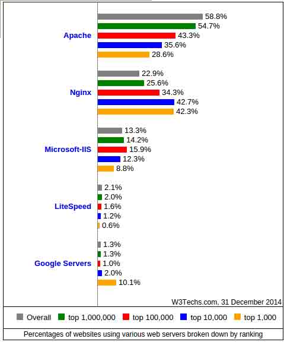
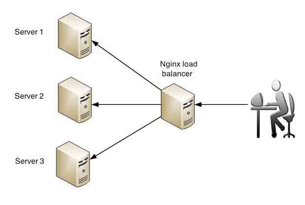

# Linux Web 运维（Nginx）实战

Linux Web 服务（Nginx）运维实战课程，本课将介绍 Nginx 的部署、配置、优化及案例实战。

## Nginx 功能描述

### 本节预告

*   nginx 是什么?
*   nginx 为什么会流行?
*   为什么选择 nginx?
*   nginx 工作原理
*   Nginx 的常用架构简介
*   我该如何学习 nginx?

## Nginx 是什么？

Nginx 读音'Engine X',很多工程师也喜欢读成'恩基克思'。nginx 是一款高性能的 HTTP 和反向代理服务器软件，第一个开源版本诞生于 2004 年,虽然诞生较晚但经过十多年的发展,已经成为非常流行的 web 服务器软件，下图是 w3techs 公布的全球网站服务器软件统计报告

截止到 2014 年 12 月 31 日,Nginx 仅次于 apache 成为第二大 web 服务器软件,而在全球最忙碌 top10000 网站中使用比例更是高达 42.7%。其发展速度和流行程度已经远远超过其它同类软件,成为大型网站和高并发网站的首选。下面列出一些使用 Nginx 的网站:

## Nginx 为什么流行?

市场往往会选择简单实用的技术,Nginx 之所以能够脱颖而出，可以说是 nginx 的特性迎合了市场的发展趋势。近几年来,随着硬件成本的降低,个人电脑和移动设备得到了普及,web 服务器在互联网中的角色与十几年前的相比已大不相同。高并发已经成为趋势,而高并发又要求架构具有健壮性和可伸缩性。这些正是 Nginx 的特性,它是为性能而生,从发布以来一直侧重于高性能,高并发,低 CPU 内存消耗;在功能方面:负载均衡,反向代理,访问控制,热部署,高扩展性等特性又十分适合现代的网络架构。更可贵的是配置简单文档丰富,大大降低了学习的门槛。这样稳定,性能强,功能丰富又简单的产品当然会受欢迎了。

## 为什么选择 Nginx?

Apache 自 1990 年发布以来,一直是 web 服务器市场的王者。Nginx 出现较晚,因其在高并发下卓越的表现,最初是作为 Apache 在高并发情况下的补充,当时 Nginx+Apache 是流行的架构.

现在 Nginx 的功能已经十分完善,多数场合下不需要 Nginx+Apache 这样复杂的架构,那么问题来了,选择 Nginx 还是 Apache?

**Nginx 和 Apache 相同点：**

*   同是 HTTP 服务器软件,都采用模块化结构设计
*   支持通用语言接口,如 PHP,Python 等
*   支持正向代理和反向代理
*   支持虚拟主机及 ssl 加密传输
*   支持缓存及压缩传输
*   支持 URL 重写
*   模块多,扩展性强
*   多平台支持

**Nginx 的优势**

*   轻量级 安装文件小 运行时 CPU 内存使用率低
*   性能强 支持多核,处理静态文件效率高,内核采用的 poll 模型最大可以支持 50K 并发连接
*   支持热部署 同时启动速度快,可以在不间断服务的情况下对软件和配置进行升级
*   负载均衡 支持容错和健康检查
*   代理功能强大 支持无缓存的反向代理,同时支持 IMAP/POP3/SMTP 的代理

**Nginx 的劣势**

*   相比 Apache 模块要少一些,常用模块都有了,而且支持 LUA 语言扩展功能
*   对动态请求支持不如 apache
*   Windows 版本功能有限 ,受限于 windows 的特性,支持最好的还是*unix 系统

## Nginx 工作原理

Nginx 由内核和一系列模块组成，内核提供 web 服务的基本功能,如启用网络协议,创建运行环境,接收和分配客户端请求,处理模块之间的交互。Nginx 的各种功能和操作都由模块来实现。Nginx 的模块从结构上分为核心模块、基础模块和第三方模块。

*   核心模块： HTTP 模块、EVENT 模块和 MAIL 模块
*   基础模块： HTTP Access 模块、HTTP FastCGI 模块、HTTP Proxy 模块和 HTTP Rewrite 模块
*   第三方模块： HTTP Upstream Request Hash 模块、Notice 模块和 HTTP Access Key 模块及用户自己开发的模块

这样的设计使 Nginx 方便开发和扩展，也正因此才使得 Nginx 功能如此强大。Nginx 的模块默认编译进 nginx 中，如果需要增加或删除模块，需要重新编译 Nginx,这一点不如 Apache 的动态加载模块方便。如果有需要动态加载模块，可以使用由淘宝网发起的 web 服务器 Tengine，在 nginx 的基础上增加了很多高级特性，完全兼容 Nginx，已被国内很多网站采用。

## Nginx 的常用架构简介

#### 1.小巧的 LNMP

web 历史上最流行最经典的环境是 LAMP（Linux + Apache + Mysql + PHP）,至今仍有大量网站采用此架构，Apache 默认配置在未优化的情况下比较占用 CPU 和内存。借助于 Nginx 的轻量和高性能，LNMP 架构只是将 LAMP 环境中的 Apache 换成 Nginx，于是另一经典 LNMP 架构就诞生了。LNMP 在服务器硬件配置相同时，想对于 LAMP 会使用更少的 CPU 和内存，是小型网站，低配服务器，和 VPS 的福音。LNMP 架构后续会有实战，大家后续会详细了解到。

#### 2.互补的 LNAMP

LNAMP 是一种互补型的架构，前面介绍过，Nginx 的负载均衡和反向代理配置灵活，并发能力强，处理静态资源性能强，这些特性十分适合在前端调度。缺点是处理动态资源差一些，这正是 Apache 的强项，所以动态资源交给 Apache 处理。此架构充分利用了 Nginx 和 Apache 的长处，弥补各自的不足，兼顾动静态资源的同时又方便了扩展。缺点是配置复杂对服务器硬件配置要求高。

#### 3.Web 调度员 Nginx

当 web 应用发展到一定程度时，单台服务器不足以支撑业务的正常运行，为增大吞吐量往往会使用多台服务器一起提供服务，如何充分利用多台服务器的资源，就需要一个’调度员‘，这个调度员要求能高效的接收并分发请求，知道后端的服务器健康状态，要能方便的扩展和移除，这就是 Nginx 又一常见应用架构，此架构充分利用了 Nginx 的反向代理和负载均衡的优势，Nginx 本身不提供 web 服务，而是在前端接受 web 请求并分发到后端服务器处理，后端服务器可以是 Apache，tomcat，IIS 等。

以上三种是比较流行的架构，事实上 Nginx 的应用场景十分灵活，在高并发的网站里有着广泛的应用，大家在以后的学习中可以多关注。

## 我该如何学习 Nginx?

*   注重实践 实践是最好的老师
*   善用搜索引擎：有问题先尝试自己解决，培养自己的学习能力
*   多读文档多总结
*   耐心＋恒心

参考网址:

w3techs: http://w3techs.com/technologies/cross/web_server/ranking

http://www.toxingwang.com/linux-unix/linux-basic/1712.html

http://docs.pythontab.com/nginx/nginx-book/chapter_02.html