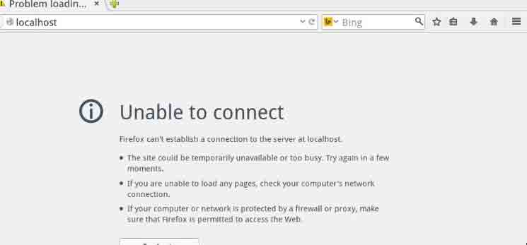
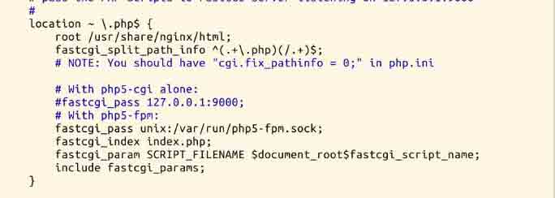
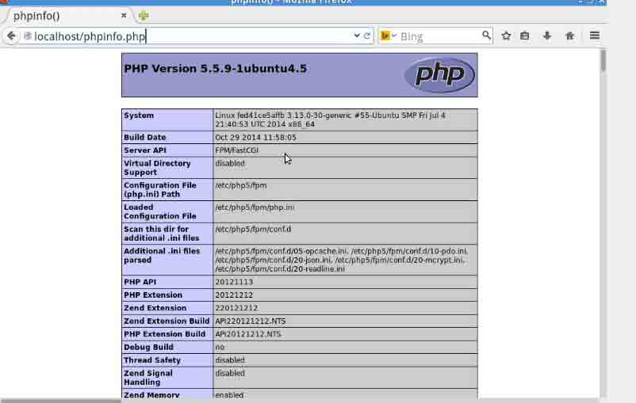
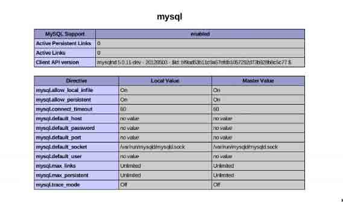
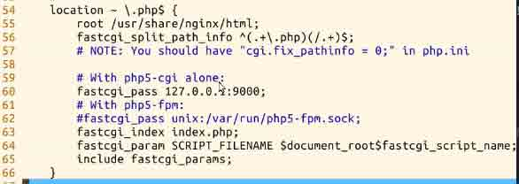

# 第 2 节 LNMP 系统安装

## 一、什么是 LNMP

首先这里要简单介绍下 LAMP 和 LNMP。这两个都是在网站服务器架构中的系统环境。 上节中我们简单介绍过： >**LAMP**指的是：Linux+Apache+MySQL+Perl/PHP/Python
**LNMP**指的是：Linux+Nginx+MySQL+PHP

我们可以从表面看出，这两个框架大致的区别就在于 Apache 和 Nginx 上面（其实，远远不止这些）。我们在上节已经分析了 Nginx 与 Apache 的各种优缺点,这里就不再多加赘述。

**这就是 LNMP 的组成**：


## 二、LNMP 系统安装(L-N-M-P)

**前期准备（环境要求，库依赖）** 如果你的物理机上用 apt-get 安装了老版的 nginx，或者你的 nginx 有问题，可以使用 apt-get purge nginx 命令删除已安装的 nginx

针对后面的 nginx 源码编译安装（`如果选择 apt-get 的方式则不需要`），我们在这里会有简单的库依赖列表.需要读者参照解决。 >**ssl**功能需要[openss](http://www.openssl.org/source/)库

>**gzip**模块需要[zlib](http://zlib.net/)库

>**rewrite**模块需要 pcre 库

这些库可以点击后在相应官网进行下载、解压、编译、安装。（下载最新的最好）

### **1.L(linux 安装)**

在 LNMP 中的作用或角色： Linux 是一类 Unix 计算机操作系统的统称，是目前最流行的免费操作系统。代表版本有：debian、centos、ubuntu、fedora、gentoo 等。LNMP 中以它作为平台。我们实验楼的环境本身就是 ubuntu，可直接进行下一步操作。如果想拥有自己的 ubuntu 实验环境，赶紧动手实现吧,这里粘一个[ubuntu kylin 官网链接](http://www.ubuntu.org.cn/index_kylin)

### **2.N(Nginx 安装)**

在 LNMP 中的作用或角色：Nginx 是一个高性能的 HTTP 和反向代理服务器，也是一个 IMAP/POP3/SMTP 代理服务器。

#### **安装方式**

决定因素：主要针对不同人群、不同需求，对于一般新手而言 apt-get 就够了;如果你乐于折腾，需要定制，那就源码安装吧(这里只会简单叙述)。强烈建议 apt-get 直接安装

#### （1）**直接 apt-get 安装**

```
sudo apt-get install nginx 
```


这里要是安装失败的，很可能就是源的问题了。现在的软件源比较完整，基本都包含了 nginx，如果源列表实在没有， 进入系统设置-软件更新切换另一个源就好了，ubuntu 官方源（国内速度较慢）、souhu 源、163 都有（都试过，最后记得 update 一下列表，不然不会生效）。ubuntu 因为安全策略，一般是禁用了 root 用户，所以每次执行命令时一般需要加上 sudo 去操作。操作过程中，小编建议在安装过程中使用 sudo 而不是直接切换到 root 用户，这样虽然表面繁琐，但是安全。

#### **（2）源码安装**

这个方法比较繁琐这里简单阐述下，因为 ubuntu 默认的策略是什么库都不安装，经过上面的库依赖解决，可以从中了解到 nginx 依赖的库有哪些，并且可以定制安装组建或者不安装组建，开机启动或开机不启动等等。 切到 /usr/local/src 到[nginx 源](http://nginx.org/download/)下载最新 解压编译安装就好

#### **完成安装后的测试**

所有的配置文件都在`/etc/init.d/nginx`这个目录下，所以相关操作都可以在这个文件夹启动命令

```
sudo /etc/init.d/nginx start 
```

或者

```
 sudo service nginx start 
```

启动完毕后，打开浏览器，访问 http://localhost **一定要刷新以确认**


**停止命令:**

```
sudo /etc/init.d/nginx stop 
```

或者

```
 sudo service nginx stop 
```

停止过后，再打开浏览器，访问 http://localhost **同样需要刷新确认**



**重启命令:**

```
sudo /etc/init.d/nginx restart 
```

或者

```
sudo service nginx restart 
```

#### **nginx 安装后的初级配置**

在后面的章节中，关于 nginx 的配置有较详细的讲解及实战。这里只是基础的配置

```
sudo vim /etc/nginx/sites-available/default 
```

PHP 重要配置 location ~ .php$ {} ，所以要让 php 与 nginx 一起工作，就得在这个配置文件中放出这个模块。

**如图修改（54 行开始）**



紧接着测试配置文件


测试成功以后记得重载配置文件

```
sudo service nginx reload 
```

使配置文件生效


**关于测试的话要等下面的 php 一同配置好后一起测试**

如果对 nginx default 配置还不是很清楚的或者有兴趣的读者可以参考[示例 1](http://wiki.nginx.org/NginxFullExample)、[示例 2](http://wiki.nginx.org/NginxFullExample2)

### **3.M(Mysql 安装)**

在 LNMP 中的**作用或角色**：Mysql 是一个小型关系型数据库管理系统 mysql 的安装分为服务端与客户端 服务端安装

```
sudo apt-get install mysql-server mysql-client 
```

然后你会看见输入密码的界面，你只需接下来输入管理员密码就行。由于实验楼环境中已经装有 Mysql。安装部分就省略掉。需要使用`sudo service mysql start`启动 mysql，mysql 用户为`root`，密码为空。

**修改 mysql 的配置文件**

```
sudo vim /etc/mysql/my.cnf 
```

将 bind-address = 127.0.0.1 注释掉，就可以远程连接数据库了


### **4.P(php5 安装)**

在 LNMP 中的作用或角色：nginx 本身不能处理 PHP，它只是个 web 服务器，当接收到请求后，如果是 php 请求，则发给 php 解释器处理，并把结果返回给客户端.php-fpm 是一个守护进程（FastCGI 进程管理器）用于替换 PHP FastCGI 的大部分附加功能，对于高负载网站是非常有用的。

```
sudo apt-get install php5-fpm 
```

**安装好以后连同上面的 nginx 一同测试** 现在创建一个探针文件保存在 /usr/share/nginx/html 目录下(**这个目录就是刚刚 nginx 配置文件中 root 目录**)，以便测试。

```
sudo vim /usr/share/nginx/html/phpinfo.php 
```


接下来使用命令启动 php5-fpm 服务：

```
sudo service php5-fpm start 
```

然后访问 http://localhost/phpinfo.php （**记得刷新**）

接下来你就会看见：



### **5.回头再修改各个模块配置文件，达到能互相支持的目的**

**首先：** （1）.**要想让 php5 支持 Mysql**，还需要安装一系列的配套模块。 在刚才打开的网页中，这是没有装模块的界面,搜索可以看出，里面没有任何 mysql 的启动信息


你需要安装 php5-mysql 模块

```
sudo apt-get install php5-mysql 
```

安装好以后 紧接着你需要需要重启 php

```
sudo service php5-fpm restart 
```

这是装好以后的表现



**(2).如果你想让 php 使用 tcp 链接**

那就只需要将刚才的 nginx 的 default（所在目录/etc/nginx/sites-available/）配置中的**端口**改回来，然后再将 php 的配置文件 www.cof（所在目录//etc/php5/fpm/pool.d/）端口也改为与 nginx 的 default 端口中相同就行。
（如图修改）

**这是 nginx 的 default**



**这是 php5 的 www.conf**


修改以后记得使用下面命令**测试**配置文件，**必须要 ok 才能重载生效哦**

```
sudo service nginx start
sudo service php5-fpm start 
```

命令重载配置文件使之生效

```
sudo service nginx reload
sudo service php5-fpm reload 
```

接下来重启 nginx 和 php 就好了

```
sudo service nginx restart
sudo service php5-fpm restart 
```

好了以后直接刷新刚才的页面 http://localhost/phpinfo.php （**记得刷新**）就完成了

## 小结：

到这里 LNMP 的总体基本框架也就搭建好了，相信你已经对整个框架已经有所了解，边看边动手会学的更多哦。

## 练习：

自己动手在实验楼环境中配置 LNMP 系统。