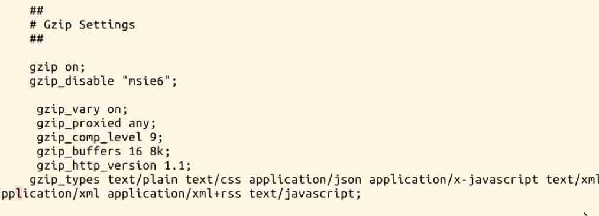

# 第 5 节 nginx 的优化

## 1.优化 nginx 的必要性

初步学习 nginx 有必然要了解下如何进一步压榨 nginx 的性能。要是你要搭建自己的服务器，那么你肯定会想方设法地优化 nginx（就算你的服务器目前压力不是很大），既然这样，那我们就必须进一步了解 nginx。在接下来的介绍中，会解释通过调整 nginx 中的哪些设置可以得到更好的性能，来应对大量客户端请求。不过这只是对一些可以通过调整来改进性能的设置的简单概述。

## 2.nginx 可以从哪里优化

对于 nginx 本身，我们在前面提到过，最重要的也就是它的配置文件了，在这个配置文件中，可以配置 nginx 的各种属性，而对于和其它模块的协作方面的优化，这里暂时不讲。既然我们需要对 nginx 进行优化，那么首先想到的肯定就是这个配置文件，这个文件名为 **nginx.conf**，它保存有 nginx 不同模块的全部设置。在实验楼环境中，安装好 nginx 以后，可以在 **/etc/nginx** 目录找到 nginx.conf。这一节，我们主要介绍通过 nginx.conf 这个配置文件给 nginx 带来的优化。


接下来，先探讨一下一些全局的设置，然后看看配置里的每个模块，并讨论一下哪个设置能在大量的客户端连接时，带来更好的性能，以及为什么它们可以提升性能。最后我们会有一个列表，列出全部的优化项，供查阅。

## 3.具体模块配置

如果你还记得，我们上一节实验有一幅配置文件的结构图。对这个配置文件，心中应该有个总体的框架，不记得也没关系，我们直接看配置文件就好。当我们打开 nginx 的配置文件，可以看出它分为四大模块。顶层模块就是最前面、暴露在最外面的。下面依次是 events 模块、http 模块，mail 模块（被注释掉了）。这就是 nginx 总体的配置文件结构，不算多吧。

### （1）顶层配置


*   1、3 行的 user 和 pid 这两项对我们的目的完全没有影响，所以我们没必要修改这部分。

*   第 2 行的**worker_processes**（这里的原始值是 4），可以通过这样一个命令来查看：


定义了 nginx 在为你的网站提供服务时，worker 进程（上一章进程里面提到过）的数量。据参考，这个优化值受到包括 CPU 内核数、存储数据的磁盘数、负载值在内的许多因素的影响。如果不确定的话，将其设置为可用的 CPU 内核的数量是一个不错的选择（设置为“auto”，将会尝试自动检测可用的值）。

### （2）events 模块

这个模块包括了 nginx 中处理链接的全部设置：


*   **worker*connections*** 设置了一个 worker 进程可以同时打开的链接数。 这个值原本受 events 里面的 workerrlimit_nofile 参数所限制，但是现在这里没有这一项参数，那么调整的幅度就不要太大。虽然没有既定值，但是你只要知道这个值的含义，往后如果有需求，完全可以回头调整。

*   **multi_accept** 的作用是告诉 nginx 在收到新链接的请求通知时，尽可能接受链接。当然，得让他开着。

### （3）http 模块

像前一章讲的，当外部有 http 请求时， nginx 的 http 模块才是处理这个请求的核心。我们只要简单的了解一下就能优化不少参数。

这就是 http 模块的配置：


在 http 的配置文件中我们可以看到 每一个小模块 都是被独立标注出来的，很好区分，这里我们就尽量一个一个查看：

>1、Basic Settings

*   [sendfile](http://www.techrepublic.com/article/use-sendfile-to-optimize-data-transfer/) 指向 sendfile()函数。sendfile() 在磁盘和 TCP 端口（或者任意两个文件描述符）之间复制数据。—— **在 sendfile 出现之前，为了传输这样的数据，需要在用户空间上分配一块数据缓存，使用 read() 从源文件读取数据到缓存，然后使用 write() 将缓存写入到网络。**
    sendfile() 直接从磁盘上读取数据到操作系统缓冲。由于这个操作是在内核中完成的，sendfile() 比 read() 和 write() 联合使用要更加有效率。 不要在意这些细节，说了这么多，只是想说，开着就好。

*   tcp_nopush 配置 nginx 在一个包中发送全部的头文件，而不是一个一个发送。

*   tcp_nodelay 配置 nginx 不要缓存数据，应该快速的发送小数据——这仅仅应该用于频繁发送小的碎片信息而无需立刻获取响应的、需要实时传递数据的应用中。

*   keepalive_timeout 指定了与客户端的 keep-alive 链接的超时时间。服务器会在这个时间后关闭链接。我们可以降低这个值，以避免让 worker 过长时间的忙碌。


>2、logging setings

*   access_log 确定了 nginx 是否保存访问日志。将这个设置为关闭可以降低磁盘 IO 而提升速度。

*   error_log 设置 nginx 应当记录临界错误。


>3、Gzip settings

*   gzip 设置 nginx gzip 压缩发送的数据。这会减少需要发送的数据的数量。

*   gzip_disable 为指定的客户端禁用 gzip 功能。

*   gzip_proxied 允许或禁止基于请求、响应的压缩。设置为 any，就可以 gzip 所有的请求。

*   gzip*comp*level 设置了数据压缩的等级。等级可以是 1-9 的任意一个值，9 表示最慢但是最高比例的压缩。

*   gzip_types 设置进行 gzip 的类型。有下面这些，不过还可以添加更多。



*   最后就是邮件模块，这里就不加讨论了。 就像上一章所讲， 修改好配置文件以后，务必记得使用：

```
sudo service nginx reload 
```

来使配置文件生效。

## 2.完整配置展示

```
user www-data;
worker_processes 8;
pid /run/nginx.pid;

events {
    worker_connections 1024;
     multi_accept on;
}

http {

    ##
    # Basic Settings
    ##

    sendfile on;
    tcp_nopush on;
    tcp_nodelay on;
    keepalive_timeout 15;
    types_hash_max_size 2048;
    # server_tokens off;

    # server_names_hash_bucket_size 64;
    # server_name_in_redirect off;

    include /etc/nginx/mime.types;
    default_type application/octet-stream;

    ##
    # Logging Settings
    ##

    access_log off;
    error_log /var/log/nginx/error.log;

    ##
    # Gzip Settings
    ##

    gzip on;
    gzip_disable "msie6";

     gzip_vary on;
     gzip_proxied any;
     gzip_comp_level 9;
     gzip_buffers 16 8k;
     gzip_http_version 1.1;
     gzip_types text/plain text/css application/json application/x-javascript text/xml application/xml application/xml+rss text/javascript;

    ##
    # nginx-naxsi config
    ##
    # Uncomment it if you installed nginx-naxsi
    ##

    #include /etc/nginx/naxsi_core.rules;

    ##
    # nginx-passenger config
    ##
    # Uncomment it if you installed nginx-passenger
    ##

    #passenger_root /usr;
    #passenger_ruby /usr/bin/ruby;

    ##
    # Virtual Host Configs
    ##

    include /etc/nginx/conf.d/*.conf;
    include /etc/nginx/sites-enabled/*;
}

# mail {
#   # See sample authentication script at:
#   # http://wiki.nginx.org/ImapAuthenticateWithApachePhpScript
# 
#   # auth_http localhost/auth.php;
#   # pop3_capabilities "TOP" "USER";
#   # imap_capabilities "IMAP4rev1" "UIDPLUS";
# 
#   server {
#       listen     localhost:110;
#       protocol   pop3;
#       proxy      on;
#   }
# 
#   server {
#       listen     localhost:143;
#       protocol   imap;
#       proxy      on;
#   }
#} 
```