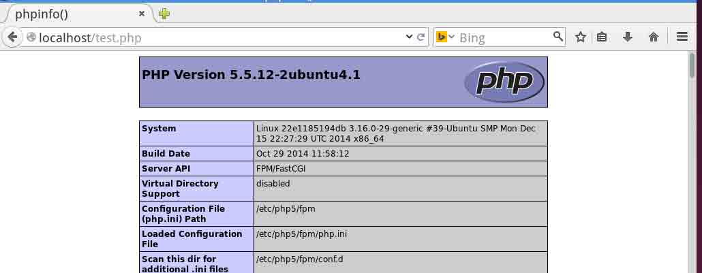
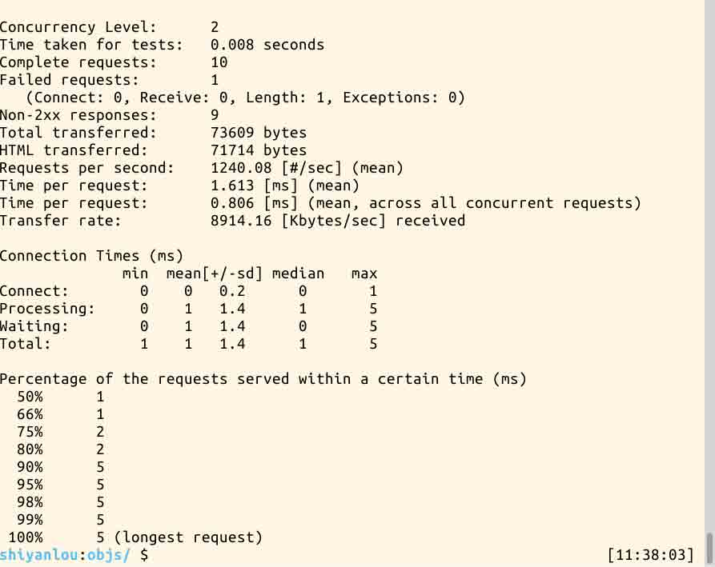

# 第 7 节 nginx 配置实战：访问控制及 DDOS 预防

## **1.访问控制配置**

基于各种原因，我们要进行访问控制。比如说，一般网站的后台都不能让外部访问，所以要添加 IP 限制，通常只允许公司的 IP 访问。访问控制就是指只有符合条件的 IP 才能访问到这个网站的某个区域。

涉及模块：ngx_http_access_module

模块概述：允许限制某些 IP 地址的客户端访问。

对应指令：

*   **allow**

语法: allow address | CIDR | unix: | all;

默认值: —

作用域: http, server, location, limit_except

允许某个 IP 或者某个 IP 段访问。如果指定 unix，那将允许 socket 的访问。注意：unix 在 1.5.1 中新加入的功能，如果你的版本比这个低，请不要使用这个方法。

*   **deny**

语法: deny address | CIDR | unix: | all;

默认值: —

作用域: http, server, location, limit_except

禁止某个 IP 或者一个 IP 段访问。如果指定 unix，那将禁止 socket 的访问。注意：unix 在 1.5.1 中新加入的功能，如果你的版本比这个低，请不要使用这个方法。

配置范例：

```
location / {
    deny  192.168.1.1;
    allow 192.168.1.0/24;
    allow 10.1.1.0/16;
    allow 2001:0db8::/32;
    deny  all;
} 
```

规则按照顺序依次检测，直到匹配到第一条规则。 在这个例子里，IPv4 的网络中只有 10.1.1.0/16 和 192.168.1.0/24 允许访问，但 192.168.1.1 除外；对于 IPv6 的网络，只有 2001:0db8::/32 允许访问。

ngx_http_access_module 配置允许的地址能访问，禁止的地址被拒绝。这只是很简单的访问控制，而在规则很多的情况下，使用 ngx_http_geo_module 模块变量更合适。这个模块大家下来可以了解 : [ngx*http*geo_module](http://nginx.org/en/docs/http/ngx_http_geo_module.html)

## **2.DDOS 预防配置**

DDOS 的特点是分布式，针对带宽和服务攻击，也就是四层流量攻击和七层应用攻击，相应的防御瓶颈四层在带宽，七层的多在架构的吞吐量。对于七层的应用攻击，我们还是可以做一些配置来防御的，使用 nginx 的 http_limit_conn 和 http_limit_req 模块通过限制连接数和请求数能相对有效的防御。

ngx*http*limit*conn*module 可以限制单个 IP 的连接数

ngx*http*limit*req*module 可以限制单个 IP 每秒请求数

**配置方法：**

(1). 限制每秒请求数

涉及模块：ngx*http*limit*req*module

通过漏桶原理来限制单位时间内的请求数，一旦单位时间内请求数超过限制，就会返回 503 错误。

配置范例：

```
http {
    limit_req_zone $binary_remote_addr zone=one:10m rate=10r/s;
    ...
    server {
        ...
        location  ~ \.php$ {
            limit_req zone=one burst=5 nodelay;  
               }
           }
     } 
```

必要配置说明（上一部分解释过的就不再解释）：

$binary*remote*addr 二进制远程地址

rate=10r/s; 限制频率为每秒 10 个请求

burst=5 允许超过频率限制的请求数不多于 5 个，假设 1、2、3、4 秒请求为每秒 9 个，那么第 5 秒内请求 15 个是允许的；反之，如果第一秒内请求 15 个，会将 5 个请求放到第二秒，第二秒内超过 10 的请求直接 503，类似多秒内平均速率限制。

nodelay 超过的请求不被延迟处理，设置后 5（不延时）+10（延时）个请求在 1 秒内处理。（这只是理论数据，最多的情况）

(2).限制 IP 连接数

上一章讲过，我们就直接写出来

```
http {
    limit_conn_zone $binary_remote_addr zone=addr:10m; //上面讲过
    ...
    server {
        ...
        location /操作目录/ {
            limit_conn addr 1;   
                }
           }
     } 
```

(3).白名单设置

http_limit_conn 和 http_limit_req 模块限制了单 IP 单位时间内的连接和请求数，但是如果 Nginx 前面有 lvs 或者 haproxy 之类的负载均衡或者反向代理，nginx 获取的都是来自负载均衡的连接或请求，这时不应该限制负载均衡的连接和请求，就需要 geo 和 map 模块设置白名单：

```
geo $whiteiplist  {
        default 1;
        10.11.15.161 0;
    }
map $whiteiplist  $limit {
        1 $binary_remote_addr;
        0 "";
    }
limit_req_zone $limit zone=one:10m rate=10r/s;
limit_conn_zone $limit zone=addr:10m; 
```

geo 模块定义了一个默认值是 1 的变量 whiteiplist，当在 ip 在白名单中，变量 whiteiplist 的值为 0，反之为 1

*   下面是设置的逻辑关系解释：

如果在白名单中--> whiteiplist=0 --> $limit="" --> 不会存储到 10m 的会话状态（one 或者 addr）中 --> 不受限制；

反之，不在白名单中 --> whiteiplist=1 --> $limit=二进制远程地址 -->存储进 10m 的会话状态中 --> 受到限制。

## **3.动手测试 DDOS 预防配置**

下面我们就来测一下刚刚的配置是否起到了作用。

1.安装所有测试所需的软件（源码安装 nginx，apt 安装 php5-fpm，apt 安装 apach-u） 为了便于修改配置文件，这里选择源码安装 nginx：

```
wget http://labfile.oss.aliyuncs.com/nginx-1.7.9.tar.gz 
```

接下来编译安装。

```
sudo apt-get install apache2-utils 
```

```
sudo apt-get install php5-fpm 
```

安装好以后 分别启动 php5 和 nginx。

2.写一个测试的 php 文件，修改 nginx 配置文件，使其能正常访问。

在/home/shiyanlou 目录下写一个 test.php,内容如下：


nginx 配置文件修改：


最后展示：



3.使用命令 ab 测试，修改配置文件前后（连接数和请求数分开测试）。

什么都没修改之前：

测试条件：


测试结果：



修改了配置文件图（记得重启 nginx）测试条件也要一样：


最后测试结果图：


## 小结

在这一章中我们讲述了要想实现访问控制和 DDOS 的防御，我们就要学会两个相应模块的配置及指令的使用，这些都是现成写好的模块与指令，我们之需要了解什么需求对应该的什么模块，运用哪些指令就好。

## 练习

依照实验步骤实现访问限制配置