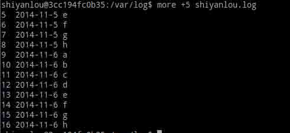
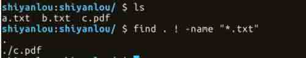
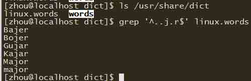
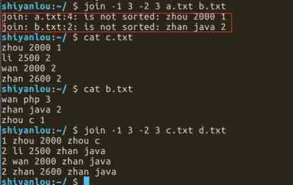
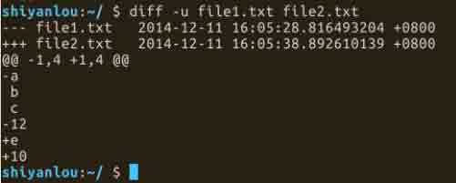

# Linux 命令实例练习

来自实验楼资深用户 jayki，根据实验楼每天一个 Linux 命令系列文章制作，适合学过 Linux 基础入门课程后的用户练习各种 Linux 命令。

## 课程说明

本课程部分内容参考博文[每天一个 Linux 命令](http://www.cnblogs.com/peida/archive/2012/12/05/2803591.html)，感谢作者[peida](http://www.cnblogs.com/peida)提供的优质教程。

## ls 命令

ls 命令是 linux 下最常用的命令，ls 命令就是 list 的缩写。 ls 用来打印出当前目录的清单。如果 ls 指定其他目录，那么就会显示指定目录里的文件及文件夹清单。 通过 ls 命令不仅可以查看 linux 文件夹包含的文件，而且可以查看文件权限(包括目录、文件夹、文件权限)查看目录信息等等。

### 命令格式：

>ls [选项] [目录名]

### 常用参数：

```
参数|描述
:---------------|:---------------
-a      | –all 列出目录下的所有文件，包括以 . 开头的隐含文件
-l       |除了文件名之外，还将文件的权限、所有者、文件大小等信息详细列出来
-d      |–directory 将目录象文件一样显示，而不是显示其下的文件
-h       |–human-readable 以容易理解的格式列出文件大小 (例如 1K 234M 2G)
-t      |以文件修改时间排序
```

### 常用范例：

**例一：**列出/home 文件夹下的所有文件和目录的详细资料，可以使用如下命令：

```
ls -a -l /home 
ls -al /home 
```

上面两个命令执行结果一样，结果如下： 

注意上面红色方框，d 表示目录（directory），-表示文件，文件和目录显示的颜色也不同。

**例二：**列出当前目录中所有以”d”开头的文件目录的详细内容，可以使用如下命令：

```
ls -l d* 
```


**例三**：以容易理解的格式列出/home 目录中所有的文件目录的大小，可以使用如下命令：

```
ls  -alh  /home 
```


### 思考题

1.以容易理解的格式列出/home 目录中所有以”d”开头的文件目录的大小。 2.列出/home 目录中所有以”s”开头的目录。

## cd 命令

cd 命令可以说是 Linux 中最基本的命令语句，其他的命令语句要进行操作，都是建立在使用 cd 命令上的。cd 命令是 change directory 的缩写,切换当前目录至指定的目录。

### 命令格式：

>cd [目录名]

### 常用范例：

**例一：**从当前目录进入系统根目录，可以使用如下命令：

```
cd  / 
```


**例二：**从当前目录进入父目录，可以使用如下命令：

```
cd .. 
```

..表示父目录


**例三：**从当前目录进入当前用户主目录，可以使用如下命令：

```
cd ~ 
```

~ 表示当前用户主目录，注意与系统根目录不是同一个概念 

**例四：**从当前目录进入上次所在目录，可以使用如下命令:

```
cd - 
```

*   表示上次进入的目录


## pwd 命令

Linux 中用 pwd 命令来查看“当前工作目录”的完整路径。 简单得说，每当你在终端进行操作时，你都会有一个当前工作目录。 在不太确定当前位置时，就会使用 pwd 来判定当前目录在文件系统内的确切位置。 pwd 命令是 print working directory 的缩写。

### 命令格式：

>pwd [选项]

### 常用参数：

```
参数|描述
:---------------|:---------------
-P  |显示实际物理路径，而非使用连接（link）路径
-L  |当目录为连接路径时，显示连接路径
```

### 常用范例：

**例一：**显示当前目录所在路径，可以使用如下命令：

```
pwd 
```

**例二：**显示当前目录的物理路径，可以使用如下命令：

```
pwd -P 
```

**例三：**显示当前目录的连接路径，可以使用如下命令：

```
pwd -L 
```


### 思考题


## mkdir 命令

mkdir 命令用来创建指定名称的目录，要求创建目录的用户在当前目录中具有写权限，并且指定的目录名不能是当前目录中已有的目录。 mkdir 命令是 make directory 的缩写。

### 命令格式：

>mkdir [选项] 目录

### 常用参数：

```
参数|描述
:---------------|:---------------
-m   --mode=模式 |设定权限<模式> 
-p   --parents  |可以是一个路径名称。若路径中的某些目录尚不存在,加上此选项后,系统将自动建立好那些尚不存在的目录,即一次可以建立多个目录
-v   --verbose  |每次创建新目录都显示信息
```

### 常用范例：

**例一：**递归创建多个目录 ，可以使用如下命令：

```
mkdir  -p  zhou/test 
```

**例二：**创建权限为 777 的目录，可以使用如下命令：

```
mkdir  -m 777  zhou 
```


**例三：**创建目录显示信息，可以使用如下命令：

```
mkdir  -vp  zhou/test 
```


### 思考题

尝试一下下面的命令，看看有什么神奇的事发生 tree 需要单独安装

```
sudo apt-get update
sudo apt-get install tree 
```

```
mkdir -vp shiyanlou/{lib/,bin/,doc/{info,product}}
tree shiyanlou/ 
```

## rm 命令

rm 是常用的命令，该命令的功能为删除一个目录中的一个或多个文件或目录，它也可以将某个目录及其下的所有文件及子目录均删除。对于链接文件，只是删除了链接，原有文件均保持不变。

rm 是一个危险的命令，使用的时候要特别当心，尤其对于新手，否则整个系统就会毁在这个命令（比如在/（根目录）下执行 rm * -rf）。所以，我们在执行 rm 之前最好先确认一下在哪个目录，到底要删除什么东西，操作时保持高度清醒的头脑。

rm 命令是 remove 的缩写。

### 命令格式：

>rm [选项] 文件或目录

### 常用参数：

```
参数|描述
:---------------|:---------------
 -f  --force        |  忽略不存在的文件，从不给出提示
 -i  --interactive  | 进行交互式删除
 -r  --recursive      |指示 rm 将参数中列出的全部目录和子目录均递归地删除
 -v  --verbose        |详细显示进行的步骤
```

### 常用范例：

**例一：**删除文件，系统会先询问是否删除，可以使用如下命令：

```
rm  shiyanlou.log 
```


**例二：**强行删除文件，系统不再提示，可以使用如下命令：

```
rm  -f  shiyanlou.log 
```


**例三：**删除后缀名为.log 的所有，删除前逐一询问，可以使用如下命令：

```
rm   *.log   或   rm -i *.log 
```


## 思考题

1.思考一下下面命令有什么作用。

```
myrm(){ D=/tmp/$(date +%Y%m%d%H%M%S); mkdir -p $D; mv "$@" $D &amp;&amp; echo "moved to $D ok"; } 
```

## mv 命令

mv 命令功能是用来移动文件或更改文件名，是 Linux 系统下常用的命令，经常用来备份文件或者目录。 mv 命令根据第二个参数类型（是目标文件还是目标目录），决定执行将文件重命名或将其移至一个新的目录中。当第二个参数类型是文件时，mv 命令完成文件重命名，此时，源文件只能有一个（也可以是源目录名），它将所给的源文件或目录重命名为给定的目标文件名。当第二个参数是已存在的目录名称时，源文件或目录参数可以有多个，mv 命令将各参数指定的源文件均移至目标目录中。 mv 命令是 move 的缩写。

### 命令格式：

>mv [选项] 源文件或目录 目标文件或目录

### 常用参数：

```
参数|描述
:---------------|:---------------
-b  --back         | 若需覆盖文件，则覆盖前先行备份 
-f  --force          | 如果目标文件已经存在，不会询问而直接覆盖
-i --interactive     | 若目标文件已经存在时，就会询问是否覆盖
-u --update      | 若目标文件已经存在，且源文件比较新，才会更新
-t  --target     | 该选项适用于移动多个源文件到一个目录的情况，此时目标目录在前，源文件在后
```

### 常用范例：

**例一：**将文件 shiyanlou.log 重命名为 zhou.log，可以使用如下命令：

```
mv   shiyanlou.log   zhou.log 
```


**例二：**将文件 zhou.log 移动到 test 目录下(test 目录必须已经存在，否则执行重命名)，可以使用如下命令：

```
mv  zhou.log  test 
```


**例三：**将文件 a.txt 移动到 test1 目录下，如果文件存在，覆盖前会询问是否覆盖，可以使用如下命令：

```
mv  -i  a.txt  test1 
```

## cp 命令

cp 命令用来复制文件或者目录，是 Linux 系统中最常用的命令之一。一般情况下，shell 会设置一个别名，在命令行下复制文件时，如果目标文件已经存在，就会询问是否覆盖，不管你是否使用-i 参数。但是如果是在 shell 脚本中执行 cp 时，没有-i 参数时不会询问是否覆盖。这说明命令行和 shell 脚本的执行方式有些不同。 cp 命令是 copy 的缩写。 **命令格式：** >cp [选项] 源文件 目录 >cp [选项] -t 目录 源文件 **常用参数：**

```
参数|描述
:---------------|:---------------
-t   --target-directory   |    指定目标目录
-i   --interactive           | 覆盖前询问(使前面的 -n 选项失效)
-n   --no-clobber        | 不要覆盖已存在的文件(使前面的 -i 选项失效)
-s   --symbolic-link          |对源文件建立符号链接，而非复制文件
-f   --force                  |强行复制文件或目录， 不论目的文件或目录是否已经存在
-u   --update                 |使用这项参数之后，只会在源文件的修改时间较目的文件更新时，或是对应的目的文件并不存在，才复制文件
```

**常用范例：** **例一：**对文件 shiyanlou.log 建立一个符号链接 zhou.log，可以使用如下命令：

```
cp   -s   shiyanlou.log   zhou.log 
```

**例二：**将 test1 目录下的所有文件复制到 test2 目录下，覆盖前询问，可以使用如下命令：

```
cp  -i  test1/*  test2 
```


**例三：**将 test1 目录下的最近更新的文件复制到 test2 目录下，覆盖前询问，可以使用如下命令：

```
cp  -iu  test1/*  test2 
```


## cat 命令

cat 命令的功能是将文件或标准输入组合输出到标准输出。这个命令常用来显示文件内容，或者将几个文件连接起来显示，或者从标准输入读取内容并显示，它常与重定向符号配合使用。 cat 命令是 concatenate 的缩写。

### 命令格式：

>cat [选项] [文件]

### 常用参数：

```
参数|描述
:---------------|:---------------
-A  --show-all       |    等价于 -vET
-b  --number-nonblank   | 对非空输出行编号
-e                     |  等价于 -vE
-E  --show-ends        |  在每行结束处显示 $
-n  --number            | 对输出的所有行编号,由 1 开始对所有输出的行数编号
-s  --squeeze-blank   |   有连续两行以上的空白行，就代换为一行的空白行 
-t                      | 与 -vT 等价
-T  --show-tabs         | 将跳格字符显示为 ^I
-u                      | (被忽略)
-v  --show-nonprinting  | 使用 ^ 和 M- 引用，除了 LFD 和 TAB 之外
```

### 常用范例：

**例一：**把 shiyanlou.log 的文件内容加上行号后输入 zhou.log 这个文件里，可以使用如下命令：

```
cat -n shiyanlou.log > zhou.log 
```


**例二：**把 shiyanlou.log 的文件内容加上行号后输入 zhou.log 这个文件里，多行空行换成一行输出，可以使用如下命令：

```
cat -ns shiyanlou.log > zhou.log 
```


**例三：**将 zhou.log 的文件内容反向显示，可以使用如下命令：

```
tac  zhou.log 
```


说明：tac 是将 cat 反写过来，所以它的功能就跟 cat 相反，cat 是由第一行到最后一行连续显示在屏幕上，而 tac 则是由最后一行到第一行反向在屏幕上显示出来。

### 思考题

1.执行下面命令会输出什么。 

## nl 命令

nl 命令在 linux 系统中用来计算文件中行号。nl 可以将输出的文件内容自动的加上行号。其默认的结果与 cat -n 有点不太一样， nl 可以将行号做比较多的显示设计，包括位数与是否自动补齐 0 等等的功能。
nl 命令是 number of lines 的缩写。

### 命令格式：

>nl [选项] [文件]

### 常用参数：

```
参数|描述
:---------------|:---------------
-b  |    指定行号指定的方式，主要有两种：
-b a  |表示不论是否为空行，也同样列出行号(类似 cat -n)
-b t  |如果有空行，空的那一行不要列出行号(默认值)
-n     | 列出行号表示的方法，主要有三种：
-n ln  | 行号在屏幕的最左方显示
-n rn   |行号在自己栏位的最右方显示，且不加 0 
-n rz   |行号在自己栏位的最右方显示，且加 0 
-w      |行号栏位的占用的位数
```

### 常用范例：

例一：把 shiyanlou.log 的文件内容加上行号后显示，空行不加行号，可以使用如下命令：

```
nl -b t shiyanlou.log 
```


例二：把 shiyanlou.log 的文件内容加上行号后显示，行号分别在屏幕最左方、最右方不加 0 和最右方加 0 显示，可以使用如下命令：

```
nl -n ln shiyanlou.log
nl -n rn shiyanlou.log
nl -n rz shiyanlou.log 
```


**例三：**把 shiyanlou.log 的文件内容加上行号后显示，行号在屏幕最右方加 0 显示，行号栏目占位数为 3，可以使用如下命令：

```
nl -n rz -w 3 shiyanlou.log 
```


### 思考题


## more 命令

more 命令，功能类似 cat ，cat 命令是将整个文件的内容从上到下显示在屏幕上。 more 命令会一页一页的显示，方便使用者逐页阅读，而最基本的指令就是按空白键（space）往下一页显示，按 b 键就会往回（back）一页显示，而且还有搜寻字串的功能 。more 命令从前向后读取文件，因此在启动时就加载整个文件。

### 命令格式：

>more [选项] 文件

### 常用参数：

```
参数|描述
:---------------|:---------------
+n  |      从笫 n 行开始显示
-n       | 定义屏幕大小为 n 行
+/pattern |  在每个档案显示前搜寻该字串（pattern），然后从该字串前两行之后开始显示 

-c       | 从顶部清屏，然后显示
-d       | 提示“Press space to continue，’q’ to quit”，禁用响铃功能
-p      |  通过清除窗口而不是滚屏来对文件进行换页，与-c 选项相似
-s     |   把连续的多个空行显示为一行
-u       | 把文件内容中的下画线去掉
```

### 常用操作：

```
符号|描述
:---------------|:---------------
=     |输出当前行的行号
q     |退出 more 
空格键| 向下滚动一屏
b    |返回上一屏
```

### 常用范例：

下面示例中用到的 shiyanlou.log 文件内容如下：

**例一：**从第五行开始显示 shiyanlou.log 文件中的内容，可以使用如下命令：

```
more +5 shiyanlou.log 
```



**例二：**从 shiyanlou.log 文件中查找第一个出现"g"字符串的行，并从该处前两行开始显示输出，可以使用如下命令：

```
more +/g shiyanlou.log 
```


**例三：**设定每屏行数为 5，可以使用如下命令：

```
more -5 shiyanlou.log 
```


**例四：**使用 ll 和 more 命令显示/etc 目录信息，可以使用如下命令：

```
ll /etc | more -10 
```


每页显示 10 个文件信息，按 Ctrl+F 或者 空格键 将会显示下 10 条文件信息。

## less 命令

less 工具也是对文件或其它输出进行分页显示的工具，应该说是 linux 正统查看文件内容的工具，功能极其强大。

### 命令格式：

>less [选项] 文件

### 常用参数：

```
参数|描述
:---------------|:---------------
-e       | 当文件显示结束后，自动离开
-f       | 强迫打开特殊文件，例如外围设备代号、目录和二进制文件
-i       | 忽略搜索时的大小写
-m       | 显示类似 more 命令的百分比
-N        |显示每行的行号
-s        |显示连续空行为一行
```

### 常用操作：

```
符号|描述
:---------------|:---------------
/字符串    |  向下搜索“字符串”的功能
?字符串     | 向上搜索“字符串”的功能
n      | 重复前一个搜索（与 / 或 ? 有关）
N      | 反向重复前一个搜索（与 / 或 ? 有关）
b        | 向前翻一页
d         |向后翻半页
q        | 退出 less 命令
空格键      | 向后翻一页
向上键    | 向上翻动一行
向下键    | 向下翻动一行
```

### 常用范例：

**例一：**显示 shiyanlou.log 文件中的内容，并显示行号，可以使用如下命令：

```
less -N shiyanlou.log 
```


**例二：**显示 shiyanlou.log 文件中的内容，搜索字符串”shiyanlou”，可以使用如下命令：

```
less  shiyanlou.log
/shiyanlou 
```


**例三：**ps 查看进程信息并通过 less 分页显示 ，可以使用如下命令：

```
ps -f | less 
```


### less 与 cat 和 more 的区别：

cat 命令功能用于显示整个文件的内容，单独使用没有翻页功能。因此经常和 more 命令搭配使用，cat 命令还有就是可以将数个文件合并成一个文件的功能。 more 命令功能：让画面在显示满一页时暂停，此时可按空格健继续显示下一个画面，或按 q 键停止显示。

less 命令功能：less 命令的用法与 more 命令类似，也可以用来浏览超过一页的文件。所不同的是 less 命令除了可以按空格键向下显示文件外，还可以利用上下键来卷动文件。当要结束浏览时，只要在 less 命令的提示符“：”下按 q 键即可。 其实这三个命令除了 cat 命令有合并文件的功能，其余功能上相近，只是从浏览习惯和显示方式上有所不同。

## head 命令

head 命令就像它的名字一样浅显易懂，主要是用来显示档案的开头至标准输出中，默认 head 命令打印其相应文件的开头 10 行。

### 命令格式：

>head [选项] [文件]

### 常用参数：

```
参数|描述
:---------------|:---------------
-q  |      隐藏文件名
-v       | 显示文件名
-c<字节>    |显示字节数
-n<行数>   | 显示的行数
```

### 常用范例：

**例一：**显示 shiyanlou.log 文件中的前 5 行内容，可以使用如下命令： head -n 5 shiyanlou.log 

**例二：**显示 shiyanlou.log 和 zhou.log 文件中的前 5 行内容，可以使用如下命令： head -n 5 shiyanlou.log zhou.log 

**例三：**显示 shiyanlou.log 文件中除了最后 5 行的内容，可以使用如下命令： head -n -5 shiyanlou.log 

## tail 命令

tail 命令主要用于显示指定文件末尾内容。常用查看日志文件。

### 命令格式：

>tail [选项] [文件]

### 常用参数：

```
参数|描述
:---------------|:---------------
-f      |循环读取
-q     | 不显示处理信息
-v      |显示详细的处理信息
-c<字节>  |显示的字节数
-n<行数>  |显示行数
```

### 常用范例：

**例一：**显示 shiyanlou.log 文件中的最后 5 行内容，可以使用如下命令：

```
tail -n 5 shiyanlou.log 
```


**例二：**显示 shiyanlou.log 文件中的最后 5 行内容，当 shiyanlou.log 文件有新内容增加，自动更新显示。可以使用如下命令：

```
tail -n 5 -f shiyanlou.log 
```


ping www.shiyanlou.com >> shiyanlou.log 这条命令作用是，ping 远程主机，并将信息追加到 shyanlou.log 文件中。& 的作用是将这条命令放在后台执行，这样 shiyanlou.log 文件就会一直有内容增加。说明一下，linux 下执行 ping 命令会一直执行，必须手动停止才行。而 windows 下执行 ping 命令时，发送一定请求后会自动停止。 

使用 tail 命令的-f 选项可以即时输出文件变化后追加的内容，tail -f filename 会把 filename 里最尾部的内容显示在屏幕上，并且不但刷新，使你看到最新的文件内容。 另外顺便说一下怎么查看后台正在运行的任务，及怎么停止任务。 jobs 命令可以查看正在后台运行的任务。kill 命令可以杀死一个任务，但要使用任务的 id。任务的 id 可以通过 ps 命令查看获得。具体操作如下图（不熟悉这些命令没关系，后续都会讲到）： 

## which 命令

which 命令的作用是，在 PATH 变量指定的路径中搜索可执行文件的所在位置。它一般用来确认系统中是否安装了指定的软件。

### 命令格式：

>which 可执行文件名称

### 常用范例：

**例一：**确认是否安装了 gcc，可以使用如下命令：

```
which gcc 
```


**例二：**查看 cd 命令的位置路径，可以使用如下命令：

```
which cd 
```


从上面的显示信息可以看到在实验楼的系统中 cd 是一个 shell 函数。

再来在我本地 linux 系统上执行 which cd 命令，显示的结果如下：


显示在 PATH 变量指定的路径下没有 cd 命令。为什么显示没有呢？这是因为 cd 是 shell 内建命令，而 which 默认是找 PATH 内所指定的目录，内建命令不在其指定的目录中，所以当然一定找不到。

那么就有个问题，为什么实验楼环境中 cd 是一个 shell 函数，而其他 linux 环境中 cd 是内建命令呢？这跟所使用的 bash 有关。


echo $SHELL 命令查看当前使用的 shell。

### 补充知识

到底什么是命令？

命令可以是下面四种形式之一：

1.  是一个可执行程序，就像我们所看到的位于目录/usr/bin 中的文件一样。 属于这一类的程序，可以编译成二进制文件，诸如用 C 和 C++语言写成的程序, 也可以是由脚本语言写成的程序，比如说 shell，perl，python，ruby，等等。

2.  是一个内建于 shell 自身的命令。bash 支持若干命令，内部叫做 shell 内部命令 (builtins)。例如，上面我本地环境中的 cd 命令，就是一个 shell 内部命令。

3.  是一个 shell 函数。这些是小规模的 shell 脚本，它们混合到环境变量中。 比如上面讲到的 cd 命令，在实验楼环境中就是一个 shell 函数。

4.  是一个命令别名。我们可以定义自己的命令，建立在其它命令之上。

## whereis 命令

whereis 命令主要用于定位可执行文件、源代码文件、帮助文件在文件系统中的位置。whereis 命令还具有搜索源代码、指定备用搜索路径和搜索不寻常项的能力。

whereis 命令查找速度非常快，这是因为它根本不是在磁盘中漫无目的乱找，而是在一个数据库中（/var/lib/mlocate/）查询。这个数据库是 Linux 系统自动创建的，包含有本地所有文件的信息，并且每天通过自动执行 updatedb 命令更新一次。也正是因为这个数据库要每天才更新一次，就会使得 whereis 命令的搜索结果有时候会不准确，比如刚添加的文件可能搜不到。

### 命令格式：

>whereis [选项] 文件

### 常用参数：

```
参数|描述
:---------------|:---------------
```

*   -b | 定位可执行文件
*   -m | 定位帮助文件
*   -s |定位源代码文件
*   -u 搜索默认路径下除可执行文件、源代码文件、帮助文件以外的其它文件
*   -B | 指定搜索可执行文件的路径
*   -M | 指定搜索帮助文件的路径
*   -S |指定搜索源代码文件的路径

### 常用范例：

**例一：**搜索 gcc 可执行文件的路径，可以使用如下命令：

```
whereis -b gcc 
```

**例二：**搜索 gcc 帮助文件的路径，可以使用如下命令：

```
whereis -m gcc 
```

**例三：**搜索 gcc 源代码的路径，可以使用如下命令：

```
whereis -s gcc 
```


## locate 命令

locate 命令跟 whereis 命令类似，且它们使用的是相同的数据库。但 whereis 命令只能搜索可执行文件、联机帮助文件盒源代码文件，如果要获得更全面的搜索结果，可以使用 locate 命令。

locate 命令使用了十分复杂的匹配语法，可以使用特殊字元（如’*’和’?’）来指定需要查找的样本。

### 命令格式：

>locate [选项] [搜索字符串]

### 常用参数：

```
参数|描述
:---------------|:---------------
-q    |安静模式，不会显示任何错误讯息
-n  |至多显示 n 个输出
-r  |使用正规表达式做寻找的条件
-V  |显示版本讯息
```

### 常用范例：

**例一：**搜索 etc 目录下所有以 sh 开头的文件，可以使用如下命令：

```
locate /etc/sh 
```


注意在实验楼环境中一开始执行这个命令会报错：locate 无法执行 `stat() ‘/var/lib/mlocate/mlocate.db’`：没有那个文件或目录。解决办法是执行`sudo updatedb`命令。

**例二：**搜索 etc 目录下文件名包含 lou 的文件，可以使用如下命令：

```
locate /etc/*lou* 
```


## find 命令（一）

find 命令主要作用是沿着文件层次结构向下遍历，匹配符合条件的文件，并执行相应的操作。Linux 下 find 命令提供了相当多的查找条件，功能很强大，对应的学习难度也比较大。

### 命令格式：

>find [选项] [搜索路径] [表达式]

默认路径是当前目录，默认表达式为-print。

表达式可能由下列成份组成：操作符、选项、测试表达式以及动作。

### 常用参数：

```
参数|描述
:---------------|:---------------
-print  |  find 命令将匹配的文件输出到标准输出
-exec     |find 命令对匹配的文件执行该参数所给出的 shell 命令
-name     |按照文件名查找文件
-type     |查找某一类型的文件
-prune     | 使用这一选项可以使 find 命令不在当前指定的目录中查找，如果同         时使用-depth 选项，那么-prune 将被 find 命令忽略
-user      | 按照文件属主来查找文件
-group     | 按照文件所属的组来查找文件
-mtime -n +n | 按照文件的更改时间来查找文件，-n 表示文件更改时间距现在小于 n 天，+n 表示文件更改时间距现在大于 n 天，find 命令还有-atime 和 -ctime 选项
```

其他命令命令选项及表达式可参见下图。


### 常用范例：

**例一：**打印当前目录下的文件目录列表 ，可以使用如下命令：

```
find  .  -print 
```


**例二：**打印当前目录下所有以.txt 结尾的文件名 ，可以使用如下命令（截图只显示部分）：

```
find  .  -name “*.txt” -print 
```

-iname 选项跟-name 选项作用一样，不同在于-iname 会忽略字母大小写。


**例三：**打印当前目录下所有以.txt 或.pdf 结尾的文件名 ，可以使用如下命令（截图只显示部分）：

```
find  .  \(-name “*.pdf” -or -name “*.txt”\) 
```


**例四：**打印当前目录下所有**不**以.txt 结尾的文件名 ，可以使用如下命令：

```
find  .  ! -name “*.txt” 
```



## find 命令（二）

下面将介绍如何根据文件类型、权限、所有者及操作符来查找匹配文件。

根据文件类型来查找文件，使用-type 选项，常见 find 文件类型见下表。


根据文件权限查找文件，使用-perm 选项。所有者使用-user 选项。

另外，find 命令可以通过逻辑操作符来创建更复杂的逻辑关系，例如 find 命令（一）中的例三就使用了操作符-or。find 命令的逻辑操作符见下表。


### 常用范例：

**例一：**打印当前目录下所有以.txt 结尾的符号链接 ，可以使用如下命令：

```
find  .  -type l -name “*.txt” -print 
```


**例二：**打印当前目录下所有权限为 777 的 php 文件（web 服务器上的 php 文件一般需要执行权限），可以使用如下命令：

```
find  .  -type f -name “*.php” -perm 777 
```


**例三：**打印当前目录下 root 用户拥有的所有文件，可以使用如下命令：

```
find  .  -type f -user root 
```


**例四：**打印当前目录下权限不是 777 和 664 的所有文件，可以使用如下命令：

```
find  .  -type f  \( ! -perm 777  -and  ! -perm 644 \) 
```


## find 命令（三）

下面将介绍如何使用 find 命令的-exec 选项来实现对查找到的文件执行指定的动作命令。

### 常用范例：

**例一：**找到当前目录下所有 php 文件，并显示其详细信息，可以使用如下命令：

```
find . -name “*.php” -exec ls -l {} \; 
```


-exec 是 find 命令对找到的文件执行的动作，这个动作就是对找到的文件执行命令，上面的命令就是 ls -l {}。在这里说明一下{}和\;，{}其实它就是一个占位符，在 find 命令的执行过程中会不断地替换成当前找到的文件，相当于”ls -l 找到的文件”。而\;是-exec 的命令结束标记，因为规定-exec 后面的命令必须以;结束，但;在 shell 中有特殊含义，必须要转义，所以写成\;。

**例二：**在实验楼环境中有很多自己编写的 c 语言代码文件，现在想要把所有 c 语言代码文件下载下来，如果一个一个的下载很麻烦，我们可以先查找到所有的 c 语言代码文件，然后将这些文件内容写入到一个文件中，下载该文件，可以使用如下命令：

```
find . -name “*.c” -exec cat {} \; > all.c 
```


**例三：**默认下，-exec 后面只能使用单个命令，如果想要多个命令，可以将多个命令写入脚本文件中，然后在-exec 中使用这个脚本，可以使用如下命令：

```
find . -name “*.c” -exec ./command.sh {} \; 
```

脚本内容： #！ /bin/bash ls -l $1 # $1 表示第一个参数 cat $1 

## xargs 命令

我们可以用管道将一个命令的 stdout（标准输出）重定向到另一个命令的 stdin（标准输入）。但有些命令只能以命令行参数的形式接收数据，而无法通过 stdin 接收数据流。在这种情况下，无法通过管道将数据重定向给这些命令。

这时 xargs 就可以发挥它的作用了，xargs 命令可以从标准输入接收输入，并把输入转换为一个特定的参数列表。

### 命令格式：

>command | xargs [选项] [command]

xargs 命令应该紧跟在管道操作符之后，因为它以标准输入作为主要的源数据流。

### 常用参数：

```
参数|描述
:---------------|:---------------
-n  |  指定每行最大的参数数量
-d  |  指定分隔符
```

### 常用范例：

**例一：**将多行输入转换为单行输出，可以使用如下命令：

```
cat a.txt | xargs 
```


**例二：**将单行输入转换为多行输出，可以使用如下命令：

```
echo “1 2 3 4 5 6 7” | xargs -n 3 
```


**例三：**将单行输入转换为多行输出，指定分隔符为 i，可以使用如下命令：

```
cat b.txt | xargs -d i -n 3 
```


**例四：**查找当前目录下所有 c 代码文件，统计总行数，可以使用如下命令：

```
find . -type f -name “*.c” | xargs wc -l 
```


## wc 命令

wc 命令是一个统计的工具，主要用来显示文件所包含的行、字和字节数。

wc 命令是 word count 的缩写。

### 命令格式：

>wc [选项] [文件]

### 常用参数：

```
参数|描述
:---------------|:---------------
-c |   统计字节数
-l    |统计行数
-m   | 统计字符数，这个标志不能与 -c 标志一起使用
-w    |统计字数，一个字被定义为由空白、跳格或换行字符分隔的字符串
-L    |打印最长行的长度
```

### 常用范例：

**例一：**统计文件的字节数、行数、字符数，可以使用如下命令：

```
wc -c c.txt
wc -l c.txt
wc -m c.txt 
```


注意每行结尾的换行符也算一个字符，空格也算一个字符。另外，由于系统采用 UTF-8 编码，所以一个汉字为 3 字节，9 个汉字加上一个换行，一共 28 个字节。

**例二：**统计文件的字节数、行数、字符数，只打印数字，不打印文件名，可以使用如下命令：

```
cat c.txt | wc -c 
cat c.txt | wc -l 
cat c.txt | wc -m 
```


**例三：**统计/bin 目录下的命令个数，可以使用如下命令：

```
ls /bin | wc -l 
```

## grep 命令

grep 是个很强大的命令，用来找到文件中的匹配文本，并且能够接受正则表达式和通配符，同时可以用多个 grep 命令选项来生成各种格式的输出。

grep 的工作方式是这样的，它在一个或多个文件中搜索字符串模板。如果模板包括空格，则必须被引用，模板后的所有字符串被看作文件名。搜索的结果被送到标准输出，不影响原文件内容。

grep 可用于 shell 脚本，因为 grep 通过返回一个状态值来说明搜索的状态，如果模板搜索成功，则返回 0，如果搜索不成功，则返回 1，如果搜索的文件不存在，则返回 2。我们利用这些返回值就可进行一些自动化的文本处理工作。

## 命令格式：

>grep [选项] pattern [file]

## 常用参数：

```
参数|描述
:---------------|:---------------
-c  |  计算找到 '搜寻字符串'(即 pattern) 的次数
-i   | 忽略大小写的不同，所以大小写视为相同
-n   | 输出行号
-v   | 反向选择，打印不匹配的行
-r     | 递归搜索
--color=auto | 将找到的关键词部分加上颜色显示
```

### 常用范例：

**例一：**将/etc/passwd 文件中出现 root 的行取出来，关键词部分加上颜色显示，可以使用如下命令：

```
grep “root” /etc/passwd --color=auto
cat /etc/passwd | grep “root” --color=auto 
```


**例二：**将/etc/passwd 文件中没有出现 root 和 nologin 的行取出来，可以使用如下命令：

```
grep -v “root” /etc/passwd | grep -v “nologin” 
```


**例三：**在当前目录下递归搜索文件中包含 main()的文件，经常用于查找某些函数位于哪些源代码文件中，可以使用如下命令：

```
grep -r “main()” . 
```


## 正则表达式与 grep 命令

正则表达式是一种符号表示法，被用来识别文本模式。在某种程度上，它们与匹配文件和路径名的 shell 通配符比较相似，但其规模更大。许多命令行工具和大多数的编程语言都支持正则表达式，以此来帮助解决文本操作问题。

正则表达式元字符由以下字符组成：

^ $ . [ ] { } - ? * + ( ) | \ 

### 常用范例：

**例一：**利用 Linux 系统自带的字典查找一个五个字母的单词，第三个字母为 j,最后一个字母为 r ，/usr/share/dict 目录下存放字典文件，可以使用如下命令：

```
grep ‘^..j.r$’ linux.words 
```



**例二：**验证固定电话，打印符合条件的电话，固定电话格式基本都是带有 0 的区号+连接符“-”＋电话号码，另外还有可能有分机号，区号有 3 位、4 位，电话号码有 7 位和 8 位的，可以使用如下命令：

```
grep “⁰[0-9]{2,3}-[0-9]{7,8}(-[0-9]{3,4})?$” telphone.txt 
```

区号：前面一个 0，后面跟 2-3 位数字 ： 0[0-9]{2,3}

电话号码：7-8 位数字： [0-9]{7,8}

分机号：一般都是 3-4 位数字： [0-9]{3,4} 

注意执行下面的命令时没有任何匹配输出，这是因为没有加-E 选项，那例一没加为什么可以呢，这是因为 grep 把.当成 shell 通配符，不是正则表达式的元字符。 

## cut 命令

cut 命令是一个将文本按列进行切分的小工具，它可以指定分隔每列的定界符。

如果一行数据包含多个字段（多列），现在想要提取其中的一列或多列，这是 cut 命令就可以大显身手了。

### 命令格式：

>cut [选项] [文件名]

### 常用参数：

```
参数|描述
:---------------|:---------------
-b   |     以字节为单位进行分割
-c        |以字符为单位进行分割
-d       | 自定义分隔符，默认为制表符
-f   | 自定义字段
--complement | 抽取整个文本行，除了那些由 -c 或 -f 选项指定的文本
```

### 常用范例：

**例一：**取出 student.txt 文件中的第一列和第三列，可以使用如下命令：

```
cut -f 1,3 -d ‘ ’ student.txt 
```


**例二：**取出 student.txt 文件中的第一列，可以使用如下命令：

```
cut -f 1 -d ‘ ’ student.txt 
```

**例三：**取出 student.txt 文件中的前三列，可以使用如下命令：

```
cut -f 1-3 -d ‘ ’ student.txt 
```


**例四：**取出 student.txt 文件中除第一列的其他列，可以使用如下命令：

```
cut -f 1 -d ‘ ’ student.txt --complement 
```


**例五：**给任意一字符串 str，取出其最后一个字符，可以使用如下命令：

```
num=$(echo -n $str | wc -c)
echo -n $str | cut -b $num 
或者
echo -n $str | cut -b `echo -n $str | wc -c` 
```


## paste 命令

paste 命令的功能正好与 cut 相反。它会添加一个或多个文本列到文件中，而不是从文件中抽取文本列。它通过读取多个文件，然后把每个文件中的字段整合成单个文本流，输入到标准输出。

### 命令格式：

>paste [选项] [文件名]

### 常用参数：

```
参数|描述
:---------------|:---------------
-s |       将每个文件合并成行而不是按行粘贴
-d  |      自定义分隔符，默认为制表符
```

### 常用范例：

**例一：**将 student.txt 和 telphone.txt 文件中的内容按列拼接，可以使用如下命令：

```
paste student.txt telphone.txt 
```


**例二：**将 student.txt 和 telphone.txt 文件中的内容按列拼接，指定分隔符为’：’，可以使用如下命令：

```
paste student.txt telphone.txt -d ‘:’ 
```


**例三：**将 student.txt 和 telphone.txt 文件中的内容各自拼接成一行，可以使用如下命令：

```
paste -s student.txt telphone.txt 
```


## tr 命令

tr 命令常被用来更改字符。我们可以把它看作是一种基于字符的查找和替换操作。换字是一种把字符从一个字母转换为另一个字母的过程。tr 从标准输入中替换、缩减和/或删除字符，并将结果写到标准输出。

tr 只能通过 stdin（标准输入），而无法通过命令行参数来接受输入。

tr 是 translate（转换）的缩写。

### 命令格式：

>tr [选项] SET1 SET2

将来自 stdin 的输入字符从 SET1 映射到 SET2，并将其输出写入 stdout（标准输出）。SET1 和 SET2 是字符类或字符集。如果两个字符集的长度不相等，那么 SET2 会不断重复其最后一个字符，直到长度与 SET1 相同。如果 SET2 的长度大于 SET1，那么在 SET2 中超出 SET1 的那部分字符则全部被忽略。

### 常用参数：

```
参数|描述
:---------------|:---------------
-d |   删除匹配 SET1 的内容，并不作替换
```

### 常用范例：

**例一：**将输入的字符大写转换为小写，可以使用如下命令：

```
echo ‘THIS IS SHIYANLOU!’ | tr ‘A-Z’ ‘a-z’ 
```

**例二：**将输入的字符中的数字删除，可以使用如下命令：

```
echo ‘THIS 123 IS S1HIY5ANLOU!’ | tr -d ‘0-9’ 
```

**例三：**tr 命令的一个有趣的用法是执行 ROT13 文本编码。ROT13 是一款微不足道的基于一种简易的替换暗码的加密类型。把 ROT13 称为“加密”是大方的，“文本模糊处理”更准确些。有时候它被用来隐藏文本中潜在的攻击内容。这个方法就是简单地把每个字符在字母表中向前移动 13 位。因为移动的位数是可能的 26 个字符的一半，所以对文本再次执行这个算法，就恢复到了它最初的形式。可以使用如下命令：

```
#加密
echo ‘shiyanlou’ |  tr  ‘a-zA-Z’  ‘n-za-mN-ZA-M’ 
fuvlnaybh
#解密
echo ‘fuvlnaybh’ | tr  ‘a-zA-Z’  ‘n-za-mN-ZA-M’ 
shiyanlou 
```


## sort 命令

同文本文件打交道时，总避不开排序，那是因为对于文本处理任务而言，排序（sort）可以起到不小的作用。sort 命令能够帮助我们对文本文件和 stdin 进行排序操作。通常，它会结合其他命令来生成所需要的输出。

## 命令格式：

>sort [选项] [文件名]

### 常用参数：

```
参数|描述
:---------------|:---------------
-n  |      基于字符串的长度来排序,使用此选项允许根据数字值排序，而不是字母值
-k   |     指定排序关键字
-b   |     默认情况下，对整行进行排序，从每行的第一个字符开始。这个选项导致 sort            程序忽略每行开头的空格，从第一个非空白字符开始排序
-m    |    只合并多个输入文件
-r    |  按相反顺序排序,结果按照降序排列，而不是升序
-t      |  自定义分隔符，默认为制表符
```

### 常用范例：

**例一：**列出/usr/share/目录下使用空间最多的前 10 个目录文件，可以使用如下命令：

```
du -s /usr/share/* | sort -nr | head -10 
```

du -s /usr/share/* 命令显示/usr/share/目录下所有文件和目录的磁盘使用空间，目录包含目录下的子目录和文件


**例二：**ls 命令能显示目录下文件的详细信息，包含空间使用大小，但与 du 命令不同的是，ls 命令不计算目录下的子目录和文件的大小。ls 显示格式如下:

```
-rwxrwxrwx   1  root   root  542  11 月   29  test.php 
```

现在想要对 ls 命令输出信息中的空间使用大小字段进行排序，可以使用如下命令：

```
ls -l /usr/bin/ | sort -nr -k 5 | head -10 
```


**例三：**首先来看下下面的例子：  由于 11 由 1 开始，比 5 大，所以排在 5 的前面。这时排序可以通过自定义排序字段来排序。使用下面的命令就可以解决。

```
sort  -k 1,1  -k 2n data.txt 
```

第一个-k 选项指明只对第一个字段排序，1,1 意味着“始于并且结束于第一个字段”。 第二个-k 选项 2n 表示对第二个字段按数值排序。 还有一种格式，如-k 3.4，表示始于第三个字段的第四个字符，按数值排序。


-k 选项的语法格式如下：

[ FStart [ .CStart ] ] [ Modifier ] [ , [ FEnd [ .CEnd ] ][ Modifier ] ]

这个语法格式可以被其中的逗号（“，”）分为两大部分，Start 部分和 End 部分。

先给你灌输一个思想，那就是“如果不设定 End 部分，那么就认为 End 被设定为行尾”。这个概念很重要的，但往往你不会重视它。

Start 部分也由三部分组成，其中的 Modifier 部分就是类似 n 和 r 的选项部分。我们重点说说 Start 部分的 FStart 和 CStart。 FStart.CStart，其中 FStart 就是表示使用的域，而 CStart 则表示在 FStart 域中从第几个字符开始算“排序首字符”。CStart 是可以省略的，省略的话就表示从本域的开头部分开始。之前例子中的-k 5 就是省略了 CStart 的例子。

同理，在 End 部分中，你可以设定 FEnd.CEnd，如果你省略.CEnd，则表示结尾到“域尾”，即本域的最后一个字符。或者，如果你将 CEnd 设定为 0(零)，也是表示结尾到“域尾”。

## uniq 命令

uniq 命令经常和 sort 命令结合在一起使用。uniq 从标准输入或单个文件名参数接受数据有序列表，默认情况下，从数据列表中删除任何重复行。

uniq 只能用于排过序的数据输入，因此，uniq 要么使用管道，要么将排过序的文件作为输入，并总是以这种方式与 sort 命令结合起来使用。

uniq 命令是 unique 的缩写。

### 命令格式：

>uniq [选项] [文件名]

### 常用参数：

```
参数|描述
:---------------|:---------------
-c   |     在每行前加上表示相应行目出现次数的前缀编号
-d      |  只输出重复的行
-u     |   只显示唯一的行
-D    |    显示所有重复的行
-f     |   比较时跳过前 n 列
-i    |    在比较的时候不区分大小写
-s   |     比较时跳过前 n 个字符
-w |       对每行第 n 个字符以后的内容不作对照
```

### 常用范例：

**例一：**找出/bin 目录和/usr/bin 目录下所有相同的命令，可以使用如下命令：

```
ls /bin /usr/bin  | sort | uniq -d 
```


**例二：**现有文件内容如下，红色方框里的内容表示区号，现在要统计出各个区号的总人数。 

实现思路：首先按区号对每行信息排序，然后使用 uniq 命令对区号进行重复行统计。使用命令如下：

```
sort -k 4.1n,4.1n student.txt | uniq -c -f 3 -w 2 
```


sort -k 4.1n,4.1n 表示对第四个字段的第一个字符按数值排序。

uniq -c -f 3 -w 2 中-f 3 表示跳过前三列的比较，那么现在只剩下最后一列，-w 2 表示第 2 个字符后的内容不做比较，为什么是 2 呢，因为跳过前三列时并没有跳过最后一列前面的空格分隔符，区号前都还有一个空格。

## join 命令

join 命令类似于 paste，它会往文件中添加列，但是它使用了独特的方法来完成。一个 join 操作通常与关系型数据库有关联，在关系型数据库中来自多个享有共同关键域的表格的数据结合起来，得到一个期望的结果。这个 join 命令执行相同的操作，它把来自于多个基于共享关键域的文件的数据结合起来。

通俗地说，就是将两个文件中指定栏位相同的行连接起来，即按照两个文件中共同拥有的某一列，将对应的行拼接成一行。

### 命令格式：

>join [选项] 文件 1 文件 2

### 常用参数：

```
参数|描述
:---------------|:---------------
-j FIELD    |   等同于 -1 FIELD -2 FIELD,-j 指定一个域作为匹配字段
-1 FIELD  |以 file1 中 FIELD 字段进行匹配
-2 FIELD  |以 file2 中 FIELD 字段进行匹配
-t            |自定义分隔符，默认为制表符
```

### 常用范例：

例一：将两个文件中的第一个字段作为匹配字段，连接两个文件，可以使用如下命令：

```
join  a.txt  b.txt 
```


**例二：**指定两个文件的第三个字段为匹配字段，连接两个文件，可以使用如下命令：

```
join  -1 3 -2 3 c.txt d.txt 
```



从上面的结果可以看到，一开始对 a.txt 和 b.txt 文件内容执行 join 命令时报错，这是因为 join 命令跟 uniq 命令一样，只能用于排过序的数据。

## comm 命令

通常比较文本文件的内容很有帮助。对于系统管理员和软件开发者来说，这个尤为重要。一名系统管理员可能，例如，需要拿现有的配置文件与先前的版本做比较，来诊断一个系统错误。同样的，一名程序员经常需要查看程序的修改。

comm 命令将逐行比较已经排序的两个文件。显示结果包括 3 列：第 1 列为只在第一个文件中找到的行，第 2 列为只在第二个文件中找到的行，第 3 列为两个文件的共有行。

注意，comm 命令和 join、uniq 命令一样，只能用于已经排过序的数据。

### 命令格式：

>comm [选项] 文件 1 文件 2

### 常用参数：

```
参数|描述
:---------------|:---------------
-1 |    不输出文件 1 特有的行
-2   |  不输出文件 2 特有的行
-3  | 不输出两个文件共有的行
```

### 常用范例：

**例一：**比较 file1.txt 和 file2.txt 两个文件的内容，可以使用如下命令：

```
comm  file1.txt  file2.txt 
```


**例二：**比较 file1.txt 和 file2.txt 两个文件的内容，只显示两个文件共有的内容，可以使用如下命令：

```
comm  -12 file1.txt  file2.txt 
```


## diff 命令

类似 comm 命令，diff 命令被用来监测文件之间的差异。然而，diff 是一款更加复杂的工具，它支持许多输出格式，并且一次能处理许多文本文件。软件开发员经常使用 diff 程序来检查不同程序源码版本之间的更改，diff 能够递归地检查源码目录，经常称之为源码树。diff 程序的一个常见用例是创建 diff 文件或者补丁，它会被其它程序使用，例如 patch 程序（我们后面会讲到），来把文件从一个版本转换为另一个版本。

diff 在命令行中打印每一个行的改动，并且 diff 是 svn、cvs、git 等版本控制工具不可或缺的一部分。

diff 命令是 differential 的缩写。

### 命令格式：

>diff [选项] 文件

### 常用参数：

```
参数|描述
:---------------|:---------------
-c    |上下文模式，显示全部内文，并标出不同之处
-u   |     统一模式，以合并的方式来显示文件内容的不同
-a  |  只会逐行比较文本文件
-N|        在比较目录时，若文件 A 仅出现在某个目录中，预设会显示：Only in 目录。           若使用-N 参数，则 diff 会将文件 A 与一个空白的文件比较
-r |   递归比较目录下的文件
```

### 常用范例：

例一：显示 file1.txt 和 file2.txt 两个文件的差异，可以使用如下命令：

```
diff  file1.txt  file2.txt 
```


上面结果显示中的“1d0”表示 file1.txt 文件比 file2.txt 文件多了第一行，“4c3,4”表示 file1.txt 文件的第四行和 file2.txt 文件的第三、四行不同。

diff 的 normal 显示格式有三种提示:

*   a - add
*   c - change
*   d - delete

**例二：**从上面例一的显示结果可以知道，file1.txt 和 file2.txt 两个文件的差异不易直观看出，可以使用上下文模式显示，可以使用如下命令：

```
diff  -c file1.txt  file2.txt 
```


这个输出结果以两个文件名和它们的时间戳开头。第一个文件用星号做标记，第二个文件用短横线做标记。纵观列表的其它部分，这些标记将象征它们各自代表的文件。

`*** 1,4 *** 表示第一个文件中第一行到第四行的文本行。`

`--- 1,4 --- 表示第二个文件中第一行到第四行的文本行。`

三种特殊字符：

＋ 添加行，这一行将会出现在第二个文件内，而不是第一个文件内

－ 删除行，这一行将会出现在第一个文件中，而不是第二个文件内

！ 更改行，将会显示某个文本行的两个版本，每个版本会出现在更改组的各自部分

这些特殊字符很容易混淆，实际上记住一点就行：所有操作目的是将第一个文件变成第二个文件。

**例三：**查看 file1.txt 和 file2.txt 两个文件的差异，使用统一模式显示，可以使用如下命令：

```
diff  -u file1.txt  file2.txt 
```



上下文模式和统一模式之间最显著的差异就是重复上下文的消除，这就使得统一模式的输出结果要比上下文模式的输出结果简短。

@@ -1,4 +1,4 @@ 表示在在更改组中描述的第一个文件中的文本行和第二个文件中的文本行。

特殊字符：

*   ＋ 添加这一行到第一个文件中
*   － 在第一个文件中删除这一行

## patch 命令

patch 命令被用来把更改应用到文本文件中。它接受从 diff 程序的输出，并且通常被用来把较老的文件版本转变为较新的文件版本。让我们考虑一个著名的例子。Linux 内核是由一个大型的，组织松散的贡献者团队开发而成，这些贡献者会提交固定的少量更改到源码包中。这个 Linux 内核由几百万行代码组成，虽然每个贡献者每次所做的修改相当少。对于一个贡献者来说，每做一个修改就给每个开发者发送整个的内核源码树，这是没有任何意义的。相反，提交一个 diff 文件。一个 diff 文件包含先前的内核版本与带有贡献者修改的新版本之间的差异。然后一个接受者使用 patch 程序，把这些更改应用到他自己的源码树中。使用 diff/patch 组合提供了两个重大优点：

1.  一个 diff 文件非常小，与整个源码树的大小相比较而言。

2.  一个 diff 文件简洁地显示了所做的修改，从而允许程序补丁的审阅者能快速地评估它。

当然，diff/patch 能工作于任何文本文件，不仅仅是源码文件。它同样适用于配置文件或任意其它文本。

准备一个 diff 文件供 patch 命令使用，GNU 文档建议这样使用 diff 命令：

`diff -Naur old_file new_file > diff_file`

old file 和 new file 部分不是单个文件就是包含文件的目录。这个 r 选项支持递归目录树。

### 命令格式：

>diff [选项] 补丁文件

### 常用参数：

```
参数|描述
:---------------|:---------------
-p num | 忽略几层文件夹
-E  |      如果发现了空文件，那么就删除它
-R |   取消打过的补丁
```

### 常用范例：

**例一：**生成 file1.txt 和 file2.txt 的 diff 文件，然后应用 patch 命令更新 file1.txt 文件，可以使用如下命令：

```
diff  -Naur file1.txt  file2.txt > patchdiff.txt
patch < patchdiff.txt 
```


**例二：**取消上面例一打过的补丁，可以使用如下命令：

```
patch -R < patchdiff.txt 
```


## df 命令

linux 中 df 命令的功能是用来检查 linux 服务器的文件系统的磁盘空间占用情况。可以利用该命令来获取硬盘被占用了多少空间，目前还剩下多少空间等信息。

df 命令是 disk free 的缩写。

### 命令格式：

>df [选项] 文件

### 常用参数：

```
参数|描述
:---------------|:---------------
-a     |                   全部文件系统列表
-h    |                    方便阅读方式显示
-i    |                    显示 inode 信息
-T  |                      文件系统类型
-t<文件系统类型>     |   只显示选定文件系统的磁盘信息
-x<文件系统类型>   |     不显示选定文件系统的磁盘信息
```

### 常用范例：

**例一：**显示磁盘使用情况，可以使用如下命令：

```
df 
```


**例二：**以 inode 模式来显示磁盘使用情况，可以使用如下命令：

```
df  -i 
```


**例三：**列出文件系统的类型，可以使用如下命令：

```
df  -T 
```


**例四：**显示指定类型磁盘，可以使用如下命令：

```
df  -t ext4 
```


## du 命令

linux 中 du 命令也是查看使用空间的，但是与 df 命令不同的是 Linux du 命令是对文件和目录磁盘使用的空间的查看。

du 命令是 disk usage 的缩写。

### 命令格式：

>du [选项] 文件

### 常用参数：

```
参数|描述
:---------------|:---------------
-a |   显示目录中个别文件的大小。 

-b |       显示目录或文件大小时，以 byte 为单位。 

-c |       除了显示个别目录或文件的大小外，同时也显示所有目录或文件的总和。 
-k |       以 KB(1024bytes)为单位输出。
-m |       以 MB 为单位输出。 

-s |       仅显示总计，只列出最后加总的值。
-h |       以 K，M，G 为单位，提高信息的可读性
```

### 常用范例：

**例一：**显示指定文件所占空间，以方便阅读的格式显示，可以使用如下命令：

```
du  -h  file1.txt 
```


**例二：**显示指定目录所占空间，以方便阅读的格式显示，可以使用如下命令：

```
du  -h  Desktop 
```


**例三：**显示几个文件或目录各自占用磁盘空间的大小，并且统计总和，使用如下命令：

```
du  -h  Desktop 
```


**例四：**按照空间大小逆序排序显示，使用如下命令：

```
du  -h  | sort -nr | head -10 
```


## time 命令

time 命令常用于测量一个命令的运行时间，包括实际使用时间（real time）、用户态使用时间（the process spent in user mode）、内核态使用时间（the process spent in kernel mode）。

实际时间: 从 command 命令行开始执行到运行终止的时间。

用户态使用时间：命令执行完成花费的用户 CPU 时间，即命令在用户态中执行时间总和。

内核态使用时间：命令执行完成花费的系统 CPU 时间，即命令在核心态中执行时间总和。

### 命令格式：

>time 命令

### 常用范例：

**例一：**测量 date 命令运行的时间，可以使用如下命令：

```
time date 
```


从上面的结果可以到：实际运行时间为 0.05s，用户 cpu 时间为 0.001s，系统 cpu 时间为 0.001s。

其中，用户 CPU 时间和系统 CPU 时间之和为 CPU 时间，即命令占用 CPU 执行的时间总和。实际时间要大于 CPU 时间，因为 Linux 是多任务操作系统，往往在执行一条命令时，系统还要处理其它任务。

**例二：**将 time 命令的执行结果保存到文件中，可以使用如下命令：

```
{ time date; } 2>1.txt
(time date) 2>2.txt 
```


time 是 shell 的关键字，shell 做了特殊处理，它会把 time 命令后面的命令行作为一个整体来进行处理，在重定向时，实际上是针对后面的命令来的，time 命令本身的输出并不会被重定向的。比如，执行 time date 2>3.txt，3.txt 内容为空。另外，time 命令的输出信息是打印在标准错误输出上的。